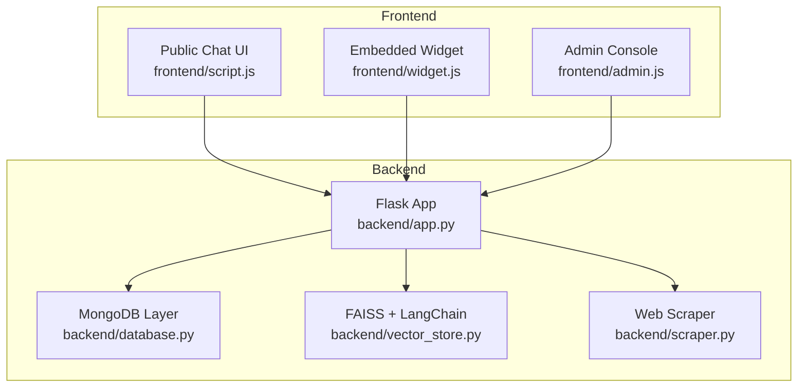
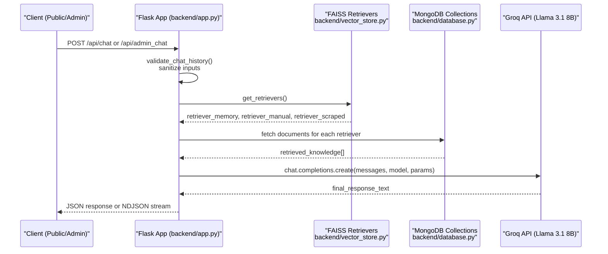
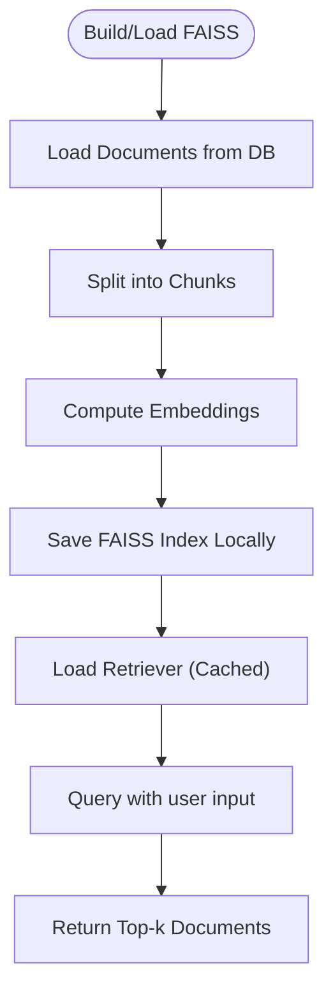
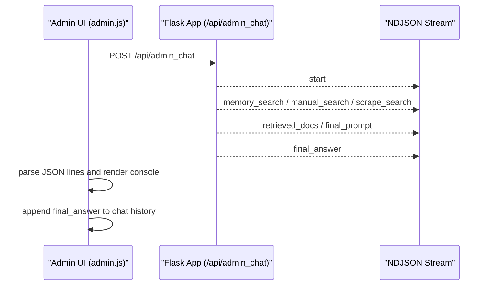
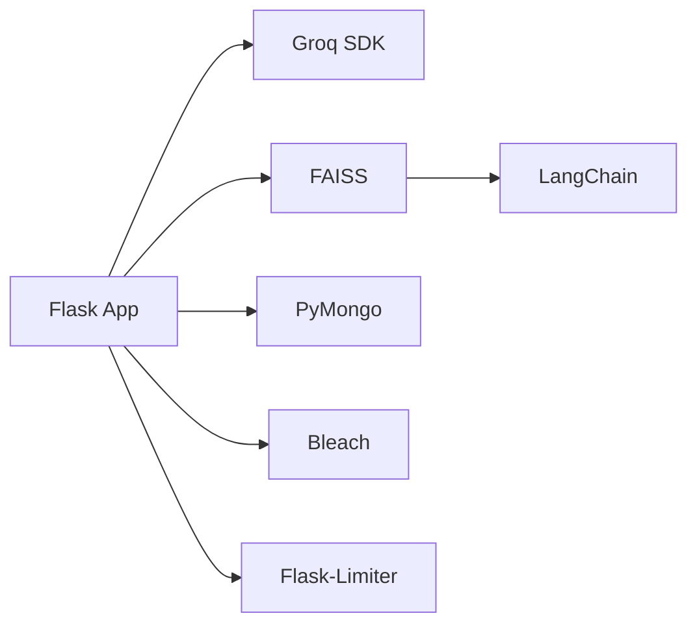

# AI Integration

<cite>
**Referenced Files in This Document**
- [backend/app.py](file://backend/app.py)
- [backend/database.py](file://backend/database.py)
- [backend/vector_store.py](file://backend/vector_store.py)
- [backend/scraper.py](file://backend/scraper.py)
- [frontend/script.js](file://frontend/script.js)
- [frontend/widget.js](file://frontend/widget.js)
- [frontend/admin.js](file://frontend/admin.js)
- [API_DOCUMENTATION.md](file://API_DOCUMENTATION.md)
- [requirements.txt](file://requirements.txt)
</cite>

## Table of Contents
1. [Introduction](#introduction)
2. [Project Structure](#project-structure)
3. [Core Components](#core-components)
4. [Architecture Overview](#architecture-overview)
5. [Detailed Component Analysis](#detailed-component-analysis)
6. [Dependency Analysis](#dependency-analysis)
7. [Performance Considerations](#performance-considerations)
8. [Troubleshooting Guide](#troubleshooting-guide)
9. [Conclusion](#conclusion)
10. [Appendices](#appendices)

## Introduction
This document explains the AI integration and conversational system built around Groq’s Llama 3.1 8B Instant model, LangChain-based document processing, FAISS vector search, and a real-time streaming chat experience. It covers:
- Groq API integration for model inference
- Conversation flow design and response formatting
- LangChain implementation for document processing, prompt engineering, and context management
- Multi-turn conversation handling, memory management, and session persistence
- Citation system, source attribution, and content verification
- AI model configuration, parameter tuning, and performance optimization
- Streaming response architecture using Server-Sent Events-like NDJSON streams
- Troubleshooting and best practices

## Project Structure
The system is organized into:
- Backend (Python Flask): AI orchestration, vector search, scraping, and admin APIs
- Frontend: Public chat UI, widget for embedding, and admin interface with streaming logs
- Vector store and database: FAISS indices and MongoDB collections

**Diagram sources**
- [backend/app.py](file://backend/app.py)
- [backend/database.py](file://backend/database.py)
- [backend/vector_store.py](file://backend/vector_store.py)
- [backend/scraper.py](file://backend/scraper.py)
- [frontend/script.js](file://frontend/script.js)
- [frontend/widget.js](file://frontend/widget.js)
- [frontend/admin.js](file://frontend/admin.js)

**Section sources**
- [backend/app.py](file://backend/app.py)
- [API_DOCUMENTATION.md](file://API_DOCUMENTATION.md)

## Core Components
- Groq client initialization and chat completion pipeline
- LangChain document processing and FAISS vector store
- Multi-source retrieval (Memory Bank, Manual Data, Scraped Data)
- Prompt engineering with grounding rules and citation format
- Real-time streaming via NDJSON for admin chat
- Frontend rendering, citation extraction, and action buttons

**Section sources**
- [backend/app.py](file://backend/app.py)
- [backend/vector_store.py](file://backend/vector_store.py)
- [backend/database.py](file://backend/database.py)
- [frontend/script.js](file://frontend/script.js)
- [frontend/widget.js](file://frontend/widget.js)
- [frontend/admin.js](file://frontend/admin.js)

## Architecture Overview
The AI chat pipeline integrates:
- Input validation and sanitization
- Retrieval from three FAISS indexes (Memory Bank, Manual Data, Scraped Data)
- Prompt construction with grounded instructions and citation rules
- Groq Llama 3.1 8B Instant inference
- Response formatting and citation rendering

**Diagram sources**
- [backend/app.py](file://backend/app.py)
- [backend/vector_store.py](file://backend/vector_store.py)
- [backend/database.py](file://backend/database.py)

## Detailed Component Analysis

### Groq API Integration and Model Configuration
- Client initialization uses the Groq SDK with an API key from environment variables.
- The chat completion uses a system prompt that enforces:
  - Grounded answers with explicit DATA PENDUKUNG usage
  - Citation tags [CITE: URL | Title] appended to facts
  - Markdown formatting and optional [IMAGE: url] insertion
- Model and parameters:
  - Model: llama-3.1-8b-instant
  - Temperature: 0.7
  - Max tokens: 2048
- The system truncates chat history to the last 20 turns and limits input lengths to prevent abuse.

**Section sources**
- [backend/app.py](file://backend/app.py)
- [requirements.txt](file://requirements.txt)

### LangChain Implementation and Vector Store
- FAISS indexes are built from three data sources:
  - Memory Bank: curated Q&A pairs
  - Manual Data: uploaded PDF/DOCX/PPTX/TXT
  - Scraped Data: website content extracted and indexed
- Embedding model: sentence-transformers/all-MiniLM-L6-v2
- Index creation and loading:
  - Documents are split into overlapping chunks
  - FAISS vectors are persisted locally
  - Retrievers are cached module-wide to avoid reloading on each request
- Retrieval parameters:
  - k=2 by default for balanced recall and speed

**Diagram sources**
- [backend/vector_store.py](file://backend/vector_store.py)
- [backend/database.py](file://backend/database.py)

**Section sources**
- [backend/vector_store.py](file://backend/vector_store.py)
- [backend/database.py](file://backend/database.py)

### Prompt Engineering and Context Management
- The system constructs a structured prompt that:
  - Defines identity and tone (direct, confident, human-like)
  - Requires grounding for factual questions
  - Enforces citation tags and optional image insertion
  - Uses Markdown formatting and concise answers
- Retrieved knowledge is concatenated into a DATA PENDUKUNG section with metadata:
  - Source type, title, source URL, optional image URL
- The final prompt includes:
  - The user’s request wrapped in <user_input> tags
  - The conversation history transformed into messages

**Section sources**
- [backend/app.py](file://backend/app.py)

### Multi-Turn Conversation Handling and Session Persistence
- Conversation history is validated and truncated to the last 20 entries.
- Each message is normalized to role=user/model and flattened text parts.
- Sessions:
  - Secret key configured for Flask sessions
  - Permanent sessions with 2-hour lifetime
  - CSRF protection enforced for state-changing admin endpoints
- Public chat:
  - Non-streaming JSON response
- Admin chat:
  - Streaming NDJSON with steps for progress and final answer

**Section sources**
- [backend/app.py](file://backend/app.py)
- [frontend/script.js](file://frontend/script.js)
- [frontend/admin.js](file://frontend/admin.js)

### Citation System, Source Attribution, and Content Verification
- Backend:
  - Citations are inserted as [CITE: URL | Title] tags in the model response
  - Images are inserted as [IMAGE: url] tags when present in the source metadata
- Frontend:
  - Public chat: extracts citations and renders clickable chips
  - Widget: removes citation tags for clean display
  - Admin console: displays raw NDJSON lines for transparency

**Section sources**
- [backend/app.py](file://backend/app.py)
- [frontend/script.js](file://frontend/script.js)
- [frontend/widget.js](file://frontend/widget.js)
- [frontend/admin.js](file://frontend/admin.js)

### Streaming Response Architecture (NDJSON)
- Admin chat endpoint streams NDJSON lines:
  - Steps: start, memory_search, memory_found, manual_search, manual_found, scrape_search, scrape_found, retrieved_docs, final_prompt, final_answer, error
  - Each line is a JSON object with step and data fields
- Frontend admin console:
  - Reads the stream, parses each line, and appends to a console
  - On final_answer, appends the model response to chat history
- Public chat does not stream; it returns a single JSON response.

**Diagram sources**
- [backend/app.py](file://backend/app.py)
- [frontend/admin.js](file://frontend/admin.js)

**Section sources**
- [backend/app.py](file://backend/app.py)
- [frontend/admin.js](file://frontend/admin.js)

### Real-Time Conversation Handling (Public and Widget)
- Public chat:
  - Submits query with last 20 history entries
  - Renders Markdown, images, and citations
  - Provides actions: speak, copy, regenerate
- Embedded widget:
  - Auto-detects server base URL from script src
  - Minimal UI with typing indicator and basic formatting
  - Sends the same payload structure as public chat

**Section sources**
- [frontend/script.js](file://frontend/script.js)
- [frontend/widget.js](file://frontend/widget.js)

### Data Management and Scraping
- Scraping:
  - Safe URL validation and SSRF protections
  - Content extraction with Trafilatura and HTML cleaning
  - Thumbnail selection prioritizing og:image and first in-content image
- Data ingestion:
  - Manual uploads support PDF, DOCX, PPTX, TXT
  - Indexed into FAISS for retrieval
- Database:
  - MongoDB collections for scraped_data, manual_data, memory_bank, bug_reports
  - Unique constraints and indexes for performance

**Section sources**
- [backend/scraper.py](file://backend/scraper.py)
- [backend/database.py](file://backend/database.py)

## Dependency Analysis
External libraries and integrations:
- Flask, rate limiting, sessions, sanitization
- LangChain ecosystem for document processing and embeddings
- FAISS for vector search
- Groq SDK for inference
- MongoDB via PyMongo

**Diagram sources**
- [requirements.txt](file://requirements.txt)
- [backend/app.py](file://backend/app.py)

**Section sources**
- [requirements.txt](file://requirements.txt)

## Performance Considerations
- Retrieval caching:
  - Module-level cache for FAISS retrievers avoids repeated disk reads
  - Invalidate cache after reindexing or deletion
- Chunking and overlap:
  - RecursiveCharacterTextSplitter with 1000 char size and 100 char overlap balances recall and latency
- Embedding model:
  - all-MiniLM-L6-v2 is lightweight and fast for CPU environments
- Streaming:
  - NDJSON enables early feedback and reduces perceived latency
- Rate limiting:
  - Prevents abuse and protects downstream resources
- Input limits:
  - Caps on query length, content length, and chat history reduce resource usage

[No sources needed since this section provides general guidance]

## Troubleshooting Guide
Common issues and resolutions:
- Missing environment variables:
  - SECRET_KEY and GROQ_API_KEY must be set; otherwise, startup or chat will fail
- FAISS index errors:
  - Rebuild indices via admin endpoints or auto-reindex on startup
  - Delete FAISS indexes if corrupted and reindex
- MongoDB connectivity:
  - Ensure MONGO_URI is configured; database initialization prints connection info
- Streaming failures:
  - Verify admin chat endpoint returns NDJSON; check browser console for parse errors
- Citation rendering:
  - Ensure [CITE: ...] tags are present in the model response; frontend expects these tags for chips
- SSRF and safety:
  - Scraping validates domains and skips private IPs; adjust allowed domains if needed

**Section sources**
- [backend/app.py](file://backend/app.py)
- [backend/database.py](file://backend/database.py)
- [backend/vector_store.py](file://backend/vector_store.py)
- [backend/scraper.py](file://backend/scraper.py)
- [frontend/admin.js](file://frontend/admin.js)

## Conclusion
The system combines robust document processing with LangChain, efficient vector search via FAISS, and a grounded, citation-aware prompt pipeline powered by Groq’s Llama 3.1 8B Instant. It supports both non-streaming public chat and streaming admin chat, with strong safeguards for security, performance, and content verifiability.

[No sources needed since this section summarizes without analyzing specific files]

## Appendices

### API Reference Highlights
- Public chat: POST /api/chat with query and history
- Admin chat: POST /api/admin_chat with streaming NDJSON
- Admin endpoints: login, CSRF token, data CRUD, scraping, reindex, delete FAISS, delete DB
- File upload limits and input validation limits are enforced server-side

**Section sources**
- [API_DOCUMENTATION.md](file://API_DOCUMENTATION.md)