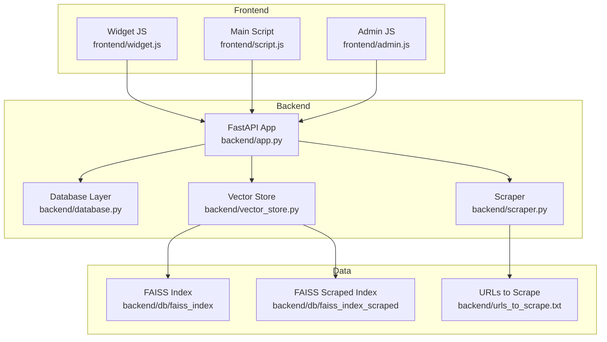
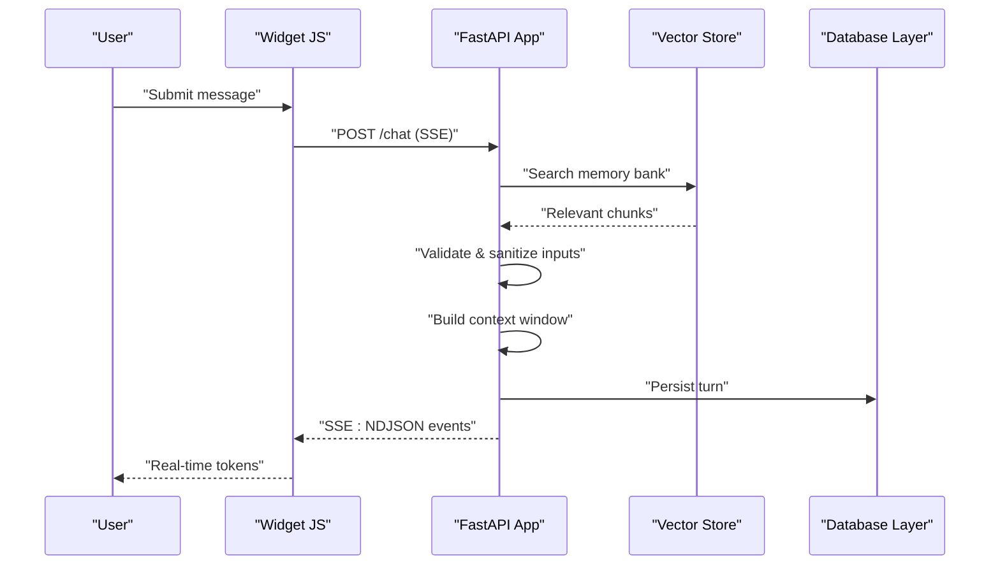
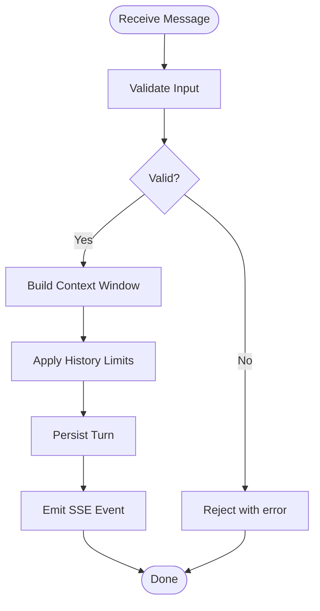
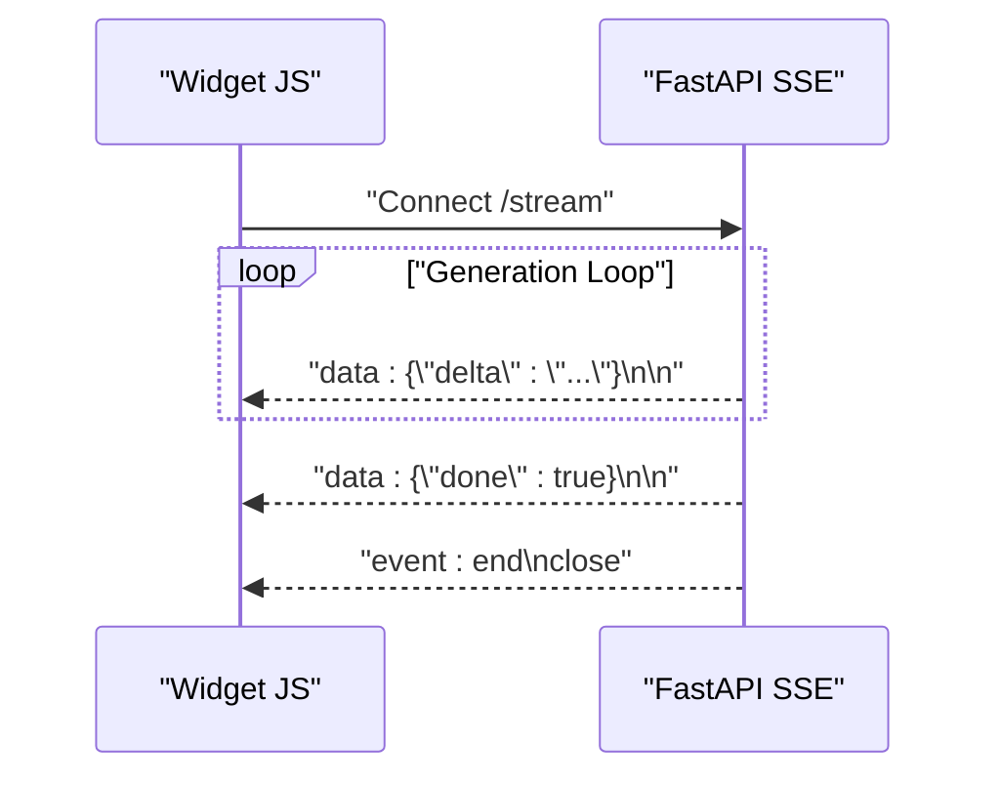
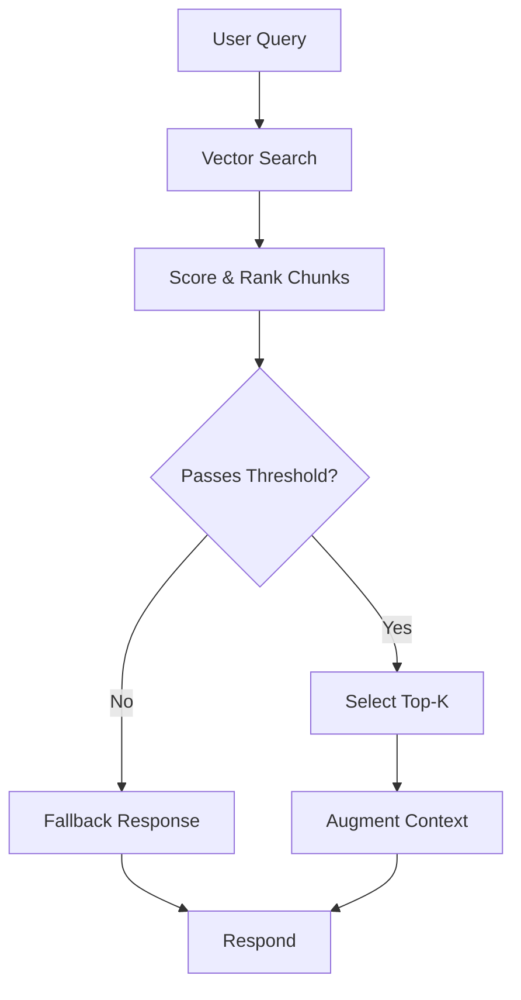
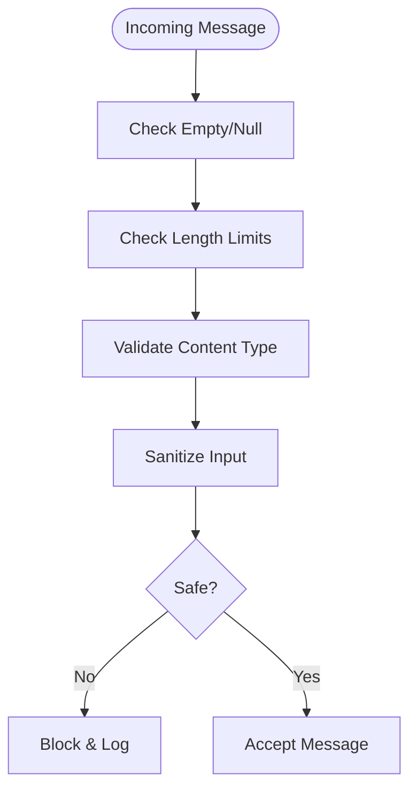
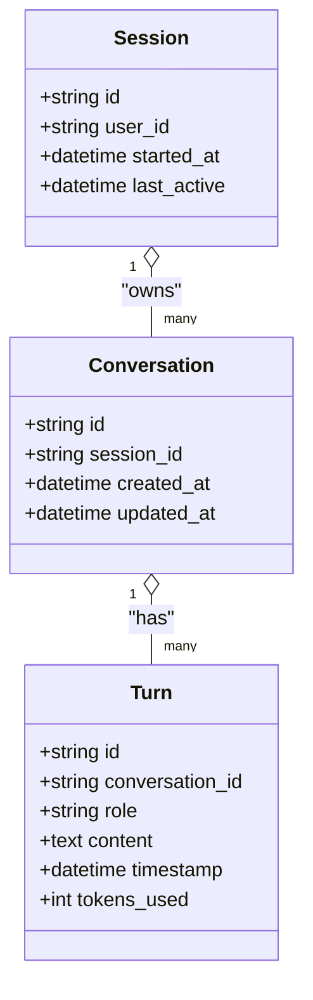
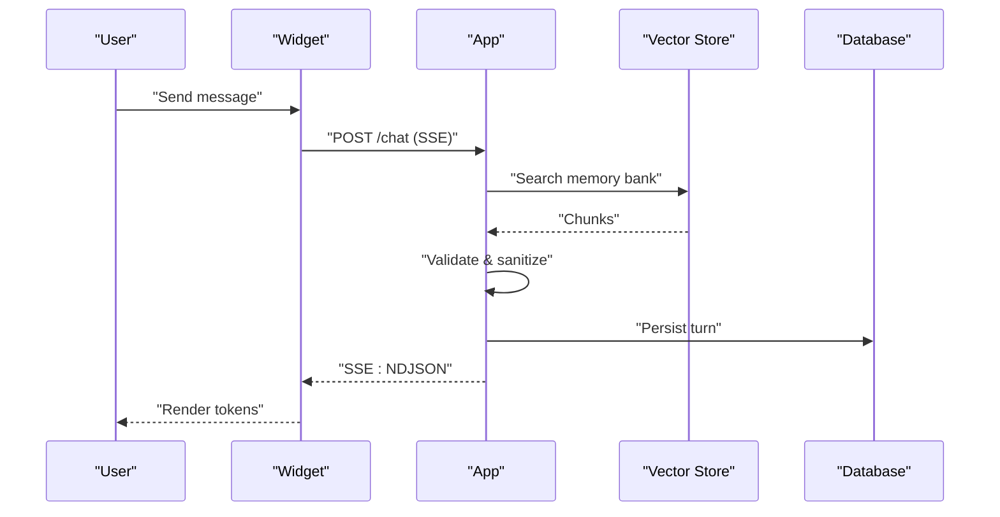
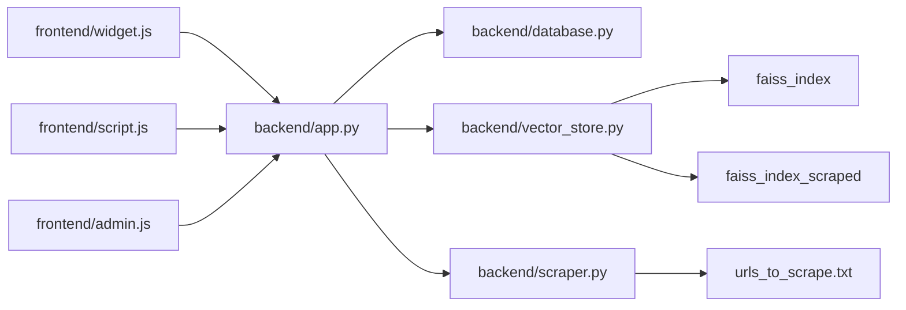

# Conversation Flow Design

<cite>
**Referenced Files in This Document**
- [backend/app.py](file://backend/app.py)
- [backend/database.py](file://backend/database.py)
- [backend/vector_store.py](file://backend/vector_store.py)
- [backend/scraper.py](file://backend/scraper.py)
- [backend/db/faiss_index](file://backend/db/faiss_index)
- [backend/db/faiss_index_scraped](file://backend/db/faiss_index_scraped)
- [backend/urls_to_scrape.txt](file://backend/urls_to_scrape.txt)
- [frontend/script.js](file://frontend/script.js)
- [frontend/widget.js](file://frontend/widget.js)
- [frontend/admin.js](file://frontend/admin.js)
- [API_DOCUMENTATION.md](file://API_DOCUMENTATION.md)
</cite>

## Table of Contents
1. [Introduction](#introduction)
2. [Project Structure](#project-structure)
3. [Core Components](#core-components)
4. [Architecture Overview](#architecture-overview)
5. [Detailed Component Analysis](#detailed-component-analysis)
6. [Dependency Analysis](#dependency-analysis)
7. [Performance Considerations](#performance-considerations)
8. [Troubleshooting Guide](#troubleshooting-guide)
9. [Conclusion](#conclusion)
10. [Appendices](#appendices)

## Introduction
This document describes the conversation flow design and multi-turn dialogue management for the DamayAI Assistant. It covers conversation state management, history validation, context preservation, streaming response architecture using Server-Sent Events (SSE) and NDJSON format, conversation validation and input sanitization, and the end-to-end conversation flow including memory bank search, manual data retrieval, and scraped content processing. It also documents conversation persistence, user session handling, and analytics collection.

## Project Structure
The system comprises:
- Backend server exposing REST endpoints and SSE streams
- Vector store and FAISS indices for semantic search
- Scraper module for content ingestion
- Frontend widgets and admin interfaces for user interaction
- API documentation for endpoint usage

**Diagram sources**
- [backend/app.py](file://backend/app.py)
- [backend/database.py](file://backend/database.py)
- [backend/vector_store.py](file://backend/vector_store.py)
- [backend/scraper.py](file://backend/scraper.py)
- [backend/db/faiss_index](file://backend/db/faiss_index)
- [backend/db/faiss_index_scraped](file://backend/db/faiss_index_scraped)
- [backend/urls_to_scrape.txt](file://backend/urls_to_scrape.txt)
- [frontend/script.js](file://frontend/script.js)
- [frontend/widget.js](file://frontend/widget.js)
- [frontend/admin.js](file://frontend/admin.js)

**Section sources**
- [backend/app.py](file://backend/app.py)
- [backend/database.py](file://backend/database.py)
- [backend/vector_store.py](file://backend/vector_store.py)
- [backend/scraper.py](file://backend/scraper.py)
- [backend/db/faiss_index](file://backend/db/faiss_index)
- [backend/db/faiss_index_scraped](file://backend/db/faiss_index_scraped)
- [backend/urls_to_scrape.txt](file://backend/urls_to_scrape.txt)
- [frontend/script.js](file://frontend/script.js)
- [frontend/widget.js](file://frontend/widget.js)
- [frontend/admin.js](file://frontend/admin.js)

## Core Components
- Conversation controller and SSE stream handler in the backend FastAPI app
- Vector store manager for semantic search against FAISS indices
- Content scraper for ingesting external URLs into the scraped index
- Frontend widget and scripts for initiating conversations and consuming SSE
- Database layer for persistence of conversations, sessions, and analytics

Key responsibilities:
- Manage conversation state per user session
- Validate and sanitize inputs
- Preserve context across turns
- Stream model-generated tokens via SSE with NDJSON framing
- Retrieve relevant memory bank content and process scraped data
- Persist conversations and collect analytics

**Section sources**
- [backend/app.py](file://backend/app.py)
- [backend/vector_store.py](file://backend/vector_store.py)
- [backend/scraper.py](file://backend/scraper.py)
- [frontend/script.js](file://frontend/script.js)
- [frontend/widget.js](file://frontend/widget.js)

## Architecture Overview
The conversation flow integrates frontend widgets, backend endpoints, vector search, and persistent storage. The backend exposes:
- A chat endpoint that accepts user messages and returns SSE streams
- An admin endpoint for managing data bank and scraping
- Database APIs for conversation/session persistence and analytics

**Diagram sources**
- [backend/app.py](file://backend/app.py)
- [backend/vector_store.py](file://backend/vector_store.py)
- [backend/database.py](file://backend/database.py)
- [frontend/widget.js](file://frontend/widget.js)

## Detailed Component Analysis

### Conversation State Management
- Session-based state: Each conversation is associated with a session identifier. The backend maintains per-session conversation history and context window.
- Turn sequencing: Messages are appended in order with roles (user, assistant) and timestamps. The system enforces maximum history length and token budget to prevent overflow.
- Context window construction: The backend builds a rolling context window from recent turns, optionally augmented with retrieved memory bank content.
- Validation and sanitization: Inputs are validated for presence, length, and content type. Sanitization removes potentially harmful constructs while preserving meaning.

**Diagram sources**
- [backend/app.py](file://backend/app.py)
- [backend/database.py](file://backend/database.py)

**Section sources**
- [backend/app.py](file://backend/app.py)
- [backend/database.py](file://backend/database.py)

### Streaming Response Architecture (SSE + NDJSON)
- SSE endpoint: The backend exposes a streaming endpoint that keeps the connection open and emits events as the model generates tokens.
- NDJSON framing: Each event payload is formatted as NDJSON lines, enabling incremental parsing on the client.
- Client consumption: The frontend widget parses incoming events and renders tokens progressively to the UI.

**Diagram sources**
- [backend/app.py](file://backend/app.py)
- [frontend/widget.js](file://frontend/widget.js)

**Section sources**
- [backend/app.py](file://backend/app.py)
- [frontend/widget.js](file://frontend/widget.js)

### Memory Bank Search and Manual Retrieval
- Semantic search: The vector store performs semantic similarity search against FAISS indices to retrieve relevant chunks for the current query.
- Index selection: Two indices exist—one for general memory bank and another for scraped content—used depending on retrieval scope.
- Manual data ingestion: Administrators can upload data or provide URLs to populate the scraped index.

**Diagram sources**
- [backend/vector_store.py](file://backend/vector_store.py)
- [backend/db/faiss_index](file://backend/db/faiss_index)
- [backend/db/faiss_index_scraped](file://backend/db/faiss_index_scraped)
- [backend/scraper.py](file://backend/scraper.py)
- [backend/urls_to_scrape.txt](file://backend/urls_to_scrape.txt)

**Section sources**
- [backend/vector_store.py](file://backend/vector_store.py)
- [backend/db/faiss_index](file://backend/db/faiss_index)
- [backend/db/faiss_index_scraped](file://backend/db/faiss_index_scraped)
- [backend/scraper.py](file://backend/scraper.py)
- [backend/urls_to_scrape.txt](file://backend/urls_to_scrape.txt)

### Conversation Validation, Input Sanitization, and Security
- Input validation: Ensures required fields, acceptable lengths, and safe content types.
- Sanitization: Removes or neutralizes unsafe constructs while preserving conversational intent.
- Security measures: Rate limiting, input length caps, and strict CORS policies at the API gateway level; backend validates and normalizes all inputs.

**Diagram sources**
- [backend/app.py](file://backend/app.py)

**Section sources**
- [backend/app.py](file://backend/app.py)

### Conversation Persistence and Analytics
- Persistence: Each turn is persisted with session ID, timestamps, roles, and sanitized content. The database stores conversation metadata and analytics-ready fields.
- Sessions: Sessions are created on first interaction and tracked across multiple turns.
- Analytics: Metrics such as turn count, latency, token usage, and sentiment can be derived from stored conversation logs.

**Diagram sources**
- [backend/database.py](file://backend/database.py)

**Section sources**
- [backend/database.py](file://backend/database.py)

### Step-by-Step Conversation Flow
1. User submits a message via the widget.
2. Backend validates and sanitizes the input.
3. Context window is constructed from prior turns and optional memory bank retrieval.
4. Optional memory bank search:
   - Query is embedded and searched against FAISS indices.
   - Top-k relevant chunks are selected and injected into context.
5. Optional scraped content processing:
   - If applicable, scraped index is searched and results merged.
6. Model generation:
   - The backend streams tokens via SSE with NDJSON framing.
7. Persistence:
   - Each turn is persisted with metadata and analytics fields.
8. Frontend rendering:
   - Widget parses events and updates UI incrementally.

**Diagram sources**
- [backend/app.py](file://backend/app.py)
- [backend/vector_store.py](file://backend/vector_store.py)
- [backend/database.py](file://backend/database.py)
- [frontend/widget.js](file://frontend/widget.js)

**Section sources**
- [backend/app.py](file://backend/app.py)
- [backend/vector_store.py](file://backend/vector_store.py)
- [backend/database.py](file://backend/database.py)
- [frontend/widget.js](file://frontend/widget.js)

### Examples and Patterns
- Conversation history structure:
  - Each conversation belongs to a session and contains ordered turns.
  - Turns include role, content, and timestamp.
- Message formatting:
  - NDJSON events carry delta tokens and completion markers.
- State management patterns:
  - Rolling context window with configurable max turns and token limits.
  - Optional augmentation with memory bank and scraped content.

[No sources needed since this subsection summarizes patterns conceptually]

## Dependency Analysis
The backend FastAPI app orchestrates interactions among the database, vector store, and scraper modules. The frontend widgets depend on the SSE streaming endpoint. Vector store depends on FAISS indices and the scraper’s ingestion pipeline.

**Diagram sources**
- [backend/app.py](file://backend/app.py)
- [backend/database.py](file://backend/database.py)
- [backend/vector_store.py](file://backend/vector_store.py)
- [backend/scraper.py](file://backend/scraper.py)
- [backend/db/faiss_index](file://backend/db/faiss_index)
- [backend/db/faiss_index_scraped](file://backend/db/faiss_index_scraped)
- [backend/urls_to_scrape.txt](file://backend/urls_to_scrape.txt)
- [frontend/widget.js](file://frontend/widget.js)
- [frontend/script.js](file://frontend/script.js)
- [frontend/admin.js](file://frontend/admin.js)

**Section sources**
- [backend/app.py](file://backend/app.py)
- [backend/database.py](file://backend/database.py)
- [backend/vector_store.py](file://backend/vector_store.py)
- [backend/scraper.py](file://backend/scraper.py)
- [backend/db/faiss_index](file://backend/db/faiss_index)
- [backend/db/faiss_index_scraped](file://backend/db/faiss_index_scraped)
- [backend/urls_to_scrape.txt](file://backend/urls_to_scrape.txt)
- [frontend/widget.js](file://frontend/widget.js)
- [frontend/script.js](file://frontend/script.js)
- [frontend/admin.js](file://frontend/admin.js)

## Performance Considerations
- Streaming latency: Keep SSE connections efficient; avoid blocking operations in the hot path.
- Vector search cost: Tune top-k and index parameters; consider caching frequent queries.
- Token budgeting: Enforce strict context limits to maintain responsiveness.
- Persistence overhead: Batch writes where feasible; ensure database indexing for session and timestamp queries.

[No sources needed since this section provides general guidance]

## Troubleshooting Guide
- SSE not received:
  - Verify the endpoint path and headers; ensure the client connects with proper event parsing.
- Slow memory bank retrieval:
  - Confirm FAISS indices exist and are properly built; check embedding model availability.
- Conversation not persisting:
  - Inspect database connectivity and transaction handling; confirm session IDs are propagated.
- Scraped content missing:
  - Validate URLs list and scraper job status; ensure scraped index is populated.

**Section sources**
- [backend/app.py](file://backend/app.py)
- [backend/vector_store.py](file://backend/vector_store.py)
- [backend/database.py](file://backend/database.py)
- [backend/scraper.py](file://backend/scraper.py)
- [backend/db/faiss_index](file://backend/db/faiss_index)
- [backend/db/faiss_index_scraped](file://backend/db/faiss_index_scraped)
- [backend/urls_to_scrape.txt](file://backend/urls_to_scrape.txt)

## Conclusion
The conversation flow integrates robust state management, secure input handling, and real-time streaming via SSE with NDJSON. Memory bank and scraped content retrieval enhance contextual relevance, while persistence and analytics enable long-term insights. The modular backend and frontend components support scalable deployment and maintenance.

[No sources needed since this section summarizes without analyzing specific files]

## Appendices
- Endpoint references and usage are documented in the API documentation file.

**Section sources**
- [API_DOCUMENTATION.md](file://API_DOCUMENTATION.md)