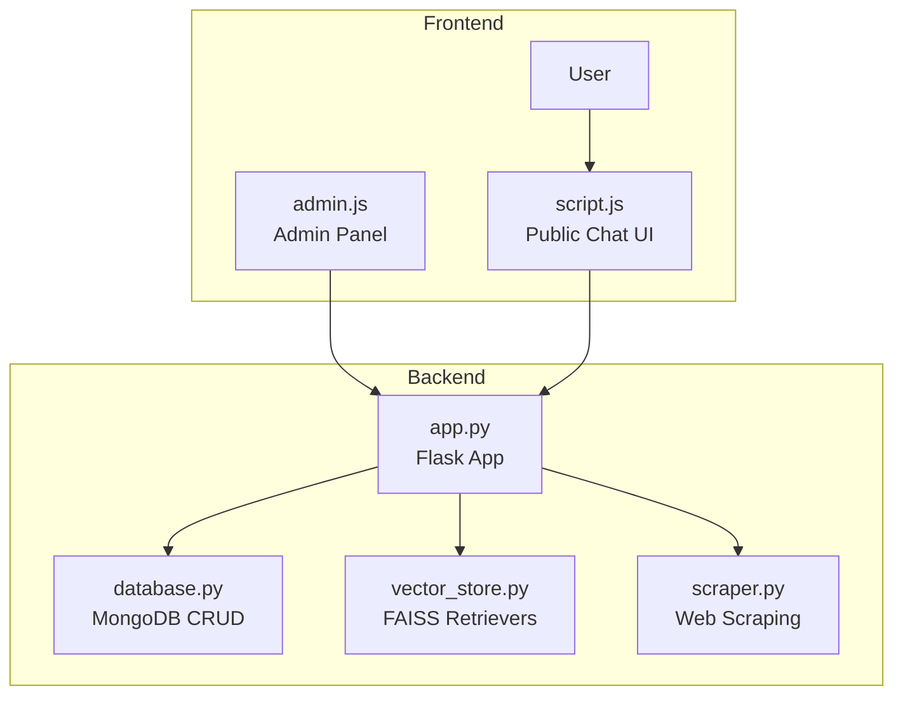
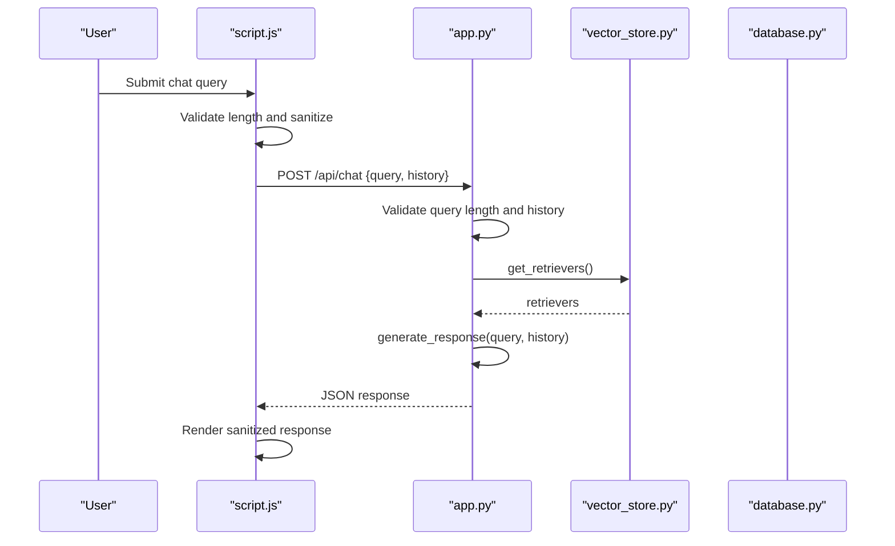
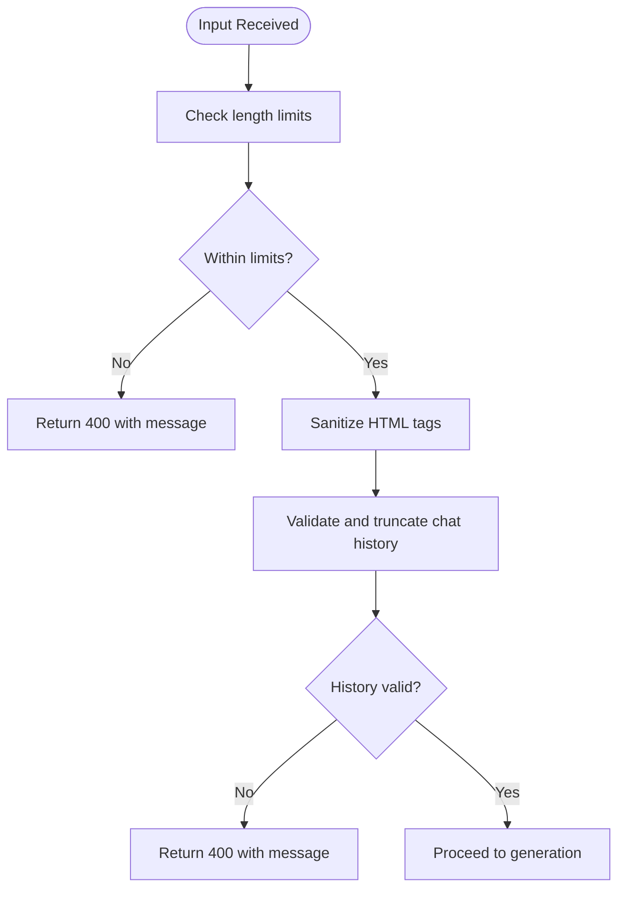
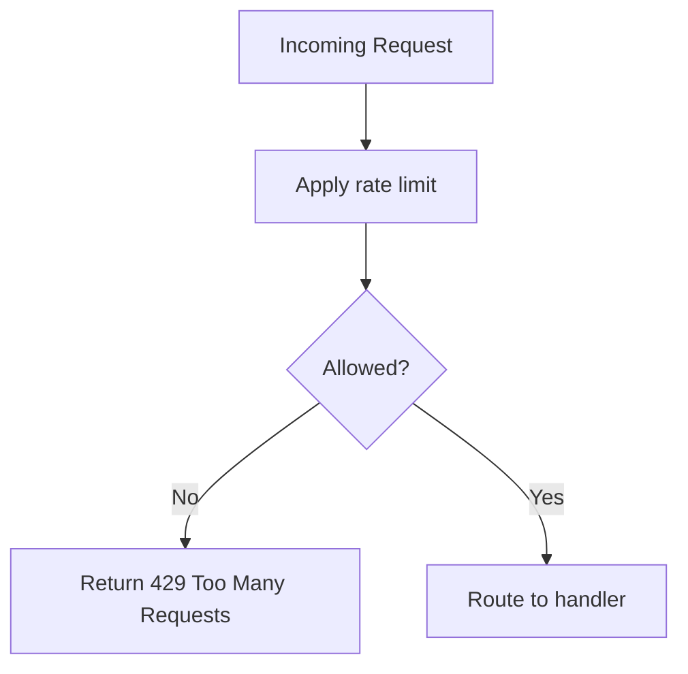
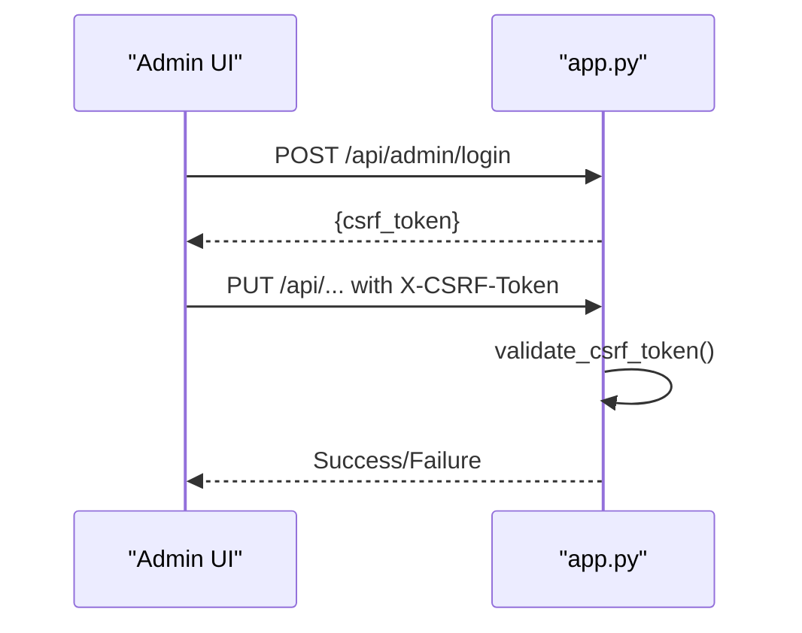
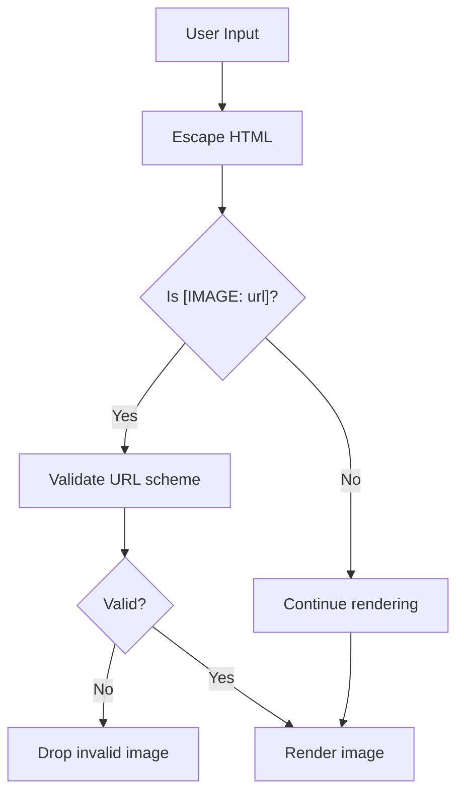
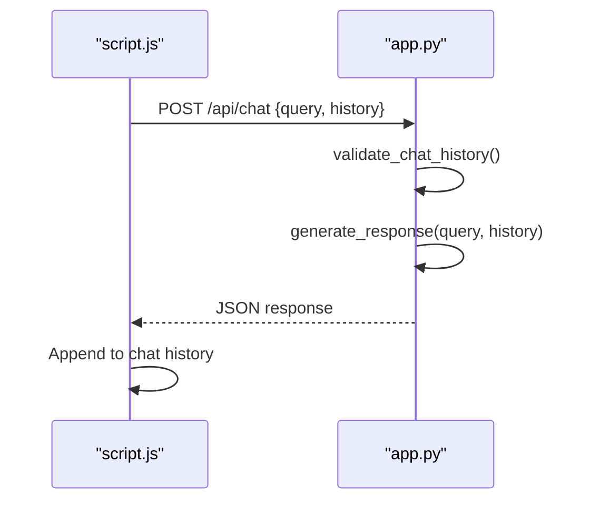
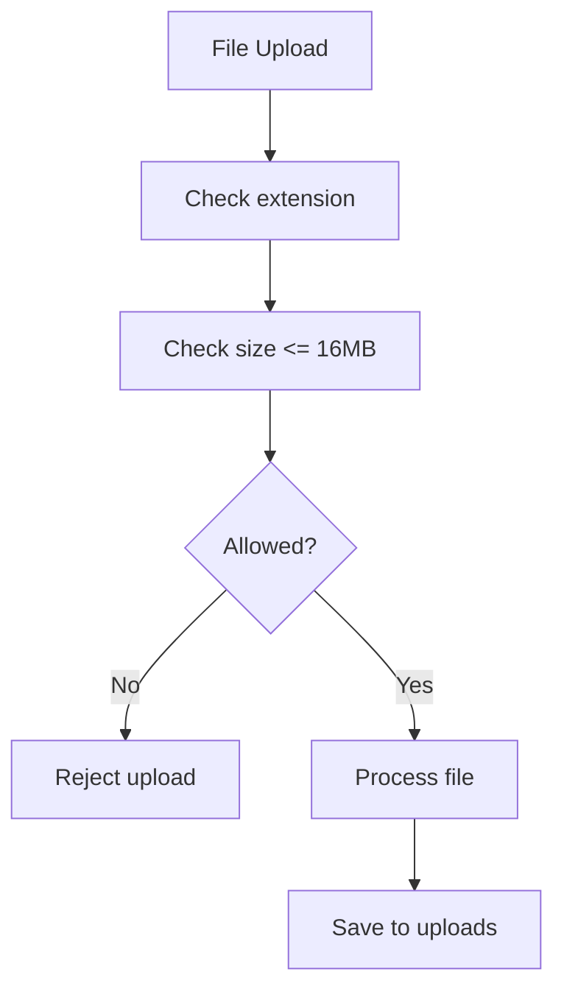
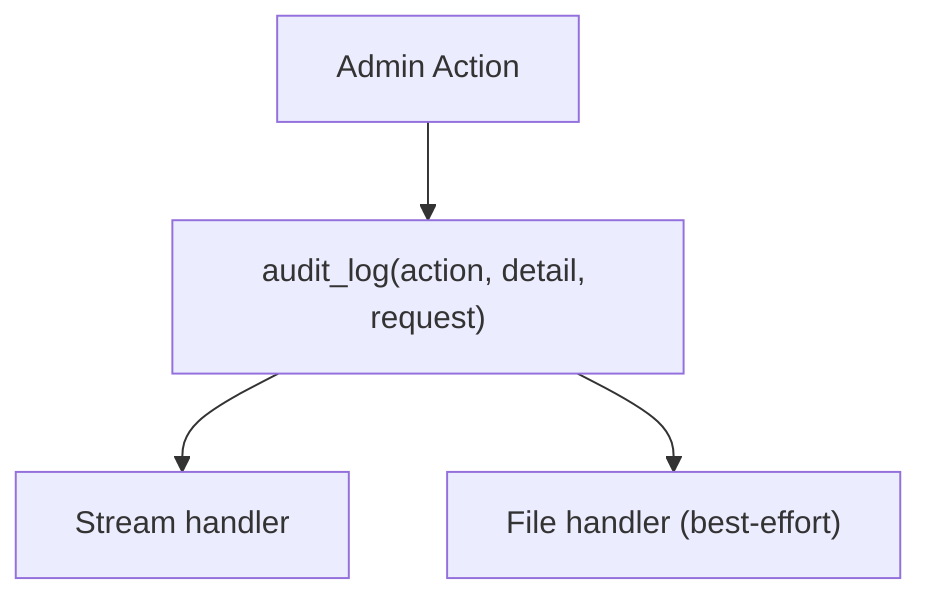
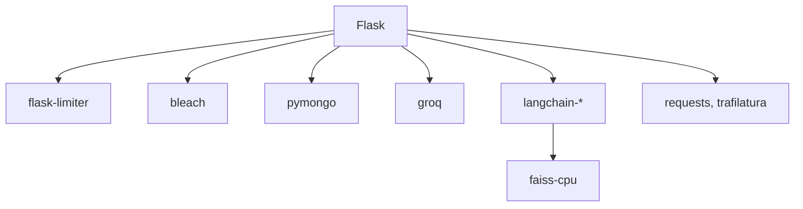

# Conversation Validation and Security

<cite>
**Referenced Files in This Document**
- [app.py](file://backend/app.py)
- [database.py](file://backend/database.py)
- [vector_store.py](file://backend/vector_store.py)
- [scraper.py](file://backend/scraper.py)
- [script.js](file://frontend/script.js)
- [admin.js](file://frontend/admin.js)
- [API_DOCUMENTATION.md](file://API_DOCUMENTATION.md)
- [requirements.txt](file://requirements.txt)
</cite>

## Table of Contents
1. [Introduction](#introduction)
2. [Project Structure](#project-structure)
3. [Core Components](#core-components)
4. [Architecture Overview](#architecture-overview)
5. [Detailed Component Analysis](#detailed-component-analysis)
6. [Dependency Analysis](#dependency-analysis)
7. [Performance Considerations](#performance-considerations)
8. [Troubleshooting Guide](#troubleshooting-guide)
9. [Conclusion](#conclusion)

## Introduction
This document provides comprehensive coverage of conversation validation and security measures implemented in the DamayAI Assistant project. It focuses on input validation logic, sanitization processes, rate limiting, anti-abuse mechanisms, XSS prevention, and conversation integrity safeguards. It also documents conversation flow validation, audit logging, and security incident response procedures.

## Project Structure
The system consists of:
- Backend (Flask): Handles API endpoints, validation, rate limiting, security headers, and audit logging.
- Vector store and FAISS indices: Manage retrieval-augmented generation (RAG) for conversation grounding.
- Frontend (script.js and admin.js): Implements client-side rendering, sanitization, and CSRF token injection for admin actions.

**Diagram sources**
- [app.py:1-1192](file://backend/app.py#L1-1192)
- [database.py:1-260](file://backend/database.py#L1-260)
- [vector_store.py:1-115](file://backend/vector_store.py#L1-115)
- [scraper.py:1-278](file://backend/scraper.py#L1-278)
- [script.js:1-428](file://frontend/script.js#L1-428)
- [admin.js:1-1108](file://frontend/admin.js#L1-1108)

**Section sources**
- [app.py:1-1192](file://backend/app.py#L1-1192)
- [API_DOCUMENTATION.md:1-347](file://API_DOCUMENTATION.md#L1-347)

## Core Components
- Input validation and sanitization:
  - Length limits for queries, descriptions, and content.
  - HTML sanitization for user-provided text.
  - Chat history validation and truncation.
- Rate limiting:
  - Global default and endpoint-specific limits via Flask-Limiter.
- CSRF protection:
  - Session-stored CSRF tokens validated on state-changing requests.
- Security headers and CORS:
  - Strict security headers and controlled CORS for widget embedding.
- XSS prevention:
  - Client-side HTML escaping and image URL validation.
- Conversation integrity:
  - ObjectId validation for database operations.
  - Audit logging for admin actions.
- SSRF protection:
  - Safe URL checks for scraping and crawling.

**Section sources**
- [app.py:96-116](file://backend/app.py#L96-116)
- [app.py:127-133](file://backend/app.py#L127-133)
- [app.py:135-159](file://backend/app.py#L135-159)
- [app.py:161-175](file://backend/app.py#L161-175)
- [app.py:177-184](file://backend/app.py#L177-184)
- [app.py:186-218](file://backend/app.py#L186-218)
- [app.py:267-292](file://backend/app.py#L267-292)
- [scraper.py:12-27](file://backend/scraper.py#L12-27)
- [script.js:159-227](file://frontend/script.js#L159-227)
- [script.js:173-180](file://frontend/script.js#L173-180)

## Architecture Overview
The conversation flow integrates client-side validation, backend validation, and retrieval-augmented generation with robust security controls.

**Diagram sources**
- [script.js:78-111](file://frontend/script.js#L78-111)
- [app.py:432-452](file://backend/app.py#L432-452)
- [app.py:609-761](file://backend/app.py#L609-761)
- [vector_store.py:73-115](file://backend/vector_store.py#L73-115)

## Detailed Component Analysis

### Input Validation and Sanitization
- Length limits:
  - Query length: enforced before invoking the model.
  - Description length: enforced for bug reports.
  - Content length: enforced for manual data and memory bank entries.
  - Chat history: truncated to last N messages.
- HTML sanitization:
  - User input sanitized to strip HTML tags.
- ObjectId validation:
  - Ensures database operations receive valid identifiers.

**Diagram sources**
- [app.py:438-443](file://backend/app.py#L438-443)
- [app.py:127-133](file://backend/app.py#L127-133)
- [app.py:177-184](file://backend/app.py#L177-184)
- [app.py:186-218](file://backend/app.py#L186-218)

**Section sources**
- [app.py:127-133](file://backend/app.py#L127-133)
- [app.py:177-184](file://backend/app.py#L177-184)
- [app.py:186-218](file://backend/app.py#L186-218)
- [app.py:438-443](file://backend/app.py#L438-443)

### Rate Limiting Implementation
- Global default limit and endpoint-specific limits:
  - Login: 5 per minute
  - Chat (public/admin): 10 per minute
  - Bug report: 3 per minute
  - Scrape/Crawl/Reindex: 1 per minute
  - General: 200 per hour
- Graceful fallback when Flask-Limiter is unavailable.

**Diagram sources**
- [app.py:96-116](file://backend/app.py#L96-116)
- [app.py:331-352](file://backend/app.py#L331-352)
- [app.py:403-431](file://backend/app.py#L403-431)
- [app.py:432-452](file://backend/app.py#L432-452)
- [app.py:801-820](file://backend/app.py#L801-820)
- [app.py:822-846](file://backend/app.py#L822-846)
- [app.py:848-858](file://backend/app.py#L848-858)

**Section sources**
- [app.py:96-116](file://backend/app.py#L96-116)
- [API_DOCUMENTATION.md:65-71](file://API_DOCUMENTATION.md#L65-71)

### CSRF Protection and Session Security
- CSRF token lifecycle:
  - Generated on admin login and stored in session.
  - Required for all state-changing admin requests.
  - Header-based validation on the backend.
- Session configuration:
  - Permanent sessions with expiration.
  - Secret key required for session integrity.

**Diagram sources**
- [app.py:135-159](file://backend/app.py#L135-159)
- [app.py:331-352](file://backend/app.py#L331-352)
- [admin.js:163-191](file://frontend/admin.js#L163-191)
- [admin.js:200-234](file://frontend/admin.js#L200-234)

**Section sources**
- [app.py:135-159](file://backend/app.py#L135-159)
- [app.py:309-312](file://backend/app.py#L309-312)
- [app.py:61-66](file://backend/app.py#L61-66)
- [admin.js:163-191](file://frontend/admin.js#L163-191)
- [admin.js:200-234](file://frontend/admin.js#L200-234)

### XSS Prevention and Output Sanitization
- Client-side:
  - Escapes HTML in user messages.
  - Validates image URLs to ensure they are http/https.
  - Processes citations safely.
- Server-side:
  - Sanitizes user-provided text before persistence.
  - Enforces strict security headers.

**Diagram sources**
- [script.js:159-227](file://frontend/script.js#L159-227)
- [script.js:173-180](file://frontend/script.js#L173-180)
- [app.py:177-184](file://backend/app.py#L177-184)
- [app.py:267-292](file://backend/app.py#L267-292)

**Section sources**
- [script.js:159-227](file://frontend/script.js#L159-227)
- [script.js:173-180](file://frontend/script.js#L173-180)
- [app.py:177-184](file://backend/app.py#L177-184)
- [app.py:267-292](file://backend/app.py#L267-292)

### Conversation Flow Validation
- Query validation:
  - Enforced length limits.
- History validation:
  - Role validation and structure checks.
  - Part text length limits and truncation.
  - History truncation to recent N entries.
- Streaming admin chat:
  - Uses NDJSON streaming with structured steps.

**Diagram sources**
- [app.py:432-452](file://backend/app.py#L432-452)
- [app.py:186-218](file://backend/app.py#L186-218)
- [app.py:609-761](file://backend/app.py#L609-761)
- [script.js:78-111](file://frontend/script.js#L78-111)

**Section sources**
- [app.py:186-218](file://backend/app.py#L186-218)
- [app.py:432-452](file://backend/app.py#L432-452)
- [app.py:609-761](file://backend/app.py#L609-761)
- [script.js:78-111](file://frontend/script.js#L78-111)

### Anti-Abuse Mechanisms
- File upload restrictions:
  - Max file size and allowed extensions.
- ObjectId validation:
  - Prevents malformed or malicious IDs.
- SSRF protection:
  - Safe URL checks for scraping and crawling.
- Security headers:
  - Blocks MIME sniffing, enables XSS protection, strict referrer policy, and frame denial.

**Diagram sources**
- [app.py:86-88](file://backend/app.py#L86-88)
- [app.py:124-125](file://backend/app.py#L124-125)
- [app.py:403-431](file://backend/app.py#L403-431)
- [scraper.py:12-27](file://backend/scraper.py#L12-27)
- [app.py:267-292](file://backend/app.py#L267-292)

**Section sources**
- [app.py:86-88](file://backend/app.py#L86-88)
- [app.py:124-125](file://backend/app.py#L124-125)
- [app.py:403-431](file://backend/app.py#L403-431)
- [scraper.py:12-27](file://backend/scraper.py#L12-27)
- [app.py:267-292](file://backend/app.py#L267-292)

### Security Measures Against Malicious Inputs
- Input sanitization:
  - Bleach-based HTML stripping for user text.
- ObjectId validation:
  - Ensures 24-character hex string.
- Query and content length limits:
  - Prevents excessive payload abuse.
- File upload filtering:
  - Whitelisted extensions and size enforcement.

**Section sources**
- [app.py:164-175](file://backend/app.py#L164-175)
- [app.py:127-133](file://backend/app.py#L127-133)
- [app.py:177-184](file://backend/app.py#L177-184)
- [app.py:124-125](file://backend/app.py#L124-125)

### Conversation Hijacking Protection
- Session-based admin authentication with expiration.
- CSRF tokens for all state-changing admin requests.
- Strict security headers to mitigate clickjacking and XSS.

**Section sources**
- [app.py:243-250](file://backend/app.py#L243-250)
- [app.py:135-159](file://backend/app.py#L135-159)
- [app.py:267-292](file://backend/app.py#L267-292)

### Validation Rules and Error Handling
- Validation rules:
  - Query length ≤ configured maximum.
  - Description length ≤ configured maximum.
  - Content length ≤ configured maximum.
  - Chat history roles and structure validated.
  - ObjectId validation for database operations.
- Error handling:
  - 400 for bad input.
  - 401 for unauthorized.
  - 403 for CSRF failure.
  - 413 for file too large.
  - 429 for rate limiting.
  - 500 for internal errors.

**Section sources**
- [app.py:438-443](file://backend/app.py#L438-443)
- [app.py:412-414](file://backend/app.py#L412-414)
- [app.py:509-511](file://backend/app.py#L509-511)
- [app.py:579-581](file://backend/app.py#L579-581)
- [app.py:316-326](file://backend/app.py#L316-326)
- [API_DOCUMENTATION.md:232-288](file://API_DOCUMENTATION.md#L232-288)

### Conversation Monitoring, Audit Logging, and Incident Response
- Audit logging:
  - Dedicated logger for admin/system actions.
  - Logs IP address, action, and details.
- Incident response:
  - Centralized error handlers return user-friendly messages.
  - Admin actions are audited for traceability.

**Diagram sources**
- [app.py:32-56](file://backend/app.py#L32-56)
- [app.py:345-351](file://backend/app.py#L345-351)
- [app.py:477-478](file://backend/app.py#L477-478)
- [app.py:775-776](file://backend/app.py#L775-776)
- [app.py:956-957](file://backend/app.py#L956-957)

**Section sources**
- [app.py:32-56](file://backend/app.py#L32-56)
- [app.py:345-351](file://backend/app.py#L345-351)
- [app.py:477-478](file://backend/app.py#L477-478)
- [app.py:775-776](file://backend/app.py#L775-776)
- [app.py:956-957](file://backend/app.py#L956-957)

## Dependency Analysis
Security-related dependencies and their roles:
- Flask-Limiter: Rate limiting.
- Bleach: HTML sanitization.
- LangChain and FAISS: Vector store and retrieval.
- Requests and Trafilatura: Web scraping with safety checks.
- PyMongo: MongoDB connectivity and indexing.

**Diagram sources**
- [requirements.txt:1-30](file://requirements.txt#L1-30)
- [app.py:9-27](file://backend/app.py#L9-27)
- [vector_store.py:1-12](file://backend/vector_store.py#L1-12)
- [scraper.py:1-11](file://backend/scraper.py#L1-11)

**Section sources**
- [requirements.txt:1-30](file://requirements.txt#L1-30)
- [app.py:9-27](file://backend/app.py#L9-27)
- [vector_store.py:1-12](file://backend/vector_store.py#L1-12)
- [scraper.py:1-11](file://backend/scraper.py#L1-11)

## Performance Considerations
- Rate limiting reduces load spikes and prevents abuse.
- FAISS retrievers are cached to avoid repeated index loading.
- Client-side throttling of requests improves UX under load.
- Input truncation and limits reduce processing overhead.

[No sources needed since this section provides general guidance]

## Troubleshooting Guide
Common issues and resolutions:
- CSRF failures:
  - Ensure CSRF token is present in headers for state-changing requests.
- Unauthorized access:
  - Verify admin session and re-login if needed.
- Rate limit exceeded:
  - Wait until reset or reduce request frequency.
- File upload errors:
  - Confirm file size and extension limits.
- Internal server errors:
  - Check logs and verify environment variables.

**Section sources**
- [admin.js:200-234](file://frontend/admin.js#L200-234)
- [app.py:316-326](file://backend/app.py#L316-326)
- [app.py:317-318](file://backend/app.py#L317-318)
- [API_DOCUMENTATION.md:232-288](file://API_DOCUMENTATION.md#L232-288)

## Conclusion
The DamayAI Assistant implements a layered security and validation strategy across the conversation flow. Input validation, sanitization, rate limiting, CSRF protection, and strict security headers collectively safeguard the system against abuse and maintain conversation integrity. Audit logging ensures traceability for administrative actions, while client-side sanitization and SSRF protections enhance overall resilience.