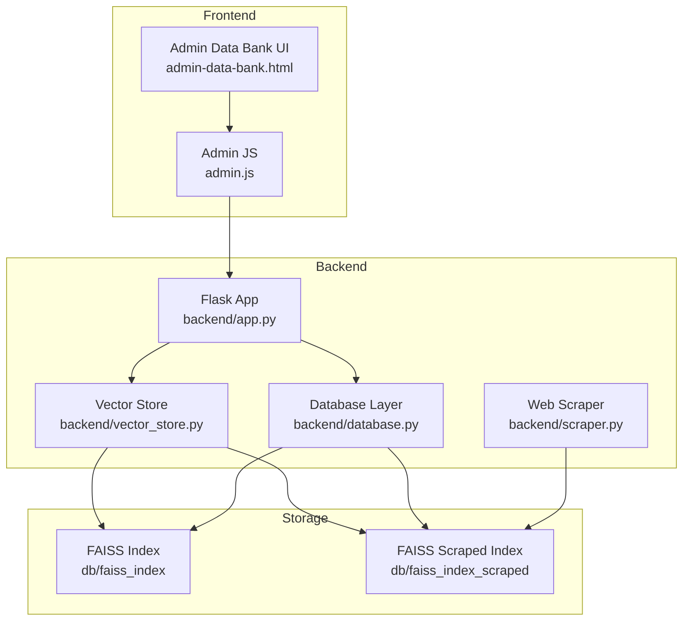
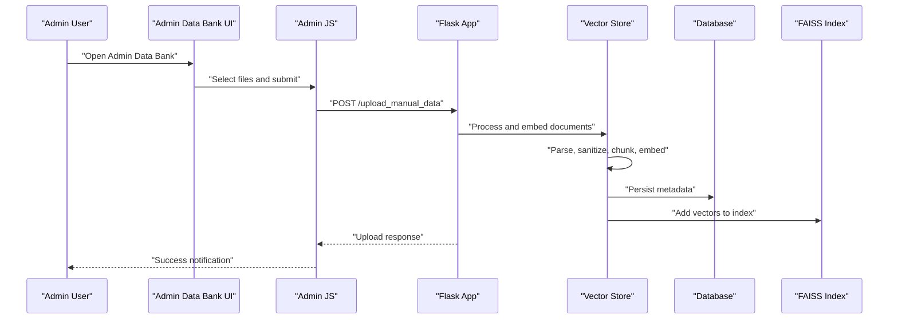
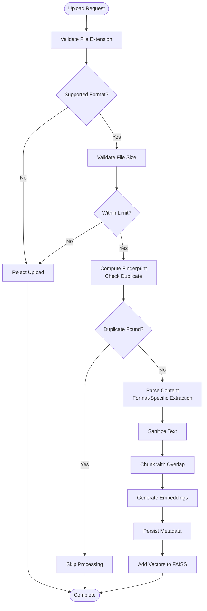
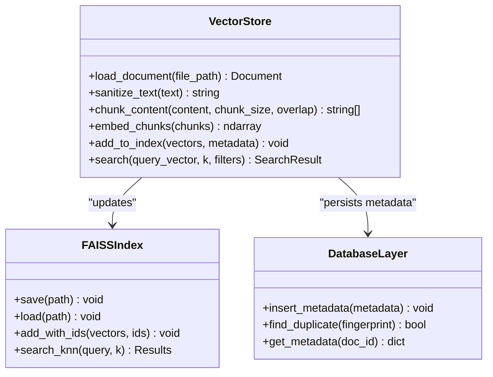
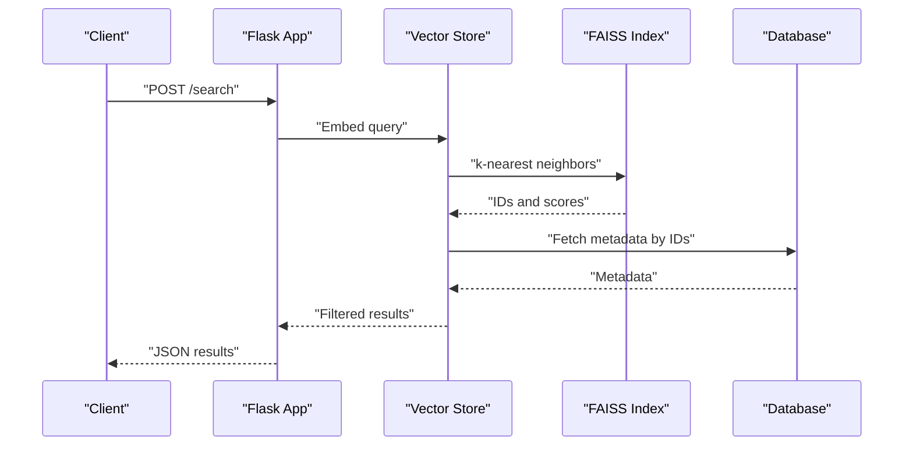
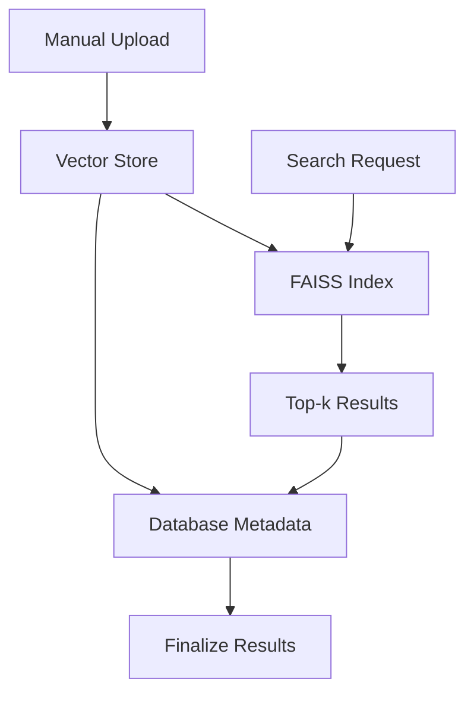
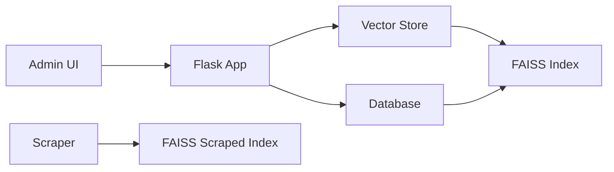

# Manual Data Retrieval Processing

<cite>
**Referenced Files in This Document**
- [backend/app.py](file://backend/app.py)
- [backend/vector_store.py](file://backend/vector_store.py)
- [backend/database.py](file://backend/database.py)
- [backend/scraper.py](file://backend/scraper.py)
- [frontend/admin-data-bank.html](file://frontend/admin-data-bank.html)
- [frontend/admin.js](file://frontend/admin.js)
- [db/faiss_index](file://db/faiss_index)
- [db/faiss_index_scraped](file://db/faiss_index_scraped)
</cite>

## Table of Contents
1. [Introduction](#introduction)
2. [Project Structure](#project-structure)
3. [Core Components](#core-components)
4. [Architecture Overview](#architecture-overview)
5. [Detailed Component Analysis](#detailed-component-analysis)
6. [Dependency Analysis](#dependency-analysis)
7. [Performance Considerations](#performance-considerations)
8. [Troubleshooting Guide](#troubleshooting-guide)
9. [Conclusion](#conclusion)

## Introduction
This document explains the manual data retrieval processing pipeline used in the conversation flow. It covers how user-uploaded content is ingested, validated, sanitized, embedded, indexed, and searched. The system supports multiple document formats (PDF, DOCX, PPTX, TXT) and integrates with FAISS for vector similarity search. The documentation includes processing workflows, validation rules, duplicate detection strategies, content filtering, and performance optimization techniques for large document collections.

## Project Structure
The manual data retrieval system spans the backend Python services and the frontend administrative interface:
- Backend services handle ingestion, validation, embedding, indexing, and search.
- Frontend provides an administrative panel for uploading and managing documents.
- FAISS indices persist embeddings for fast similarity search.

**Diagram sources**
- [backend/app.py](file://backend/app.py)
- [backend/vector_store.py](file://backend/vector_store.py)
- [backend/database.py](file://backend/database.py)
- [backend/scraper.py](file://backend/scraper.py)
- [frontend/admin-data-bank.html](file://frontend/admin-data-bank.html)
- [frontend/admin.js](file://frontend/admin.js)
- [db/faiss_index](file://db/faiss_index)
- [db/faiss_index_scraped](file://db/faiss_index_scraped)

**Section sources**
- [backend/app.py](file://backend/app.py)
- [backend/vector_store.py](file://backend/vector_store.py)
- [backend/database.py](file://backend/database.py)
- [backend/scraper.py](file://backend/scraper.py)
- [frontend/admin-data-bank.html](file://frontend/admin-data-bank.html)
- [frontend/admin.js](file://frontend/admin.js)

## Core Components
- Flask application endpoint for manual data upload and processing.
- Vector store service responsible for document parsing, chunking, sanitization, embedding, and FAISS indexing.
- Database layer for metadata persistence and duplicate detection.
- Web scraper module for external content ingestion (scraped index).
- FAISS indices for semantic search over embeddings.

Key responsibilities:
- Accept multipart form uploads with supported document formats.
- Validate file types and sizes.
- Extract text content and sanitize for embedding.
- Split content into chunks with overlap.
- Generate embeddings via a vectorizer.
- Persist metadata and vectors to FAISS indices.
- Support similarity search with filters and thresholds.

**Section sources**
- [backend/app.py](file://backend/app.py)
- [backend/vector_store.py](file://backend/vector_store.py)
- [backend/database.py](file://backend/database.py)
- [backend/scraper.py](file://backend/scraper.py)

## Architecture Overview
The manual data retrieval pipeline connects the frontend upload interface to backend processing and FAISS search:

**Diagram sources**
- [backend/app.py](file://backend/app.py)
- [backend/vector_store.py](file://backend/vector_store.py)
- [backend/database.py](file://backend/database.py)
- [frontend/admin-data-bank.html](file://frontend/admin-data-bank.html)
- [frontend/admin.js](file://frontend/admin.js)

## Detailed Component Analysis

### Upload Endpoint and Workflow
The Flask application exposes an endpoint to receive manual data uploads. The workflow includes:
- Receiving multipart form data.
- Validating file extensions against supported formats.
- Verifying file size limits.
- De-duplicating based on hash or content fingerprint.
- Passing documents to the vector store for processing.

Processing stages:
- Content extraction per format.
- Text sanitization and normalization.
- Chunking with overlap to improve recall.
- Embedding generation.
- Metadata persistence and FAISS insertion.

**Diagram sources**
- [backend/app.py](file://backend/app.py)
- [backend/vector_store.py](file://backend/vector_store.py)
- [backend/database.py](file://backend/database.py)

**Section sources**
- [backend/app.py](file://backend/app.py)

### Vector Store Processing Pipeline
The vector store orchestrates document processing:
- Format handlers for PDF, DOCX, PPTX, TXT.
- Content sanitization to remove excessive whitespace and normalize encoding.
- Chunking strategy with configurable overlap to balance precision/recall.
- Embedding generation using a vectorizer.
- FAISS index updates with metadata keys for retrieval.

**Diagram sources**
- [backend/vector_store.py](file://backend/vector_store.py)
- [backend/database.py](file://backend/database.py)
- [db/faiss_index](file://db/faiss_index)

**Section sources**
- [backend/vector_store.py](file://backend/vector_store.py)
- [backend/database.py](file://backend/database.py)

### Search Optimization and Filtering
Search capabilities leverage FAISS for efficient similarity search:
- Precomputed embeddings enable fast nearest neighbor retrieval.
- Filters can constrain search by metadata (e.g., source type, date range).
- Threshold-based scoring can be applied to filter low-relevance results.
- Hybrid approaches can combine lexical and semantic signals.

**Diagram sources**
- [backend/app.py](file://backend/app.py)
- [backend/vector_store.py](file://backend/vector_store.py)
- [db/faiss_index](file://db/faiss_index)

**Section sources**
- [backend/app.py](file://backend/app.py)
- [backend/vector_store.py](file://backend/vector_store.py)

### Content Validation and Sanitization
Validation rules:
- File extension whitelist for supported formats.
- Maximum file size enforcement.
- Duplicate detection via content hashing or fingerprinting.
- Metadata completeness checks (title, source, timestamp).

Sanitization steps:
- Remove or normalize non-printable characters.
- Strip excessive whitespace.
- Normalize encoding to avoid embedding artifacts.
- Optional: extract structured metadata (author, subject, keywords).

**Section sources**
- [backend/app.py](file://backend/app.py)
- [backend/vector_store.py](file://backend/vector_store.py)

### Duplicate Detection Strategy
Duplicate detection prevents redundant embeddings:
- Compute a fingerprint/hash of normalized content.
- Query existing fingerprints in the database.
- Skip embedding if match exists.
- Optionally compare embeddings with a similarity threshold.

**Diagram sources**
- [backend/database.py](file://backend/database.py)
- [backend/vector_store.py](file://backend/vector_store.py)

**Section sources**
- [backend/database.py](file://backend/database.py)

### Format Handling (PDF, DOCX, PPTX, TXT)
Format-specific extraction:
- PDF: Extract text with layout preservation considerations.
- DOCX: Retrieve paragraphs and headings.
- PPTX: Extract text from slides and speaker notes.
- TXT: Direct text ingestion.

Post-extraction:
- Apply sanitization and chunking.
- Generate embeddings and update FAISS.

**Section sources**
- [backend/vector_store.py](file://backend/vector_store.py)

### Integration Between Uploaded Documents and Vector Search
Uploaded documents are integrated into the vector search system:
- Metadata stored in the database for retrieval and filtering.
- Vectors indexed in FAISS for similarity search.
- Separate indices for manual data and scraped content to isolate workloads.

**Diagram sources**
- [backend/vector_store.py](file://backend/vector_store.py)
- [backend/database.py](file://backend/database.py)
- [db/faiss_index](file://db/faiss_index)

**Section sources**
- [backend/vector_store.py](file://backend/vector_store.py)
- [backend/database.py](file://backend/database.py)
- [db/faiss_index](file://db/faiss_index)

### Web Scraping Index (Scraped Content)
Scraped content is maintained in a separate FAISS index to keep manual and external data distinct:
- Scrape targets configured externally.
- Processed embeddings stored separately.
- Search endpoints can target either index or combine results.

**Section sources**
- [backend/scraper.py](file://backend/scraper.py)
- [db/faiss_index_scraped](file://db/faiss_index_scraped)

## Dependency Analysis
The system exhibits clear separation of concerns:
- Frontend handles user interaction and form submission.
- Backend routes requests to appropriate services.
- Vector store encapsulates parsing, chunking, and indexing logic.
- Database persists metadata and supports duplicate detection.
- FAISS provides scalable similarity search.

**Diagram sources**
- [backend/app.py](file://backend/app.py)
- [backend/vector_store.py](file://backend/vector_store.py)
- [backend/database.py](file://backend/database.py)
- [backend/scraper.py](file://backend/scraper.py)
- [frontend/admin-data-bank.html](file://frontend/admin-data-bank.html)
- [db/faiss_index](file://db/faiss_index)
- [db/faiss_index_scraped](file://db/faiss_index_scraped)

**Section sources**
- [backend/app.py](file://backend/app.py)
- [backend/vector_store.py](file://backend/vector_store.py)
- [backend/database.py](file://backend/database.py)
- [backend/scraper.py](file://backend/scraper.py)

## Performance Considerations
- Batch embedding: process multiple chunks concurrently to reduce overhead.
- Index sizing: tune FAISS index parameters (quantization, dimensionality) for memory and speed.
- Chunk overlap: adjust overlap to balance recall vs. index size and search cost.
- Duplicate pre-filtering: fingerprinting reduces redundant embeddings.
- Asynchronous ingestion: offload embedding and indexing to background tasks.
- Caching: cache frequently accessed metadata and small result sets.
- Storage: monitor disk usage for FAISS indices; consider periodic compaction.

[No sources needed since this section provides general guidance]

## Troubleshooting Guide
Common issues and resolutions:
- Upload rejected due to unsupported format: Verify file extension matches supported list.
- Exceeded file size limit: Reduce document size or split into smaller files.
- Duplicate detected: Skip or update existing record depending on policy.
- Empty search results: Lower similarity threshold or expand filters; verify embeddings were added.
- Index corruption: Recreate FAISS index from persisted metadata.
- Encoding errors: Sanitize text and reprocess; ensure consistent encoding.

**Section sources**
- [backend/app.py](file://backend/app.py)
- [backend/vector_store.py](file://backend/vector_store.py)
- [backend/database.py](file://backend/database.py)

## Conclusion
The manual data retrieval processing pipeline integrates frontend upload, backend validation and sanitization, vector embedding, and FAISS-based search. By supporting multiple formats, enforcing validation and duplicate detection, and optimizing search with filters and thresholds, the system scales to large document collections while maintaining relevance and performance.