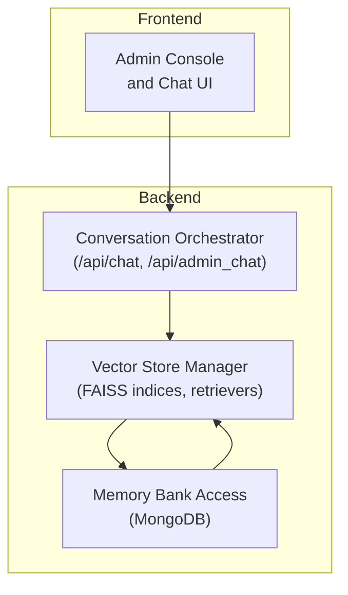
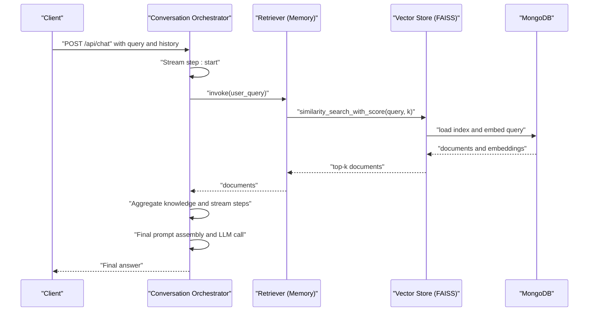
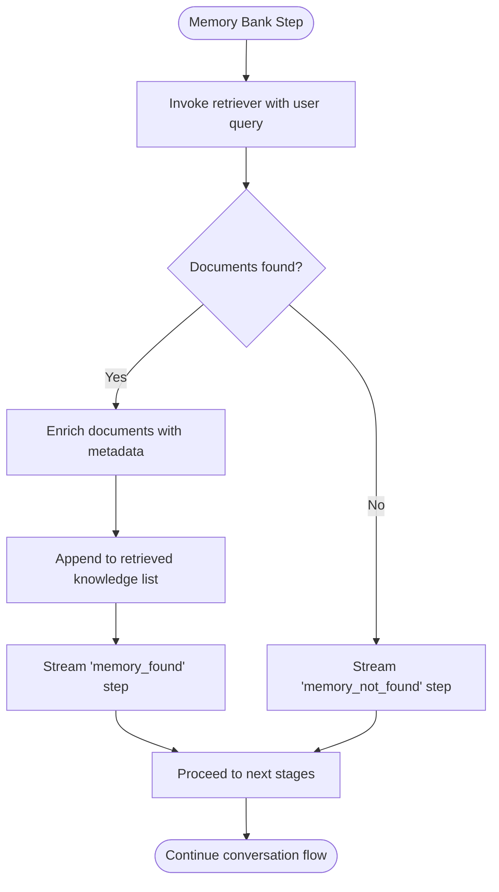
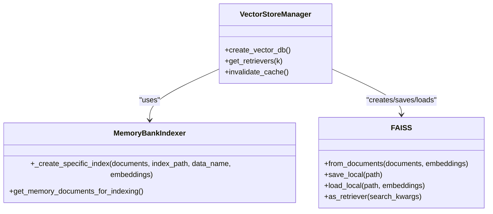
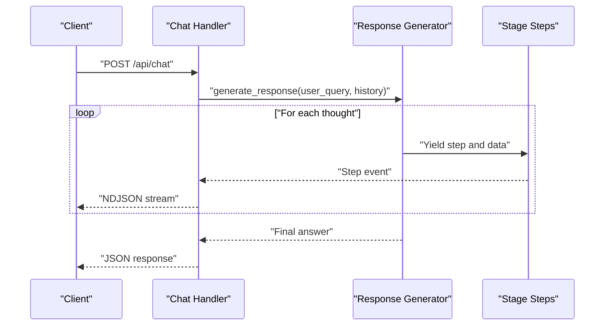
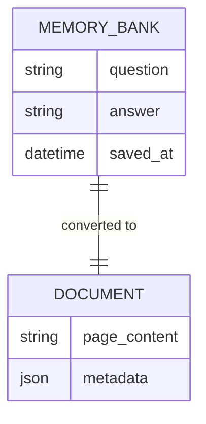
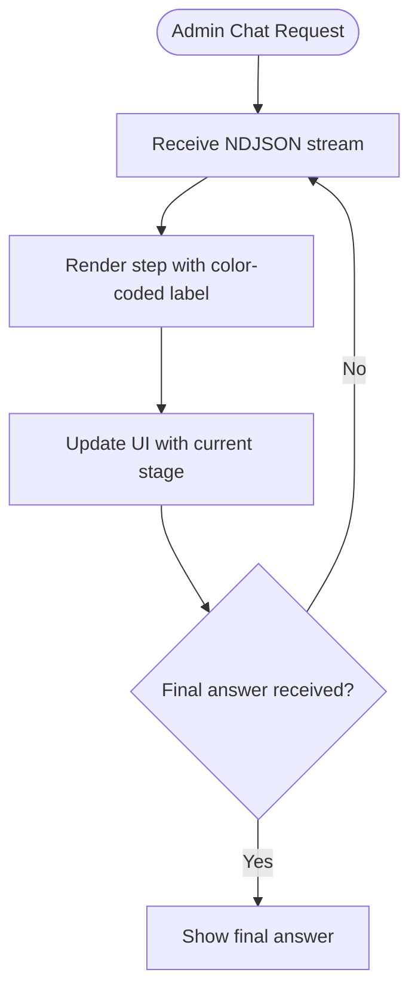

# Memory Bank Search Integration

<cite>
**Referenced Files in This Document**
- [backend/app.py](file://backend/app.py)
- [backend/vector_store.py](file://backend/vector_store.py)
- [backend/database.py](file://backend/database.py)
- [Local Settings/app.py](file://Local Settings/app.py)
- [frontend/admin.js](file://frontend/admin.js)
</cite>

## Table of Contents
1. [Introduction](#introduction)
2. [Project Structure](#project-structure)
3. [Core Components](#core-components)
4. [Architecture Overview](#architecture-overview)
5. [Detailed Component Analysis](#detailed-component-analysis)
6. [Dependency Analysis](#dependency-analysis)
7. [Performance Considerations](#performance-considerations)
8. [Troubleshooting Guide](#troubleshooting-guide)
9. [Conclusion](#conclusion)

## Introduction
This document explains how the memory bank search integrates into the conversation flow. It covers the memory bank query processing, vector search pipeline, retrieval ranking, response generation, confidence scoring, and fallback mechanisms. It also details the integration between vector search and memory bank retrieval, including query preprocessing, embedding comparison, and result ranking. Examples of memory bank query patterns, response formatting, and error handling scenarios are included, along with performance optimization strategies and integration with other knowledge sources.

## Project Structure
The memory bank search spans three primary modules:
- Conversation orchestration and streaming: handles user queries, streams intermediate steps, and generates final answers.
- Vector store and retriever management: builds FAISS indices from memory bank data and exposes retrievers for retrieval.
- Data access and document preparation: fetches memory bank entries and formats them for indexing.

**Diagram sources**
- [backend/app.py:181-204](file://backend/app.py#L181-L204)
- [backend/vector_store.py:73-115](file://backend/vector_store.py#L73-L115)
- [backend/database.py:140-148](file://backend/database.py#L140-L148)

**Section sources**
- [backend/app.py:181-204](file://backend/app.py#L181-L204)
- [backend/vector_store.py:73-115](file://backend/vector_store.py#L73-L115)
- [backend/database.py:140-148](file://backend/database.py#L140-L148)

## Core Components
- Memory bank retrieval pipeline: retrieves top-k relevant documents from the memory bank index and enriches them with metadata for downstream prompting.
- Vector store lifecycle: creates FAISS indices for memory bank, manual, and scraped data; caches retrievers to avoid repeated loading.
- Conversation orchestration: streams intermediate steps, aggregates retrieved knowledge, constructs prompts, and produces final answers.

Key responsibilities:
- Memory bank query processing: invokes retriever with user query and collects matched documents.
- Semantic similarity matching: relies on FAISS vector similarity via HuggingFace embeddings.
- Confidence scoring: FAISS similarity scores are implicitly used via retriever search kwargs; higher-ranked results are prioritized.
- Fallback mechanisms: if memory bank yields no results, the system continues to other knowledge sources (manual and scraped) and falls back to general knowledge in the final prompt assembly.
- Response generation: constructs a structured prompt with supporting context and history, then delegates to the LLM for the final answer.

**Section sources**
- [backend/app.py:616-637](file://backend/app.py#L616-L637)
- [backend/vector_store.py:73-115](file://backend/vector_store.py#L73-L115)
- [backend/database.py:140-148](file://backend/database.py#L140-L148)

## Architecture Overview
The memory bank search is integrated into a four-stage retrieval-and-answer pipeline:
1. Memory Bank search: retrieve top-k memory bank documents.
2. Manual data search: retrieve top-k manual documents (fallback stage).
3. Scraped data search: retrieve top-k scraped documents (fallback stage).
4. Final answer generation: assemble context and history into a prompt and generate a response.

**Diagram sources**
- [backend/app.py:181-204](file://backend/app.py#L181-L204)
- [backend/app.py:616-637](file://backend/app.py#L616-L637)
- [backend/vector_store.py:73-115](file://backend/vector_store.py#L73-L115)

## Detailed Component Analysis

### Memory Bank Retrieval Pipeline
- Query preprocessing: the user query is passed directly to the retriever; no explicit preprocessor is present in the current implementation.
- Embedding comparison: FAISS computes similarity between the query embedding and stored document embeddings using the configured embedding model.
- Result ranking: retriever returns top-k documents ordered by similarity score; the implementation uses FAISS similarity search.
- Enrichment: each retrieved document is enriched with metadata (title, source) and appended to the knowledge list for prompt construction.

**Diagram sources**
- [backend/app.py:616-637](file://backend/app.py#L616-L637)

**Section sources**
- [backend/app.py:616-637](file://backend/app.py#L616-L637)

### Vector Store and Retriever Management
- Index creation: iterates over memory bank documents, splits into chunks, computes embeddings, and saves FAISS index locally.
- Retriever caching: module-level cache avoids reloading FAISS indices on every request; invalidated after reindexing.
- Loading and error handling: gracefully handles missing or corrupted indices by logging warnings and proceeding with available retrievers.

**Diagram sources**
- [backend/vector_store.py:23-71](file://backend/vector_store.py#L23-L71)
- [backend/vector_store.py:73-115](file://backend/vector_store.py#L73-L115)
- [backend/database.py:140-148](file://backend/database.py#L140-L148)

**Section sources**
- [backend/vector_store.py:23-71](file://backend/vector_store.py#L23-L71)
- [backend/vector_store.py:73-115](file://backend/vector_store.py#L73-L115)
- [backend/database.py:140-148](file://backend/database.py#L140-L148)

### Conversation Orchestration and Streaming
- Streaming steps: emits structured events for each stage (memory search, manual search, scrape search, final prompt, info, error).
- Knowledge aggregation: collected retrieved documents are formatted and included in the final prompt assembly.
- Final answer generation: constructs a prompt with supporting context and chat history, then calls the LLM to produce the final response.

**Diagram sources**
- [Local Settings/app.py:181-204](file://Local Settings/app.py#L181-L204)
- [backend/app.py:724-760](file://backend/app.py#L724-L760)

**Section sources**
- [Local Settings/app.py:181-204](file://Local Settings/app.py#L181-L204)
- [backend/app.py:724-760](file://backend/app.py#L724-L760)

### Memory Bank Data Model and Formatting
- Data source: memory bank entries are fetched from MongoDB and transformed into LangChain Document objects with page content and metadata.
- Content format: combines question and answer into a single page content string suitable for embedding and retrieval.
- Metadata enrichment: includes source identifier, title, and type for downstream categorization.

**Diagram sources**
- [backend/database.py:140-148](file://backend/database.py#L140-L148)

**Section sources**
- [backend/database.py:140-148](file://backend/database.py#L140-L148)

### Frontend Integration and Visualization
- Admin console displays step-by-step progress with distinct colors for each stage.
- Real-time streaming allows operators to observe retrieval and answer generation in progress.

**Diagram sources**
- [frontend/admin.js:970-998](file://frontend/admin.js#L970-L998)

**Section sources**
- [frontend/admin.js:970-998](file://frontend/admin.js#L970-L998)

## Dependency Analysis
- Conversation orchestrator depends on vector store retrievers for memory bank retrieval.
- Vector store manager depends on database access to prepare memory bank documents for indexing.
- Database layer depends on MongoDB for persistence and LangChain Document objects for interoperability.

**Diagram sources**
- [backend/app.py:616-637](file://backend/app.py#L616-L637)
- [backend/vector_store.py:73-115](file://backend/vector_store.py#L73-L115)
- [backend/database.py:140-148](file://backend/database.py#L140-L148)

**Section sources**
- [backend/app.py:616-637](file://backend/app.py#L616-L637)
- [backend/vector_store.py:73-115](file://backend/vector_store.py#L73-L115)
- [backend/database.py:140-148](file://backend/database.py#L140-L148)

## Performance Considerations
- Retriever caching: module-level caching prevents repeated FAISS index loading; call invalidation after reindexing to refresh retrievers.
- Top-k tuning: adjust retriever search kwargs to balance recall and latency.
- Chunking strategy: recursive character splitting with overlap improves contextual coverage; tune chunk size for domain characteristics.
- Embedding model: local HuggingFace model reduces external dependencies; ensure adequate GPU/CPU resources for embedding computation during indexing.
- Index locality: keep FAISS indices on fast storage to minimize load times.
- Streaming: streaming intermediate steps reduces perceived latency and enables early termination on errors.

[No sources needed since this section provides general guidance]

## Troubleshooting Guide
Common issues and resolutions:
- Missing or corrupted FAISS indices: the system logs warnings and proceeds with available retrievers; trigger reindexing and invalidate cache to restore functionality.
- Empty memory bank: the memory search step reports no matches; the system continues to subsequent stages and falls back to general knowledge.
- Reindexing rate limits: admin endpoint is rate-limited; schedule maintenance windows for rebuilding indices.
- Frontend visualization: ensure streaming is enabled and NDJSON parsing is active to observe step-by-step progress.

Operational controls:
- Rebuild FAISS indices: POST to the admin reindex endpoint to regenerate indices and invalidate cache.
- Delete FAISS indices: remove local FAISS directories to force regeneration on next startup.
- Monitor steps: use the admin console to inspect step-by-step events and troubleshoot bottlenecks.

**Section sources**
- [backend/vector_store.py:90-111](file://backend/vector_store.py#L90-L111)
- [backend/app.py:848-858](file://backend/app.py#L848-L858)
- [Local Settings/app.py:338-348](file://Local Settings/app.py#L338-L348)
- [frontend/admin.js:970-998](file://frontend/admin.js#L970-L998)

## Conclusion
The memory bank search integration leverages FAISS vector similarity to retrieve relevant knowledge from a curated memory bank, integrates seamlessly into the conversation flow via streaming steps, and provides robust fallback mechanisms to other knowledge sources. By tuning retriever parameters, maintaining up-to-date indices, and leveraging caching, the system achieves responsive and accurate conversational assistance grounded in predefined knowledge.