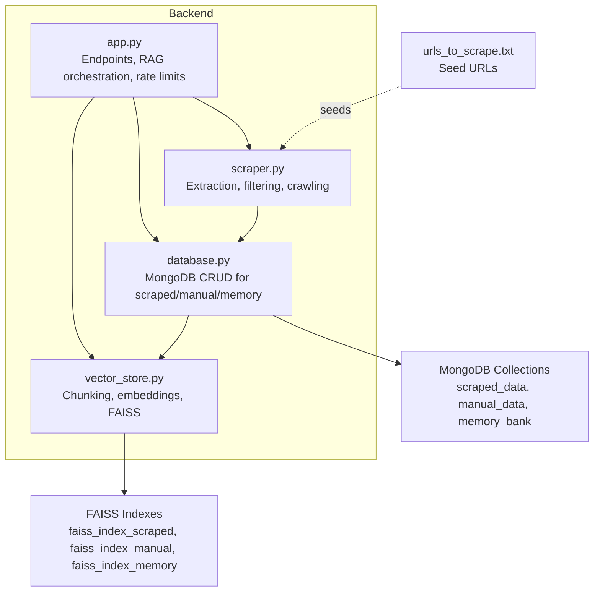
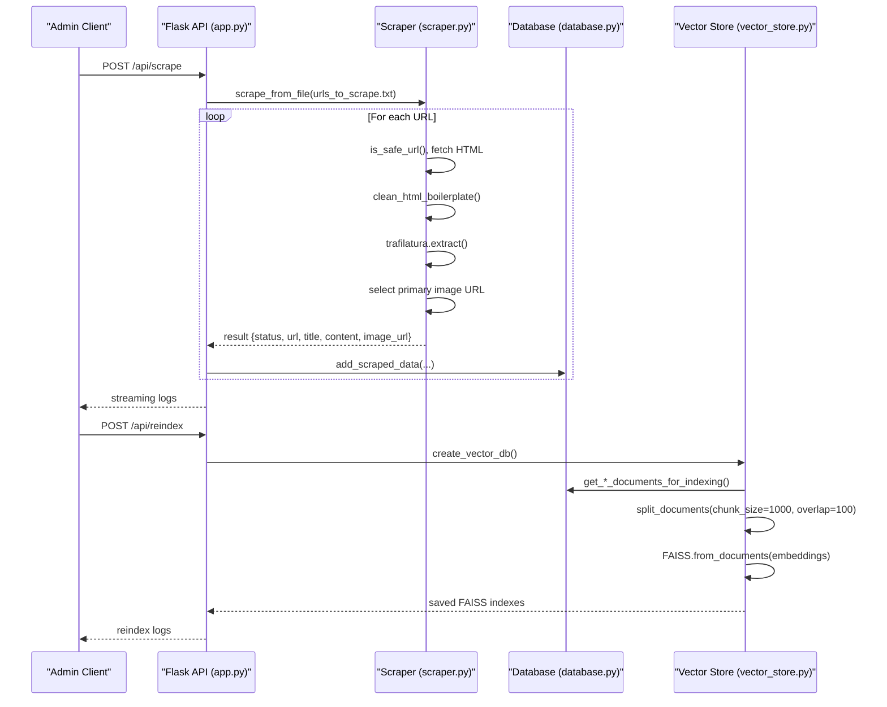
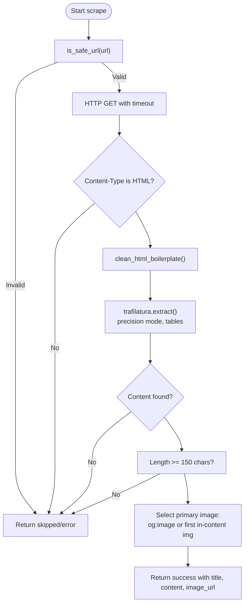
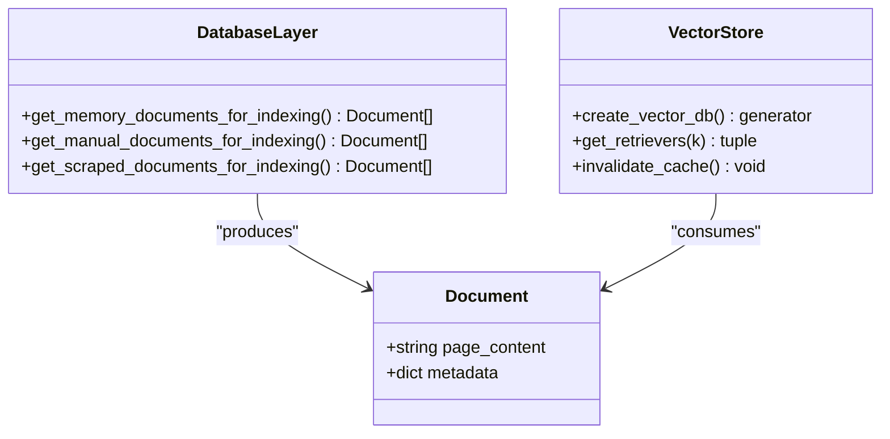
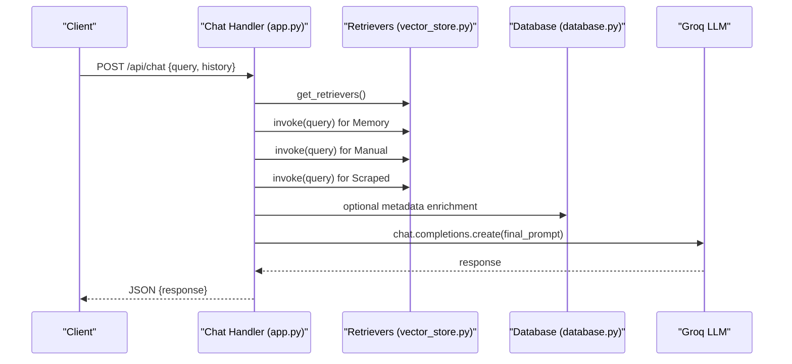
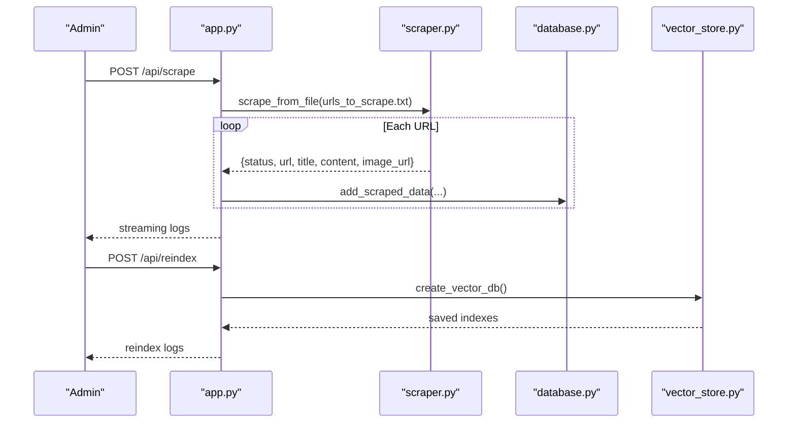
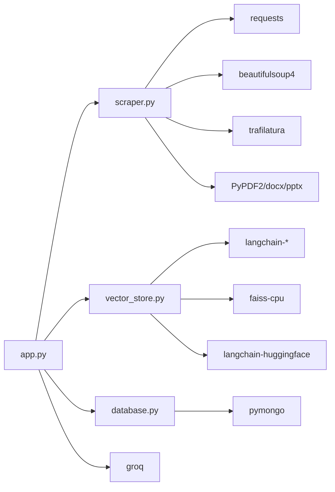

# Scraped Content Processing

<cite>
**Referenced Files in This Document**
- [scraper.py](file://backend/scraper.py)
- [vector_store.py](file://backend/vector_store.py)
- [database.py](file://backend/database.py)
- [app.py](file://backend/app.py)
- [urls_to_scrape.txt](file://backend/urls_to_scrape.txt)
- [requirements.txt](file://requirements.txt)
</cite>

## Table of Contents
1. [Introduction](#introduction)
2. [Project Structure](#project-structure)
3. [Core Components](#core-components)
4. [Architecture Overview](#architecture-overview)
5. [Detailed Component Analysis](#detailed-component-analysis)
6. [Dependency Analysis](#dependency-analysis)
7. [Performance Considerations](#performance-considerations)
8. [Troubleshooting Guide](#troubleshooting-guide)
9. [Conclusion](#conclusion)
10. [Appendices](#appendices)

## Introduction
This document explains how scraped content is processed within the conversation flow. It covers the web scraping pipeline, content extraction and preprocessing, vector search integration, and the end-to-end workflow from scraping to retrieval augmented generation (RAG). It also documents configuration, filtering, quality assurance, security measures, rate limiting, and content freshness management.

## Project Structure
The backend implements a modular pipeline:
- Web scraping and content extraction live in a dedicated module.
- Vector search indices are built and served by a separate module.
- Data persistence is handled by a database module.
- The Flask application orchestrates scraping, indexing, and chat retrieval.

**Diagram sources**
- [scraper.py:1-278](file://backend/scraper.py#L1-L278)
- [vector_store.py:1-115](file://backend/vector_store.py#L1-L115)
- [database.py:1-260](file://backend/database.py#L1-L260)
- [app.py:1-1192](file://backend/app.py#L1-L1192)
- [urls_to_scrape.txt:1-76](file://backend/urls_to_scrape.txt#L1-L76)

**Section sources**
- [app.py:1-1192](file://backend/app.py#L1-L1192)
- [requirements.txt:1-30](file://requirements.txt#L1-L30)

## Core Components
- Web Scraper and Extractor: Cleans HTML, extracts readable content, selects representative images, validates URLs, and filters low-quality content.
- Vector Store Builder: Splits documents into chunks, generates embeddings, and persists FAISS indexes for memory, manual, and scraped data.
- Database Layer: Persists scraped content with metadata and provides document factories for indexing.
- Conversation Orchestration: Streams scraping logs, triggers reindexing, and retrieves relevant knowledge from FAISS to augment the LLM prompt.

**Section sources**
- [scraper.py:1-278](file://backend/scraper.py#L1-L278)
- [vector_store.py:1-115](file://backend/vector_store.py#L1-L115)
- [database.py:1-260](file://backend/database.py#L1-L260)
- [app.py:800-858](file://backend/app.py#L800-L858)

## Architecture Overview
The conversation flow integrates scraping, persistence, indexing, and retrieval:

**Diagram sources**
- [app.py:800-858](file://backend/app.py#L800-L858)
- [scraper.py:152-167](file://backend/scraper.py#L152-L167)
- [database.py:150-195](file://backend/database.py#L150-L195)
- [vector_store.py:48-70](file://backend/vector_store.py#L48-L70)

## Detailed Component Analysis

### Web Scraping Pipeline
The scraper module provides:
- Safe URL validation to prevent SSRF to non-school domains and private IPs.
- HTML cleaning to remove boilerplate and noise.
- Content extraction using a precision-oriented strategy.
- Representative image selection prioritizing Open Graph meta and in-content images.
- Filtering for short or boilerplate content.
- Batch scraping from a seed file and deep crawling with link discovery and depth control.

**Diagram sources**
- [scraper.py:83-147](file://backend/scraper.py#L83-L147)

**Section sources**
- [scraper.py:12-27](file://backend/scraper.py#L12-L27)
- [scraper.py:69-81](file://backend/scraper.py#L69-L81)
- [scraper.py:83-147](file://backend/scraper.py#L83-L147)
- [scraper.py:168-277](file://backend/scraper.py#L168-L277)
- [urls_to_scrape.txt:1-76](file://backend/urls_to_scrape.txt#L1-L76)

### Content Extraction and Preprocessing
- HTML cleaning removes navigation, footers, sidebars, and ad-related selectors.
- Boilerplate removal improves readability and reduces noise.
- Content is normalized and trimmed to reduce empty lines.
- Minimum length threshold ensures meaningful content is indexed.

**Section sources**
- [scraper.py:69-81](file://backend/scraper.py#L69-L81)
- [scraper.py:141-147](file://backend/scraper.py#L141-L147)

### Security and Filtering
- Domain allowlist and suffix enforcement restrict scraping to the school domain.
- Private, loopback, and link-local IP detection prevents SSRF.
- Content-type checks ensure only HTML pages are processed.
- Ignored file extensions and paths reduce noise and resource usage during crawling.
- Rate limiting on scraping endpoints prevents abuse.

**Section sources**
- [scraper.py:12-27](file://backend/scraper.py#L12-L27)
- [scraper.py:183-186](file://backend/scraper.py#L183-L186)
- [app.py:804-804](file://backend/app.py#L804-L804)
- [app.py:825-825](file://backend/app.py#L825-L825)
- [app.py:851-851](file://backend/app.py#L851-L851)

### Integration with Vector Search
- Documents are fetched from MongoDB for memory, manual, and scraped data.
- Documents are transformed into LangChain Document objects with metadata.
- Recursive character splitting with 1000-character chunks and 100-character overlap balances granularity and continuity.
- Embeddings are generated using a local sentence transformer model.
- FAISS indexes are persisted per data type and cached for fast retrieval.

**Diagram sources**
- [database.py:96-104](file://backend/database.py#L96-L104)
- [database.py:140-148](file://backend/database.py#L140-L148)
- [database.py:186-195](file://backend/database.py#L186-L195)
- [vector_store.py:23-47](file://backend/vector_store.py#L23-L47)
- [vector_store.py:73-115](file://backend/vector_store.py#L73-L115)

**Section sources**
- [database.py:96-104](file://backend/database.py#L96-L104)
- [database.py:140-148](file://backend/database.py#L140-L148)
- [database.py:186-195](file://backend/database.py#L186-L195)
- [vector_store.py:23-47](file://backend/vector_store.py#L23-L47)
- [vector_store.py:73-115](file://backend/vector_store.py#L73-L115)

### Conversation Retrieval and Augmentation
- Retrievers are loaded once and cached to avoid repeated FAISS loads.
- The chat handler retrieves from three retrievers in order: memory, manual, then scraped.
- Retrieved documents are formatted into a structured context string with citations and optional images.
- The final prompt instructs the LLM to ground answers and cite sources.

**Diagram sources**
- [app.py:609-760](file://backend/app.py#L609-L760)
- [vector_store.py:73-115](file://backend/vector_store.py#L73-L115)
- [database.py:186-195](file://backend/database.py#L186-L195)

**Section sources**
- [app.py:609-760](file://backend/app.py#L609-L760)
- [vector_store.py:73-115](file://backend/vector_store.py#L73-L115)

### End-to-End Scraping Workflows
- Seed-based scraping: Admin initiates scraping from a URL list file. Results are streamed and persisted to MongoDB, then FAISS indexes are rebuilt.
- Deep crawling: Admin starts a crawl from a base URL with a configurable page limit. Discovered internal links are filtered and scraped similarly.

**Diagram sources**
- [app.py:800-820](file://backend/app.py#L800-L820)
- [scraper.py:152-167](file://backend/scraper.py#L152-L167)
- [database.py:152-168](file://backend/database.py#L152-L168)
- [vector_store.py:48-70](file://backend/vector_store.py#L48-L70)

**Section sources**
- [app.py:800-858](file://backend/app.py#L800-L858)
- [scraper.py:152-167](file://backend/scraper.py#L152-L167)
- [database.py:152-168](file://backend/database.py#L152-L168)
- [vector_store.py:48-70](file://backend/vector_store.py#L48-L70)

## Dependency Analysis
External libraries enable the pipeline:
- HTTP and parsing: requests, beautifulsoup4, trafilatura
- Office document parsing: PyPDF2, python-docx, python-pptx
- Vector search: langchain, langchain-huggingface, faiss-cpu
- LLM: groq
- Persistence: pymongo
- Utilities: bleach, pydantic, numpy

**Diagram sources**
- [app.py:1-30](file://backend/app.py#L1-L30)
- [scraper.py:1-11](file://backend/scraper.py#L1-L11)
- [vector_store.py:1-6](file://backend/vector_store.py#L1-L6)
- [database.py:1-8](file://backend/database.py#L1-L8)
- [requirements.txt:1-30](file://requirements.txt#L1-L30)

**Section sources**
- [requirements.txt:1-30](file://requirements.txt#L1-L30)

## Performance Considerations
- Chunking strategy: 1000-character chunks with 100-character overlap balance recall and context size.
- Embedding model: Local transformer avoids external API latency and cost.
- Retrieval caching: Module-level cache prevents repeated FAISS loads between requests.
- Auto-reindex on startup: Ensures indexes exist even if missing.
- Streamed processing: Logs and responses are streamed to improve perceived responsiveness.

[No sources needed since this section provides general guidance]

## Troubleshooting Guide
Common issues and resolutions:
- HTTP errors or timeouts: Inspect network connectivity and timeouts in the extractor.
- No content extracted: Verify HTML structure and ensure trafilatura can parse the page.
- Too short content: Increase minimum length threshold or adjust filtering heuristics.
- FAISS load failures: Confirm embeddings model availability and index path correctness.
- Rate limit exceeded: Reduce scraping frequency or adjust rate limits.
- SSRF blocked: Ensure URLs belong to the allowed domain and are not private IPs.
- Reindex not applied: Call invalidation after rebuilding indexes.

**Section sources**
- [scraper.py:149-150](file://backend/scraper.py#L149-L150)
- [vector_store.py:89-111](file://backend/vector_store.py#L89-L111)
- [app.py:320-322](file://backend/app.py#L320-L322)
- [app.py:804-804](file://backend/app.py#L804-L804)

## Conclusion
The system integrates robust web scraping, content quality assurance, and vector search to power a grounded, citation-aware assistant. The modular design separates concerns across extraction, persistence, indexing, and retrieval, enabling maintainable updates and scalable improvements.

[No sources needed since this section summarizes without analyzing specific files]

## Appendices

### Scraping Configuration and Controls
- Allowed domain and suffix enforcement.
- Private IP and loopback/IP range filtering.
- Content-type gating to HTML only.
- Ignored file extensions and paths during crawling.
- Minimum content length threshold.

**Section sources**
- [scraper.py:12-27](file://backend/scraper.py#L12-L27)
- [scraper.py:183-186](file://backend/scraper.py#L183-L186)
- [scraper.py:204-206](file://backend/scraper.py#L204-L206)
- [scraper.py:141-147](file://backend/scraper.py#L141-L147)

### Content Sanitization and Chunking
- HTML boilerplate removal and selector-based cleanup.
- Recursive character splitting with overlap for continuity.
- Metadata preservation for citations and images.

**Section sources**
- [scraper.py:69-81](file://backend/scraper.py#L69-L81)
- [vector_store.py:36-37](file://backend/vector_store.py#L36-L37)
- [database.py:186-195](file://backend/database.py#L186-L195)

### Embedding Generation and Indexing
- Sentence transformer embeddings locally.
- Separate FAISS indexes for memory, manual, and scraped data.
- Cached retrievers for efficient retrieval.

**Section sources**
- [vector_store.py:51-51](file://backend/vector_store.py#L51-L51)
- [vector_store.py:85-85](file://backend/vector_store.py#L85-L85)
- [vector_store.py:114-115](file://backend/vector_store.py#L114-L115)

### Conversation Flow Details
- Retrieval order: memory → manual → scraped.
- Structured context assembly with citations and optional images.
- Final prompt grounding and formatting rules.

**Section sources**
- [app.py:616-676](file://backend/app.py#L616-L676)
- [app.py:682-740](file://backend/app.py#L682-L740)

### Security and Rate Limiting
- CSRF protection for admin endpoints.
- Rate limiting on scraping, crawling, and reindexing.
- Session permanence and security headers.
- CORS restricted to allowed origins.

**Section sources**
- [app.py:151-159](file://backend/app.py#L151-L159)
- [app.py:99-115](file://backend/app.py#L99-L115)
- [app.py:267-292](file://backend/app.py#L267-L292)
- [app.py:255-262](file://backend/app.py#L255-L262)