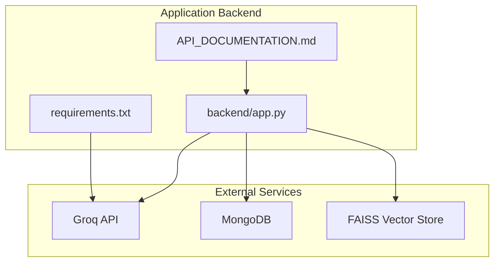
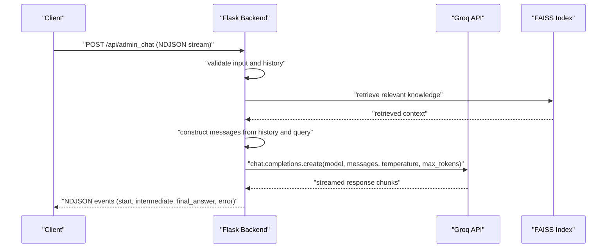
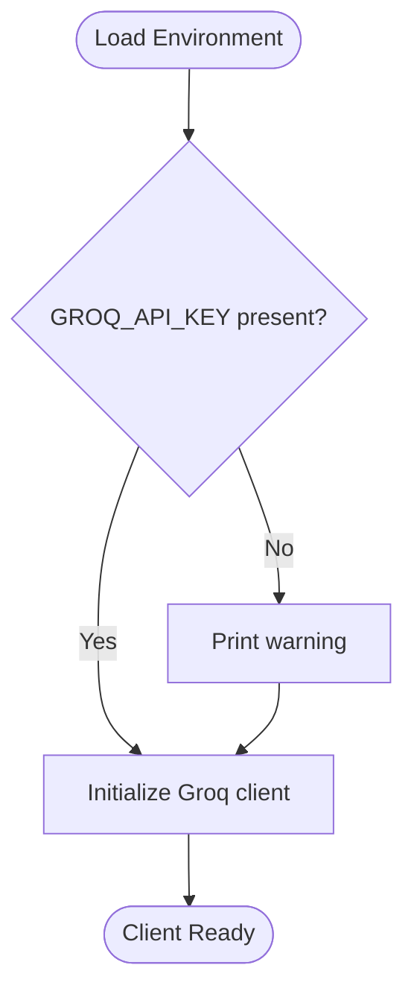
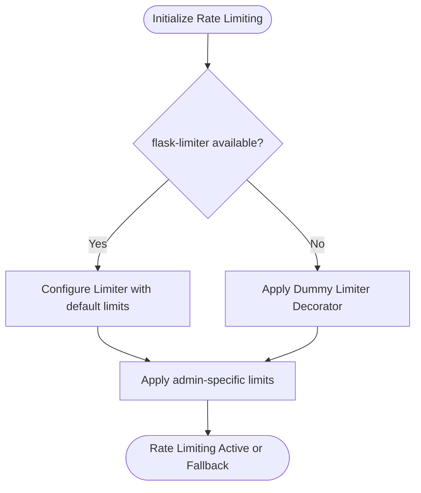
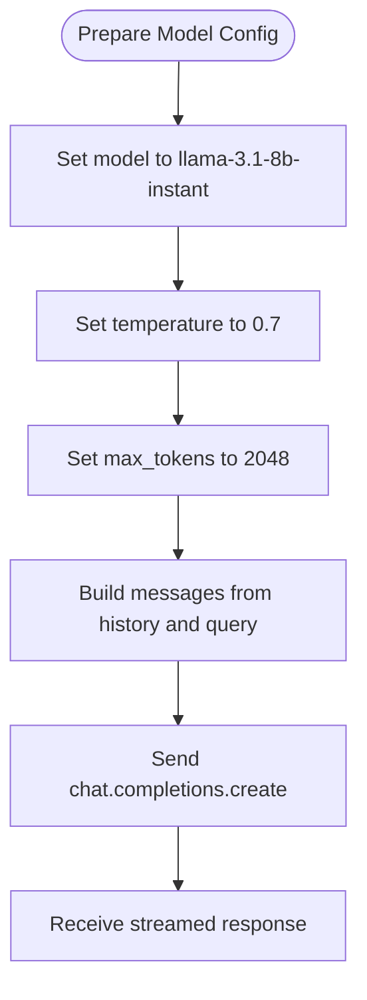
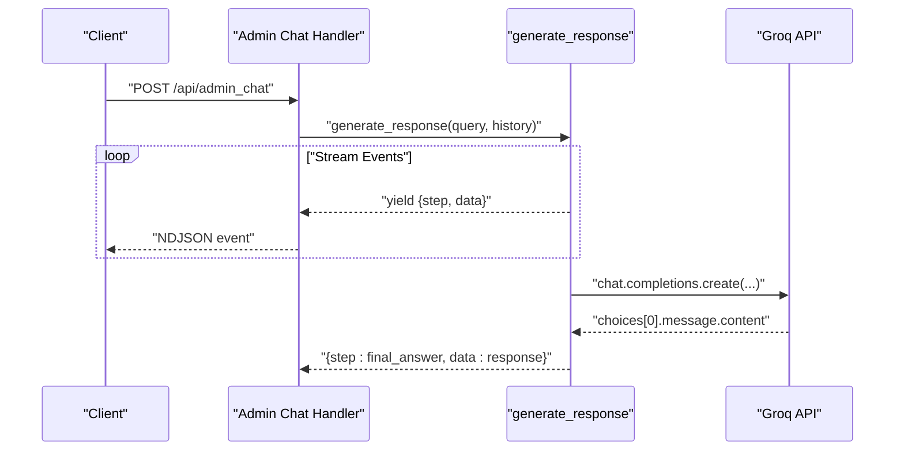
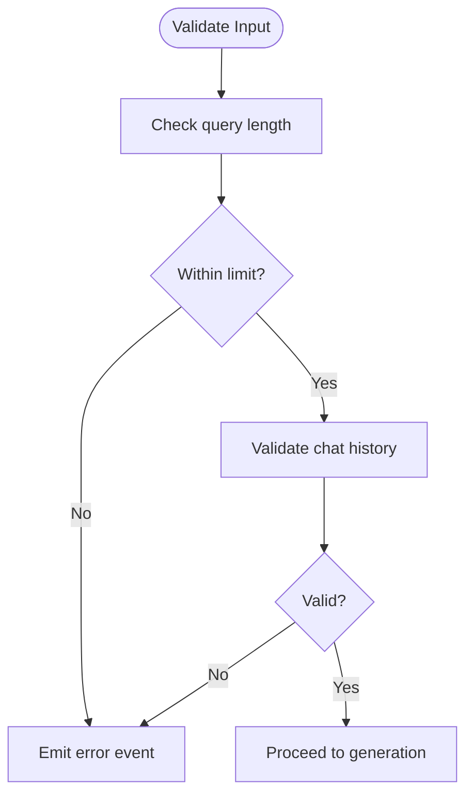
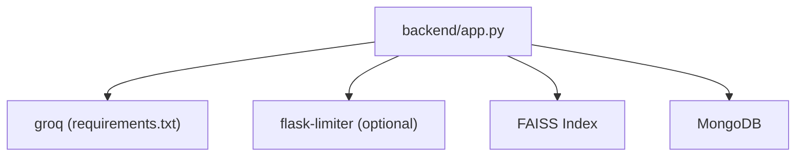

# Groq API Integration

<cite>
**Referenced Files in This Document**
- [backend/app.py](file://backend/app.py)
- [API_DOCUMENTATION.md](file://API_DOCUMENTATION.md)
- [requirements.txt](file://requirements.txt)
</cite>

## Table of Contents
1. [Introduction](#introduction)
2. [Project Structure](#project-structure)
3. [Core Components](#core-components)
4. [Architecture Overview](#architecture-overview)
5. [Detailed Component Analysis](#detailed-component-analysis)
6. [Dependency Analysis](#dependency-analysis)
7. [Performance Considerations](#performance-considerations)
8. [Troubleshooting Guide](#troubleshooting-guide)
9. [Conclusion](#conclusion)

## Introduction
This document provides comprehensive documentation for integrating and configuring the Groq API within the application. It covers client initialization, API key management, authentication setup, and the Llama 3.1 8B model configuration. It also explains chat completion API usage for conversational responses, error handling strategies, rate limiting considerations, fallback mechanisms, configuration examples, environment variable setup, troubleshooting, cost optimization, model selection criteria, and performance tuning for production deployments.

## Project Structure
The Groq integration is implemented in the backend module alongside other application features such as file uploads, database connectivity, and vector search. The primary integration resides in the backend application file, while supporting documentation and requirements are maintained separately.

**Diagram sources**
- [backend/app.py](file://backend/app.py)
- [requirements.txt](file://requirements.txt)
- [API_DOCUMENTATION.md](file://API_DOCUMENTATION.md)

**Section sources**
- [backend/app.py](file://backend/app.py)
- [API_DOCUMENTATION.md](file://API_DOCUMENTATION.md)
- [requirements.txt](file://requirements.txt)

## Core Components
- Groq Client Initialization: The Groq client is initialized using an API key loaded from environment variables. If the environment variable is missing, a warning is printed and the client is still instantiated.
- Authentication Setup: Authentication relies on the presence of a valid GROQ_API_KEY environment variable. The client uses this key to authorize requests to the Groq API.
- Chat Completion Integration: The application constructs conversation messages from user queries and chat history, then submits them to the Groq chat completions endpoint using the Llama 3.1 8B model.
- Rate Limiting: The application implements rate limiting using Flask-Limiter with graceful fallback when the library is unavailable.
- Input Validation and Limits: The application enforces input length limits and validates chat history to ensure safe and efficient processing.

**Section sources**
- [backend/app.py:67-71](file://backend/app.py#L67-L71)
- [backend/app.py:95-116](file://backend/app.py#L95-L116)
- [backend/app.py:589-603](file://backend/app.py#L589-L603)
- [backend/app.py:742-758](file://backend/app.py#L742-L758)
- [API_DOCUMENTATION.md](file://API_DOCUMENTATION.md)

## Architecture Overview
The application integrates with Groq for AI-powered chat responses. The backend receives user queries and chat history, retrieves relevant knowledge via vector search, constructs a prompt, and sends it to the Groq API for completion. Responses are streamed back to the client as NDJSON events.

**Diagram sources**
- [backend/app.py:589-603](file://backend/app.py#L589-L603)
- [backend/app.py:742-758](file://backend/app.py#L742-L758)

## Detailed Component Analysis

### Groq Client Initialization and Authentication
- Environment Variable Loading: The application loads the GROQ_API_KEY from environment variables and initializes the Groq client with it.
- Warning Behavior: If the environment variable is not set, a warning is printed, but the client is still instantiated, potentially leading to runtime errors when making requests.
- Import Statement: The Groq library is imported to enable client instantiation and API calls.

**Diagram sources**
- [backend/app.py:67-71](file://backend/app.py#L67-L71)

**Section sources**
- [backend/app.py:67-71](file://backend/app.py#L67-L71)

### Rate Limiting Configuration
- Library Integration: The application attempts to integrate Flask-Limiter to enforce rate limits.
- Fallback Mechanism: If Flask-Limiter is not installed, the application prints a warning and applies a dummy limiter decorator that exempts routes without enforcing limits.
- Admin Route Limits: The admin chat route is configured with a stricter rate limit compared to the public route.

**Diagram sources**
- [backend/app.py:95-116](file://backend/app.py#L95-L116)
- [backend/app.py:591](file://backend/app.py#L591)

**Section sources**
- [backend/app.py:95-116](file://backend/app.py#L95-L116)
- [backend/app.py:591](file://backend/app.py#L591)

### Llama 3.1 8B Model Configuration
- Model Selection: The application uses the "llama-3.1-8b-instant" model for chat completions.
- Temperature Setting: The temperature is set to 0.7 to balance creativity and coherence.
- Token Limits: The maximum number of tokens generated is set to 2048.
- Message Construction: The application converts chat history into a structured messages array, ensuring roles and content are properly formatted before sending to the API.

**Diagram sources**
- [backend/app.py:750-755](file://backend/app.py#L750-L755)
- [backend/app.py:742-748](file://backend/app.py#L742-L748)

**Section sources**
- [backend/app.py:750-755](file://backend/app.py#L750-L755)
- [backend/app.py:742-748](file://backend/app.py#L742-L748)

### Chat Completion API Usage
- Endpoint Definition: The admin chat endpoint streams responses using NDJSON format for real-time updates.
- Streaming Implementation: The backend yields structured events (start, intermediate steps, final_answer, error) to the client.
- Error Handling: Exceptions during generation are caught and reported as error events to the client.

**Diagram sources**
- [backend/app.py:589-603](file://backend/app.py#L589-L603)
- [backend/app.py:605-607](file://backend/app.py#L605-L607)
- [backend/app.py:750-758](file://backend/app.py#L750-L758)

**Section sources**
- [backend/app.py:589-603](file://backend/app.py#L589-L603)
- [backend/app.py:605-607](file://backend/app.py#L605-L607)
- [backend/app.py:750-758](file://backend/app.py#L750-L758)

### Input Validation and Limits
- Query Length Validation: The application checks the length of the user query against a predefined maximum and responds with an error event if exceeded.
- Chat History Validation: The application validates chat history to ensure it adheres to expected formats and limits.
- Additional Limits: The documentation specifies broader input limits for text content, query length, and bug descriptions.

**Diagram sources**
- [backend/app.py:596-599](file://backend/app.py#L596-L599)
- [backend/app.py:601-602](file://backend/app.py#L601-L602)

**Section sources**
- [backend/app.py:596-599](file://backend/app.py#L596-L599)
- [backend/app.py:601-602](file://backend/app.py#L601-L602)
- [API_DOCUMENTATION.md](file://API_DOCUMENTATION.md)

## Dependency Analysis
- Groq Library: The application depends on the Groq Python library for client instantiation and API interactions.
- Flask-Limiter: Optional dependency for rate limiting; the application gracefully handles its absence.
- Vector Store and Database: While not directly related to Groq, the application integrates FAISS and MongoDB to support retrieval-augmented generation.

**Diagram sources**
- [requirements.txt](file://requirements.txt)
- [backend/app.py](file://backend/app.py)

**Section sources**
- [requirements.txt](file://requirements.txt)
- [backend/app.py](file://backend/app.py)

## Performance Considerations
- Model Selection: The Llama 3.1 8B Instant model balances speed and quality for conversational tasks. Consider switching to the non-streaming variant if latency is critical and streaming is not required.
- Token Management: Keep prompts concise and leverage retrieval-augmented generation to minimize token usage while maintaining relevance.
- Rate Limiting: Adjust default and admin-specific rate limits based on observed traffic and API quotas to avoid throttling.
- Caching: Implement caching for repeated queries or embeddings to reduce redundant API calls.
- Concurrency: Monitor concurrent requests and scale horizontally if throughput demands increase.

## Troubleshooting Guide
- Missing API Key: If the GROQ_API_KEY environment variable is not set, a warning is printed and subsequent API calls will fail. Ensure the environment variable is configured before deployment.
- Rate Limiting Errors: The application returns standardized error responses for rate limit violations. Review and adjust rate limits or implement client-side retry logic with exponential backoff.
- Input Validation Failures: Queries exceeding the maximum length or invalid chat history formats will trigger error events. Validate inputs on the client side to prevent unnecessary server load.
- Stream Handling: Ensure clients consume NDJSON streams correctly and handle partial events to avoid timeouts or malformed responses.
- Environment Setup: Confirm that the Groq library is installed and available in the runtime environment.

**Section sources**
- [backend/app.py:67-71](file://backend/app.py#L67-L71)
- [backend/app.py:95-116](file://backend/app.py#L95-L116)
- [backend/app.py:596-599](file://backend/app.py#L596-L599)
- [API_DOCUMENTATION.md](file://API_DOCUMENTATION.md)

## Conclusion
The application integrates Groq’s Llama 3.1 8B model to deliver conversational AI capabilities with robust input validation, rate limiting, and streaming responses. Proper environment configuration, careful rate limit tuning, and adherence to input constraints are essential for reliable operation. For production deployments, consider model selection trade-offs, token optimization, and caching strategies to achieve cost-effective and performant AI-assisted experiences.