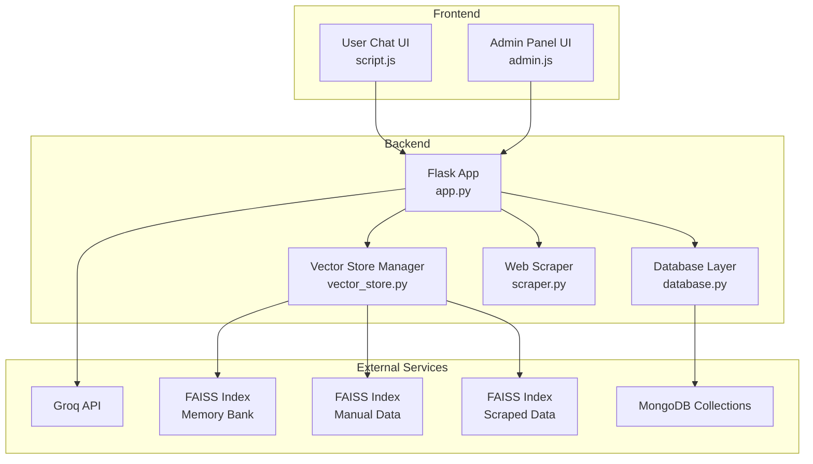
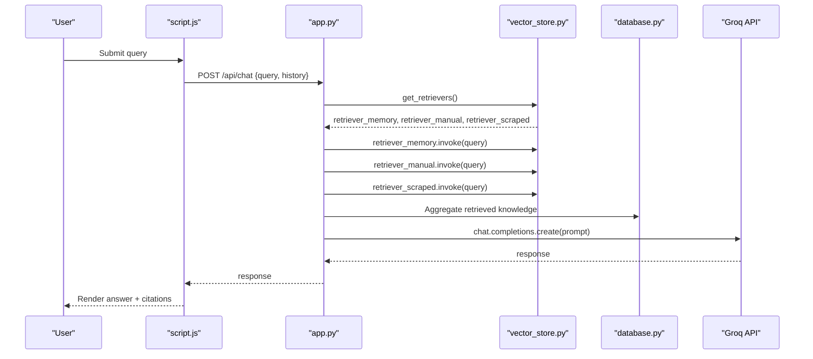
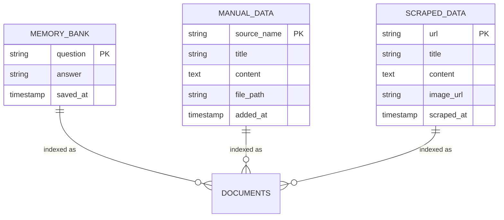
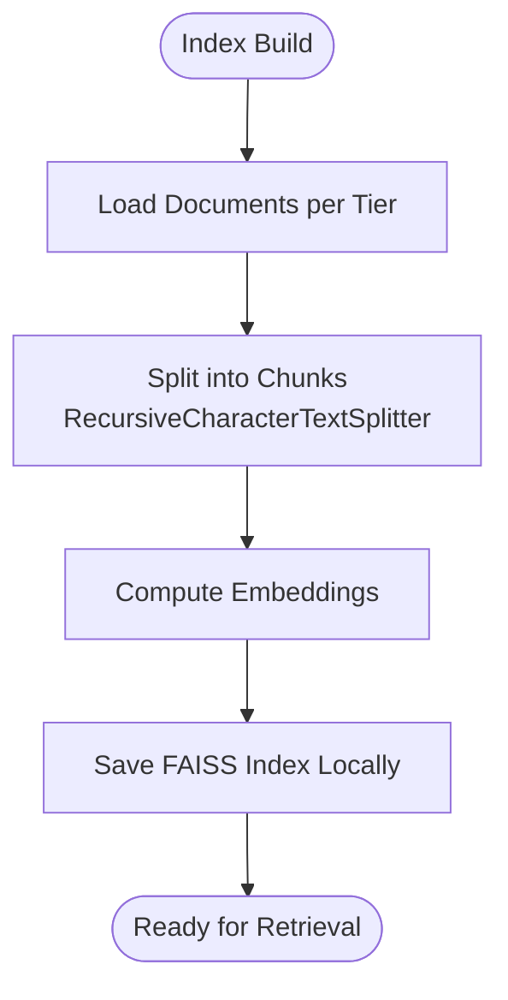
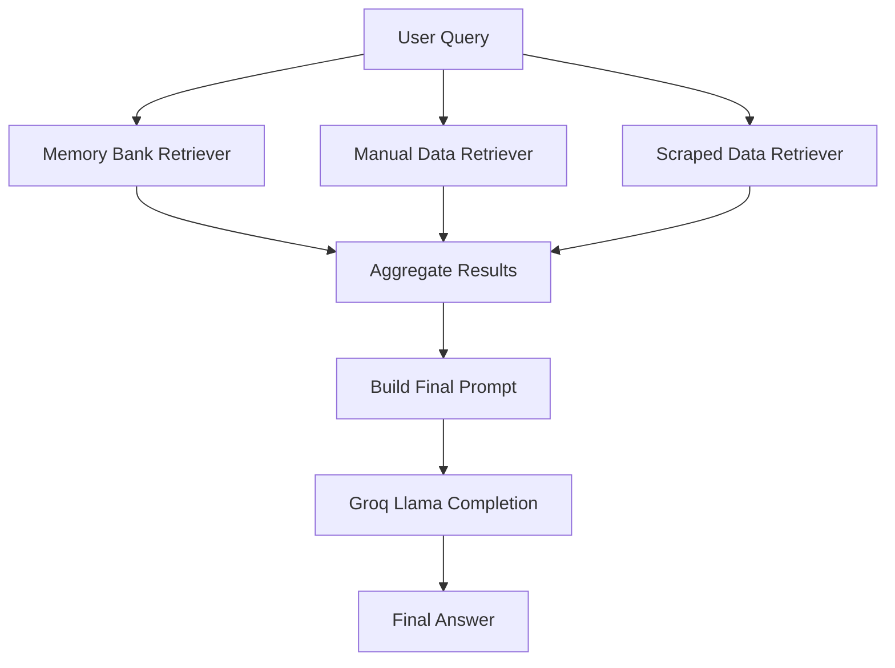
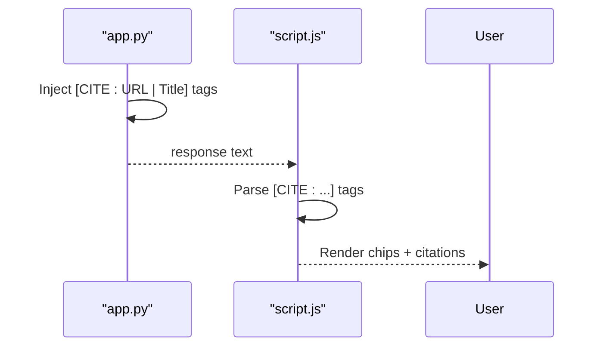
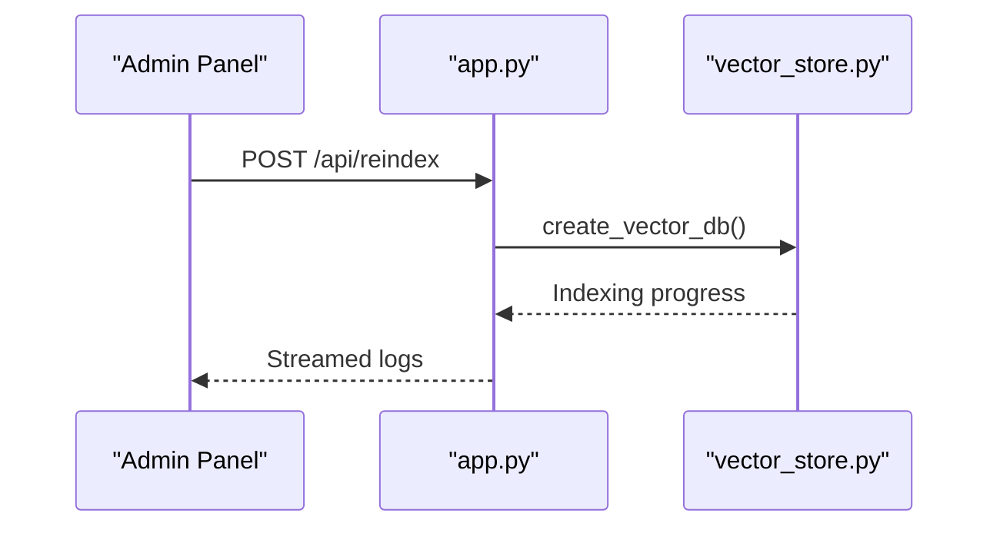
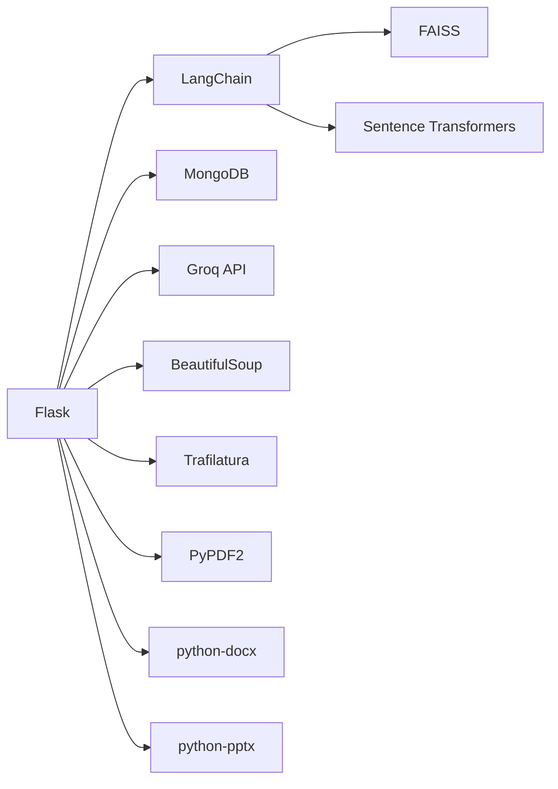

# Knowledge Retrieval System

<cite>
**Referenced Files in This Document**
- [app.py](file://backend/app.py)
- [vector_store.py](file://backend/vector_store.py)
- [database.py](file://backend/database.py)
- [scraper.py](file://backend/scraper.py)
- [API_DOCUMENTATION.md](file://API_DOCUMENTATION.md)
- [README.md](file://README.md)
- [urls_to_scrape.txt](file://backend/urls_to_scrape.txt)
- [requirements.txt](file://requirements.txt)
- [script.js](file://frontend/script.js)
- [admin.js](file://frontend/admin.js)
</cite>

## Table of Contents
1. [Introduction](#introduction)
2. [Project Structure](#project-structure)
3. [Core Components](#core-components)
4. [Architecture Overview](#architecture-overview)
5. [Detailed Component Analysis](#detailed-component-analysis)
6. [Dependency Analysis](#dependency-analysis)
7. [Performance Considerations](#performance-considerations)
8. [Troubleshooting Guide](#troubleshooting-guide)
9. [Conclusion](#conclusion)
10. [Appendices](#appendices)

## Introduction
This document describes the knowledge retrieval system and multi-source content processing pipeline for the DamayAI Assistant. The system implements a three-tier knowledge base architecture:
- Memory Bank: curated Q&A pairs stored in MongoDB
- Manual Data: user-uploaded content (PDF, DOCX, PPTX, TXT)
- Scraped Data: web content extracted from predefined URLs

It integrates FAISS vector search for semantic similarity matching, LangChain for document chunking and embeddings, and a Flask backend orchestrating retrieval, context construction, and AI generation. The frontend provides both public chat and admin panels for managing knowledge sources and monitoring system operations.

## Project Structure
The repository follows a clear separation of concerns:
- Backend: Flask application, vector store management, database access, and scraping utilities
- Frontend: Static HTML/CSS/JS for user chat and admin panel
- Data assets: Initial URL list for scraping and FAISS index directories

**Diagram sources**
- [app.py](file://backend/app.py)
- [vector_store.py](file://backend/vector_store.py)
- [database.py](file://backend/database.py)
- [scraper.py](file://backend/scraper.py)

**Section sources**
- [README.md](file://README.md)
- [API_DOCUMENTATION.md](file://API_DOCUMENTATION.md)

## Core Components
- Flask Application: Orchestrates retrieval, context assembly, and AI generation; exposes admin and public endpoints; manages caching and rate limiting.
- Vector Store Manager: Creates and loads FAISS indexes for each knowledge tier; caches retrievers to avoid repeated loading.
- Database Layer: Provides CRUD operations for Memory Bank, Manual Data, Scraped Data, and Bug Reports; formats documents for indexing.
- Scraper: Extracts content from URLs, cleans HTML, and stores structured data with optional thumbnails.
- Frontend: User chat interface and admin panel for data management and system operations.

**Section sources**
- [app.py](file://backend/app.py)
- [vector_store.py](file://backend/vector_store.py)
- [database.py](file://backend/database.py)
- [scraper.py](file://backend/scraper.py)
- [script.js](file://frontend/script.js)
- [admin.js](file://frontend/admin.js)

## Architecture Overview
The retrieval pipeline operates in three stages:
1. Memory Bank search: highest relevance for curated Q&A
2. Manual Data search: user-uploaded content
3. Scraped Data search: web-extracted content

Results are aggregated, ranked, and injected into a prompt for the Groq Llama model. Citations are embedded using a special tag format and rendered as interactive chips in the frontend.

**Diagram sources**
- [app.py](file://backend/app.py)
- [vector_store.py](file://backend/vector_store.py)
- [database.py](file://backend/database.py)
- [script.js](file://frontend/script.js)

## Detailed Component Analysis

### Three-Tier Knowledge Base Architecture
- Memory Bank: Stores question-answer pairs; indexed as distinct documents with metadata for provenance.
- Manual Data: Indexed from uploaded files; metadata includes source name and title.
- Scraped Data: Indexed from web pages; metadata includes URL, title, and optional image URL.

**Diagram sources**
- [database.py](file://backend/database.py)

**Section sources**
- [database.py](file://backend/database.py)
- [app.py](file://backend/app.py)

### FAISS Vector Search Implementation
- Embeddings: Sentence Transformers model "all-MiniLM-L6-v2" via LangChain HuggingFaceEmbeddings.
- Chunking: RecursiveCharacterTextSplitter with chunk size 1000 and overlap 100.
- Indexing: FAISS.from_documents saves local indices under dedicated paths.
- Retrieval: Cached retrievers with configurable k=2; lazy loading on first use.

**Diagram sources**
- [vector_store.py](file://backend/vector_store.py)

**Section sources**
- [vector_store.py](file://backend/vector_store.py)
- [requirements.txt](file://requirements.txt)

### Chunking Strategies and Semantic Similarity Matching
- Chunk size: 1000 characters; overlap: 100 characters to preserve context boundaries.
- Metadata preserved per chunk to support accurate citation attribution.
- Similarity search uses FAISS retrievers with k=2; results combined across tiers.

**Section sources**
- [vector_store.py](file://backend/vector_store.py)

### Retrieval Orchestration and Context Construction
- Retrievers are fetched once and cached globally to minimize latency.
- Queries are executed against each tier sequentially; results aggregated into a unified context string.
- Final prompt includes grounding instructions, citation rules, and optional image tags.

**Diagram sources**
- [app.py](file://backend/app.py)

**Section sources**
- [app.py](file://backend/app.py)

### Citation System and Source Attribution
- Citations are embedded using a special tag format in generated answers.
- Frontend parses citations and renders them as clickable chips with either external links or local info.
- Unique citations are deduplicated and presented alongside the answer.

**Diagram sources**
- [app.py](file://backend/app.py)
- [script.js](file://frontend/script.js)

**Section sources**
- [app.py](file://backend/app.py)
- [script.js](file://frontend/script.js)

### Content Verification Processes
- SSRF protection: Only URLs ending with the school domain are allowed.
- Content filtering: Minimum content length threshold prevents boilerplate noise.
- Image selection: Prefers Open Graph image, otherwise first in-content image meeting size thresholds.

**Section sources**
- [scraper.py](file://backend/scraper.py)

### Knowledge Aggregation and Context Construction
- Retrieved documents are formatted into a structured context string with source type, title, URL, and content.
- Optional image URLs are included when present in metadata.
- Chat history is appended to the final prompt to maintain conversational grounding.

**Section sources**
- [app.py](file://backend/app.py)

### Admin and Public Workflows
- Public chat: Stateless, rate-limited endpoint for user queries.
- Admin chat: Streaming endpoint for testing retrieval and debugging.
- Data management: Endpoints to add, update, delete, and view knowledge sources.
- System operations: Rebuild FAISS indexes, delete FAISS directories, and reset database.

**Diagram sources**
- [app.py](file://backend/app.py)
- [vector_store.py](file://backend/vector_store.py)
- [admin.js](file://frontend/admin.js)

**Section sources**
- [API_DOCUMENTATION.md](file://API_DOCUMENTATION.md)
- [admin.js](file://frontend/admin.js)

## Dependency Analysis
External libraries and integrations:
- Flask: Web framework and routing
- LangChain ecosystem: Embeddings, text splitters, FAISS integration
- FAISS: Vector similarity search
- MongoDB: Persistent storage for knowledge sources
- Groq: LLM inference for answer generation
- BeautifulSoup/Trafilatura: Web content extraction
- PyPDF2/python-docx/PPTX: Document parsing

**Diagram sources**
- [requirements.txt](file://requirements.txt)
- [app.py](file://backend/app.py)

**Section sources**
- [requirements.txt](file://requirements.txt)

## Performance Considerations
- Caching: Module-level retriever cache avoids repeated FAISS loads; invalidated on reindex or deletion.
- Chunk sizing: Balanced chunk size and overlap optimize recall vs. context length.
- Rate limiting: Protects endpoints from abuse; reduces load on vector store and LLM.
- Streaming: Admin chat streams intermediate steps for better UX and debugging.
- Auto-reindex: On startup, missing FAISS directories trigger rebuild to ensure availability.

**Section sources**
- [app.py](file://backend/app.py)
- [vector_store.py](file://backend/vector_store.py)

## Troubleshooting Guide
Common issues and resolutions:
- Missing FAISS indexes: Startup auto-reindex rebuilds indexes from database; ensure database connectivity.
- Empty or low-quality retrieval: Verify content length thresholds and ensure sufficient indexed documents.
- SSRF errors: Only URLs within the allowed domain are accepted; confirm URL list and network reachability.
- Rate limits: Exceeded limits return standardized error responses; adjust client-side retry/backoff.
- Session/CSRF failures: Admin endpoints require valid session and CSRF token; refresh token if stale.

**Section sources**
- [app.py](file://backend/app.py)
- [scraper.py](file://backend/scraper.py)
- [API_DOCUMENTATION.md](file://API_DOCUMENTATION.md)

## Conclusion
The knowledge retrieval system combines curated Memory Bank, user-uploaded Manual Data, and web-extracted Scraped Data into a cohesive FAISS-powered semantic search. The Flask backend orchestrates retrieval, context assembly, and AI generation, while the frontend delivers a responsive chat experience with citation rendering. Robust indexing, caching, and verification mechanisms ensure reliable and accurate responses.

## Appendices

### Retrieval Workflow Examples
- Public chat: User submits a query; backend retrieves from all tiers, constructs context, and generates a grounded answer with citations.
- Admin chat: Streams intermediate steps (memory/manual/scrape found/not found) for debugging retrieval quality.
- Knowledge management: Admin adds manual text/file, scrapes URLs, rebuilds indexes, and monitors dashboard statistics.

**Section sources**
- [app.py](file://backend/app.py)
- [admin.js](file://frontend/admin.js)
- [API_DOCUMENTATION.md](file://API_DOCUMENTATION.md)

### Knowledge Base Management
- Add Manual Text/File: Validates content length and extracts text from supported formats.
- Save Memory: Stores question-answer pairs with deduplication on question.
- Scraping: Reads initial URLs, validates domain, extracts content and images, and persists to database.

**Section sources**
- [app.py](file://backend/app.py)
- [database.py](file://backend/database.py)
- [scraper.py](file://backend/scraper.py)
- [urls_to_scrape.txt](file://backend/urls_to_scrape.txt)

### Performance Optimization Techniques
- Tune chunk size and overlap for domain-specific recall.
- Adjust retriever k and rerank results post-search if needed.
- Monitor FAISS index sizes and rebuild periodically after large updates.
- Use streaming responses for long-running operations (scrape/reindex).
- Implement CDN or proxy caching for frequently accessed static assets.

**Section sources**
- [vector_store.py](file://backend/vector_store.py)
- [app.py](file://backend/app.py)