# Manual Data Retrieval

<cite>
**Referenced Files in This Document**
- [backend/app.py](file://backend/app.py)
- [backend/database.py](file://backend/database.py)
- [backend/vector_store.py](file://backend/vector_store.py)
- [backend/scraper.py](file://backend/scraper.py)
- [backend/urls_to_scrape.txt](file://backend/urls_to_scrape.txt)
- [frontend/admin-add-data.html](file://frontend/admin-add-data.html)
- [frontend/admin-data-bank.html](file://frontend/admin-data-bank.html)
- [frontend/admin.js](file://frontend/admin.js)
- [requirements.txt](file://requirements.txt)
</cite>

## Table of Contents
1. [Introduction](#introduction)
2. [Project Structure](#project-structure)
3. [Core Components](#core-components)
4. [Architecture Overview](#architecture-overview)
5. [Detailed Component Analysis](#detailed-component-analysis)
6. [Dependency Analysis](#dependency-analysis)
7. [Performance Considerations](#performance-considerations)
8. [Troubleshooting Guide](#troubleshooting-guide)
9. [Conclusion](#conclusion)
10. [Appendices](#appendices)

## Introduction
This document explains the manual data retrieval and user-generated content processing pipeline for DamayAI Assistant. It covers how administrators upload and manage content, how files are extracted and indexed, how embeddings are generated, and how the system retrieves relevant knowledge for user queries. It also details validation, security measures, and operational best practices for reliable content ingestion and retrieval.

## Project Structure
The system is organized into:
- Backend API and processing logic (Flask app, vector store, database, scraper)
- Frontend admin panel for content management
- Vector index storage and MongoDB collections

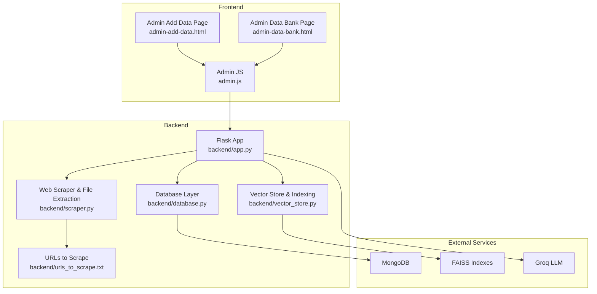

**Diagram sources**
- [backend/app.py:1-1192](file://backend/app.py#L1-L1192)
- [backend/database.py:1-260](file://backend/database.py#L1-L260)
- [backend/vector_store.py:1-115](file://backend/vector_store.py#L1-L115)
- [backend/scraper.py:1-278](file://backend/scraper.py#L1-L278)
- [backend/urls_to_scrape.txt:1-76](file://backend/urls_to_scrape.txt#L1-L76)
- [frontend/admin-add-data.html:1-113](file://frontend/admin-add-data.html#L1-L113)
- [frontend/admin-data-bank.html:1-98](file://frontend/admin-data-bank.html#L1-L98)
- [frontend/admin.js:1-1108](file://frontend/admin.js#L1-L1108)

**Section sources**
- [backend/app.py:1-1192](file://backend/app.py#L1-L1192)
- [backend/database.py:1-260](file://backend/database.py#L1-L260)
- [backend/vector_store.py:1-115](file://backend/vector_store.py#L1-L115)
- [backend/scraper.py:1-278](file://backend/scraper.py#L1-L278)
- [frontend/admin-add-data.html:1-113](file://frontend/admin-add-data.html#L1-L113)
- [frontend/admin-data-bank.html:1-98](file://frontend/admin-data-bank.html#L1-L98)
- [frontend/admin.js:1-1108](file://frontend/admin.js#L1-L1108)

## Core Components
- Admin upload endpoints for manual text and files
- File extraction for PDF, DOCX, PPTX, TXT
- Vector indexing with FAISS and embeddings
- Retrieval across three knowledge sources
- Admin management UI for content and operations

**Section sources**
- [backend/app.py:498-566](file://backend/app.py#L498-L566)
- [backend/app.py:520-566](file://backend/app.py#L520-L566)
- [backend/scraper.py:33-66](file://backend/scraper.py#L33-L66)
- [backend/vector_store.py:23-71](file://backend/vector_store.py#L23-L71)
- [backend/vector_store.py:73-115](file://backend/vector_store.py#L73-L115)

## Architecture Overview
The system ingests content via two primary paths:
- Manual ingestion: text or uploaded files
- Web scraping: predefined URLs and optional deep crawling

Both paths produce normalized documents with metadata, which are chunked and embedded, then persisted to FAISS indexes. During retrieval, the system queries all three indexes and synthesizes a final response with citations.

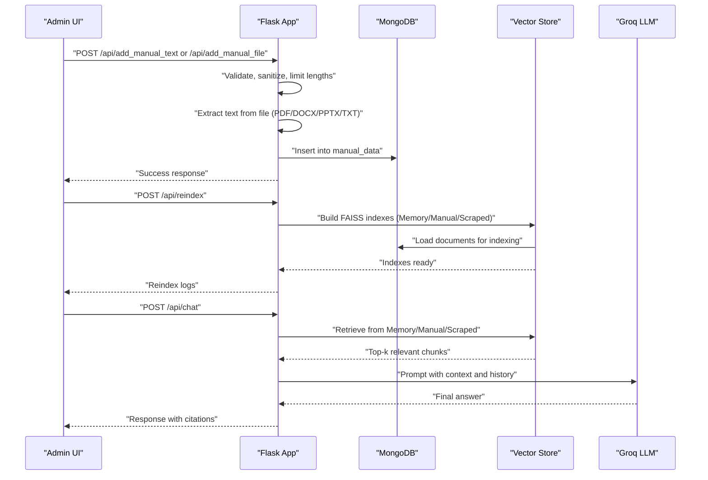

**Diagram sources**
- [backend/app.py:498-566](file://backend/app.py#L498-L566)
- [backend/app.py:848-858](file://backend/app.py#L848-L858)
- [backend/app.py:609-760](file://backend/app.py#L609-L760)
- [backend/vector_store.py:48-71](file://backend/vector_store.py#L48-L71)
- [backend/database.py:61-104](file://backend/database.py#L61-L104)

## Detailed Component Analysis

### Manual Data Upload Workflow
- Text ingestion: validates length and inserts into manual_data collection.
- File ingestion: accepts PDF, DOCX, PPTX, TXT; extracts text; enforces size limits; stores file path; inserts into manual_data.

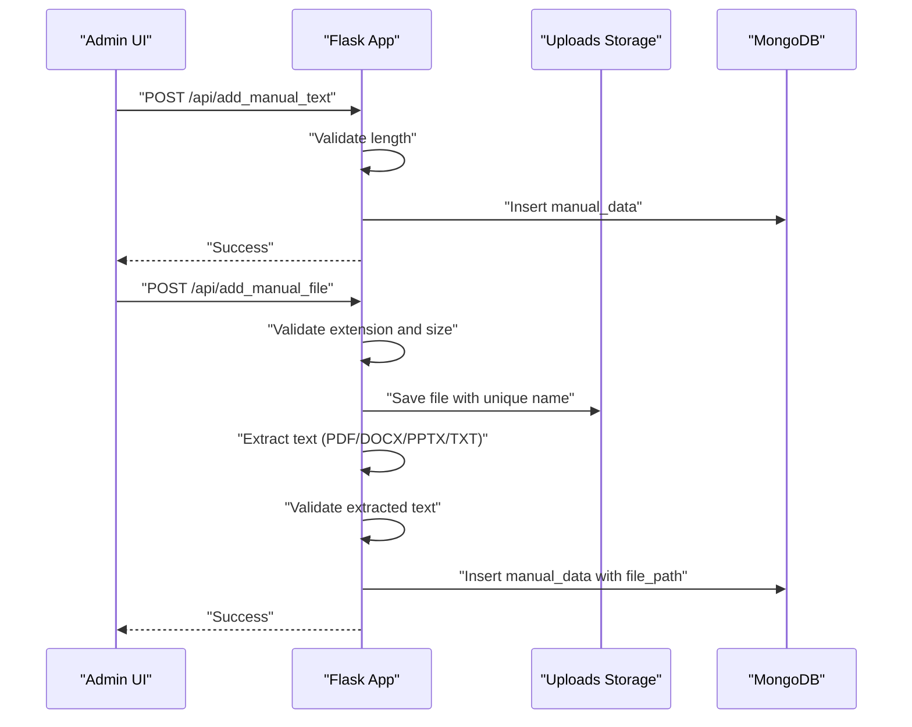

**Diagram sources**
- [backend/app.py:498-518](file://backend/app.py#L498-L518)
- [backend/app.py:520-566](file://backend/app.py#L520-L566)
- [backend/scraper.py:33-66](file://backend/scraper.py#L33-L66)
- [backend/database.py:61-79](file://backend/database.py#L61-L79)

**Section sources**
- [backend/app.py:498-518](file://backend/app.py#L498-L518)
- [backend/app.py:520-566](file://backend/app.py#L520-L566)
- [backend/scraper.py:33-66](file://backend/scraper.py#L33-L66)
- [backend/database.py:61-79](file://backend/database.py#L61-L79)

### File Format Support and Content Extraction
- PDF: uses PyPDF2 to extract text.
- DOCX: uses python-docx; attempts structured table extraction to Markdown, falls back to paragraph text.
- PPTX: uses python-pptx to concatenate text from slides.
- TXT: reads UTF-8 decoded content.

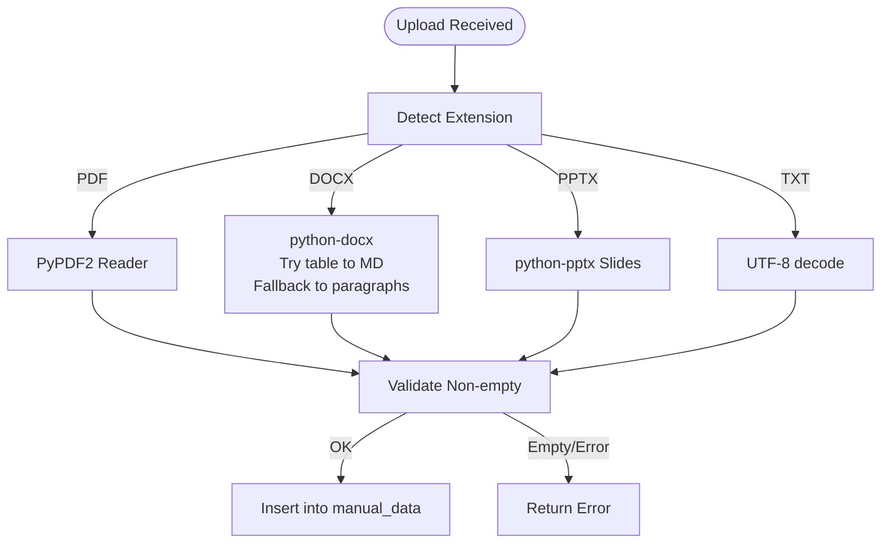

**Diagram sources**
- [backend/app.py:542-559](file://backend/app.py#L542-L559)
- [backend/scraper.py:33-66](file://backend/scraper.py#L33-L66)
- [backend/app.py:375-399](file://backend/app.py#L375-L399)

**Section sources**
- [backend/scraper.py:33-66](file://backend/scraper.py#L33-L66)
- [backend/app.py:375-399](file://backend/app.py#L375-L399)

### Manual Data Indexing, Chunking, and Embedding
- Documents are loaded from manual_data and formatted for indexing.
- Recursive character splitting with chunk size and overlap.
- Embeddings generated using sentence-transformers model.
- Three separate FAISS indexes built and cached.

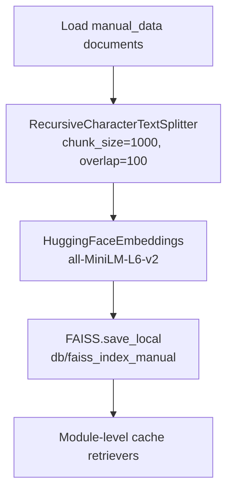

**Diagram sources**
- [backend/database.py:96-104](file://backend/database.py#L96-L104)
- [backend/vector_store.py:23-47](file://backend/vector_store.py#L23-L47)
- [backend/vector_store.py:51](file://backend/vector_store.py#L51)
- [backend/vector_store.py:73-115](file://backend/vector_store.py#L73-L115)

**Section sources**
- [backend/database.py:96-104](file://backend/database.py#L96-L104)
- [backend/vector_store.py:23-47](file://backend/vector_store.py#L23-L47)
- [backend/vector_store.py:51](file://backend/vector_store.py#L51)
- [backend/vector_store.py:73-115](file://backend/vector_store.py#L73-L115)

### Retrieval Mechanism and Relevance Ranking
- On chat, three retrievers are loaded once and reused.
- Retrieves top-k chunks from each source (Memory, Manual, Scraped).
- Builds a final prompt with context and chat history, then calls Groq LLM.
- Responses include citations and optional images when available.

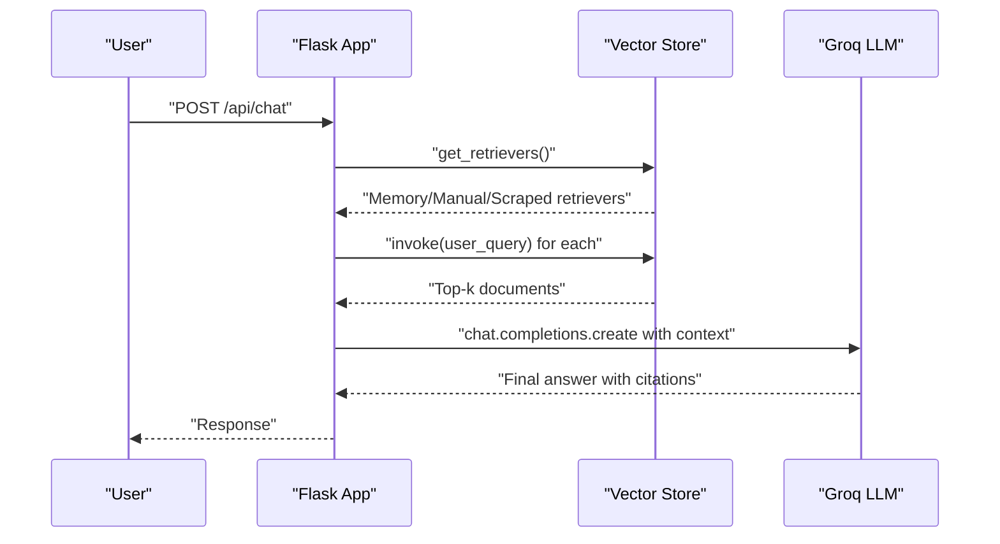

**Diagram sources**
- [backend/app.py:609-760](file://backend/app.py#L609-L760)
- [backend/vector_store.py:73-115](file://backend/vector_store.py#L73-L115)

**Section sources**
- [backend/app.py:609-760](file://backend/app.py#L609-L760)
- [backend/vector_store.py:73-115](file://backend/vector_store.py#L73-L115)

### Content Validation, Quality Assurance, and Metadata Extraction
- Input validation and sanitization:
  - Length caps for queries and content.
  - HTML sanitization for free-text inputs.
  - ObjectId validation for database operations.
- File validation:
  - Allowed extensions for manual uploads.
  - Size cap enforced at route level.
- Metadata:
  - Manual data: title, content, source_name, file_path, timestamps.
  - Scraped data: title, content, image_url, timestamps.
  - Memory data: question, answer, timestamps.

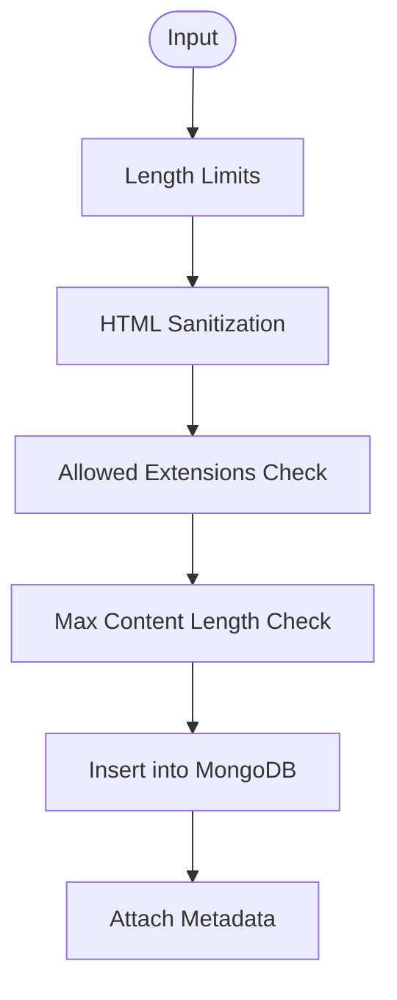

**Diagram sources**
- [backend/app.py:128-133](file://backend/app.py#L128-L133)
- [backend/app.py:179-183](file://backend/app.py#L179-L183)
- [backend/app.py:369-373](file://backend/app.py#L369-L373)
- [backend/database.py:61-104](file://backend/database.py#L61-L104)

**Section sources**
- [backend/app.py:128-133](file://backend/app.py#L128-L133)
- [backend/app.py:179-183](file://backend/app.py#L179-L183)
- [backend/app.py:369-373](file://backend/app.py#L369-L373)
- [backend/database.py:61-104](file://backend/database.py#L61-L104)

### Security and Audit Logging
- CSRF protection for state-changing endpoints.
- Session-based admin authentication.
- Security headers and CORS policy for widget embedding.
- Audit logging for admin actions.

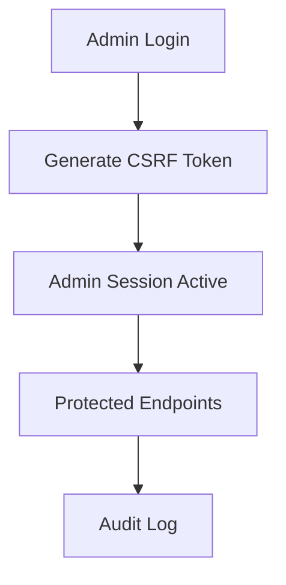

**Diagram sources**
- [backend/app.py:331-365](file://backend/app.py#L331-L365)
- [backend/app.py:151-159](file://backend/app.py#L151-L159)
- [backend/app.py:267-292](file://backend/app.py#L267-L292)
- [backend/app.py:53-56](file://backend/app.py#L53-L56)

**Section sources**
- [backend/app.py:331-365](file://backend/app.py#L331-L365)
- [backend/app.py:151-159](file://backend/app.py#L151-L159)
- [backend/app.py:267-292](file://backend/app.py#L267-L292)
- [backend/app.py:53-56](file://backend/app.py#L53-L56)

### Web Scraping and Additional Indexing
- Predefined URL list for batch scraping.
- Optional deep crawling with SSRF protections and content filtering.
- Scraped results inserted into scraped_data and later indexed.

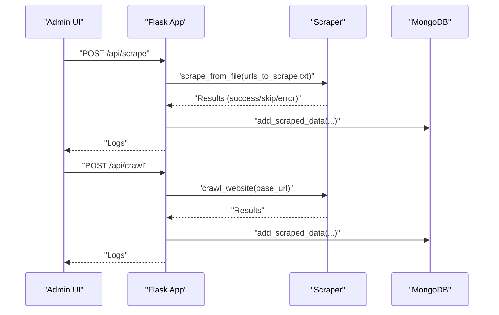

**Diagram sources**
- [backend/app.py:801-846](file://backend/app.py#L801-L846)
- [backend/scraper.py:152-167](file://backend/scraper.py#L152-L167)
- [backend/scraper.py:168-277](file://backend/scraper.py#L168-L277)
- [backend/urls_to_scrape.txt:1-76](file://backend/urls_to_scrape.txt#L1-L76)

**Section sources**
- [backend/app.py:801-846](file://backend/app.py#L801-L846)
- [backend/scraper.py:152-167](file://backend/scraper.py#L152-L167)
- [backend/scraper.py:168-277](file://backend/scraper.py#L168-L277)
- [backend/urls_to_scrape.txt:1-76](file://backend/urls_to_scrape.txt#L1-L76)

### Admin Management UI and Operations
- Admin login and CSRF token management.
- Data bank listing with filtering and search.
- Edit/update/delete operations for all data types.
- Rebuild index and delete FAISS/index operations.

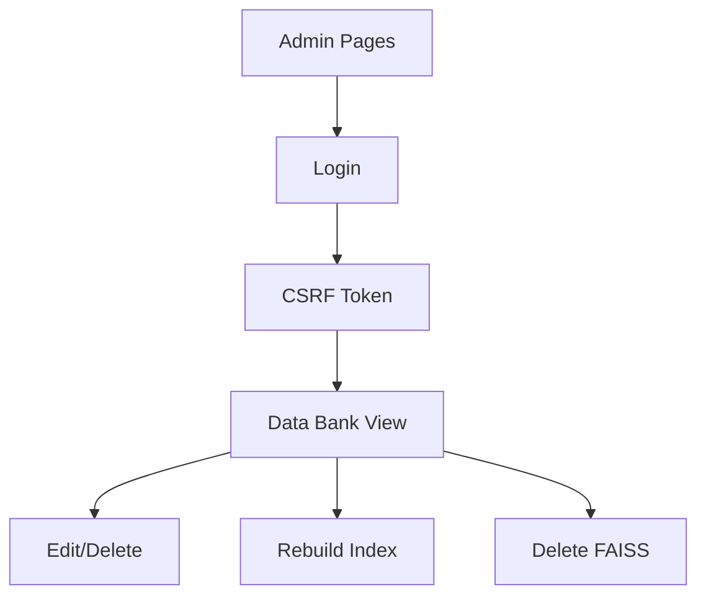

**Diagram sources**
- [frontend/admin.js:163-191](file://frontend/admin.js#L163-L191)
- [frontend/admin.js:200-234](file://frontend/admin.js#L200-L234)
- [frontend/admin-data-bank.html:1-98](file://frontend/admin-data-bank.html#L1-L98)
- [frontend/admin.js:372-498](file://frontend/admin.js#L372-L498)
- [backend/app.py:848-858](file://backend/app.py#L848-L858)
- [backend/app.py:763-784](file://backend/app.py#L763-L784)

**Section sources**
- [frontend/admin.js:163-191](file://frontend/admin.js#L163-L191)
- [frontend/admin.js:200-234](file://frontend/admin.js#L200-L234)
- [frontend/admin-data-bank.html:1-98](file://frontend/admin-data-bank.html#L1-L98)
- [frontend/admin.js:372-498](file://frontend/admin.js#L372-L498)
- [backend/app.py:848-858](file://backend/app.py#L848-L858)
- [backend/app.py:763-784](file://backend/app.py#L763-L784)

## Dependency Analysis
- Python packages include Flask, LangChain, FAISS, PyPDF2, python-docx, python-pptx, trafilatura, requests, BeautifulSoup, pymongo, and Groq.
- Backend depends on LangChain for embeddings and FAISS for vector storage, and on MongoDB for persistence.
- Frontend admin panel communicates with backend via REST endpoints and streaming logs.

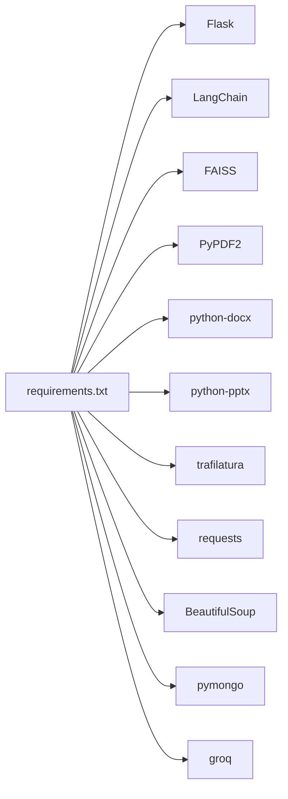

**Diagram sources**
- [requirements.txt:1-30](file://requirements.txt#L1-L30)

**Section sources**
- [requirements.txt:1-30](file://requirements.txt#L1-L30)

## Performance Considerations
- Chunking strategy: 1000-character chunks with 100-character overlap balances recall and cost.
- Embedding model: all-MiniLM-L6-v2 provides efficient local embeddings.
- Retriever caching: module-level cache avoids repeated FAISS loads.
- Streaming responses: long-running operations (scrape, reindex) stream progress to the admin UI.
- Rate limiting: protects endpoints from abuse.
- Index rebuild: admin-triggered to refresh embeddings after content changes.

[No sources needed since this section provides general guidance]

## Troubleshooting Guide
Common issues and resolutions:
- File upload errors: verify allowed extensions and size limits; ensure extraction succeeds.
- Empty or invalid content: confirm file parsing and fallback logic; check text extraction functions.
- Index rebuild failures: inspect logs from reindex endpoint; ensure FAISS paths exist and are writable.
- Retrieval returns no results: confirm indexes exist and are loaded; verify retriever cache invalidation.
- Admin session issues: CSRF token mismatch; refresh token via dedicated endpoint.

**Section sources**
- [backend/app.py:316-326](file://backend/app.py#L316-L326)
- [backend/app.py:151-159](file://backend/app.py#L151-L159)
- [backend/app.py:848-858](file://backend/app.py#L848-L858)
- [backend/vector_store.py:17-20](file://backend/vector_store.py#L17-L20)

## Conclusion
The system provides a robust pipeline for manual data ingestion, extraction, indexing, and retrieval. By enforcing validation, leveraging FAISS with efficient chunking, and offering admin controls for content management and index rebuilding, it ensures reliable and secure knowledge retrieval for user queries.

[No sources needed since this section summarizes without analyzing specific files]

## Appendices

### API Endpoints Overview
- Admin authentication and CSRF
  - POST /api/admin/login
  - POST /api/admin/logout
  - GET /api/csrf-token
- Manual data ingestion
  - POST /api/add_manual_text
  - POST /api/add_manual_file
- Indexing and scraping
  - POST /api/reindex
  - POST /api/scrape
  - POST /api/crawl
- Retrieval
  - POST /api/chat
  - POST /api/admin_chat
- Data management
  - GET /api/get-data
  - PUT /api/data/<type>/<item_id>
  - DELETE /api/data/<type>/<item_id>
  - GET /api/scraped-data, /api/manual-data, /api/memory-data
  - PUT /api/scraped-data/<id>, /api/manual-data/<id>, /api/memory-data/<id>
  - DELETE /api/scraped-data/<id>, /api/manual-data/<id>, /api/memory-data/<id>
- Maintenance
  - POST /api/delete_faiss
  - POST /api/delete_db
  - GET /api/health
  - GET /api/dashboard/stats

**Section sources**
- [backend/app.py:331-365](file://backend/app.py#L331-L365)
- [backend/app.py:498-566](file://backend/app.py#L498-L566)
- [backend/app.py:801-858](file://backend/app.py#L801-L858)
- [backend/app.py:860-934](file://backend/app.py#L860-L934)
- [backend/app.py:940-1166](file://backend/app.py#L940-L1166)