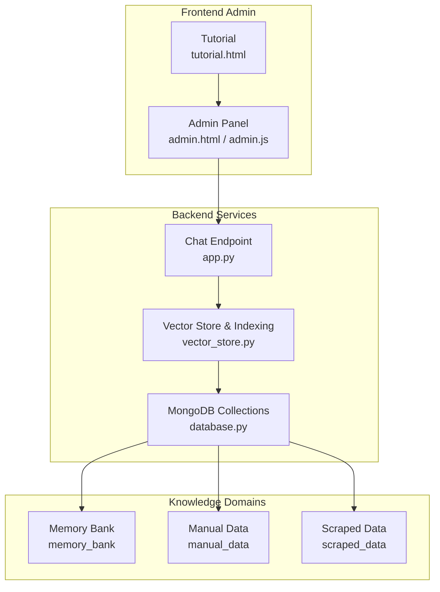
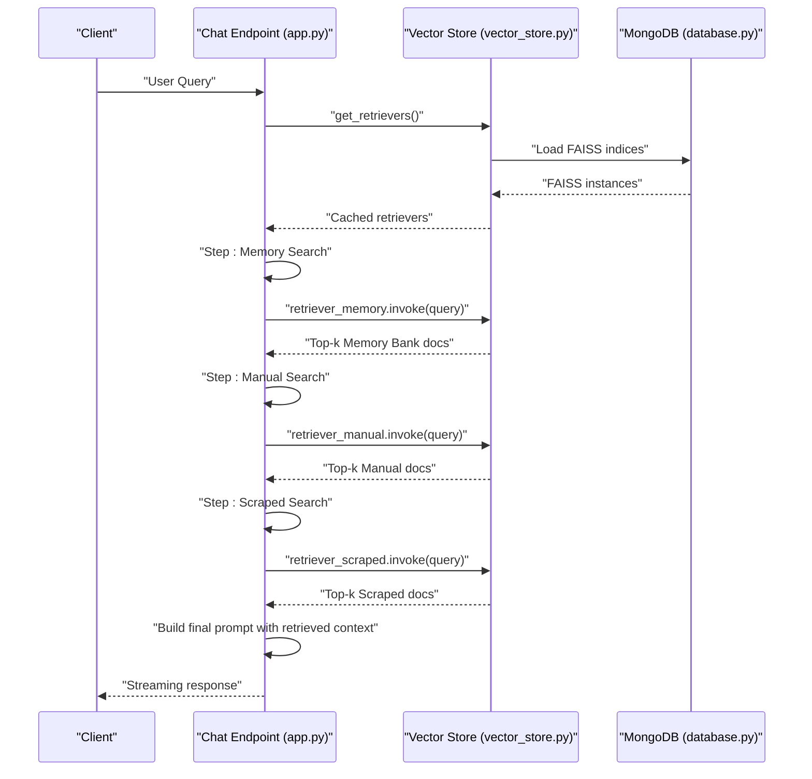
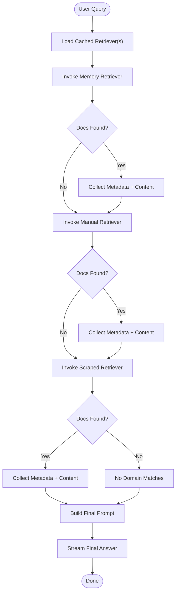
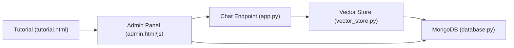

# Memory Bank Retrieval

<cite>
**Referenced Files in This Document**
- [app.py](file://backend/app.py)
- [vector_store.py](file://backend/vector_store.py)
- [database.py](file://backend/database.py)
- [admin.html](file://frontend/admin.html)
- [admin.js](file://frontend/admin.js)
- [tutorial.html](file://frontend/tutorial.html)
</cite>

## Table of Contents
1. [Introduction](#introduction)
2. [Project Structure](#project-structure)
3. [Core Components](#core-components)
4. [Architecture Overview](#architecture-overview)
5. [Detailed Component Analysis](#detailed-component-analysis)
6. [Dependency Analysis](#dependency-analysis)
7. [Performance Considerations](#performance-considerations)
8. [Troubleshooting Guide](#troubleshooting-guide)
9. [Conclusion](#conclusion)

## Introduction
This document explains the Memory Bank retrieval mechanism and the predefined knowledge base implementation. It covers the static Q&A dataset structure, response patterns, instant retrieval capabilities, content management, update procedures, maintenance workflows, retrieval priority, fallback mechanisms, response selection criteria, categorization, metadata management, quality assurance, validation, accuracy verification, and performance optimization for instant response delivery.

## Project Structure
The system comprises:
- Backend services for retrieval, indexing, and data management
- Frontend admin panels for content administration and maintenance
- Vector stores for FAISS-backed semantic search across three knowledge domains

**Diagram sources**
- [app.py](file://backend/app.py)
- [vector_store.py](file://backend/vector_store.py)
- [database.py](file://backend/database.py)
- [admin.html](file://frontend/admin.html)
- [admin.js](file://frontend/admin.js)
- [tutorial.html](file://frontend/tutorial.html)

**Section sources**
- [app.py](file://backend/app.py)
- [vector_store.py](file://backend/vector_store.py)
- [database.py](file://backend/database.py)
- [admin.html](file://frontend/admin.html)
- [admin.js](file://frontend/admin.js)
- [tutorial.html](file://frontend/tutorial.html)

## Core Components
- Memory Bank: Static Q&A dataset stored in MongoDB with unique questions and structured answers. Indexed via FAISS for instant semantic retrieval.
- Vector Store: Manages FAISS indices for Memory Bank, Manual Data, and Scraped Data. Provides cached retrievers for fast lookup during chat sessions.
- Chat Pipeline: Orchestrates retrieval across domains, constructs prompts with retrieved context, and generates instant responses.
- Admin Tools: Provide CRUD operations, scraping, reindexing, and maintenance controls.

Key implementation references:
- Retrieval orchestration and response generation: [app.py](file://backend/app.py)
- FAISS indexing and retriever caching: [vector_store.py](file://backend/vector_store.py)
- MongoDB collections and CRUD: [database.py](file://backend/database.py)
- Admin workflow and maintenance: [admin.html](file://frontend/admin.html), [admin.js](file://frontend/admin.js), [tutorial.html](file://frontend/tutorial.html)

**Section sources**
- [app.py](file://backend/app.py)
- [vector_store.py](file://backend/vector_store.py)
- [database.py](file://backend/database.py)
- [admin.html](file://frontend/admin.html)
- [admin.js](file://frontend/admin.js)
- [tutorial.html](file://frontend/tutorial.html)

## Architecture Overview
The retrieval pipeline prioritizes Memory Bank, followed by Manual Data, and finally Scraped Data. Each domain is indexed separately and loaded as cached retrievers. The chat endpoint streams intermediate steps and aggregates top-k matches per domain to build a contextual prompt for the LLM.

**Diagram sources**
- [app.py](file://backend/app.py)
- [vector_store.py](file://backend/vector_store.py)
- [database.py](file://backend/database.py)

## Detailed Component Analysis

### Memory Bank Retrieval Mechanism
- Purpose: Provide instant, authoritative answers to frequently asked questions.
- Storage: Unique questions enforced via MongoDB index; each record includes question, answer, and timestamp.
- Indexing: Documents are chunked and embedded; FAISS index saved locally and cached as retrievers.
- Retrieval: Top-k matches returned per query; metadata preserved for attribution and presentation.

Implementation highlights:
- Retrieval invocation and step reporting: [app.py](file://backend/app.py)
- FAISS loading and retriever caching: [vector_store.py](file://backend/vector_store.py)
- Memory Bank CRUD and uniqueness constraints: [database.py](file://backend/database.py)

**Diagram sources**
- [app.py](file://backend/app.py)
- [vector_store.py](file://backend/vector_store.py)
- [database.py](file://backend/database.py)

**Section sources**
- [app.py](file://backend/app.py)
- [vector_store.py](file://backend/vector_store.py)
- [database.py](file://backend/database.py)

### Static Q&A Dataset Structure and Predefined Patterns
- Schema: question (unique), answer, saved_at.
- Chunking and embedding: Documents are split into overlapping chunks; embeddings generated and FAISS index built.
- Metadata: Titles and sources preserved per document for attribution and display.

References:
- Index creation and chunking: [vector_store.py](file://backend/vector_store.py)
- Memory Bank collection constraints: [database.py](file://backend/database.py)

**Section sources**
- [vector_store.py](file://backend/vector_store.py)
- [database.py](file://backend/database.py)

### Instant Retrieval Capabilities
- Cached retrievers avoid repeated FAISS loads; search_kwargs set k for top-k retrieval.
- Streaming progress events guide users through each retrieval stage.
- Embedding model used for dense vectors ensures fast similarity search.

References:
- Cached retrievers and search parameters: [vector_store.py](file://backend/vector_store.py)
- Streaming steps and retrieval calls: [app.py](file://backend/app.py)

**Section sources**
- [vector_store.py](file://backend/vector_store.py)
- [app.py](file://backend/app.py)

### Retrieval Priority and Fallback Mechanisms
- Priority order: Memory Bank → Manual Data → Scraped Data.
- Fallback behavior: If no matches in Memory Bank, continue to Manual; if none in Manual, continue to Scraped.
- Response selection: Retrieved context is concatenated into a final prompt; LLM generates concise, markdown-formatted answers.

References:
- Stepwise retrieval and fallback: [app.py](file://backend/app.py)

**Section sources**
- [app.py](file://backend/app.py)

### Content Categorization and Metadata Management
- Categories: Memory Bank (Q&A), Manual Data (user-provided), Scraped Data (web content).
- Metadata fields: title, source, type, image_url (when applicable).
- Presentation: Admin UI displays titles, sources, and rendered content previews.

References:
- Manual data metadata and formatting: [database.py](file://backend/database.py)
- Admin UI rendering and preview: [admin.js](file://frontend/admin.js)

**Section sources**
- [database.py](file://backend/database.py)
- [admin.js](file://frontend/admin.js)

### Content Administration Procedures
- Adding data:
  - Manual text/file: validated length and uploaded content; stored with unique source identifiers.
  - Scraping: URLs sourced from a text file; scraped content stored with unique constraints.
- Updating/deleting data: Admin endpoints support updates and deletions with validation and audit logging.
- Maintenance:
  - Rebuild FAISS Index after adding/updating data.
  - Delete FAISS indices for troubleshooting.

References:
- Manual data handlers and validations: [app.py](file://backend/app.py)
- Admin workflow and maintenance buttons: [admin.html](file://frontend/admin.html)
- Tutorial workflow for adding knowledge: [tutorial.html](file://frontend/tutorial.html)

**Section sources**
- [app.py](file://backend/app.py)
- [admin.html](file://frontend/admin.html)
- [tutorial.html](file://frontend/tutorial.html)

### Response Matching Algorithms and Selection Criteria
- Semantic similarity: FAISS cosine similarity on sentence-transformer embeddings.
- Top-k selection: Controlled via retriever search kwargs; default k configured in retriever creation.
- Prompt construction: Retrieved documents are formatted with source_type, title, source, and content; optional image_url included when present.

References:
- Retriever configuration and invocation: [vector_store.py](file://backend/vector_store.py)
- Prompt assembly and streaming: [app.py](file://backend/app.py)

**Section sources**
- [vector_store.py](file://backend/vector_store.py)
- [app.py](file://backend/app.py)

### Quality Assurance Processes
- Uniqueness constraints:
  - Memory Bank: question unique.
  - Manual Data: source_name unique.
  - Scraped Data: url unique.
- Validation:
  - Text length limits enforced during add/update.
  - ObjectId validation for edit/delete operations.
- Audit logging on admin actions.

References:
- Index constraints and CRUD: [database.py](file://backend/database.py)
- Validation and logging in handlers: [app.py](file://backend/app.py)

**Section sources**
- [database.py](file://backend/database.py)
- [app.py](file://backend/app.py)

### Examples of Memory Bank Queries and Retrieval Workflows
- Example query: “How do I reset my password?”
- Expected behavior:
  - Memory Bank search returns exact or near-match Q&A.
  - If not found, Manual Data search continues.
  - If still not found, Scraped Data search continues.
  - Final prompt includes cited sources; response is streamed.

References:
- Retrieval steps and prompt building: [app.py](file://backend/app.py)

**Section sources**
- [app.py](file://backend/app.py)

## Dependency Analysis
The retrieval pipeline depends on:
- FAISS indices for each domain
- Cached retrievers for low-latency lookups
- MongoDB collections for data persistence
- Admin endpoints for ingestion and maintenance

**Diagram sources**
- [app.py](file://backend/app.py)
- [vector_store.py](file://backend/vector_store.py)
- [database.py](file://backend/database.py)
- [admin.html](file://frontend/admin.html)
- [admin.js](file://frontend/admin.js)
- [tutorial.html](file://frontend/tutorial.html)

**Section sources**
- [app.py](file://backend/app.py)
- [vector_store.py](file://backend/vector_store.py)
- [database.py](file://backend/database.py)
- [admin.html](file://frontend/admin.html)
- [admin.js](file://frontend/admin.js)
- [tutorial.html](file://frontend/tutorial.html)

## Performance Considerations
- Use cached retrievers to avoid reloading FAISS indices on every request.
- Tune k in retriever search kwargs to balance recall and latency.
- Keep embedding model and chunk sizes optimized for query throughput.
- Monitor FAISS index sizes and rebuild periodically after large updates.
- Stream responses to reduce perceived latency.

[No sources needed since this section provides general guidance]

## Troubleshooting Guide
Common issues and resolutions:
- No results from Memory Bank:
  - Verify FAISS index exists and is loadable; rebuild index if corrupted.
  - Confirm question uniqueness and content presence.
- Slow retrieval:
  - Ensure retrievers are cached; check k value and chunk size.
- Admin operations failing:
  - Validate ObjectId format and content length limits.
  - Confirm unique constraints (question/source_name/url) are satisfied.

References:
- FAISS deletion and rebuild triggers: [app.py](file://backend/app.py)
- Admin maintenance controls: [admin.html](file://frontend/admin.html)

**Section sources**
- [app.py](file://backend/app.py)
- [admin.html](file://frontend/admin.html)

## Conclusion
The Memory Bank retrieval system combines a static Q&A dataset with dynamic knowledge domains, enabling instant, accurate responses through FAISS-powered semantic search and a streamlined chat pipeline. Admin tools facilitate ingestion, validation, and maintenance, while quality assurance measures ensure reliable, citable answers.

[No sources needed since this section summarizes without analyzing specific files]