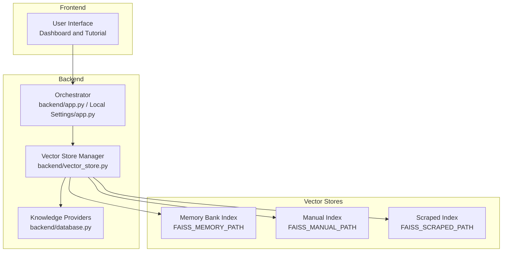
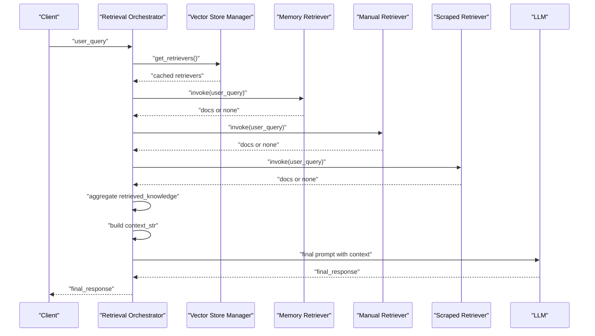
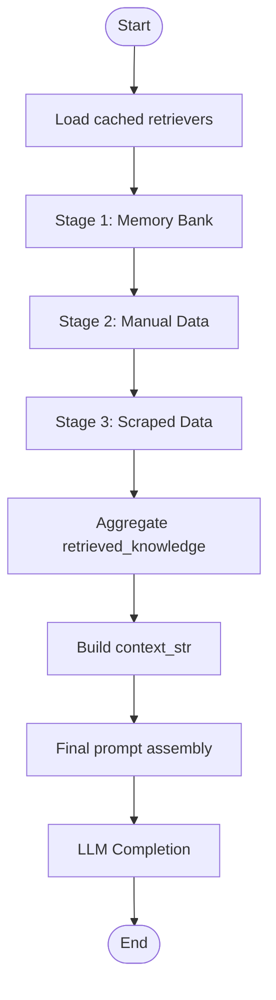
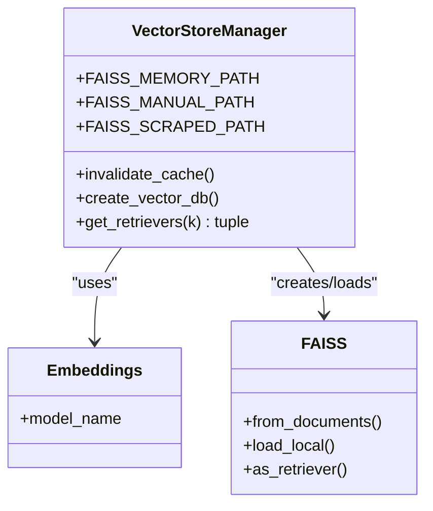
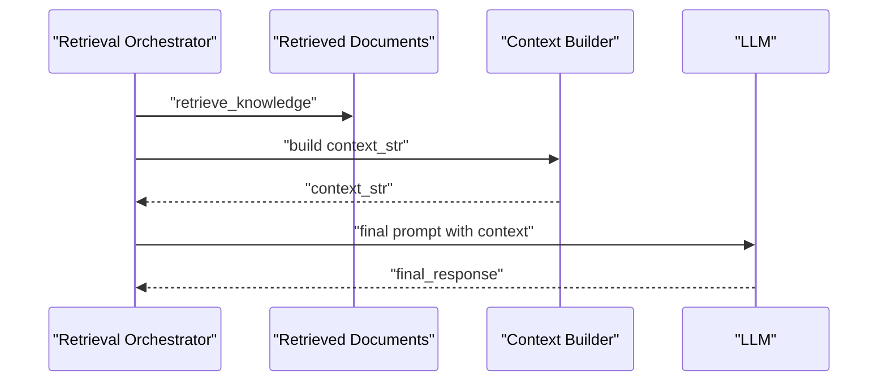
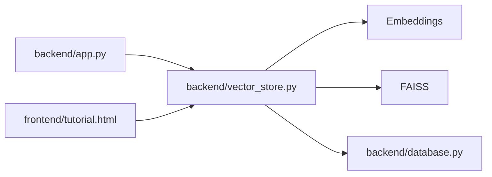

# Retrieval Orchestration

<cite>
**Referenced Files in This Document**
- [backend/app.py](file://backend/app.py)
- [Local Settings/app.py](file://Local Settings/app.py)
- [backend/vector_store.py](file://backend/vector_store.py)
- [backend/database.py](file://backend/database.py)
- [frontend/tutorial.html](file://frontend/tutorial.html)
</cite>

## Table of Contents
1. [Introduction](#introduction)
2. [Project Structure](#project-structure)
3. [Core Components](#core-components)
4. [Architecture Overview](#architecture-overview)
5. [Detailed Component Analysis](#detailed-component-analysis)
6. [Dependency Analysis](#dependency-analysis)
7. [Performance Considerations](#performance-considerations)
8. [Troubleshooting Guide](#troubleshooting-guide)
9. [Conclusion](#conclusion)
10. [Appendices](#appendices)

## Introduction
This document explains the retrieval orchestration and multi-source knowledge aggregation system used to coordinate search across three distinct knowledge sources, construct contextual prompts, and synthesize final responses. It covers the retrieval workflow, knowledge base prioritization, context construction, query processing pipeline, and response synthesis. It also documents performance optimization, caching strategies, and operational guidance for maintaining retrieval quality and latency.

## Project Structure
The retrieval system spans backend orchestration, vector index management, and frontend guidance. The key modules are:
- Retrieval orchestration and response synthesis: backend/app.py and Local Settings/app.py
- Vector index creation and retrieval: backend/vector_store.py
- Knowledge source providers: backend/database.py
- Operational guidance and rebuild steps: frontend/tutorial.html

**Diagram sources**
- [backend/app.py:616-760](file://backend/app.py#L616-L760)
- [Local Settings/app.py:209-348](file://Local Settings/app.py#L209-L348)
- [backend/vector_store.py:1-115](file://backend/vector_store.py#L1-L115)
- [backend/database.py](file://backend/database.py)

**Section sources**
- [backend/app.py:616-760](file://backend/app.py#L616-L760)
- [Local Settings/app.py:209-348](file://Local Settings/app.py#L209-L348)
- [backend/vector_store.py:1-115](file://backend/vector_store.py#L1-L115)
- [frontend/tutorial.html:67-111](file://frontend/tutorial.html#L67-L111)

## Core Components
- Retrieval orchestrator: Executes multi-stage retrieval across Memory Bank, Manual uploads, and Scraped data; aggregates results; constructs final prompt; synthesizes response.
- Vector store manager: Creates and loads FAISS indices per knowledge source; caches retrievers to avoid repeated load overhead.
- Knowledge providers: Supply documents for indexing from Memory Bank, Manual uploads, and Scraped sources.
- Frontend tutorial: Documents the rebuild process to propagate new knowledge into FAISS indices.

Key orchestration responsibilities:
- Stage-wise retrieval across three sources
- Consistent metadata handling and content aggregation
- Context string construction for LLM prompting
- Streaming progress updates for transparency

**Section sources**
- [backend/app.py:616-760](file://backend/app.py#L616-L760)
- [Local Settings/app.py:209-348](file://Local Settings/app.py#L209-L348)
- [backend/vector_store.py:73-115](file://backend/vector_store.py#L73-L115)
- [backend/database.py](file://backend/database.py)

## Architecture Overview
The retrieval orchestration coordinates three stages:
1. Memory Bank search
2. Manual data search
3. Scraped data search

After retrieving documents from each stage, the system builds a unified context string and sends it to the LLM for response generation. Vector indices are loaded once and cached to reduce latency.

**Diagram sources**
- [backend/app.py:616-760](file://backend/app.py#L616-L760)
- [Local Settings/app.py:209-348](file://Local Settings/app.py#L209-L348)
- [backend/vector_store.py:73-115](file://backend/vector_store.py#L73-L115)

## Detailed Component Analysis

### Retrieval Orchestrator
The orchestrator coordinates retrieval across three sources and streams progress events. It:
- Loads retrievers via a cached factory
- Executes retrieval per stage
- Aggregates results into a structured list with source metadata
- Builds a formatted context string for the LLM
- Synthesizes the final response using an LLM completion endpoint

**Diagram sources**
- [backend/app.py:616-760](file://backend/app.py#L616-L760)
- [Local Settings/app.py:209-348](file://Local Settings/app.py#L209-L348)

**Section sources**
- [backend/app.py:616-760](file://backend/app.py#L616-L760)
- [Local Settings/app.py:209-348](file://Local Settings/app.py#L209-L348)

### Vector Store Manager
The vector store manager:
- Defines separate FAISS index paths for Memory Bank, Manual, and Scraped data
- Creates indices by splitting documents and generating embeddings
- Loads indices into FAISS retrievers with configurable top-k
- Caches retrievers globally to avoid repeated loading
- Provides a cache invalidation mechanism after rebuilds

**Diagram sources**
- [backend/vector_store.py:1-115](file://backend/vector_store.py#L1-L115)

**Section sources**
- [backend/vector_store.py:1-115](file://backend/vector_store.py#L1-L115)

### Knowledge Providers
Knowledge providers supply documents for indexing from:
- Memory Bank
- Manual uploads
- Scraped sources

These are consumed during index creation and retrieval.

**Section sources**
- [backend/database.py](file://backend/database.py)

### Context Construction and Response Synthesis
The orchestrator constructs a context string from retrieved documents and composes a final prompt for the LLM. The prompt enforces grounding, citation rules, and formatting expectations. The LLM generates a final response that is streamed back to the client.

**Diagram sources**
- [backend/app.py:682-760](file://backend/app.py#L682-L760)
- [Local Settings/app.py:290-348](file://Local Settings/app.py#L290-L348)

**Section sources**
- [backend/app.py:682-760](file://backend/app.py#L682-L760)
- [Local Settings/app.py:290-348](file://Local Settings/app.py#L290-L348)

## Dependency Analysis
The retrieval system exhibits clear separation of concerns:
- Orchestrator depends on Vector Store Manager for retrievers
- Vector Store Manager depends on Embeddings and FAISS
- Vector Store Manager depends on Knowledge Providers for documents
- Frontend tutorial guides rebuild operations that invalidate caches and refresh indices

**Diagram sources**
- [backend/app.py:616-760](file://backend/app.py#L616-L760)
- [backend/vector_store.py:1-115](file://backend/vector_store.py#L1-L115)
- [backend/database.py](file://backend/database.py)
- [frontend/tutorial.html:67-111](file://frontend/tutorial.html#L67-L111)

**Section sources**
- [backend/app.py:616-760](file://backend/app.py#L616-L760)
- [backend/vector_store.py:1-115](file://backend/vector_store.py#L1-L115)
- [backend/database.py](file://backend/database.py)
- [frontend/tutorial.html:67-111](file://frontend/tutorial.html#L67-L111)

## Performance Considerations
- Retrieval caching: Retrievers are cached globally to avoid repeated FAISS load costs. After rebuilding indices, invalidate the cache to force reload.
- Top-k selection: Each retriever uses a configurable k value to limit candidate count per stage.
- Chunking and embeddings: Documents are split into chunks and embedded locally to reduce external API dependencies.
- Streaming progress: Orchestrator yields step-by-step progress to improve perceived responsiveness.
- CORS and caching headers: Sensitive API endpoints disable caching to ensure freshness.

Optimization recommendations:
- Tune k per stage based on latency vs. recall trade-offs.
- Monitor FAISS index sizes and rebuild cadence to balance accuracy and speed.
- Consider parallel retrieval across stages if latency permits and resources allow.
- Use smaller chunk sizes for higher granularity at the cost of more vectors.

**Section sources**
- [backend/vector_store.py:73-115](file://backend/vector_store.py#L73-L115)
- [backend/app.py:280-311](file://backend/app.py#L280-L311)

## Troubleshooting Guide
Common issues and resolutions:
- Indices not loading: Verify FAISS index directories exist and are readable. Check for deserialization warnings and ensure embeddings model availability.
- No results returned: Confirm that rebuild was performed after adding new data; this propagates changes into FAISS indices.
- Cache stale results: Trigger cache invalidation after reindexing to force fresh retriever loading.
- Frontend rebuild steps: Follow the tutorial’s rebuild instructions to ensure new knowledge is indexed and discoverable.

Operational checks:
- After scraping or manual uploads, run the rebuild step to regenerate FAISS indices.
- After rebuild, invalidate the retriever cache to load the refreshed indices.
- Monitor progress events to identify which stage returned results or errors.

**Section sources**
- [backend/vector_store.py:17-21](file://backend/vector_store.py#L17-L21)
- [frontend/tutorial.html:67-111](file://frontend/tutorial.html#L67-L111)
- [backend/app.py:338-348](file://backend/app.py#L338-L348)

## Conclusion
The retrieval orchestration integrates three knowledge sources through a staged, cached retrieval pipeline. By structuring context carefully and enforcing citation and formatting rules, the system ensures grounded, citable, and readable responses. Proper maintenance—particularly timely rebuilds and cache invalidation—ensures accuracy and performance remain strong over time.

## Appendices

### Retrieval Workflow Examples
- Example 1: Query with results from all three sources
  - Stage 1: Memory Bank returns matches → Stage 2: Manual returns matches → Stage 3: Scraped returns matches → Aggregated context built and sent to LLM
- Example 2: Query with partial coverage
  - Stage 1: Memory Bank returns matches → Stage 2: Manual returns none → Stage 3: Scraped returns matches → Aggregated context still constructed from available sources

### Knowledge Aggregation Patterns
- Metadata preservation: Each retrieved document preserves source type, title, and source URL for accurate attribution.
- Image handling: Optional image URLs are included when present to enrich responses.
- Deduplication: Not implemented in current code; consider deduplicating overlapping content if needed.

### Context Construction Algorithms
- Iterative concatenation: Retrieved items are appended into a single context string with clear separators and field labels.
- Citation enforcement: Final prompt requires citations in a specific format; ensure retrieved content is attributed accordingly.

### Response Synthesis Methods
- Prompt composition: System identity, grounding rules, citation rules, formatting guidelines, and conversation history are embedded into the final prompt.
- LLM invocation: Uses a completion endpoint with tuned parameters for balanced creativity and factualness.