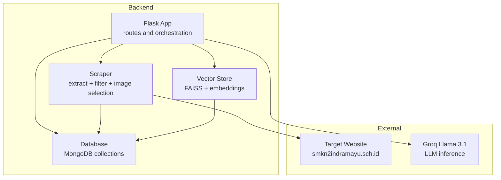
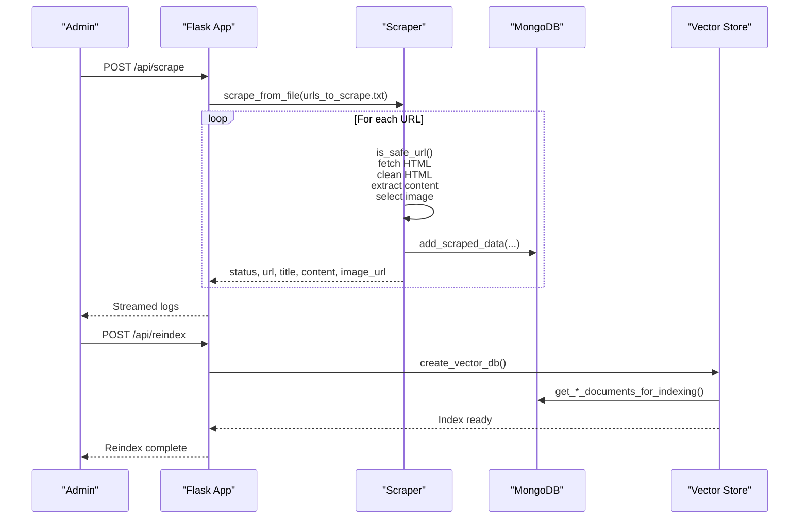
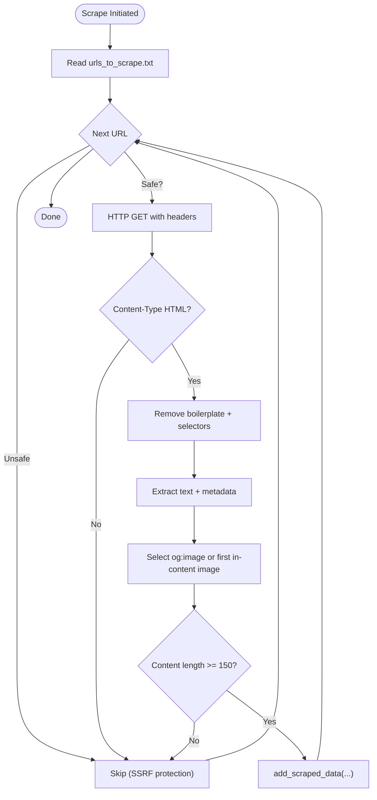
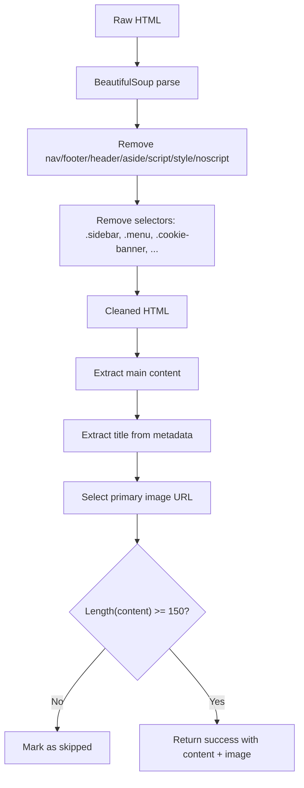
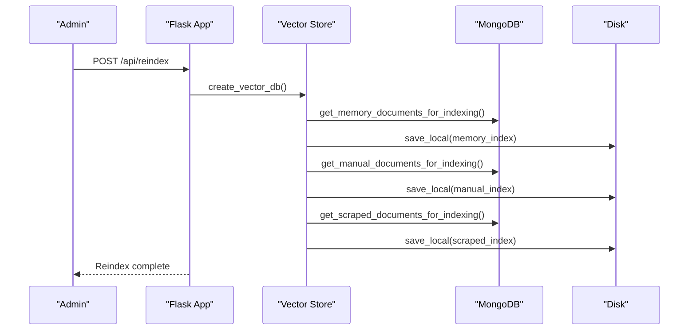
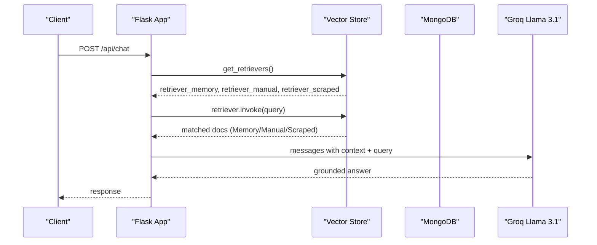
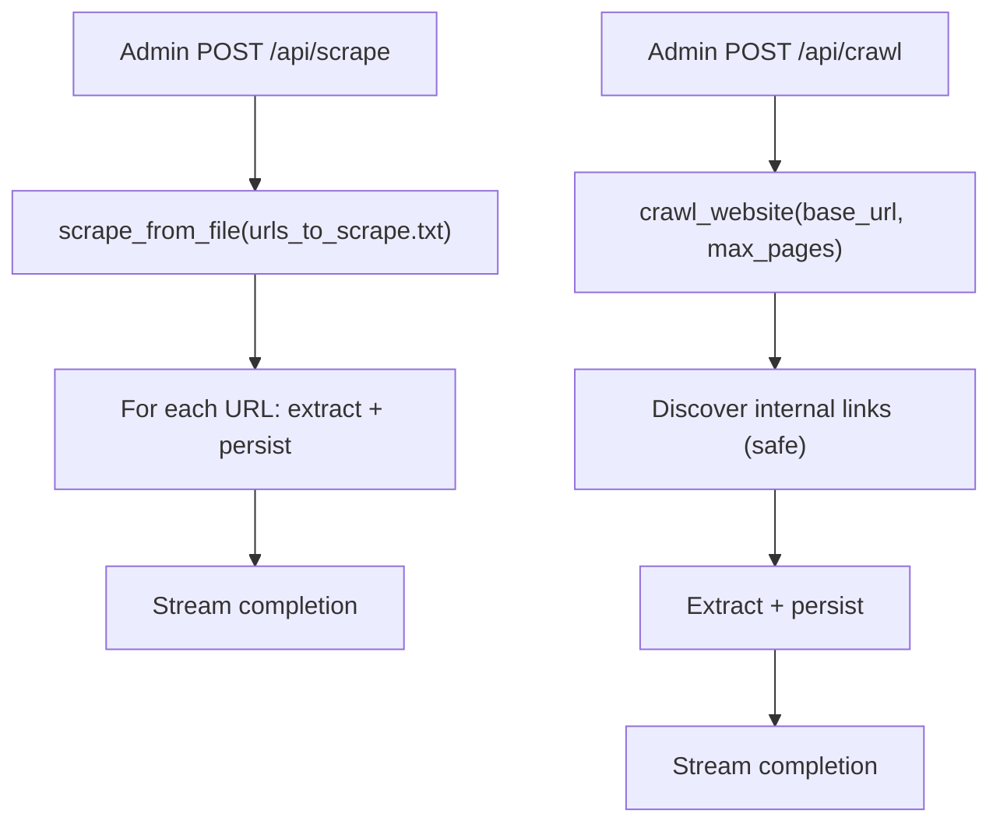
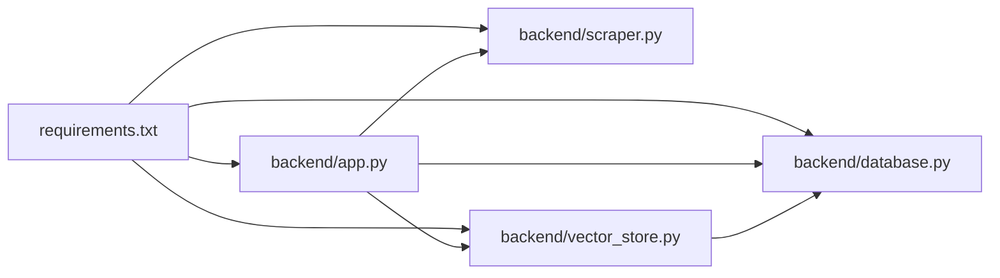

# Scraped Data Retrieval

<cite>
**Referenced Files in This Document**
- [backend/app.py](file://backend/app.py)
- [backend/scraper.py](file://backend/scraper.py)
- [backend/vector_store.py](file://backend/vector_store.py)
- [backend/database.py](file://backend/database.py)
- [backend/urls_to_scrape.txt](file://backend/urls_to_scrape.txt)
- [requirements.txt](file://requirements.txt)
- [API_DOCUMENTATION.md](file://API_DOCUMENTATION.md)
</cite>

## Table of Contents
1. [Introduction](#introduction)
2. [Project Structure](#project-structure)
3. [Core Components](#core-components)
4. [Architecture Overview](#architecture-overview)
5. [Detailed Component Analysis](#detailed-component-analysis)
6. [Dependency Analysis](#dependency-analysis)
7. [Performance Considerations](#performance-considerations)
8. [Troubleshooting Guide](#troubleshooting-guide)
9. [Conclusion](#conclusion)
10. [Appendices](#appendices)

## Introduction
This document describes the scraped data retrieval and automated content aggregation system. It covers web scraping configuration, target site management, content extraction and cleaning, quality filtering, automated indexing and embedding generation, integration with the vector search system, scheduling and update workflows, and security and compliance considerations. The system targets a specific educational institution’s website and supports both targeted URL scraping and deep crawling, with robust safeguards and admin-controlled workflows.

## Project Structure
The system is organized around a Flask backend with modular components:
- Web scraping and content extraction logic
- Vector search index creation and retrieval
- MongoDB-backed persistence for scraped, manual, and memory data
- Admin APIs for scraping, indexing, and content management
- Frontend integration for public chat and admin panel

**Diagram sources**
- [backend/app.py:120-122](file://backend/app.py#L120-L122)
- [backend/scraper.py:12-27](file://backend/scraper.py#L12-L27)
- [backend/vector_store.py:8-12](file://backend/vector_store.py#L8-L12)
- [backend/database.py:31-47](file://backend/database.py#L31-L47)

**Section sources**
- [backend/app.py:82-122](file://backend/app.py#L82-L122)
- [backend/scraper.py:12-27](file://backend/scraper.py#L12-L27)
- [backend/vector_store.py:8-12](file://backend/vector_store.py#L8-L12)
- [backend/database.py:31-47](file://backend/database.py#L31-L47)

## Core Components
- Web Scraper and Extractor: Validates safe URLs, fetches HTML, removes boilerplate, extracts main content, selects a representative image, filters low-quality content, and streams progress.
- Vector Store Manager: Builds separate FAISS indexes for Memory Bank, Manual Data, and Scraped Data using sentence transformers embeddings and provides cached retrievers.
- Database Layer: Provides CRUD operations and index initialization for three collections: scraped_data, manual_data, memory_bank.
- Admin APIs: Expose scraping, crawling, reindexing, and content management endpoints with rate limits and CSRF protection.
- Public Chat Integration: Retrieves relevant knowledge from all three indexes and synthesizes grounded answers using an LLM.

**Section sources**
- [backend/scraper.py:12-27](file://backend/scraper.py#L12-L27)
- [backend/vector_store.py:23-70](file://backend/vector_store.py#L23-L70)
- [backend/database.py:150-195](file://backend/database.py#L150-L195)
- [backend/app.py:801-820](file://backend/app.py#L801-L820)
- [backend/app.py:609-760](file://backend/app.py#L609-L760)

## Architecture Overview
The system follows a staged pipeline:
1. Admin triggers scraping or crawling via API.
2. Scraper validates URLs, downloads content, cleans HTML, extracts text and metadata, selects a thumbnail, and persists results.
3. Vector store builds FAISS indexes from the persisted documents.
4. Chat queries retrieve top-k relevant chunks from all indexes and feed them to the LLM for a grounded response.

**Diagram sources**
- [backend/app.py:801-820](file://backend/app.py#L801-L820)
- [backend/scraper.py:152-166](file://backend/scraper.py#L152-L166)
- [backend/scraper.py:83-147](file://backend/scraper.py#L83-L147)
- [backend/database.py:152-195](file://backend/database.py#L152-L195)
- [backend/vector_store.py:48-70](file://backend/vector_store.py#L48-L70)

## Detailed Component Analysis

### Web Scraping Configuration and Target Site Management
- Safe URL enforcement: Only allows the configured domain and subdomains; blocks private/loopback/link-local IPs.
- Request headers: Uses a realistic User-Agent to reduce blocking.
- Target site: Configured for a specific school website domain.
- URL source: Admin-triggered scraping reads a curated list from a text file.

**Diagram sources**
- [backend/scraper.py:12-27](file://backend/scraper.py#L12-L27)
- [backend/scraper.py:152-166](file://backend/scraper.py#L152-L166)
- [backend/scraper.py:83-147](file://backend/scraper.py#L83-L147)
- [backend/database.py:152-168](file://backend/database.py#L152-L168)
- [backend/urls_to_scrape.txt:1-76](file://backend/urls_to_scrape.txt#L1-L76)

**Section sources**
- [backend/scraper.py:12-27](file://backend/scraper.py#L12-L27)
- [backend/scraper.py:83-147](file://backend/scraper.py#L83-L147)
- [backend/urls_to_scrape.txt:1-76](file://backend/urls_to_scrape.txt#L1-L76)

### Content Extraction and Cleaning Algorithms
- Boilerplate removal: Strips navigation, footer, aside, header, and common junk selectors.
- Content extraction: Uses a precision-focused extractor on cleaned HTML.
- Metadata extraction: Captures page title from raw HTML metadata.
- Image selection: Prefers Open Graph image; otherwise finds the first plausible in-content image with basic size and naming heuristics.
- Quality filtering: Rejects content shorter than a threshold to avoid boilerplate or navigation-only pages.

**Diagram sources**
- [backend/scraper.py:69-81](file://backend/scraper.py#L69-L81)
- [backend/scraper.py:99-106](file://backend/scraper.py#L99-L106)
- [backend/scraper.py:108-144](file://backend/scraper.py#L108-L144)

**Section sources**
- [backend/scraper.py:69-81](file://backend/scraper.py#L69-L81)
- [backend/scraper.py:99-106](file://backend/scraper.py#L99-L106)
- [backend/scraper.py:108-144](file://backend/scraper.py#L108-L144)

### Automated Indexing and Embedding Generation
- Separate indexes: Three FAISS indexes are maintained for Memory Bank, Manual Data, and Scraped Data.
- Chunking: Documents are split into overlapping chunks for better recall.
- Embeddings: Sentence transformer embeddings are computed and stored.
- Retrievers: Loaded once and cached to avoid repeated disk IO.

**Diagram sources**
- [backend/vector_store.py:48-70](file://backend/vector_store.py#L48-L70)
- [backend/vector_store.py:23-47](file://backend/vector_store.py#L23-L47)
- [backend/database.py:96-104](file://backend/database.py#L96-L104)
- [backend/database.py:140-148](file://backend/database.py#L140-L148)
- [backend/database.py:186-195](file://backend/database.py#L186-L195)

**Section sources**
- [backend/vector_store.py:8-12](file://backend/vector_store.py#L8-L12)
- [backend/vector_store.py:23-70](file://backend/vector_store.py#L23-L70)
- [backend/database.py:96-104](file://backend/database.py#L96-L104)
- [backend/database.py:140-148](file://backend/database.py#L140-L148)
- [backend/database.py:186-195](file://backend/database.py#L186-L195)

### Retrieval and Chat Pipeline
- Retrievers: Loads cached retrievers for Memory Bank, Manual Data, and Scraped Data.
- Multi-source retrieval: Queries each retriever and aggregates results.
- Prompt assembly: Constructs a grounded prompt with citations and optional images.
- LLM response: Generates concise, Markdown-friendly answers with citations and images when available.

**Diagram sources**
- [backend/app.py:609-760](file://backend/app.py#L609-L760)
- [backend/vector_store.py:73-115](file://backend/vector_store.py#L73-L115)
- [backend/database.py:96-104](file://backend/database.py#L96-L104)
- [backend/database.py:140-148](file://backend/database.py#L140-L148)
- [backend/database.py:186-195](file://backend/database.py#L186-L195)

**Section sources**
- [backend/app.py:609-760](file://backend/app.py#L609-L760)
- [backend/vector_store.py:73-115](file://backend/vector_store.py#L73-L115)

### Admin Workflows: Scraping, Crawling, and Updates
- Scraping: Streams progress while iterating URLs from a file and persists successful results.
- Crawling: Discovers internal links under the base domain, avoids binary/media paths, and scrapes up to a configurable limit.
- Content updates/deletion: Admin endpoints to edit or remove scraped entries.

**Diagram sources**
- [backend/app.py:801-820](file://backend/app.py#L801-L820)
- [backend/scraper.py:152-166](file://backend/scraper.py#L152-L166)
- [backend/scraper.py:168-277](file://backend/scraper.py#L168-L277)

**Section sources**
- [backend/app.py:801-820](file://backend/app.py#L801-L820)
- [backend/scraper.py:152-166](file://backend/scraper.py#L152-L166)
- [backend/scraper.py:168-277](file://backend/scraper.py#L168-L277)

## Dependency Analysis
- External libraries: requests, beautifulsoup4, trafilatura, PyPDF2, python-docx, python-pptx, langchain, sentence-transformers, faiss-cpu, pymongo, flask-limiter, bleach, groq.
- Internal dependencies: Flask routes depend on scraper, vector_store, and database modules; vector_store depends on database for document sources.

**Diagram sources**
- [requirements.txt:1-30](file://requirements.txt#L1-L30)
- [backend/app.py:13-22](file://backend/app.py#L13-L22)
- [backend/vector_store.py:1-6](file://backend/vector_store.py#L1-L6)
- [backend/database.py:1-9](file://backend/database.py#L1-L9)

**Section sources**
- [requirements.txt:1-30](file://requirements.txt#L1-L30)
- [backend/app.py:13-22](file://backend/app.py#L13-L22)
- [backend/vector_store.py:1-6](file://backend/vector_store.py#L1-L6)
- [backend/database.py:1-9](file://backend/database.py#L1-L9)

## Performance Considerations
- Rate limiting: Applied at multiple endpoints to prevent abuse and protect upstream resources.
- Chunking strategy: Overlapping character splitting improves recall without excessive fragmentation.
- Caching retrievers: Reduces repeated FAISS load costs across requests.
- Timeout and encoding: Controlled fetching behavior to avoid hanging and misinterpreted content.
- Content filtering: Early rejection of short content reduces downstream processing overhead.

[No sources needed since this section provides general guidance]

## Troubleshooting Guide
Common issues and remedies:
- Rate limit exceeded: Reduce request frequency or adjust limits.
- Unsafe or blocked URLs: Verify domain policy and robots.txt compliance.
- Empty or low-quality content: Adjust selectors or increase content thresholds.
- Missing FAISS indexes: Trigger reindexing; auto-reindex occurs on startup if indexes are missing.
- Authentication failures: Ensure admin credentials and CSRF token are provided.

**Section sources**
- [API_DOCUMENTATION.md:65-70](file://API_DOCUMENTATION.md#L65-L70)
- [backend/app.py:220-237](file://backend/app.py#L220-L237)
- [backend/scraper.py:149-150](file://backend/scraper.py#L149-L150)
- [backend/app.py:320-326](file://backend/app.py#L320-L326)

## Conclusion
The system provides a robust, admin-controlled pipeline for collecting, cleaning, indexing, and retrieving content from a target website. It integrates vector search with grounded LLM responses, enforces strong security and rate-limiting controls, and offers clear operational hooks for maintenance and updates.

[No sources needed since this section summarizes without analyzing specific files]

## Appendices

### A. Scraping Configuration Examples
- Target site: Configure allowed domain and subdomains in the URL safety validator.
- URL list: Curate URLs in the dedicated text file for batch scraping.
- Crawling: Use the crawl endpoint with a base URL and max page count.

**Section sources**
- [backend/scraper.py:12-27](file://backend/scraper.py#L12-L27)
- [backend/urls_to_scrape.txt:1-76](file://backend/urls_to_scrape.txt#L1-L76)
- [backend/scraper.py:168-178](file://backend/scraper.py#L168-L178)

### B. Content Processing Algorithms
- HTML cleaning: Remove boilerplate and junk selectors.
- Content extraction: Precision-focused extraction with language targeting.
- Thumbnail selection: Prefer Open Graph image, else first in-content image meeting size/name criteria.
- Quality filtering: Minimum length threshold to avoid noise.

**Section sources**
- [backend/scraper.py:69-81](file://backend/scraper.py#L69-L81)
- [backend/scraper.py:99-106](file://backend/scraper.py#L99-L106)
- [backend/scraper.py:108-144](file://backend/scraper.py#L108-L144)

### C. Retrieval Optimization Strategies
- Multi-index retrieval: Combine Memory Bank, Manual Data, and Scraped Data.
- Chunk size and overlap: Tune for balance between recall and context size.
- Retriever caching: Prevents repeated loading of FAISS indexes.
- Prompt grounding: Include citations and optional images for trustworthiness.

**Section sources**
- [backend/vector_store.py:73-115](file://backend/vector_store.py#L73-L115)
- [backend/vector_store.py:36-38](file://backend/vector_store.py#L36-L38)
- [backend/app.py:609-760](file://backend/app.py#L609-L760)

### D. Security, Rate Limiting, and Compliance
- CSRF protection: Required for state-changing admin endpoints.
- Rate limiting: Enforced via a library with sensible defaults.
- Security headers: Strict defaults with controlled exceptions for widget preview.
- SSRF protection: URL safety checks and IP address validation.
- Compliance: Respect robots.txt and terms of service; limit crawl depth and media downloads.

**Section sources**
- [backend/app.py:137-159](file://backend/app.py#L137-L159)
- [API_DOCUMENTATION.md:65-77](file://API_DOCUMENTATION.md#L65-L77)
- [backend/scraper.py:12-27](file://backend/scraper.py#L12-L27)
- [backend/scraper.py:183-186](file://backend/scraper.py#L183-L186)