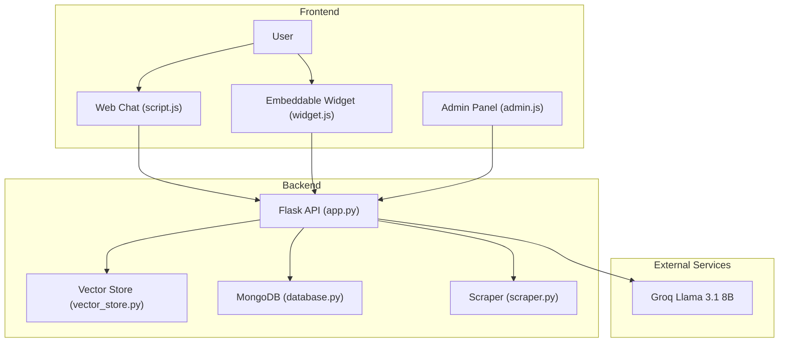
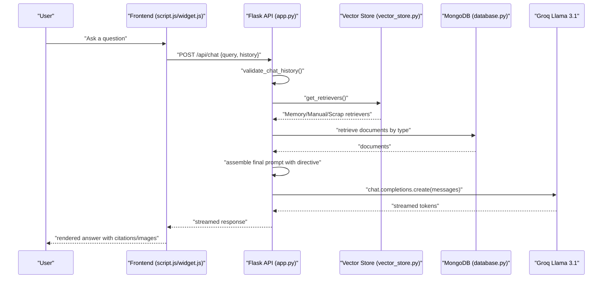
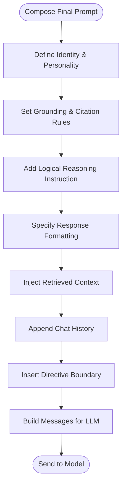
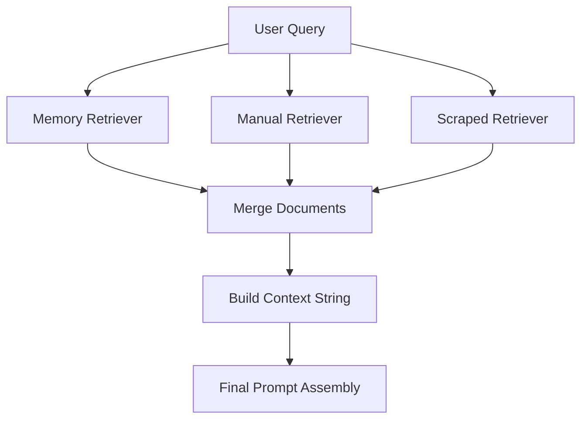
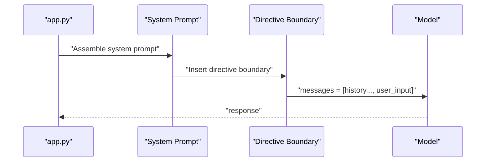
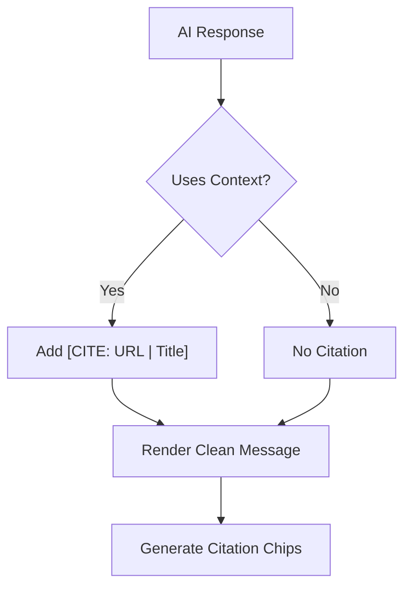
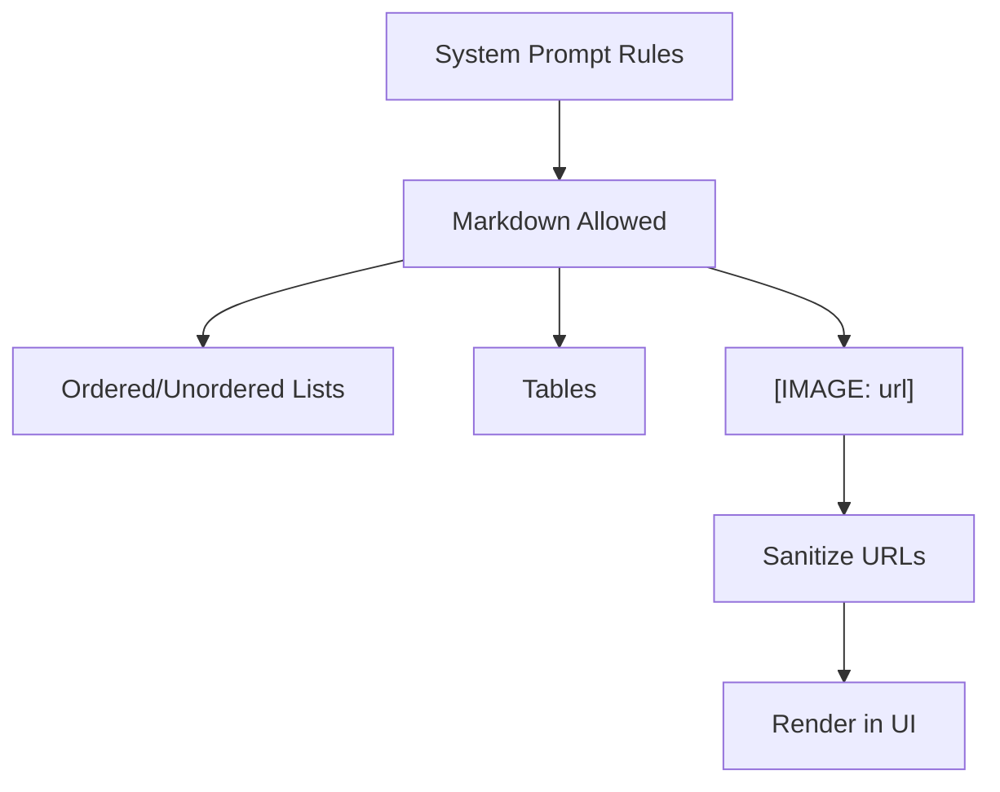
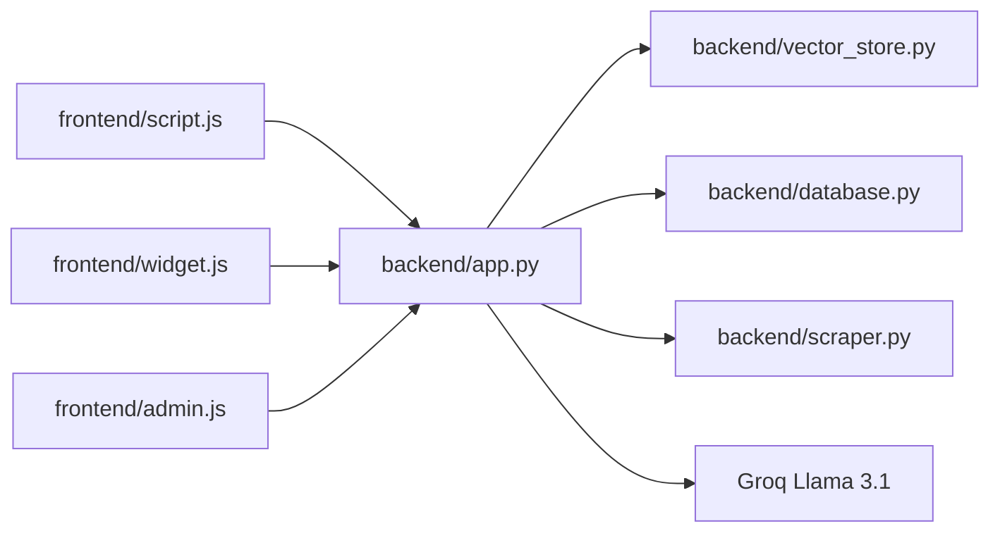

# Prompt Engineering

<cite>
**Referenced Files in This Document**
- [backend/app.py](file://backend/app.py)
- [backend/vector_store.py](file://backend/vector_store.py)
- [backend/database.py](file://backend/database.py)
- [backend/scraper.py](file://backend/scraper.py)
- [API_DOCUMENTATION.md](file://API_DOCUMENTATION.md)
- [frontend/script.js](file://frontend/script.js)
- [frontend/widget.js](file://frontend/widget.js)
- [frontend/admin.js](file://frontend/admin.js)
- [requirements.txt](file://requirements.txt)
</cite>

## Table of Contents
1. [Introduction](#introduction)
2. [Project Structure](#project-structure)
3. [Core Components](#core-components)
4. [Architecture Overview](#architecture-overview)
5. [Detailed Component Analysis](#detailed-component-analysis)
6. [Dependency Analysis](#dependency-analysis)
7. [Performance Considerations](#performance-considerations)
8. [Troubleshooting Guide](#troubleshooting-guide)
9. [Conclusion](#conclusion)
10. [Appendices](#appendices)

## Introduction
This document provides a comprehensive guide to prompt engineering and system prompt design for the DamayAI Assistant. It explains the system prompt structure, composition strategies, context injection, instruction optimization, grounding and reasoning requirements, response formatting rules, and operational controls. It also covers prompt versioning, testing methodologies, evaluation metrics, examples, templates, and safety considerations tailored for educational AI applications.

## Project Structure
The system integrates:
- Backend service (Flask) orchestrating retrieval, prompt assembly, and model invocation
- Vector store (FAISS) with LangChain embeddings for semantic search
- Database (MongoDB) for persistent knowledge banks
- Frontend widgets and admin panel for user interaction and system administration
- Optional web scraping pipeline for external content ingestion

**Diagram sources**
- [backend/app.py:432-760](file://backend/app.py#L432-L760)
- [backend/vector_store.py:48-115](file://backend/vector_store.py#L48-L115)
- [backend/database.py:18-260](file://backend/database.py#L18-L260)
- [backend/scraper.py:152-278](file://backend/scraper.py#L152-L278)
- [frontend/script.js:78-111](file://frontend/script.js#L78-L111)
- [frontend/widget.js:441-470](file://frontend/widget.js#L441-L470)
- [frontend/admin.js:160-244](file://frontend/admin.js#L160-L244)

**Section sources**
- [API_DOCUMENTATION.md:1-347](file://API_DOCUMENTATION.md#L1-L347)
- [requirements.txt:1-30](file://requirements.txt#L1-L30)

## Core Components
- System prompt and directive assembly: The backend composes a structured system prompt that defines identity, personality, rules, grounding, reasoning, and formatting requirements, then injects retrieved context and chat history.
- Retrieval-augmented generation (RAG): Three FAISS indexes (Memory Bank, Manual Data, Scraped Data) are queried to assemble supporting context for each user query.
- Streaming and moderation: The system validates inputs, sanitizes content, enforces rate limits, and streams model responses for interactive experiences.
- Frontend presentation: The chat UI renders Markdown, handles citations, and supports accessibility and responsive design.

Key prompt engineering elements implemented:
- Identity and personality: Defines conversational tone and grounding expectations
- Grounding requirement: Requires citing sources when using facts from provided context
- Reasoning instruction: Encourages logical inference without explicit reasoning steps
- Response formatting: Specifies Markdown usage, bullet lists, and image inclusion
- Directive separation: Uses a strict directive boundary to isolate user input from system instructions

**Section sources**
- [backend/app.py:609-760](file://backend/app.py#L609-L760)
- [backend/vector_store.py:73-115](file://backend/vector_store.py#L73-L115)
- [backend/database.py:96-195](file://backend/database.py#L96-L195)
- [frontend/script.js:159-255](file://frontend/script.js#L159-L255)
- [frontend/widget.js:498-525](file://frontend/widget.js#L498-L525)

## Architecture Overview
The prompt engineering pipeline follows a deterministic flow: validate and sanitize inputs → retrieve relevant context → construct system prompt with directive boundaries → send messages to the model → stream and render responses.

**Diagram sources**
- [backend/app.py:432-760](file://backend/app.py#L432-L760)
- [backend/vector_store.py:73-115](file://backend/vector_store.py#L73-L115)
- [backend/database.py:96-195](file://backend/database.py#L96-L195)
- [frontend/script.js:78-111](file://frontend/script.js#L78-L111)
- [frontend/widget.js:441-470](file://frontend/widget.js#L441-L470)

## Detailed Component Analysis

### System Prompt Composition and Directive Boundary
The backend constructs a comprehensive system prompt that includes:
- Identity and personality: Directives define conversational style, grounding, and human-like flexibility
- Grounding requirement: Explicitly instructs citing sources when using facts from provided context
- Reasoning instruction: Encourages logical inference without exposing reasoning steps
- Response formatting: Specifies Markdown usage, lists, and image inclusion
- Directive boundary: A strict boundary separates user input from system instructions to prevent prompt injection

**Diagram sources**
- [backend/app.py:697-740](file://backend/app.py#L697-L740)

**Section sources**
- [backend/app.py:697-740](file://backend/app.py#L697-L740)

### Context Injection and Retrieval Strategy
The system retrieves context from three knowledge sources:
- Memory Bank: curated Q&A pairs
- Manual Data: uploaded documents
- Scraped Data: website content

Retrieval is performed via FAISS retrievers with caching to reduce latency. Retrieved documents are concatenated into a structured context block with metadata and optional images.

**Diagram sources**
- [backend/app.py:616-694](file://backend/app.py#L616-L694)
- [backend/vector_store.py:73-115](file://backend/vector_store.py#L73-L115)

**Section sources**
- [backend/app.py:616-694](file://backend/app.py#L616-L694)
- [backend/vector_store.py:23-71](file://backend/vector_store.py#L23-L71)

### Instruction Optimization and Directive Separation
The system prompt uses a directive boundary to isolate user input from system instructions. This prevents the model from executing unintended commands embedded within user queries and ensures strict adherence to system-defined behavior.

**Diagram sources**
- [backend/app.py:731-740](file://backend/app.py#L731-L740)

**Section sources**
- [backend/app.py:731-740](file://backend/app.py#L731-L740)

### Grounding Requirements and Citation Rules
Grounding is mandatory when answering factual questions. The system requires citations in a specific format and strips citation tags in the frontend for clean display, while preserving clickable chips that link to sources.

**Diagram sources**
- [backend/app.py:711-722](file://backend/app.py#L711-L722)
- [frontend/script.js:229-255](file://frontend/script.js#L229-L255)
- [frontend/widget.js:498-525](file://frontend/widget.js#L498-L525)

**Section sources**
- [backend/app.py:711-722](file://backend/app.py#L711-L722)
- [frontend/script.js:229-255](file://frontend/script.js#L229-L255)
- [frontend/widget.js:498-525](file://frontend/widget.js#L498-L525)

### Response Formatting and Markdown Rendering
The system specifies Markdown formatting rules and image inclusion. The frontend renders Markdown, converts ordered/unordered lists, tables, and safely handles images and citations.

**Diagram sources**
- [backend/app.py:719-723](file://backend/app.py#L719-L723)
- [frontend/script.js:159-227](file://frontend/script.js#L159-L227)
- [frontend/widget.js:498-525](file://frontend/widget.js#L498-L525)

**Section sources**
- [backend/app.py:719-723](file://backend/app.py#L719-L723)
- [frontend/script.js:159-227](file://frontend/script.js#L159-L227)
- [frontend/widget.js:498-525](file://frontend/widget.js#L498-L525)

### Prompt Versioning, Testing, and Evaluation
- Versioning: The system prompt is centralized in the backend and can be updated by modifying the prompt assembly logic. Consider maintaining prompt variants behind feature flags or environment-controlled toggles.
- Testing: Use the admin chat endpoint (/api/admin_chat) to test prompt changes with streaming responses and inspect retrieval steps.
- Evaluation: Metrics can include:
  - Accuracy of grounded answers (citation presence for factual claims)
  - Completeness (coverage of requested topics)
  - Responsiveness (latency and streaming behavior)
  - Safety (presence of harmful content, robustness to prompt injection)
  - Usability (readability, formatting quality)

**Section sources**
- [API_DOCUMENTATION.md:114-133](file://API_DOCUMENTATION.md#L114-L133)
- [API_DOCUMENTATION.md:197-212](file://API_DOCUMENTATION.md#L197-L212)
- [backend/app.py:589-604](file://backend/app.py#L589-L604)

### Examples, Templates, and Customization Strategies
- Example prompt template structure:
  - Identity and personality
  - Rules and constraints
  - Grounding and citation policy
  - Reasoning instruction
  - Response formatting
  - Context injection block
  - Chat history
  - Directive boundary
- Customization strategies:
  - Adjust temperature and max_tokens for different use cases
  - Modify retrieval weights across knowledge sources
  - Extend directive boundary to enforce stricter isolation
  - Add persona-specific constraints for specialized domains

**Section sources**
- [backend/app.py:697-740](file://backend/app.py#L697-L740)
- [backend/app.py:750-756](file://backend/app.py#L750-L756)

### Bias Mitigation and Safety Considerations
- Input validation and sanitization: Enforce length limits and sanitize chat history and user queries
- SSRF protections: Restrict scraping to allowed domains and validate URLs
- Rate limiting and security headers: Prevent abuse and protect endpoints
- Directive boundary: Prevent command injection by isolating user input
- Content moderation: Strip HTML and enforce length caps to reduce risk

**Section sources**
- [backend/app.py:188-218](file://backend/app.py#L188-L218)
- [backend/scraper.py:12-27](file://backend/scraper.py#L12-L27)
- [API_DOCUMENTATION.md:53-78](file://API_DOCUMENTATION.md#L53-L78)

## Dependency Analysis
The prompt engineering pipeline depends on:
- Retrieval: FAISS indexes and LangChain embeddings
- Storage: MongoDB collections for knowledge bases
- Ingestion: Web scraping utilities for external content
- Frontend rendering: Markdown and citation processing

**Diagram sources**
- [backend/app.py:432-760](file://backend/app.py#L432-L760)
- [backend/vector_store.py:48-115](file://backend/vector_store.py#L48-L115)
- [backend/database.py:18-260](file://backend/database.py#L18-L260)
- [backend/scraper.py:152-278](file://backend/scraper.py#L152-L278)
- [frontend/script.js:78-111](file://frontend/script.js#L78-L111)
- [frontend/widget.js:441-470](file://frontend/widget.js#L441-L470)
- [frontend/admin.js:160-244](file://frontend/admin.js#L160-L244)

**Section sources**
- [requirements.txt:1-30](file://requirements.txt#L1-L30)

## Performance Considerations
- Retrieval caching: FAISS retrievers are cached to avoid reloading on each request
- Chunking and embeddings: Documents are split into manageable chunks for embeddings
- Streaming responses: Enables low-latency, real-time interaction
- Rate limiting: Protects system resources and improves fairness

[No sources needed since this section provides general guidance]

## Troubleshooting Guide
Common issues and resolutions:
- Missing FAISS indexes: The system auto-reindexes at startup if indexes are missing
- Retrieval failures: Verify database connectivity and collection indexing
- Streaming errors: Ensure the admin chat endpoint is used for streaming responses
- Citation rendering: Confirm frontend removes citation tags for display and reconstructs chips

**Section sources**
- [backend/app.py:220-237](file://backend/app.py#L220-L237)
- [backend/database.py:27-49](file://backend/database.py#L27-L49)
- [frontend/script.js:229-255](file://frontend/script.js#L229-L255)
- [frontend/widget.js:498-525](file://frontend/widget.js#L498-L525)

## Conclusion
The DamayAI Assistant demonstrates a robust prompt engineering framework centered on a structured system prompt, directive boundary, and retrieval-augmented generation. By enforcing grounding, citation, and formatting rules, and by leveraging streaming and moderation controls, the system delivers reliable, safe, and educational AI assistance. Continuous testing, versioning, and evaluation ensure sustained quality and safety.

[No sources needed since this section summarizes without analyzing specific files]

## Appendices

### Prompt Composition Checklist
- Identity and personality clearly defined
- Grounding and citation rules explicit
- Reasoning instruction included
- Response formatting specified
- Context injection validated
- Directive boundary enforced
- Safety and bias mitigations applied

[No sources needed since this section provides general guidance]