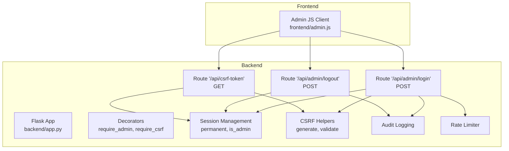
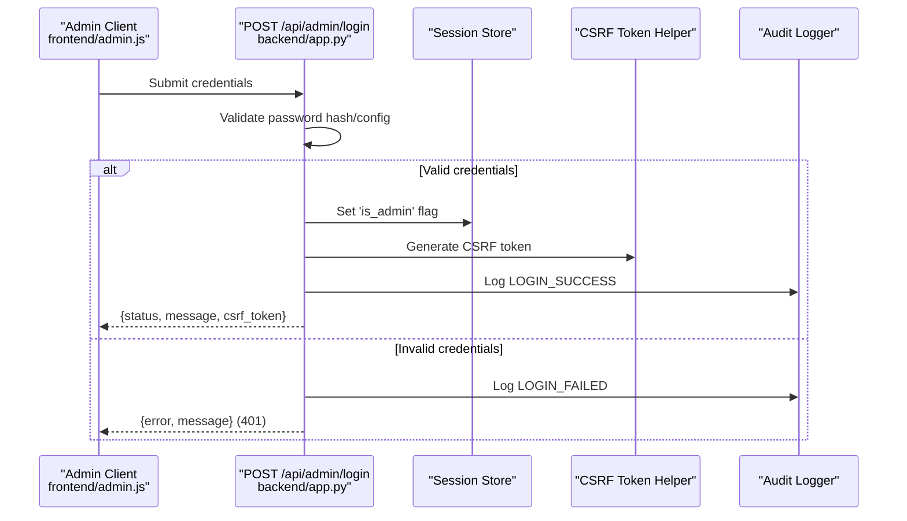
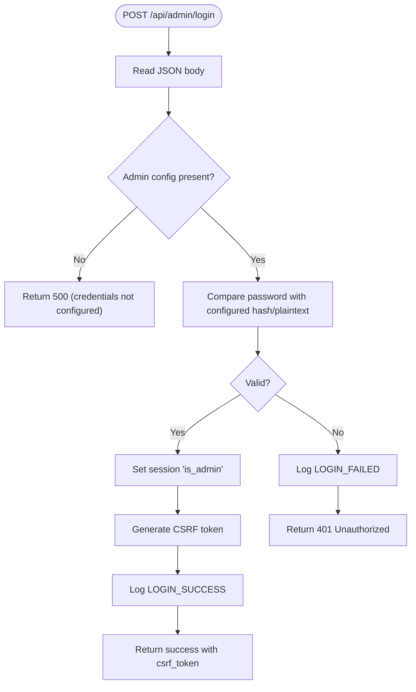
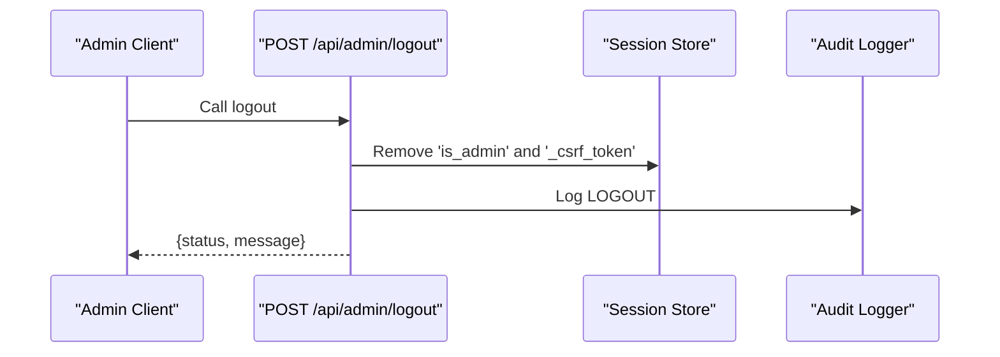
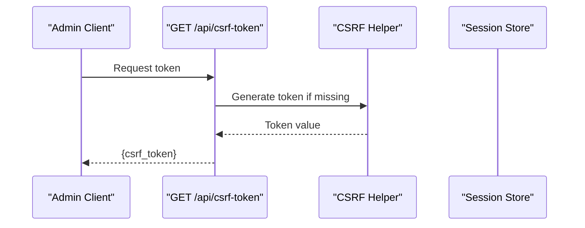
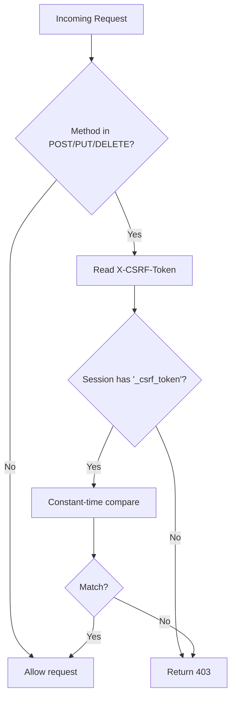
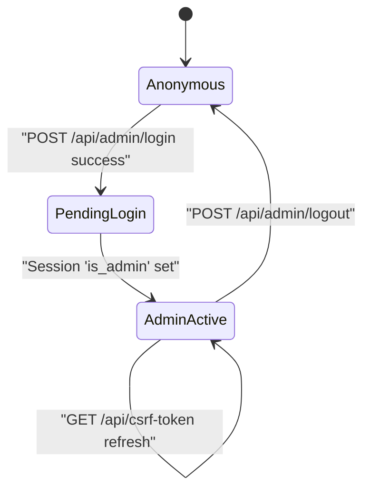
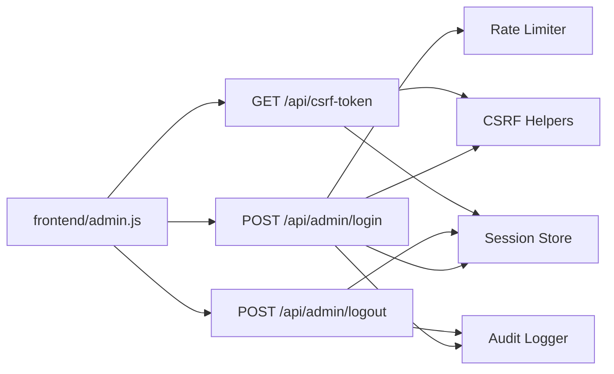

# Admin Authentication & Security

<cite>
**Referenced Files in This Document**
- [backend/app.py](file://backend/app.py)
- [frontend/admin.js](file://frontend/admin.js)
</cite>

## Table of Contents
1. [Introduction](#introduction)
2. [Project Structure](#project-structure)
3. [Core Components](#core-components)
4. [Architecture Overview](#architecture-overview)
5. [Detailed Component Analysis](#detailed-component-analysis)
6. [Dependency Analysis](#dependency-analysis)
7. [Performance Considerations](#performance-considerations)
8. [Troubleshooting Guide](#troubleshooting-guide)
9. [Conclusion](#conclusion)
10. [Appendices](#appendices)

## Introduction
This document provides detailed API documentation for admin authentication and security endpoints. It covers the admin login and logout flows, CSRF protection, session management, rate limiting, audit logging, and security headers. It also explains the admin session lifecycle, permanent session configuration, and CORS behavior for widget embedding. The goal is to help developers and operators implement secure admin access while integrating with the frontend client.

## Project Structure
The authentication and security logic resides primarily in the backend Flask application. The frontend admin client handles CSRF token injection and global 401/403 handling.

**Diagram sources**
- [backend/app.py](file://backend/app.py)
- [frontend/admin.js](file://frontend/admin.js)

**Section sources**
- [backend/app.py](file://backend/app.py)
- [frontend/admin.js](file://frontend/admin.js)

## Core Components
- Admin login endpoint: validates credentials, establishes admin session, generates CSRF token, logs audit events, and enforces rate limits.
- Admin logout endpoint: clears admin session and CSRF token, logs audit event.
- CSRF token endpoint: returns a fresh CSRF token for authenticated admins.
- Session management: makes sessions permanent and tracks admin status.
- CSRF protection: validates X-CSRF-Token header for state-changing requests.
- Audit logging: records login success/failure and logout events.
- Rate limiting: restricts login attempts.
- Frontend integration: injects CSRF tokens and handles 401/403 globally.

**Section sources**
- [backend/app.py](file://backend/app.py)
- [frontend/admin.js](file://frontend/admin.js)

## Architecture Overview
The admin authentication flow integrates the backend routes with the frontend client. The frontend automatically attaches CSRF tokens to outgoing requests and refreshes tokens upon 403 errors. Sessions are made permanent to avoid frequent re-authentication during admin work.

**Diagram sources**
- [backend/app.py](file://backend/app.py)

**Section sources**
- [backend/app.py](file://backend/app.py)

## Detailed Component Analysis

### Admin Login Endpoint
- Path: POST /api/admin/login
- Purpose: Authenticate admin and establish session
- Request body: JSON with password field
- Behavior:
  - Validates password against configured hash or plaintext value
  - On success: marks session as admin, generates CSRF token, logs success, returns success with CSRF token
  - On failure: logs failure, returns 401 Unauthorized
  - Enforced via rate limiter to prevent brute force
- Response: JSON with status, message, and csrf_token on success; error payload on failure
- Security:
  - Password comparison uses secure hashing verification
  - CSRF token generated and stored in session
  - Audit log entry for both success and failure

**Diagram sources**
- [backend/app.py](file://backend/app.py)

**Section sources**
- [backend/app.py](file://backend/app.py)

### Admin Logout Endpoint
- Path: POST /api/admin/logout
- Purpose: Clear admin session and CSRF token
- Behavior:
  - Removes admin flag and CSRF token from session
  - Logs logout event
  - Returns success message
- Response: JSON with status and message

**Diagram sources**
- [backend/app.py](file://backend/app.py)

**Section sources**
- [backend/app.py](file://backend/app.py)

### CSRF Token Endpoint
- Path: GET /api/csrf-token
- Purpose: Provide a fresh CSRF token for authenticated admins
- Access control: Requires admin session
- Behavior:
  - Generates and returns a CSRF token
- Response: JSON with csrf_token

**Diagram sources**
- [backend/app.py](file://backend/app.py)

**Section sources**
- [backend/app.py](file://backend/app.py)

### CSRF Protection Mechanism
- Validation:
  - For state-changing requests (POST/PUT/DELETE), the X-CSRF-Token header is compared against the session-stored token using constant-time comparison
  - Requests without a matching token receive 403 Forbidden
- Generation:
  - CSRF token is generated once per session and reused until cleared
- Frontend integration:
  - The client automatically attaches X-CSRF-Token for state-changing requests
  - On 403, the client requests a fresh token and retries

**Diagram sources**
- [backend/app.py](file://backend/app.py)

**Section sources**
- [backend/app.py](file://backend/app.py)
- [frontend/admin.js](file://frontend/admin.js)

### Session Management and Lifecycle
- Permanent sessions:
  - All sessions are made permanent at startup to maintain admin sessions across browser restarts
- Admin session flag:
  - Set upon successful login and removed on logout
- CSRF token lifecycle:
  - Generated on first access and retained per session; cleared on logout
- Frontend handling:
  - On 401, the client hides admin panel, shows auth overlay, clears CSRF token, and prevents further requests

**Diagram sources**
- [backend/app.py](file://backend/app.py)
- [frontend/admin.js](file://frontend/admin.js)

**Section sources**
- [backend/app.py](file://backend/app.py)
- [frontend/admin.js](file://frontend/admin.js)

### Rate Limiting for Login Attempts
- Applied to POST /api/admin/login
- Restricts number of attempts per minute to mitigate brute-force attacks
- Combined with audit logging to track repeated failures

**Section sources**
- [backend/app.py](file://backend/app.py)

### Audit Logging for Admin Actions
- Logged events:
  - LOGIN_SUCCESS after successful login
  - LOGIN_FAILED after failed login attempt
  - LOGOUT after logout
- Purpose: Monitor suspicious activity and support incident response

**Section sources**
- [backend/app.py](file://backend/app.py)

### Security Headers and CORS
- Sensitive API responses:
  - Cache-control headers disable caching for API paths to prevent sensitive data exposure
- CORS for widget embedding:
  - Public API paths allow cross-origin requests from configured origins
  - Supports GET/POST/OPTIONS with Content-Type header
  - Preflight handled explicitly for OPTIONS requests

**Section sources**
- [backend/app.py](file://backend/app.py)

## Dependency Analysis
- Backend route dependencies:
  - /api/admin/login depends on password validation, session management, CSRF helpers, rate limiter, and audit logger
  - /api/admin/logout depends on session cleanup and audit logger
  - /api/csrf-token depends on CSRF helpers and admin requirement decorator
- Frontend dependencies:
  - Uses X-CSRF-Token header for state-changing requests
  - Handles 401/403 globally, refreshes CSRF token on 403

**Diagram sources**
- [backend/app.py](file://backend/app.py)
- [frontend/admin.js](file://frontend/admin.js)

**Section sources**
- [backend/app.py](file://backend/app.py)
- [frontend/admin.js](file://frontend/admin.js)

## Performance Considerations
- Session permanence reduces re-authentication overhead for admin tasks but requires careful cookie configuration on deployment.
- Rate limiting prevents excessive load during brute-force attempts.
- Constant-time comparison avoids timing attacks during password validation.
- Avoid generating CSRF tokens unnecessarily; reuse existing session tokens.

## Troubleshooting Guide
- 401 Unauthorized on admin actions:
  - Indicates expired or missing admin session; client should prompt login and clear local CSRF token.
- 403 Forbidden on state-changing requests:
  - Indicates invalid or missing CSRF token; client should fetch a fresh token from /api/csrf-token and retry.
- Login fails despite correct password:
  - Verify server-side admin credential configuration; the backend returns 500 if credentials are not configured.
- Widget embedding CORS errors:
  - Ensure Origin is in allowed list and request uses GET/POST/OPTIONS with Content-Type header.

**Section sources**
- [backend/app.py](file://backend/app.py)
- [frontend/admin.js](file://frontend/admin.js)

## Conclusion
The admin authentication and security implementation provides robust protection through session management, CSRF validation, rate limiting, and audit logging. The frontend client integrates seamlessly by injecting CSRF tokens and handling session errors gracefully. Proper deployment configuration (including session cookies and CORS) ensures secure and reliable admin access.

## Appendices

### API Reference Summary
- POST /api/admin/login
  - Body: { password: string }
  - Success: 200 with { status, message, csrf_token }
  - Failure: 401 with error; 500 if credentials not configured
- POST /api/admin/logout
  - Success: 200 with { status, message }
- GET /api/csrf-token
  - Success: 200 with { csrf_token }
  - Requires admin session

**Section sources**
- [backend/app.py](file://backend/app.py)