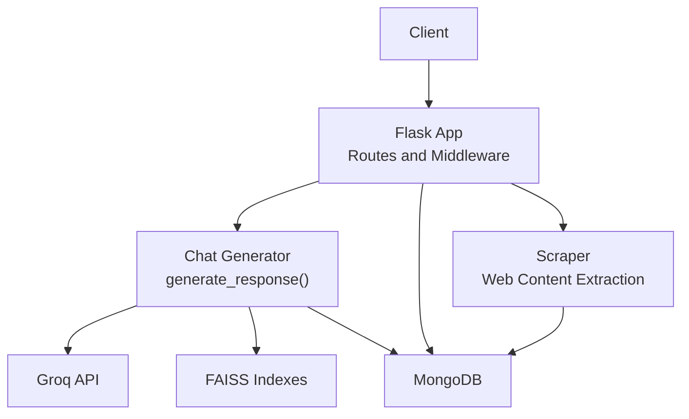
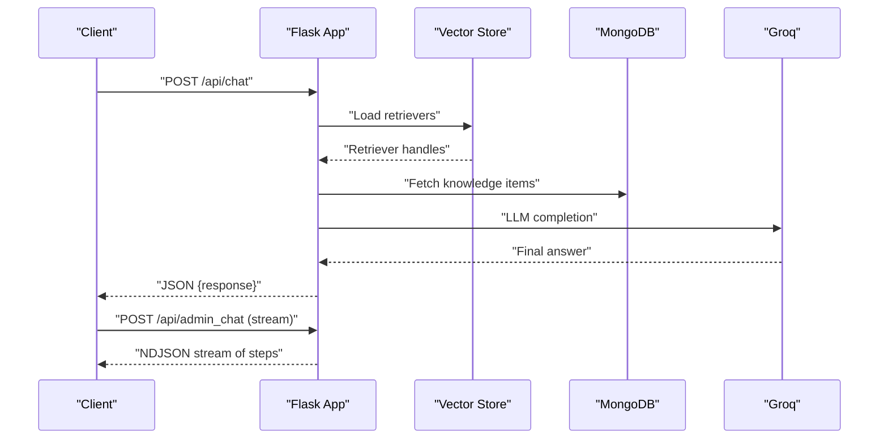
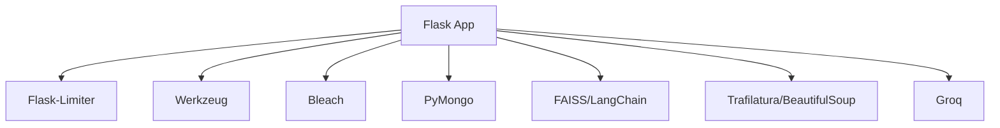

# Backend API Documentation

<cite>
**Referenced Files in This Document**
- [backend/app.py](file://backend/app.py)
- [backend/database.py](file://backend/database.py)
- [backend/vector_store.py](file://backend/vector_store.py)
- [backend/scraper.py](file://backend/scraper.py)
</cite>

## Table of Contents
1. [Introduction](#introduction)
2. [Project Structure](#project-structure)
3. [Core Components](#core-components)
4. [Architecture Overview](#architecture-overview)
5. [Detailed Component Analysis](#detailed-component-analysis)
6. [Dependency Analysis](#dependency-analysis)
7. [Performance Considerations](#performance-considerations)
8. [Troubleshooting Guide](#troubleshooting-guide)
9. [Conclusion](#conclusion)
10. [Appendices](#appendices)

## Introduction
This document provides comprehensive API documentation for the DamayAI-Assistant backend. It covers all RESTful endpoints, including:
- Real-time chat with streaming responses
- Admin authentication
- System health monitoring
- Vector database rebuilding
- Admin data retrieval
- Bug reporting functionality

For each endpoint, you will find HTTP methods, URL patterns, request/response schemas, authentication requirements, error handling, rate limits, security measures, CORS configuration, and client integration guidelines. API versioning, backward compatibility, and deprecation policies are also addressed.

## Project Structure
The backend is implemented using Flask and organized into focused modules:
- Application routes and middleware: [backend/app.py](file://backend/app.py)
- Database operations and indexes: [backend/database.py](file://backend/database.py)
- Vector store creation and retriever loading: [backend/vector_store.py](file://backend/vector_store.py)
- Web scraping and content extraction: [backend/scraper.py](file://backend/scraper.py)

**Diagram sources**
- [backend/app.py:432-761](file://backend/app.py#L432-L761)
- [backend/vector_store.py:48-115](file://backend/vector_store.py#L48-L115)
- [backend/database.py:18-260](file://backend/database.py#L18-L260)
- [backend/scraper.py:83-278](file://backend/scraper.py#L83-L278)

**Section sources**
- [backend/app.py:82-1192](file://backend/app.py#L82-L1192)
- [backend/database.py:1-260](file://backend/database.py#L1-L260)
- [backend/vector_store.py:1-115](file://backend/vector_store.py#L1-L115)
- [backend/scraper.py:1-278](file://backend/scraper.py#L1-L278)

## Core Components
- Flask application with rate limiting, CSRF protection, session management, and security headers
- MongoDB-backed data stores for scraped, manual, memory, and bug report data
- FAISS vector store for semantic search across three knowledge bases
- Web scraping pipeline for extracting and normalizing content from trusted domains

Key capabilities:
- Real-time streaming chat with step-by-step progress
- Admin-only operations for data management and maintenance
- Health checks and administrative dashboards
- Secure cross-origin support for embedded widgets

**Section sources**
- [backend/app.py:95-327](file://backend/app.py#L95-L327)
- [backend/database.py:27-49](file://backend/database.py#L27-L49)
- [backend/vector_store.py:14-21](file://backend/vector_store.py#L14-L21)

## Architecture Overview
The system integrates client requests with vector retrieval, external LLM inference, and persistent storage. Streaming endpoints deliver incremental updates to clients, while admin endpoints enforce authentication and CSRF protections.

**Diagram sources**
- [backend/app.py:432-603](file://backend/app.py#L432-L603)
- [backend/vector_store.py:73-115](file://backend/vector_store.py#L73-L115)
- [backend/database.py:18-260](file://backend/database.py#L18-L260)

## Detailed Component Analysis

### Authentication and Security
- Admin login requires JSON with a password field. Rate-limited to 5 per minute.
- Sessions are permanent with a 2-hour lifetime.
- CSRF protection enforced for state-changing admin endpoints via X-CSRF-Token header.
- Security headers applied globally (X-Content-Type-Options, X-XSS-Protection, Referrer-Policy, Permissions-Policy, X-Frame-Options).
- CORS allowed origins configured for public embedding endpoints.

Endpoints:
- POST /api/admin/login
- POST /api/admin/logout
- GET /api/csrf-token

Response schemas:
- Login success: { status: "success", message: "...", csrf_token: "..." }
- Login failure: { status: "error", message: "..." }
- Logout success: { status: "success", message: "Logged out." }

Authentication requirements:
- Admin endpoints require a valid admin session.
- CSRF token required for POST/PUT/DELETE admin endpoints.

Rate limiting:
- Login: 5 per minute
- Chat: 10 per minute
- Admin chat: 10 per minute
- Reindex: 1 per minute
- Scrape: 1 per minute
- Crawl: 1 per minute
- Bug report: 3 per minute

Security measures:
- Input sanitization and length limits
- ObjectId validation for record identifiers
- Allowed file types for uploads
- Strict-origin-when-cross-origin referrer policy
- No caching for API responses

CORS configuration:
- Origins allowed: school domains
- Public paths: /api/chat, /api/report_bug, /widget.js
- Preflight handled for OPTIONS

**Section sources**
- [backend/app.py:331-365](file://backend/app.py#L331-L365)
- [backend/app.py:267-304](file://backend/app.py#L267-L304)
- [backend/app.py:95-116](file://backend/app.py#L95-L116)
- [backend/app.py:151-159](file://backend/app.py#L151-L159)
- [backend/app.py:179-183](file://backend/app.py#L179-L183)
- [backend/app.py:164-174](file://backend/app.py#L164-L174)

### Real-Time Chat with Streaming Responses
Endpoint:
- POST /api/admin_chat (streaming NDJSON)
- POST /api/chat (single JSON response)

Request body (both):
- query: string (max length 2000)
- history: array of { role: "user"|"model", parts: [{ text: string }] } (each part limited to 10000 chars; truncated to last 20 entries)

Streaming response (admin_chat):
- Content-Type: application/x-ndjson
- Lines include steps such as:
  - start, memory_search, memory_found, memory_not_found
  - manual_search, manual_found, manual_not_found
  - scrape_search, scrape_found, scrape_not_found
  - retrieved_docs, final_prompt, final_answer, error

Success response (chat):
- JSON: { response: "..." }

Error handling:
- 400 for invalid input or oversized queries
- 500 for internal errors

Rate limiting:
- 10 per minute

Example request (admin_chat):
- POST /api/admin_chat with JSON containing query and optional history

Example response (admin_chat):
- Streamed NDJSON lines representing reasoning steps and final answer

**Section sources**
- [backend/app.py:589-603](file://backend/app.py#L589-L603)
- [backend/app.py:432-452](file://backend/app.py#L432-L452)
- [backend/app.py:605-761](file://backend/app.py#L605-L761)
- [backend/app.py:188-218](file://backend/app.py#L188-L218)

### System Health Monitoring
Endpoint:
- GET /api/health

Response:
- Healthy: { status: "healthy", database: "connected", timestamp: "..." }
- Unhealthy: { status: "unhealthy", database: "disconnected", error: "..." } with 503

**Section sources**
- [backend/app.py:940-957](file://backend/app.py#L940-L957)

### Vector Database Rebuilding
Endpoint:
- POST /api/reindex

Behavior:
- Rebuilds FAISS indexes for Memory Bank, Manual Data, and Scraped Data
- Streams progress logs
- Invalidates retriever cache afterward

Rate limiting:
- 1 per minute

**Section sources**
- [backend/app.py:848-858](file://backend/app.py#L848-L858)
- [backend/vector_store.py:48-70](file://backend/vector_store.py#L48-L70)
- [backend/vector_store.py:17-21](file://backend/vector_store.py#L17-L21)

### Admin Data Retrieval
Endpoint:
- GET /api/get-data

Response:
- Array of unified records combining scraped, manual, and memory data, sorted by timestamp descending
- Fields include id, type, timestamp, title/content/url/source as applicable

**Section sources**
- [backend/app.py:860-888](file://backend/app.py#L860-L888)

### Bug Reporting Functionality
Endpoint:
- POST /api/report_bug

Request form fields:
- description: string (max length 5000)
- file: optional file (allowed types: png, jpg, jpeg, gif, mp4, mov, avi, webm)

Response:
- Success: { status: "success", message: "..." }
- Validation errors: { status: "error", message: "..." }
- Failure: { status: "error", message: "..." }

Rate limiting:
- 3 per minute

**Section sources**
- [backend/app.py:403-431](file://backend/app.py#L403-L431)

### Additional Admin Endpoints
These endpoints manage data and bug reports. They require admin session and CSRF token for state-changing operations.

- GET /api/dashboard/stats
  - Returns dashboard statistics
- GET /api/scraped-data
  - Lists scraped entries
- GET /api/scraped-data/:id
  - Retrieves a specific scraped entry by ObjectId
- PUT /api/scraped-data/:id
  - Updates a scraped entry
- DELETE /api/scraped-data/:id
  - Deletes a scraped entry
- GET /api/manual-data
  - Lists manual entries
- GET /api/manual-data/:id
  - Retrieves a specific manual entry by ObjectId
- PUT /api/manual-data/:id
  - Updates a manual entry
- DELETE /api/manual-data/:id
  - Deletes a manual entry
- GET /api/memory-data
  - Lists memory entries
- GET /api/memory-data/:id
  - Retrieves a specific memory entry by ObjectId
- PUT /api/memory-data/:id
  - Updates a memory entry
- DELETE /api/memory-data/:id
  - Deletes a memory entry
- GET /api/get_bug_reports
  - Lists all bug reports
- GET /api/bug_reports/:id
  - Retrieves a specific bug report by ObjectId
- PUT /api/bug_reports/:id/status
  - Updates bug report status (valid values: New, In Progress, Done, Not Fixable)
- DELETE /api/bug_reports/:id
  - Deletes a bug report
- POST /api/add_manual_text
  - Adds manual text content
- POST /api/add_manual_file
  - Adds manual file content (PDF, DOCX, PPTX, TXT)
- POST /api/save_memory
  - Saves a Q&A pair to memory
- POST /api/delete_faiss
  - Deletes FAISS index directories
- POST /api/delete_db
  - Drops all collections and reinitializes indexes
- POST /api/scrape
  - Starts scraping URLs from a file
- POST /api/crawl
  - Starts deep crawling from a base URL

Validation and limits:
- ObjectId validation for IDs
- Length limits for content and queries
- Allowed file types for uploads
- Rate limits per endpoint

**Section sources**
- [backend/app.py:959-1166](file://backend/app.py#L959-L1166)
- [backend/database.py:18-260](file://backend/database.py#L18-L260)
- [backend/scraper.py:152-167](file://backend/scraper.py#L152-L167)
- [backend/scraper.py:168-277](file://backend/scraper.py#L168-L277)

## Dependency Analysis
The backend relies on:
- Flask for routing and middleware
- Flask-Limiter for rate limiting
- Werkzeug for security helpers and uploads
- Bleach for input sanitization
- MongoDB via PyMongo for persistence
- FAISS via LangChain for vector search
- HuggingFace Embeddings for local embeddings
- Trafilatura and BeautifulSoup for content extraction
- Groq for LLM completions

**Diagram sources**
- [backend/app.py:95-116](file://backend/app.py#L95-L116)
- [backend/database.py:18-260](file://backend/database.py#L18-L260)
- [backend/vector_store.py:1-115](file://backend/vector_store.py#L1-L115)
- [backend/scraper.py:1-278](file://backend/scraper.py#L1-L278)

**Section sources**
- [backend/app.py:95-116](file://backend/app.py#L95-L116)
- [backend/database.py:18-260](file://backend/database.py#L18-L260)
- [backend/vector_store.py:1-115](file://backend/vector_store.py#L1-L115)
- [backend/scraper.py:1-278](file://backend/scraper.py#L1-L278)

## Performance Considerations
- Retriever caching: FAISS retrievers are cached at module level to avoid reloading on each request.
- Chunk size and overlap: Text splitting uses 1000-character chunks with 100-character overlap for balanced recall and latency.
- Session permanence: Sessions expire after 2 hours to balance usability and resource usage.
- Rate limiting: Configured per endpoint to prevent abuse and protect upstream services.
- Streaming responses: Admin chat streams intermediate steps to improve perceived performance.

Recommendations:
- Scale horizontally behind a reverse proxy
- Monitor FAISS index sizes and rebuild schedule
- Tune chunk size and k value for retrieval quality vs. latency
- Consider Redis for distributed rate limiting in production

**Section sources**
- [backend/vector_store.py:14-21](file://backend/vector_store.py#L14-L21)
- [backend/vector_store.py:36-38](file://backend/vector_store.py#L36-L38)
- [backend/app.py:95-116](file://backend/app.py#L95-L116)

## Troubleshooting Guide
Common issues and resolutions:
- 401 Unauthorized on admin endpoints: Ensure admin login was successful and session is active.
- 403 CSRF failure: Include a valid X-CSRF-Token header for state-changing requests.
- 400 Bad Request: Validate input lengths and formats; check allowed file types.
- 413 Payload Too Large: Reduce file size or content length.
- 429 Too Many Requests: Respect rate limits; retry after the reset period.
- 500 Internal Server Error: Inspect server logs; verify database connectivity and FAISS indexes.

Health checks:
- Use /api/health to confirm database connectivity.

Audit logs:
- Admin actions are logged for audit trails.

**Section sources**
- [backend/app.py:316-327](file://backend/app.py#L316-L327)
- [backend/app.py:267-292](file://backend/app.py#L267-L292)
- [backend/app.py:53-56](file://backend/app.py#L53-L56)

## Conclusion
The DamayAI-Assistant backend provides a robust, secure, and scalable API for chat, data management, and administration. It enforces strong security controls, offers streaming capabilities for responsive interactions, and maintains clear separation between public and admin-only functionality. Administrators can manage knowledge sources, monitor system health, and maintain vector indexes efficiently.

## Appendices

### API Versioning, Backward Compatibility, and Deprecation
- Current state: No explicit versioning scheme is implemented in the codebase.
- Recommendations:
  - Add a version prefix to endpoints (e.g., /v1/api/...) or a Version header.
  - Maintain backward-compatible endpoints for at least 90 days when introducing breaking changes.
  - Announce deprecations with release notes and migration guides.
  - Use HTTP deprecation headers for future removal timelines.

[No sources needed since this section provides general guidance]

### Client Implementation Guidelines
- Authentication flow:
  - POST /api/admin/login with password
  - Store session cookie and CSRF token
  - Include X-CSRF-Token for admin mutations
- Real-time chat:
  - Use /api/admin_chat for streaming NDJSON
  - Parse lines incrementally to render intermediate steps
- Admin operations:
  - Use appropriate endpoints for CRUD on scraped/manual/memory data
  - Validate ObjectId format for ID parameters
- Security:
  - Always enable CSRF protection for state-changing requests
  - Sanitize and truncate inputs according to documented limits
- CORS:
  - For embedding, ensure Origin matches allowed origins

[No sources needed since this section provides general guidance]