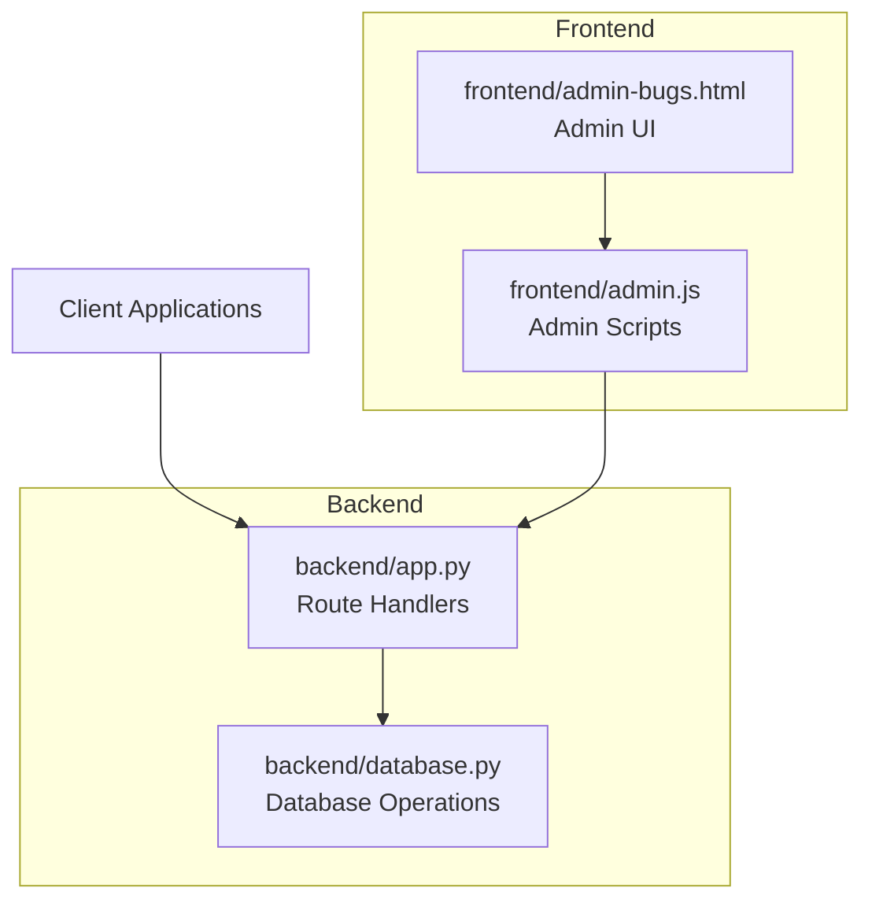
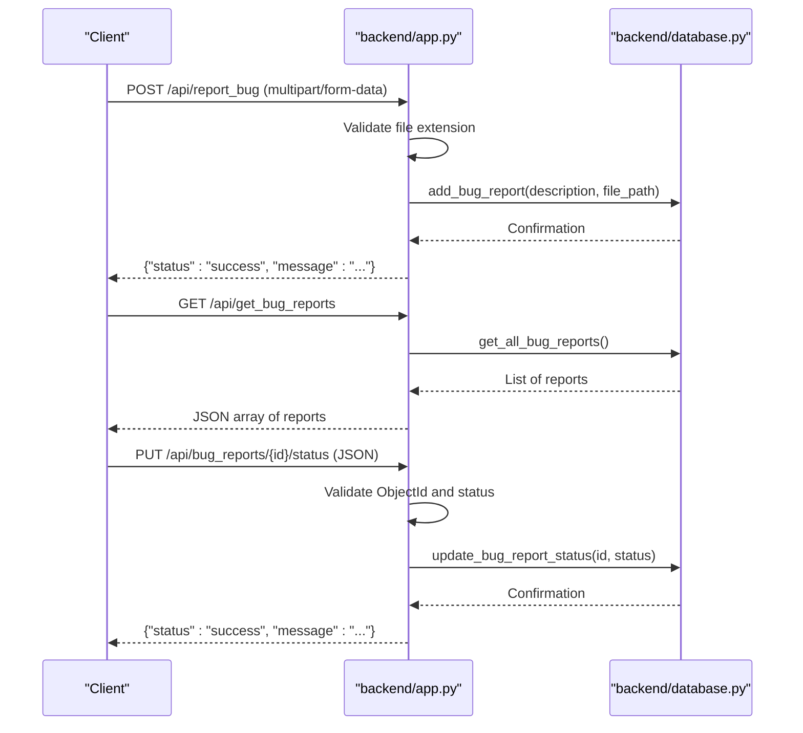
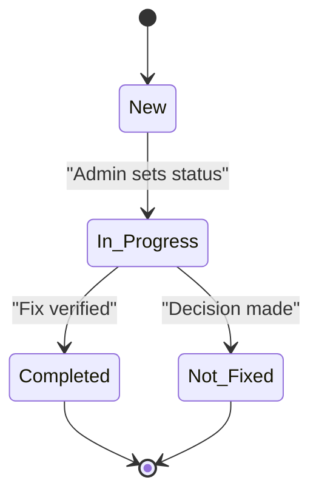
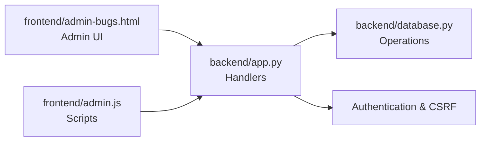

# Bug Reporting Endpoints

<cite>
**Referenced Files in This Document**
- [backend/app.py](file://backend/app.py)
- [backend/database.py](file://backend/database.py)
- [Local Settings/app.py](file://Local Settings/app.py)
- [API_DOCUMENTATION.md](file://API_DOCUMENTATION.md)
- [frontend/admin-bugs.html](file://frontend/admin-bugs.html)
- [frontend/admin.js](file://frontend/admin.js)
</cite>

## Table of Contents
1. [Introduction](#introduction)
2. [Project Structure](#project-structure)
3. [Core Components](#core-components)
4. [Architecture Overview](#architecture-overview)
5. [Detailed Component Analysis](#detailed-component-analysis)
6. [Dependency Analysis](#dependency-analysis)
7. [Performance Considerations](#performance-considerations)
8. [Troubleshooting Guide](#troubleshooting-guide)
9. [Conclusion](#conclusion)

## Introduction
This document provides comprehensive API documentation for the bug reporting system. It covers three primary endpoints:
- Submitting bug reports with optional file attachments
- Retrieving all bug reports
- Updating the status of a specific bug report

It also explains the bug report lifecycle, supported status values, administrative workflows, file attachment handling (including media types and size considerations), and integration patterns for bug tracking.

## Project Structure
The bug reporting functionality spans backend route handlers, database operations, and frontend administrative pages:
- Backend routes define the public and admin endpoints
- Database module persists bug reports and manages status updates
- Frontend admin pages provide administrative controls for viewing and managing bug reports

**Diagram sources**
- [backend/app.py](file://backend/app.py)
- [backend/database.py](file://backend/database.py)
- [frontend/admin-bugs.html](file://frontend/admin-bugs.html)
- [frontend/admin.js](file://frontend/admin.js)

**Section sources**
- [backend/app.py](file://backend/app.py)
- [backend/database.py](file://backend/database.py)
- [frontend/admin-bugs.html](file://frontend/admin-bugs.html)
- [frontend/admin.js](file://frontend/admin.js)

## Core Components
This section documents the three core endpoints and their behaviors.

### Endpoint: POST /api/report_bug
Purpose: Accepts a bug report submission with an optional file attachment.

Key behaviors:
- Accepts multipart/form-data with fields:
  - description: Text description of the bug
  - file: Optional file attachment (image/video)
- Validates file extension against allowed types
- Stores the bug report with metadata and file path
- Returns a JSON response indicating success or error

Allowed file extensions:
- png, jpg, jpeg, gif, mp4, mov, avi, webm

Rate limiting:
- Public endpoint with rate limit enforced (3 per minute)

Response format:
- On success: {"status": "success", "message": "..."}
- On client error: {"status": "error", "message": "..."} with 400
- On server error: {"status": "error", "message": "..."} with 500

Security considerations:
- File extension whitelist prevents arbitrary file uploads
- File path storage is handled by the backend; ensure secure storage location

Example request:
- POST /api/report_bug
- Content-Type: multipart/form-data
- Fields:
  - description: "Bug description text"
  - file: [optional image/video file]

Example response (success):
- {"status": "success", "message": "Bug report submitted"}

**Section sources**
- [backend/app.py](file://backend/app.py)
- [backend/database.py](file://backend/database.py)
- [API_DOCUMENTATION.md](file://API_DOCUMENTATION.md)

### Endpoint: GET /api/get_bug_reports
Purpose: Retrieves all bug reports stored in the system.

Behavior:
- Returns a JSON array containing all bug report entries
- Each entry includes report metadata and status

Response format:
- Success: [{"id": "...", "description": "...", "status": "...", "file_path": "..."}, ...]
- Error: {"status": "error", "message": "..."} with 500

Example response (success):
- [{"id": "60d5...", "description": "Bug description", "status": "New", "file_path": "/uploads/..."}]

**Section sources**
- [backend/app.py](file://backend/app.py)
- [backend/database.py](file://backend/database.py)

### Endpoint: PUT /api/bug_reports/{id}/status
Purpose: Updates the status of a specific bug report.

Authorization:
- Requires admin authentication and CSRF protection

Validation:
- Validates ObjectId format for the report ID
- Ensures the new status is one of the allowed values

Allowed statuses:
- New, In Progress, Completed, Not Fixed

Request body:
- JSON object with field:
  - status: One of the allowed statuses

Response format:
- Success: {"status": "success", "message": "..."}
- Client error (invalid ID or status): {"status": "error", "message": "..."} with 400
- Server error: {"status": "error", "message": "..."} with 500

Example request:
- PUT /api/bug_reports/60d5ecb5f6b2a3c1d4e5f6a7/status
- Body: {"status": "In Progress"}

Example response (success):
- {"status": "success", "message": "Bug report 60d5ecb5f6b2a3c1d4e5f6a7 status updated."}

**Section sources**
- [backend/app.py](file://backend/app.py)
- [backend/database.py](file://backend/database.py)
- [API_DOCUMENTATION.md](file://API_DOCUMENTATION.md)

## Architecture Overview
The bug reporting workflow connects clients, backend routes, and database persistence. Administrative actions require authentication and CSRF tokens.

**Diagram sources**
- [backend/app.py](file://backend/app.py)
- [backend/database.py](file://backend/database.py)

## Detailed Component Analysis

### Bug Report Lifecycle and Status Management
Supported statuses:
- New
- In Progress
- Completed
- Not Fixed

Administrative workflows:
- Admins can update status via PUT /api/bug_reports/{id}/status
- Admins can delete reports via DELETE /api/bug_reports/{id}
- Admins can fetch individual reports via GET /api/bug_reports/{id}

**Diagram sources**
- [backend/app.py](file://backend/app.py)

**Section sources**
- [backend/app.py](file://backend/app.py)

### File Attachment Handling
Supported media types:
- Images: png, jpg, jpeg, gif
- Videos: mp4, mov, avi, webm

Size considerations:
- Size limits are not explicitly defined in the analyzed code; implement appropriate checks at the application boundary if needed

Security considerations:
- File extension validation prevents unauthorized uploads
- Ensure file storage is isolated and protected
- Consider virus scanning and sanitization for uploaded files

**Section sources**
- [backend/app.py](file://backend/app.py)
- [Local Settings/app.py](file://Local Settings/app.py)

### Request/Response Examples
- Submitting a bug report:
  - POST /api/report_bug
  - Content-Type: multipart/form-data
  - Fields: description, file (optional)
  - Success response: {"status": "success", "message": "..."}
  - Error response: {"status": "error", "message": "..."}

- Retrieving all bug reports:
  - GET /api/get_bug_reports
  - Success response: JSON array of reports
  - Error response: {"status": "error", "message": "..."}

- Updating bug status:
  - PUT /api/bug_reports/{id}/status
  - Body: {"status": "New|In Progress|Completed|Not Fixed"}
  - Success response: {"status": "success", "message": "..."}
  - Error response: {"status": "error", "message": "..."}

**Section sources**
- [backend/app.py](file://backend/app.py)
- [API_DOCUMENTATION.md](file://API_DOCUMENTATION.md)

### Integration Patterns
- Public integration: Clients submit bug reports using the public POST endpoint
- Admin integration: Administrators manage reports using admin endpoints with CSRF protection
- Frontend admin page: The admin bugs page coordinates with backend routes for listing and managing reports

**Section sources**
- [frontend/admin-bugs.html](file://frontend/admin-bugs.html)
- [frontend/admin.js](file://frontend/admin.js)
- [backend/app.py](file://backend/app.py)

## Dependency Analysis
The backend route handlers depend on database functions for persistence and status updates. Administrative endpoints enforce authentication and CSRF protections.

**Diagram sources**
- [backend/app.py](file://backend/app.py)
- [backend/database.py](file://backend/database.py)
- [frontend/admin-bugs.html](file://frontend/admin-bugs.html)
- [frontend/admin.js](file://frontend/admin.js)

**Section sources**
- [backend/app.py](file://backend/app.py)
- [backend/database.py](file://backend/database.py)
- [frontend/admin-bugs.html](file://frontend/admin-bugs.html)
- [frontend/admin.js](file://frontend/admin.js)

## Performance Considerations
- Rate limiting is applied to the public bug report submission endpoint to prevent abuse
- Consider implementing asynchronous processing for file uploads and indexing if throughput increases
- Monitor database query performance for large report datasets

## Troubleshooting Guide
Common issues and resolutions:
- Invalid ObjectId for status update or deletion:
  - Verify the report ID format matches MongoDB ObjectId requirements
- Invalid status value:
  - Ensure the status is one of the allowed values: New, In Progress, Completed, Not Fixed
- File upload errors:
  - Confirm the file extension is in the allowed set
  - Check that the file size does not exceed server limits
- Authentication failures:
  - Ensure admin credentials are valid and CSRF token is included for admin endpoints

**Section sources**
- [backend/app.py](file://backend/app.py)
- [API_DOCUMENTATION.md](file://API_DOCUMENTATION.md)

## Conclusion
The bug reporting endpoints provide a robust foundation for collecting user feedback with optional media attachments, retrieving reports, and managing their lifecycle through administrative actions. By adhering to the documented validation rules, status values, and security practices, teams can effectively integrate and operate the bug tracking system.