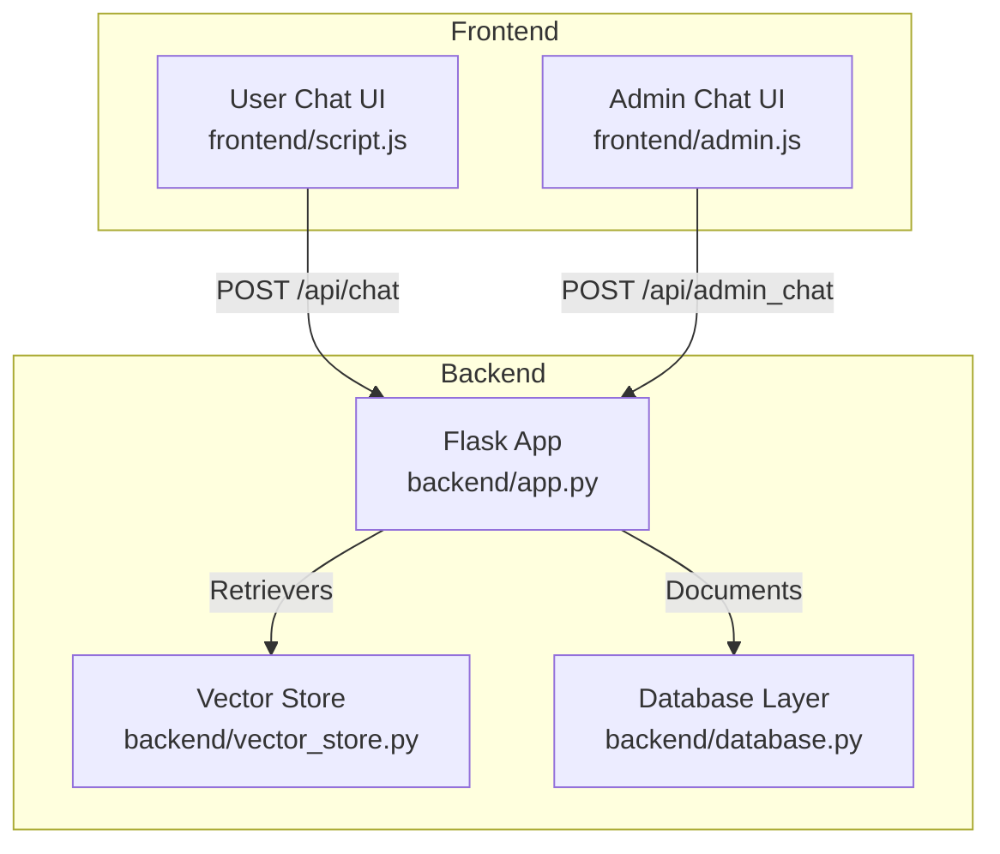
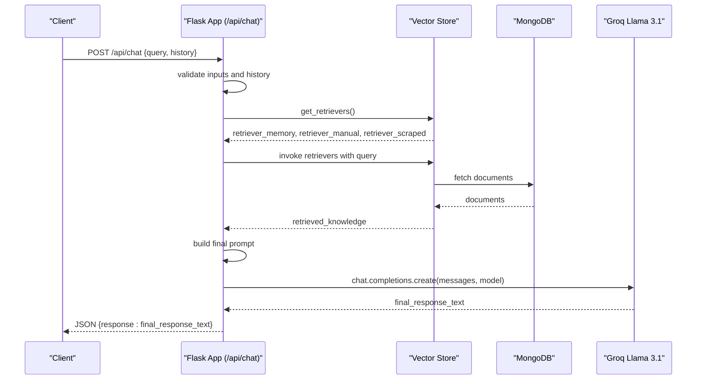
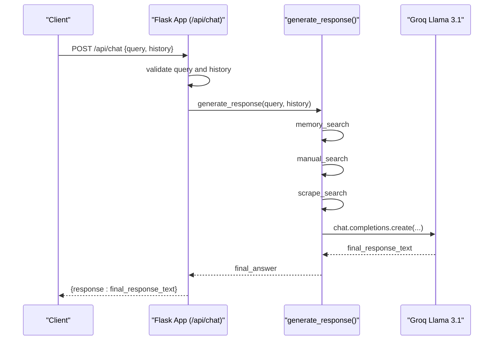
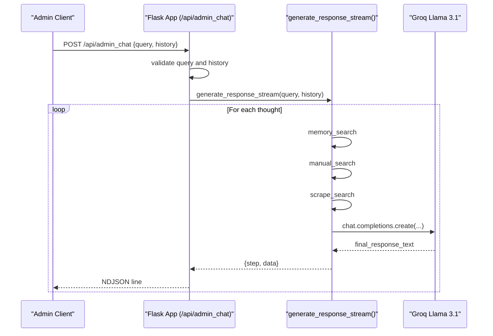
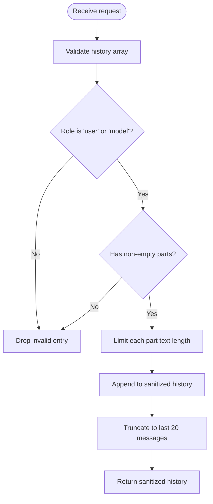
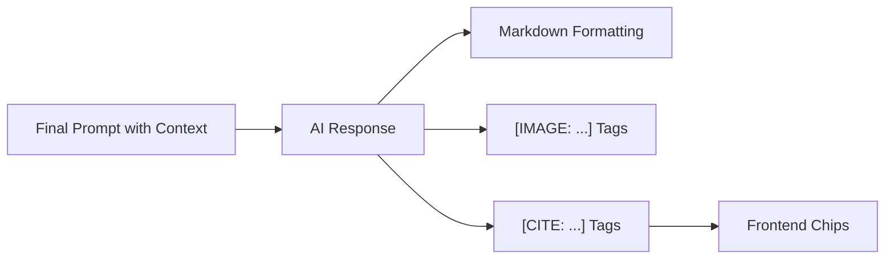
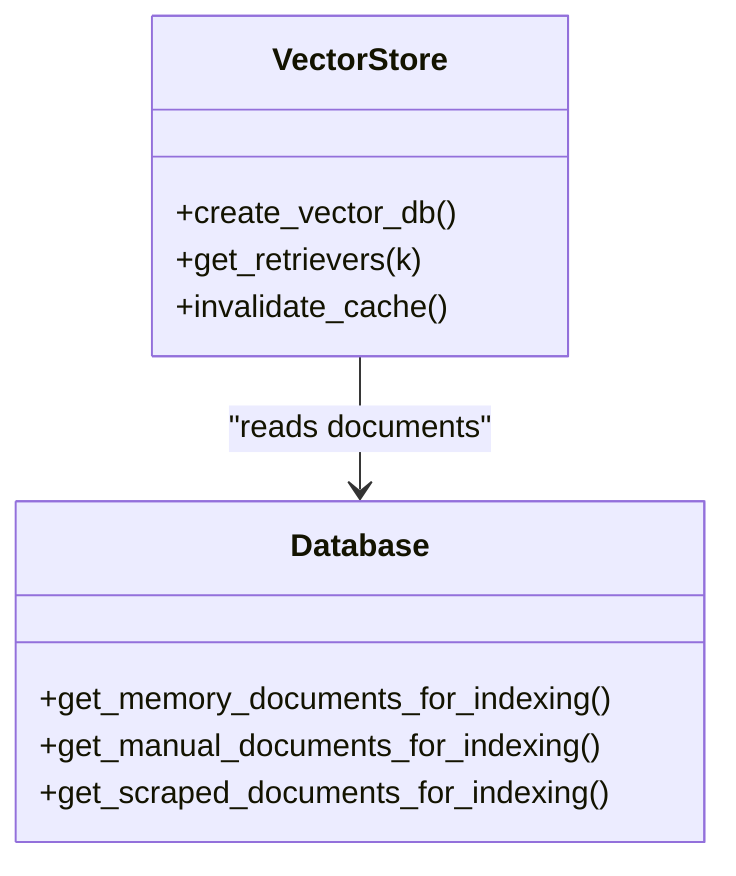
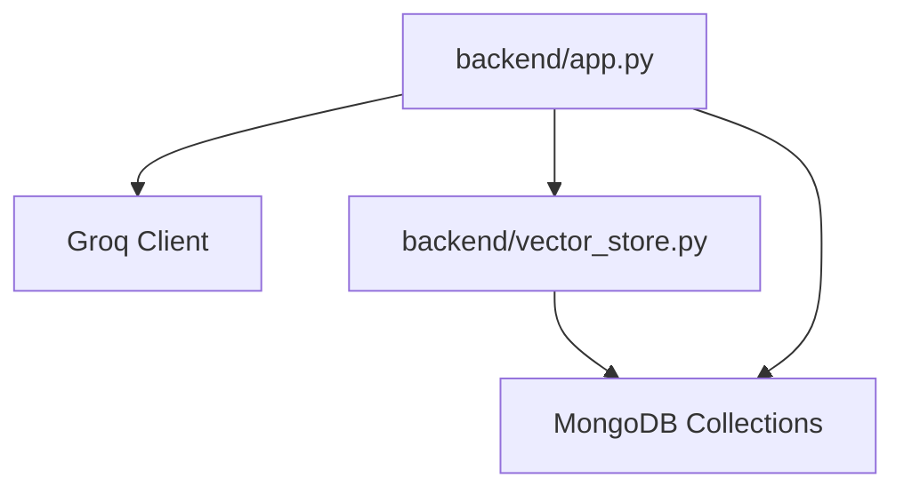

# Chat Endpoints

<cite>
**Referenced Files in This Document**
- [backend/app.py](file://backend/app.py)
- [backend/vector_store.py](file://backend/vector_store.py)
- [backend/database.py](file://backend/database.py)
- [frontend/script.js](file://frontend/script.js)
- [frontend/admin.js](file://frontend/admin.js)
- [API_DOCUMENTATION.md](file://API_DOCUMENTATION.md)
- [requirements.txt](file://requirements.txt)
</cite>

## Table of Contents
1. [Introduction](#introduction)
2. [Project Structure](#project-structure)
3. [Core Components](#core-components)
4. [Architecture Overview](#architecture-overview)
5. [Detailed Component Analysis](#detailed-component-analysis)
6. [Dependency Analysis](#dependency-analysis)
7. [Performance Considerations](#performance-considerations)
8. [Troubleshooting Guide](#troubleshooting-guide)
9. [Conclusion](#conclusion)
10. [Appendices](#appendices)

## Introduction
This document provides comprehensive API documentation for the chat-related endpoints:
- /api/chat: Real-time public chat with JSON responses and streaming-like behavior.
- /api/admin_chat: Administrative chat with Server-Sent Events (SSE) streaming.

It covers request/response schemas, authentication, rate limiting, conversation flow, chat history validation, input sanitization, response formatting, AI response generation, knowledge base retrieval, citation system, performance considerations, timeouts, and client-side integration patterns.

## Project Structure
The chat endpoints are implemented in the Flask backend, with knowledge retrieval powered by FAISS indexes built from MongoDB collections. The frontend integrates with these endpoints to deliver user and admin experiences.

**Diagram sources**
- [backend/app.py:432-607](file://backend/app.py#L432-L607)
- [backend/vector_store.py:73-115](file://backend/vector_store.py#L73-L115)
- [backend/database.py:96-195](file://backend/database.py#L96-L195)
- [frontend/script.js:78-111](file://frontend/script.js#L78-L111)
- [frontend/admin.js:1019-1069](file://frontend/admin.js#L1019-L1069)

**Section sources**
- [backend/app.py:432-607](file://backend/app.py#L432-L607)
- [backend/vector_store.py:73-115](file://backend/vector_store.py#L73-L115)
- [backend/database.py:96-195](file://backend/database.py#L96-L195)
- [frontend/script.js:78-111](file://frontend/script.js#L78-L111)
- [frontend/admin.js:1019-1069](file://frontend/admin.js#L1019-L1069)

## Core Components
- Public chat endpoint (/api/chat): Accepts a query and optional chat history, validates inputs, retrieves knowledge from three FAISS indexes, constructs a prompt, and returns a JSON response containing the final answer.
- Admin chat endpoint (/api/admin_chat): Similar to the public chat but streams intermediate steps as NDJSON for admin visibility and testing.
- Knowledge base retrieval: Three retrievers (Memory Bank, Manual Data, Scraped Data) powered by FAISS indexes and LangChain.
- Input validation and sanitization: Enforces length limits, sanitizes text, validates chat history format, and ensures ObjectId correctness for admin operations.
- Rate limiting: Applied to chat endpoints and others to prevent abuse.
- Authentication: Admin endpoints require session-based authentication and CSRF protection.

**Section sources**
- [backend/app.py:432-607](file://backend/app.py#L432-L607)
- [backend/vector_store.py:48-70](file://backend/vector_store.py#L48-L70)
- [backend/database.py:96-195](file://backend/database.py#L96-L195)
- [API_DOCUMENTATION.md:65-71](file://API_DOCUMENTATION.md#L65-L71)

## Architecture Overview
The chat pipeline consists of:
- Client sends a request to either /api/chat or /api/admin_chat.
- Backend validates inputs and chat history.
- Retrieves relevant documents from FAISS indexes using three retrievers.
- Builds a final prompt with retrieved context and conversation history.
- Calls the AI model via Groq to generate a response.
- Returns a JSON response for /api/chat or NDJSON events for /api/admin_chat.

**Diagram sources**
- [backend/app.py:609-760](file://backend/app.py#L609-L760)
- [backend/vector_store.py:73-115](file://backend/vector_store.py#L73-L115)
- [backend/database.py:96-195](file://backend/database.py#L96-L195)

## Detailed Component Analysis

### /api/chat (Public Chat)
- Purpose: Real-time user conversation with a single JSON response.
- Method: POST
- Authentication: Not required for public chat.
- Rate Limit: 10 per minute.
- Request Schema:
  - query: string (required), max length 2,000 characters.
  - history: array of message objects (optional), max 20 messages, each with role and parts.
- Response Schema:
  - response: string (final answer from AI).
- Behavior:
  - Validates query length and chat history.
  - Retrieves knowledge from Memory Bank, Manual Data, and Scraped Data.
  - Constructs a final prompt and calls the AI model.
  - Returns a JSON object with the final answer.

**Diagram sources**
- [backend/app.py:432-452](file://backend/app.py#L432-L452)
- [backend/app.py:609-760](file://backend/app.py#L609-L760)

**Section sources**
- [backend/app.py:432-452](file://backend/app.py#L432-L452)
- [backend/app.py:609-760](file://backend/app.py#L609-L760)
- [API_DOCUMENTATION.md:197-212](file://API_DOCUMENTATION.md#L197-L212)

### /api/admin_chat (Administrative Chat with SSE)
- Purpose: Admin-only chat with streaming NDJSON events for step-by-step insight.
- Method: POST
- Authentication: Admin session required.
- Rate Limit: 10 per minute.
- Request Schema:
  - query: string (required), max length 2,000 characters.
  - history: array of message objects (optional), max 20 messages.
- Streaming Response (NDJSON):
  - Each line is a JSON object with step and data fields.
  - Steps include start, memory_search, memory_found/not_found, manual_search, manual_found/not_found, scrape_search, scrape_found/not_found, final_prompt, retrieved_docs, final_answer, and error.
- Behavior:
  - Same retrieval and prompting pipeline as public chat.
  - Streams intermediate steps to the client for monitoring and testing.

**Diagram sources**
- [backend/app.py:589-607](file://backend/app.py#L589-L607)
- [backend/app.py:605-607](file://backend/app.py#L605-L607)
- [backend/app.py:609-760](file://backend/app.py#L609-L760)

**Section sources**
- [backend/app.py:589-607](file://backend/app.py#L589-L607)
- [backend/app.py:605-607](file://backend/app.py#L605-L607)
- [backend/app.py:609-760](file://backend/app.py#L609-L760)
- [frontend/admin.js:1019-1069](file://frontend/admin.js#L1019-L1069)

### Conversation Flow and Chat History Validation
- Chat history validation enforces:
  - Must be an array.
  - Roles must be user or model.
  - Each entry must have a non-empty parts array of objects with a text field.
  - Limits each part’s text length and truncates history to the last 20 messages.
- The validated history is passed to the AI model as prior conversation context.

**Diagram sources**
- [backend/app.py:188-218](file://backend/app.py#L188-L218)

**Section sources**
- [backend/app.py:188-218](file://backend/app.py#L188-L218)

### Input Sanitization and Length Limits
- Query length limit: 2,000 characters.
- Chat history parts are truncated to 10,000 characters each.
- General text content limit: 100,000 characters.
- Bug report description limit: 5,000 characters.
- HTML tags are stripped from user inputs to prevent XSS.

**Section sources**
- [backend/app.py:130-133](file://backend/app.py#L130-L133)
- [backend/app.py:179-183](file://backend/app.py#L179-L183)
- [backend/app.py:412-414](file://backend/app.py#L412-L414)
- [API_DOCUMENTATION.md:300-306](file://API_DOCUMENTATION.md#L300-L306)

### Response Formatting and Citation System
- Final AI response supports Markdown formatting (bold, italic, lists, tables).
- Images can be embedded using [IMAGE: url] tags.
- Citations are inserted using [CITE: url | title] format. The frontend converts these into clickable chips.
- The admin chat console displays retrieved documents and final answer for review and saving to memory.

**Diagram sources**
- [backend/app.py:697-760](file://backend/app.py#L697-L760)
- [frontend/admin.js:972-1017](file://frontend/admin.js#L972-L1017)

**Section sources**
- [backend/app.py:697-760](file://backend/app.py#L697-L760)
- [frontend/admin.js:972-1017](file://frontend/admin.js#L972-L1017)

### Knowledge Base Retrieval and Vector Store
- Three retrievers are created from FAISS indexes:
  - Memory Bank: stored questions and answers.
  - Manual Data: uploaded documents (PDF, DOCX, PPTX, TXT).
  - Scraped Data: website content extracted and indexed.
- Retrievers are cached at module level to avoid reloading on each request.
- On startup or reindex, FAISS indexes are rebuilt from MongoDB collections.

**Diagram sources**
- [backend/vector_store.py:48-70](file://backend/vector_store.py#L48-L70)
- [backend/vector_store.py:73-115](file://backend/vector_store.py#L73-L115)
- [backend/database.py:96-195](file://backend/database.py#L96-L195)

**Section sources**
- [backend/vector_store.py:48-70](file://backend/vector_store.py#L48-L70)
- [backend/vector_store.py:73-115](file://backend/vector_store.py#L73-L115)
- [backend/database.py:96-195](file://backend/database.py#L96-L195)

### Authentication and CSRF Protection
- Admin endpoints require a valid admin session.
- CSRF protection is enforced for state-changing requests; CSRF token is injected via header.
- Public chat does not require authentication.

**Section sources**
- [backend/app.py:243-250](file://backend/app.py#L243-L250)
- [backend/app.py:151-159](file://backend/app.py#L151-L159)
- [API_DOCUMENTATION.md:55-63](file://API_DOCUMENTATION.md#L55-L63)

### Rate Limiting
- Chat endpoints: 10 per minute.
- Admin login: 5 per minute.
- Bug reports: 3 per minute.
- Scrape/Crawl/Reindex: 1 per minute.
- General default: 200 per hour.

**Section sources**
- [backend/app.py:98-115](file://backend/app.py#L98-L115)
- [API_DOCUMENTATION.md:65-71](file://API_DOCUMENTATION.md#L65-L71)

### Client-Side Integration Patterns
- Public chat:
  - Sends POST /api/chat with {query, history}.
  - Appends the returned response to chat history and renders it.
- Admin chat:
  - Sends POST /api/admin_chat with {query, history}.
  - Reads NDJSON stream, parses JSON lines, and updates the admin console with step-by-step insights.
  - Allows saving the final answer to memory bank.

**Section sources**
- [frontend/script.js:78-111](file://frontend/script.js#L78-L111)
- [frontend/admin.js:1019-1069](file://frontend/admin.js#L1019-L1069)

## Dependency Analysis
The chat endpoints depend on:
- Flask routing and request handling.
- Groq client for AI model inference.
- LangChain and FAISS for vector search.
- MongoDB for document storage and retrieval.

**Diagram sources**
- [backend/app.py:9-10](file://backend/app.py#L9-L10)
- [backend/app.py:14](file://backend/app.py#L14)
- [backend/app.py:609-760](file://backend/app.py#L609-L760)
- [backend/vector_store.py:48-70](file://backend/vector_store.py#L48-L70)
- [backend/database.py:96-195](file://backend/database.py#L96-L195)

**Section sources**
- [requirements.txt:1-30](file://requirements.txt#L1-L30)
- [backend/app.py:9-10](file://backend/app.py#L9-L10)
- [backend/app.py:14](file://backend/app.py#L14)
- [backend/app.py:609-760](file://backend/app.py#L609-L760)
- [backend/vector_store.py:48-70](file://backend/vector_store.py#L48-L70)
- [backend/database.py:96-195](file://backend/database.py#L96-L195)

## Performance Considerations
- Vector retrievers are cached to avoid repeated FAISS loads.
- Chunk size and overlap for embeddings are tuned for balanced recall and speed.
- Retrievers fetch a fixed number of documents (k) to bound latency.
- Rate limiting prevents overload during peak usage.
- Client-side streaming for admin chat reduces perceived latency by rendering intermediate steps progressively.

[No sources needed since this section provides general guidance]

## Troubleshooting Guide
Common errors and resolutions:
- 400 Bad Request: Invalid input lengths or malformed chat history.
- 401 Unauthorized: Missing or expired admin session.
- 403 Forbidden (CSRF): Missing or stale CSRF token.
- 429 Too Many Requests: Exceeded rate limits; wait for reset.
- 500 Internal Server Error: AI service or database connectivity issues.

Client-side tips:
- For admin chat, ensure the stream reader handles partial lines and JSON parsing errors gracefully.
- Validate that the final answer is captured when step equals final_answer in the stream.

**Section sources**
- [backend/app.py:316-326](file://backend/app.py#L316-L326)
- [frontend/admin.js:1040-1061](file://frontend/admin.js#L1040-L1061)

## Conclusion
The chat endpoints provide a robust, secure, and efficient solution for both public and administrative interactions. They combine validated inputs, sanitized processing, multi-source knowledge retrieval, and clear response formatting with citations. Admins benefit from streaming insights, while users receive fast, contextual answers.

[No sources needed since this section summarizes without analyzing specific files]

## Appendices

### Request and Response Schemas

- /api/chat
  - Request: { query: string, history: array of message objects }
  - Response: { response: string }

- /api/admin_chat
  - Request: { query: string, history: array of message objects }
  - Response: NDJSON stream of { step: string, data: any }

- Message object format:
  - { role: "user"|"model", parts: [{ text: string }] }

**Section sources**
- [backend/app.py:432-452](file://backend/app.py#L432-L452)
- [backend/app.py:589-607](file://backend/app.py#L589-L607)
- [backend/app.py:188-218](file://backend/app.py#L188-L218)

### Authentication and CSRF Headers
- Admin endpoints require:
  - Cookie: session
  - Header: X-CSRF-Token

**Section sources**
- [backend/app.py:243-250](file://backend/app.py#L243-L250)
- [backend/app.py:151-159](file://backend/app.py#L151-L159)

### Rate Limits Summary
- /api/chat: 10 per minute
- /api/admin_chat: 10 per minute
- /api/admin/login: 5 per minute
- /api/report_bug: 3 per minute
- /api/scrape, /api/crawl, /api/reindex: 1 per minute
- Default: 200 per hour

**Section sources**
- [backend/app.py:98-115](file://backend/app.py#L98-L115)
- [API_DOCUMENTATION.md:65-71](file://API_DOCUMENTATION.md#L65-L71)