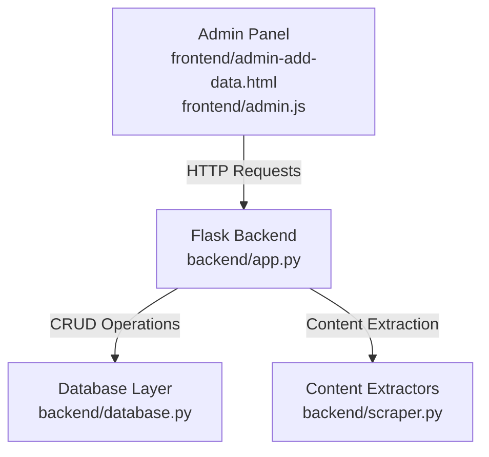
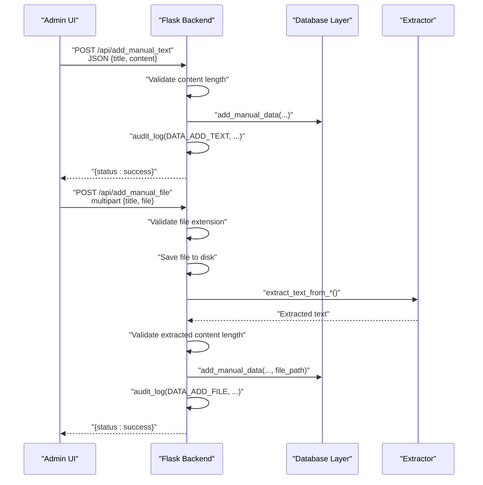
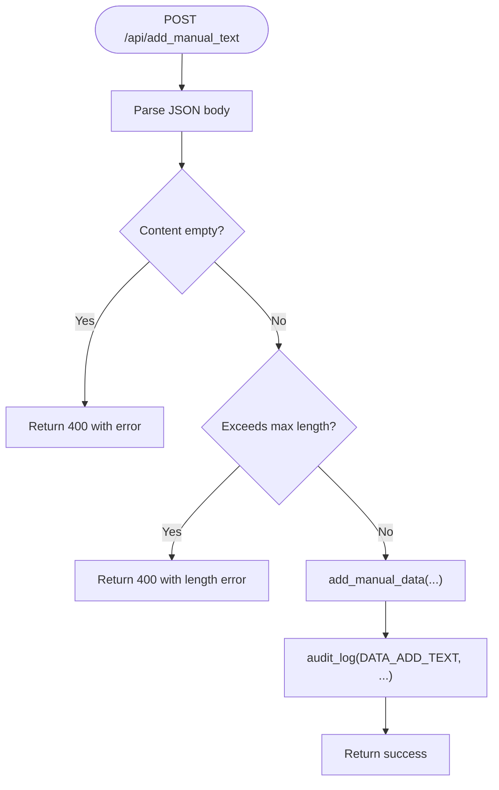
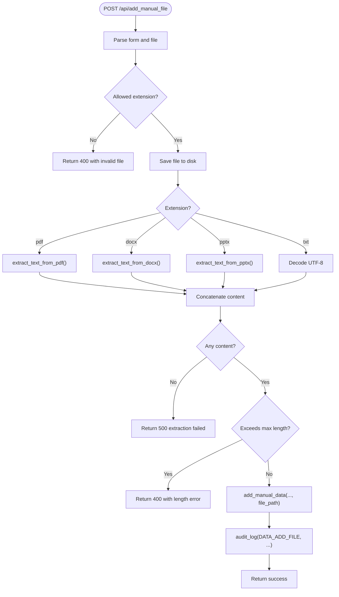
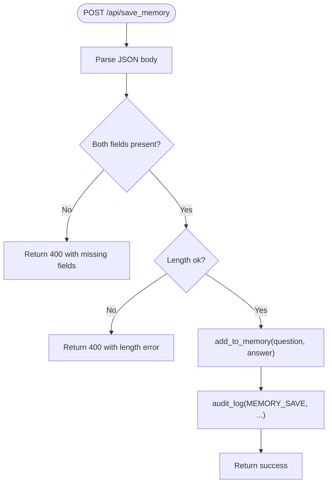
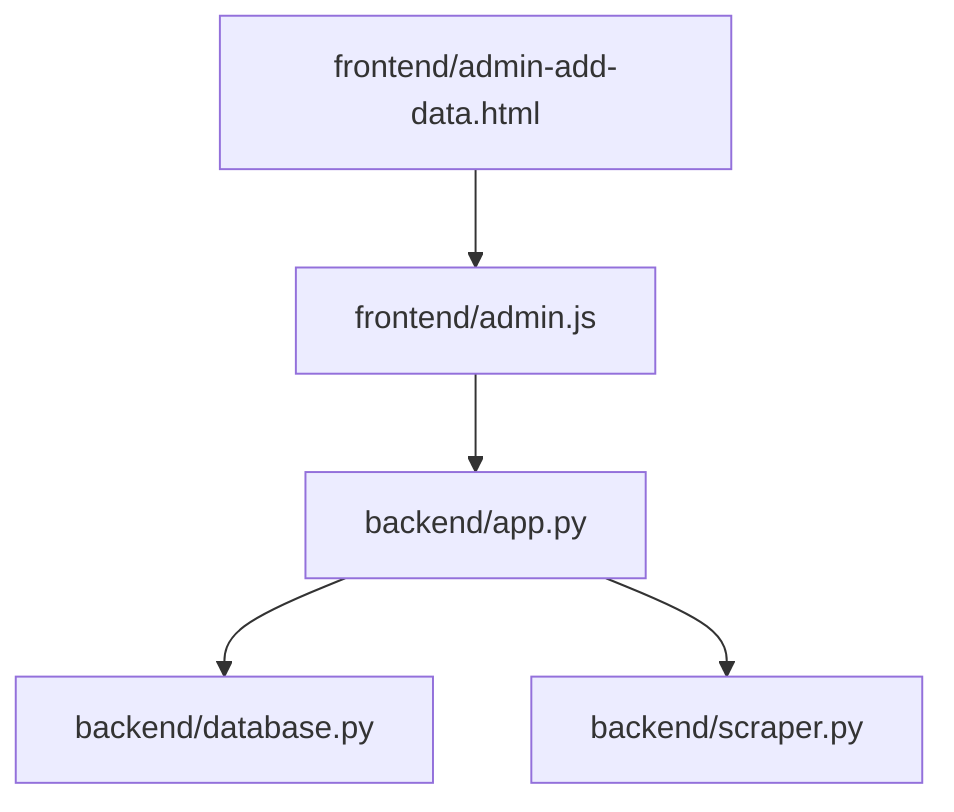

# Content Management Endpoints

<cite>
**Referenced Files in This Document**
- [backend/app.py](file://backend/app.py)
- [backend/database.py](file://backend/database.py)
- [backend/scraper.py](file://backend/scraper.py)
- [frontend/admin.js](file://frontend/admin.js)
- [frontend/admin-add-data.html](file://frontend/admin-add-data.html)
- [generate_api_excel.py](file://generate_api_excel.py)
- [API_DOCUMENTATION.md](file://API_DOCUMENTATION.md)
</cite>

## Table of Contents
1. [Introduction](#introduction)
2. [Project Structure](#project-structure)
3. [Core Components](#core-components)
4. [Architecture Overview](#architecture-overview)
5. [Detailed Component Analysis](#detailed-component-analysis)
6. [Dependency Analysis](#dependency-analysis)
7. [Performance Considerations](#performance-considerations)
8. [Troubleshooting Guide](#troubleshooting-guide)
9. [Conclusion](#conclusion)
10. [Appendices](#appendices)

## Introduction
This document provides comprehensive API documentation for content management endpoints used by administrators to manage knowledge bases. It covers:
- Admin-only endpoints for adding text content and file uploads
- Saving Q&A pairs to the memory bank
- Related CRUD operations for manual data and memory bank
- File upload handling, supported formats, content extraction, and validation rules
- Content management workflow, data validation, error handling, and audit logging
- Examples of request formats, response schemas, and integration patterns
- File size limits, content sanitization, and security considerations

## Project Structure
The content management APIs are implemented in the backend server and integrated with the frontend administration panel. Key areas:
- Backend routes and handlers for content management
- Database layer for persistence and retrieval
- Frontend forms and JavaScript for admin interactions
- Audit logging for administrative actions

**Diagram sources**
- [backend/app.py:498-587](file://backend/app.py#L498-L587)
- [backend/database.py:83-125](file://backend/database.py#L83-L125)
- [backend/scraper.py:33-47](file://backend/scraper.py#L33-L47)
- [frontend/admin.js:917-942](file://frontend/admin.js#L917-L942)
- [frontend/admin-add-data.html:86-112](file://frontend/admin-add-data.html#L86-L112)

**Section sources**
- [backend/app.py:498-587](file://backend/app.py#L498-L587)
- [backend/database.py:83-125](file://backend/database.py#L83-L125)
- [backend/scraper.py:33-47](file://backend/scraper.py#L33-L47)
- [frontend/admin.js:917-942](file://frontend/admin.js#L917-L942)
- [frontend/admin-add-data.html:86-112](file://frontend/admin-add-data.html#L86-L112)

## Core Components
- Admin-only endpoints:
  - POST /api/add_manual_text: Add text content to the manual knowledge base
  - POST /api/add_manual_file: Upload and process PDF/DOCX/PPTX/TXT files
  - POST /api/save_memory: Save Q&A pairs to the memory bank
- Related CRUD endpoints (admin-only):
  - GET /api/manual-data: List all manual data entries
  - GET /api/manual-data/{id}: Retrieve a specific manual entry
  - Memory Bank endpoints: GET /api/memory-data and related CRUD endpoints (see API documentation)

Validation and limits:
- Text content length limit enforced for manual text and file extractions
- Query length limit for chat-related validations
- Allowed file extensions for uploads

Audit logging:
- Administrative actions are logged for compliance and traceability

**Section sources**
- [backend/app.py:498-587](file://backend/app.py#L498-L587)
- [backend/database.py:83-125](file://backend/database.py#L83-L125)
- [generate_api_excel.py:35-47](file://generate_api_excel.py#L35-L47)
- [API_DOCUMENTATION.md:29-35](file://API_DOCUMENTATION.md#L29-L35)

## Architecture Overview
The content management workflow integrates frontend submission, backend validation and processing, content extraction, persistence, and audit logging.

**Diagram sources**
- [backend/app.py:498-587](file://backend/app.py#L498-L587)
- [backend/database.py:83-125](file://backend/database.py#L83-L125)
- [backend/scraper.py:33-47](file://backend/scraper.py#L33-L47)

## Detailed Component Analysis

### Endpoint: POST /api/add_manual_text
Purpose:
- Add a text-based knowledge entry to the manual data bank.

Request format:
- Method: POST
- Headers: Content-Type: application/json
- Body fields:
  - title: string (optional; defaults to a placeholder if omitted)
  - content: string (required; must not be empty after trimming)

Response schemas:
- Success: {status: "success", message: string}
- Validation error: {status: "error", message: string} with 400
- Internal error: {status: "error", message: string} with 500

Processing logic:
- Validates that content is not empty
- Enforces maximum text content length
- Persists via add_manual_data
- Logs audit event

**Diagram sources**
- [backend/app.py:498-518](file://backend/app.py#L498-L518)

**Section sources**
- [backend/app.py:498-518](file://backend/app.py#L498-L518)

### Endpoint: POST /api/add_manual_file
Purpose:
- Upload and process PDF/DOCX/PPTX/TXT files, extracting text and storing as manual knowledge.

Request format:
- Method: POST
- Headers: multipart/form-data
- Fields:
  - title: string (optional; if omitted, filename stem is used)
  - file: file (required; allowed extensions: pdf, docx, pptx, txt)

Supported formats and extraction:
- PDF: text extraction via PDF reader
- DOCX: paragraph and table extraction (tables converted to Markdown-like format)
- PPTX: text extraction from slides
- TXT: raw UTF-8 decoding

Response schemas:
- Success: {status: "success", message: string}
- Validation errors: {status: "error", message: string} with 400
- Extraction failures: {status: "error", message: string} with 500

Processing logic:
- Validates file presence and extension
- Saves uploaded file to a unique path under uploads
- Extracts text based on extension
- Enforces maximum text content length on extracted content
- Persists via add_manual_data with file_path
- Logs audit event

**Diagram sources**
- [backend/app.py:520-566](file://backend/app.py#L520-L566)
- [backend/scraper.py:33-47](file://backend/scraper.py#L33-L47)

**Section sources**
- [backend/app.py:520-566](file://backend/app.py#L520-L566)
- [backend/scraper.py:33-47](file://backend/scraper.py#L33-L47)

### Endpoint: POST /api/save_memory
Purpose:
- Save a Q&A pair to the memory bank for retrieval during conversations.

Request format:
- Method: POST
- Headers: Content-Type: application/json
- Body fields:
  - question: string (required)
  - answer: string (required)

Response schemas:
- Success: {status: "success", message: string}
- Validation error: {status: "error", message: string} with 400
- Internal error: {status: "error", message: string} with 500

Processing logic:
- Validates presence of both question and answer
- Enforces length limits for query and answer
- Upserts into memory bank collection
- Logs audit event

**Diagram sources**
- [backend/app.py:568-587](file://backend/app.py#L568-L587)

**Section sources**
- [backend/app.py:568-587](file://backend/app.py#L568-L587)

### Related CRUD Endpoints (Admin-only)
- GET /api/manual-data: Returns paginated list of manual data entries
- GET /api/manual-data/{id}: Returns a specific manual entry by ID
- PUT /api/manual-data/{id}: Updates an existing manual entry
- DELETE /api/manual-data/{id}: Removes a manual entry
- GET /api/memory-data: Returns paginated list of memory bank entries
- GET /api/memory-data/{id}: Returns a specific memory entry by ID
- PUT /api/memory-data/{id}: Updates an existing memory entry
- DELETE /api/memory-data/{id}: Removes a memory entry

These endpoints are protected by admin authentication and CSRF protection and integrate with the frontend administration panel.

**Section sources**
- [backend/app.py:996-1031](file://backend/app.py#L996-L1031)
- [generate_api_excel.py:35-47](file://generate_api_excel.py#L35-L47)
- [API_DOCUMENTATION.md:29-35](file://API_DOCUMENTATION.md#L29-L35)

## Dependency Analysis
Key dependencies and relationships:
- backend/app.py defines all admin-only endpoints and applies require_admin and require_csrf decorators
- backend/database.py implements CRUD operations for manual data and memory bank
- backend/scraper.py provides content extraction utilities for various document types
- frontend/admin.js handles form submissions and communicates with the backend
- frontend/admin-add-data.html provides UI for manual text and file uploads

**Diagram sources**
- [backend/app.py:498-587](file://backend/app.py#L498-L587)
- [backend/database.py:83-125](file://backend/database.py#L83-L125)
- [backend/scraper.py:33-47](file://backend/scraper.py#L33-L47)
- [frontend/admin.js:917-942](file://frontend/admin.js#L917-L942)
- [frontend/admin-add-data.html:86-112](file://frontend/admin-add-data.html#L86-L112)

**Section sources**
- [backend/app.py:498-587](file://backend/app.py#L498-L587)
- [backend/database.py:83-125](file://backend/database.py#L83-L125)
- [backend/scraper.py:33-47](file://backend/scraper.py#L33-L47)
- [frontend/admin.js:917-942](file://frontend/admin.js#L917-L942)
- [frontend/admin-add-data.html:86-112](file://frontend/admin-add-data.html#L86-L112)

## Performance Considerations
- Text content length limits prevent oversized payloads and reduce indexing overhead
- File extraction is performed synchronously; large files may increase latency
- Consider implementing asynchronous processing for heavy extractions and indexing
- Audit logs should be configured for rotation to avoid disk growth

## Troubleshooting Guide
Common issues and resolutions:
- Empty content or file extraction failure:
  - Ensure the uploaded file contains readable text
  - Verify the file extension is supported
- Validation errors:
  - Check content length limits and required fields
- Authentication and CSRF:
  - Confirm admin session and CSRF token are included for admin endpoints
- Audit logging:
  - Verify log handler configuration and file permissions

**Section sources**
- [backend/app.py:506-511](file://backend/app.py#L506-L511)
- [backend/app.py:557-559](file://backend/app.py#L557-L559)
- [backend/app.py:576-581](file://backend/app.py#L576-L581)

## Conclusion
The content management endpoints provide a robust foundation for administrators to add textual knowledge, process structured documents, and maintain a curated memory bank. Admin-only protections, validation rules, and audit logging ensure secure and reliable operations. Integrating with the frontend enables efficient content administration workflows.

## Appendices

### Request and Response Examples

- POST /api/add_manual_text
  - Request: { "title": "Guide Title", "content": "Large content..." }
  - Success Response: { "status": "success", "message": "..." }
  - Error Response (validation): { "status": "error", "message": "..." }, 400
  - Error Response (internal): { "status": "error", "message": "..." }, 500

- POST /api/add_manual_file
  - Request: multipart/form-data with fields { "title": "...", "file": "<PDF/DOCX/PPTX/TXT>" }
  - Success Response: { "status": "success", "message": "..." }
  - Error Response (invalid file): { "status": "error", "message": "..." }, 400
  - Error Response (extraction failed): { "status": "error", "message": "..." }, 500

- POST /api/save_memory
  - Request: { "question": "What is X?", "answer": "X is Y." }
  - Success Response: { "status": "success", "message": "..." }
  - Error Response (validation): { "status": "error", "message": "..." }, 400

### Security and Sanitization
- File uploads are validated against allowed extensions
- Filenames are sanitized before storage
- Admin-only decorators and CSRF tokens protect endpoints
- Consider additional measures:
  - Limit concurrent uploads
  - Scan uploaded files for malicious content
  - Enforce quotas per admin session
  - Store files outside public web root when possible

### Integration Patterns
- Frontend integration:
  - Use the admin panel forms to submit data
  - Handle success/error messages returned by the API
  - Trigger index rebuild after successful additions
- Backend integration:
  - Leverage add_manual_data and add_to_memory for programmatic ingestion
  - Use audit_log for custom administrative actions

**Section sources**
- [frontend/admin.js:917-942](file://frontend/admin.js#L917-L942)
- [frontend/admin.js:947-960](file://frontend/admin.js#L947-L960)
- [frontend/admin.js:1086-1095](file://frontend/admin.js#L1086-L1095)
- [frontend/admin-add-data.html:86-112](file://frontend/admin-add-data.html#L86-L112)