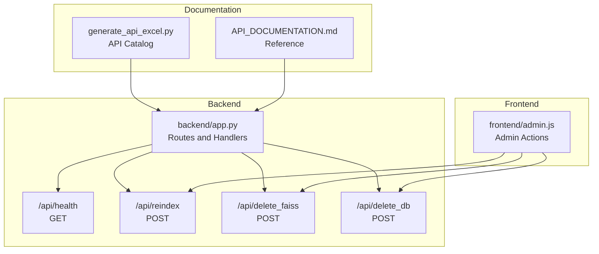
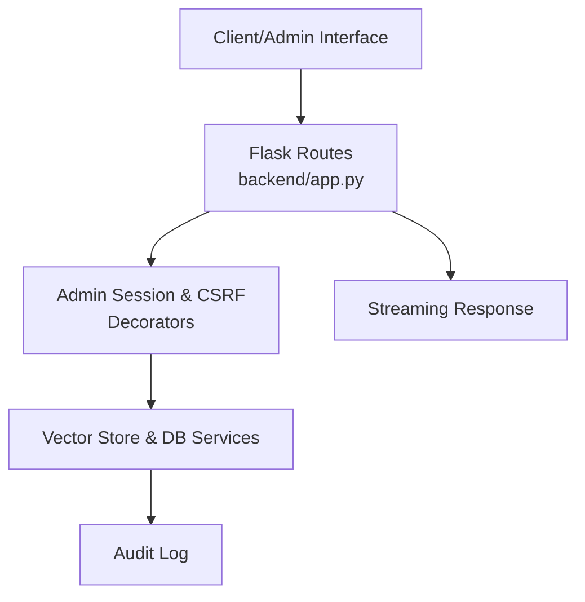
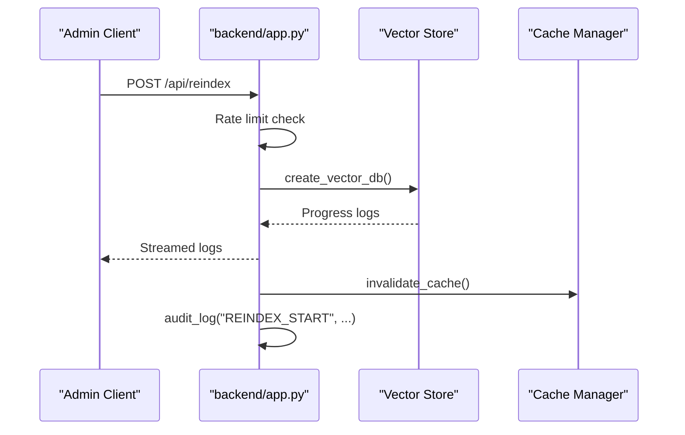
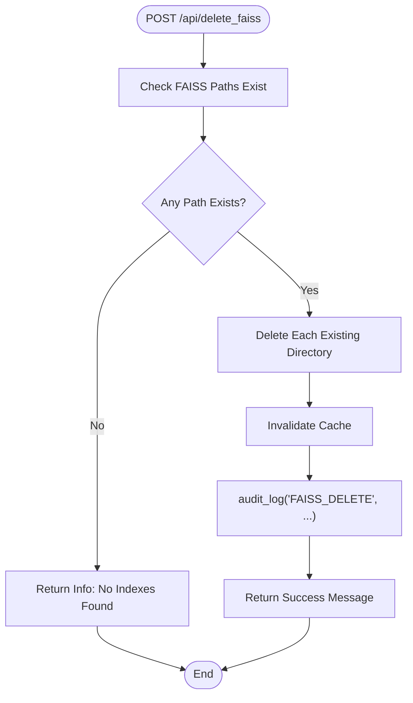
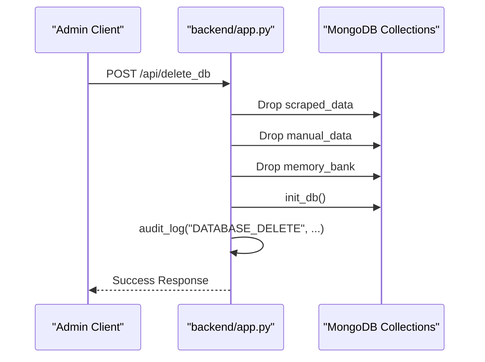
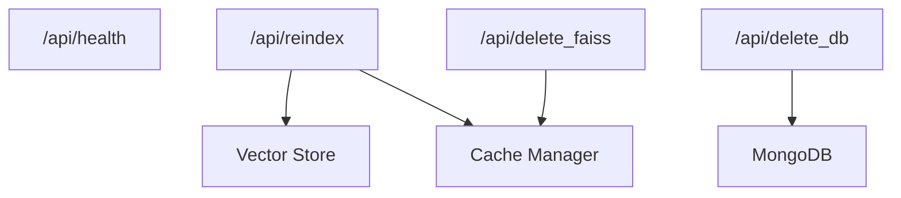

# System Management Endpoints

<cite>
**Referenced Files in This Document**
- [backend/app.py](file://backend/app.py)
- [API_DOCUMENTATION.md](file://API_DOCUMENTATION.md)
- [frontend/admin.js](file://frontend/admin.js)
- [generate_api_excel.py](file://generate_api_excel.py)
</cite>

## Table of Contents
1. [Introduction](#introduction)
2. [Project Structure](#project-structure)
3. [Core Components](#core-components)
4. [Architecture Overview](#architecture-overview)
5. [Detailed Component Analysis](#detailed-component-analysis)
6. [Dependency Analysis](#dependency-analysis)
7. [Performance Considerations](#performance-considerations)
8. [Troubleshooting Guide](#troubleshooting-guide)
9. [Conclusion](#conclusion)

## Introduction
This document provides comprehensive API documentation for system management endpoints designed for monitoring, maintenance, and administrative operations. It covers:
- Health monitoring via `/api/health`
- Vector database rebuilding via `/api/reindex`
- FAISS index deletion via `/api/delete_faiss`
- Database cleanup via `/api/delete_db`

The documentation explains administrative controls, safety checks, audit logging, and operational guidelines, along with performance considerations and recovery procedures.

## Project Structure
The system management endpoints are implemented in the backend application and integrated with the frontend administration interface. Key locations:
- Backend routes and handlers: `backend/app.py`
- API documentation reference: `API_DOCUMENTATION.md`
- Frontend admin actions: `frontend/admin.js`
- API catalog generation: `generate_api_excel.py`

**Diagram sources**
- [backend/app.py](file://backend/app.py)
- [frontend/admin.js](file://frontend/admin.js)
- [API_DOCUMENTATION.md](file://API_DOCUMENTATION.md)
- [generate_api_excel.py](file://generate_api_excel.py)

**Section sources**
- [backend/app.py](file://backend/app.py)
- [API_DOCUMENTATION.md](file://API_DOCUMENTATION.md)
- [frontend/admin.js](file://frontend/admin.js)
- [generate_api_excel.py](file://generate_api_excel.py)

## Core Components
This section documents each system management endpoint, including purpose, method, authentication requirements, rate limiting, and response semantics.

- Endpoint: `/api/health`
  - Method: GET
  - Purpose: Check system health and database connectivity
  - Authentication: Not restricted by admin decorator
  - Response: JSON object indicating health status
  - Notes: Used for monitoring and status checking

- Endpoint: `/api/reindex`
  - Method: POST
  - Purpose: Rebuild FAISS vector indexes
  - Authentication: Requires admin session and CSRF protection
  - Rate Limiting: 1 request per minute
  - Response: Streaming text response containing progress logs
  - Safety: Validates index paths and streams progress
  - Audit: Logs reindex initiation

- Endpoint: `/api/delete_faiss`
  - Method: POST
  - Purpose: Delete FAISS index directories
  - Authentication: Requires admin session and CSRF protection
  - Response: JSON success/info/error with count of deleted indexes
  - Safety: Checks existence before deletion; invalidates cache afterward
  - Audit: Logs deletion action with count

- Endpoint: `/api/delete_db`
  - Method: POST
  - Purpose: Drop all MongoDB collections (scraped_data, manual_data, memory_bank) and reinitialize
  - Authentication: Requires admin session and CSRF protection
  - Response: JSON success/error
  - Safety: Drops targeted collections; reinitializes database state
  - Audit: Logs database drop operation

Administrative controls and safety mechanisms:
- Admin session requirement enforced via decorator
- CSRF protection applied to sensitive POST endpoints
- Startup auto-reindex if FAISS indexes are missing
- Cache invalidation after destructive operations
- Audit logging for all admin-initiated operations

**Section sources**
- [backend/app.py](file://backend/app.py)
- [API_DOCUMENTATION.md](file://API_DOCUMENTATION.md)

## Architecture Overview
The system management endpoints are part of a Flask-based backend with frontend integration for admin actions. The architecture ensures:
- Centralized route definitions in the backend
- Admin authentication and CSRF protection for sensitive operations
- Streaming responses for long-running tasks
- Audit logging for compliance and traceability

**Diagram sources**
- [backend/app.py](file://backend/app.py)

## Detailed Component Analysis

### Health Monitoring: `/api/health`
Purpose:
- Verify API availability and database connectivity
- Provide a lightweight check for system status

Behavior:
- No admin authentication required
- Returns structured JSON indicating health status
- Suitable for periodic monitoring and load balancer health checks

Operational guidelines:
- Use GET `/api/health` for routine monitoring
- Combine with database connectivity checks for comprehensive status

**Section sources**
- [backend/app.py](file://backend/app.py)

### Vector Database Rebuilding: `/api/reindex`
Purpose:
- Rebuild FAISS vector indexes for improved search accuracy
- Triggered manually during maintenance windows

Behavior:
- Requires admin session and CSRF protection
- Rate-limited to 1 request per minute
- Streams progress logs during rebuild
- Invalidates cache upon completion
- Logs reindex initiation

Reindex workflow:

**Diagram sources**
- [backend/app.py](file://backend/app.py)

Safety and recovery:
- Startup auto-reindex if any FAISS index is missing
- Streaming allows monitoring progress without blocking
- Cache invalidation ensures subsequent queries use new indexes

**Section sources**
- [backend/app.py](file://backend/app.py)

### FAISS Index Deletion: `/api/delete_faiss`
Purpose:
- Remove FAISS index directories to free space or recover from corruption
- Triggered during maintenance or troubleshooting

Behavior:
- Requires admin session and CSRF protection
- Iterates over FAISS index paths and deletes existing directories
- Invalidates cache after deletion
- Logs deletion with count of affected indexes

Deletion workflow:

**Diagram sources**
- [backend/app.py](file://backend/app.py)

Safety and recovery:
- Idempotent operation (safe to run multiple times)
- Cache invalidation prevents serving stale cached results
- Audit trail enables tracking of deletions

**Section sources**
- [backend/app.py](file://backend/app.py)

### Database Cleanup: `/api/delete_db`
Purpose:
- Drop all MongoDB collections and reset database state
- Used for maintenance, testing, or recovery from corrupted data

Behavior:
- Requires admin session and CSRF protection
- Drops targeted collections (scraped_data, manual_data, memory_bank)
- Reinitializes database state
- Logs database drop operation

Cleanup workflow:

**Diagram sources**
- [backend/app.py](file://backend/app.py)

Safety and recovery:
- Drops only targeted collections; preserves unrelated data
- Reinitialization ensures clean state post-cleanup
- Audit logging provides evidence of destructive action

**Section sources**
- [backend/app.py](file://backend/app.py)

### Administrative Controls and Audit Logging
Controls:
- Admin session enforcement via decorator
- CSRF protection for POST endpoints
- Startup auto-reindex if FAISS indexes are missing

Audit logging:
- Logs initiated operations (e.g., reindex start, FAISS delete, database delete)
- Captures operator actions for compliance and troubleshooting

Integration:
- Frontend admin actions trigger backend endpoints
- Streaming responses enable real-time feedback for long operations

**Section sources**
- [backend/app.py](file://backend/app.py)
- [frontend/admin.js](file://frontend/admin.js)

## Dependency Analysis
Endpoint dependencies and relationships:
- `/api/health`: Standalone health check
- `/api/reindex`: Depends on vector store creation and cache invalidation
- `/api/delete_faiss`: Depends on FAISS index paths and cache invalidation
- `/api/delete_db`: Depends on database drop and initialization

**Diagram sources**
- [backend/app.py](file://backend/app.py)

**Section sources**
- [backend/app.py](file://backend/app.py)

## Performance Considerations
- `/api/reindex` is rate-limited to prevent resource exhaustion
- Streaming responses avoid blocking client connections during rebuild
- Cache invalidation ensures fresh results but may increase initial latency
- FAISS deletion and database cleanup are destructive; schedule during maintenance windows
- Monitor system resources during reindex to prevent overload

## Troubleshooting Guide
Common issues and resolutions:
- Unauthorized access: Ensure admin session and CSRF tokens are present
- Rate limit exceeded: Wait for cooldown period before retrying `/api/reindex`
- Missing FAISS indexes: Startup auto-reindex runs at application start
- Long-running reindex: Use streaming response to monitor progress
- Database cleanup: Confirm backup exists before proceeding with `/api/delete_db`

Operational guidelines:
- Use `/api/health` for quick system status verification
- Schedule `/api/reindex` during low-traffic periods
- Back up data before destructive operations (`/api/delete_faiss`, `/api/delete_db`)
- Review audit logs for operator actions and timestamps

**Section sources**
- [backend/app.py](file://backend/app.py)

## Conclusion
The system management endpoints provide robust controls for monitoring, maintaining, and administering the platform. Admin authentication, CSRF protection, rate limiting, and audit logging ensure safe and traceable operations. Follow the operational guidelines to maintain system health, optimize performance, and recover from issues efficiently.