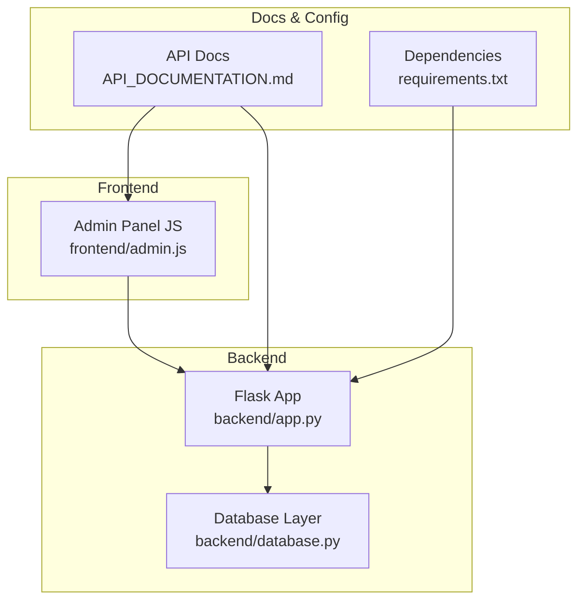
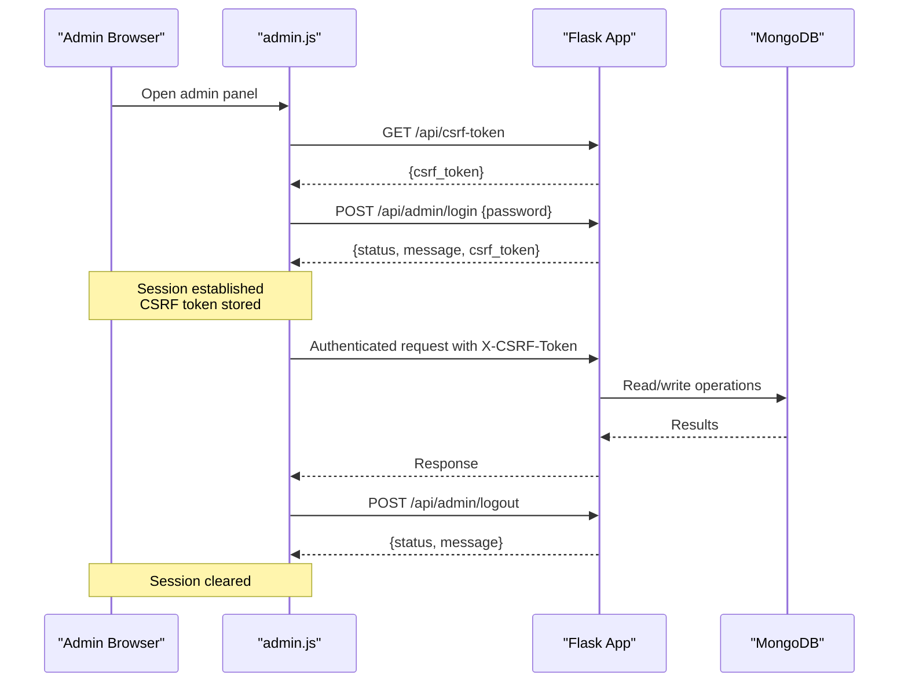
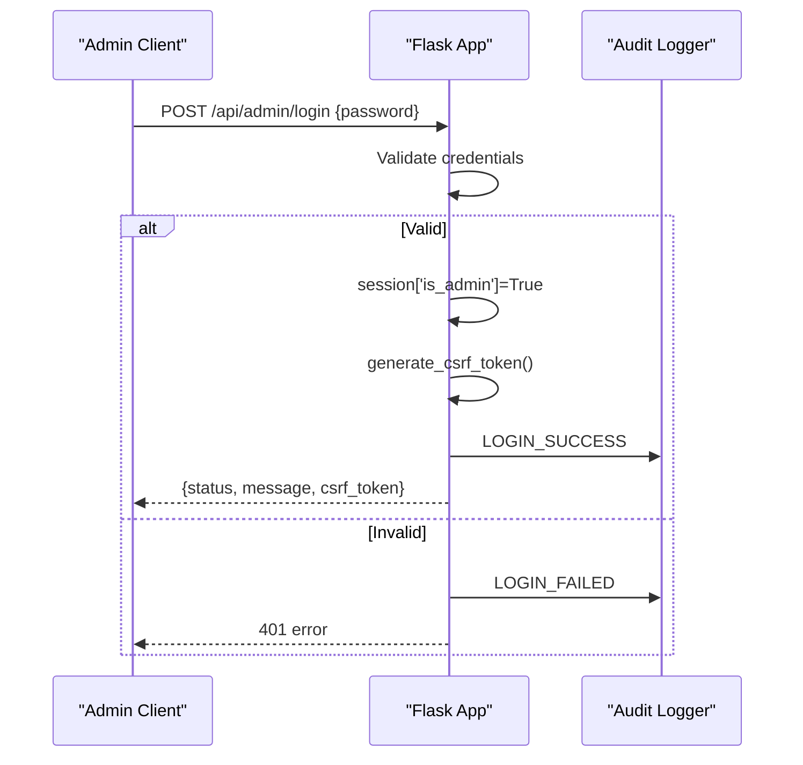
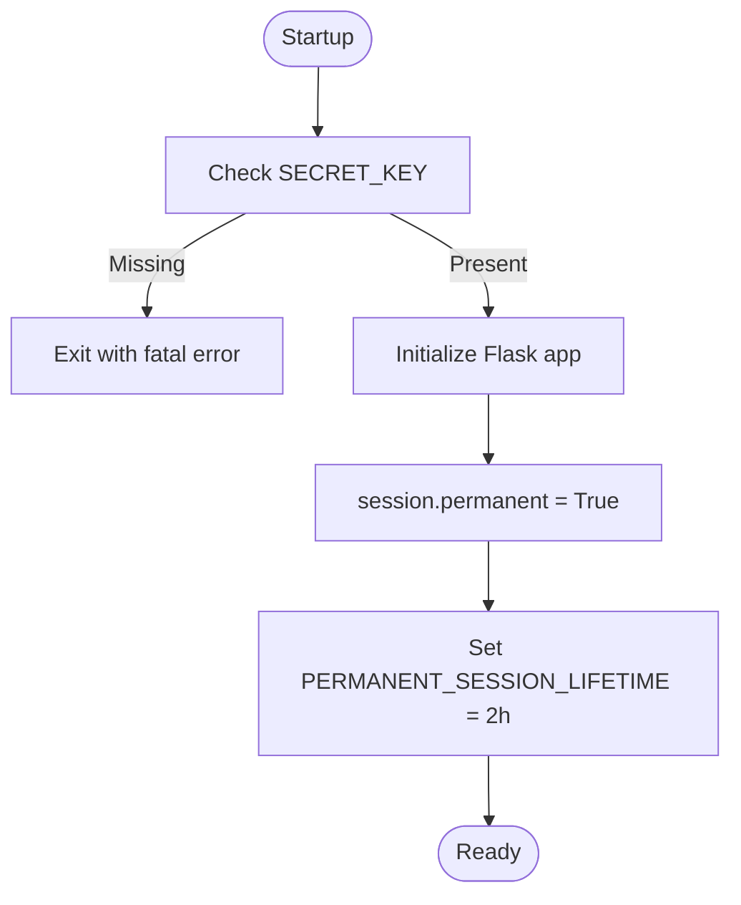
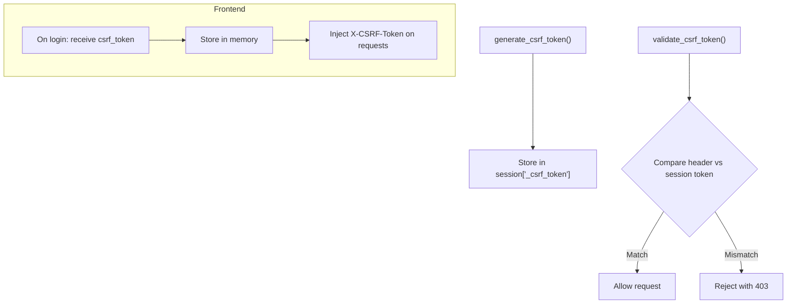
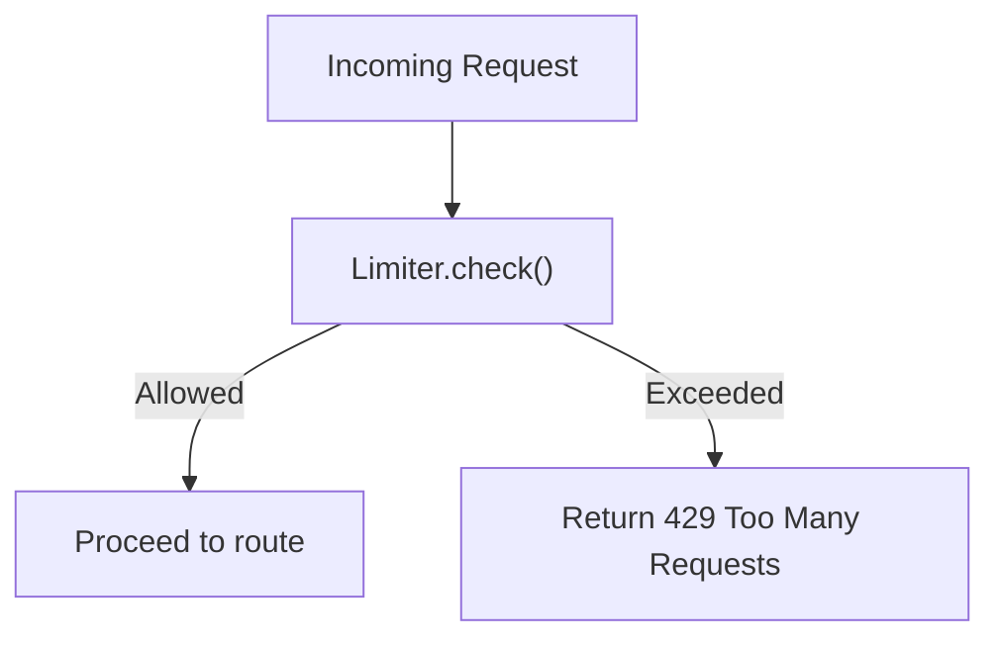
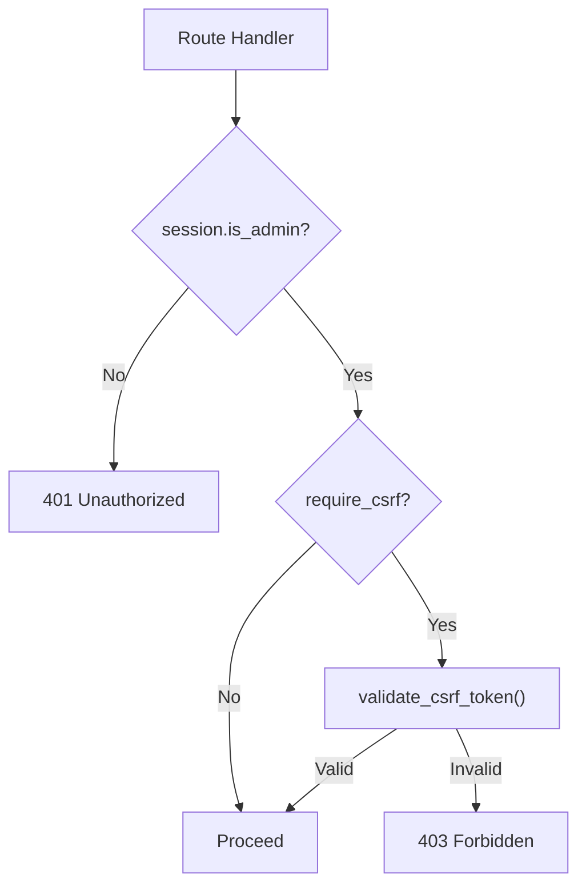
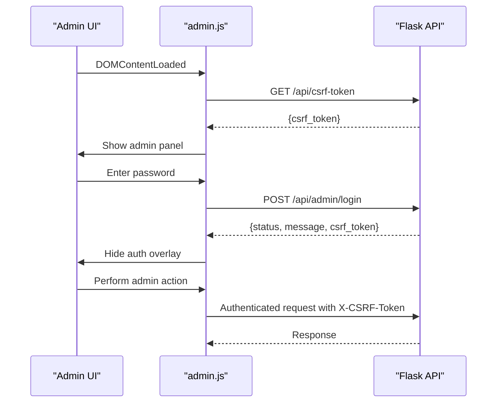
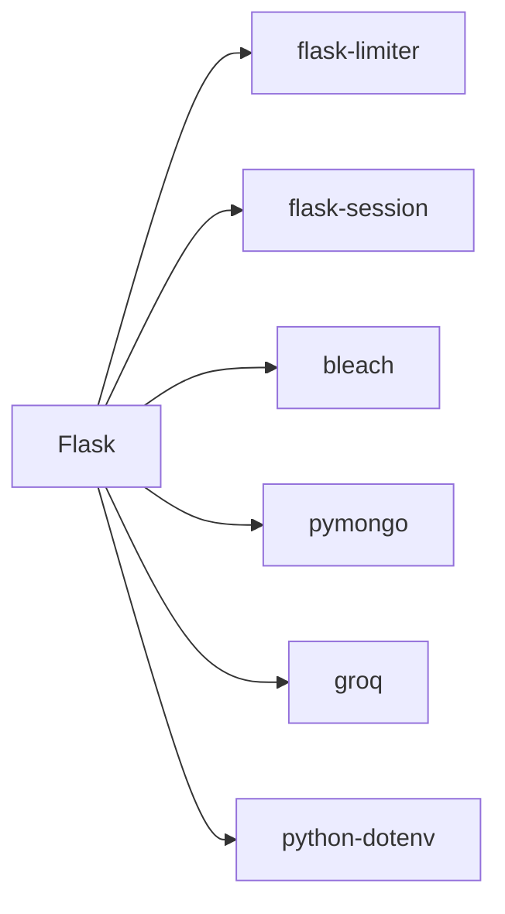

# Admin Authentication System

<cite>
**Referenced Files in This Document**
- [backend/app.py](file://backend/app.py)
- [backend/database.py](file://backend/database.py)
- [frontend/admin.js](file://frontend/admin.js)
- [API_DOCUMENTATION.md](file://API_DOCUMENTATION.md)
- [requirements.txt](file://requirements.txt)
</cite>

## Table of Contents
1. [Introduction](#introduction)
2. [Project Structure](#project-structure)
3. [Core Components](#core-components)
4. [Architecture Overview](#architecture-overview)
5. [Detailed Component Analysis](#detailed-component-analysis)
6. [Dependency Analysis](#dependency-analysis)
7. [Performance Considerations](#performance-considerations)
8. [Troubleshooting Guide](#troubleshooting-guide)
9. [Conclusion](#conclusion)

## Introduction
This document describes the admin authentication system for the DamayAI Assistant platform. It covers login/logout flows, session management, CSRF protection, rate limiting, security headers, audit logging, and client-side authentication handling. It also outlines the current implementation of admin-only routes, input validation, and security best practices observed in the codebase.

## Project Structure
The authentication system spans the backend Flask application, the frontend admin panel, and supporting documentation and dependencies.

**Diagram sources**
- [backend/app.py:1-1192](file://backend/app.py#L1-L1192)
- [backend/database.py:1-260](file://backend/database.py#L1-L260)
- [frontend/admin.js:1-1108](file://frontend/admin.js#L1-L1108)
- [API_DOCUMENTATION.md:1-347](file://API_DOCUMENTATION.md#L1-L347)
- [requirements.txt:1-30](file://requirements.txt#L1-L30)

**Section sources**
- [backend/app.py:1-1192](file://backend/app.py#L1-L1192)
- [API_DOCUMENTATION.md:1-347](file://API_DOCUMENTATION.md#L1-L347)

## Core Components
- Admin authentication endpoints:
  - POST /api/admin/login: Validates admin password and starts a session, returning a CSRF token.
  - POST /api/admin/logout: Ends the admin session and clears CSRF token.
  - GET /api/csrf-token: Returns a fresh CSRF token for authenticated admins.
- Session management:
  - Flask sessions are permanent with a 2-hour lifetime.
  - Secret key is required and enforced at startup.
- CSRF protection:
  - CSRF token stored in session and validated on state-changing requests.
  - Header-based validation for X-CSRF-Token.
- Rate limiting:
  - Login: 5 per minute.
  - Admin chat: 10 per minute.
  - Public chat: 10 per minute.
  - Bug report: 3 per minute.
  - Scraping/crawling/reindex: 1 per minute.
  - General default: 200 per hour.
- Security headers:
  - X-Content-Type-Options, X-XSS-Protection, Referrer-Policy, Permissions-Policy, X-Frame-Options.
- Audit logging:
  - Structured audit logs for admin actions (login/logout, data updates, etc.).

**Section sources**
- [backend/app.py:331-365](file://backend/app.py#L331-L365)
- [backend/app.py:95-116](file://backend/app.py#L95-L116)
- [backend/app.py:267-292](file://backend/app.py#L267-L292)
- [backend/app.py:320-327](file://backend/app.py#L320-L327)
- [API_DOCUMENTATION.md:53-78](file://API_DOCUMENTATION.md#L53-L78)

## Architecture Overview
High-level flow of admin authentication and protected operations.

**Diagram sources**
- [frontend/admin.js:120-144](file://frontend/admin.js#L120-L144)
- [frontend/admin.js:163-191](file://frontend/admin.js#L163-L191)
- [frontend/admin.js:200-244](file://frontend/admin.js#L200-L244)
- [backend/app.py:331-365](file://backend/app.py#L331-L365)
- [backend/database.py:18-49](file://backend/database.py#L18-L49)

## Detailed Component Analysis

### Authentication Endpoints
- POST /api/admin/login
  - Validates either ADMIN_PASSWORD_HASH (hashed) or ADMIN_PASSWORD (plaintext).
  - On success: sets session['is_admin'], generates CSRF token, logs audit event.
  - On failure: logs audit event and returns 401.
- POST /api/admin/logout
  - Clears admin session and CSRF token, logs audit event.
- GET /api/csrf-token
  - Requires admin session; returns a fresh CSRF token.

**Diagram sources**
- [backend/app.py:331-352](file://backend/app.py#L331-L352)
- [backend/app.py:53-56](file://backend/app.py#L53-L56)

**Section sources**
- [backend/app.py:331-365](file://backend/app.py#L331-L365)
- [API_DOCUMENTATION.md:16-18](file://API_DOCUMENTATION.md#L16-L18)

### Session Management
- Sessions are made permanent with a 2-hour lifetime.
- Secret key is mandatory; server exits if not present.
- Session cookie is used for authentication checks.

**Diagram sources**
- [backend/app.py:61-65](file://backend/app.py#L61-L65)
- [backend/app.py:83](file://backend/app.py#L83)
- [backend/app.py:309-311](file://backend/app.py#L309-L311)
- [backend/app.py:93](file://backend/app.py#L93)

**Section sources**
- [backend/app.py:61-65](file://backend/app.py#L61-L65)
- [backend/app.py:309-311](file://backend/app.py#L309-L311)
- [API_DOCUMENTATION.md:58](file://API_DOCUMENTATION.md#L58)

### CSRF Protection
- CSRF token generation and validation helpers.
- require_csrf decorator enforces CSRF validation for state-changing requests.
- Frontend stores CSRF token and injects it into headers for authenticated requests.

**Diagram sources**
- [backend/app.py:137-159](file://backend/app.py#L137-L159)
- [frontend/admin.js:175-177](file://frontend/admin.js#L175-L177)
- [frontend/admin.js:200-234](file://frontend/admin.js#L200-L234)

**Section sources**
- [backend/app.py:137-159](file://backend/app.py#L137-L159)
- [frontend/admin.js:200-234](file://frontend/admin.js#L200-L234)
- [API_DOCUMENTATION.md:60-63](file://API_DOCUMENTATION.md#L60-L63)

### Rate Limiting
- Login: 5 per minute.
- Admin chat: 10 per minute.
- Public chat: 10 per minute.
- Bug report: 3 per minute.
- Scraping/crawling/reindex: 1 per minute.
- General default: 200 per hour.
- Graceful fallback if flask-limiter is unavailable.

**Diagram sources**
- [backend/app.py:95-116](file://backend/app.py#L95-L116)
- [backend/app.py:332](file://backend/app.py#L332)
- [backend/app.py:404](file://backend/app.py#L404)
- [backend/app.py:433](file://backend/app.py#L433)
- [backend/app.py:591](file://backend/app.py#L591)
- [backend/app.py:804](file://backend/app.py#L804)
- [backend/app.py:825](file://backend/app.py#L825)
- [backend/app.py:851](file://backend/app.py#L851)

**Section sources**
- [backend/app.py:95-116](file://backend/app.py#L95-L116)
- [API_DOCUMENTATION.md:66-70](file://API_DOCUMENTATION.md#L66-L70)

### Security Headers and Hardening
- Enforced headers: X-Content-Type-Options, X-XSS-Protection, Referrer-Policy, Permissions-Policy, X-Frame-Options.
- Widget preview allows embedding; others deny frame embedding.
- Sensitive API responses are marked non-cacheable.

**Section sources**
- [backend/app.py:267-292](file://backend/app.py#L267-L292)

### Audit Logging
- Structured audit logger writes to stdout and file (best-effort).
- Logs include IP address, action, and details.
- Used for login success/failure, logout, data operations, and system actions.

**Section sources**
- [backend/app.py:32-56](file://backend/app.py#L32-L56)
- [backend/app.py:348-358](file://backend/app.py#L348-L358)

### Admin-Only Routes and Middleware
- require_admin decorator blocks unauthenticated requests.
- require_csrf decorator validates CSRF on state-changing admin routes.
- ObjectId validation helper ensures safe database operations.

**Diagram sources**
- [backend/app.py:243-250](file://backend/app.py#L243-L250)
- [backend/app.py:151-159](file://backend/app.py#L151-L159)
- [backend/app.py:164-175](file://backend/app.py#L164-L175)

**Section sources**
- [backend/app.py:243-250](file://backend/app.py#L243-L250)
- [backend/app.py:151-159](file://backend/app.py#L151-L159)
- [backend/app.py:164-175](file://backend/app.py#L164-L175)

### Client-Side Authentication Flow (Frontend)
- On load, attempts to fetch CSRF token; if successful, hides auth overlay and shows admin panel.
- On login, sends password to /api/admin/login; on success, stores CSRF token and session state.
- For all authenticated requests, injects X-CSRF-Token header.
- Handles 401/403 globally: clears session state and shows auth overlay.

**Diagram sources**
- [frontend/admin.js:120-144](file://frontend/admin.js#L120-L144)
- [frontend/admin.js:163-191](file://frontend/admin.js#L163-L191)
- [frontend/admin.js:200-234](file://frontend/admin.js#L200-L234)

**Section sources**
- [frontend/admin.js:120-144](file://frontend/admin.js#L120-L144)
- [frontend/admin.js:163-191](file://frontend/admin.js#L163-L191)
- [frontend/admin.js:200-234](file://frontend/admin.js#L200-L234)

### Password Handling and Credential Validation
- Supports two modes:
  - ADMIN_PASSWORD_HASH: hashed password using Werkzeug’s check_password_hash.
  - ADMIN_PASSWORD: plaintext comparison (not recommended).
- No admin registration endpoint is present; credentials are configured via environment variables.

**Section sources**
- [backend/app.py:240-241](file://backend/app.py#L240-L241)
- [backend/app.py:338-343](file://backend/app.py#L338-L343)
- [API_DOCUMENTATION.md:327-334](file://API_DOCUMENTATION.md#L327-L334)

### Role-Based Access Control and Permission Levels
- Current implementation enforces a single admin role:
  - require_admin decorator guards all admin endpoints.
  - No separate roles or granular permissions are implemented.
- All admin endpoints require both authentication and CSRF validation.

**Section sources**
- [backend/app.py:243-250](file://backend/app.py#L243-L250)
- [backend/app.py:151-159](file://backend/app.py#L151-L159)

### Token Handling and Secure Session Storage
- CSRF tokens are stored in the server session and sent to the client upon login or via /api/csrf-token.
- Frontend stores CSRF token in memory and attaches it to authenticated requests.
- Session cookies are used for authentication; no JWT tokens are implemented.

**Section sources**
- [backend/app.py:137-159](file://backend/app.py#L137-L159)
- [frontend/admin.js:175-177](file://frontend/admin.js#L175-L177)
- [frontend/admin.js:200-234](file://frontend/admin.js#L200-L234)

### Input Validation and Sanitization
- Input length limits:
  - Max text content: 100,000 characters.
  - Max query length: 2,000 characters.
  - Max bug description: 5,000 characters.
  - Chat history truncated to last 20 messages.
- HTML sanitization using bleach for user-provided text.
- ObjectId validation for MongoDB identifiers.

**Section sources**
- [backend/app.py:128-133](file://backend/app.py#L128-L133)
- [backend/app.py:179-183](file://backend/app.py#L179-L183)
- [backend/app.py:188-218](file://backend/app.py#L188-L218)
- [backend/app.py:164-175](file://backend/app.py#L164-L175)

## Dependency Analysis
External libraries and their roles in security and authentication:

**Diagram sources**
- [requirements.txt:1-30](file://requirements.txt#L1-L30)

**Section sources**
- [requirements.txt:1-30](file://requirements.txt#L1-L30)

## Performance Considerations
- Rate limiting prevents abuse and protects backend resources.
- Session permanence reduces repeated login overhead but increases session lifetime risk; mitigate by using short-lived sessions and secure transport.
- Audit logging is lightweight but should be monitored to avoid disk growth.

[No sources needed since this section provides general guidance]

## Troubleshooting Guide

Common issues and resolutions:
- 401 Unauthorized after login
  - Cause: Session expired or invalid.
  - Resolution: Re-login to obtain a new CSRF token and session.
  - Evidence: Frontend handles 401 by clearing state and prompting login.
- 403 Forbidden (CSRF validation failed)
  - Cause: Missing or stale CSRF token.
  - Resolution: Fetch a fresh token from /api/csrf-token or reload the page to refresh the token.
- 429 Too Many Requests
  - Cause: Exceeded rate limits (e.g., login attempts).
  - Resolution: Wait until the rate limit resets; reduce request frequency.
- 500 Internal Server Error
  - Cause: Server-side exceptions during processing.
  - Resolution: Check server logs; verify environment variables and database connectivity.
- CSRF token mismatch errors
  - Cause: Using outdated token or sending malformed headers.
  - Resolution: Ensure frontend injects X-CSRF-Token on state-changing requests; avoid sending token with multipart/form-data unless explicitly handled.

**Section sources**
- [frontend/admin.js:214-234](file://frontend/admin.js#L214-L234)
- [backend/app.py:320-327](file://backend/app.py#L320-L327)
- [API_DOCUMENTATION.md:242-288](file://API_DOCUMENTATION.md#L242-L288)

## Conclusion
The admin authentication system provides a straightforward, functional security model:
- Strong session management with enforced secret keys and permanent sessions.
- CSRF protection via session-stored tokens and header validation.
- Comprehensive rate limiting across critical endpoints.
- Audit logging for admin actions.
- Minimal client-side state handling with optimistic UI checks.

Areas for future enhancement include:
- Implementing role-based access control for granular permissions.
- Adding admin registration and password reset flows.
- Enforcing HTTPS and secure cookie flags for production deployments.
- Centralizing and documenting environment variables and deployment requirements.

[No sources needed since this section summarizes without analyzing specific files]