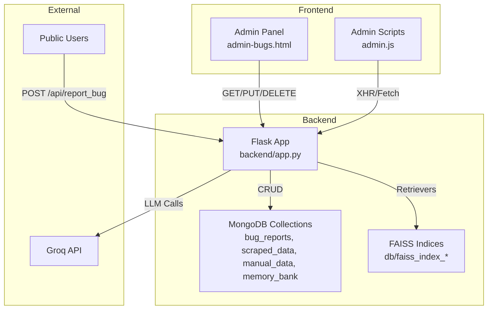
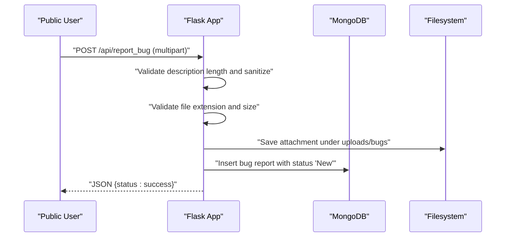
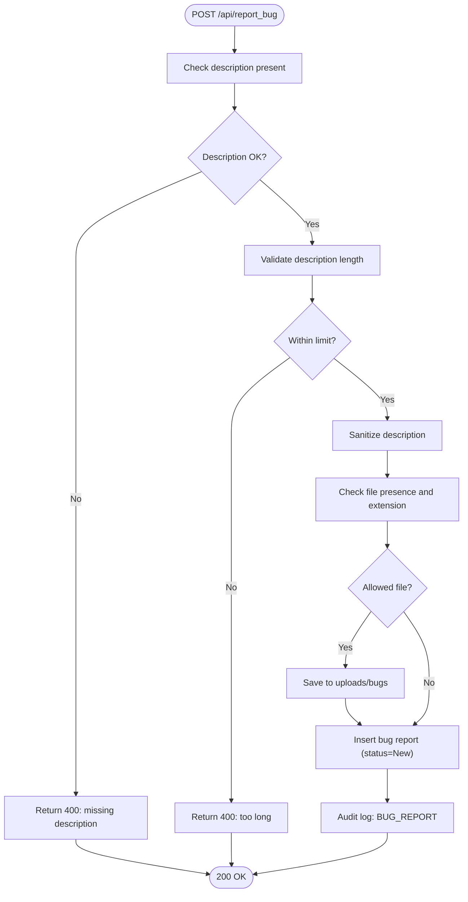
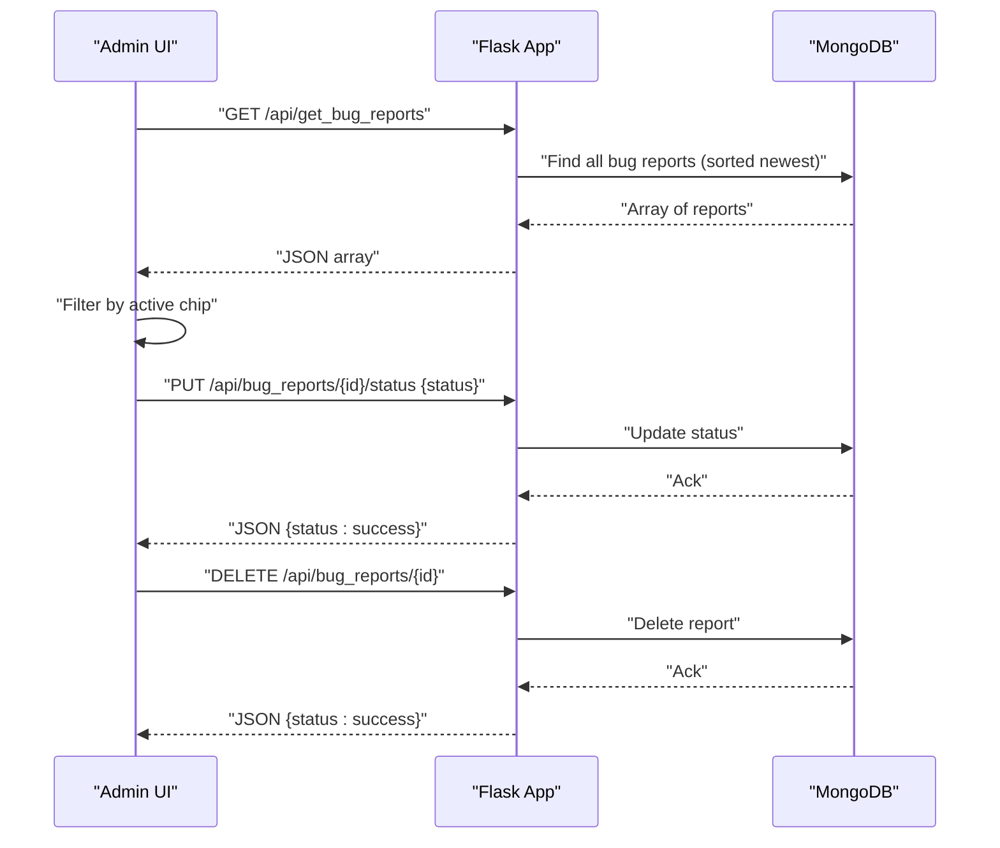
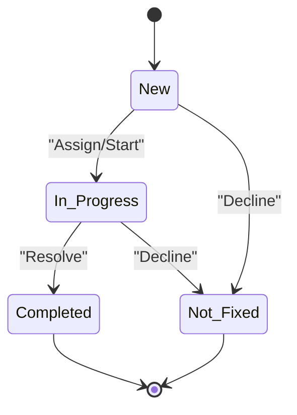
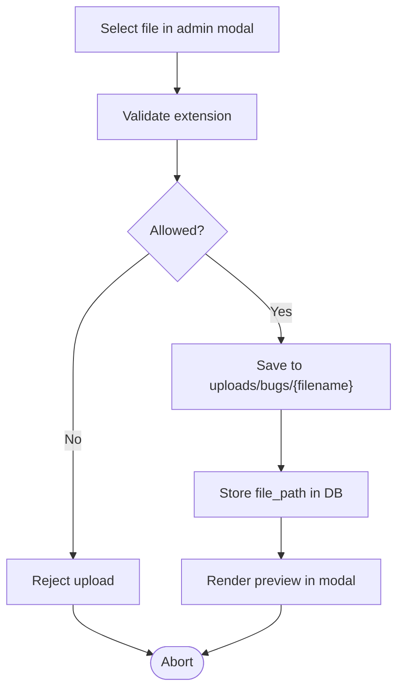
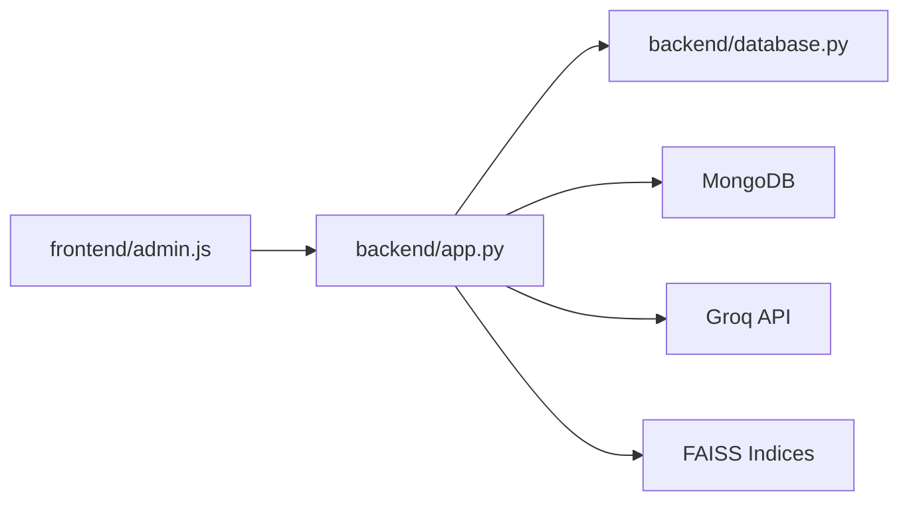

# Bug Report Management

<cite>
**Referenced Files in This Document**
- [backend/app.py](file://backend/app.py)
- [backend/database.py](file://backend/database.py)
- [frontend/admin-bugs.html](file://frontend/admin-bugs.html)
- [frontend/admin.js](file://frontend/admin.js)
- [API_DOCUMENTATION.md](file://API_DOCUMENTATION.md)
- [Local Settings/app.py](file://Local Settings/app.py)
</cite>

## Table of Contents
1. [Introduction](#introduction)
2. [Project Structure](#project-structure)
3. [Core Components](#core-components)
4. [Architecture Overview](#architecture-overview)
5. [Detailed Component Analysis](#detailed-component-analysis)
6. [Dependency Analysis](#dependency-analysis)
7. [Performance Considerations](#performance-considerations)
8. [Troubleshooting Guide](#troubleshooting-guide)
9. [Conclusion](#conclusion)
10. [Appendices](#appendices)

## Introduction
This document describes the bug report management system, covering the complete lifecycle from submission to resolution. It explains the bug reporting interface, attachment handling, triage and status tracking, administrative workflows, and operational procedures. The system integrates a public bug reporting endpoint, an admin panel for managing reports, MongoDB persistence, and a vector search-backed AI assistant for contextual support.

## Project Structure
The system comprises:
- Backend API implemented in Python/Flask with MongoDB persistence
- Admin web interface for viewing, filtering, updating, and deleting bug reports
- Vector search indices for AI-assisted triage and support
- Static file serving for attachments

**Diagram sources**
- [backend/app.py](file://backend/app.py)
- [backend/database.py](file://backend/database.py)
- [frontend/admin-bugs.html](file://frontend/admin-bugs.html)
- [frontend/admin.js](file://frontend/admin.js)

**Section sources**
- [backend/app.py](file://backend/app.py)
- [backend/database.py](file://backend/database.py)
- [frontend/admin-bugs.html](file://frontend/admin-bugs.html)
- [frontend/admin.js](file://frontend/admin.js)
- [API_DOCUMENTATION.md](file://API_DOCUMENTATION.md)

## Core Components
- Public bug reporting endpoint for users to submit issues with optional attachments
- Admin-only endpoints for listing, updating status, and deleting bug reports
- Admin panel for filtering, sorting, and viewing bug reports
- MongoDB collection for storing bug reports with timestamps and status
- Attachment handling supporting images and videos for bug reports
- Security measures including rate limiting, CSRF protection, and admin authentication

**Section sources**
- [backend/app.py](file://backend/app.py)
- [backend/database.py](file://backend/database.py)
- [frontend/admin-bugs.html](file://frontend/admin-bugs.html)
- [frontend/admin.js](file://frontend/admin.js)
- [API_DOCUMENTATION.md](file://API_DOCUMENTATION.md)

## Architecture Overview
The bug report management system follows a layered architecture:
- Presentation Layer: Admin UI renders bug lists, modals, and actions
- Application Layer: Flask routes handle requests, enforce security, and orchestrate operations
- Persistence Layer: MongoDB stores bug reports and related data
- Vector Search Layer: FAISS indices enable retrieval-augmented responses for triage
- External Services: Groq provides LLM responses for AI-assisted operations

**Diagram sources**
- [backend/app.py](file://backend/app.py)
- [backend/database.py](file://backend/database.py)

**Section sources**
- [backend/app.py](file://backend/app.py)
- [backend/database.py](file://backend/database.py)

## Detailed Component Analysis

### Bug Reporting Interface (Public)
- Endpoint: POST /api/report_bug
- Accepts: form-encoded description and optional file attachment
- Validation:
  - Description required and length-limited
  - File extension restricted to images and video
  - Max file size enforced at framework level
- Behavior:
  - Saves file to uploads/bugs with secure filename
  - Stores description and optional file_path in MongoDB
  - Sets initial status to "New"
  - Returns standardized JSON response

**Diagram sources**
- [backend/app.py](file://backend/app.py)
- [backend/database.py](file://backend/database.py)

**Section sources**
- [backend/app.py](file://backend/app.py)
- [API_DOCUMENTATION.md](file://API_DOCUMENTATION.md)

### Admin Panel and Filtering
- Page: admin-bugs.html
- Features:
  - Filter chips for status: All, New, In Progress, Completed, Not Fixed
  - List view with status badges and timestamps
  - Detail modal showing description and attachments
  - Inline status dropdown to update status
  - Delete action with confirmation
- Client-side logic:
  - Loads reports via GET /api/get_bug_reports
  - Filters locally by status
  - Updates status via PUT /api/bug_reports/{id}/status
  - Deletes via DELETE /api/bug_reports/{id}

**Diagram sources**
- [frontend/admin-bugs.html](file://frontend/admin-bugs.html)
- [frontend/admin.js](file://frontend/admin.js)
- [backend/app.py](file://backend/app.py)
- [backend/database.py](file://backend/database.py)

**Section sources**
- [frontend/admin-bugs.html](file://frontend/admin-bugs.html)
- [frontend/admin.js](file://frontend/admin.js)
- [backend/app.py](file://backend/app.py)
- [backend/database.py](file://backend/database.py)

### Status Tracking and Lifecycle
- Supported statuses: New, In Progress, Completed, Not Fixed
- Initial status: New upon creation
- Admin updates status via inline dropdown or modal
- Filtering by status enables quick triage and progress tracking

**Diagram sources**
- [backend/app.py](file://backend/app.py)
- [frontend/admin.js](file://frontend/admin.js)

**Section sources**
- [backend/app.py](file://backend/app.py)
- [frontend/admin.js](file://frontend/admin.js)

### Attachment Handling and File Upload Integration
- Allowed extensions for bug attachments: png, jpg, jpeg, gif, mp4, mov, avi, webm
- Maximum file size: 16 MB
- Storage location: uploads/bugs with secure filenames
- Preview in admin modal:
  - Images: inline preview
  - Videos: video player
  - Other files: download link

**Diagram sources**
- [backend/app.py](file://backend/app.py)
- [frontend/admin.js](file://frontend/admin.js)

**Section sources**
- [backend/app.py](file://backend/app.py)
- [frontend/admin.js](file://frontend/admin.js)

### Triaging, Priority Assignment, and Team Assignment Workflows
- Current implementation supports status transitions but does not define explicit priority fields or team assignments
- Recommended enhancements:
  - Add priority field (Low, Medium, High, Critical)
  - Add assignee/team fields
  - Add triage timestamp and resolver fields
  - Add filtering/sorting by priority and assignee
- These additions would integrate with existing status update mechanisms

[No sources needed since this section proposes future enhancements]

### Status Update Mechanisms and Notifications
- Status updates occur via PUT /api/bug_reports/{id}/status
- The admin panel updates the UI immediately after successful API responses
- No built-in email notifications are implemented; integration with external services would require extending the backend

**Section sources**
- [backend/app.py](file://backend/app.py)
- [frontend/admin.js](file://frontend/admin.js)

### Bulk Operations, Filtering, Sorting, and Reporting
- Filtering:
  - By status via filter chips
  - Future enhancement: filter by date range, assignee, priority
- Sorting:
  - Default order: newest first
  - Enhancement: customizable sort fields
- Reporting:
  - Dashboard statistics include bug counts by status
  - Enhancement: export CSV/PDF of reports, pivot tables by status/priority

**Section sources**
- [frontend/admin.js](file://frontend/admin.js)
- [backend/database.py](file://backend/database.py)

### Quality Assurance, Verification, and Resolution Validation
- QA steps:
  - Verify status transitions adhere to lifecycle
  - Confirm attachments render correctly in admin
  - Validate rate limits and CSRF protections
  - Test deletion and cascading effects
- Resolution validation:
  - After marking as Completed, verify fix in affected environment
  - Optionally add verification checkbox in UI

**Section sources**
- [backend/app.py](file://backend/app.py)
- [frontend/admin.js](file://frontend/admin.js)

### Administrative Workflows
- Admin authentication:
  - POST /api/admin/login with password
  - Session lasts 2 hours
  - CSRF token required for state-changing requests
- Admin-only endpoints:
  - GET /api/get_bug_reports
  - PUT /api/bug_reports/{id}/status
  - DELETE /api/bug_reports/{id}
  - Additional system endpoints for scraping, indexing, and cleanup

**Section sources**
- [backend/app.py](file://backend/app.py)
- [API_DOCUMENTATION.md](file://API_DOCUMENTATION.md)

## Dependency Analysis
The system exhibits clear separation of concerns:
- Flask routes depend on database module for persistence
- Admin UI depends on Flask endpoints for data operations
- Vector search indices are independent but used by the AI assistant
- External service (Groq) is used for LLM generation

**Diagram sources**
- [backend/app.py](file://backend/app.py)
- [backend/database.py](file://backend/database.py)
- [frontend/admin.js](file://frontend/admin.js)

**Section sources**
- [backend/app.py](file://backend/app.py)
- [backend/database.py](file://backend/database.py)
- [frontend/admin.js](file://frontend/admin.js)

## Performance Considerations
- Rate limiting applied to public endpoints to prevent abuse
- Input length limits reduce memory pressure during processing
- FAISS indices improve retrieval speed for AI-assisted triage
- Consider adding pagination for large bug report datasets

[No sources needed since this section provides general guidance]

## Troubleshooting Guide
Common issues and resolutions:
- Authentication failures:
  - Ensure admin login succeeds and CSRF token is present
  - Check session validity and expiration
- CSRF errors:
  - Refresh CSRF token and resend request with X-CSRF-Token header
- File upload errors:
  - Verify file extension and size limits
  - Confirm uploads/bugs directory exists and is writable
- Status update failures:
  - Confirm report ID format and valid status values
  - Check network connectivity and backend logs
- Database connection issues:
  - Verify MONGO_URI environment variable
  - Ensure MongoDB is reachable and collections are indexed

**Section sources**
- [backend/app.py](file://backend/app.py)
- [API_DOCUMENTATION.md](file://API_DOCUMENTATION.md)

## Conclusion
The bug report management system provides a robust foundation for capturing, triaging, and resolving issues. It includes essential features such as public reporting, admin management, filtering, and attachment handling. To enhance operational excellence, consider integrating priority and team assignment fields, notification mechanisms, and advanced reporting capabilities.

[No sources needed since this section summarizes without analyzing specific files]

## Appendices

### API Reference Summary
- POST /api/report_bug: Submit bug report with optional attachment
- GET /api/get_bug_reports: Retrieve all bug reports
- PUT /api/bug_reports/{id}/status: Update bug status
- DELETE /api/bug_reports/{id}: Remove bug report
- Additional endpoints for admin authentication, CSRF, and system operations

**Section sources**
- [API_DOCUMENTATION.md](file://API_DOCUMENTATION.md)