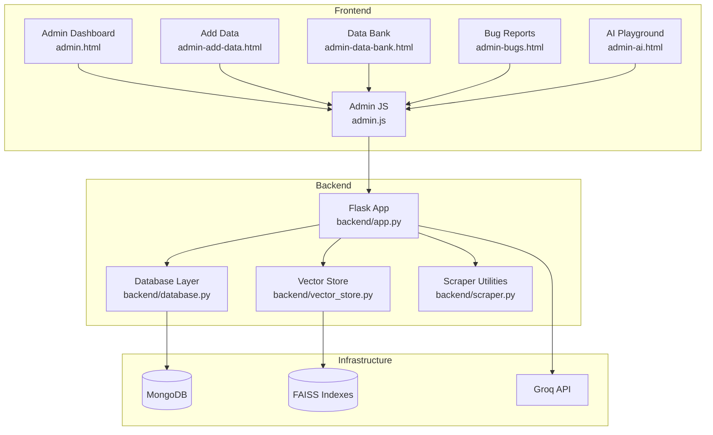
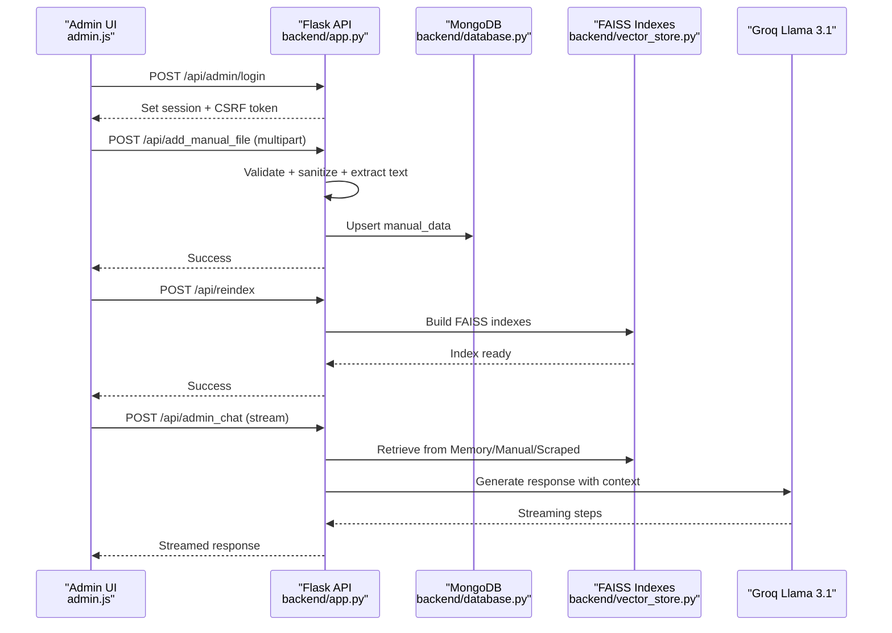
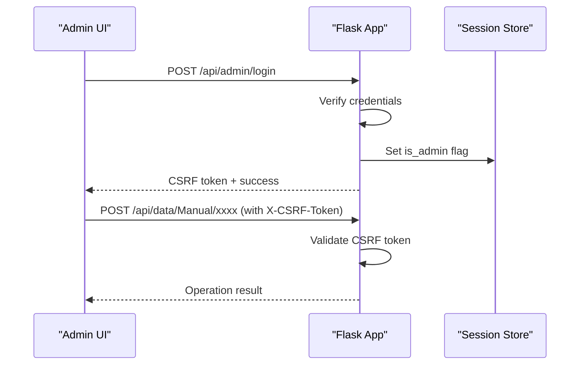
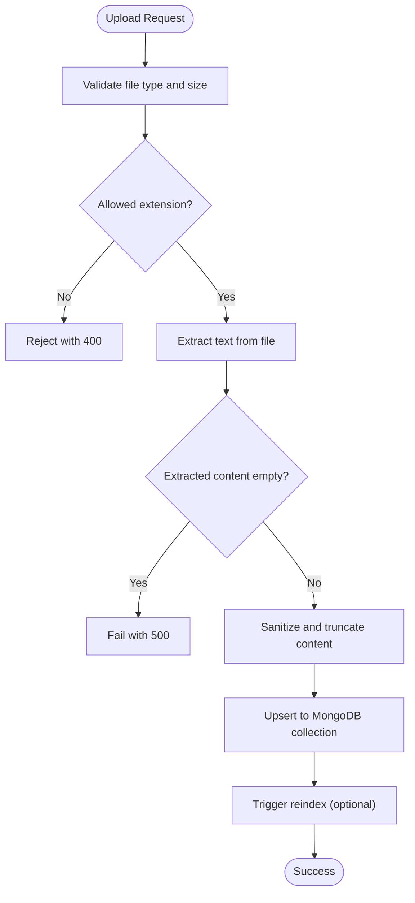
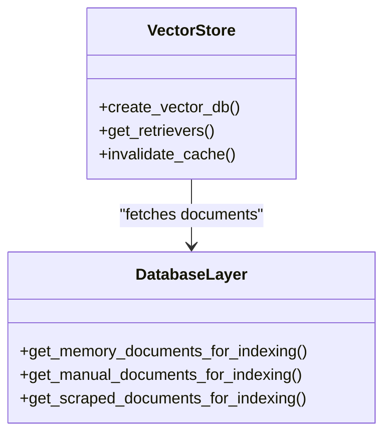
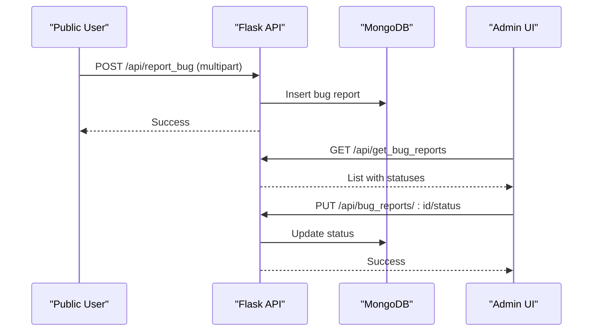
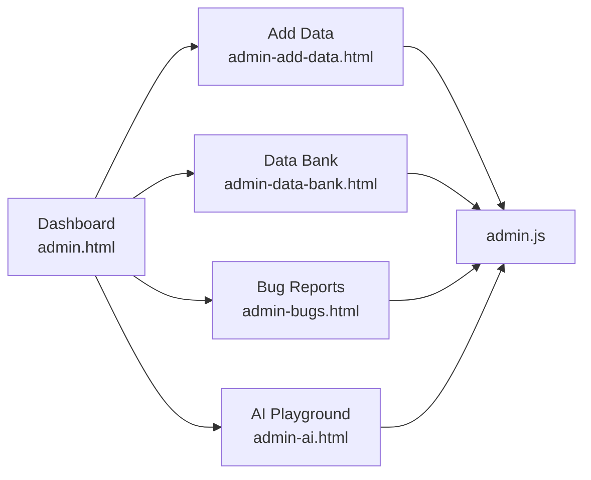
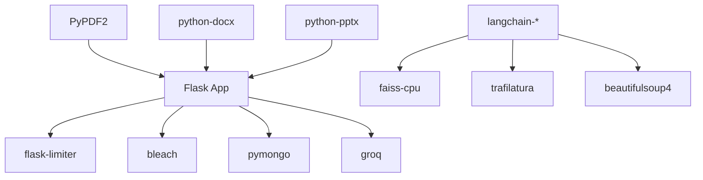

# Content Management System

<cite>
**Referenced Files in This Document**
- [backend/app.py](file://backend/app.py)
- [backend/database.py](file://backend/database.py)
- [backend/vector_store.py](file://backend/vector_store.py)
- [backend/scraper.py](file://backend/scraper.py)
- [frontend/admin.html](file://frontend/admin.html)
- [frontend/admin.js](file://frontend/admin.js)
- [frontend/admin-add-data.html](file://frontend/admin-add-data.html)
- [frontend/admin-data-bank.html](file://frontend/admin-data-bank.html)
- [frontend/admin-bugs.html](file://frontend/admin-bugs.html)
- [frontend/admin-ai.html](file://frontend/admin-ai.html)
- [API_DOCUMENTATION.md](file://API_DOCUMENTATION.md)
- [requirements.txt](file://requirements.txt)
</cite>

## Table of Contents
1. [Introduction](#introduction)
2. [Project Structure](#project-structure)
3. [Core Components](#core-components)
4. [Architecture Overview](#architecture-overview)
5. [Detailed Component Analysis](#detailed-component-analysis)
6. [Dependency Analysis](#dependency-analysis)
7. [Performance Considerations](#performance-considerations)
8. [Troubleshooting Guide](#troubleshooting-guide)
9. [Conclusion](#conclusion)
10. [Appendices](#appendices)

## Introduction
This document describes the Content Management System (CMS) powering DamayAI, a digital receptionist assistant for SMKN 2 Indramayu. The CMS enables administrators to manage three knowledge base types (scraped web data, manually uploaded files and text, and chat memory), monitor system health, moderate bug reports, and orchestrate content ingestion and retrieval via a Retrieval-Augmented Generation (RAG) pipeline. It includes robust authentication, CSRF protection, rate limiting, input validation, and audit logging to ensure secure and reliable operations.

## Project Structure
The system comprises:
- Backend (Flask): API endpoints, authentication, content ingestion, vector indexing, and RAG orchestration
- Frontend (Static HTML/JS): Admin dashboards for login, content management, bug reports, and AI playground
- Database: MongoDB collections for scraped, manual, memory, and bug report data
- Vector Store: FAISS indexes for semantic search across knowledge bases
- Scraper: Website crawling and content extraction utilities

**Diagram sources**
- [backend/app.py](file://backend/app.py)
- [backend/database.py](file://backend/database.py)
- [backend/vector_store.py](file://backend/vector_store.py)
- [backend/scraper.py](file://backend/scraper.py)
- [frontend/admin.html](file://frontend/admin.html)
- [frontend/admin.js](file://frontend/admin.js)
- [frontend/admin-add-data.html](file://frontend/admin-add-data.html)
- [frontend/admin-data-bank.html](file://frontend/admin-data-bank.html)
- [frontend/admin-bugs.html](file://frontend/admin-bugs.html)
- [frontend/admin-ai.html](file://frontend/admin-ai.html)

**Section sources**
- [backend/app.py](file://backend/app.py)
- [frontend/admin.html](file://frontend/admin.html)
- [frontend/admin.js](file://frontend/admin.js)

## Core Components
- Admin Authentication and Authorization
  - Session-based admin login with configurable expiry
  - CSRF protection enforced on state-changing requests
  - Security headers and rate limiting applied globally
- Content Management
  - CRUD for scraped, manual, and memory knowledge bases
  - Bulk ingestion via file upload and website scraping
  - Real-time dashboard statistics
- Vector Search and RAG
  - Separate FAISS indexes per knowledge base
  - Retrieval across all sources with streaming admin chat
- Bug Reporting
  - Structured lifecycle: New → Processing → Done/Not Fixed
  - File attachments for evidence
- Monitoring and Operations
  - Rebuild FAISS index, reset database, and deep crawl controls
  - Audit logging for admin actions

**Section sources**
- [backend/app.py](file://backend/app.py)
- [backend/database.py](file://backend/database.py)
- [backend/vector_store.py](file://backend/vector_store.py)
- [API_DOCUMENTATION.md](file://API_DOCUMENTATION.md)

## Architecture Overview
The CMS follows a layered architecture:
- Presentation: Static admin pages served by Flask’s static folder
- Application: Flask routes handle authentication, validation, orchestration, and streaming responses
- Persistence: MongoDB stores structured content and metadata
- Indexing: FAISS indexes enable fast semantic similarity search
- AI: Groq-hosted Llama 3.1 model for RAG completion

**Diagram sources**
- [backend/app.py](file://backend/app.py)
- [backend/database.py](file://backend/database.py)
- [backend/vector_store.py](file://backend/vector_store.py)

## Detailed Component Analysis

### Admin Authentication and Security
- Admin login supports plaintext or hashed passwords via environment variables
- Sessions expire after two hours; CSRF tokens are generated per session and validated on state-changing requests
- Security headers and rate limiting are enforced; global error handlers normalize responses
- Audit logs record admin actions for compliance

**Diagram sources**
- [backend/app.py](file://backend/app.py)

**Section sources**
- [backend/app.py](file://backend/app.py)

### Content Upload and Processing Pipeline
- Supported formats: PDF, DOCX, PPTX, TXT for manual uploads; PNG/JPG/GIF/MP4/MOV/AVI/WEBM for bug reports
- File size limit: 16 MB
- Extraction:
  - PDF: text extraction
  - DOCX: paragraphs and tables (converted to Markdown)
  - PPTX: slide text
  - TXT: raw UTF-8 text
- Validation:
  - Length limits for queries, content, and descriptions
  - HTML sanitization for user inputs
  - ObjectId validation for database operations
- Storage:
  - Manual uploads stored with extracted text and optional file path
  - Scraped data stored with URL, title, content, and representative image URL
  - Memory bank stores question-answer pairs

**Diagram sources**
- [backend/app.py](file://backend/app.py)
- [backend/scraper.py](file://backend/scraper.py)

**Section sources**
- [backend/app.py](file://backend/app.py)
- [backend/scraper.py](file://backend/scraper.py)

### Vector Store and Retrieval
- Three FAISS indexes: Memory Bank, Manual Data, Scraped Data
- Index creation splits documents into overlapping chunks and persists embeddings
- Retrievers are cached to avoid reloading on each request
- Admin chat streams intermediate steps and final answer augmented with citations

**Diagram sources**
- [backend/vector_store.py](file://backend/vector_store.py)
- [backend/database.py](file://backend/database.py)

**Section sources**
- [backend/vector_store.py](file://backend/vector_store.py)
- [backend/database.py](file://backend/database.py)

### Bug Reporting and Moderation
- Users can submit bug reports with a description and optional media
- Admins can update status through four states: New, Processing, Done, Not Fixed
- Admins can delete reports and preview attached media in the UI

**Diagram sources**
- [backend/app.py](file://backend/app.py)
- [backend/database.py](file://backend/database.py)
- [frontend/admin-bugs.html](file://frontend/admin-bugs.html)
- [frontend/admin.js](file://frontend/admin.js)

**Section sources**
- [backend/app.py](file://backend/app.py)
- [backend/database.py](file://backend/database.py)
- [frontend/admin-bugs.html](file://frontend/admin-bugs.html)
- [frontend/admin.js](file://frontend/admin.js)

### Admin Dashboards and Workflows
- Dashboard: Overview of system status, quick actions (scrape, reindex, crawl)
- Add Data: Text and file upload forms with previews and validation
- Data Bank: Unified list with filtering by type and search
- AI Playground: Admin chat with streaming RAG steps and citations
- Settings: Dangerous actions (delete FAISS, drop DB) with confirmations

**Diagram sources**
- [frontend/admin.html](file://frontend/admin.html)
- [frontend/admin-add-data.html](file://frontend/admin-add-data.html)
- [frontend/admin-data-bank.html](file://frontend/admin-data-bank.html)
- [frontend/admin-bugs.html](file://frontend/admin-bugs.html)
- [frontend/admin-ai.html](file://frontend/admin-ai.html)
- [frontend/admin.js](file://frontend/admin.js)

**Section sources**
- [frontend/admin.html](file://frontend/admin.html)
- [frontend/admin-add-data.html](file://frontend/admin-add-data.html)
- [frontend/admin-data-bank.html](file://frontend/admin-data-bank.html)
- [frontend/admin-bugs.html](file://frontend/admin-bugs.html)
- [frontend/admin-ai.html](file://frontend/admin-ai.html)
- [frontend/admin.js](file://frontend/admin.js)

## Dependency Analysis
External libraries and integrations:
- Flask and extensions for routing, sessions, rate limiting, and security
- LangChain ecosystem for document splitting and embeddings
- FAISS for vector storage and similarity search
- Trafilatura and BeautifulSoup for web scraping and content extraction
- PyPDF2, python-docx, python-pptx for document parsing
- PyMongo for MongoDB connectivity
- Groq for Llama 3.1 inference

**Diagram sources**
- [requirements.txt](file://requirements.txt)
- [backend/app.py](file://backend/app.py)
- [backend/vector_store.py](file://backend/vector_store.py)
- [backend/scraper.py](file://backend/scraper.py)

**Section sources**
- [requirements.txt](file://requirements.txt)
- [backend/app.py](file://backend/app.py)

## Performance Considerations
- FAISS retrievers are cached to avoid repeated disk reads
- Chunk size and overlap tuned for balanced recall and latency
- Rate limiting prevents abuse and protects downstream services
- Streaming responses reduce perceived latency for admin chat
- Index rebuild is explicit to keep retrieval consistent

[No sources needed since this section provides general guidance]

## Troubleshooting Guide
Common issues and resolutions:
- Authentication failures
  - Ensure ADMIN_PASSWORD or ADMIN_PASSWORD_HASH is configured
  - Clear browser session and re-login
- CSRF errors
  - Refresh CSRF token endpoint or re-authenticate
- File upload errors
  - Verify file size ≤ 16 MB and extension is allowed
  - Confirm extraction succeeded and content is non-empty
- Index rebuild failures
  - Trigger Rebuild Index after ingesting new data
  - Delete FAISS indexes only if necessary and rebuild afterward
- Database reset
  - Use the dangerous action to drop collections; re-ingest data afterward
- Rate limit exceeded
  - Wait until the next window or reduce request frequency

**Section sources**
- [backend/app.py](file://backend/app.py)
- [API_DOCUMENTATION.md](file://API_DOCUMENTATION.md)

## Conclusion
The CMS provides a secure, scalable foundation for managing diverse knowledge sources, enforcing strong admin controls, and delivering accurate, contextual responses via RAG. Its modular design supports incremental improvements in ingestion, retrieval, and moderation workflows.

[No sources needed since this section summarizes without analyzing specific files]

## Appendices

### Administrative Workflows
- Add Manual Text: Fill title and content; submit; rebuild index if needed
- Add Manual File: Select PDF/DOCX/PPTX/TXT; upload; system extracts text; review in Data Bank
- Scrape URLs: Provide a list of URLs; run scrape job; ingest results
- Deep Crawl: Enter base URL; configure max pages; crawl and ingest discovered pages
- Rebuild Index: After any content change, rebuild FAISS indexes for all knowledge bases
- Manage Bug Reports: Filter by status, update lifecycle, attach media, delete when appropriate
- Monitor and Maintain: Use dashboard to track counts and trigger maintenance actions

**Section sources**
- [frontend/admin-add-data.html](file://frontend/admin-add-data.html)
- [frontend/admin-data-bank.html](file://frontend/admin-data-bank.html)
- [frontend/admin-bugs.html](file://frontend/admin-bugs.html)
- [frontend/admin.html](file://frontend/admin.html)
- [backend/app.py](file://backend/app.py)