# Dashboard and Analytics

<cite>
**Referenced Files in This Document**
- [backend/app.py](file://backend/app.py)
- [backend/database.py](file://backend/database.py)
- [backend/vector_store.py](file://backend/vector_store.py)
- [backend/scraper.py](file://backend/scraper.py)
- [frontend/admin.html](file://frontend/admin.html)
- [frontend/admin.js](file://frontend/admin.js)
- [frontend/admin-data-bank.html](file://frontend/admin-data-bank.html)
- [frontend/admin-bugs.html](file://frontend/admin-bugs.html)
- [frontend/admin-settings.html](file://frontend/admin-settings.html)
- [frontend/admin-ai.html](file://frontend/admin-ai.html)
- [generate_api_excel.py](file://generate_api_excel.py)
</cite>

## Table of Contents
1. [Introduction](#introduction)
2. [Project Structure](#project-structure)
3. [Core Components](#core-components)
4. [Architecture Overview](#architecture-overview)
5. [Detailed Component Analysis](#detailed-component-analysis)
6. [Dependency Analysis](#dependency-analysis)
7. [Performance Considerations](#performance-considerations)
8. [Troubleshooting Guide](#troubleshooting-guide)
9. [Conclusion](#conclusion)
10. [Appendices](#appendices)

## Introduction
This document describes the admin dashboard and analytics functionality of the DamayAI Assistant system. It covers the statistics aggregation system, real-time dashboard updates, data visualization components, system health monitoring, resource utilization tracking, alerting mechanisms, export capabilities, reporting features, custom query interfaces, user activity tracking, content usage analytics, and system performance indicators. It also addresses dashboard customization options, user preferences, and access controls for different dashboard views.

## Project Structure
The dashboard and analytics span both backend and frontend components:
- Backend: Flask application exposing admin APIs, managing database operations, vector store indexing, and scraping workflows.
- Frontend: Admin pages for dashboard, data bank, bug reports, AI playground, and settings, with JavaScript orchestrating real-time updates and user interactions.

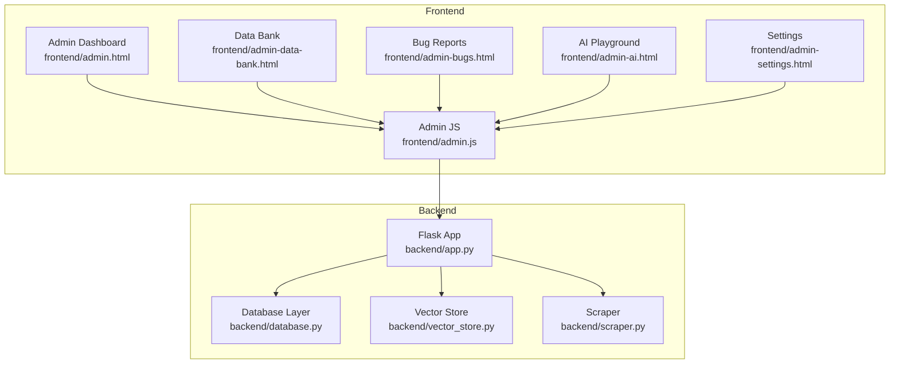

**Diagram sources**
- [backend/app.py:1-1192](file://backend/app.py#L1-L1192)
- [backend/database.py:1-260](file://backend/database.py#L1-L260)
- [backend/vector_store.py:1-115](file://backend/vector_store.py#L1-L115)
- [backend/scraper.py:1-278](file://backend/scraper.py#L1-L278)
- [frontend/admin.html:1-164](file://frontend/admin.html#L1-L164)
- [frontend/admin.js:1-1108](file://frontend/admin.js#L1-L1108)
- [frontend/admin-data-bank.html:1-98](file://frontend/admin-data-bank.html#L1-L98)
- [frontend/admin-bugs.html:1-94](file://frontend/admin-bugs.html#L1-L94)
- [frontend/admin-ai.html:1-86](file://frontend/admin-ai.html#L1-L86)
- [frontend/admin-settings.html:1-102](file://frontend/admin-settings.html#L1-L102)

**Section sources**
- [backend/app.py:1-1192](file://backend/app.py#L1-L1192)
- [frontend/admin.html:1-164](file://frontend/admin.html#L1-L164)
- [frontend/admin.js:1-1108](file://frontend/admin.js#L1-L1108)

## Core Components
- Statistics aggregation endpoint: Returns counts for scraped data, manual data, memory bank entries, and bug reports, including breakdowns by status.
- Real-time processing: Streams progress for scraping, indexing, and deep crawling operations.
- Data management: CRUD operations for manual data, memory bank, scraped data, and bug reports.
- Vector indexing: Separate FAISS indexes for memory, manual, and scraped data with caching and invalidation.
- Admin authentication and CSRF protection: Session-based admin access with CSRF tokens for state-changing actions.
- Audit logging: Centralized audit logger for admin actions.

**Section sources**
- [backend/database.py:230-243](file://backend/database.py#L230-L243)
- [backend/app.py:959-965](file://backend/app.py#L959-L965)
- [backend/app.py:243-250](file://backend/app.py#L243-L250)
- [backend/app.py:137-159](file://backend/app.py#L137-L159)
- [backend/app.py:53-56](file://backend/app.py#L53-L56)

## Architecture Overview
The admin dashboard integrates frontend UI with backend APIs. The frontend communicates with the backend via authenticated HTTP requests and streaming responses for long-running tasks. The backend coordinates database operations, vector store indexing, and scraping workflows.

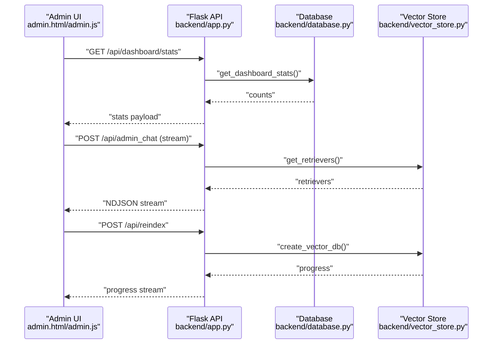

**Diagram sources**
- [backend/app.py:959-965](file://backend/app.py#L959-L965)
- [backend/app.py:589-603](file://backend/app.py#L589-L603)
- [backend/app.py:763-784](file://backend/app.py#L763-L784)
- [backend/database.py:230-243](file://backend/database.py#L230-L243)
- [backend/vector_store.py:48-70](file://backend/vector_store.py#L48-L70)

## Detailed Component Analysis

### Statistics Aggregation System
The dashboard statistics endpoint aggregates counts across four categories:
- Scraped data count
- Manual data count
- Memory bank count
- Bug reports total and per-status counts

These counts feed the dashboard’s summary cards and enable quick visibility into system content and issue trends.

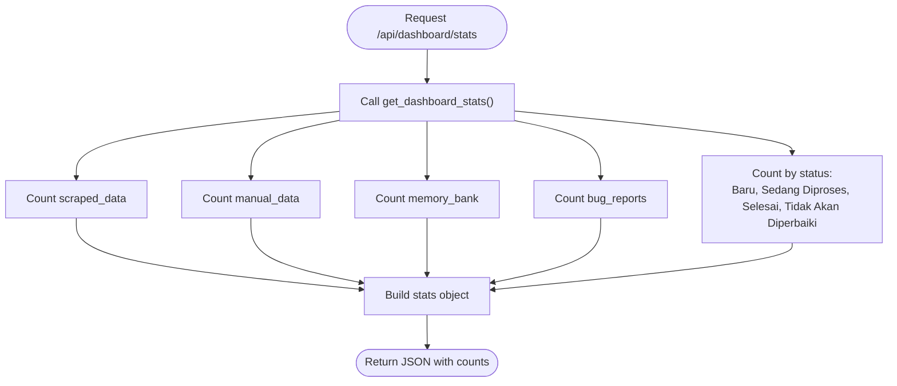

**Diagram sources**
- [backend/app.py:959-965](file://backend/app.py#L959-L965)
- [backend/database.py:230-243](file://backend/database.py#L230-L243)

**Section sources**
- [backend/database.py:230-243](file://backend/database.py#L230-L243)
- [backend/app.py:959-965](file://backend/app.py#L959-L965)

### Real-Time Dashboard Updates
The frontend supports real-time updates for:
- Scraping progress (streamed NDJSON)
- Index rebuilding progress (streamed NDJSON)
- Deep crawling progress (streamed NDJSON)
- Admin chat reasoning steps (streamed NDJSON)

The UI parses streamed events and updates the console and status badges dynamically.

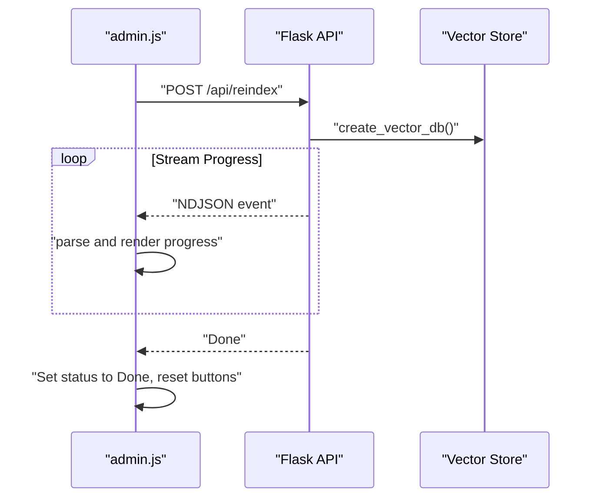

**Diagram sources**
- [frontend/admin.js:255-318](file://frontend/admin.js#L255-L318)
- [backend/app.py:763-784](file://backend/app.py#L763-L784)
- [backend/vector_store.py:48-70](file://backend/vector_store.py#L48-L70)

**Section sources**
- [frontend/admin.js:255-318](file://frontend/admin.js#L255-L318)
- [backend/app.py:763-784](file://backend/app.py#L763-L784)
- [backend/vector_store.py:48-70](file://backend/vector_store.py#L48-L70)

### Data Visualization Components
The dashboard displays:
- Summary cards for scraped, manual, memory, and bug counts
- Status badges indicating current operation state (Idle, Running, Done)
- Console logs for real-time operations
- Filterable and searchable lists for data bank and bug reports
- Editable detail modals for items and bug reports

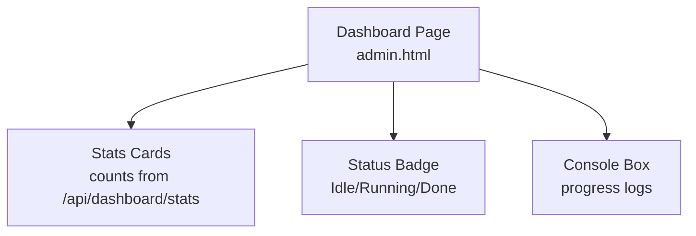

**Diagram sources**
- [frontend/admin.html:99-145](file://frontend/admin.html#L99-L145)
- [backend/app.py:959-965](file://backend/app.py#L959-L965)

**Section sources**
- [frontend/admin.html:99-145](file://frontend/admin.html#L99-L145)
- [frontend/admin.js:249-318](file://frontend/admin.js#L249-L318)

### System Health Monitoring and Resource Utilization
- Vector store caching reduces repeated FAISS loading overhead; cache invalidation forces reload after reindexing.
- Index paths are separated per data type to isolate and manage resources efficiently.
- Scraping and crawling include safety checks (allowed domains, timeouts) and content filtering to reduce unnecessary resource usage.

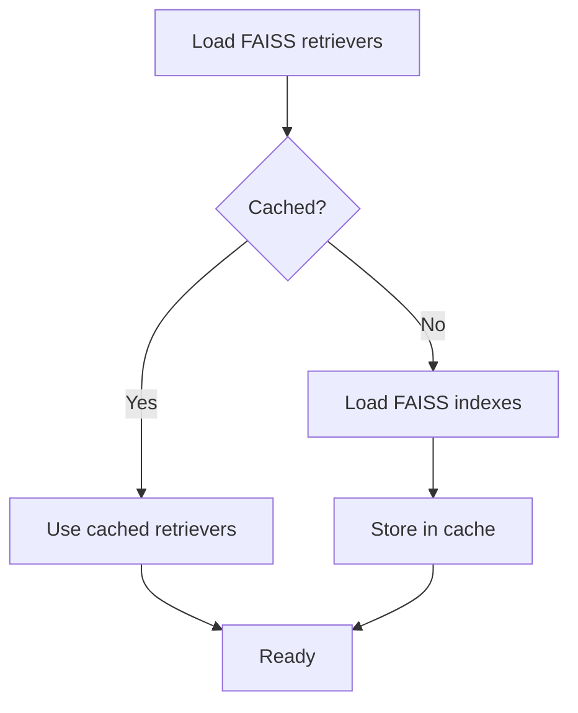

**Diagram sources**
- [backend/vector_store.py:73-115](file://backend/vector_store.py#L73-L115)

**Section sources**
- [backend/vector_store.py:17-21](file://backend/vector_store.py#L17-L21)
- [backend/vector_store.py:73-115](file://backend/vector_store.py#L73-L115)
- [backend/scraper.py:12-27](file://backend/scraper.py#L12-L27)

### Alerting Mechanisms
- Rate limiting: Login, bug reports, chat, and admin chat endpoints are rate-limited to mitigate abuse.
- Security headers and CSRF protection: Admin routes enforce CSRF tokens and secure headers.
- Audit logging: Admin actions are logged for traceability.

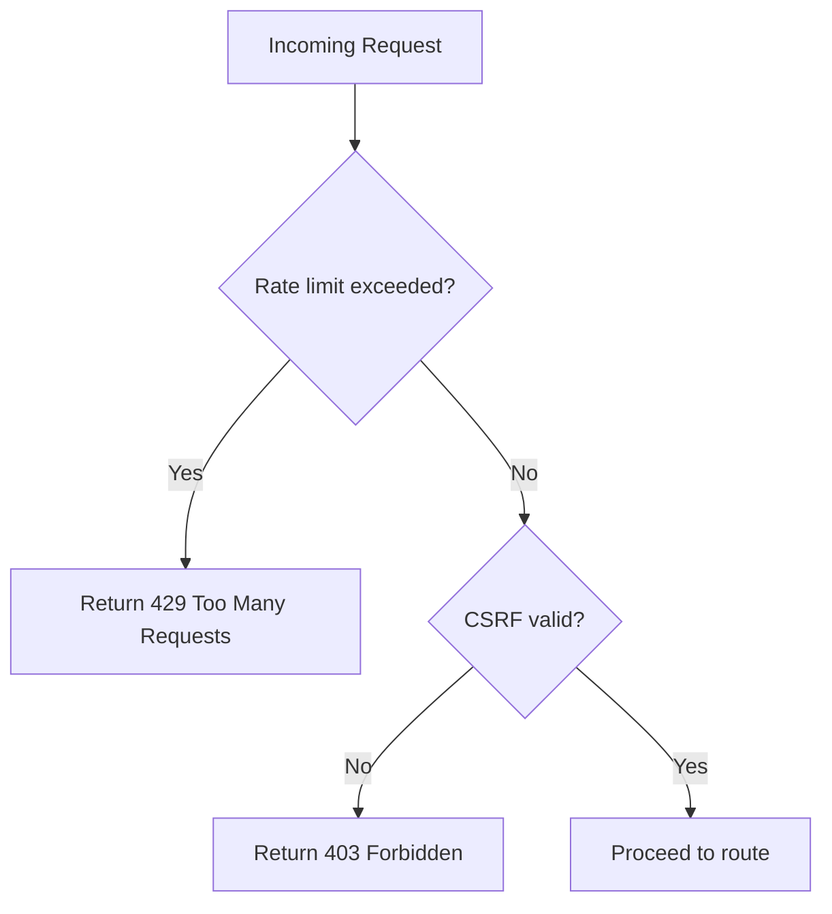

**Diagram sources**
- [backend/app.py:331-352](file://backend/app.py#L331-L352)
- [backend/app.py:403-430](file://backend/app.py#L403-L430)
- [backend/app.py:432-452](file://backend/app.py#L432-L452)
- [backend/app.py:589-603](file://backend/app.py#L589-L603)
- [backend/app.py:137-159](file://backend/app.py#L137-L159)

**Section sources**
- [backend/app.py:98-115](file://backend/app.py#L98-L115)
- [backend/app.py:331-352](file://backend/app.py#L331-L352)
- [backend/app.py:403-430](file://backend/app.py#L403-L430)
- [backend/app.py:432-452](file://backend/app.py#L432-L452)
- [backend/app.py:589-603](file://backend/app.py#L589-L603)
- [backend/app.py:137-159](file://backend/app.py#L137-L159)
- [backend/app.py:53-56](file://backend/app.py#L53-L56)

### Export Capabilities and Reporting Features
- Bug reports support file attachments (images, videos) and status tracking.
- Data bank items can be viewed with embedded previews for supported file types.
- The AI playground allows saving final answers to the memory bank for persistent retrieval.

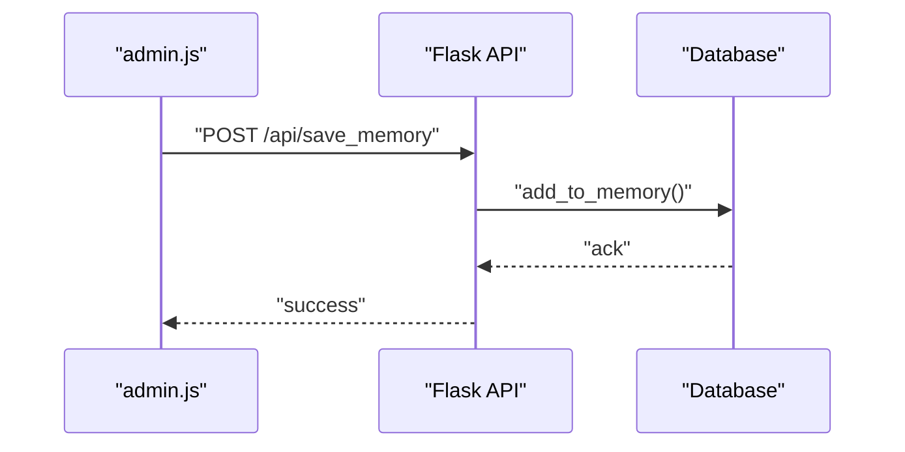

**Diagram sources**
- [frontend/admin.js:1079-1105](file://frontend/admin.js#L1079-L1105)
- [backend/app.py:568-587](file://backend/app.py#L568-L587)
- [backend/database.py:108-122](file://backend/database.py#L108-L122)

**Section sources**
- [frontend/admin-bugs.html:1-94](file://frontend/admin-bugs.html#L1-L94)
- [frontend/admin-data-bank.html:1-98](file://frontend/admin-data-bank.html#L1-L98)
- [frontend/admin.js:805-862](file://frontend/admin.js#L805-L862)
- [frontend/admin.js:1079-1105](file://frontend/admin.js#L1079-L1105)
- [backend/app.py:568-587](file://backend/app.py#L568-L587)
- [backend/database.py:108-122](file://backend/database.py#L108-L122)

### Custom Query Interfaces and User Activity Tracking
- Admin chat endpoint streams reasoning steps and retrieved documents, enabling inspection of the RAG pipeline behavior.
- Chat history is validated and truncated to recent entries to maintain performance and relevance.

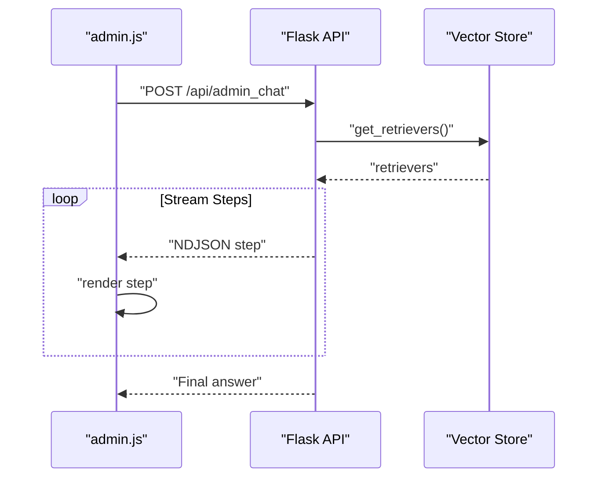

**Diagram sources**
- [frontend/admin.js:1019-1069](file://frontend/admin.js#L1019-L1069)
- [backend/app.py:589-603](file://backend/app.py#L589-L603)
- [backend/app.py:609-760](file://backend/app.py#L609-L760)
- [backend/vector_store.py:73-115](file://backend/vector_store.py#L73-L115)

**Section sources**
- [frontend/admin.js:1019-1069](file://frontend/admin.js#L1019-L1069)
- [backend/app.py:589-603](file://backend/app.py#L589-L603)
- [backend/app.py:609-760](file://backend/app.py#L609-L760)

### Dashboard Customization and Access Controls
- Theme switching persists in local storage and reflects immediately.
- Navigation and section activation are handled in the shared admin JavaScript.
- Admin-only decorators protect sensitive endpoints; CSRF tokens are injected for state-changing requests.

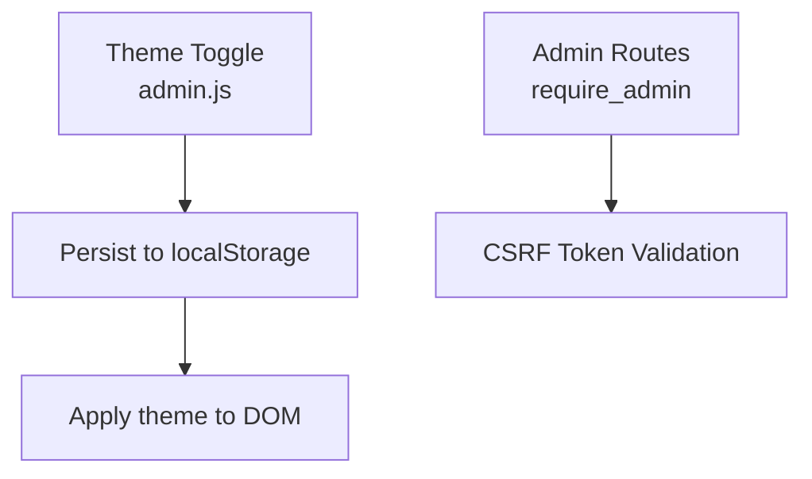

**Diagram sources**
- [frontend/admin.js:82-108](file://frontend/admin.js#L82-L108)
- [backend/app.py:243-250](file://backend/app.py#L243-L250)
- [backend/app.py:137-159](file://backend/app.py#L137-L159)

**Section sources**
- [frontend/admin.js:82-108](file://frontend/admin.js#L82-L108)
- [backend/app.py:243-250](file://backend/app.py#L243-L250)
- [backend/app.py:137-159](file://backend/app.py#L137-L159)

## Dependency Analysis
The dashboard relies on:
- Backend endpoints for statistics, data management, and processing.
- Database layer for counts and persistence.
- Vector store for retrieval and indexing.
- Frontend scripts for UI orchestration and real-time rendering.

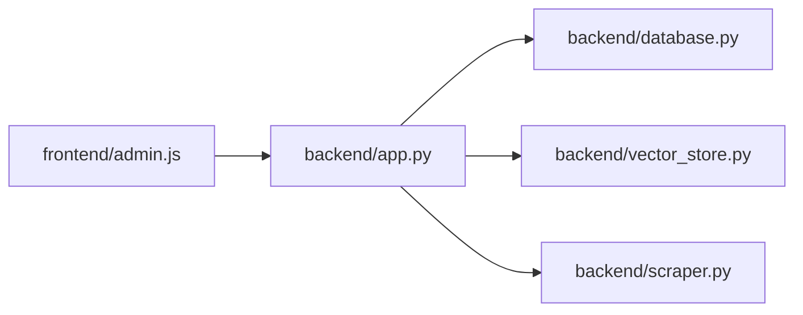

**Diagram sources**
- [frontend/admin.js:1-1108](file://frontend/admin.js#L1-L1108)
- [backend/app.py:1-1192](file://backend/app.py#L1-L1192)
- [backend/database.py:1-260](file://backend/database.py#L1-260)
- [backend/vector_store.py:1-115](file://backend/vector_store.py#L1-L115)
- [backend/scraper.py:1-278](file://backend/scraper.py#L1-L278)

**Section sources**
- [frontend/admin.js:1-1108](file://frontend/admin.js#L1-L1108)
- [backend/app.py:1-1192](file://backend/app.py#L1-L1192)
- [backend/database.py:1-260](file://backend/database.py#L1-L260)
- [backend/vector_store.py:1-115](file://backend/vector_store.py#L1-L115)
- [backend/scraper.py:1-278](file://backend/scraper.py#L1-L278)

## Performance Considerations
- Vector store caching: Retrievers are cached to avoid repeated FAISS loads; invalidate cache after reindexing.
- Chunking and splitting: Documents are split into manageable chunks before embedding to balance recall and speed.
- Rate limiting: Prevents overload on sensitive endpoints.
- Input sanitization and length limits: Reduce risk of abuse and improve stability.
- Streaming responses: Provide immediate feedback for long-running operations.

[No sources needed since this section provides general guidance]

## Troubleshooting Guide
Common issues and remedies:
- Unauthorized access: Ensure admin session exists and CSRF token is valid; re-login if prompted.
- Rate limit errors: Wait for cooldown or adjust client-side throttling.
- Index rebuild failures: Verify FAISS paths exist and permissions allow writing; trigger rebuild again.
- Empty or stale counts: Refresh the dashboard or trigger a statistics refresh endpoint.

**Section sources**
- [backend/app.py:214-234](file://backend/app.py#L214-L234)
- [backend/app.py:320-326](file://backend/app.py#L320-L326)
- [backend/app.py:763-784](file://backend/app.py#L763-L784)
- [backend/database.py:230-243](file://backend/database.py#L230-L243)

## Conclusion
The admin dashboard and analytics system provide a comprehensive view of content ingestion, processing, and quality through aggregated statistics, real-time operation logs, and robust management interfaces. With vector store caching, rate limiting, and audit logging, the system balances performance, security, and observability. The modular frontend-backend design enables straightforward extension for additional analytics and reporting features.

## Appendices

### API Reference: Dashboard Statistics
- Endpoint: GET /api/dashboard/stats
- Purpose: Retrieve aggregated counts for scraped data, manual data, memory bank, and bug reports (including per-status counts).
- Response: JSON object containing counts for each category.

**Section sources**
- [backend/app.py:959-965](file://backend/app.py#L959-L965)
- [backend/database.py:230-243](file://backend/database.py#L230-L243)
- [generate_api_excel.py:22](file://generate_api_excel.py#L22)