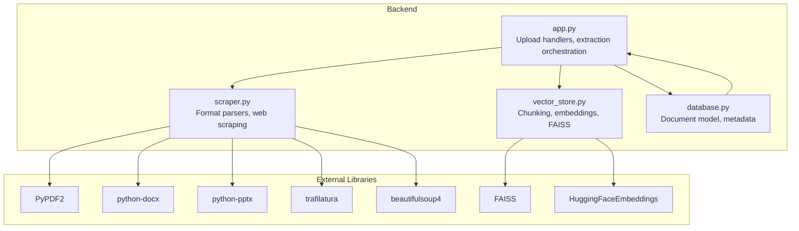
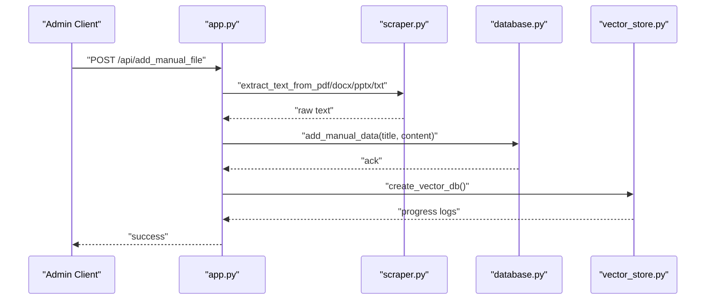
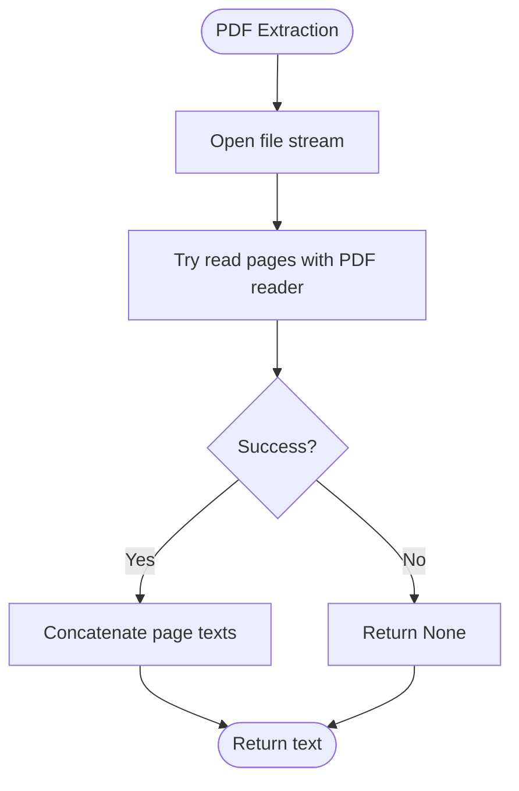
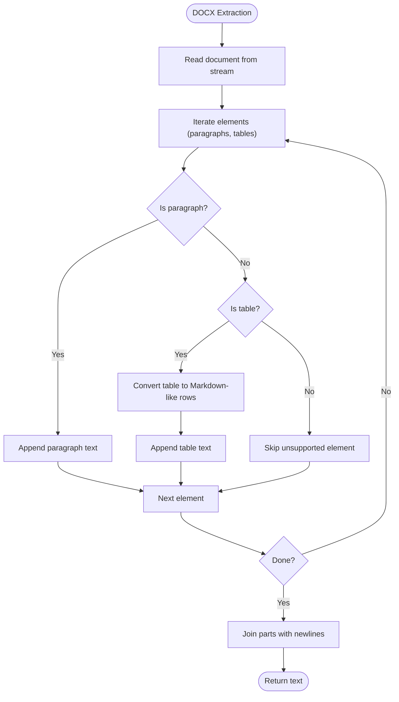
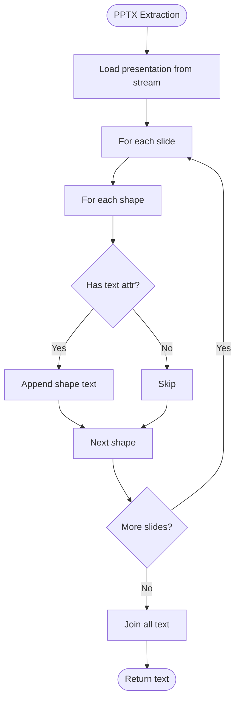
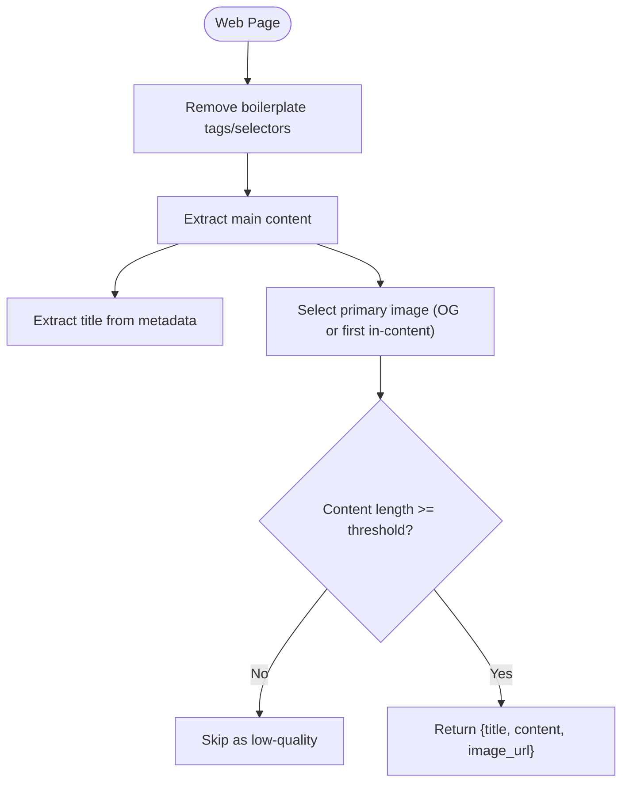
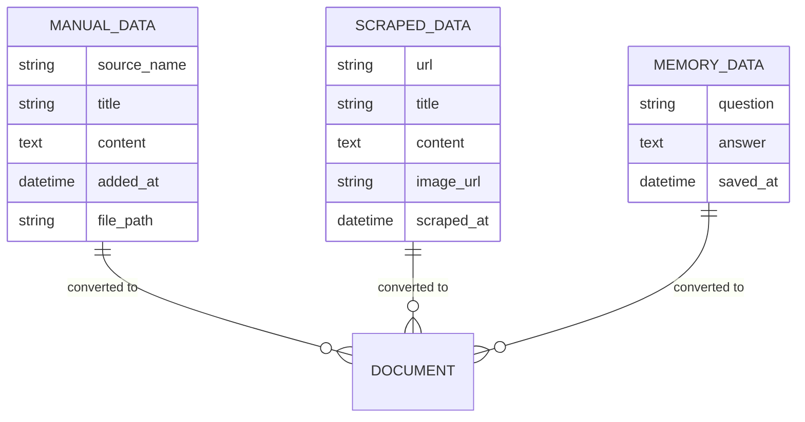
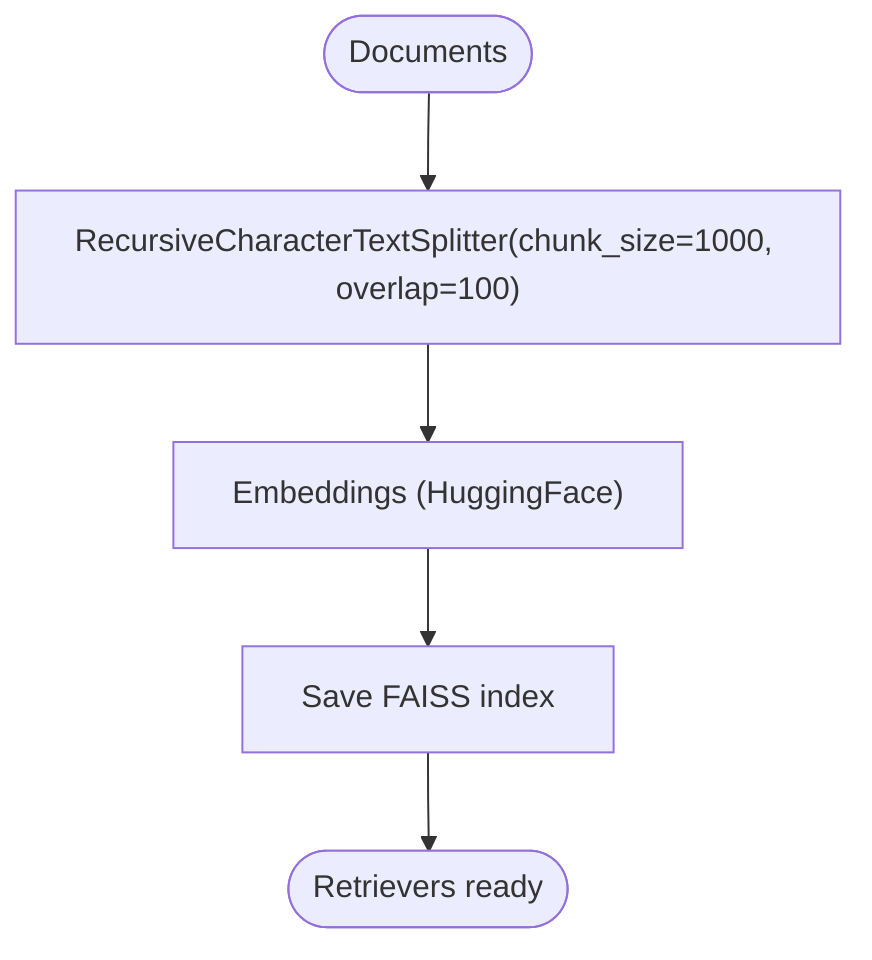
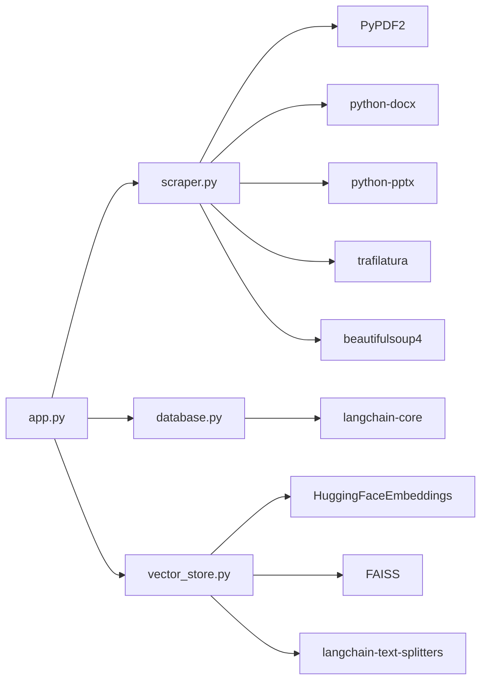

# Content Extraction and Processing

<cite>
**Referenced Files in This Document**
- [app.py](file://backend/app.py)
- [scraper.py](file://backend/scraper.py)
- [vector_store.py](file://backend/vector_store.py)
- [database.py](file://backend/database.py)
- [API_DOCUMENTATION.md](file://API_DOCUMENTATION.md)
- [requirements.txt](file://requirements.txt)
</cite>

## Table of Contents
1. [Introduction](#introduction)
2. [Project Structure](#project-structure)
3. [Core Components](#core-components)
4. [Architecture Overview](#architecture-overview)
5. [Detailed Component Analysis](#detailed-component-analysis)
6. [Dependency Analysis](#dependency-analysis)
7. [Performance Considerations](#performance-considerations)
8. [Troubleshooting Guide](#troubleshooting-guide)
9. [Conclusion](#conclusion)

## Introduction
This document explains the content extraction and processing pipeline used by the system. It covers how different file formats are parsed and extracted, how metadata is generated, and how content is normalized and segmented for vector indexing. It also describes the chunking strategy, quality assessment heuristics, and common challenges encountered when processing PDFs, DOCX, PPTX, and TXT files.

## Project Structure
The content extraction and processing logic is primarily implemented in the backend Python modules:
- File upload handlers and extraction orchestration
- Format-specific parsers for PDF, DOCX, PPTX, and TXT
- Vector indexing and retrieval
- Metadata generation and document preparation for downstream AI processing

**Diagram sources**
- [app.py:520-566](file://backend/app.py#L520-L566)
- [scraper.py:33-66](file://backend/scraper.py#L33-L66)
- [vector_store.py:23-70](file://backend/vector_store.py#L23-L70)
- [database.py:96-104](file://backend/database.py#L96-L104)

**Section sources**
- [app.py:124-133](file://backend/app.py#L124-L133)
- [API_DOCUMENTATION.md:292-297](file://API_DOCUMENTATION.md#L292-L297)

## Core Components
- Format parsers: dedicated functions for extracting text from PDF, DOCX, PPTX, and TXT.
- Web scraping and content extraction: robust HTML cleaning and content extraction with metadata.
- Vector indexing: recursive character splitting, embeddings, and FAISS persistence.
- Metadata generation: structured metadata for vector search and downstream presentation.
- Quality assessment: content length thresholds and boilerplate filtering.

**Section sources**
- [scraper.py:33-66](file://backend/scraper.py#L33-L66)
- [scraper.py:83-147](file://backend/scraper.py#L83-L147)
- [vector_store.py:36-46](file://backend/vector_store.py#L36-L46)
- [database.py:96-104](file://backend/database.py#L96-L104)

## Architecture Overview
The system extracts content from uploaded files and web sources, normalizes it, segments it into chunks, generates metadata, and persists vectors for retrieval.

**Diagram sources**
- [app.py:520-566](file://backend/app.py#L520-L566)
- [scraper.py:33-66](file://backend/scraper.py#L33-L66)
- [database.py:61-79](file://backend/database.py#L61-L79)
- [vector_store.py:48-70](file://backend/vector_store.py#L48-L70)

## Detailed Component Analysis

### PDF Text Extraction
- Algorithm: Uses a PDF reader to iterate pages and extract text. On failure, returns None to signal an issue.
- Robustness: The caller handles None by logging and skipping.
- Encoding: Relies on the underlying library’s decoding; caller-side UTF-8 decoding is not applied for PDFs.

**Diagram sources**
- [scraper.py:33-43](file://backend/scraper.py#L33-L43)

**Section sources**
- [scraper.py:33-43](file://backend/scraper.py#L33-L43)
- [app.py:545-546](file://backend/app.py#L545-L546)

### DOCX Content Parsing
- Algorithm: Iterates document paragraphs and tables. Tables are converted to a Markdown-like table representation. Paragraphs are joined with newline separators.
- Robustness: On failure, falls back to a simpler paragraph extraction approach to maximize recoverability.
- Metadata: Title is not auto-extracted from DOCX; callers supply a title (either from filename or provided title).

**Diagram sources**
- [app.py:375-400](file://backend/app.py#L375-L400)

**Section sources**
- [app.py:375-400](file://backend/app.py#L375-L400)

### PPTX Slide Processing
- Algorithm: Iterates slides and shapes, concatenating text from shapes that expose a text attribute.
- Robustness: On failure, returns None to indicate extraction failure.
- Metadata: Title is not auto-extracted from PPTX; callers supply a title.

**Diagram sources**
- [scraper.py:54-66](file://backend/scraper.py#L54-L66)

**Section sources**
- [scraper.py:54-66](file://backend/scraper.py#L54-L66)
- [app.py:549](file://backend/app.py#L549)

### TXT File Handling
- Algorithm: Reads bytes and decodes to UTF-8.
- Robustness: Decoding errors are not handled here; upstream validation ensures allowed extensions and sizes.
- Metadata: Title is supplied by the caller.

**Section sources**
- [app.py:551-552](file://backend/app.py#L551-L552)

### Web Content Extraction and Metadata Generation
- Cleaning: Removes boilerplate tags and common selectors to reduce noise.
- Extraction: Uses a content extraction library to isolate main article content and language targeting.
- Metadata: Title is extracted from page metadata; image selection prioritizes Open Graph image, otherwise the first suitable in-content image.
- Quality: Enforces a minimum content length threshold; shorter content is skipped.

**Diagram sources**
- [scraper.py:69-81](file://backend/scraper.py#L69-L81)
- [scraper.py:83-147](file://backend/scraper.py#L83-L147)

**Section sources**
- [scraper.py:69-81](file://backend/scraper.py#L69-L81)
- [scraper.py:83-147](file://backend/scraper.py#L83-L147)

### Metadata Generation for Vector Indexing
- Manual data: Title and content are combined into a page content string; metadata includes source, title, and type.
- Scraped data: Title, URL, optional image URL, and content are combined; metadata includes source, title, type, and image URL.
- Memory data: Question and answer are combined; metadata includes source, title, and type.

**Diagram sources**
- [database.py:61-79](file://backend/database.py#L61-L79)
- [database.py:152-168](file://backend/database.py#L152-L168)
- [database.py:108-122](file://backend/database.py#L108-L122)

**Section sources**
- [database.py:96-104](file://backend/database.py#L96-L104)
- [database.py:186-195](file://backend/database.py#L186-L195)
- [database.py:140-148](file://backend/database.py#L140-L148)

### Content Cleaning and Normalization
- HTML boilerplate removal: Strips navigation, footer, header, aside, and common ad/comment selectors.
- Whitespace handling: Replaces repeated newlines with double newlines and trims trailing whitespace.
- Special characters: No explicit character normalization is performed in the parsers; downstream sanitization may apply for user-provided text.
- Encoding: TXT decoding uses UTF-8; PDF/DOCX/PPTX rely on library defaults.

**Section sources**
- [scraper.py:69-81](file://backend/scraper.py#L69-L81)
- [scraper.py:142-144](file://backend/scraper.py#L142-L144)
- [app.py:551-552](file://backend/app.py#L551-L552)

### Chunking Strategies for Vector Indexing
- Splitter: Recursive character text splitter with configurable chunk size and overlap.
- Purpose: Ensures semantic continuity while enabling efficient retrieval.
- Persistence: FAISS index saved locally; retrievers are cached module-wide to avoid reloading on each request.

**Diagram sources**
- [vector_store.py:36-46](file://backend/vector_store.py#L36-L46)
- [vector_store.py:73-115](file://backend/vector_store.py#L73-L115)

**Section sources**
- [vector_store.py:36-46](file://backend/vector_store.py#L36-L46)
- [vector_store.py:73-115](file://backend/vector_store.py#L73-L115)

### Quality Assessment Metrics
- Minimum content length: Pages with extracted content shorter than a threshold are skipped.
- Boilerplate filtering: Removal of non-content elements reduces noise.
- Image selection: Prefer OG image; otherwise first in-content image meeting size criteria.

**Section sources**
- [scraper.py:142-144](file://backend/scraper.py#L142-L144)
- [scraper.py:112-139](file://backend/scraper.py#L112-L139)

## Dependency Analysis
The system relies on several libraries for extraction and indexing:
- PDF: PyPDF2
- DOCX: python-docx
- PPTX: python-pptx
- Web content: trafilatura, beautifulsoup4
- Embeddings and indexing: sentence-transformers, HuggingFaceEmbeddings, FAISS
- Vector retrieval: langchain-text-splitters, langchain-community

**Diagram sources**
- [requirements.txt:17-21](file://requirements.txt#L17-L21)
- [requirements.txt:8-13](file://requirements.txt#L8-L13)
- [requirements.txt:30](file://requirements.txt#L30)

**Section sources**
- [requirements.txt:1-30](file://requirements.txt#L1-L30)

## Performance Considerations
- Chunk size and overlap: 1000 characters with 100-character overlap balances recall and retrieval speed.
- Caching: Retriever caching avoids repeated FAISS loads.
- Rate limits: Admin endpoints are rate-limited to prevent abuse.
- File size limits: Maximum 16 MB per upload to control memory and processing time.
- Input length caps: Prevents oversized prompts and content from overwhelming downstream processing.

[No sources needed since this section provides general guidance]

## Troubleshooting Guide
Common extraction challenges and solutions:
- Malformed or encrypted PDFs: The parser returns None; callers should log and notify administrators.
- Corrupted DOCX: Fallback paragraph extraction is used to salvage readable content.
- PPTX with non-text shapes: Only shapes exposing a text attribute are included; complex layouts may yield sparse content.
- Very short web content: Content below the minimum length threshold is skipped; improve content extraction by refining selectors or focusing on canonical content areas.
- Encoding issues with TXT: Ensure UTF-8 encoding; if decoding fails, adjust file encoding or handle exceptions upstream.
- Large files exceeding limits: Enforce file size checks and prompt users to compress or split files.

**Section sources**
- [scraper.py:41-43](file://backend/scraper.py#L41-L43)
- [app.py:396-399](file://backend/app.py#L396-L399)
- [scraper.py:64-66](file://backend/scraper.py#L64-L66)
- [scraper.py:142-144](file://backend/scraper.py#L142-L144)
- [app.py:551-552](file://backend/app.py#L551-L552)
- [app.py:88](file://backend/app.py#L88)

## Conclusion
The system implements a robust, layered content extraction pipeline tailored for educational content. It supports multiple document formats, cleans and normalizes content, enforces quality thresholds, and prepares structured metadata for vector indexing. The chunking strategy and caching mechanisms balance performance and retrieval quality, while built-in safeguards protect against malformed or oversized inputs.