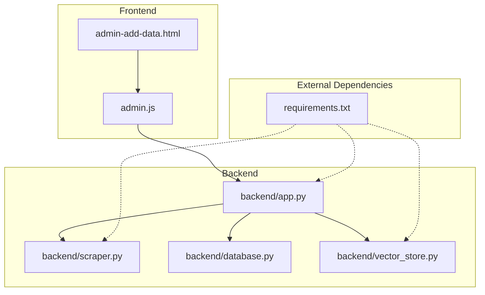
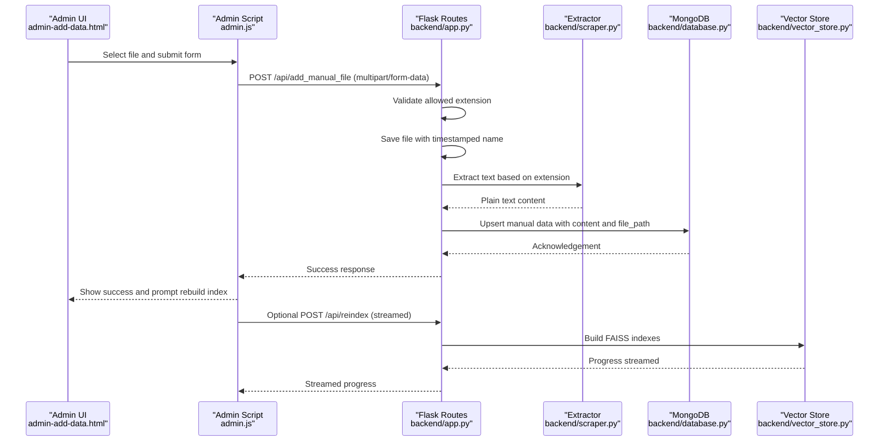
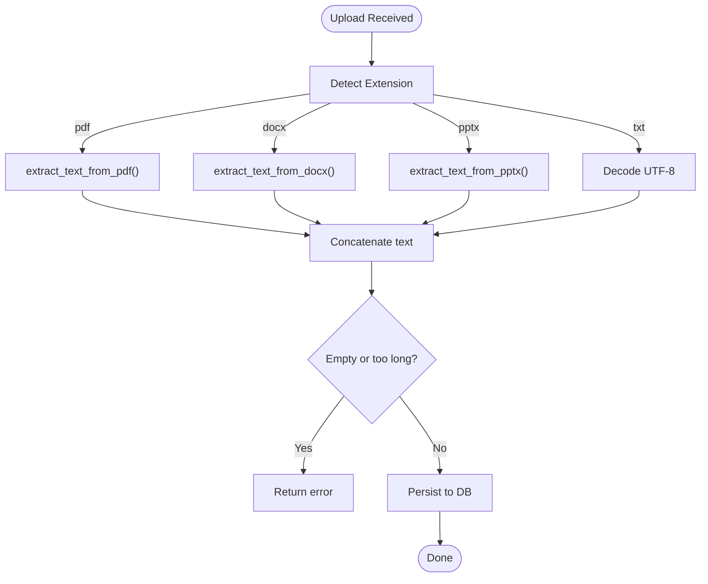
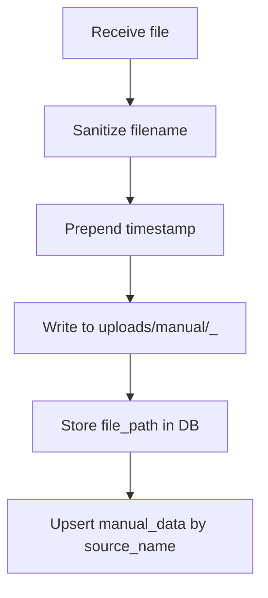
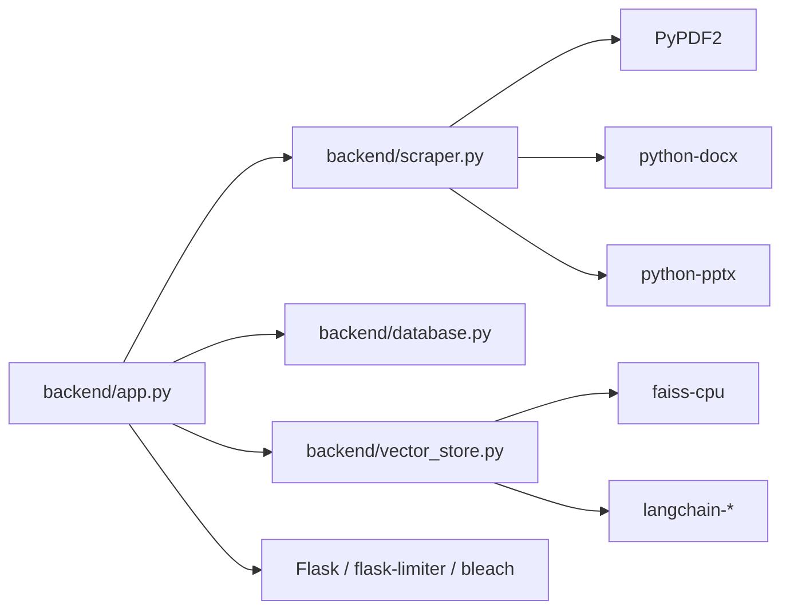

# File Upload and Processing

<cite>
**Referenced Files in This Document**
- [app.py](file://backend/app.py)
- [scraper.py](file://backend/scraper.py)
- [database.py](file://backend/database.py)
- [vector_store.py](file://backend/vector_store.py)
- [requirements.txt](file://requirements.txt)
- [admin-add-data.html](file://frontend/admin-add-data.html)
- [admin.js](file://frontend/admin.js)
</cite>

## Table of Contents
1. [Introduction](#introduction)
2. [Project Structure](#project-structure)
3. [Core Components](#core-components)
4. [Architecture Overview](#architecture-overview)
5. [Detailed Component Analysis](#detailed-component-analysis)
6. [Dependency Analysis](#dependency-analysis)
7. [Performance Considerations](#performance-considerations)
8. [Troubleshooting Guide](#troubleshooting-guide)
9. [Conclusion](#conclusion)

## Introduction
This document explains the file upload and processing pipeline for supported formats (PDF, DOCX, PPTX, TXT). It covers validation, size limits, extraction, metadata generation, storage, indexing, and error handling. It also describes the admin interface for manual file uploads and outlines the backend routes that power the feature.

## Project Structure
The upload and processing logic spans the backend Flask application, a dedicated scraper module for content extraction, a vector store module for indexing, and the admin frontend for manual uploads.

**Diagram sources**
- [app.py:1-1192](file://backend/app.py#L1-1192)
- [scraper.py:1-278](file://backend/scraper.py#L1-278)
- [database.py:1-260](file://backend/database.py#L1-260)
- [vector_store.py:1-115](file://backend/vector_store.py#L1-115)
- [requirements.txt:1-30](file://requirements.txt#L1-30)
- [admin-add-data.html:1-113](file://frontend/admin-add-data.html#L1-113)
- [admin.js:1-1108](file://frontend/admin.js#L1-1108)

**Section sources**
- [app.py:1-1192](file://backend/app.py#L1-1192)
- [admin-add-data.html:1-113](file://frontend/admin-add-data.html#L1-113)
- [admin.js:1-1108](file://frontend/admin.js#L1-1108)

## Core Components
- Supported formats and validation:
  - Allowed file extensions: txt, pdf, docx, pptx.
  - Validation uses a whitelist check against the file extension derived from the filename.
- Size limits:
  - Maximum content length enforced at the framework level (16 MB).
- Extraction helpers:
  - PDF, DOCX, PPTX, and TXT extraction implemented in the scraper module.
- Storage:
  - Files are saved under a structured uploads directory with a timestamped filename for manual uploads.
- Metadata and persistence:
  - Extracted content is stored in MongoDB with a unique source identifier and optional file path.
- Indexing:
  - Vector indices are built from stored content and cached for retrieval during chat.

**Section sources**
- [app.py:86-88](file://backend/app.py#L86-L88)
- [app.py:124-125](file://backend/app.py#L124-L125)
- [app.py:520-566](file://backend/app.py#L520-L566)
- [scraper.py:33-66](file://backend/scraper.py#L33-L66)
- [database.py:61-76](file://backend/database.py#L61-L76)
- [vector_store.py:48-70](file://backend/vector_store.py#L48-L70)

## Architecture Overview
The upload flow integrates the frontend, backend routes, extraction utilities, and persistence/indexing layers.

**Diagram sources**
- [admin-add-data.html:86-106](file://frontend/admin-add-data.html#L86-L106)
- [admin.js:332-341](file://frontend/admin.js#L332-L341)
- [app.py:520-566](file://backend/app.py#L520-L566)
- [scraper.py:33-66](file://backend/scraper.py#L33-L66)
- [database.py:61-76](file://backend/database.py#L61-L76)
- [vector_store.py:48-70](file://backend/vector_store.py#L48-L70)

## Detailed Component Analysis

### Supported Formats and Validation
- Allowed extensions: txt, pdf, docx, pptx.
- Validation checks the lowercase extension after splitting on the last dot.
- Additional rate limiting and CSRF protections apply to admin endpoints.

**Section sources**
- [app.py:124-125](file://backend/app.py#L124-L125)
- [app.py:528-529](file://backend/app.py#L528-L529)
- [app.py:151-159](file://backend/app.py#L151-L159)

### Size Limits and Security Headers
- Max content length: 16 MB enforced by Flask configuration.
- Security headers applied globally to mitigate common web vulnerabilities.
- Error handler returns a localized message for oversized payloads.

**Section sources**
- [app.py:86-88](file://backend/app.py#L86-L88)
- [app.py:267-292](file://backend/app.py#L267-L292)
- [app.py:316-326](file://backend/app.py#L316-L326)

### Content Extraction Pipeline
- PDF: Uses a PDF reader to iterate pages and extract text.
- DOCX: Extracts paragraphs; a robust fallback path handles edge cases.
- PPTX: Iterates slides and shapes to collect textual content.
- TXT: Decodes bytes as UTF-8.

**Diagram sources**
- [app.py:543-562](file://backend/app.py#L543-L562)
- [scraper.py:33-66](file://backend/scraper.py#L33-L66)
- [database.py:61-76](file://backend/database.py#L61-L76)

**Section sources**
- [scraper.py:33-66](file://backend/scraper.py#L33-L66)
- [app.py:543-562](file://backend/app.py#L543-L562)

### Storage Mechanisms and Naming Conventions
- Manual uploads are saved under an uploads directory with a timestamp prefix to avoid collisions.
- The filename is sanitized before saving.
- A unique source name is generated for deduplication in MongoDB.

**Diagram sources**
- [app.py:534-540](file://backend/app.py#L534-L540)
- [app.py:561-562](file://backend/app.py#L561-L562)
- [database.py:61-76](file://backend/database.py#L61-L76)

**Section sources**
- [app.py:531-540](file://backend/app.py#L531-L540)
- [app.py:561-562](file://backend/app.py#L561-L562)
- [database.py:61-76](file://backend/database.py#L61-L76)

### Metadata Generation and Persistence
- MongoDB collections maintain uniqueness constraints for deduplication:
  - manual_data.source_name
  - memory_bank.question
  - scraped_data.url
- Upserts preserve content while ensuring uniqueness.

**Section sources**
- [database.py:27-47](file://backend/database.py#L27-L47)
- [database.py:61-76](file://backend/database.py#L61-L76)

### Indexing and Retrieval
- Vector indices are built from stored documents and cached in memory for fast retrieval.
- Three separate FAISS indexes are maintained for different data types.
- A rebuild endpoint streams progress and invalidates cache.

**Section sources**
- [vector_store.py:48-70](file://backend/vector_store.py#L48-L70)
- [vector_store.py:73-115](file://backend/vector_store.py#L73-L115)
- [app.py:763-784](file://backend/app.py#L763-L784)

### Frontend Integration for Manual Uploads
- The admin page provides a file upload zone accepting the allowed formats.
- The admin script sends multipart/form-data with CSRF protection and displays streamed progress for rebuild actions.

**Section sources**
- [admin-add-data.html:86-106](file://frontend/admin-add-data.html#L86-L106)
- [admin.js:332-341](file://frontend/admin.js#L332-L341)

## Dependency Analysis
The upload pipeline depends on external libraries for document parsing and vector indexing.

**Diagram sources**
- [requirements.txt:1-30](file://requirements.txt#L1-30)
- [app.py:1-30](file://backend/app.py#L1-30)
- [scraper.py:1-11](file://backend/scraper.py#L1-11)
- [vector_store.py:1-12](file://backend/vector_store.py#L1-12)

**Section sources**
- [requirements.txt:1-30](file://requirements.txt#L1-30)

## Performance Considerations
- Chunking and embedding: FAISS indices split documents into overlapping chunks and compute embeddings locally to reduce latency.
- Caching retrievers: Loaded once and reused to avoid repeated disk IO.
- Streaming rebuild: Progress is streamed to the UI to keep users informed without blocking the server thread.
- Rate limiting: Applied to administrative endpoints to prevent abuse.

**Section sources**
- [vector_store.py:36-38](file://backend/vector_store.py#L36-L38)
- [vector_store.py:14-20](file://backend/vector_store.py#L14-L20)
- [vector_store.py:73-115](file://backend/vector_store.py#L73-L115)
- [app.py:98-115](file://backend/app.py#L98-L115)

## Troubleshooting Guide
Common issues and resolutions:
- File too large:
  - Symptom: 413 Payload Too Large.
  - Cause: Exceeds 16 MB limit.
  - Resolution: Reduce file size or split content.
  - Section sources
    - [app.py:86-88](file://backend/app.py#L86-L88)
    - [app.py:316-326](file://backend/app.py#L316-L326)
- Unsupported format:
  - Symptom: Error indicating invalid file or not provided.
  - Cause: Extension not in allowed list.
  - Resolution: Use pdf, docx, pptx, or txt.
  - Section sources
    - [app.py:528-529](file://backend/app.py#L528-L529)
    - [app.py:124-125](file://backend/app.py#L124-L125)
- Empty or unreadable content:
  - Symptom: Extraction failure or empty content returned.
  - Cause: Corrupted file or unsupported layout.
  - Resolution: Verify document integrity; try re-saving the file.
  - Section sources
    - [scraper.py:33-66](file://backend/scraper.py#L33-L66)
    - [app.py:554-555](file://backend/app.py#L554-L555)
- Index rebuild failures:
  - Symptom: Errors during FAISS creation or loading.
  - Cause: Missing or corrupted index directories.
  - Resolution: Use the delete FAISS endpoint to remove stale indexes, then rebuild.
  - Section sources
    - [vector_store.py:23-46](file://backend/vector_store.py#L23-L46)
    - [app.py:763-784](file://backend/app.py#L763-L784)
- CSRF or unauthorized:
  - Symptom: 403 errors on state-changing requests.
  - Cause: Missing or stale CSRF token.
  - Resolution: Refresh the page to obtain a fresh token or log in again.
  - Section sources
    - [app.py:151-159](file://backend/app.py#L151-L159)
    - [admin.js:200-234](file://frontend/admin.js#L200-L234)

## Conclusion
The system provides a secure, validated, and efficient pipeline for uploading and processing PDF, DOCX, PPTX, and TXT files. Content is extracted, persisted with deduplication guarantees, indexed for retrieval, and surfaced through a responsive admin interface. Adhering to the documented validations, limits, and troubleshooting steps ensures reliable operation.