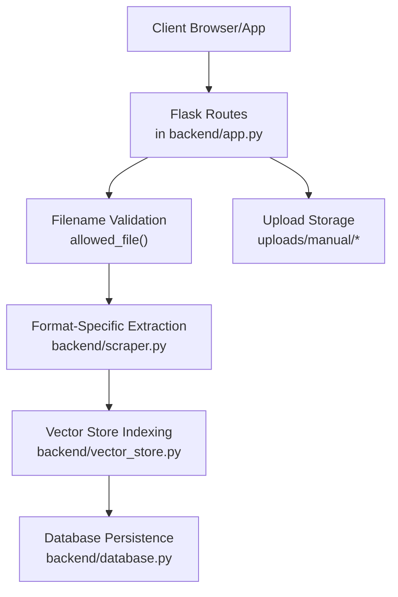
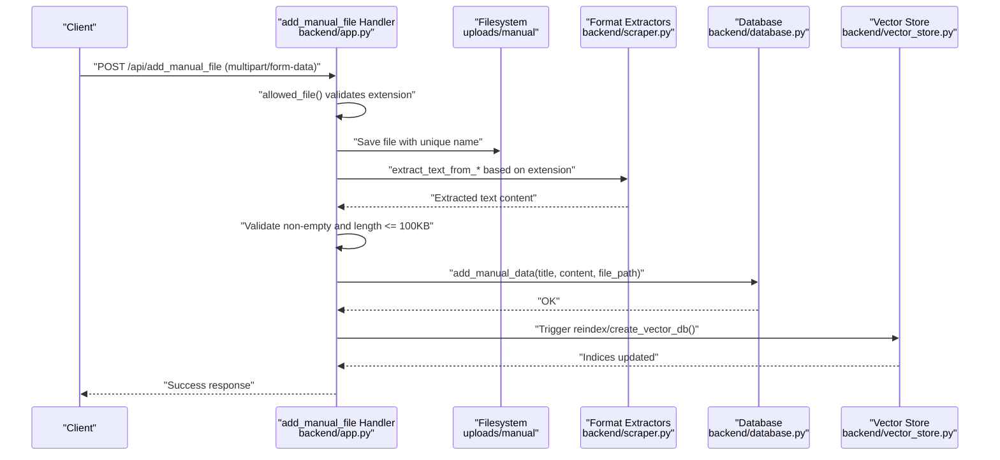
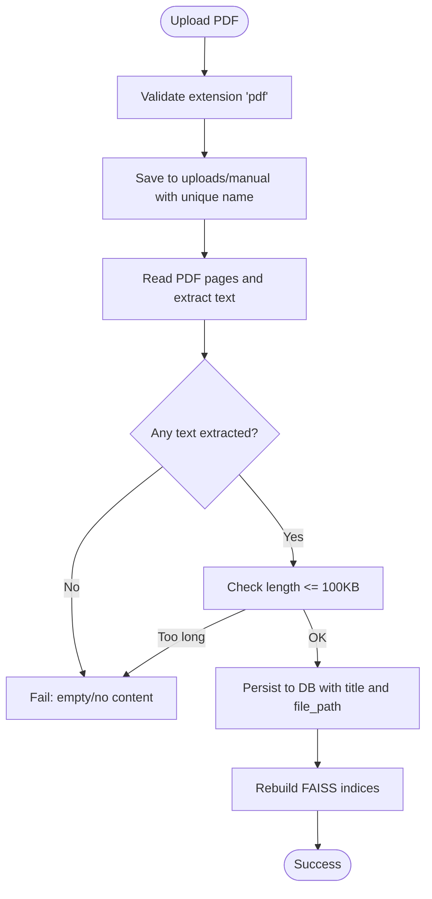
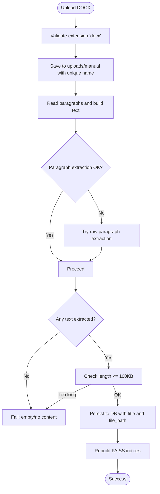
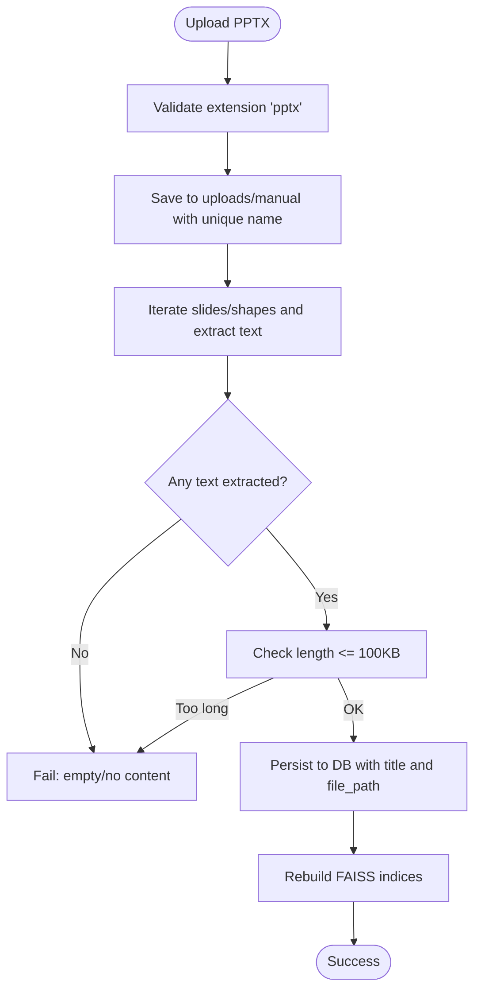
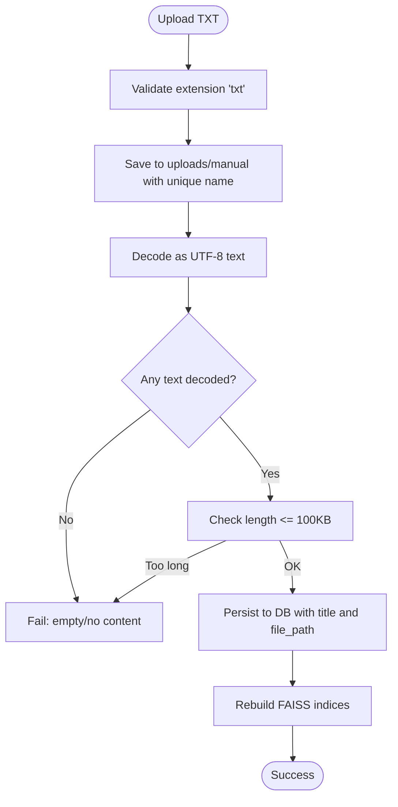
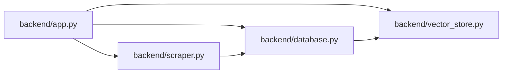

# Supported File Formats

<cite>
**Referenced Files in This Document**
- [backend/app.py](file://backend/app.py)
- [backend/scraper.py](file://backend/scraper.py)
- [backend/database.py](file://backend/database.py)
- [backend/vector_store.py](file://backend/vector_store.py)
</cite>

## Table of Contents
1. [Introduction](#introduction)
2. [Project Structure](#project-structure)
3. [Core Components](#core-components)
4. [Architecture Overview](#architecture-overview)
5. [Detailed Component Analysis](#detailed-component-analysis)
6. [Dependency Analysis](#dependency-analysis)
7. [Performance Considerations](#performance-considerations)
8. [Troubleshooting Guide](#troubleshooting-guide)
9. [Conclusion](#conclusion)

## Introduction
This document describes the supported file formats for the DamayAI Assistant system and explains how each is validated, processed, and indexed. The system supports uploading and processing the following formats:
- PDF (.pdf)
- DOCX (.docx)
- PPTX (.pptx)
- TXT (.txt)

It also documents technical requirements, size limits, validation criteria, and the end-to-end processing pipeline for each format, including content extraction, metadata handling, and quality checks. Format-specific considerations such as image handling in PDFs, table extraction from DOCX, and slide content processing for PPTX are included, along with examples of acceptable versus unacceptable files and troubleshooting guidance.

## Project Structure
The file format support is implemented in the backend service. Key components involved in file handling and processing include:
- Route handlers for manual file uploads and content extraction
- Content extraction helpers for PDF, DOCX, and PPTX
- Vector store creation and retrieval for indexing
- Database persistence for manual data

**Diagram sources**
- [backend/app.py:520-566](file://backend/app.py#L520-L566)
- [backend/scraper.py:33-66](file://backend/scraper.py#L33-L66)
- [backend/vector_store.py:48-70](file://backend/vector_store.py#L48-L70)
- [backend/database.py:61-104](file://backend/database.py#L61-L104)

**Section sources**
- [backend/app.py:86-88](file://backend/app.py#L86-L88)
- [backend/app.py:123-125](file://backend/app.py#L123-L125)
- [backend/app.py:369-370](file://backend/app.py#L369-L370)

## Core Components
- Allowed file extensions: The system accepts txt, pdf, docx, and pptx for manual file uploads.
- Maximum upload size: 16 MB enforced at the framework level.
- Text content length limit: 100 KB for extracted content and related fields.
- Filename validation: Extension-based whitelist with case-insensitive checks.
- Content extraction: Dedicated functions for PDF, DOCX, and PPTX; plain text decoding for TXT.
- Quality checks: Non-empty content validation and length checks before indexing.
- Metadata preservation: Titles and source identifiers are preserved when storing content.
- Vector indexing: Extracted content is split into chunks and indexed using FAISS for retrieval.

**Section sources**
- [backend/app.py:86-88](file://backend/app.py#L86-L88)
- [backend/app.py:123-125](file://backend/app.py#L123-L125)
- [backend/app.py:129-131](file://backend/app.py#L129-L131)
- [backend/app.py:369-370](file://backend/app.py#L369-L370)
- [backend/app.py:527-529](file://backend/app.py#L527-L529)
- [backend/app.py:544-552](file://backend/app.py#L544-L552)
- [backend/app.py:554-559](file://backend/app.py#L554-L559)
- [backend/database.py:61-104](file://backend/database.py#L61-L104)
- [backend/vector_store.py:36-46](file://backend/vector_store.py#L36-L46)

## Architecture Overview
The file upload and processing pipeline follows a consistent flow for all supported formats:
1. Client submits a file via the manual file upload endpoint.
2. The filename extension is validated against the allowed set.
3. The file is saved to disk under a unique name.
4. Content is extracted based on the file’s extension.
5. Extracted content is validated for emptiness and length.
6. The content is persisted to the database with metadata.
7. Vector indices are rebuilt to include the new content.

**Diagram sources**
- [backend/app.py:520-566](file://backend/app.py#L520-L566)
- [backend/scraper.py:33-66](file://backend/scraper.py#L33-L66)
- [backend/database.py:61-104](file://backend/database.py#L61-L104)
- [backend/vector_store.py:48-70](file://backend/vector_store.py#L48-L70)

## Detailed Component Analysis

### PDF (.pdf)
- Validation and upload
  - Allowed extension: pdf
  - Saved to uploads/manual with a timestamped unique filename
  - Size limit: 16 MB
- Content extraction
  - Uses a PDF reader to iterate pages and extract text
  - Returns concatenated text from all pages
- Quality checks
  - Empty or unreadable PDFs produce no content; upload fails with an error
  - Final extracted text length is validated against the 100 KB limit
- Metadata preservation
  - Title is derived from the filename if not provided
  - File path is stored for future reference
- Vector indexing
  - Extracted content is chunked and indexed via FAISS

**Diagram sources**
- [backend/app.py:527-552](file://backend/app.py#L527-L552)
- [backend/scraper.py:33-43](file://backend/scraper.py#L33-L43)
- [backend/database.py:61-104](file://backend/database.py#L61-L104)
- [backend/vector_store.py:36-46](file://backend/vector_store.py#L36-L46)

**Section sources**
- [backend/app.py:527-552](file://backend/app.py#L527-L552)
- [backend/scraper.py:33-43](file://backend/scraper.py#L33-L43)
- [backend/database.py:61-104](file://backend/database.py#L61-L104)
- [backend/vector_store.py:36-46](file://backend/vector_store.py#L36-L46)

### DOCX (.docx)
- Validation and upload
  - Allowed extension: docx
  - Saved to uploads/manual with a timestamped unique filename
  - Size limit: 16 MB
- Content extraction
  - Extracts paragraph text from the document
  - Includes a fallback method that reads raw paragraphs if structured extraction fails
- Quality checks
  - Fails if no content is extracted
  - Final extracted text length is validated against the 100 KB limit
- Metadata preservation
  - Title is derived from the filename if not provided
  - File path is stored for future reference
- Vector indexing
  - Extracted content is chunked and indexed via FAISS

**Diagram sources**
- [backend/app.py:527-552](file://backend/app.py#L527-L552)
- [backend/scraper.py:45-52](file://backend/scraper.py#L45-L52)
- [backend/database.py:61-104](file://backend/database.py#L61-L104)
- [backend/vector_store.py:36-46](file://backend/vector_store.py#L36-L46)

**Section sources**
- [backend/app.py:527-552](file://backend/app.py#L527-L552)
- [backend/scraper.py:45-52](file://backend/scraper.py#L45-L52)
- [backend/database.py:61-104](file://backend/database.py#L61-L104)
- [backend/vector_store.py:36-46](file://backend/vector_store.py#L36-L46)

### PPTX (.pptx)
- Validation and upload
  - Allowed extension: pptx
  - Saved to uploads/manual with a timestamped unique filename
  - Size limit: 16 MB
- Content extraction
  - Iterates through slides and shapes to collect text content
  - Concatenates all text found across slides and shapes
- Quality checks
  - Fails if no content is extracted
  - Final extracted text length is validated against the 100 KB limit
- Metadata preservation
  - Title is derived from the filename if not provided
  - File path is stored for future reference
- Vector indexing
  - Extracted content is chunked and indexed via FAISS

**Diagram sources**
- [backend/app.py:527-552](file://backend/app.py#L527-L552)
- [backend/scraper.py:54-66](file://backend/scraper.py#L54-L66)
- [backend/database.py:61-104](file://backend/database.py#L61-L104)
- [backend/vector_store.py:36-46](file://backend/vector_store.py#L36-L46)

**Section sources**
- [backend/app.py:527-552](file://backend/app.py#L527-L552)
- [backend/scraper.py:54-66](file://backend/scraper.py#L54-L66)
- [backend/database.py:61-104](file://backend/database.py#L61-L104)
- [backend/vector_store.py:36-46](file://backend/vector_store.py#L36-L46)

### TXT (.txt)
- Validation and upload
  - Allowed extension: txt
  - Saved to uploads/manual with a timestamped unique filename
  - Size limit: 16 MB
- Content extraction
  - Decodes file content as UTF-8 text
- Quality checks
  - Fails if decoded content is empty
  - Final extracted text length is validated against the 100 KB limit
- Metadata preservation
  - Title is derived from the filename if not provided
  - File path is stored for future reference
- Vector indexing
  - Extracted content is chunked and indexed via FAISS

**Diagram sources**
- [backend/app.py:527-552](file://backend/app.py#L527-L552)
- [backend/database.py:61-104](file://backend/database.py#L61-L104)
- [backend/vector_store.py:36-46](file://backend/vector_store.py#L36-L46)

**Section sources**
- [backend/app.py:527-552](file://backend/app.py#L527-L552)
- [backend/database.py:61-104](file://backend/database.py#L61-L104)
- [backend/vector_store.py:36-46](file://backend/vector_store.py#L36-L46)

## Dependency Analysis
The file processing pipeline depends on several modules working together:
- backend/app.py: Defines allowed extensions, upload size limits, filename validation, and routes for manual file uploads and content extraction.
- backend/scraper.py: Provides format-specific extraction functions for PDF, DOCX, and PPTX.
- backend/database.py: Persists extracted content with metadata and provides document sets for indexing.
- backend/vector_store.py: Creates and manages FAISS vector indices for memory bank, manual data, and scraped data.

**Diagram sources**
- [backend/app.py:520-566](file://backend/app.py#L520-L566)
- [backend/scraper.py:33-66](file://backend/scraper.py#L33-L66)
- [backend/database.py:61-104](file://backend/database.py#L61-L104)
- [backend/vector_store.py:48-70](file://backend/vector_store.py#L48-L70)

**Section sources**
- [backend/app.py:520-566](file://backend/app.py#L520-L566)
- [backend/scraper.py:33-66](file://backend/scraper.py#L33-L66)
- [backend/database.py:61-104](file://backend/database.py#L61-L104)
- [backend/vector_store.py:48-70](file://backend/vector_store.py#L48-L70)

## Performance Considerations
- Chunk size and overlap: Documents are split into 1000-character chunks with 100-character overlap to balance recall and performance.
- Index caching: Retrievers are cached at module level to avoid reloading FAISS indices on every request.
- Rate limiting: Upload and admin endpoints are rate-limited to reduce load spikes.
- Size limits: 16 MB upload limit and 100 KB text content cap help control resource usage.

**Section sources**
- [backend/vector_store.py:36-46](file://backend/vector_store.py#L36-L46)
- [backend/vector_store.py:73-115](file://backend/vector_store.py#L73-L115)
- [backend/app.py:86-88](file://backend/app.py#L86-L88)
- [backend/app.py:129-131](file://backend/app.py#L129-L131)

## Troubleshooting Guide
- File rejected due to invalid extension
  - Cause: File extension not in the allowed set (txt, pdf, docx, pptx)
  - Resolution: Rename the file with a supported extension and retry
  - Reference: [backend/app.py:527-529](file://backend/app.py#L527-L529), [backend/app.py:369-370](file://backend/app.py#L369-L370)
- File too large
  - Cause: Upload exceeds 16 MB limit
  - Resolution: Compress or split the file; ensure total size is within the limit
  - Reference: [backend/app.py:86-88](file://backend/app.py#L86-L88), [backend/app.py:316-318](file://backend/app.py#L316-L318)
- Empty or unreadable content
  - Cause: Extraction returned no text (e.g., blank PDF, protected DOCX/PPTX)
  - Resolution: Verify the file is not password-protected, contains readable text, and is not corrupted
  - Reference: [backend/app.py:554-555](file://backend/app.py#L554-L555), [backend/scraper.py:33-43](file://backend/scraper.py#L33-L43), [backend/scraper.py:45-52](file://backend/scraper.py#L45-L52), [backend/scraper.py:54-66](file://backend/scraper.py#L54-L66)
- Content exceeds length limit
  - Cause: Extracted text exceeds 100 KB
  - Resolution: Shorten the content or split into multiple files
  - Reference: [backend/app.py:557-559](file://backend/app.py#L557-L559)
- PDFs with images or scanned pages
  - Behavior: Text extraction relies on embedded text; images and scanned pages may not yield text
  - Recommendation: Ensure PDFs are searchable (not pure images) for best results
  - Reference: [backend/scraper.py:33-43](file://backend/scraper.py#L33-L43)
- DOCX tables
  - Behavior: Paragraph extraction captures text; table content is not converted to Markdown in the current implementation
  - Recommendation: For tabular data, export to CSV or use spreadsheet tools and upload TXT/CSV formats
  - Reference: [backend/scraper.py:45-52](file://backend/scraper.py#L45-L52)
- PPTX slides
  - Behavior: Shape text is collected; images and non-text elements are not extracted
  - Recommendation: Include textual content directly in slides for best coverage
  - Reference: [backend/scraper.py:54-66](file://backend/scraper.py#L54-L66)

## Conclusion
The DamayAI Assistant system supports uploading and processing PDF, DOCX, PPTX, and TXT files with strict validation and quality controls. Each format follows a consistent pipeline: validation, safe saving, extraction, quality checks, persistence, and indexing. Administrators can manage content via the admin endpoints, and the system enforces practical limits to maintain performance and reliability. For best results, ensure files are unencrypted, contain readable text, and meet the size and length constraints.