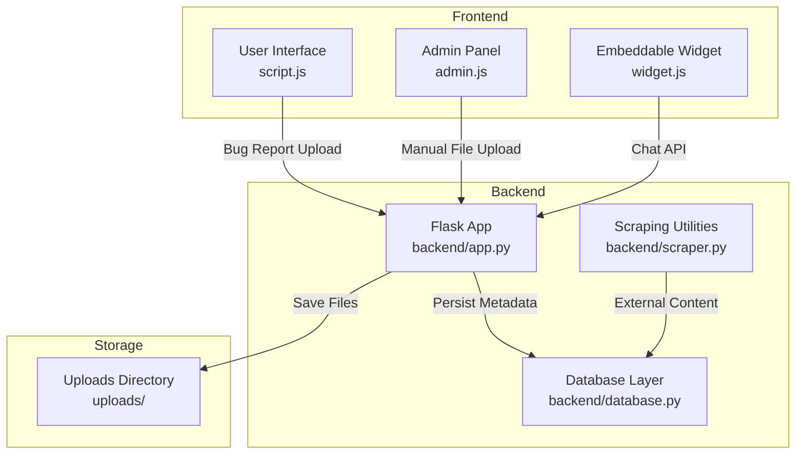
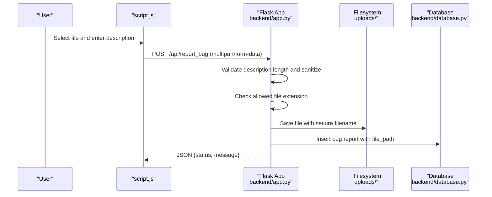
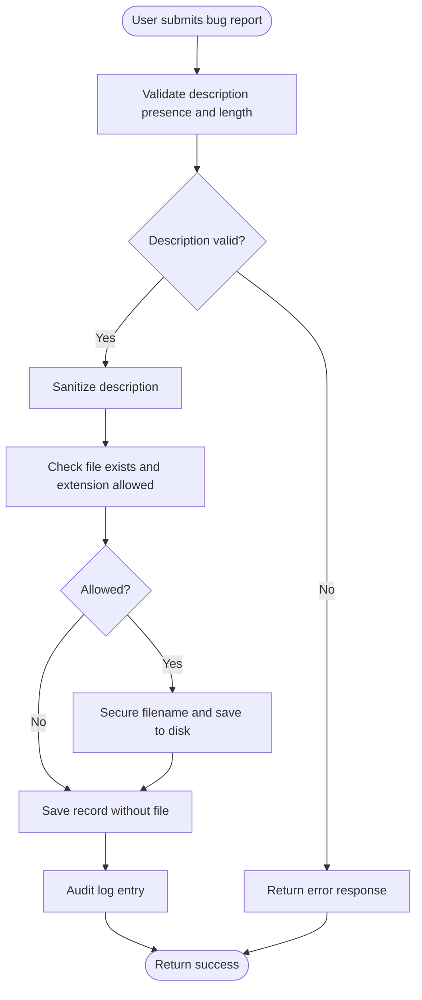
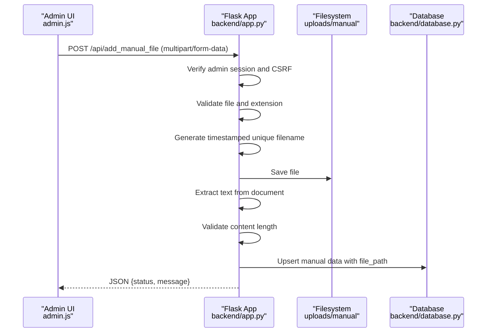
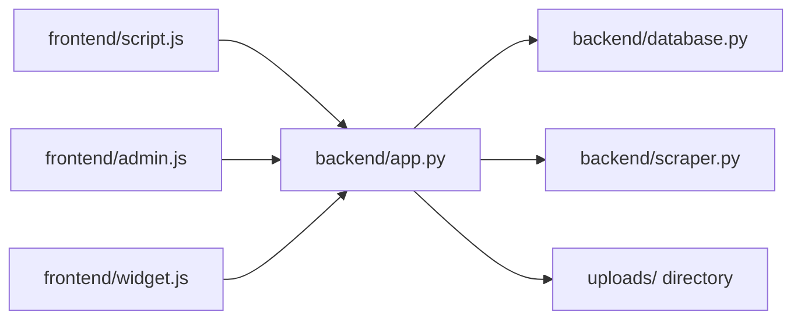

# Upload Workflow and Validation

<cite>
**Referenced Files in This Document**
- [backend/app.py](file://backend/app.py)
- [backend/database.py](file://backend/database.py)
- [backend/scraper.py](file://backend/scraper.py)
- [frontend/script.js](file://frontend/script.js)
- [frontend/admin.js](file://frontend/admin.js)
- [frontend/widget.js](file://frontend/widget.js)
</cite>

## Table of Contents
1. [Introduction](#introduction)
2. [Project Structure](#project-structure)
3. [Core Components](#core-components)
4. [Architecture Overview](#architecture-overview)
5. [Detailed Component Analysis](#detailed-component-analysis)
6. [Dependency Analysis](#dependency-analysis)
7. [Performance Considerations](#performance-considerations)
8. [Troubleshooting Guide](#troubleshooting-guide)
9. [Conclusion](#conclusion)

## Introduction
This document explains the complete file upload workflow and validation processes implemented in the system. It covers the end-to-end pipeline from initial file selection through successful processing, including client-side and server-side validations, rate limiting, security measures, progress feedback mechanisms, error handling, duplicate detection, file naming conventions, storage optimization, and cleanup procedures for failed uploads. It also provides troubleshooting guidance for common upload issues, browser compatibility considerations, and performance optimization tips.

## Project Structure
The upload workflow spans three main areas:
- Frontend: User interface and client-side interactions for selecting and submitting files
- Backend: Server-side endpoints, validations, storage, and database persistence
- Database: Indexing and uniqueness constraints for preventing duplicates

**Diagram sources**
- [backend/app.py](file://backend/app.py)
- [backend/database.py](file://backend/database.py)
- [backend/scraper.py](file://backend/scraper.py)
- [frontend/script.js](file://frontend/script.js)
- [frontend/admin.js](file://frontend/admin.js)
- [frontend/widget.js](file://frontend/widget.js)

**Section sources**
- [backend/app.py](file://backend/app.py)
- [backend/database.py](file://backend/database.py)
- [frontend/script.js](file://frontend/script.js)
- [frontend/admin.js](file://frontend/admin.js)
- [frontend/widget.js](file://frontend/widget.js)

## Core Components
- Upload endpoints:
  - Bug report upload endpoint for attaching screenshots or videos to bug reports
  - Admin-only manual file upload endpoint for ingesting PDF, DOCX, PPTX, and TXT files
- Validation rules:
  - Size limits enforced by Flask’s maximum content length
  - Allowed file extensions per endpoint
  - Input length limits for descriptions and extracted content
  - CSRF protection and admin authentication for protected endpoints
- Storage and naming:
  - Secure filename generation and directory separation by category
  - Timestamp-based unique filenames for manual uploads
- Persistence:
  - MongoDB collections for bug reports and manual data with indexing and uniqueness constraints
- Security:
  - Rate limiting, CSRF tokens, admin session checks, and safe URL validation for external content
- Feedback and error handling:
  - JSON responses with status and messages
  - Global error handlers for common HTTP errors

**Section sources**
- [backend/app.py](file://backend/app.py)
- [backend/database.py](file://backend/database.py)

## Architecture Overview
The upload pipeline integrates client-side form submission with server-side validation and persistence. The following sequence diagram maps the bug report upload flow:

**Diagram sources**
- [frontend/script.js](file://frontend/script.js)
- [backend/app.py](file://backend/app.py)
- [backend/database.py](file://backend/database.py)

**Section sources**
- [frontend/script.js](file://frontend/script.js)
- [backend/app.py](file://backend/app.py)
- [backend/database.py](file://backend/database.py)

## Detailed Component Analysis

### Bug Report Upload Workflow
- Client-side:
  - The user opens a bug report modal and selects an optional file
  - The frontend constructs a FormData object and posts to the bug report endpoint
  - The UI disables the submit button and displays a success or error message upon response
- Server-side:
  - Validates presence and length of the description
  - Sanitizes the description to remove HTML tags
  - Checks file extension against allowed bug file types
  - Saves the file under a dedicated uploads directory with a secure filename
  - Persists the bug report record with status and timestamp
  - Returns a JSON response indicating success or failure

**Diagram sources**
- [frontend/script.js](file://frontend/script.js)
- [backend/app.py](file://backend/app.py)
- [backend/database.py](file://backend/database.py)

**Section sources**
- [frontend/script.js](file://frontend/script.js)
- [backend/app.py](file://backend/app.py)
- [backend/database.py](file://backend/database.py)

### Manual File Upload Workflow (Admin)
- Client-side:
  - Admin panel allows uploading files via a form
  - The UI sends multipart/form-data with CSRF protection
- Server-side:
  - Requires admin session and valid CSRF token
  - Validates file presence and allowed extension
  - Generates a timestamp-prefixed unique filename to avoid collisions
  - Extracts text from supported document formats
  - Validates extracted content length
  - Persists the document with metadata and file path
  - Returns success or error response

**Diagram sources**
- [frontend/admin.js](file://frontend/admin.js)
- [backend/app.py](file://backend/app.py)
- [backend/database.py](file://backend/database.py)

**Section sources**
- [frontend/admin.js](file://frontend/admin.js)
- [backend/app.py](file://backend/app.py)
- [backend/database.py](file://backend/database.py)

### Validation Rules and Security Measures
- Size limits:
  - Flask’s maximum content length is set to enforce a 16 MB cap for incoming requests
  - Global error handler returns a user-friendly message for oversized payloads
- Format restrictions:
  - Bug report uploads accept media formats suitable for bug reproduction
  - Manual file uploads accept PDF, DOCX, PPTX, and TXT
  - Helper functions validate extensions against predefined sets
- Input sanitization and length limits:
  - Descriptions and extracted content are validated for maximum lengths
  - Descriptions are sanitized to strip HTML tags
- CSRF and authentication:
  - Admin endpoints require a valid admin session and CSRF token
  - CSRF token is generated per session and validated on state-changing requests
- Rate limiting:
  - Endpoints are rate-limited to prevent abuse
- External content safety:
  - URL validation and SSRF protections are applied when scraping external content

**Section sources**
- [backend/app.py](file://backend/app.py)
- [backend/scraper.py](file://backend/scraper.py)

### Progress Tracking and User Feedback
- Bug report upload:
  - The UI disables the submit button and shows a success or error alert after receiving the response
- Admin manual file upload:
  - The UI sends the request and displays a success or error alert based on the response
- General feedback:
  - JSON responses include a status and message for user-friendly communication
  - Global error handlers provide consistent messaging for common failures

**Section sources**
- [frontend/script.js](file://frontend/script.js)
- [frontend/admin.js](file://frontend/admin.js)
- [backend/app.py](file://backend/app.py)

### Error Handling for Failed Submissions
- Size exceeded:
  - Flask raises a 413 error; a global handler returns a localized message
- Too many requests:
  - A 429 response is handled with a throttled message
- Internal server errors:
  - A 500 response is handled with a generic internal error message
- Endpoint-specific validation errors:
  - Missing description, invalid file, or content extraction failures return explicit messages

**Section sources**
- [backend/app.py](file://backend/app.py)

### Duplicate Detection and Naming Conventions
- Duplicate prevention:
  - MongoDB indexes enforce uniqueness for key fields:
    - Scraped data URL
    - Manual data source_name
    - Memory bank question
  - Upsert semantics are used to replace existing records when duplicates are detected
- File naming:
  - Secure filenames are generated to avoid path traversal and OS-specific issues
  - Manual uploads use a timestamp-prefixed unique filename to prevent collisions
- Storage organization:
  - Dedicated directories separate bug attachments and manual uploads

**Section sources**
- [backend/database.py](file://backend/database.py)
- [backend/app.py](file://backend/app.py)

### Cleanup Procedures for Failed Uploads
- Automatic cleanup:
  - On successful manual file ingestion, the system persists metadata and file path
  - No explicit cleanup routine is implemented for failed uploads; files remain on disk
- Recommendations:
  - Periodic cleanup jobs can be added to remove orphaned or temporary files
  - Implement a retention policy for old bug report attachments

**Section sources**
- [backend/app.py](file://backend/app.py)
- [backend/database.py](file://backend/database.py)

### Client-Side Validation and Server-Side Verification
- Client-side:
  - FormData construction ensures proper multipart encoding
  - UI disables controls during submission to prevent duplicate submissions
- Server-side:
  - Strict validation of description presence and length
  - Extension checks against allowed sets
  - Safe filename handling and directory creation
  - Content extraction and length validation for documents

**Section sources**
- [frontend/script.js](file://frontend/script.js)
- [frontend/admin.js](file://frontend/admin.js)
- [backend/app.py](file://backend/app.py)

## Dependency Analysis
The upload workflow depends on several modules and libraries:
- Flask for routing, request handling, and error management
- Werkzeug for secure filename handling and multipart parsing
- Bleach for HTML sanitization
- PyPDF2, python-docx, and pptx for content extraction
- MongoDB for persistence and indexing

**Diagram sources**
- [frontend/script.js](file://frontend/script.js)
- [frontend/admin.js](file://frontend/admin.js)
- [frontend/widget.js](file://frontend/widget.js)
- [backend/app.py](file://backend/app.py)
- [backend/database.py](file://backend/database.py)
- [backend/scraper.py](file://backend/scraper.py)

**Section sources**
- [backend/app.py](file://backend/app.py)
- [backend/database.py](file://backend/database.py)
- [backend/scraper.py](file://backend/scraper.py)
- [frontend/script.js](file://frontend/script.js)
- [frontend/admin.js](file://frontend/admin.js)
- [frontend/widget.js](file://frontend/widget.js)

## Performance Considerations
- Limit payload sizes to reduce memory pressure and I/O overhead
- Use streaming for large content when feasible
- Offload heavy processing (e.g., OCR or video transcoding) to background tasks
- Cache frequently accessed metadata to minimize database round trips
- Monitor rate-limit thresholds to balance user experience and system stability

## Troubleshooting Guide
- File too large:
  - Symptom: 413 error with a localized message
  - Resolution: Reduce file size or split content
- Invalid file type:
  - Symptom: Error indicating file not provided or invalid
  - Resolution: Ensure the file extension is allowed for the selected endpoint
- Description too long:
  - Symptom: Validation error for description length
  - Resolution: Shorten the description to meet the maximum character limit
- Extraction failure:
  - Symptom: Error indicating failed text extraction or empty content
  - Resolution: Verify the document format and content; re-save if corrupted
- CSRF or unauthorized:
  - Symptom: 403 error or login prompt
  - Resolution: Refresh CSRF token and ensure admin session is active
- Network or scraping issues:
  - Symptom: External content scraping errors
  - Resolution: Confirm URL safety and network connectivity

**Section sources**
- [backend/app.py](file://backend/app.py)
- [backend/scraper.py](file://backend/scraper.py)

## Conclusion
The upload workflow combines robust client-side interactions with strict server-side validations, secure storage practices, and persistence with deduplication safeguards. By enforcing size limits, validating formats, sanitizing inputs, and leveraging MongoDB indexing, the system ensures reliable and secure file ingestion. Extending the workflow with background processing, cleanup routines, and enhanced progress indicators would further improve reliability and user experience.