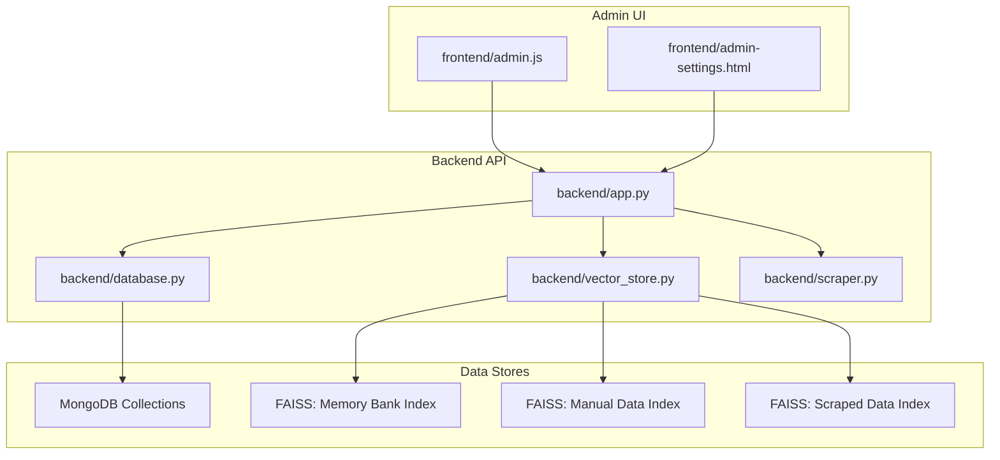
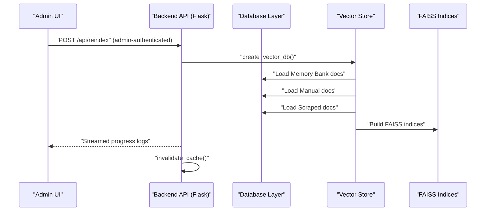
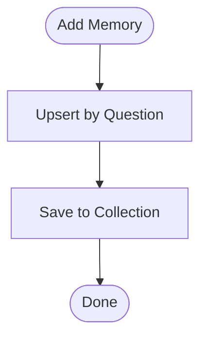
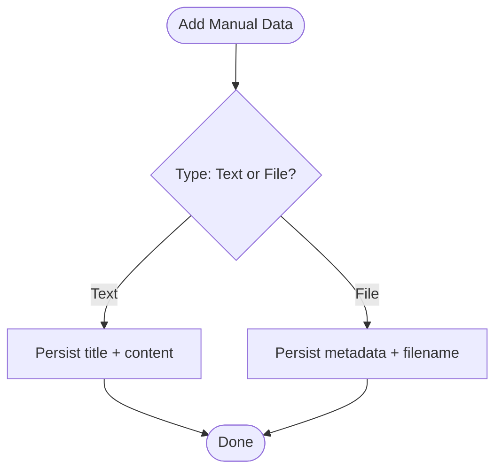
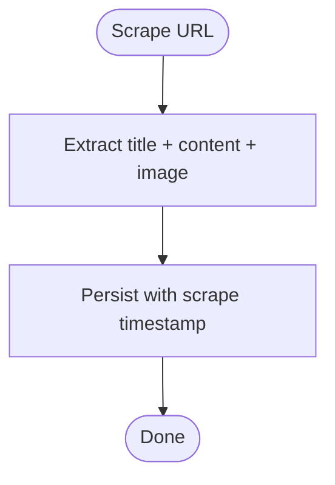
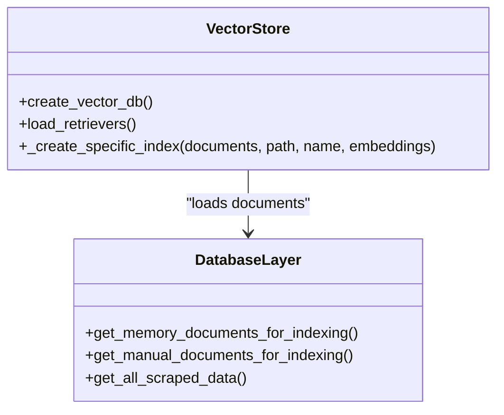
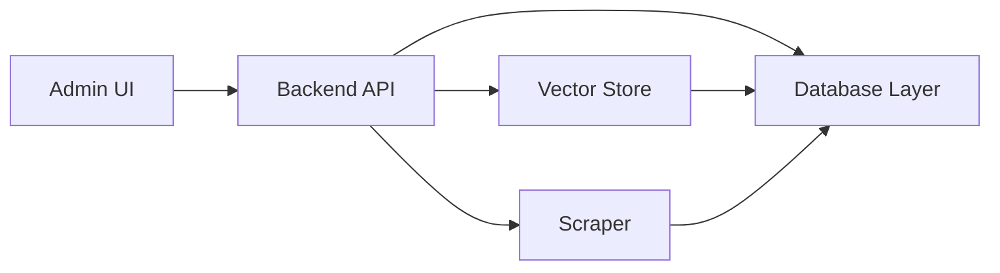

# Knowledge Base Management

<cite>
**Referenced Files in This Document**
- [backend/app.py](file://backend/app.py)
- [backend/database.py](file://backend/database.py)
- [backend/vector_store.py](file://backend/vector_store.py)
- [backend/scraper.py](file://backend/scraper.py)
- [generate_api_excel.py](file://generate_api_excel.py)
- [frontend/admin.js](file://frontend/admin.js)
- [frontend/admin-settings.html](file://frontend/admin-settings.html)
</cite>

## Table of Contents
1. [Introduction](#introduction)
2. [Project Structure](#project-structure)
3. [Core Components](#core-components)
4. [Architecture Overview](#architecture-overview)
5. [Detailed Component Analysis](#detailed-component-analysis)
6. [Dependency Analysis](#dependency-analysis)
7. [Performance Considerations](#performance-considerations)
8. [Troubleshooting Guide](#troubleshooting-guide)
9. [Conclusion](#conclusion)

## Introduction
This document describes the knowledge base management system that supports three distinct content types:
- Memory Bank: Predefined Q&A entries maintained by administrators
- Manual Data: User-generated content (text and files) uploaded via admin interface
- Scraped Data: Automatically collected web content processed by the scraper module

It covers CRUD operations, validation rules, duplicate prevention, indexing, moderation, scheduling, and versioning strategies. It also documents the REST API surface and administrative controls.

## Project Structure
The knowledge base spans backend services, vector indexing, and admin UI components:
- Backend API and admin routes
- Database access layer for the three knowledge base types
- Vector store creation and retrieval
- Web scraping pipeline
- Admin UI for managing content and triggering maintenance tasks

**Diagram sources**
- [backend/app.py](file://backend/app.py)
- [backend/database.py](file://backend/database.py)
- [backend/vector_store.py](file://backend/vector_store.py)
- [backend/scraper.py](file://backend/scraper.py)
- [frontend/admin.js](file://frontend/admin.js)
- [frontend/admin-settings.html](file://frontend/admin-settings.html)

**Section sources**
- [backend/app.py](file://backend/app.py)
- [backend/database.py](file://backend/database.py)
- [backend/vector_store.py](file://backend/vector_store.py)
- [backend/scraper.py](file://backend/scraper.py)
- [frontend/admin.js](file://frontend/admin.js)
- [frontend/admin-settings.html](file://frontend/admin-settings.html)

## Core Components
- Memory Bank CRUD: Add, list, update, delete predefined Q&A entries
- Manual Data CRUD: Add text and file-based content with metadata
- Scraped Data CRUD: Add and manage auto-collected content
- Vector Indexing: Separate FAISS indices per knowledge base type
- Admin Controls: Rebuild indices, flush FAISS, reset database
- Validation and Moderation: Content length limits, admin authentication, audit logging

**Section sources**
- [backend/database.py](file://backend/database.py)
- [backend/vector_store.py](file://backend/vector_store.py)
- [backend/app.py](file://backend/app.py)
- [generate_api_excel.py](file://generate_api_excel.py)

## Architecture Overview
The system integrates admin UI actions with backend endpoints, database persistence, and vector indexing. Administrative actions trigger reindexing and cache invalidation to keep search results fresh.

**Diagram sources**
- [backend/app.py](file://backend/app.py)
- [backend/vector_store.py](file://backend/vector_store.py)
- [backend/database.py](file://backend/database.py)

## Detailed Component Analysis

### Memory Bank Management
Memory Bank stores predefined Q&A pairs. Operations include:
- Add: Upserts by question to prevent duplicates
- List: Returns all entries ordered by save timestamp
- Update: By ObjectId
- Delete: By ObjectId

Validation and integrity:
- Duplicate prevention: Upsert on question field
- ObjectId validation in admin handler
- Audit logging on updates/deletes

**Diagram sources**
- [backend/database.py](file://backend/database.py)

**Section sources**
- [backend/database.py](file://backend/database.py)
- [backend/app.py](file://backend/app.py)

### Manual Data Management
Manual Data supports text and file uploads. Operations include:
- Add text: Persist title and content
- Add file: Persist structured metadata (source name, upload timestamp)
- List: Retrieve all records
- Update/Delete: By ObjectId with validation

Validation and integrity:
- Content length checks in admin handler
- ObjectId validation
- Metadata includes source name and timestamps

**Diagram sources**
- [backend/database.py](file://backend/database.py)
- [backend/app.py](file://backend/app.py)

**Section sources**
- [backend/database.py](file://backend/database.py)
- [backend/app.py](file://backend/app.py)

### Scraped Data Management
Scraped Data is auto-collected content with URL, title, content, and optional image. Operations include:
- Add: Persist URL, title, content, image URL, scrape timestamp
- List: Retrieve all records
- Update/Delete: By ObjectId with validation

Validation and integrity:
- ObjectId validation
- Audit logging on updates/deletes

**Diagram sources**
- [backend/database.py](file://backend/database.py)
- [backend/scraper.py](file://backend/scraper.py)

**Section sources**
- [backend/database.py](file://backend/database.py)
- [backend/scraper.py](file://backend/scraper.py)

### Vector Indexing and Retrieval
Indexing strategy:
- Three separate FAISS indices: Memory Bank, Manual Data, Scraped Data
- Documents are chunked and embedded using a sentence-transformers model
- On startup, missing indices are rebuilt automatically
- Admin-triggered reindex endpoint rebuilds all indices and invalidates caches

Retrieval strategy:
- Cached retrievers per index type
- Configurable top-k retrieval

**Diagram sources**
- [backend/vector_store.py](file://backend/vector_store.py)
- [backend/database.py](file://backend/database.py)

**Section sources**
- [backend/vector_store.py](file://backend/vector_store.py)
- [backend/database.py](file://backend/database.py)
- [backend/app.py](file://backend/app.py)

### Admin API and Workflows
Key endpoints:
- GET /api/get-data: Aggregated list across all types with timestamps
- PUT /api/data/<type>/<id>: Update content by type and ObjectId
- DELETE /api/data/<type>/<id>: Delete content by type and ObjectId
- POST /api/reindex: Admin-triggered rebuild of FAISS indices

Security and validation:
- Admin authentication decorator
- CSRF protection decorator
- ObjectId validation
- Content length limits enforced for updates
- Audit logging for sensitive operations

Bulk operations:
- Admin dashboard aggregates all items for unified management
- Reindex operation acts as a bulk refresh of all indices

Content scheduling:
- No explicit scheduling endpoints observed in the codebase

Version control:
- No explicit versioning mechanism observed in the codebase

**Section sources**
- [backend/app.py](file://backend/app.py)
- [generate_api_excel.py](file://generate_api_excel.py)

### Content Categorization and Metadata
- Memory Bank: Indexed with type label and question as title
- Manual Data: Indexed with source name and title
- Scraped Data: Indexed with URL and title
- Unified listing endpoint normalizes fields for UI consumption

**Section sources**
- [backend/database.py](file://backend/database.py)
- [backend/app.py](file://backend/app.py)

### Moderation and Quality Assurance
Moderation workflow:
- Admin authentication required for all write operations
- Audit logs record update/delete actions
- Content length limits act as a basic quality gate for text updates

Quality assurance:
- Auto-reindex on startup if indices are missing
- Admin-triggered reindex endpoint for manual refresh
- Frontend settings expose dangerous actions (flush FAISS, reset DB) with warnings

**Section sources**
- [backend/app.py](file://backend/app.py)
- [frontend/admin-settings.html](file://frontend/admin-settings.html)

## Dependency Analysis
The system exhibits clear separation of concerns:
- Admin UI depends on backend API endpoints
- Backend API depends on database layer and vector store
- Vector store depends on database layer for document loading
- Scraper module supplies data for Scraped Data collection

**Diagram sources**
- [backend/app.py](file://backend/app.py)
- [backend/database.py](file://backend/database.py)
- [backend/vector_store.py](file://backend/vector_store.py)
- [backend/scraper.py](file://backend/scraper.py)
- [frontend/admin.js](file://frontend/admin.js)

**Section sources**
- [backend/app.py](file://backend/app.py)
- [backend/database.py](file://backend/database.py)
- [backend/vector_store.py](file://backend/vector_store.py)
- [backend/scraper.py](file://backend/scraper.py)
- [frontend/admin.js](file://frontend/admin.js)

## Performance Considerations
- Chunking and embedding: Documents are split into overlapping chunks before embedding to improve retrieval granularity
- Caching: Retriever instances are cached after loading FAISS indices to avoid repeated deserialization overhead
- Startup resilience: Missing indices are rebuilt automatically at startup to maintain service availability
- Rate limiting: Reindex endpoint is rate-limited to prevent abuse

[No sources needed since this section provides general guidance]

## Troubleshooting Guide
Common issues and resolutions:
- Missing FAISS indices: Trigger POST /api/reindex to rebuild; the system can auto-reindex on startup if configured
- Unauthorized access: Ensure admin session is established; endpoints require admin authentication
- Invalid ObjectId: Verify the ID format when performing updates/deletes
- Content too long: Respect the content length limit enforced during updates
- Index load failures: Check logs for FAISS load exceptions; flush FAISS and reindex if necessary

**Section sources**
- [backend/app.py](file://backend/app.py)
- [backend/vector_store.py](file://backend/vector_store.py)
- [frontend/admin-settings.html](file://frontend/admin-settings.html)

## Conclusion
The knowledge base management system provides a robust foundation for storing, organizing, and retrieving three distinct content types. It enforces admin-controlled moderation, maintains separate vector indices for fast retrieval, and offers administrative controls for rebuilding and clearing indices. While explicit scheduling and version control are not present, the system’s modular design allows for future enhancements in those areas.