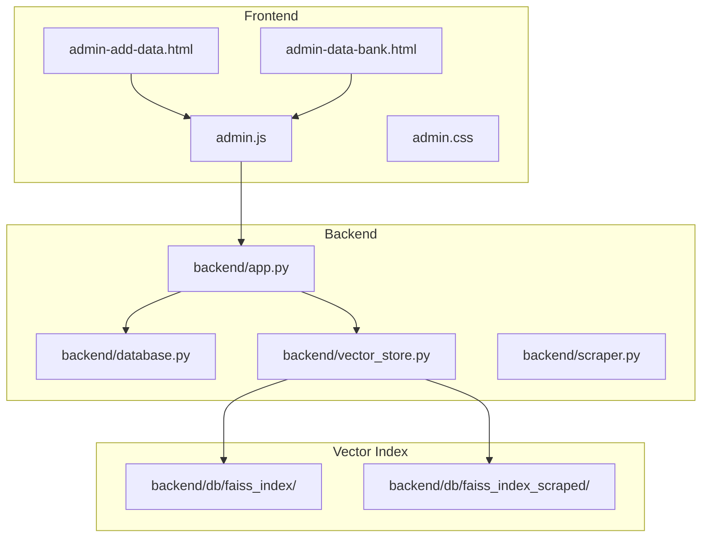
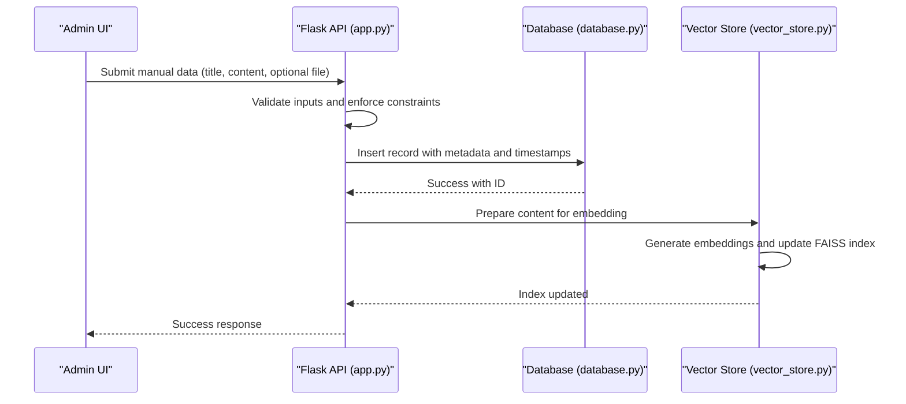
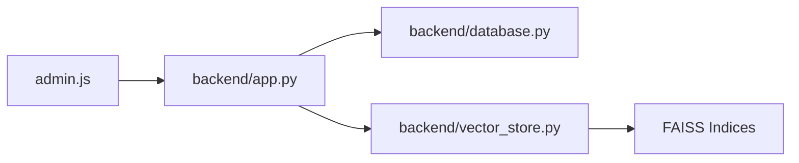

# Manual Data Management

<cite>
**Referenced Files in This Document**
- [backend/app.py](file://backend/app.py)
- [backend/database.py](file://backend/database.py)
- [backend/vector_store.py](file://backend/vector_store.py)
- [frontend/admin-add-data.html](file://frontend/admin-add-data.html)
- [frontend/admin.js](file://frontend/admin.js)
- [frontend/admin-data-bank.html](file://frontend/admin-data-bank.html)
- [frontend/admin.css](file://frontend/admin.css)
- [backend/scraper.py](file://backend/scraper.py)
- [backend/db/faiss_index/index.html](file://backend/db/faiss_index/index.html)
- [backend/db/faiss_index_scraped/index.html](file://backend/db/faiss_index_scraped/index.html)
</cite>

## Table of Contents
1. [Introduction](#introduction)
2. [Project Structure](#project-structure)
3. [Core Components](#core-components)
4. [Architecture Overview](#architecture-overview)
5. [Detailed Component Analysis](#detailed-component-analysis)
6. [Dependency Analysis](#dependency-analysis)
7. [Performance Considerations](#performance-considerations)
8. [Troubleshooting Guide](#troubleshooting-guide)
9. [Conclusion](#conclusion)
10. [Appendices](#appendices)

## Introduction
This document describes the Manual Data Management functionality that enables administrators to add custom information sources into the system. It covers the end-to-end workflow from user input through validation, persistence, processing, and integration with the vector search index. It also documents metadata structure, source tracking, categorization, moderation considerations, and best practices for building an organized knowledge repository.

## Project Structure
The Manual Data Management feature spans the frontend admin interface and the backend API and storage layers:
- Frontend: HTML pages and JavaScript for adding and viewing manual data entries
- Backend: Flask routes for CRUD operations, database schema and helpers, and vector store integration
- Vector Index: FAISS index directories for persisted embeddings

**Diagram sources**
- [frontend/admin-add-data.html](file://frontend/admin-add-data.html)
- [frontend/admin.js](file://frontend/admin.js)
- [frontend/admin-data-bank.html](file://frontend/admin-data-bank.html)
- [backend/app.py](file://backend/app.py)
- [backend/database.py](file://backend/database.py)
- [backend/vector_store.py](file://backend/vector_store.py)
- [backend/db/faiss_index/index.html](file://backend/db/faiss_index/index.html)
- [backend/db/faiss_index_scraped/index.html](file://backend/db/faiss_index_scraped/index.html)

**Section sources**
- [frontend/admin-add-data.html](file://frontend/admin-add-data.html)
- [frontend/admin.js](file://frontend/admin.js)
- [backend/app.py](file://backend/app.py)
- [backend/database.py](file://backend/database.py)
- [backend/vector_store.py](file://backend/vector_store.py)

## Core Components
- Admin Add Data Page: Provides a form for administrators to submit new manual data entries with optional file attachments.
- Admin Data Bank Page: Lists existing manual data entries for review and management.
- Backend API: Exposes endpoints for creating, reading, updating, and deleting manual data entries; handles validation and persistence.
- Database Layer: Manages schema, constraints (e.g., source_name uniqueness), and CRUD operations.
- Vector Store: Processes content into embeddings and manages FAISS indices for vector search.
- Vector Index: Stores FAISS index files for fast similarity search.

Key responsibilities:
- Enforce uniqueness of source_name during creation/update
- Validate title and content presence and length
- Accept file attachments and store them securely
- Automatically generate timestamps for auditability
- Prepare processed content for vector indexing
- Track metadata (source_name, title, content, file info, timestamps)
- Support moderation workflows via status fields and admin controls
- Enable bulk operations (creation, deletion) through batch endpoints

**Section sources**
- [frontend/admin-add-data.html](file://frontend/admin-add-data.html)
- [frontend/admin-data-bank.html](file://frontend/admin-data-bank.html)
- [backend/app.py](file://backend/app.py)
- [backend/database.py](file://backend/database.py)
- [backend/vector_store.py](file://backend/vector_store.py)

## Architecture Overview
The system follows a layered architecture:
- Presentation: Admin web pages render forms and lists
- Application: Flask routes orchestrate requests, enforce validation, and coordinate persistence
- Persistence: SQL-like schema stores metadata and constraints
- Processing: Vector store converts content into embeddings and updates FAISS indices
- Indexing: FAISS persists embeddings for efficient retrieval

**Diagram sources**
- [backend/app.py](file://backend/app.py)
- [backend/database.py](file://backend/database.py)
- [backend/vector_store.py](file://backend/vector_store.py)

## Detailed Component Analysis

### Admin Add Data Page
- Purpose: Allow administrators to add new manual data entries with title, content, and optional file upload.
- Features:
  - Form validation feedback
  - File selection and preview
  - Submission to backend API
- Integration: Uses JavaScript to handle form submission and file upload.

**Section sources**
- [frontend/admin-add-data.html](file://frontend/admin-add-data.html)
- [frontend/admin.js](file://frontend/admin.js)

### Admin Data Bank Page
- Purpose: Display existing manual data entries for browsing and administrative actions.
- Features:
  - List view with metadata
  - Action buttons for edit/delete
  - Integration with backend CRUD endpoints

**Section sources**
- [frontend/admin-data-bank.html](file://frontend/admin-data-bank.html)

### Backend API (Flask Routes)
- Responsibilities:
  - Define endpoints for CRUD operations on manual data
  - Validate inputs (title, content, source_name uniqueness)
  - Manage file uploads and storage paths
  - Coordinate with database and vector store
- Typical operations:
  - Create: Validate and persist entry; trigger vector processing
  - Read: Retrieve single or list of entries
  - Update: Validate and update entry; refresh vector index
  - Delete: Remove entry and update indices

**Section sources**
- [backend/app.py](file://backend/app.py)

### Database Schema and Constraints
- Entities:
  - Manual Data Entry: Contains metadata such as source_name, title, content, file path, timestamps, and status
- Constraints:
  - source_name uniqueness enforced at the database level
  - Not-null constraints on title and content
- Timestamps:
  - Automatic creation and modification timestamps for auditability

**Section sources**
- [backend/database.py](file://backend/database.py)

### Vector Store and Indexing
- Content Processing:
  - Normalize and prepare content for embedding
  - Generate embeddings using configured model
- Index Management:
  - Persist FAISS index to disk
  - Maintain separate indices for manual and scraped content
- Retrieval:
  - Supports similarity search against FAISS index

**Section sources**
- [backend/vector_store.py](file://backend/vector_store.py)
- [backend/db/faiss_index/index.html](file://backend/db/faiss_index/index.html)
- [backend/db/faiss_index_scraped/index.html](file://backend/db/faiss_index_scraped/index.html)

### Content Moderation Workflow
- Status Tracking:
  - Maintain status field (e.g., pending, approved, rejected) per entry
- Admin Controls:
  - Approve or reject entries from the admin panel
  - Bulk moderation actions supported via batch endpoints
- Audit Trail:
  - Timestamps and status history enable traceability

**Section sources**
- [backend/app.py](file://backend/app.py)
- [backend/database.py](file://backend/database.py)

### Metadata Structure and Categorization
- Metadata Fields:
  - source_name: Unique identifier for the data source
  - title: Human-readable title
  - content: Text content for embedding and search
  - file_info: Optional file metadata (name, path, type)
  - timestamps: Created/updated timestamps
  - status: Moderation status
- Categorization:
  - Optional category field for grouping related entries
  - Tags or labels can be added to support filtering and discovery

**Section sources**
- [backend/database.py](file://backend/database.py)

### File Attachment Capabilities
- Upload Handling:
  - Secure file upload with controlled destination paths
  - File type and size validation
- Storage:
  - Store files under designated upload directories
- Reference:
  - Save file metadata in database for retrieval and cleanup

**Section sources**
- [backend/app.py](file://backend/app.py)
- [backend/database.py](file://backend/database.py)

### Validation Rules
- Title and Content:
  - Required and minimum length checks
- Uniqueness:
  - source_name must be unique across entries
- File Attachments:
  - Optional; when present, validate type and size limits

**Section sources**
- [backend/app.py](file://backend/app.py)
- [backend/database.py](file://backend/database.py)

### Automatic Timestamp Generation
- Creation and Update:
  - Automatic timestamps on insert/update
- Auditability:
  - Enable sorting and filtering by date

**Section sources**
- [backend/database.py](file://backend/database.py)

### Document Preparation for Vector Indexing
- Preprocessing:
  - Clean and normalize text
  - Chunk content if needed for long documents
- Embedding:
  - Generate vectors for indexed content
- Index Update:
  - Persist updated FAISS index

**Section sources**
- [backend/vector_store.py](file://backend/vector_store.py)

## Dependency Analysis
The Manual Data Management feature depends on:
- Frontend JavaScript to submit forms and manage UI state
- Backend API to validate and persist data
- Database to store metadata and enforce constraints
- Vector store to process content and maintain FAISS indices

**Diagram sources**
- [frontend/admin.js](file://frontend/admin.js)
- [backend/app.py](file://backend/app.py)
- [backend/database.py](file://backend/database.py)
- [backend/vector_store.py](file://backend/vector_store.py)

**Section sources**
- [frontend/admin.js](file://frontend/admin.js)
- [backend/app.py](file://backend/app.py)
- [backend/database.py](file://backend/database.py)
- [backend/vector_store.py](file://backend/vector_store.py)

## Performance Considerations
- Index Updates:
  - Batch embedding updates when possible to reduce index write overhead
- File Handling:
  - Stream large file uploads to avoid memory spikes
- Search Latency:
  - Maintain smaller, focused indices for faster retrieval
- Concurrency:
  - Use database transactions for atomic updates during moderation and indexing

[No sources needed since this section provides general guidance]

## Troubleshooting Guide
- Duplicate source_name:
  - Ensure uniqueness; resolve conflicts before submitting
- Validation Failures:
  - Confirm title and content meet required criteria
- Upload Issues:
  - Verify file type and size limits; check upload directory permissions
- Index Errors:
  - Rebuild FAISS indices if corruption occurs; verify paths and permissions
- Moderation Delays:
  - Confirm status transitions and visibility settings

**Section sources**
- [backend/app.py](file://backend/app.py)
- [backend/database.py](file://backend/database.py)
- [backend/vector_store.py](file://backend/vector_store.py)

## Conclusion
Manual Data Management provides administrators a robust mechanism to curate knowledge sources, enforce quality standards, and integrate content into the vector search system. By following validation rules, metadata standards, and moderation workflows, teams can maintain a high-quality, searchable repository optimized for retrieval and discovery.

[No sources needed since this section summarizes without analyzing specific files]

## Appendices

### Best Practices for Content Submission
- Keep source_name unique and descriptive
- Provide concise titles and comprehensive content
- Use supported file formats and sizes
- Tag or categorize content for easier discovery
- Review moderation status regularly

**Section sources**
- [backend/app.py](file://backend/app.py)
- [backend/database.py](file://backend/database.py)

### Integration with Vector Search
- Embeddings are generated automatically after successful creation/update
- FAISS indices are updated to reflect new or modified content
- Use the admin interface to monitor index health and rebuild if necessary

**Section sources**
- [backend/vector_store.py](file://backend/vector_store.py)
- [backend/db/faiss_index/index.html](file://backend/db/faiss_index/index.html)
- [backend/db/faiss_index_scraped/index.html](file://backend/db/faiss_index_scraped/index.html)