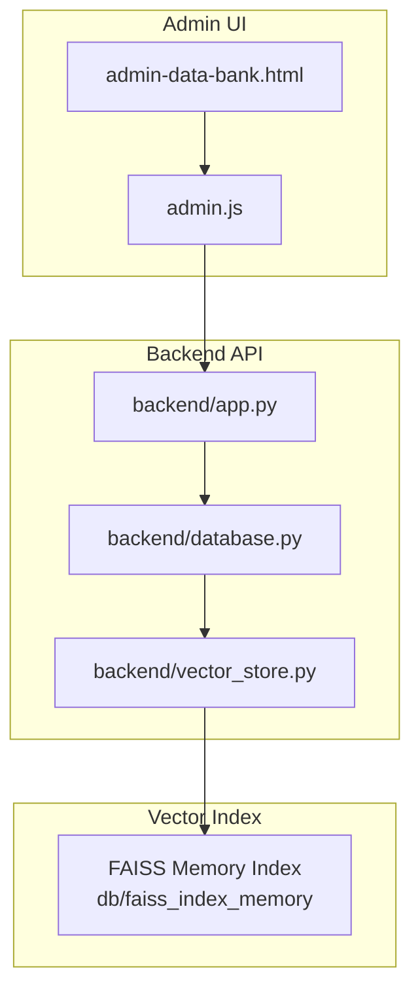
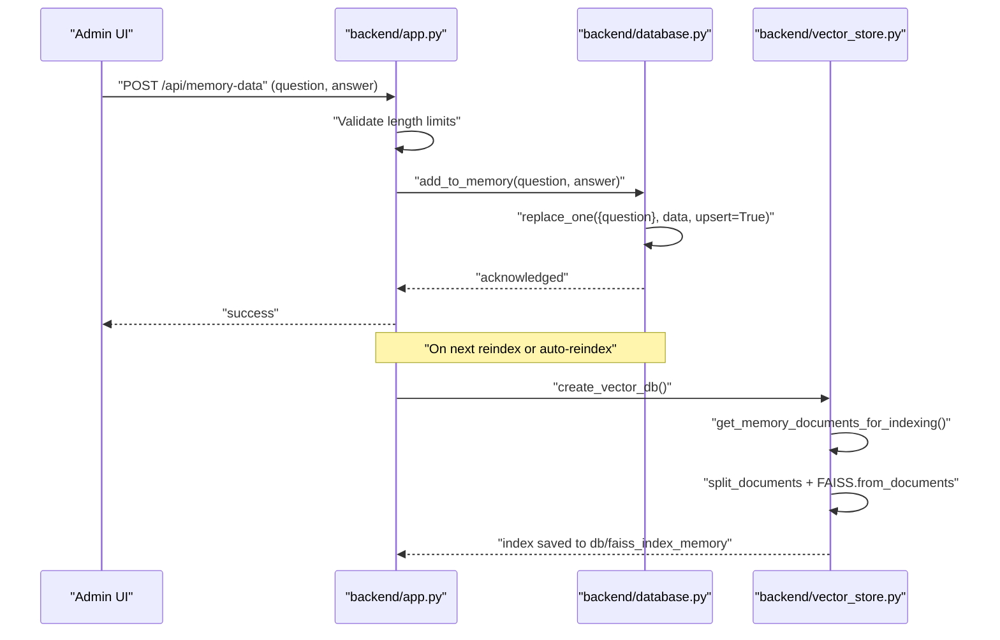
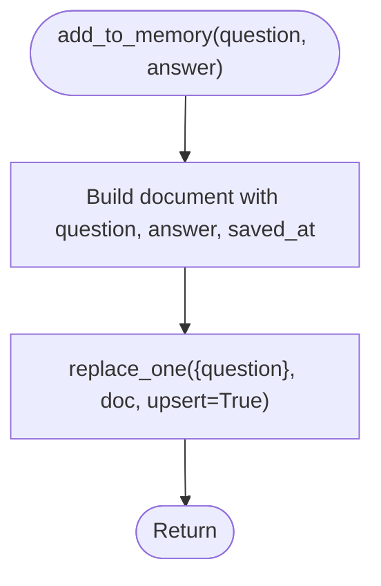
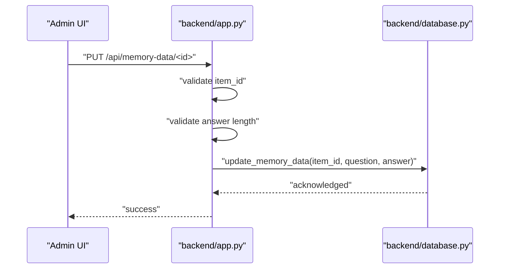
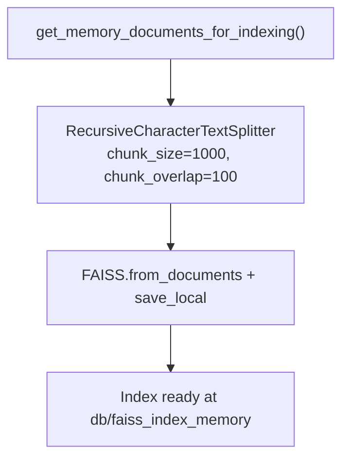
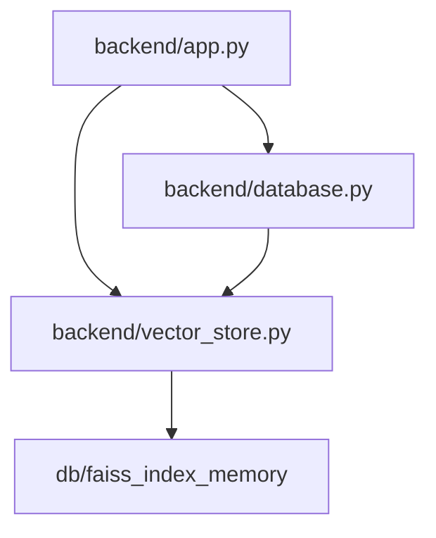

# Memory Bank Management

<cite>
**Referenced Files in This Document**
- [backend/app.py](file://backend/app.py)
- [backend/database.py](file://backend/database.py)
- [backend/vector_store.py](file://backend/vector_store.py)
- [frontend/admin-data-bank.html](file://frontend/admin-data-bank.html)
- [frontend/admin.js](file://frontend/admin.js)
</cite>

## Table of Contents
1. [Introduction](#introduction)
2. [Project Structure](#project-structure)
3. [Core Components](#core-components)
4. [Architecture Overview](#architecture-overview)
5. [Detailed Component Analysis](#detailed-component-analysis)
6. [Dependency Analysis](#dependency-analysis)
7. [Performance Considerations](#performance-considerations)
8. [Troubleshooting Guide](#troubleshooting-guide)
9. [Conclusion](#conclusion)
10. [Appendices](#appendices)

## Introduction
This document explains the Memory Bank management functionality that powers the chatbot's foundational knowledge base. It covers the predefined Q&A system, CRUD operations, uniqueness constraints, timestamps, content validation, and the indexing pipeline that turns stored knowledge into searchable vectors. It also outlines best practices for content curation, scheduling considerations, and quality assurance workflows.

## Project Structure
The Memory Bank spans three primary areas:
- Backend API handlers for admin operations
- Database layer implementing unique constraints and CRUD
- Vector store pipeline that builds FAISS indices from Memory Bank content

**Diagram sources**
- [backend/app.py:1022-1161](file://backend/app.py#L1022-L1161)
- [backend/database.py:40-43](file://backend/database.py#L40-L43)
- [backend/vector_store.py:8-61](file://backend/vector_store.py#L8-L61)

**Section sources**
- [backend/app.py:1022-1161](file://backend/app.py#L1022-L1161)
- [backend/database.py:40-43](file://backend/database.py#L40-L43)
- [backend/vector_store.py:8-61](file://backend/vector_store.py#L8-L61)

## Core Components
- Memory Bank collection with unique question constraint and saved_at sorting index
- CRUD endpoints for admin users: list, create/update via replace, and delete
- Content validation enforcing maximum lengths for questions and answers
- Vector indexing pipeline that splits content into chunks and builds FAISS index
- Auto-reindex on startup if index is missing

Key behaviors:
- Unique constraint on question prevents duplicates; replacement mechanism updates existing entries
- Automatic timestamp management via saved_at field
- Character limits applied to enforce quality and stability
- Indexing pipeline uses recursive splitting and embeddings model

**Section sources**
- [backend/database.py:40-43](file://backend/database.py#L40-L43)
- [backend/database.py:107-137](file://backend/database.py#L107-L137)
- [backend/app.py](file://backend/app.py#L129)
- [backend/app.py:1022-1161](file://backend/app.py#L1022-L1161)
- [backend/vector_store.py:33-61](file://backend/vector_store.py#L33-L61)
- [backend/app.py:220-237](file://backend/app.py#L220-L237)

## Architecture Overview
The Memory Bank lifecycle connects admin actions to persistence and indexing:

**Diagram sources**
- [backend/app.py:1022-1040](file://backend/app.py#L1022-L1040)
- [backend/database.py:107-123](file://backend/database.py#L107-L123)
- [backend/vector_store.py:48-61](file://backend/vector_store.py#L48-L61)

## Detailed Component Analysis

### Database Layer: Memory Bank
Responsibilities:
- Enforce unique constraint on question
- Insert or replace entries atomically
- Provide retrieval and deletion APIs
- Support document assembly for indexing

Implementation highlights:
- Unique index on question ensures no duplicate questions
- Replace operation with upsert enables "update if exists else insert"
- Sorting by saved_at desc for chronological listing
- Helper to assemble documents for FAISS indexing

**Diagram sources**
- [backend/database.py:107-123](file://backend/database.py#L107-L123)

**Section sources**
- [backend/database.py:40-43](file://backend/database.py#L40-L43)
- [backend/database.py:107-137](file://backend/database.py#L107-L137)

### API Handlers: Admin CRUD for Memory Bank
Endpoints:
- GET /api/memory-data: List all memory entries
- GET /api/memory-data/<id>: Retrieve by ID
- POST /api/memory-data: Add or update by question (replace semantics)
- PUT /api/memory-data/<id>: Update by ID
- DELETE /api/memory-data/<id>: Remove by ID

Validation and constraints:
- Maximum question length enforced at ingestion
- Maximum answer length enforced at ingestion
- CSRF protection and admin authentication required
- Audit logging on updates and deletes

**Diagram sources**
- [backend/app.py:1133-1151](file://backend/app.py#L1133-L1151)
- [backend/database.py:128-133](file://backend/database.py#L128-L133)

**Section sources**
- [backend/app.py:1022-1161](file://backend/app.py#L1022-L1161)
- [backend/database.py:128-133](file://backend/database.py#L128-L133)

### Vector Store Pipeline: Indexing Memory Bank
Indexing steps:
- Assemble documents from memory bank entries
- Split into overlapping chunks (size and overlap configured)
- Generate embeddings and build FAISS index
- Save to persistent path

Impact on chatbot:
- Enables semantic search over Q&A pairs
- Auto-reindex on startup if index is missing
- Reindex endpoint allows manual refresh

**Diagram sources**
- [backend/vector_store.py:33-61](file://backend/vector_store.py#L33-L61)
- [backend/vector_store.py:8-61](file://backend/vector_store.py#L8-L61)

**Section sources**
- [backend/vector_store.py:33-61](file://backend/vector_store.py#L33-L61)
- [backend/app.py:220-237](file://backend/app.py#L220-L237)

### Admin UI Integration
The admin interface supports:
- Listing memory bank entries
- Adding new Q&A pairs
- Editing existing entries
- Deleting entries
- Bulk operations via the underlying API

**Diagram sources**
- [frontend/admin-data-bank.html](file://frontend/admin-data-bank.html)
- [frontend/admin.js](file://frontend/admin.js)
- [backend/app.py:1022-1161](file://backend/app.py#L1022-L1161)

**Section sources**
- [frontend/admin-data-bank.html](file://frontend/admin-data-bank.html)
- [frontend/admin.js](file://frontend/admin.js)
- [backend/app.py:1022-1161](file://backend/app.py#L1022-L1161)

## Dependency Analysis
- API handlers depend on database functions for persistence
- Vector store depends on database for document assembly
- Index path constants are shared across modules
- Auto-reindex logic orchestrates index regeneration

**Diagram sources**
- [backend/app.py](file://backend/app.py#L119)
- [backend/vector_store.py:8-61](file://backend/vector_store.py#L8-L61)
- [backend/database.py:40-43](file://backend/database.py#L40-L43)

**Section sources**
- [backend/app.py](file://backend/app.py#L119)
- [backend/vector_store.py:8-61](file://backend/vector_store.py#L8-L61)
- [backend/database.py:40-43](file://backend/database.py#L40-L43)

## Performance Considerations
- Unique constraint on question ensures efficient lookup but requires normalized question text
- Saved_at descending sort enables fast chronological queries
- Vector indexing uses overlapping chunks to improve recall; tune chunk size and overlap for balance
- Embedding model choice affects index size and latency
- Auto-reindex runs at startup to avoid serving stale knowledge

[No sources needed since this section provides general guidance]

## Troubleshooting Guide
Common issues and resolutions:
- Duplicate question errors: Occur when attempting to insert a question already present; use replace semantics or edit existing entry
- Exceeded content length: Answer exceeds maximum allowed length; reduce content or split into multiple entries
- Missing FAISS index: Startup auto-reindex will rebuild; alternatively trigger reindex endpoint
- Permission denied: Admin authentication required; ensure admin session is active
- Invalid ID: Ensure ObjectId format when editing/deleting by ID

**Section sources**
- [backend/database.py:40-43](file://backend/database.py#L40-L43)
- [backend/app.py](file://backend/app.py#L129)
- [backend/app.py:220-237](file://backend/app.py#L220-L237)
- [backend/app.py:1008-1020](file://backend/app.py#L1008-L1020)

## Conclusion
The Memory Bank provides a robust, admin-managed knowledge base with strong constraints and automated indexing. Its replace-on-duplicate behavior simplifies maintenance while ensuring canonical Q&A pairs. Together with validation and reindexing mechanisms, it delivers reliable semantic search for the chatbot.

[No sources needed since this section summarizes without analyzing specific files]

## Appendices

### CRUD Operations Reference
- Create/Update: POST /api/memory-data (replace semantics by question)
- Read: GET /api/memory-data (list), GET /api/memory-data/<id> (single)
- Update: PUT /api/memory-data/<id>
- Delete: DELETE /api/memory-data/<id>

**Section sources**
- [backend/app.py:1022-1161](file://backend/app.py#L1022-L1161)

### Validation Rules and Limits
- Maximum question length enforced during ingestion
- Maximum answer length enforced during ingestion
- CSRF protection and admin authentication required for all write operations

**Section sources**
- [backend/app.py](file://backend/app.py#L129)
- [backend/app.py:1144-1146](file://backend/app.py#L1144-L1146)

### Indexing and Scheduling Notes
- Auto-reindex on startup if index is missing
- Manual reindex endpoint available for admin-triggered refresh
- Index path constant shared across modules

**Section sources**
- [backend/app.py:220-237](file://backend/app.py#L220-L237)
- [backend/app.py:848-858](file://backend/app.py#L848-L858)
- [backend/vector_store.py:8-61](file://backend/vector_store.py#L8-L61)

### Best Practices for Content Curation
- Keep questions concise and unambiguous to maximize match precision
- Split long answers into focused Q&A pairs for better recall
- Review and prune outdated entries regularly
- Monitor index health and trigger reindex after bulk updates

[No sources needed since this section provides general guidance]