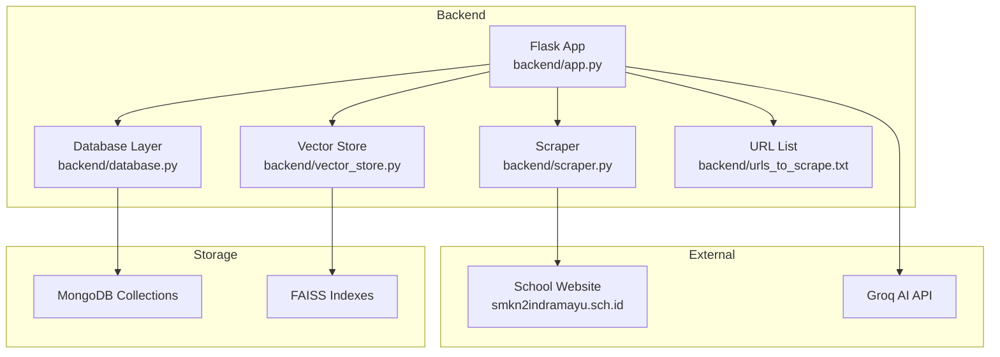
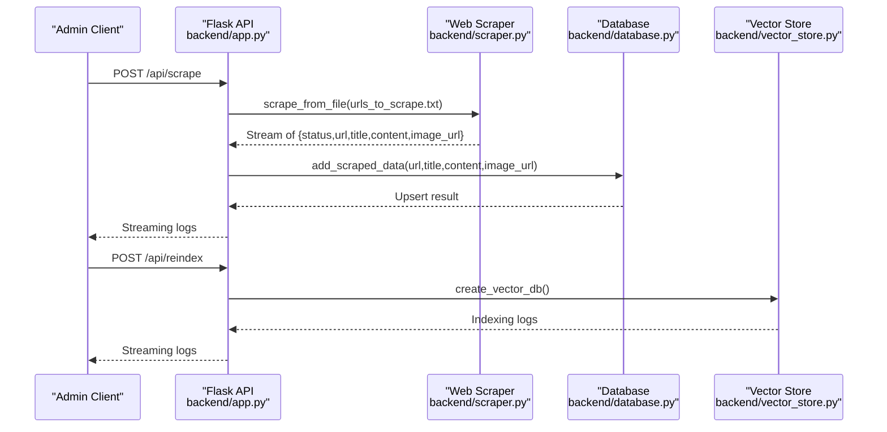
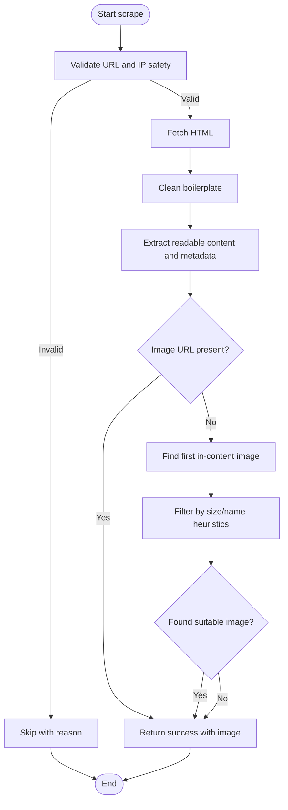
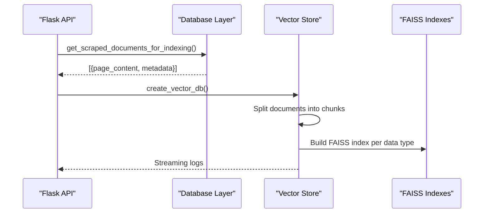
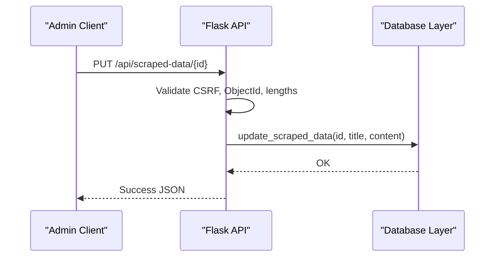
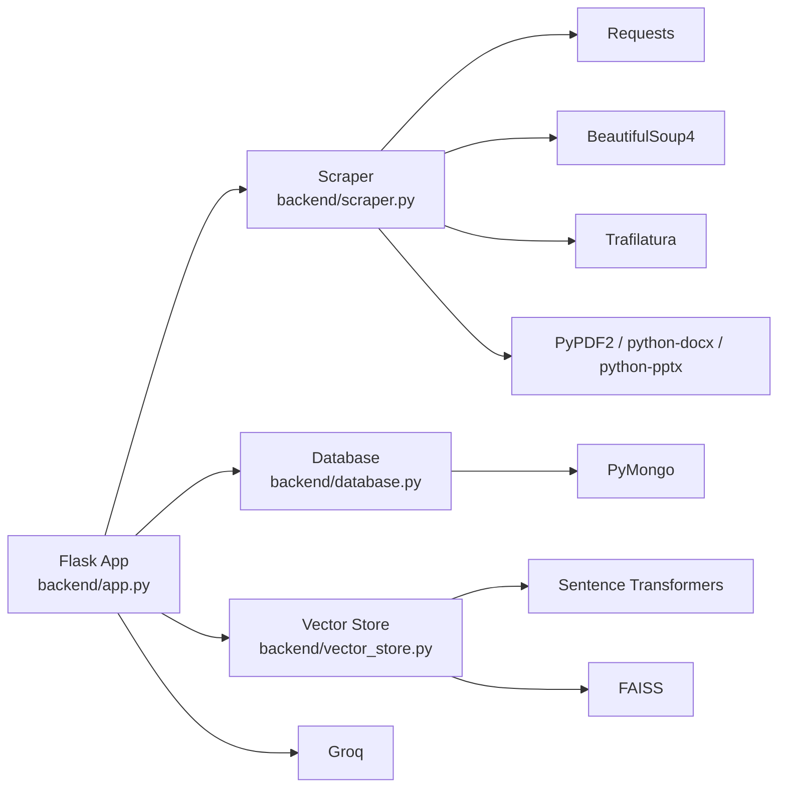

# Scraped Data Management

<cite>
**Referenced Files in This Document**
- [backend/scraper.py](file://backend/scraper.py)
- [backend/database.py](file://backend/database.py)
- [backend/vector_store.py](file://backend/vector_store.py)
- [backend/app.py](file://backend/app.py)
- [backend/urls_to_scrape.txt](file://backend/urls_to_scrape.txt)
- [requirements.txt](file://requirements.txt)
- [Procfile](file://Procfile)
- [API_DOCUMENTATION.md](file://API_DOCUMENTATION.md)
</cite>

## Table of Contents
1. [Introduction](#introduction)
2. [Project Structure](#project-structure)
3. [Core Components](#core-components)
4. [Architecture Overview](#architecture-overview)
5. [Detailed Component Analysis](#detailed-component-analysis)
6. [Dependency Analysis](#dependency-analysis)
7. [Performance Considerations](#performance-considerations)
8. [Troubleshooting Guide](#troubleshooting-guide)
9. [Conclusion](#conclusion)
10. [Appendices](#appendices)

## Introduction
This document describes the Scraped Data Management functionality of the system. It covers the automated content collection pipeline that scrapes external websites, validates and extracts content, preserves metadata and source attribution, and integrates with the vector indexing pipeline for retrieval-enhanced chat. It also documents CRUD operations for managing scraped data entries, including URL uniqueness constraints, content extraction validation, and image URL handling. Additional topics include web scraping integration, automatic content processing, moderation and duplicate detection mechanisms, bulk import capabilities, content freshness indicators, and performance optimization for large-scale ingestion.

## Project Structure
The system is organized around a Flask backend with Python modules for scraping, persistence, and vector indexing. The frontend is served statically from the frontend directory, while the backend exposes REST endpoints for administration and public use.

**Diagram sources**
- [backend/app.py:1-1192](file://backend/app.py#L1-L1192)
- [backend/scraper.py:1-278](file://backend/scraper.py#L1-L278)
- [backend/database.py:1-260](file://backend/database.py#L1-L260)
- [backend/vector_store.py:1-115](file://backend/vector_store.py#L1-L115)
- [backend/urls_to_scrape.txt:1-76](file://backend/urls_to_scrape.txt#L1-L76)

**Section sources**
- [backend/app.py:1-1192](file://backend/app.py#L1-L1192)
- [Procfile:1-1](file://Procfile#L1-L1)

## Core Components
- Web Scraper: Extracts content and representative images from HTML pages, enforces safe URL policies, and cleans boilerplate.
- Database Layer: Provides CRUD operations for scraped data with MongoDB, including unique constraints and metadata preservation.
- Vector Store: Builds FAISS indexes from scraped and manual data for retrieval-augmented chat.
- Flask API: Exposes admin endpoints for scraping, crawling, reindexing, and data management; streams progress logs; and integrates with the chat pipeline.

**Section sources**
- [backend/scraper.py:1-278](file://backend/scraper.py#L1-L278)
- [backend/database.py:150-195](file://backend/database.py#L150-L195)
- [backend/vector_store.py:48-115](file://backend/vector_store.py#L48-L115)
- [backend/app.py:801-846](file://backend/app.py#L801-L846)

## Architecture Overview
The system orchestrates scraping, persistence, and indexing to support retrieval-enhanced chat. The Flask app routes admin actions to the scraper and database modules, persists extracted content with metadata, and triggers vector index creation. The chat pipeline retrieves relevant knowledge from FAISS and synthesizes answers using an AI model.

**Diagram sources**
- [backend/app.py:801-846](file://backend/app.py#L801-L846)
- [backend/scraper.py:152-167](file://backend/scraper.py#L152-L167)
- [backend/database.py:152-168](file://backend/database.py#L152-L168)
- [backend/vector_store.py:48-71](file://backend/vector_store.py#L48-L71)

## Detailed Component Analysis

### Web Scraping Integration
The scraper module performs safe extraction from HTML pages and supports two modes:
- Batch scraping from a URL list file.
- Deep crawling from a base URL with configurable page limits.

Key behaviors:
- Safe URL enforcement: restricts to a specific domain and rejects private/loopback IPs.
- Content extraction: uses Trafilatura to extract readable content and metadata; cleans boilerplate HTML.
- Representative image selection: prefers Open Graph image, otherwise selects the first in-content image that passes size and naming heuristics.
- Output normalization: trims whitespace and filters out short or boilerplate content.

**Diagram sources**
- [backend/scraper.py:12-27](file://backend/scraper.py#L12-L27)
- [backend/scraper.py:83-147](file://backend/scraper.py#L83-L147)
- [backend/scraper.py:168-277](file://backend/scraper.py#L168-L277)

**Section sources**
- [backend/scraper.py:12-27](file://backend/scraper.py#L12-L27)
- [backend/scraper.py:83-147](file://backend/scraper.py#L83-L147)
- [backend/scraper.py:168-277](file://backend/scraper.py#L168-L277)
- [backend/urls_to_scrape.txt:1-76](file://backend/urls_to_scrape.txt#L1-L76)

### Automatic Content Processing and Document Transformation Pipeline
After scraping, the system transforms documents for vector indexing:
- Documents are assembled with metadata including source, title, and image URL.
- Text is split into overlapping chunks for robust retrieval.
- Embeddings are computed using a sentence-transformers model and stored in FAISS indexes.

**Diagram sources**
- [backend/database.py:186-195](file://backend/database.py#L186-L195)
- [backend/vector_store.py:23-71](file://backend/vector_store.py#L23-L71)

**Section sources**
- [backend/database.py:186-195](file://backend/database.py#L186-L195)
- [backend/vector_store.py:23-71](file://backend/vector_store.py#L23-L71)

### Metadata Preservation, Source Attribution, and Freshness Indicators
- Metadata preserved per scraped entry includes URL, title, content, and image URL.
- Source attribution is embedded in the vectorized documents’ metadata (source and title).
- Freshness is tracked via the scraped timestamp, enabling sorting and freshness-aware queries.

**Section sources**
- [backend/database.py:152-160](file://backend/database.py#L152-L160)
- [backend/database.py:186-195](file://backend/database.py#L186-L195)

### CRUD Operations for Scraped Data Entries
The Flask API exposes REST endpoints for managing scraped data:
- Retrieve all entries and by ID.
- Update title and content with length validation.
- Delete entries by ID.

These endpoints enforce admin authentication, CSRF protection, and ObjectId validation.

**Diagram sources**
- [backend/app.py:1063-1096](file://backend/app.py#L1063-L1096)
- [backend/database.py:175-180](file://backend/database.py#L175-L180)

**Section sources**
- [backend/app.py:970-1096](file://backend/app.py#L970-L1096)
- [backend/database.py:150-185](file://backend/database.py#L150-L185)

### URL Uniqueness Constraints and Duplicate Detection
- MongoDB enforces a unique index on the URL field for scraped data, preventing duplicates at the database level.
- The scraper’s upsert behavior ensures that repeated runs do not insert duplicate records; updates occur on conflict.

**Section sources**
- [backend/database.py:28-34](file://backend/database.py#L28-L34)
- [backend/database.py:161-166](file://backend/database.py#L161-L166)

### Content Extraction Validation and Filtering Rules
- Content length threshold: entries with too little content are skipped.
- Boilerplate removal: HTML boilerplate and non-content selectors are stripped before extraction.
- Image selection: prioritizes Open Graph image, then first in-content image meeting size/name criteria.
- File-based content extraction: supports PDF, DOCX, PPTX, and TXT with length limits.

**Section sources**
- [backend/scraper.py:69-81](file://backend/scraper.py#L69-L81)
- [backend/scraper.py:141-147](file://backend/scraper.py#L141-L147)
- [backend/scraper.py:33-66](file://backend/scraper.py#L33-L66)
- [backend/app.py:520-566](file://backend/app.py#L520-L566)

### Image URL Handling
- Preferred image: Open Graph meta tag image.
- Fallback image: first in-content image from common content containers, filtered by size and naming heuristics.
- Storage: image URL is persisted alongside content for downstream use in chat responses.

**Section sources**
- [backend/scraper.py:108-140](file://backend/scraper.py#L108-L140)
- [backend/database.py:158](file://backend/database.py#L158)

### Web Scraping Integration Endpoints
- Batch scraping: POST /api/scrape reads URLs from a file and streams progress logs.
- Deep crawling: POST /api/crawl starts from a base URL, discovers internal links, and scrapes up to a maximum number of pages.

Both endpoints are rate-limited and require admin authentication and CSRF.

**Section sources**
- [backend/app.py:801-846](file://backend/app.py#L801-L846)
- [backend/urls_to_scrape.txt:1-76](file://backend/urls_to_scrape.txt#L1-L76)

### Bulk Import Capabilities
- Manual data import supports text and file uploads (PDF, DOCX, PPTX, TXT) with content extraction and length validation.
- Scraped data can be bulk-imported via the batch scraping endpoint using a URL list file.

**Section sources**
- [backend/app.py:498-566](file://backend/app.py#L498-L566)
- [backend/app.py:801-820](file://backend/app.py#L801-L820)

### Content Archiving Strategies
- MongoDB stores scraped entries with timestamps for historical tracking.
- FAISS indexes are separate local directories; they can be deleted and rebuilt independently.
- The system auto-reindexes on startup if indexes are missing.

**Section sources**
- [backend/database.py:159](file://backend/database.py#L159)
- [backend/vector_store.py:23-47](file://backend/vector_store.py#L23-L47)
- [backend/app.py:220-237](file://backend/app.py#L220-L237)

### Relationship with the Web Scraping System
- Scraped entries are transformed into documents with metadata and indexed separately from manual data.
- Retrieval uses three distinct FAISS indexes (memory, manual, scraped), enabling targeted search and balanced recall.

**Section sources**
- [backend/database.py:186-195](file://backend/database.py#L186-L195)
- [backend/vector_store.py:48-71](file://backend/vector_store.py#L48-L71)

### Configuration Options
- Environment variables:
  - MONGO_URI: MongoDB connection string.
  - GROQ_API_KEY: API key for the Groq AI model.
  - ADMIN_PASSWORD_HASH: Hashed admin password.
  - SECRET_KEY: Flask secret key for sessions and CSRF.
- Rate limiting and security headers are configured in the Flask app.
- FAISS index paths are defined in the vector store module.

**Section sources**
- [backend/app.py:29-80](file://backend/app.py#L29-L80)
- [backend/vector_store.py:8-12](file://backend/vector_store.py#L8-L12)
- [API_DOCUMENTATION.md:327-334](file://API_DOCUMENTATION.md#L327-L334)

### Content Moderation Workflows
- Input sanitization and length limits reduce risk for public endpoints.
- Admin endpoints enforce CSRF and authentication, and audit logs record administrative actions.
- Bug reports include file attachments and status tracking for moderation workflows.

**Section sources**
- [backend/app.py:179-183](file://backend/app.py#L179-L183)
- [backend/app.py:129-132](file://backend/app.py#L129-L132)
- [backend/app.py:403-431](file://backend/app.py#L403-L431)

## Dependency Analysis
The system relies on several libraries for scraping, parsing, embedding, and vector search.

**Diagram sources**
- [requirements.txt:1-30](file://requirements.txt#L1-L30)
- [backend/app.py:13-27](file://backend/app.py#L13-L27)
- [backend/vector_store.py:3-6](file://backend/vector_store.py#L3-L6)

**Section sources**
- [requirements.txt:1-30](file://requirements.txt#L1-L30)

## Performance Considerations
- Rate limiting: Admin endpoints are rate-limited to prevent abuse.
- Chunking and caching: FAISS retrievers are cached at module level to avoid reloading on each request.
- Auto-reindex on startup: Rebuilds missing FAISS indexes to ensure availability.
- Worker configuration: Gunicorn is configured with threaded workers for concurrency.

**Section sources**
- [backend/app.py:98-115](file://backend/app.py#L98-L115)
- [backend/vector_store.py:14-21](file://backend/vector_store.py#L14-L21)
- [backend/app.py:220-237](file://backend/app.py#L220-L237)
- [Procfile:1-1](file://Procfile#L1-L1)

## Troubleshooting Guide
Common issues and resolutions:
- Database initialization failure: Verify MONGO_URI environment variable and connectivity.
- Missing FAISS indexes: Trigger reindexing via the admin endpoint or rely on auto-reindex on startup.
- Scraping errors: Review logs from the scraping endpoints; ensure URLs are accessible and not blocked by robots or rate limits.
- Content too short or boilerplate: Adjust content thresholds or review cleaning logic.
- Authentication failures: Confirm admin credentials and CSRF token usage.

**Section sources**
- [backend/app.py:77-81](file://backend/app.py#L77-L81)
- [backend/app.py:220-237](file://backend/app.py#L220-L237)
- [backend/app.py:801-846](file://backend/app.py#L801-L846)

## Conclusion
The Scraped Data Management system provides a robust pipeline for collecting, validating, persisting, and indexing external content. It enforces URL uniqueness, preserves metadata and source attribution, and integrates seamlessly with retrieval-augmented chat. Admin endpoints enable controlled ingestion, moderation, and maintenance, while performance optimizations ensure scalability for large-scale content ingestion.

## Appendices

### API Endpoints Related to Scraped Data Management
- GET /api/scraped-data: Retrieve all scraped entries.
- GET /api/scraped-data/{id}: Retrieve a specific scraped entry by ID.
- PUT /api/scraped-data/{id}: Update title and content of a scraped entry.
- DELETE /api/scraped-data/{id}: Delete a scraped entry by ID.
- POST /api/scrape: Scrape URLs from the URL list file.
- POST /api/crawl: Deep crawl a website from a base URL.
- POST /api/reindex: Rebuild FAISS indexes for vector search.

**Section sources**
- [API_DOCUMENTATION.md:13-49](file://API_DOCUMENTATION.md#L13-L49)
- [backend/app.py:970-1096](file://backend/app.py#L970-L1096)
- [backend/app.py:801-846](file://backend/app.py#L801-L846)