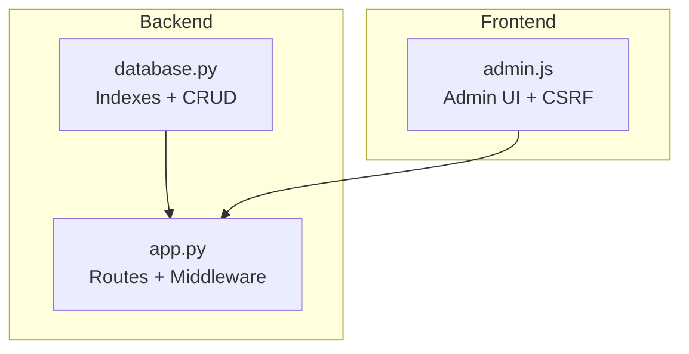
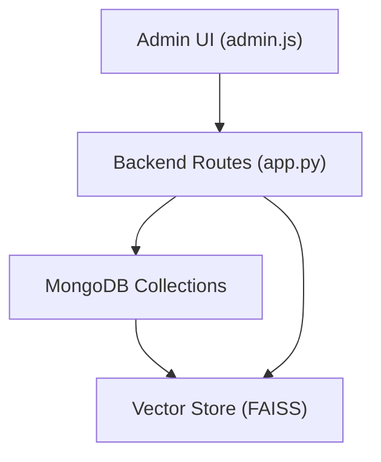
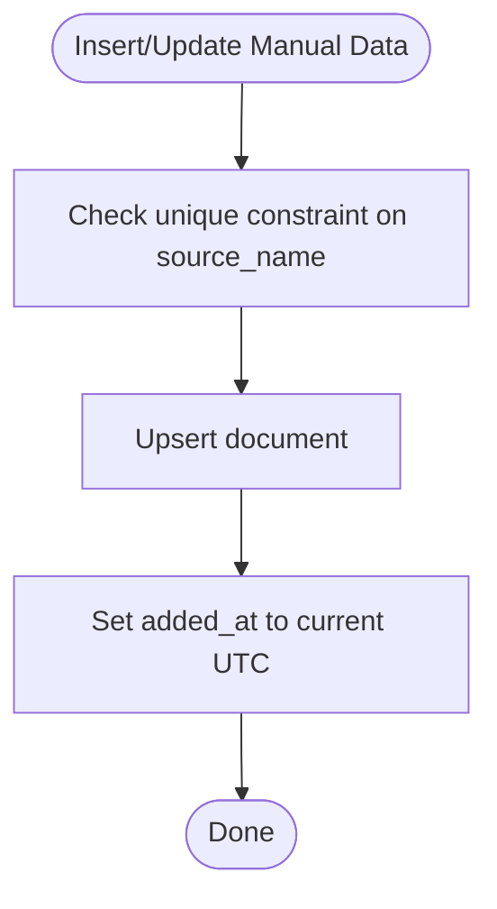
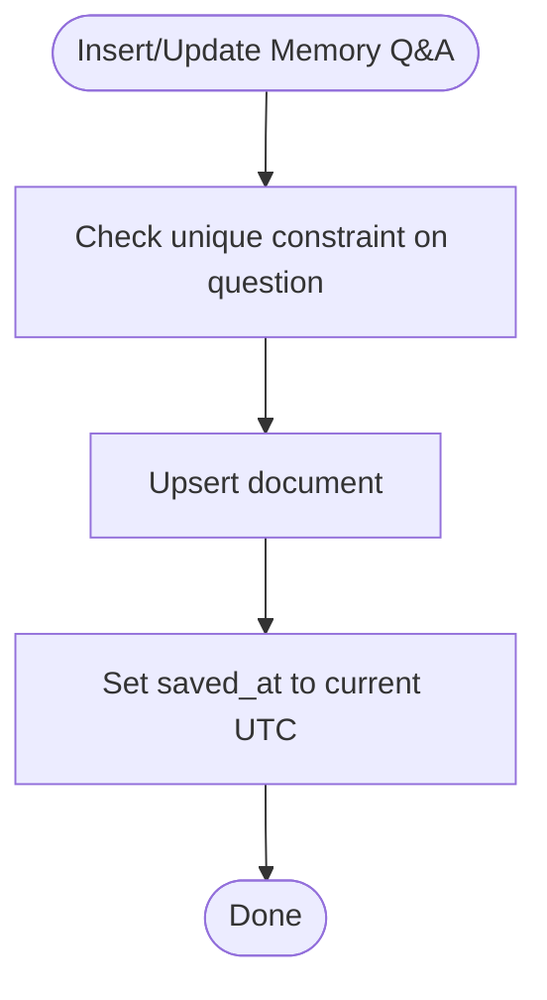
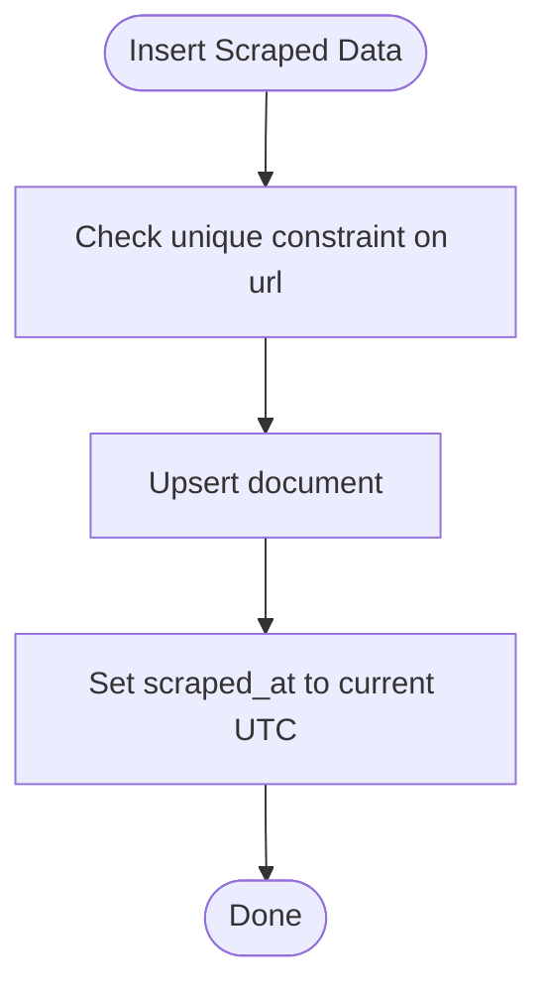
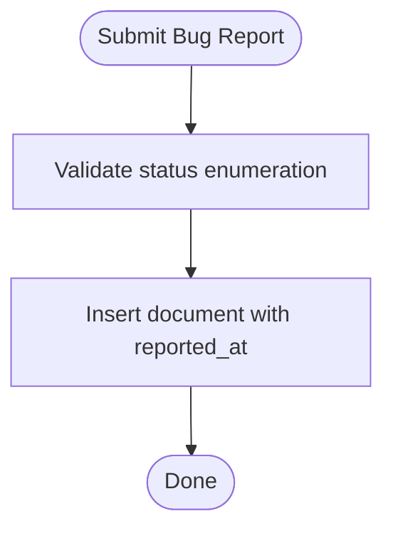
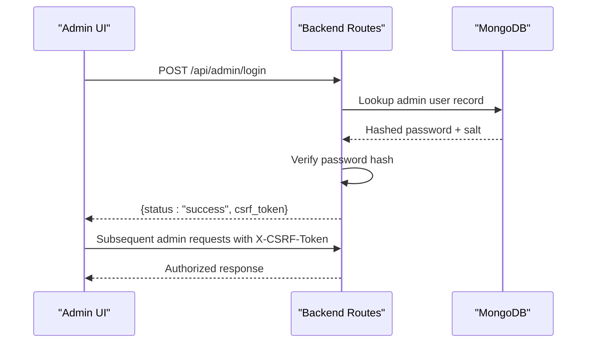
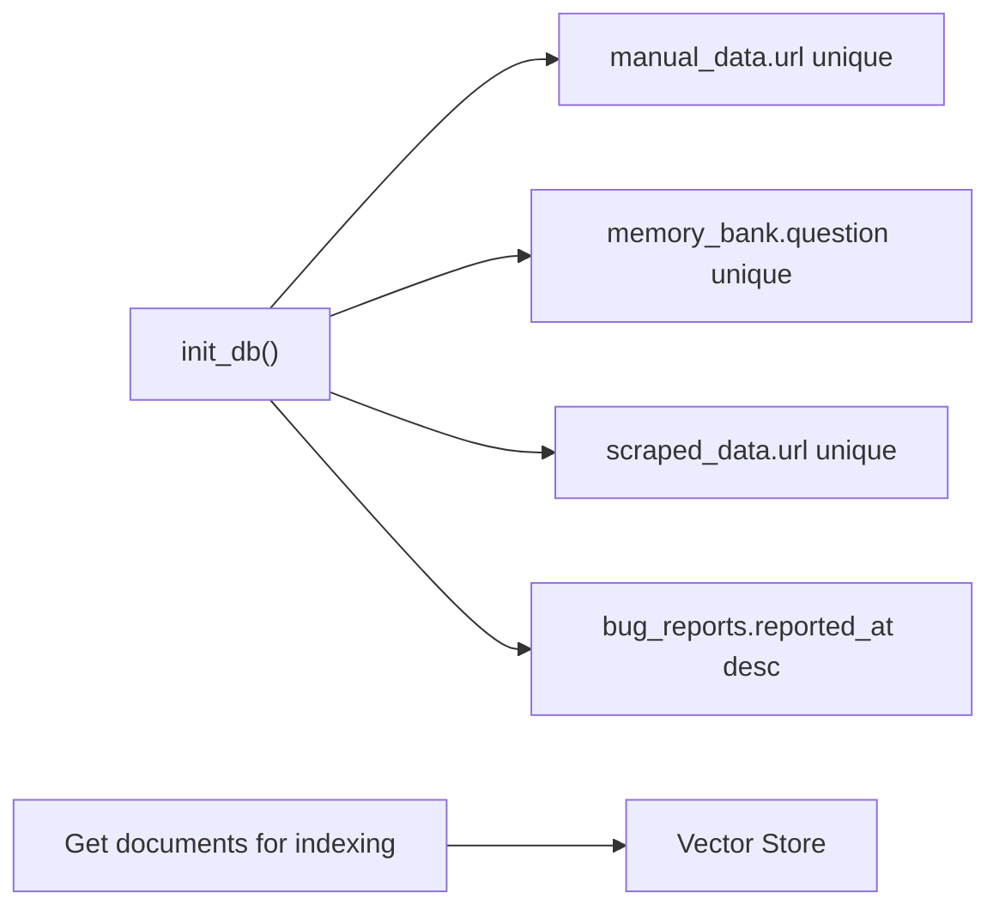

# Collection Schemas

<cite>
**Referenced Files in This Document**
- [database.py](file://backend/database.py)
- [app.py](file://backend/app.py)
- [admin.js](file://frontend/admin.js)
</cite>

## Table of Contents
1. [Introduction](#introduction)
2. [Project Structure](#project-structure)
3. [Core Components](#core-components)
4. [Architecture Overview](#architecture-overview)
5. [Detailed Component Analysis](#detailed-component-analysis)
6. [Dependency Analysis](#dependency-analysis)
7. [Performance Considerations](#performance-considerations)
8. [Troubleshooting Guide](#troubleshooting-guide)
9. [Conclusion](#conclusion)

## Introduction
This document describes the MongoDB collection schemas used by DamayAI-Assistant for content management and administration. It focuses on the five collections involved in the assistant’s knowledge base and administrative workflows:
- manual_data
- memory_bank
- scraped_data
- bug_reports
- admin_users

It details field definitions, validation rules, unique constraints, indexing strategies, and relationships among collections. Sample document structures are provided to illustrate typical records.

## Project Structure
The database layer is implemented in a single module that initializes connections, creates indexes, and exposes CRUD functions for each collection. Authentication and authorization for administrators are handled via dedicated routes and middleware in the backend application.

**Diagram sources**
- [database.py:18-50](file://backend/database.py#L18-L50)
- [app.py:331-359](file://backend/app.py#L331-L359)
- [admin.js:160-234](file://frontend/admin.js#L160-L234)

**Section sources**
- [database.py:18-50](file://backend/database.py#L18-L50)
- [app.py:331-359](file://backend/app.py#L331-L359)
- [admin.js:160-234](file://frontend/admin.js#L160-L234)

## Core Components
This section defines each collection, its fields, constraints, and indexing strategy.

- manual_data
  - Purpose: Stores user-generated knowledge entries with a unique source identifier.
  - Fields:
    - source_name: string, unique
    - title: string
    - content: string
    - file_path: string (optional)
    - added_at: datetime (indexed descending)
  - Unique constraint: source_name
  - Indexes: source_name (unique), added_at (descending)
  - Typical use: Admin adds or updates manual knowledge items; used for vectorization and retrieval.

- memory_bank
  - Purpose: Stores predefined Q&A pairs for consistent assistant responses.
  - Fields:
    - question: string, unique
    - answer: string
    - saved_at: datetime (indexed descending)
  - Unique constraint: question
  - Indexes: question (unique), saved_at (descending)
  - Typical use: Admin curates canonical questions and answers; used for vectorization and retrieval.

- scraped_data
  - Purpose: Stores web-scraped content with associated metadata.
  - Fields:
    - url: string, unique
    - title: string
    - content: string
    - image_url: string
    - scraped_at: datetime (indexed descending)
  - Unique constraint: url
  - Indexes: url (unique), scraped_at (descending)
  - Typical use: Scraped pages are inserted; later used for vectorization and retrieval.

- bug_reports
  - Purpose: Tracks issues reported by users with status management.
  - Fields:
    - description: string
    - file_path: string
    - status: string (enumeration: New, In Progress, Resolved, Won’t Fix)
    - reported_at: datetime (indexed descending)
  - Indexes: reported_at (descending)
  - Typical use: Users submit bug reports; admins update status and manage attachments.

- admin_users
  - Purpose: Authentication and authorization for administrators.
  - Fields:
    - hashed_password: string (stored securely)
    - salt: string (used during hashing)
  - Constraints: Not enforced via MongoDB unique indexes here; managed by backend logic.
  - Typical use: Login endpoint validates credentials against stored hash; CSRF tokens are issued post-login.

Notes:
- All datetime fields are stored as MongoDB datetimes.
- The backend enforces validation and sanitization for bug report statuses and ID formats.
- The admin panel uses CSRF protection and session-based admin checks.

**Section sources**
- [database.py:27-49](file://backend/database.py#L27-L49)
- [database.py:61-104](file://backend/database.py#L61-L104)
- [database.py:108-148](file://backend/database.py#L108-L148)
- [database.py:152-195](file://backend/database.py#L152-L195)
- [database.py:199-228](file://backend/database.py#L199-L228)
- [app.py:331-359](file://backend/app.py#L331-L359)
- [admin.js:160-234](file://frontend/admin.js#L160-L234)

## Architecture Overview
The system integrates frontend, backend, and database layers to support content ingestion, storage, and retrieval.

**Diagram sources**
- [admin.js:160-234](file://frontend/admin.js#L160-L234)
- [app.py:331-359](file://backend/app.py#L331-L359)
- [database.py:18-50](file://backend/database.py#L18-L50)

## Detailed Component Analysis

### manual_data Schema
- Fields and types:
  - source_name: string (unique)
  - title: string
  - content: string
  - file_path: string (optional)
  - added_at: datetime
- Validation rules:
  - source_name must be unique; upsert behavior ensures replacement on conflict.
  - added_at is auto-populated on insert/update.
- Indexing:
  - source_name ascending (unique)
  - added_at descending (for recent-first queries)
- Sample document structure:
  - {
      "source_name": "...",
      "title": "...",
      "content": "...",
      "file_path": "...",
      "added_at": "YYYY-MM-DDTHH:mm:ss.sssZ"
    }

**Diagram sources**
- [database.py:61-79](file://backend/database.py#L61-L79)

**Section sources**
- [database.py:36-39](file://backend/database.py#L36-L39)
- [database.py:61-90](file://backend/database.py#L61-L90)

### memory_bank Schema
- Fields and types:
  - question: string (unique)
  - answer: string
  - saved_at: datetime
- Validation rules:
  - question must be unique; upsert behavior ensures replacement on conflict.
  - saved_at is auto-populated on insert/update.
- Indexing:
  - question ascending (unique)
  - saved_at descending (for recent-first queries)
- Sample document structure:
  - {
      "question": "...",
      "answer": "...",
      "saved_at": "YYYY-MM-DDTHH:mm:ss.sssZ"
    }

**Diagram sources**
- [database.py:108-122](file://backend/database.py#L108-L122)

**Section sources**
- [database.py:41-44](file://backend/database.py#L41-L44)
- [database.py:108-134](file://backend/database.py#L108-L134)

### scraped_data Schema
- Fields and types:
  - url: string (unique)
  - title: string
  - content: string
  - image_url: string
  - scraped_at: datetime
- Validation rules:
  - url must be unique; insertion occurs with upsert-like semantics in higher-level logic.
  - scraped_at is auto-populated on insert.
- Indexing:
  - url ascending (unique)
  - scraped_at descending (for recent-first queries)
- Sample document structure:
  - {
      "url": "...",
      "title": "...",
      "content": "...",
      "image_url": "...",
      "scraped_at": "YYYY-MM-DDTHH:mm:ss.sssZ"
    }

**Diagram sources**
- [database.py:152-161](file://backend/database.py#L152-L161)

**Section sources**
- [database.py:31-35](file://backend/database.py#L31-L35)
- [database.py:152-195](file://backend/database.py#L152-L195)

### bug_reports Schema
- Fields and types:
  - description: string
  - file_path: string
  - status: string (enumeration)
  - reported_at: datetime
- Validation rules:
  - Status must be one of: New, In Progress, Resolved, Won’t Fix.
  - Reported bug IDs are validated as ObjectIds in backend handlers.
- Indexing:
  - reported_at descending (for recent-first queries)
- Sample document structure:
  - {
      "description": "...",
      "file_path": "...",
      "status": "New",
      "reported_at": "YYYY-MM-DDTHH:mm:ss.sssZ"
    }

**Diagram sources**
- [database.py:199-207](file://backend/database.py#L199-L207)
- [app.py:462-481](file://backend/app.py#L462-L481)

**Section sources**
- [database.py:46-47](file://backend/database.py#L46-L47)
- [database.py:199-228](file://backend/database.py#L199-L228)
- [app.py:462-481](file://backend/app.py#L462-L481)

### admin_users Schema
- Fields and types:
  - hashed_password: string
  - salt: string
- Constraints:
  - No MongoDB unique index on username; uniqueness is enforced by backend logic.
- Authentication flow:
  - Login endpoint verifies password against stored hash.
  - On success, CSRF token is returned and admin session is established.
- Authorization:
  - Admin-protected routes require admin session and CSRF token.

**Diagram sources**
- [app.py:331-359](file://backend/app.py#L331-L359)
- [admin.js:160-234](file://frontend/admin.js#L160-L234)

**Section sources**
- [app.py:331-359](file://backend/app.py#L331-L359)
- [admin.js:160-234](file://frontend/admin.js#L160-L234)

## Dependency Analysis
- Index creation depends on the initialization routine to ensure uniqueness and query performance.
- Vectorization relies on documents retrieved from manual_data and memory_bank for FAISS indexing.
- Frontend admin actions depend on backend routes for authentication, bug report management, and data CRUD.

**Diagram sources**
- [database.py:27-49](file://backend/database.py#L27-L49)
- [database.py:96-104](file://backend/database.py#L96-L104)
- [database.py:140-148](file://backend/database.py#L140-L148)

**Section sources**
- [database.py:27-49](file://backend/database.py#L27-L49)
- [database.py:96-104](file://backend/database.py#L96-L104)
- [database.py:140-148](file://backend/database.py#L140-L148)

## Performance Considerations
- Indexes:
  - Unique indexes on source_name (manual_data), question (memory_bank), and url (scraped_data) prevent duplicates and accelerate lookups.
  - Descending indexes on added_at (manual_data), saved_at (memory_bank), and scraped_at (scraped_data) optimize recent-first queries.
  - Descending index on reported_at (bug_reports) supports efficient listing of recent reports.
- Upsert behavior:
  - Replace-on-conflict upserts reduce duplication risk and simplify content management workflows.
- Vectorization:
  - Retrieving all documents from manual_data and memory_bank for indexing ensures comprehensive coverage but may require pagination for very large datasets.

[No sources needed since this section provides general guidance]

## Troubleshooting Guide
- Authentication failures:
  - If login fails, verify admin credentials configuration and CSRF token handling in the frontend.
- Bug report errors:
  - Ensure status values match allowed enumerations; invalid IDs will be rejected by validation.
- Duplicate entries:
  - Unique constraints on source_name, question, and url prevent duplicates; conflicts trigger upsert behavior.

**Section sources**
- [app.py:331-359](file://backend/app.py#L331-L359)
- [app.py:462-481](file://backend/app.py#L462-L481)
- [database.py:61-79](file://backend/database.py#L61-L79)
- [database.py:108-122](file://backend/database.py#L108-L122)
- [database.py:152-161](file://backend/database.py#L152-L161)

## Conclusion
The MongoDB schema for DamayAI-Assistant centers on four operational collections (manual_data, memory_bank, scraped_data, bug_reports) plus admin authentication (admin_users). Unique constraints and targeted indexes ensure data integrity and efficient queries. The backend enforces validation and authorization, while the frontend provides admin controls with CSRF protection. Together, these components support a robust content management workflow from ingestion to retrieval.