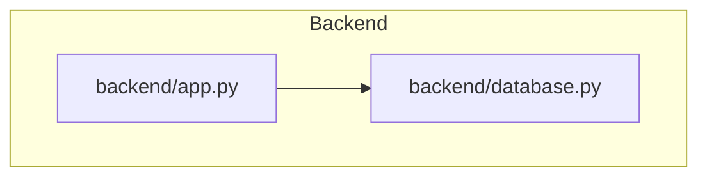
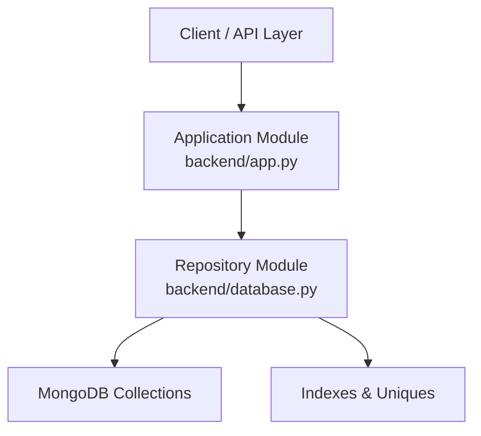
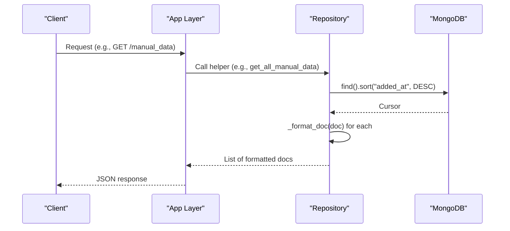
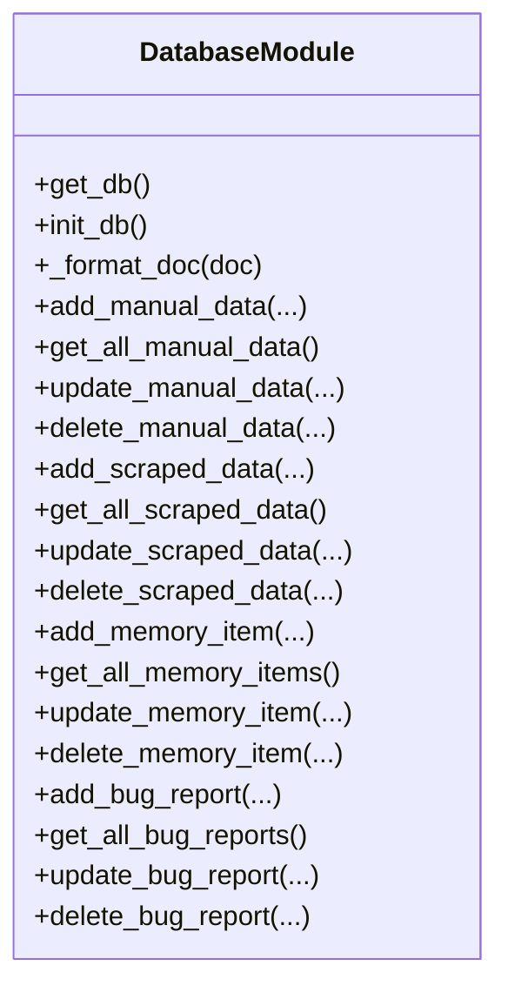
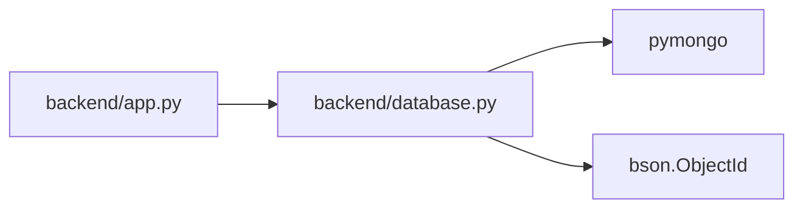

# Data Access Patterns

<cite>
**Referenced Files in This Document**
- [backend/database.py](file://backend/database.py)
- [backend/app.py](file://backend/app.py)
</cite>

## Table of Contents
1. [Introduction](#introduction)
2. [Project Structure](#project-structure)
3. [Core Components](#core-components)
4. [Architecture Overview](#architecture-overview)
5. [Detailed Component Analysis](#detailed-component-analysis)
6. [Dependency Analysis](#dependency-analysis)
7. [Performance Considerations](#performance-considerations)
8. [Troubleshooting Guide](#troubleshooting-guide)
9. [Conclusion](#conclusion)

## Introduction
This document explains the data access patterns and CRUD operations used by the DamayAI-Assistant backend. It focuses on the repository-style helpers for MongoDB collections, query patterns, sorting strategies, pagination, complex queries, filtering, bulk operations, and the _format_doc helper for ObjectId conversion and date formatting. It also covers error handling, exception management, transaction safety considerations, and performance optimization tips tailored for a chatbot system.

## Project Structure
The data access layer centers around a single module that initializes the database connection, sets up indexes, and exposes CRUD helpers per collection. A companion application module integrates with the database layer and includes ObjectId validation utilities.

**Diagram sources**
- [backend/database.py:18-25](file://backend/database.py#L18-L25)
- [backend/app.py:14-20](file://backend/app.py#L14-L20)

**Section sources**
- [backend/database.py:18-25](file://backend/database.py#L18-L25)
- [backend/app.py:14-20](file://backend/app.py#L14-L20)

## Core Components
- Database initialization and connection management
- Index initialization for uniqueness and sort performance
- Repository-style CRUD helpers per collection
- Formatting helper for ObjectId-to-string conversion and date handling
- ObjectId validation utility in the application module

Key responsibilities:
- Centralized connection via a singleton-like accessor
- Unique constraints enforced via indexes
- Sorting by descending timestamps for recent-first retrieval
- Safe formatting of documents for external consumption

**Section sources**
- [backend/database.py:18-25](file://backend/database.py#L18-L25)
- [backend/database.py:27-49](file://backend/database.py#L27-L49)
- [backend/database.py:51-57](file://backend/database.py#L51-L57)
- [backend/app.py:161-168](file://backend/app.py#L161-L168)

## Architecture Overview
The system follows a repository pattern with a dedicated module for data access and a thin application layer that orchestrates requests and validates inputs.

**Diagram sources**
- [backend/database.py:27-49](file://backend/database.py#L27-L49)
- [backend/app.py:14-20](file://backend/app.py#L14-L20)

## Detailed Component Analysis

### Database Initialization and Index Setup
- Initializes MongoDB connection using environment-provided URI and database name.
- Creates unique indexes on fields that must remain distinct (e.g., URLs, source names, questions).
- Adds descending-timestamp indexes to optimize chronological queries.

Operational notes:
- Index creation runs once during initialization to ensure uniqueness and fast sorts.
- Timestamp fields are stored as UTC for consistent ordering.

**Section sources**
- [backend/database.py:18-25](file://backend/database.py#L18-L25)
- [backend/database.py:27-49](file://backend/database.py#L27-L49)

### Helper: _format_doc
Purpose:
- Converts ObjectId to string and renames the identifier field for JSON serialization.
- Removes internal identifiers to avoid leakage of raw ObjectId representation.

Behavior:
- Idempotent for None inputs.
- Produces a shallow copy of the document with normalized keys.

Usage:
- Applied to all returned cursors to ensure consistent serialization.

**Section sources**
- [backend/database.py:51-57](file://backend/database.py#L51-L57)

### Manual Data Collection (Manual Knowledge Bank)
CRUD operations:
- Upsert by unique field (source_name) to ensure deduplication.
- Retrieve all items sorted by descending timestamp.
- Update by ObjectId.
- Delete by ObjectId.

Query patterns:
- Sort by descending timestamp for recency.
- Filter by unique constraint on source_name for upserts.

Pagination:
- Implemented via skip and limit on the cursor for large result sets.

Bulk operations:
- Replace-one with upsert for atomic replacement by unique key.
- Bulk delete/update can be achieved by iterating over lists of IDs and applying delete_one/update_one.

Complex queries:
- Combine equality filters with timestamp ranges for temporal slicing.
- Use compound filters (e.g., source_name equals X AND added_at greater than Y).

Error handling:
- Exceptions caught around write operations; errors logged locally.

**Section sources**
- [backend/database.py:61-84](file://backend/database.py#L61-L84)
- [backend/database.py:85-96](file://backend/database.py#L85-L96)
- [backend/database.py:97-108](file://backend/database.py#L97-L108)
- [backend/database.py:109-120](file://backend/database.py#L109-L120)

### Scraped Data Collection (Web Scraping Results)
CRUD operations:
- Insert with unique URL constraint.
- Retrieve all items sorted by descending scrape timestamp.
- Update by ObjectId.
- Delete by ObjectId.

Indexing:
- Unique index on URL.
- Descending index on scrape timestamp.

Pagination and sorting:
- Cursor sort by descending scrape timestamp.
- Skip/limit for pagination.

Complex queries:
- Filter by URL domain or category if present.
- Range queries on scrape timestamp.

Bulk operations:
- Bulk insert with unique URL enforcement.
- Bulk delete by list of IDs.

Error handling:
- Write exceptions handled with logging.

**Section sources**
- [backend/database.py:121-140](file://backend/database.py#L121-L140)
- [backend/database.py:141-152](file://backend/database.py#L141-L152)
- [backend/database.py:153-164](file://backend/database.py#L153-L164)
- [backend/database.py:165-176](file://backend/database.py#L165-L176)

### Memory Bank Collection (Chatbot Knowledge)
CRUD operations:
- Upsert by unique question.
- Retrieve all items sorted by descending save timestamp.
- Update by ObjectId.
- Delete by ObjectId.

Indexing:
- Unique index on question.
- Descending index on saved timestamp.

Pagination:
- Cursor sort by descending timestamp with skip/limit.

Complex queries:
- Case-insensitive or prefix-based question matching using regex filters.
- Hybrid filters combining question similarity and temporal bounds.

Bulk operations:
- Bulk replace-one with upsert for question sets.
- Bulk delete by ID list.

Error handling:
- Exceptions caught and logged around writes.

**Section sources**
- [backend/database.py:177-196](file://backend/database.py#L177-L196)
- [backend/database.py:197-208](file://backend/database.py#L197-L208)
- [backend/database.py:209-220](file://backend/database.py#L209-L220)
- [backend/database.py:221-232](file://backend/database.py#L221-L232)

### Bug Reports Collection (User Feedback)
CRUD operations:
- Insert with reported timestamp.
- Retrieve all items sorted by descending reported timestamp.
- Update by ObjectId.
- Delete by ObjectId.

Indexing:
- Descending index on reported timestamp.

Pagination:
- Cursor sort by descending timestamp with skip/limit.

Complex queries:
- Filter by status or reporter metadata if present.
- Temporal range queries on reported timestamp.

Bulk operations:
- Bulk insert for batch reports.
- Bulk delete by ID list.

Error handling:
- Exceptions caught and logged around writes.

**Section sources**
- [backend/database.py:233-252](file://backend/database.py#L233-L252)
- [backend/database.py:253-264](file://backend/database.py#L253-L264)
- [backend/database.py:265-276](file://backend/database.py#L265-L276)
- [backend/database.py:277-288](file://backend/database.py#L277-L288)

### ObjectId Validation Utility
Purpose:
- Validates whether a given string is a valid MongoDB ObjectId (24-character hexadecimal).

Usage:
- Used across endpoints to sanitize incoming IDs before performing operations.

**Section sources**
- [backend/app.py:161-168](file://backend/app.py#L161-L168)

## Architecture Overview

**Diagram sources**
- [backend/database.py:80-84](file://backend/database.py#L80-L84)
- [backend/database.py:51-57](file://backend/database.py#L51-L57)

## Detailed Component Analysis

### Repository Pattern Implementation
- Each collection has a dedicated set of helpers:
  - Upsert by unique field (replace_one with upsert)
  - Retrieve all sorted by descending timestamp
  - Update by ObjectId
  - Delete by ObjectId
- Consistent use of DESCENDING timestamps ensures recent-first ordering without repeated sort operations.

**Diagram sources**
- [backend/database.py:18-25](file://backend/database.py#L18-L25)
- [backend/database.py:27-49](file://backend/database.py#L27-L49)
- [backend/database.py:51-57](file://backend/database.py#L51-L57)
- [backend/database.py:61-120](file://backend/database.py#L61-L120)
- [backend/database.py:121-176](file://backend/database.py#L121-L176)
- [backend/database.py:177-232](file://backend/database.py#L177-L232)
- [backend/database.py:233-288](file://backend/database.py#L233-L288)

**Section sources**
- [backend/database.py:61-120](file://backend/database.py#L61-L120)
- [backend/database.py:121-176](file://backend/database.py#L121-L176)
- [backend/database.py:177-232](file://backend/database.py#L177-L232)
- [backend/database.py:233-288](file://backend/database.py#L233-L288)

### Query Patterns and Sorting Strategies
- Sorting: All collections sort by a descending timestamp field to prioritize recent entries.
- Pagination: Implemented via skip and limit on cursors.
- Filtering: Equality filters on unique fields (e.g., source_name, url, question) and range filters on timestamps.
- Complex queries: Combine unique-key equality with temporal bounds; leverage regex for partial matches on question text.

**Section sources**
- [backend/database.py:82](file://backend/database.py#L82)
- [backend/database.py:139](file://backend/database.py#L139)
- [backend/database.py:199](file://backend/database.py#L199)
- [backend/database.py:255](file://backend/database.py#L255)

### Bulk Operations
- Upserts by unique key using replace_one with upsert for idempotent updates.
- Bulk deletion by iterating over a list of ObjectId strings, converting to ObjectId before deletion.
- Bulk insertion supported by drivers; ensure unique constraints are respected.

**Section sources**
- [backend/database.py:72-76](file://backend/database.py#L72-L76)
- [backend/database.py:87-96](file://backend/database.py#L87-L96)
- [backend/database.py:153-164](file://backend/database.py#L153-L164)
- [backend/database.py:209-220](file://backend/database.py#L209-L220)
- [backend/database.py:265-276](file://backend/database.py#L265-L276)

### ObjectId Conversion and Date Formatting
- _format_doc converts ObjectId to string and renames the identifier field, removing internal fields.
- Ensures consistent serialization across endpoints.

**Section sources**
- [backend/database.py:51-57](file://backend/database.py#L51-L57)

### Error Handling and Exception Management
- Write operations wrap replace_one and delete_one in try/catch blocks; exceptions are logged.
- No explicit transaction management is present; operations are executed as individual commands.

Recommendations:
- For multi-step writes, consider explicit transactions to maintain consistency.
- Add structured error responses with status codes and messages for clients.

**Section sources**
- [backend/database.py:71-79](file://backend/database.py#L71-L79)
- [backend/database.py:97-108](file://backend/database.py#L97-L108)
- [backend/database.py:153-164](file://backend/database.py#L153-L164)
- [backend/database.py:209-220](file://backend/database.py#L209-L220)
- [backend/database.py:265-276](file://backend/database.py#L265-L276)

### Transaction Safety Considerations
- Current helpers perform single-operation reads/writes.
- For cross-collection updates or dependent writes, introduce explicit transactions to guarantee atomicity.

[No sources needed since this section provides general guidance]

## Dependency Analysis
- Application module depends on the repository module for database operations.
- Repository module depends on the MongoDB driver and BSON utilities.
- Indexes are configured centrally to support uniqueness and sort performance.

**Diagram sources**
- [backend/app.py:14-20](file://backend/app.py#L14-L20)
- [backend/database.py:3-5](file://backend/database.py#L3-L5)

**Section sources**
- [backend/app.py:14-20](file://backend/app.py#L14-L20)
- [backend/database.py:3-5](file://backend/database.py#L3-L5)

## Performance Considerations
- Prefer unique-indexed fields for equality filters to minimize scan costs.
- Use descending-timestamp indexes to avoid additional sort steps for recent-first queries.
- Apply skip/limit for pagination to bound result sets.
- For high-cardinality filters, add targeted indexes (e.g., on categories or statuses).
- Batch writes to reduce round-trips; ensure unique constraints are respected.
- Avoid returning large documents unnecessarily; select only required fields when possible.

[No sources needed since this section provides general guidance]

## Troubleshooting Guide
Common issues and resolutions:
- Missing MONGO_URI: Raises a configuration error during connection; ensure environment variables are set.
- DuplicateKeyError on upserts: Handled by the upsert mechanism; verify unique fields are correctly set.
- Invalid ObjectId errors: Use the validation utility to sanitize inputs before invoking helpers.
- Slow queries: Confirm indexes exist on sort/filter fields; review query plans.

**Section sources**
- [backend/database.py:21-23](file://backend/database.py#L21-L23)
- [backend/database.py:71-79](file://backend/database.py#L71-L79)
- [backend/app.py:161-168](file://backend/app.py#L161-L168)

## Conclusion
The repository pattern in backend/database.py provides a clean, consistent interface for managing multiple collections with strong indexing and predictable sorting. By leveraging unique constraints, descending timestamps, and pagination, the system supports efficient retrieval and updates. Extending with explicit transactions and refined error responses will further improve robustness for production chatbot workloads.