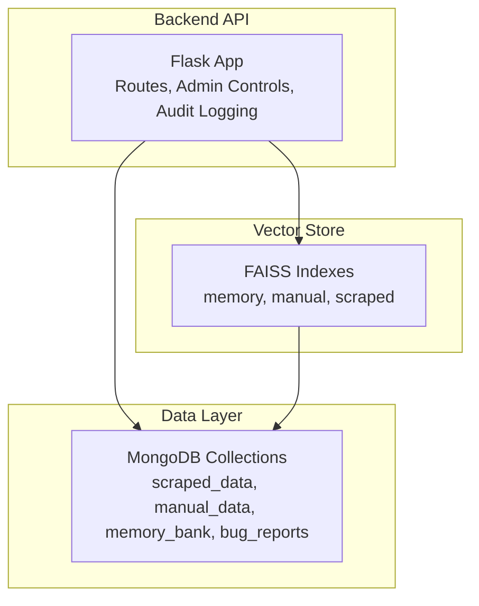
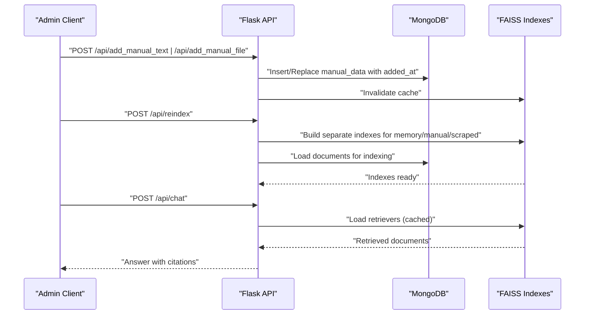
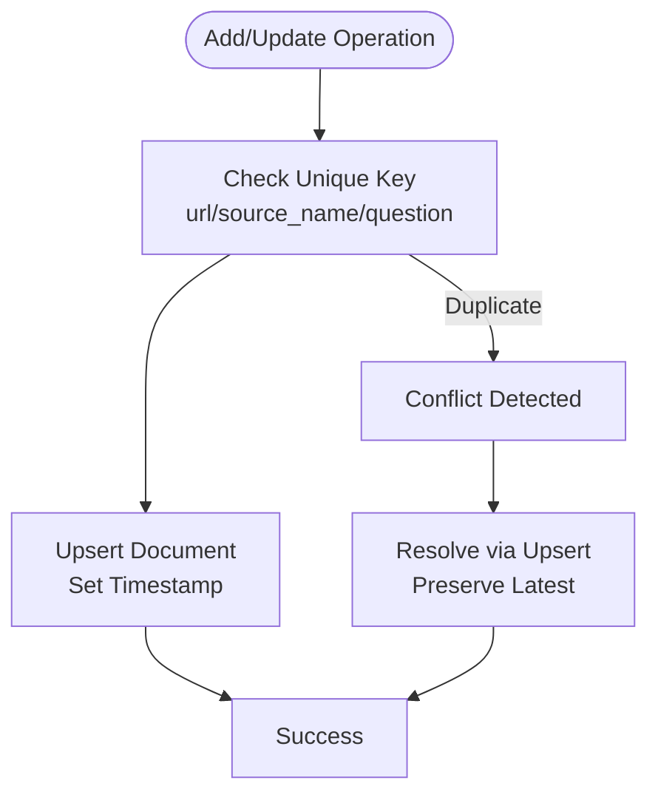
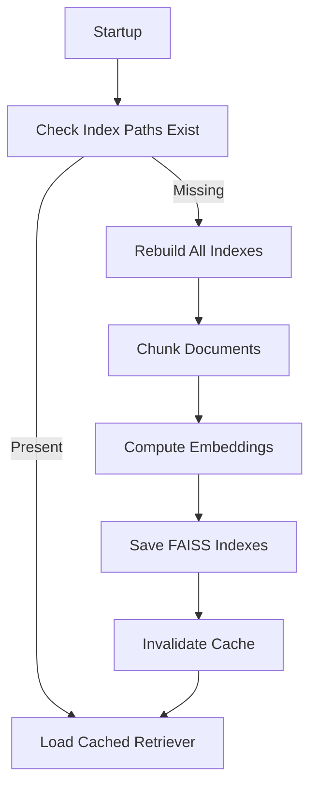
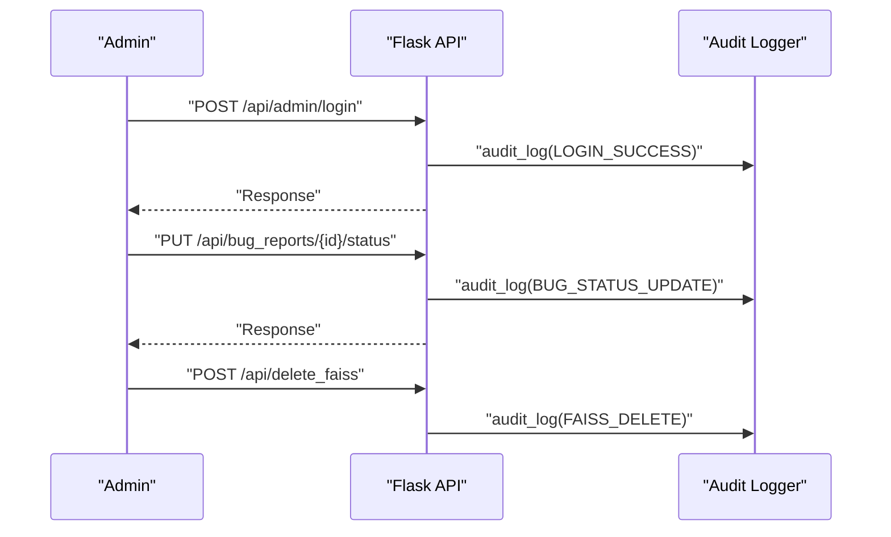
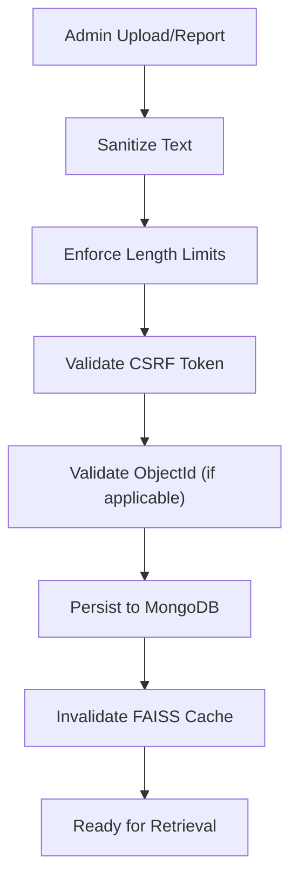
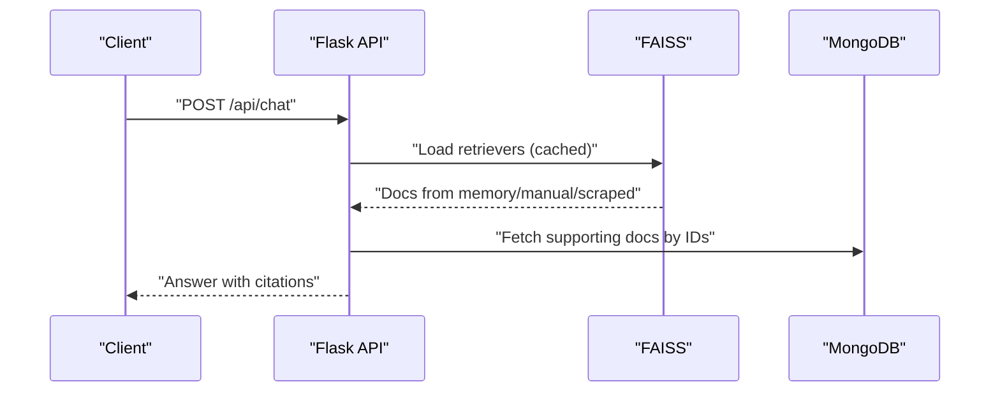
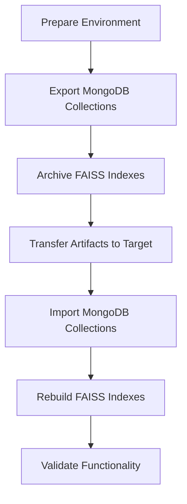
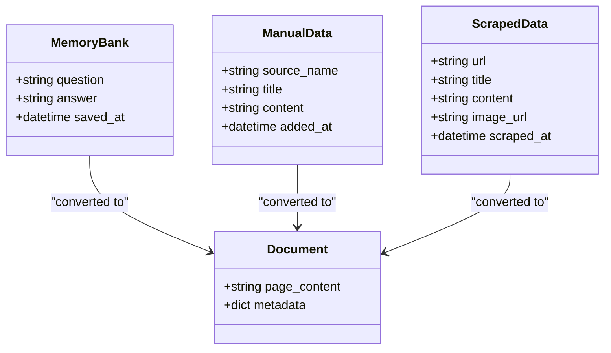
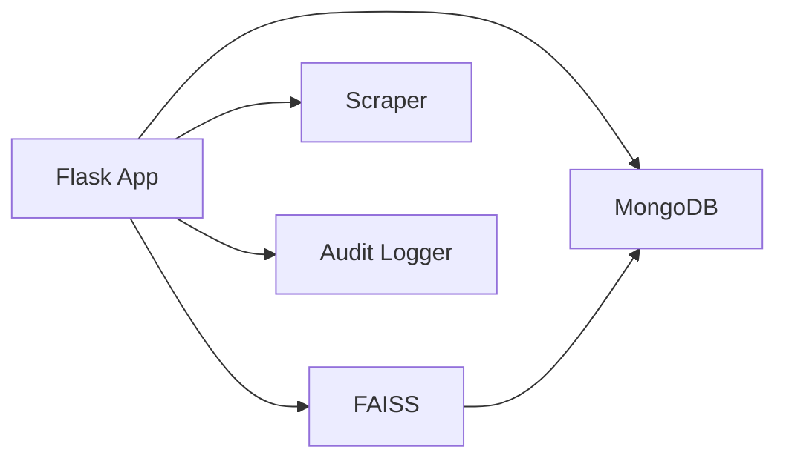

# Data Lifecycle Management

<cite>
**Referenced Files in This Document**
- [backend/database.py](file://backend/database.py)
- [backend/vector_store.py](file://backend/vector_store.py)
- [backend/app.py](file://backend/app.py)
- [backend/scraper.py](file://backend/scraper.py)
- [generate_api_excel.py](file://generate_api_excel.py)
</cite>

## Table of Contents
1. [Introduction](#introduction)
2. [Project Structure](#project-structure)
3. [Core Components](#core-components)
4. [Architecture Overview](#architecture-overview)
5. [Detailed Component Analysis](#detailed-component-analysis)
6. [Dependency Analysis](#dependency-analysis)
7. [Performance Considerations](#performance-considerations)
8. [Troubleshooting Guide](#troubleshooting-guide)
9. [Conclusion](#conclusion)
10. [Appendices](#appendices)

## Introduction
This document explains how DamayAI-Assistant manages data across its lifecycle: ingestion, indexing, querying, archival, and cleanup. It covers retention and ordering semantics driven by timestamps (added_at, saved_at, scraped_at, reported_at), operational safeguards such as deduplication and integrity checks, and practical procedures for backup, restoration, and migration. It also documents audit trails, change tracking, and data lineage for content management.

## Project Structure
The data lifecycle spans three primary areas:
- Backend API and orchestration: Flask routes, admin controls, and audit logging
- Data persistence: MongoDB collections for scraped, manual, memory, and bug reports
- Vector search: FAISS indices built from MongoDB content for retrieval

**Diagram sources**
- [backend/app.py:1-120](file://backend/app.py#L1-L120)
- [backend/database.py:18-49](file://backend/database.py#L18-L49)
- [backend/vector_store.py:8-12](file://backend/vector_store.py#L8-L12)

**Section sources**
- [backend/app.py:1-120](file://backend/app.py#L1-L120)
- [backend/database.py:18-49](file://backend/database.py#L18-L49)
- [backend/vector_store.py:8-12](file://backend/vector_store.py#L8-L12)

## Core Components
- Timestamp-driven ordering and retrieval:
  - Manual data ordered by added_at (descending)
  - Memory bank ordered by saved_at (descending)
  - Scraped data ordered by scraped_at (descending)
  - Bug reports ordered by reported_at (descending)
- Deduplication and uniqueness:
  - Unique constraints on url (scraped_data), source_name (manual_data), and question (memory_bank)
- Vector indexing:
  - Separate FAISS indexes for memory, manual, and scraped data
  - Auto-reindex on startup if indexes are missing
- Audit logging:
  - Centralized audit logger for admin actions and system events

**Section sources**
- [backend/database.py:31-47](file://backend/database.py#L31-L47)
- [backend/database.py:61-122](file://backend/database.py#L61-L122)
- [backend/database.py:108-148](file://backend/database.py#L108-L148)
- [backend/database.py:152-195](file://backend/database.py#L152-L195)
- [backend/database.py:199-228](file://backend/database.py#L199-L228)
- [backend/vector_store.py:23-70](file://backend/vector_store.py#L23-L70)
- [backend/app.py:33-56](file://backend/app.py#L33-L56)

## Architecture Overview
The system integrates ingestion, persistence, indexing, and retrieval:

**Diagram sources**
- [backend/app.py:498-566](file://backend/app.py#L498-L566)
- [backend/app.py:609-761](file://backend/app.py#L609-L761)
- [backend/vector_store.py:48-70](file://backend/vector_store.py#L48-L70)
- [backend/database.py:96-104](file://backend/database.py#L96-L104)
- [backend/database.py:140-148](file://backend/database.py#L140-L148)
- [backend/database.py:186-195](file://backend/database.py#L186-L195)

## Detailed Component Analysis

### Data Persistence Layer (MongoDB)
Responsibilities:
- Enforce uniqueness constraints per collection
- Insert and update documents with appropriate timestamps
- Provide document streams for vector indexing
- Support admin CRUD operations and statistics

Key behaviors:
- Unique constraints:
  - scraped_data.url
  - manual_data.source_name
  - memory_bank.question
- Timestamps:
  - added_at for manual entries
  - saved_at for memory entries
  - scraped_at for scraped entries
  - reported_at for bug reports
- Ordering:
  - Queries sort by respective timestamps in descending order

Operational safeguards:
- replace_one with upsert to maintain uniqueness and latest updates
- ObjectId validation helpers for admin endpoints
- Sanitization and length limits for inputs

**Diagram sources**
- [backend/database.py:31-47](file://backend/database.py#L31-L47)
- [backend/database.py:61-122](file://backend/database.py#L61-L122)
- [backend/database.py:108-148](file://backend/database.py#L108-L148)
- [backend/database.py:152-195](file://backend/database.py#L152-L195)
- [backend/database.py:199-228](file://backend/database.py#L199-L228)

**Section sources**
- [backend/database.py:18-49](file://backend/database.py#L18-L49)
- [backend/database.py:61-122](file://backend/database.py#L61-L122)
- [backend/database.py:108-148](file://backend/database.py#L108-L148)
- [backend/database.py:152-195](file://backend/database.py#L152-L195)
- [backend/database.py:199-228](file://backend/database.py#L199-L228)

### Vector Store and Index Lifecycle
Responsibilities:
- Build FAISS indexes from MongoDB documents
- Cache retrievers to avoid repeated disk loads
- Auto-reindex on startup if any index is missing
- Provide per-type retrievers for chat

Index organization:
- FAISS_MEMORY_PATH
- FAISS_MANUAL_PATH
- FAISS_SCRAPED_PATH

**Diagram sources**
- [backend/app.py:220-237](file://backend/app.py#L220-L237)
- [backend/vector_store.py:23-70](file://backend/vector_store.py#L23-L70)
- [backend/vector_store.py:73-115](file://backend/vector_store.py#L73-L115)

**Section sources**
- [backend/vector_store.py:8-12](file://backend/vector_store.py#L8-L12)
- [backend/vector_store.py:23-70](file://backend/vector_store.py#L23-L70)
- [backend/vector_store.py:73-115](file://backend/vector_store.py#L73-L115)
- [backend/app.py:220-237](file://backend/app.py#L220-L237)

### Audit Trails and Change Tracking
- Dedicated audit logger writes to stdout and optionally to a file
- Logged events include admin login/logout, bug status changes, data additions, and destructive operations
- IP address and request context included in audit logs

**Diagram sources**
- [backend/app.py:33-56](file://backend/app.py#L33-L56)
- [backend/app.py:331-365](file://backend/app.py#L331-L365)
- [backend/app.py:462-496](file://backend/app.py#L462-L496)
- [backend/app.py:763-784](file://backend/app.py#L763-L784)

**Section sources**
- [backend/app.py:33-56](file://backend/app.py#L33-L56)
- [backend/app.py:331-365](file://backend/app.py#L331-L365)
- [backend/app.py:462-496](file://backend/app.py#L462-L496)
- [backend/app.py:763-784](file://backend/app.py#L763-L784)

### Data Validation, Integrity, and Safety
- Input sanitization and length limits for text content and queries
- CSRF protection for state-changing admin endpoints
- ObjectId validation for safe deletion and updates
- Rate limiting to protect resources
- XSS and MIME-type protections for uploads

**Diagram sources**
- [backend/app.py:179-183](file://backend/app.py#L179-L183)
- [backend/app.py:130-132](file://backend/app.py#L130-L132)
- [backend/app.py:151-159](file://backend/app.py#L151-L159)
- [backend/app.py:164-174](file://backend/app.py#L164-L174)
- [backend/app.py:498-566](file://backend/app.py#L498-L566)
- [backend/app.py:763-784](file://backend/app.py#L763-L784)

**Section sources**
- [backend/app.py:179-183](file://backend/app.py#L179-L183)
- [backend/app.py:130-132](file://backend/app.py#L130-L132)
- [backend/app.py:151-159](file://backend/app.py#L151-L159)
- [backend/app.py:164-174](file://backend/app.py#L164-L174)
- [backend/app.py:498-566](file://backend/app.py#L498-L566)
- [backend/app.py:763-784](file://backend/app.py#L763-L784)

### Data Ordering and Retrieval Semantics
- Manual data: sorted by added_at descending
- Memory bank: sorted by saved_at descending
- Scraped data: sorted by scraped_at descending
- Bug reports: sorted by reported_at descending
- Retrieval uses FAISS retrievers; results are combined and cited

**Diagram sources**
- [backend/app.py:609-761](file://backend/app.py#L609-L761)
- [backend/vector_store.py:73-115](file://backend/vector_store.py#L73-L115)
- [backend/database.py:247-260](file://backend/database.py#L247-L260)

**Section sources**
- [backend/database.py:80-83](file://backend/database.py#L80-L83)
- [backend/database.py:124-127](file://backend/database.py#L124-L127)
- [backend/database.py:170-173](file://backend/database.py#L170-L173)
- [backend/database.py:209-212](file://backend/database.py#L209-L212)
- [backend/app.py:609-761](file://backend/app.py#L609-L761)

### Data Backup, Restoration, and Migration
Current capabilities:
- Delete all FAISS indexes via endpoint and rebuild
- Drop all MongoDB collections and reinitialize indexes
- Export API endpoints to Excel for documentation and handover

Recommended procedures:
- Backup MongoDB:
  - Use official MongoDB export tools to dump collections
  - Preserve unique keys and indexes for restoration
- Restore MongoDB:
  - Import dumps into target environment
  - Rebuild FAISS indexes using the reindex endpoint
- Migration steps:
  - Stop write traffic to source
  - Export MongoDB and FAISS indexes
  - Provision target environment with matching configuration
  - Import MongoDB, then rebuild FAISS indexes
  - Validate retrieval and admin endpoints

**Diagram sources**
- [backend/app.py:786-800](file://backend/app.py#L786-L800)
- [backend/app.py:763-784](file://backend/app.py#L763-L784)
- [generate_api_excel.py:13-68](file://generate_api_excel.py#L13-L68)

**Section sources**
- [backend/app.py:786-800](file://backend/app.py#L786-L800)
- [backend/app.py:763-784](file://backend/app.py#L763-L784)
- [generate_api_excel.py:13-68](file://generate_api_excel.py#L13-L68)

### Data Archiving and Purging Guidelines
- Scraped data retention:
  - Use scraped_at to identify stale content
  - Periodically review and remove outdated URLs via admin endpoints
  - Maintain unique constraint on url to prevent duplicates
- Manual data retention:
  - Use added_at to track freshness
  - Archive or delete obsolete entries
- Memory bank retention:
  - Use saved_at to manage knowledge updates
  - Keep high-signal Q&A pairs; prune low-value entries
- Bug reports retention:
  - Use reported_at to triage and close reports
  - Maintain status transitions for auditability

Note: The code does not implement automated purging. Administrators should use the admin endpoints to review and delete items as needed.

**Section sources**
- [backend/database.py:31-47](file://backend/database.py#L31-L47)
- [backend/database.py:80-83](file://backend/database.py#L80-L83)
- [backend/database.py:124-127](file://backend/database.py#L124-L127)
- [backend/database.py:170-173](file://backend/database.py#L170-L173)
- [backend/database.py:209-212](file://backend/database.py#L209-L212)

### Data Lineage for Content Management
- Sources and citations:
  - Memory Bank: labeled as “Memory Bank”
  - Manual Data: labeled as “Manual Upload” with file path
  - Scraped Data: labeled as “Website Scraping” with URL and optional image
- Retrieval pipeline:
  - FAISS retrievers return documents with metadata
  - API composes answers with citations and optional images

**Diagram sources**
- [backend/database.py:96-104](file://backend/database.py#L96-L104)
- [backend/database.py:140-148](file://backend/database.py#L140-L148)
- [backend/database.py:186-195](file://backend/database.py#L186-L195)

**Section sources**
- [backend/database.py:96-104](file://backend/database.py#L96-L104)
- [backend/database.py:140-148](file://backend/database.py#L140-L148)
- [backend/database.py:186-195](file://backend/database.py#L186-L195)
- [backend/app.py:678-740](file://backend/app.py#L678-L740)

## Dependency Analysis
- Flask app depends on:
  - MongoDB for persistence
  - FAISS retrievers for retrieval
  - Scraper module for ingestion workflows
- Vector store depends on:
  - MongoDB document streams
  - Embedding model for indexing
- Admin endpoints depend on:
  - CSRF validation
  - ObjectId validation
  - Audit logging

**Diagram sources**
- [backend/app.py:14-22](file://backend/app.py#L14-L22)
- [backend/vector_store.py:6](file://backend/vector_store.py#L6)
- [backend/scraper.py:1-10](file://backend/scraper.py#L1-L10)
- [backend/app.py:33-56](file://backend/app.py#L33-L56)

**Section sources**
- [backend/app.py:14-22](file://backend/app.py#L14-L22)
- [backend/vector_store.py:6](file://backend/vector_store.py#L6)
- [backend/scraper.py:1-10](file://backend/scraper.py#L1-L10)
- [backend/app.py:33-56](file://backend/app.py#L33-L56)

## Performance Considerations
- Indexing:
  - Unique indexes on url, source_name, question
  - Sort indexes on timestamps for efficient queries
- Retrieval:
  - Cached retrievers reduce repeated disk IO
  - Auto-reindex on startup ensures availability
- Input limits:
  - Cap lengths to prevent resource exhaustion
- Rate limiting:
  - Protects endpoints under load

[No sources needed since this section provides general guidance]

## Troubleshooting Guide
- Missing FAISS indexes:
  - Trigger reindex via endpoint or rely on auto-reindex on startup
  - Verify index directories exist and are readable
- Database connectivity:
  - Confirm MONGO_URI and DB_NAME environment variables
  - Check collection initialization and unique index creation
- Audit logs:
  - Ensure audit logger is configured and file handler is writable
  - Review logged admin actions for anomalies
- Upload issues:
  - Validate allowed file types and sizes
  - Check upload directories exist and are writable

**Section sources**
- [backend/app.py:220-237](file://backend/app.py#L220-L237)
- [backend/database.py:18-25](file://backend/database.py#L18-L25)
- [backend/app.py:33-56](file://backend/app.py#L33-L56)
- [backend/app.py:763-784](file://backend/app.py#L763-L784)

## Conclusion
DamayAI-Assistant implements a robust data lifecycle with explicit timestamp ordering, strong uniqueness guarantees, and a layered retrieval pipeline. Administrators can audit actions, rebuild vector indexes, and manage content through well-defined endpoints. For long-term sustainability, complement the existing capabilities with scheduled purges, regular backups, and documented migration procedures.

[No sources needed since this section summarizes without analyzing specific files]

## Appendices

### API Endpoints Related to Data Lifecycle
- Admin data management and system maintenance endpoints are documented in the generated Excel file.

**Section sources**
- [generate_api_excel.py:13-68](file://generate_api_excel.py#L13-L68)