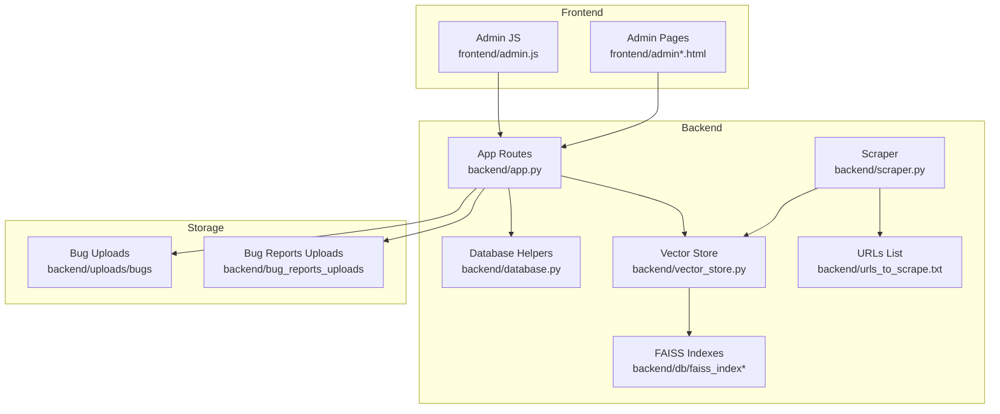
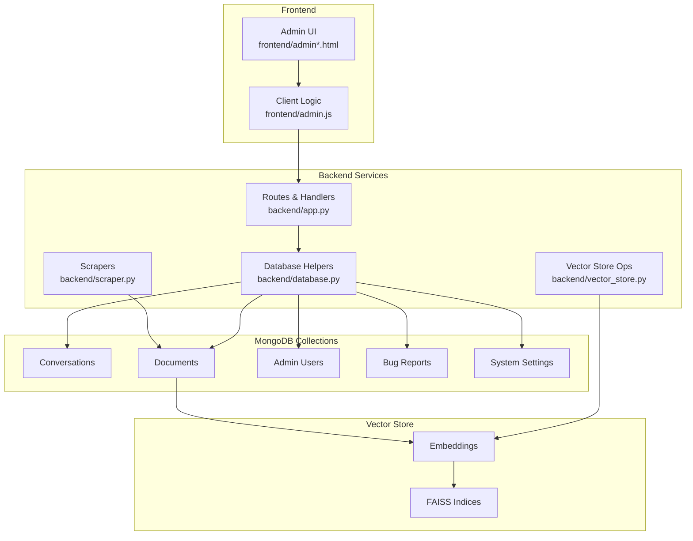
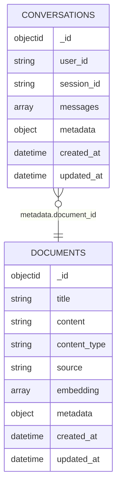
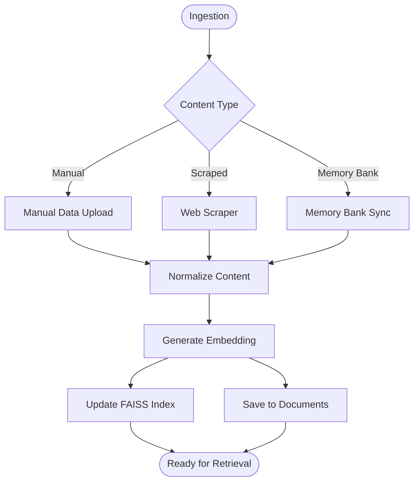
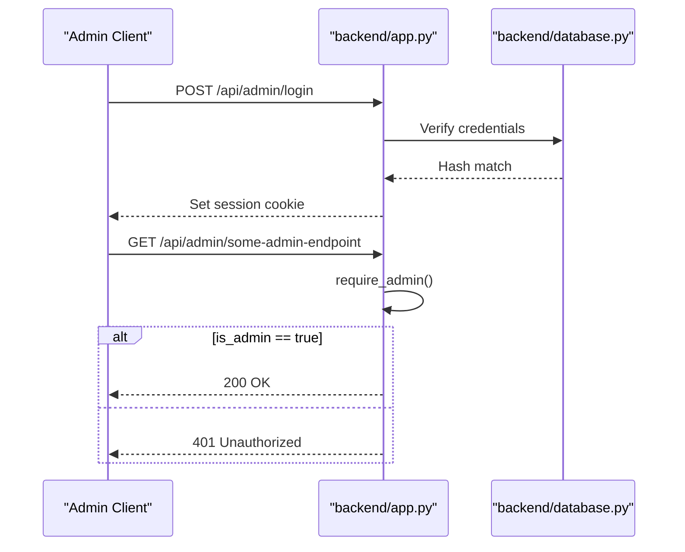
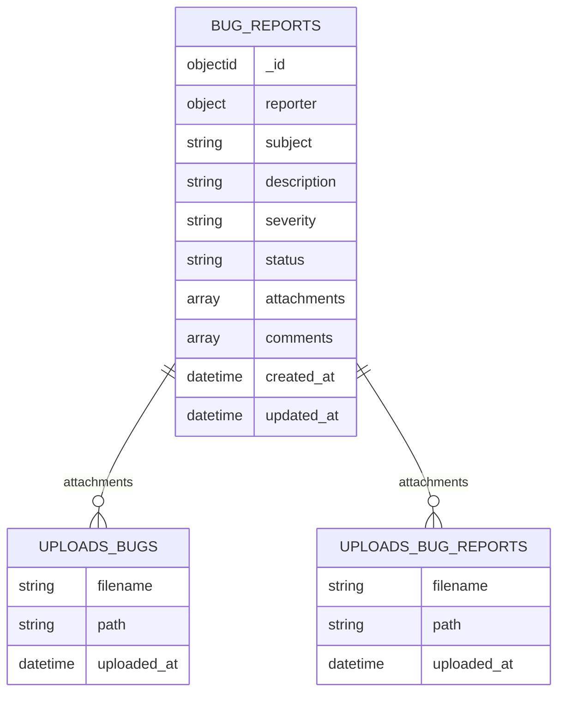
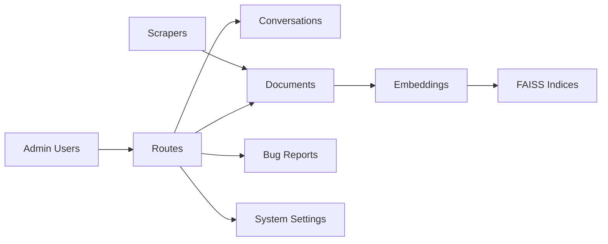

# Database Schema Design

<cite>
**Referenced Files in This Document**
- [backend/app.py](file://backend/app.py)
- [backend/database.py](file://backend/database.py)
- [backend/vector_store.py](file://backend/vector_store.py)
- [backend/scraper.py](file://backend/scraper.py)
- [backend/db/faiss_index](file://backend/db/faiss_index)
- [backend/db/faiss_index_scraped](file://backend/db/faiss_index_scraped)
- [frontend/admin.js](file://frontend/admin.js)
- [frontend/admin.html](file://frontend/admin.html)
- [frontend/admin.css](file://frontend/admin.css)
- [frontend/admin-data-bank.html](file://frontend/admin-data-bank.html)
- [frontend/admin-settings.html](file://frontend/admin-settings.html)
- [frontend/admin-bugs.html](file://frontend/admin-bugs.html)
- [frontend/admin-ai.html](file://frontend/admin-ai.html)
- [backend/urls_to_scrape.txt](file://backend/urls_to_scrape.txt)
- [backend/uploads/bugs](file://backend/uploads/bugs)
- [backend/bug_reports_uploads](file://backend/bug_reports_uploads)
</cite>

## Table of Contents
1. [Introduction](#introduction)
2. [Project Structure](#project-structure)
3. [Core Components](#core-components)
4. [Architecture Overview](#architecture-overview)
5. [Detailed Component Analysis](#detailed-component-analysis)
6. [Dependency Analysis](#dependency-analysis)
7. [Performance Considerations](#performance-considerations)
8. [Troubleshooting Guide](#troubleshooting-guide)
9. [Conclusion](#conclusion)
10. [Appendices](#appendices)

## Introduction
This document specifies the DamayAI-Assistant database schema and data model design. It focuses on MongoDB collections for conversations, documents, admin users, bug reports, and system settings, along with vector search indices and supporting infrastructure. It also covers entity relationships, field definitions, validation rules, indexing strategies, data access patterns, caching, lifecycle management, security, and operational procedures.

## Project Structure
The database-related components are primarily located under the backend directory, with supporting frontend assets and vector index storage:

- Backend server and routes: [backend/app.py](file://backend/app.py)
- Database connection and helpers: [backend/database.py](file://backend/database.py)
- Vector store and FAISS indices: [backend/vector_store.py](file://backend/vector_store.py), [backend/db/faiss_index](file://backend/db/faiss_index), [backend/db/faiss_index_scraped](file://backend/db/faiss_index_scraped)
- Web scraping pipeline: [backend/scraper.py](file://backend/scraper.py), [backend/urls_to_scrape.txt](file://backend/urls_to_scrape.txt)
- Frontend admin pages and client-side logic: [frontend/admin.html](file://frontend/admin.html), [frontend/admin.js](file://frontend/admin.js), [frontend/admin-data-bank.html](file://frontend/admin-data-bank.html), [frontend/admin-settings.html](file://frontend/admin-settings.html), [frontend/admin-bugs.html](file://frontend/admin-bugs.html), [frontend/admin-ai.html](file://frontend/admin-ai.html)
- Upload directories: [backend/uploads/bugs](file://backend/uploads/bugs), [backend/bug_reports_uploads](file://backend/bug_reports_uploads)

**Diagram sources**
- [backend/app.py](file://backend/app.py)
- [backend/database.py](file://backend/database.py)
- [backend/vector_store.py](file://backend/vector_store.py)
- [backend/scraper.py](file://backend/scraper.py)
- [backend/db/faiss_index](file://backend/db/faiss_index)
- [backend/db/faiss_index_scraped](file://backend/db/faiss_index_scraped)
- [frontend/admin.js](file://frontend/admin.js)
- [frontend/admin.html](file://frontend/admin.html)
- [backend/urls_to_scrape.txt](file://backend/urls_to_scrape.txt)
- [backend/uploads/bugs](file://backend/uploads/bugs)
- [backend/bug_reports_uploads](file://backend/bug_reports_uploads)

**Section sources**
- [backend/app.py](file://backend/app.py)
- [backend/database.py](file://backend/database.py)
- [backend/vector_store.py](file://backend/vector_store.py)
- [backend/scraper.py](file://backend/scraper.py)
- [backend/db/faiss_index](file://backend/db/faiss_index)
- [backend/db/faiss_index_scraped](file://backend/db/faiss_index_scraped)
- [frontend/admin.js](file://frontend/admin.js)
- [frontend/admin.html](file://frontend/admin.html)
- [backend/urls_to_scrape.txt](file://backend/urls_to_scrape.txt)
- [backend/uploads/bugs](file://backend/uploads/bugs)
- [backend/bug_reports_uploads](file://backend/bug_reports_uploads)

## Core Components
This section defines the primary MongoDB collections and their schemas, relationships, and validation rules.

### Conversations Collection
Purpose: Persist user-assisted conversations and chat history for retrieval and analysis.

Fields:
- _id: ObjectId
- user_id: string (indexed)
- session_id: string (indexed)
- messages: array of objects with:
  - role: string ("user" | "assistant")
  - content: string
  - timestamp: datetime
- metadata: object (optional)
  - tags: array of strings
  - source: string ("manual" | "scraped" | "memory_bank")
  - document_id: string (references documents._id)
- created_at: datetime
- updated_at: datetime

Validation rules:
- Required fields: user_id, session_id, messages
- Messages array must not be empty
- Role must be one of predefined values
- Timestamps must be ISODate

Indexes:
- Compound: {user_id, created_at}
- Compound: {session_id, created_at}
- Sparse text on metadata.tags for tag-based queries

Relationships:
- References documents via metadata.document_id for provenance

Lifecycle:
- Retention: configurable TTL on created_at; older records purged automatically
- Access pattern: per-session aggregation and pagination

**Section sources**
- [backend/database.py](file://backend/database.py)
- [backend/app.py](file://backend/app.py)

### Documents Collection
Purpose: Store ingested content (manual, scraped, memory bank) with embeddings and metadata.

Fields:
- _id: ObjectId
- title: string
- content: string
- content_type: string ("manual" | "scraped" | "memory_bank")
- source: string (URL or filename)
- embedding: vector (float[]) (indexed for ANN)
- metadata: object
  - category: string
  - tags: array of strings
  - author: string
  - created_at: datetime
  - processed_at: datetime
- created_at: datetime
- updated_at: datetime

Validation rules:
- Required: title, content, content_type, source
- Embedding length must match configured dimension
- Content type must be one of predefined values

Indexes:
- Text: title, content for hybrid search
- Vector: embedding with HNSW/IVF for approximate nearest neighbors
- Compound: {content_type, created_at}

Relationships:
- Conversations reference documents via metadata.document_id

Lifecycle:
- Retention: content-type specific policies
- Access pattern: vector similarity search, filtering by metadata

**Section sources**
- [backend/database.py](file://backend/database.py)
- [backend/vector_store.py](file://backend/vector_store.py)

### Admin Users Collection
Purpose: Manage administrative accounts and sessions.

Fields:
- _id: ObjectId
- username: string (unique)
- hashed_password: string
- salt: string
- roles: array of strings
- last_login: datetime
- is_active: boolean
- created_at: datetime
- updated_at: datetime

Validation rules:
- Required: username, hashed_password, salt
- Unique constraint on username
- Roles must be subset of allowed values

Indexes:
- Unique: username
- Compound: {username, is_active}

Security:
- Password hashing with salt stored separately
- Session-based access control enforced by middleware

**Section sources**
- [backend/app.py](file://backend/app.py)
- [backend/database.py](file://backend/database.py)

### Bug Reports Collection
Purpose: Track reported issues with attachments and status.

Fields:
- _id: ObjectId
- reporter: object
  - name: string
  - email: string
- subject: string
- description: string
- severity: string ("low" | "medium" | "high" | "critical")
- status: string ("open" | "in_progress" | "resolved" | "closed")
- attachments: array of objects
  - filename: string
  - path: string
  - uploaded_at: datetime
- comments: array of objects
  - author: string
  - text: string
  - timestamp: datetime
- created_at: datetime
- updated_at: datetime

Validation rules:
- Required: reporter.name, reporter.email, subject, description
- Severity and status must be from predefined sets

Indexes:
- Compound: {status, created_at}
- Compound: {severity, created_at}

Attachments:
- Stored under [backend/uploads/bugs](file://backend/uploads/bugs) and [backend/bug_reports_uploads](file://backend/bug_reports_uploads)

**Section sources**
- [backend/app.py](file://backend/app.py)
- [backend/database.py](file://backend/database.py)

### System Settings Collection
Purpose: Centralized configuration for runtime behavior.

Fields:
- _id: ObjectId
- key: string (unique)
- value: mixed (string | number | boolean | object)
- description: string
- category: string
- modified_by: string
- created_at: datetime
- updated_at: datetime

Validation rules:
- Required: key, value
- Unique constraint on key
- Category must be one of predefined groups

Indexes:
- Unique: key
- Compound: {category, created_at}

Access control:
- Requires admin session for updates

**Section sources**
- [backend/app.py](file://backend/app.py)
- [backend/database.py](file://backend/database.py)

## Architecture Overview
The system integrates MongoDB for structured data with FAISS for vector similarity search. Admin endpoints manage CRUD operations and enforce session-based access control. Scrapers populate the documents collection, which powers conversational retrieval.

**Diagram sources**
- [backend/app.py](file://backend/app.py)
- [backend/database.py](file://backend/database.py)
- [backend/vector_store.py](file://backend/vector_store.py)
- [backend/scraper.py](file://backend/scraper.py)
- [frontend/admin.js](file://frontend/admin.js)
- [frontend/admin.html](file://frontend/admin.html)

## Detailed Component Analysis

### Conversations Schema Details
- Purpose: Persist chat histories with optional document provenance
- Key fields: user_id, session_id, messages[], metadata.source, metadata.document_id
- Validation: role enumeration, non-empty messages, timestamps
- Indexing: per-user and per-session compound indexes; sparse text on tags
- Lifecycle: TTL on created_at; aggregation by session_id

**Diagram sources**
- [backend/database.py](file://backend/database.py)

**Section sources**
- [backend/database.py](file://backend/database.py)

### Documents Schema Details
- Purpose: Unified ingestion for manual, scraped, and memory bank content
- Key fields: title, content, content_type, source, embedding, metadata.*
- Validation: embedding dimension check, content type enumeration
- Indexing: text search on title/content; vector index for ANN
- Lifecycle: content-type retention policies; vector updates on re-ingest

**Diagram sources**
- [backend/vector_store.py](file://backend/vector_store.py)
- [backend/scraper.py](file://backend/scraper.py)
- [backend/database.py](file://backend/database.py)

**Section sources**
- [backend/vector_store.py](file://backend/vector_store.py)
- [backend/scraper.py](file://backend/scraper.py)
- [backend/database.py](file://backend/database.py)

### Admin Users Schema Details
- Purpose: Administrative access and audit trail
- Key fields: username, hashed_password, salt, roles[], last_login, is_active
- Validation: unique username, role enumeration
- Security: session-based protection enforced by decorator
- Access control: require_admin decorator blocks unauthenticated requests

**Diagram sources**
- [backend/app.py](file://backend/app.py)
- [backend/database.py](file://backend/database.py)

**Section sources**
- [backend/app.py](file://backend/app.py)
- [backend/database.py](file://backend/database.py)

### Bug Reports Schema Details
- Purpose: Issue tracking with attachments and comments
- Key fields: reporter.*, subject, description, severity, status, attachments[], comments[]
- Validation: enumerations for severity/status, required reporter fields
- Storage: files under uploads/bugs and bug_reports_uploads
- Indexing: status and severity combined with created_at

**Diagram sources**
- [backend/app.py](file://backend/app.py)
- [backend/uploads/bugs](file://backend/uploads/bugs)
- [backend/bug_reports_uploads](file://backend/bug_reports_uploads)

**Section sources**
- [backend/app.py](file://backend/app.py)
- [backend/uploads/bugs](file://backend/uploads/bugs)
- [backend/bug_reports_uploads](file://backend/bug_reports_uploads)

### System Settings Schema Details
- Purpose: Centralized configuration
- Key fields: key(unique), value(mixed), category, modified_by
- Validation: unique key, category enumeration
- Access control: admin-only updates via require_admin

**Section sources**
- [backend/app.py](file://backend/app.py)
- [backend/database.py](file://backend/database.py)

## Dependency Analysis
- Conversations depend on Documents for provenance
- Vector search depends on FAISS indices built from Documents embeddings
- Admin actions depend on Admin Users and session middleware
- Bug Reports depend on upload directories for attachments
- System Settings influence runtime behavior across services

**Diagram sources**
- [backend/app.py](file://backend/app.py)
- [backend/database.py](file://backend/database.py)
- [backend/vector_store.py](file://backend/vector_store.py)
- [backend/scraper.py](file://backend/scraper.py)

**Section sources**
- [backend/app.py](file://backend/app.py)
- [backend/database.py](file://backend/database.py)
- [backend/vector_store.py](file://backend/vector_store.py)
- [backend/scraper.py](file://backend/scraper.py)

## Performance Considerations
- Vector search:
  - Use HNSW or IVF index on embedding vectors
  - Maintain separate indices for manual vs scraped content
  - Precompute and cache top-k results for frequent queries
- Text search:
  - Combine text indexes with metadata filters for hybrid retrieval
- Indexing strategy:
  - Compound indexes on (user_id, created_at) and (session_id, created_at)
  - Sparse text index on tags for tag-based filtering
- Caching:
  - LRU cache for recent conversations and frequently accessed documents
  - Redis or in-memory cache for admin session tokens
- Concurrency:
  - Use capped collections for conversations to limit growth
  - Batch writes for embeddings during ingestion
- Monitoring:
  - Track query latency and index hit rates
  - Alert on FAISS index rebuild failures

[No sources needed since this section provides general guidance]

## Troubleshooting Guide
- Authentication failures:
  - Verify admin session cookie and require_admin decorator
  - Check username uniqueness and password hash verification
- Vector search errors:
  - Confirm embedding dimension matches index configuration
  - Rebuild FAISS indices after schema changes
- Attachment upload issues:
  - Validate upload directories permissions
  - Check file size limits and MIME types
- Conversation retrieval problems:
  - Ensure compound indexes exist for user_id/session_id
  - Verify TTL configuration for automatic cleanup

**Section sources**
- [backend/app.py](file://backend/app.py)
- [backend/database.py](file://backend/database.py)
- [backend/vector_store.py](file://backend/vector_store.py)

## Conclusion
The DamayAI-Assistant database schema centers on MongoDB collections for structured data and FAISS indices for vector search. Admin access control, robust validation, and strategic indexing enable efficient retrieval and scalable operations. Clear lifecycle and security policies support reliable, maintainable data management.

[No sources needed since this section summarizes without analyzing specific files]

## Appendices

### Sample Data Structures
- Conversation message element:
  - role: "user" | "assistant"
  - content: string
  - timestamp: datetime
- Document metadata:
  - category: string
  - tags: array of strings
  - author: string
  - created_at: datetime
  - processed_at: datetime
- Bug report attachment:
  - filename: string
  - path: string
  - uploaded_at: datetime

[No sources needed since this section provides general guidance]

### Query Examples
- Retrieve recent conversations for a session:
  - Filter: {session_id: "..."} and sort by created_at desc
- Find similar documents by embedding:
  - Vector search with top-k and metadata filters
- Get open bug reports with severity:
  - Filter: {status: "open"} and $or on severity
- List system settings by category:
  - Filter: {category: "..."} and sort by created_at desc

[No sources needed since this section provides general guidance]