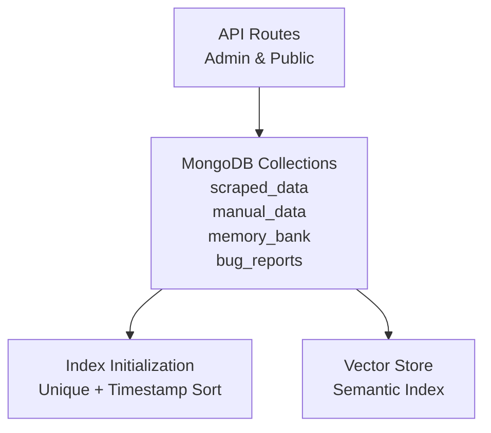
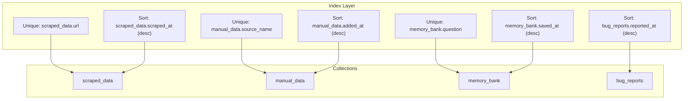
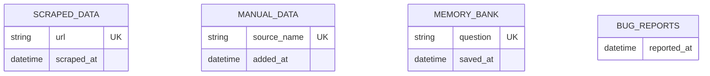
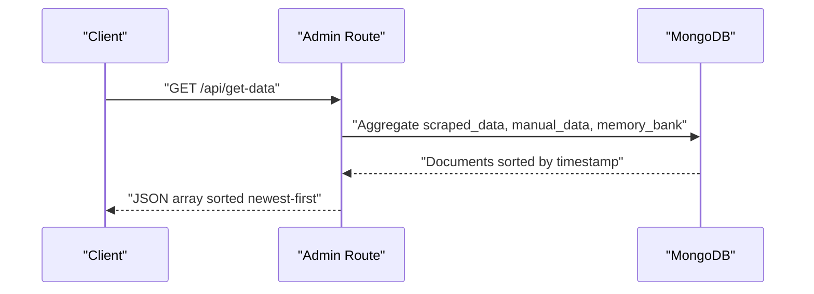
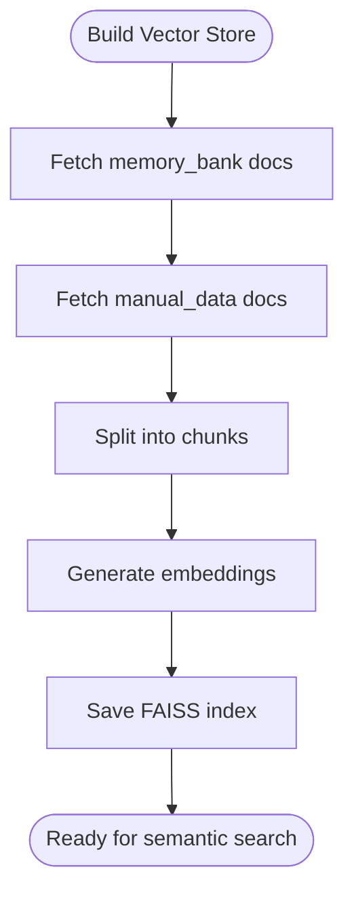
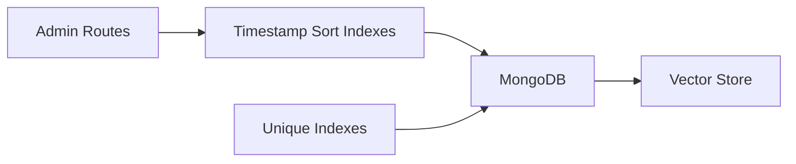

# Indexing Strategies

<cite>
**Referenced Files in This Document**
- [database.py](file://backend/database.py)
- [app.py](file://backend/app.py)
- [app.py](file://Local Settings/app.py)
- [vector_store.py](file://backend/vector_store.py)
</cite>

## Table of Contents
1. [Introduction](#introduction)
2. [Project Structure](#project-structure)
3. [Core Components](#core-components)
4. [Architecture Overview](#architecture-overview)
5. [Detailed Component Analysis](#detailed-component-analysis)
6. [Dependency Analysis](#dependency-analysis)
7. [Performance Considerations](#performance-considerations)
8. [Troubleshooting Guide](#troubleshooting-guide)
9. [Conclusion](#conclusion)
10. [Appendices](#appendices)

## Introduction
This document explains MongoDB indexing strategies used in DamayAI-Assistant, focusing on uniqueness guarantees and performance indexes for chatbot data. It covers:
- Unique indexes rationale for source_name (manual_data), question (memory_bank), and url (scraped_data)
- Performance indexes for timestamp-based sorting (added_at, saved_at, scraped_at, reported_at)
- Index creation syntax, maintenance procedures, and performance impact
- Compound indexes and their role in optimizing chatbot search performance
- Monitoring, maintenance tasks, and troubleshooting slow queries
- Guidelines for adding new indexes based on observed query patterns

## Project Structure
The indexing logic is centralized in the backend database module and leveraged by API routes and vectorization processes:
- Index initialization and CRUD operations are defined in the database module
- API routes trigger data retrieval and administrative actions that rely on indexes
- Vector store generation consumes indexed collections to build semantic indices

**Diagram sources**
- [database.py:27-49](file://backend/database.py#L27-L49)
- [app.py:848-888](file://backend/app.py#L848-L888)
- [vector_store.py:48-61](file://backend/vector_store.py#L48-L61)

**Section sources**
- [database.py:27-49](file://backend/database.py#L27-L49)
- [app.py:848-888](file://backend/app.py#L848-L888)
- [vector_store.py:48-61](file://backend/vector_store.py#L48-L61)

## Core Components
- Unique indexes
  - scraped_data.url: Ensures deduplication of scraped pages by URL
  - manual_data.source_name: Prevents duplicate manual sources by name
  - memory_bank.question: Prevents duplicate Q&A entries by question text
- Performance indexes
  - scraped_data.scraped_at (descending): Efficient chronological retrieval
  - manual_data.added_at (descending): Newest manual data first
  - memory_bank.saved_at (descending): Newest memory entries first
  - bug_reports.reported_at (descending): Newest bug reports first

These indexes are created during database initialization and support frequent queries that sort by timestamps and enforce uniqueness constraints.

**Section sources**
- [database.py:27-49](file://backend/database.py#L27-L49)

## Architecture Overview
The indexing architecture ensures:
- Uniqueness constraints prevent redundant data ingestion
- Timestamp-based indexes enable fast chronological queries
- Vector store generation consumes indexed collections to accelerate semantic search

**Diagram sources**
- [database.py:27-49](file://backend/database.py#L27-L49)

## Detailed Component Analysis

### Unique Indexes
- scraped_data.url
  - Purpose: Deduplicate web-scraped pages by URL
  - Creation: Unique ascending index on url
  - Impact: Prevents duplicate ingestion; supports upsert semantics
- manual_data.source_name
  - Purpose: Prevent duplicate manual sources by name
  - Creation: Unique ascending index on source_name
  - Impact: Ensures idempotent manual data uploads
- memory_bank.question
  - Purpose: Prevent duplicate Q&A entries
  - Creation: Unique ascending index on question
  - Impact: Guarantees canonical knowledge base entries

**Diagram sources**
- [database.py:32-47](file://backend/database.py#L32-L47)

**Section sources**
- [database.py:32-47](file://backend/database.py#L32-L47)

### Performance Indexes (Timestamp Sorting)
- scraped_data.scraped_at (descending)
  - Used by API route that aggregates and sorts all data by timestamp
  - Supports efficient reverse chronological ordering
- manual_data.added_at (descending)
  - Used by API route that retrieves all manual data ordered by insertion time
- memory_bank.saved_at (descending)
  - Used by API route that retrieves all memory data ordered by save time
- bug_reports.reported_at (descending)
  - Used by bug report listing and filtering

**Diagram sources**
- [app.py:848-888](file://backend/app.py#L848-L888)
- [database.py:80-83](file://backend/database.py#L80-L83)
- [database.py:124-127](file://backend/database.py#L124-L127)

**Section sources**
- [app.py:848-888](file://backend/app.py#L848-L888)
- [database.py:80-83](file://backend/database.py#L80-L83)
- [database.py:124-127](file://backend/database.py#L124-L127)

### Compound Indexes and Chatbot Search Optimization
- Current indexes are single-field (unique and timestamp). No explicit compound indexes are defined in the analyzed files.
- Chatbot search relies on vector embeddings generated from indexed collections:
  - Vector store creation pulls documents from memory_bank and manual_data
  - Semantic similarity search accelerates retrieval without relying on MongoDB compound indexes
- Recommendation: If future queries filter by question + category or similar composite predicates, introduce compound indexes accordingly.

**Diagram sources**
- [vector_store.py:48-61](file://backend/vector_store.py#L48-L61)
- [database.py:96-104](file://backend/database.py#L96-L104)
- [database.py:140-148](file://backend/database.py#L140-L148)

**Section sources**
- [vector_store.py:48-61](file://backend/vector_store.py#L48-L61)
- [database.py:96-104](file://backend/database.py#L96-L104)
- [database.py:140-148](file://backend/database.py#L140-L148)

### Index Creation Syntax
- Unique ascending index on url for scraped_data
- Unique ascending index on source_name for manual_data
- Unique ascending index on question for memory_bank
- Descending index on scraped_at for scraped_data
- Descending index on added_at for manual_data
- Descending index on saved_at for memory_bank
- Descending index on reported_at for bug_reports

These statements are executed during database initialization.

**Section sources**
- [database.py:27-49](file://backend/database.py#L27-L49)

### Maintenance Procedures
- Rebuild vector indices after data changes:
  - Admin endpoint triggers vector store regeneration and cache invalidation
- Periodic review:
  - Monitor query plans and slow queries
  - Evaluate necessity of additional compound indexes based on observed predicates
- Operational safeguards:
  - Use upsert with unique keys to avoid duplicates
  - Keep timestamp fields updated consistently for accurate sorting

**Section sources**
- [app.py:848-858](file://backend/app.py#L848-L858)

## Dependency Analysis
- API routes depend on timestamp indexes for efficient sorting
- Vector store depends on indexed collections for embedding generation
- Unique indexes prevent data integrity issues that could degrade downstream performance

**Diagram sources**
- [app.py:848-888](file://backend/app.py#L848-L888)
- [database.py:27-49](file://backend/database.py#L27-L49)
- [vector_store.py:48-61](file://backend/vector_store.py#L48-L61)

**Section sources**
- [app.py:848-888](file://backend/app.py#L848-L888)
- [database.py:27-49](file://backend/database.py#L27-L49)
- [vector_store.py:48-61](file://backend/vector_store.py#L48-L61)

## Performance Considerations
- Index selection
  - Single-field unique and descending timestamp indexes are optimal for current workload
- Query patterns
  - Reverse chronological sorting is common; descending sort indexes align with these patterns
- Vectorization overhead
  - Embedding and FAISS index operations dominate chatbot search performance; ensure adequate compute resources
- Write amplification
  - Unique indexes may increase write costs slightly due to duplicate checks; acceptable given data volume

[No sources needed since this section provides general guidance]

## Troubleshooting Guide
- Slow chronological queries
  - Verify descending timestamp indexes exist and are being used
  - Confirm queries do not inadvertently bypass sort stages
- Duplicate ingestion errors
  - Unique index violations indicate attempts to insert existing unique keys
  - Use upsert semantics or ensure unique key correctness
- Vector search slowness
  - Rebuild vector indices via admin endpoint
  - Validate embedding model and index persistence paths
- Monitoring
  - Use database profiling and explain plans to identify missing indexes
  - Track query latency and re-index as needed

**Section sources**
- [database.py:27-49](file://backend/database.py#L27-L49)
- [app.py:848-858](file://backend/app.py#L848-L858)

## Conclusion
The current indexing strategy balances data integrity and performance:
- Unique indexes prevent redundancy across key entities
- Descending timestamp indexes support efficient chronological queries
- Vector store generation leverages indexed collections for semantic search
Future enhancements may include compound indexes aligned with evolving query patterns, while maintaining focus on vectorization performance.

[No sources needed since this section summarizes without analyzing specific files]

## Appendices

### Index Inventory
- scraped_data
  - Unique: url
  - Sort: scraped_at (desc)
- manual_data
  - Unique: source_name
  - Sort: added_at (desc)
- memory_bank
  - Unique: question
  - Sort: saved_at (desc)
- bug_reports
  - Sort: reported_at (desc)

**Section sources**
- [database.py:27-49](file://backend/database.py#L27-L49)

### Adding New Indexes Based on Query Patterns
- Identify frequent filters and sorts
- Prefer single-field indexes for unique constraints and timestamp sorts
- Consider compound indexes only when composite predicates appear regularly
- Test with explain plans and monitor query performance post-creation
- Rebuild vector indices after significant data changes

[No sources needed since this section provides general guidance]