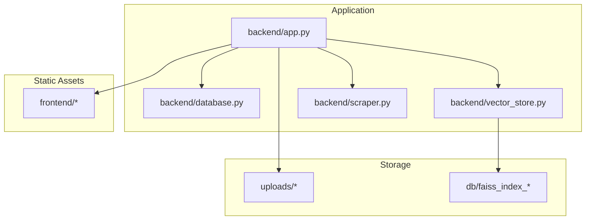
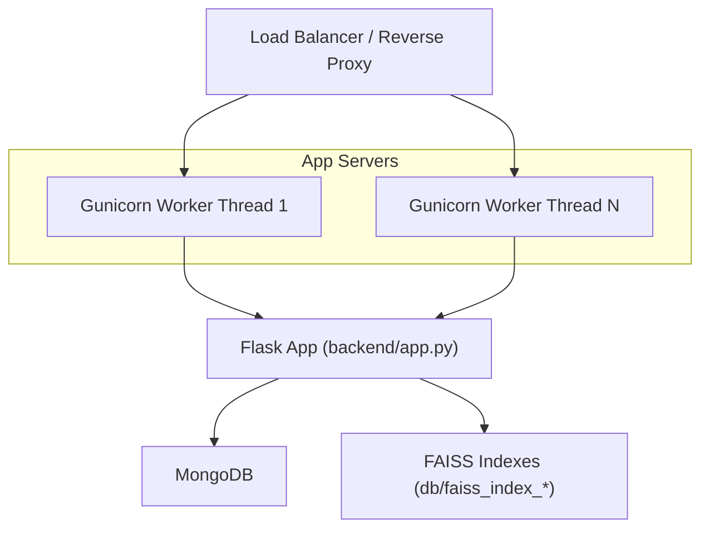
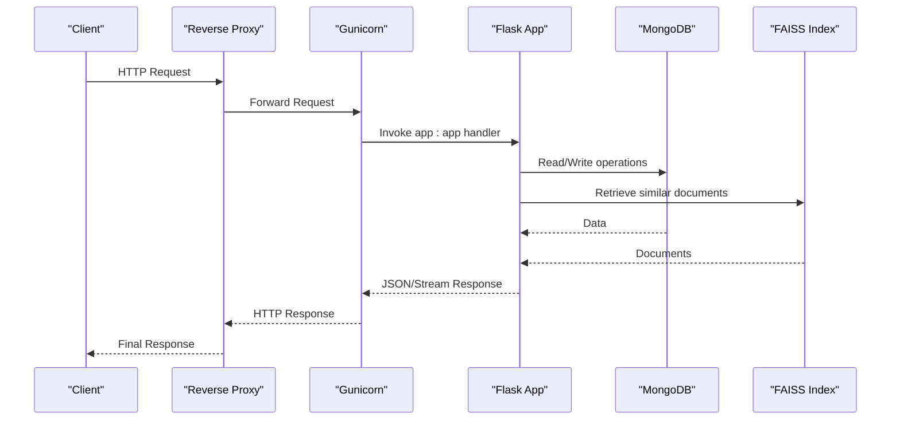
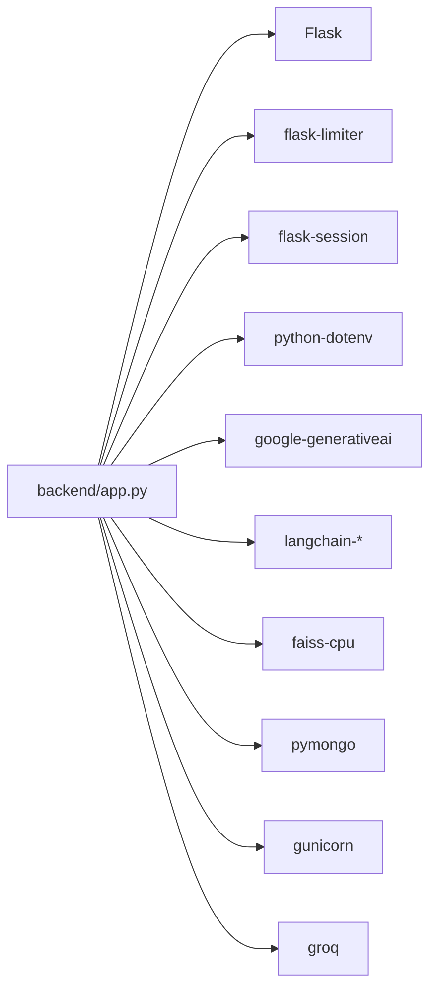

# Deployment Guide

<cite>
**Referenced Files in This Document**
- [requirements.txt](file://requirements.txt)
- [Procfile](file://Procfile)
- [backend/app.py](file://backend/app.py)
- [backend/database.py](file://backend/database.py)
- [backend/vector_store.py](file://backend/vector_store.py)
- [backend/scraper.py](file://backend/scraper.py)
- [Local Settings/app.py](file://Local Settings/app.py)
</cite>

## Table of Contents
1. [Introduction](#introduction)
2. [Project Structure](#project-structure)
3. [Core Components](#core-components)
4. [Architecture Overview](#architecture-overview)
5. [Detailed Component Analysis](#detailed-component-analysis)
6. [Dependency Analysis](#dependency-analysis)
7. [Performance Considerations](#performance-considerations)
8. [Troubleshooting Guide](#troubleshooting-guide)
9. [Conclusion](#conclusion)
10. [Appendices](#appendices)

## Introduction
This guide provides production-grade deployment instructions for DamayAI-Assistant. It covers environment configuration, dependency management, infrastructure setup, Gunicorn WSGI server configuration, process management, scaling, database and FAISS index deployment, environment variable handling, containerization, cloud deployment, load balancing and reverse proxy configuration, SSL/TLS setup, monitoring and logging, deployment automation, rollback procedures, and maintenance workflows.

## Project Structure
The application is organized into:
- backend: Python Flask application, vector store, database, and scraping utilities
- frontend: Static assets served by the Flask app
- uploads: File upload storage for bug reports and manual data
- db: FAISS index storage directories
- Local Settings: Legacy development configuration file
- requirements.txt: Python dependencies
- Procfile: Production process definition for platforms like Heroku

**Diagram sources**
- [backend/app.py](file://backend/app.py)
- [backend/database.py](file://backend/database.py)
- [backend/vector_store.py](file://backend/vector_store.py)
- [backend/scraper.py](file://backend/scraper.py)

**Section sources**
- [Procfile](file://Procfile)
- [requirements.txt](file://requirements.txt)

## Core Components
- Flask application with rate limiting, CSRF protection, and security headers
- MongoDB-backed persistence for scraped, manual, memory, and bug report data
- FAISS vector stores for semantic retrieval across three data domains
- Web scraping pipeline for ingesting external content
- Gunicorn WSGI configuration for production hosting

Key runtime behaviors:
- Environment variables are loaded via python-dotenv
- MongoDB connection and indexes are initialized at startup
- FAISS indexes are auto-rebuilt if missing and cached for performance
- Chat endpoint streams intermediate steps and final answers

**Section sources**
- [backend/app.py](file://backend/app.py)
- [backend/database.py](file://backend/database.py)
- [backend/vector_store.py](file://backend/vector_store.py)
- [backend/scraper.py](file://backend/scraper.py)

## Architecture Overview
Production architecture integrates Flask, Gunicorn, MongoDB, and FAISS. The Flask app serves static frontend assets and exposes REST APIs. Gunicorn runs multiple worker threads behind a reverse proxy. MongoDB persists structured data, while FAISS indexes enable fast similarity search.

**Diagram sources**
- [Procfile](file://Procfile)
- [backend/app.py](file://backend/app.py)
- [backend/database.py](file://backend/database.py)
- [backend/vector_store.py](file://backend/vector_store.py)

## Detailed Component Analysis

### Environment Variables and Secrets
Critical environment variables used by the application:
- SECRET_KEY: Flask secret key for sessions and CSRF tokens
- GROQ_API_KEY: API key for Groq LLM provider
- ADMIN_PASSWORD or ADMIN_PASSWORD_HASH: Admin authentication credentials
- MONGO_URI: MongoDB connection string
- DB_NAME: Optional database name (defaults applied in code)

Secret management recommendations:
- Store secrets outside version control (use OS-level secret managers or platform vaults)
- Rotate keys regularly and enforce least privilege
- Avoid committing .env files to repositories

Configuration loading and validation:
- Environment variables are loaded at process start
- Missing SECRET_KEY causes immediate failure
- Missing GROQ_API_KEY logs a warning but initializes client

**Section sources**
- [backend/app.py](file://backend/app.py)
- [backend/database.py](file://backend/database.py)

### Gunicorn WSGI Server Configuration
- Command: gunicorn with thread workers and configurable threads
- Binding: 0.0.0.0:5000
- Application entry: app:app (Flask application factory)
- Worker class: gthread
- Threads per worker: 4 (as defined in Procfile)

Scaling considerations:
- Increase worker count horizontally behind a load balancer
- Adjust threads per worker based on CPU and I/O characteristics
- Monitor memory usage; consider process-based workers if memory pressure is observed

**Diagram sources**
- [Procfile](file://Procfile)
- [backend/app.py](file://backend/app.py)
- [backend/database.py](file://backend/database.py)
- [backend/vector_store.py](file://backend/vector_store.py)

**Section sources**
- [Procfile](file://Procfile)
- [backend/app.py](file://backend/app.py)

### Database Deployment Requirements (MongoDB)
- Connection: MONGO_URI must be set; DB_NAME defaults to a specific value if unset
- Initialization: Indexes are created on startup for uniqueness and performance
- Collections:
  - scraped_data: unique URL, timestamps
  - manual_data: unique source_name, timestamps
  - memory_bank: unique question, timestamps
  - bug_reports: timestamps and status

Operational notes:
- Ensure network accessibility and firewall rules
- Use replica sets or managed MongoDB for high availability
- Back up regularly and test restore procedures

**Section sources**
- [backend/database.py](file://backend/database.py)

### FAISS Index Deployment
- Paths: Three separate FAISS directories under db/
  - db/faiss_index_memory
  - db/faiss_index_manual
  - db/faiss_index_scraped
- Embedding model: sentence-transformers/all-MiniLM-L6-v2 via LangChain
- Auto-reindex on startup if any index is missing
- Retrievers are cached module-wide to avoid repeated disk reads

Maintenance:
- Delete FAISS indexes via API to trigger rebuild
- Rebuild indexes using the reindex endpoint
- Ensure sufficient disk space for indexes

**Section sources**
- [backend/vector_store.py](file://backend/vector_store.py)
- [backend/app.py](file://backend/app.py)

### Web Scraping Pipeline
- Safe URL filtering to prevent SSRF
- Content extraction with Trafilatura and BeautifulSoup
- Image selection prioritization (OpenGraph then first content image)
- Rate-limiting and timeouts enforced

Operational guidance:
- Keep urls_to_scrape.txt curated and validated
- Monitor scrape logs and handle failures gracefully
- Respect robots.txt and rate limits of target sites

**Section sources**
- [backend/scraper.py](file://backend/scraper.py)

### Reverse Proxy and Load Balancing
- Bind address 0.0.0.0:5000 implies external exposure behind a reverse proxy
- Recommended reverse proxy configuration:
  - TLS termination with valid certificates
  - Health checks pointing to a lightweight route (e.g., /)
  - Sticky sessions optional (Flask sessions are cookie-based)
  - Timeouts aligned with application streaming behavior
- Load balancer placement:
  - Place multiple Gunicorn instances behind a load balancer
  - Use health checks and auto-healing policies

[No sources needed since this section provides general guidance]

### SSL/TLS Setup
- Terminate TLS at the reverse proxy or platform ingress controller
- Use strong ciphers and protocols (TLS 1.2+)
- Configure certificate renewal and rotation procedures
- Redirect HTTP to HTTPS

[No sources needed since this section provides general guidance]

### Monitoring, Logging, and Alerting
- Audit logging:
  - Dedicated audit logger with console and optional file handler
  - Logs administrative actions and failed attempts
- Application logs:
  - Standard Gunicorn access/error logs
  - Structured JSON logs recommended for centralized logging
- Metrics:
  - Track request latency, throughput, error rates
  - Monitor MongoDB and FAISS performance
- Alerting:
  - Set thresholds for error rates, latency, and resource utilization
  - Notify on database connectivity issues and missing FAISS indexes

**Section sources**
- [backend/app.py](file://backend/app.py)

### Containerization Options
- Base image: python:3.x slim
- Install system dependencies as needed (e.g., for FAISS)
- Copy application code and install Python dependencies from requirements.txt
- Expose port 5000
- Entrypoint: gunicorn with command from Procfile
- Mount persistent volumes for:
  - uploads directory
  - db/faiss_index_* directories

[No sources needed since this section provides general guidance]

### Cloud Platform Deployment Guides
- Heroku:
  - Use the Procfile to define web dynos
  - Set config vars for environment variables
  - Provision MongoDB Atlas and FAISS index persistence
- AWS/Azure/GCP:
  - Deploy on ECS/EKS/App Engine with managed MongoDB
  - Use managed file systems or object storage for uploads
  - Configure autoscaling based on CPU and request metrics

[No sources needed since this section provides general guidance]

### Deployment Automation and Rollback
- CI/CD pipeline:
  - Build container image
  - Run tests and linting
  - Deploy to staging, then production
- Rollback:
  - Keep previous container image tagged
  - Re-deploy on failure with health checks
  - Revert configuration changes atomically
- Maintenance windows:
  - Schedule reindexing during low traffic
  - Coordinate database migrations with zero-downtime strategies

[No sources needed since this section provides general guidance]

## Dependency Analysis
Runtime dependencies include Flask, Flask extensions, rate limiting, LangChain, FAISS, MongoDB driver, Groq SDK, and related utilities. These are declared in requirements.txt.

**Diagram sources**
- [requirements.txt](file://requirements.txt)
- [backend/app.py](file://backend/app.py)

**Section sources**
- [requirements.txt](file://requirements.txt)

## Performance Considerations
- Gunicorn tuning:
  - Worker count: 2–4 per CPU core depending on workload
  - Threads per worker: 2–8; adjust based on I/O vs CPU bound tasks
- FAISS caching:
  - Module-level retriever cache reduces repeated disk loads
  - Invalidate cache after reindexing
- MongoDB:
  - Use connection pooling and keep-alive
  - Ensure proper indexing for queries
- Streaming responses:
  - NDJSON streaming for long-running chats
  - Configure reverse proxy buffering appropriately
- Disk I/O:
  - Store FAISS indexes on SSD-backed persistent volumes
  - Monitor free space and pre-warm indexes

[No sources needed since this section provides general guidance]

## Troubleshooting Guide
Common issues and resolutions:
- Missing SECRET_KEY:
  - Symptom: Immediate startup failure
  - Action: Set SECRET_KEY and restart
- Missing GROQ_API_KEY:
  - Symptom: Warning at startup; LLM calls may fail
  - Action: Provide valid API key
- MongoDB connection errors:
  - Symptom: Database initialization failure
  - Action: Verify MONGO_URI and network connectivity
- FAISS index missing or corrupted:
  - Symptom: Retrieval failures or slow startup
  - Action: Trigger reindex via API or delete indexes to auto-rebuild
- Large file uploads:
  - Symptom: 413 Entity Too Large
  - Action: Reduce file size or adjust limits
- Rate limiting:
  - Symptom: 429 responses
  - Action: Increase limits or reduce client-side polling
- Reverse proxy timeouts:
  - Symptom: Stream truncation
  - Action: Increase proxy timeouts and buffer settings

**Section sources**
- [backend/app.py](file://backend/app.py)
- [backend/database.py](file://backend/database.py)
- [backend/vector_store.py](file://backend/vector_store.py)

## Conclusion
This guide outlines a robust, production-ready deployment for DamayAI-Assistant. By securing environment variables, configuring Gunicorn and reverse proxies, deploying MongoDB and FAISS indexes, and establishing monitoring and automation, you can achieve reliable operation at scale.

## Appendices

### Environment Variable Reference
- SECRET_KEY: Flask secret key
- GROQ_API_KEY: Groq API key
- ADMIN_PASSWORD or ADMIN_PASSWORD_HASH: Admin credentials
- MONGO_URI: MongoDB connection string
- DB_NAME: Database name (default applied if unset)

**Section sources**
- [backend/app.py](file://backend/app.py)
- [backend/database.py](file://backend/database.py)