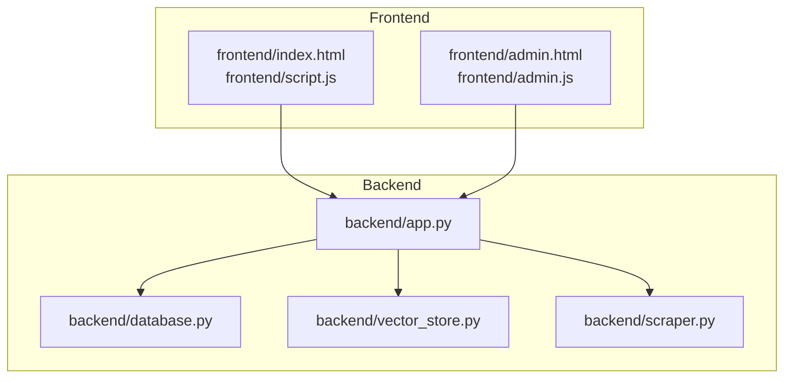
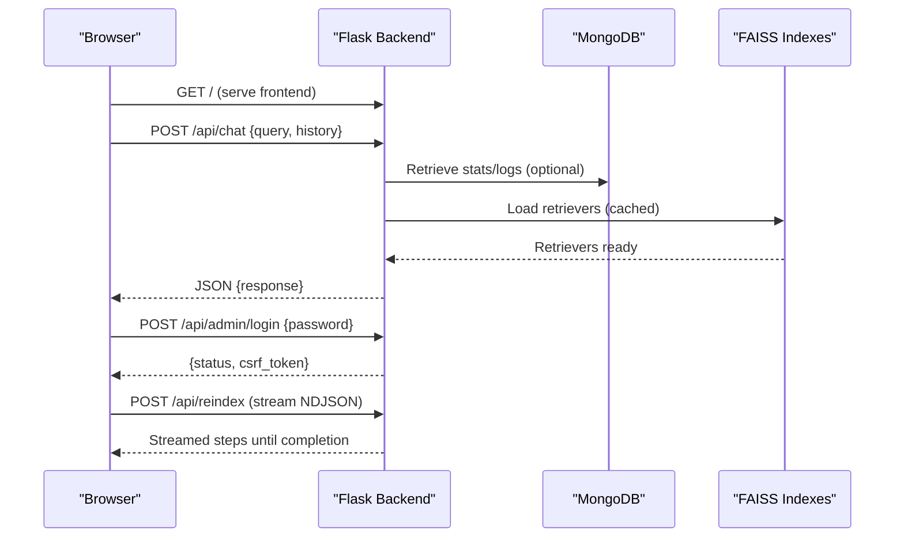
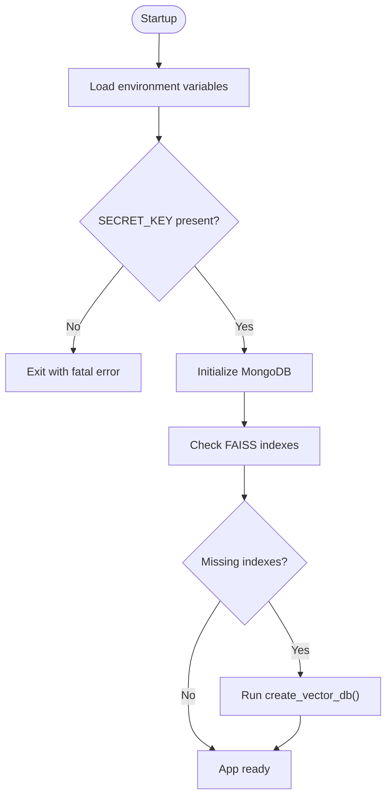
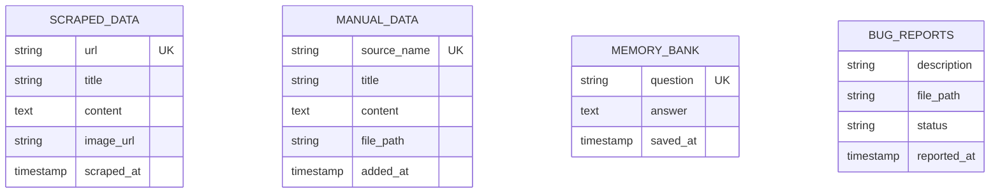
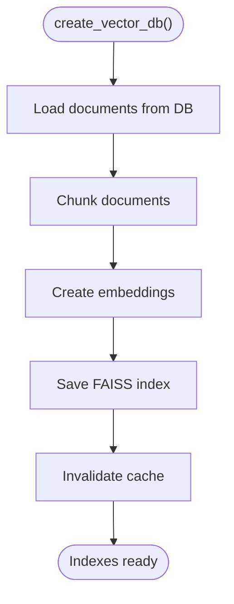
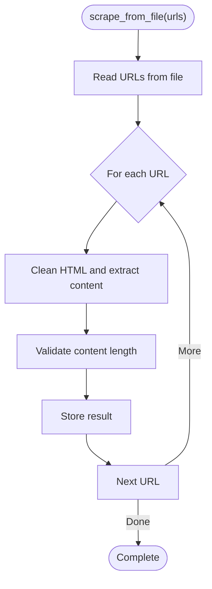
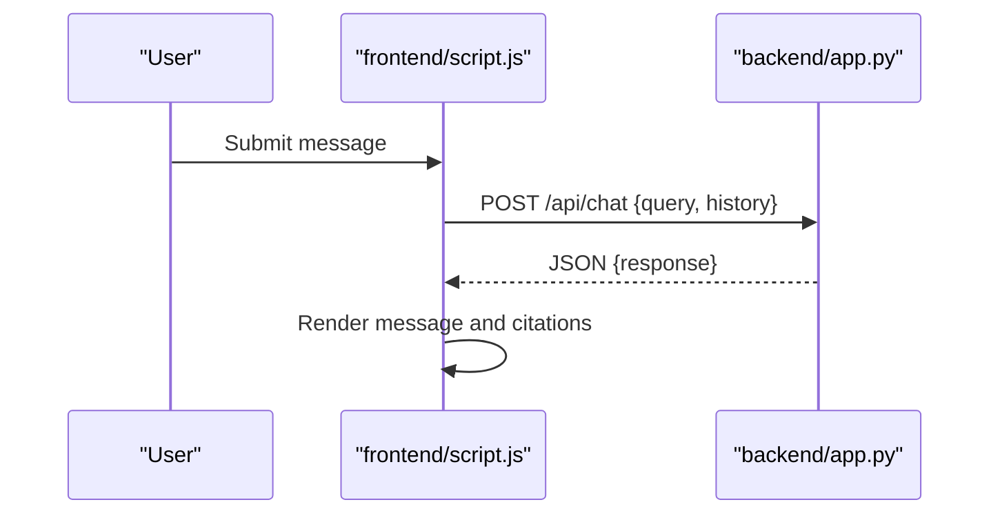
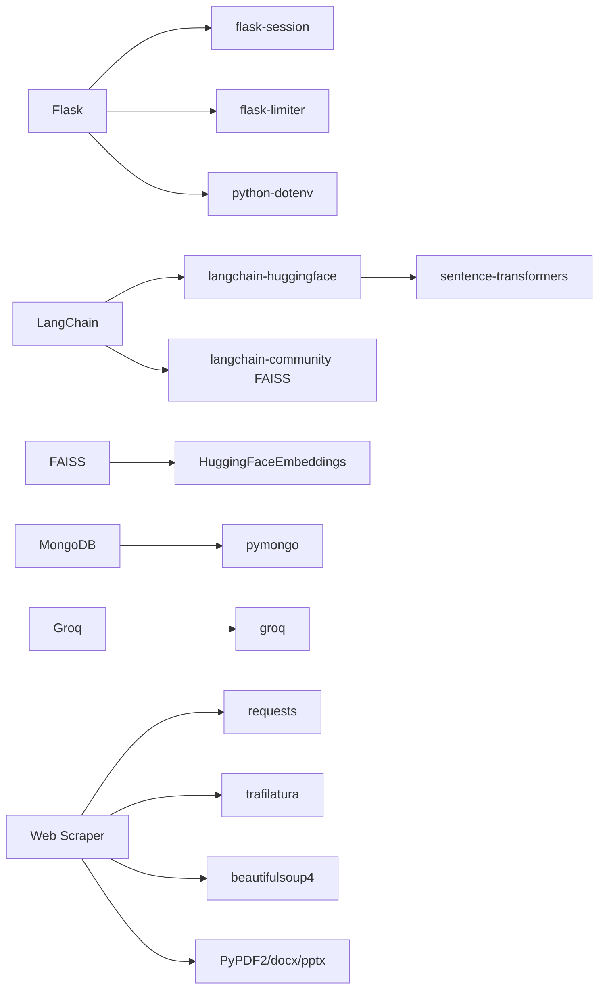

# Development Setup

<cite>
**Referenced Files in This Document**
- [requirements.txt](file://requirements.txt)
- [Procfile](file://Procfile)
- [backend/app.py](file://backend/app.py)
- [backend/database.py](file://backend/database.py)
- [backend/vector_store.py](file://backend/vector_store.py)
- [backend/scraper.py](file://backend/scraper.py)
- [frontend/index.html](file://frontend/index.html)
- [frontend/script.js](file://frontend/script.js)
- [frontend/admin.html](file://frontend/admin.html)
- [frontend/admin.js](file://frontend/admin.js)
</cite>

## Table of Contents
1. [Introduction](#introduction)
2. [Project Structure](#project-structure)
3. [Core Components](#core-components)
4. [Architecture Overview](#architecture-overview)
5. [Detailed Component Analysis](#detailed-component-analysis)
6. [Dependency Analysis](#dependency-analysis)
7. [Performance Considerations](#performance-considerations)
8. [Troubleshooting Guide](#troubleshooting-guide)
9. [Conclusion](#conclusion)
10. [Appendices](#appendices)

## Introduction
This document provides a comprehensive guide for setting up a local development environment for DamayAI-Assistant contributors. It covers Python virtual environment setup, dependency installation, IDE configuration recommendations, code structure conventions, development workflow, testing strategies, debugging and logging configuration, development tools, contribution and code review practices, local testing procedures, database and vector store configuration, AI model testing, troubleshooting, and the build and development server configuration.

## Project Structure
The project is organized into a backend (Python Flask) and a frontend (static HTML/CSS/JS). The backend exposes REST APIs consumed by the frontend, manages a MongoDB database, and maintains FAISS vector indexes for retrieval-augmented generation (RAG). The frontend consists of:
- Public chat interface
- Admin dashboard for content management and system controls
- Static assets served by the Flask app

**Diagram sources**
- [backend/app.py:1-120](file://backend/app.py#L1-L120)
- [backend/database.py:1-50](file://backend/database.py#L1-L50)
- [backend/vector_store.py:1-40](file://backend/vector_store.py#L1-L40)
- [backend/scraper.py:1-40](file://backend/scraper.py#L1-L40)
- [frontend/index.html:1-40](file://frontend/index.html#L1-L40)
- [frontend/admin.html:1-40](file://frontend/admin.html#L1-L40)

**Section sources**
- [backend/app.py:1-120](file://backend/app.py#L1-L120)
- [frontend/index.html:1-40](file://frontend/index.html#L1-L40)
- [frontend/admin.html:1-40](file://frontend/admin.html#L1-L40)

## Core Components
- Flask application with rate limiting, CSRF protection, and security headers
- MongoDB integration for persistent storage
- FAISS-based vector store for RAG
- Web scraper for ingesting external content
- Frontend chat and admin interfaces

Key responsibilities:
- backend/app.py: Application entrypoint, routes, middleware, security, and orchestration
- backend/database.py: MongoDB connection, indexes, and CRUD helpers
- backend/vector_store.py: FAISS index creation, caching, and retriever loading
- backend/scraper.py: Safe web scraping and content extraction
- frontend/script.js and frontend/admin.js: Client-side logic for chat and admin actions

**Section sources**
- [backend/app.py:1-120](file://backend/app.py#L1-L120)
- [backend/database.py:1-50](file://backend/database.py#L1-L50)
- [backend/vector_store.py:1-40](file://backend/vector_store.py#L1-L40)
- [backend/scraper.py:1-40](file://backend/scraper.py#L1-L40)
- [frontend/script.js:1-40](file://frontend/script.js#L1-L40)
- [frontend/admin.js:1-40](file://frontend/admin.js#L1-L40)

## Architecture Overview
The system follows a client-server pattern:
- The Flask backend serves static files from the frontend directory and exposes REST endpoints for chat, admin actions, and data management.
- The admin dashboard streams NDJSON responses for long-running tasks (scrape, crawl, reindex).
- Vector retrieval is performed using FAISS retrievers loaded once and cached.

**Diagram sources**
- [backend/app.py:432-453](file://backend/app.py#L432-L453)
- [backend/app.py:331-366](file://backend/app.py#L331-L366)
- [backend/app.py:763-784](file://backend/app.py#L763-L784)
- [backend/vector_store.py:73-115](file://backend/vector_store.py#L73-L115)
- [frontend/script.js:78-111](file://frontend/script.js#L78-L111)
- [frontend/admin.js:255-318](file://frontend/admin.js#L255-L318)

## Detailed Component Analysis

### Backend Application (Flask)
Responsibilities:
- Environment configuration and secret keys
- Rate limiting, CSRF protection, and security headers
- Admin authentication and session management
- Chat endpoint with streaming NDJSON responses
- Admin-only endpoints for data management and maintenance

Security and safety features:
- Secret key enforcement with fatal exit if missing
- CSRF token generation/validation and decorator enforcement
- Input sanitization and length limits
- ObjectId validation for MongoDB IDs
- Audit logging to console and file

Development server:
- Uses Flask dev server locally; production deployment via Procfile with Gunicorn

**Diagram sources**
- [backend/app.py:29-81](file://backend/app.py#L29-L81)
- [backend/app.py:220-237](file://backend/app.py#L220-L237)

**Section sources**
- [backend/app.py:29-116](file://backend/app.py#L29-L116)
- [backend/app.py:137-159](file://backend/app.py#L137-L159)
- [backend/app.py:240-304](file://backend/app.py#L240-L304)
- [backend/app.py:331-366](file://backend/app.py#L331-L366)
- [backend/app.py:432-453](file://backend/app.py#L432-L453)
- [backend/app.py:763-784](file://backend/app.py#L763-L784)

### Database Layer (MongoDB)
Responsibilities:
- Centralized connection and initialization
- Unique indexes for data integrity
- CRUD operations for manual data, memory bank, scraped data, and bug reports
- Dashboard statistics aggregation

**Diagram sources**
- [backend/database.py:31-47](file://backend/database.py#L31-L47)

**Section sources**
- [backend/database.py:18-49](file://backend/database.py#L18-L49)
- [backend/database.py:61-104](file://backend/database.py#L61-L104)
- [backend/database.py:108-148](file://backend/database.py#L108-L148)
- [backend/database.py:152-195](file://backend/database.py#L152-L195)
- [backend/database.py:199-243](file://backend/database.py#L199-L243)

### Vector Store (FAISS)
Responsibilities:
- Create three separate FAISS indexes for memory, manual, and scraped data
- Chunking and embedding with sentence-transformers/Hugging Face
- Cached retrievers to avoid reloading on each request
- Rebuild and deletion endpoints for maintenance

**Diagram sources**
- [backend/vector_store.py:48-71](file://backend/vector_store.py#L48-L71)

**Section sources**
- [backend/vector_store.py:1-40](file://backend/vector_store.py#L1-L40)
- [backend/vector_store.py:48-71](file://backend/vector_store.py#L48-L71)
- [backend/vector_store.py:73-115](file://backend/vector_store.py#L73-L115)

### Scraper
Responsibilities:
- Safe URL validation and SSRF protection
- HTML cleaning and content extraction
- Thumbnail selection prioritization
- Batch URL scraping and deep crawling with constraints

**Diagram sources**
- [backend/scraper.py:152-167](file://backend/scraper.py#L152-L167)

**Section sources**
- [backend/scraper.py:12-27](file://backend/scraper.py#L12-L27)
- [backend/scraper.py:83-148](file://backend/scraper.py#L83-L148)
- [backend/scraper.py:168-277](file://backend/scraper.py#L168-L277)

### Frontend Interfaces
- Public chat: Sends queries to /api/chat and displays responses with citations and images
- Admin dashboard: Handles authentication, data management, bug reports, and system maintenance (scrape, crawl, reindex)

**Diagram sources**
- [frontend/script.js:78-111](file://frontend/script.js#L78-L111)
- [backend/app.py:432-453](file://backend/app.py#L432-L453)

**Section sources**
- [frontend/index.html:1-40](file://frontend/index.html#L1-L40)
- [frontend/script.js:78-111](file://frontend/script.js#L78-L111)
- [frontend/admin.html:1-40](file://frontend/admin.html#L1-L40)
- [frontend/admin.js:163-191](file://frontend/admin.js#L163-L191)

## Dependency Analysis
External libraries and integrations:
- Flask and extensions for routing, sessions, rate limiting, and environment variables
- LangChain ecosystem for embeddings and FAISS
- Sentence-transformers for local embeddings
- MongoDB driver for persistence
- Groq client for LLM interactions
- Web scraping and parsing libraries

**Diagram sources**
- [requirements.txt:1-30](file://requirements.txt#L1-L30)
- [backend/vector_store.py:1-12](file://backend/vector_store.py#L1-L12)
- [backend/app.py:9-30](file://backend/app.py#L9-L30)

**Section sources**
- [requirements.txt:1-30](file://requirements.txt#L1-L30)
- [backend/vector_store.py:1-12](file://backend/vector_store.py#L1-L12)
- [backend/app.py:9-30](file://backend/app.py#L9-L30)

## Performance Considerations
- FAISS retrievers are cached to avoid repeated disk reads
- Rate limiting reduces load on endpoints
- Input sanitization and length limits prevent abuse
- Streaming NDJSON for long-running admin tasks improves UX

Recommendations:
- Monitor FAISS index sizes and rebuild periodically
- Use appropriate chunk sizes and overlap for embeddings
- Ensure MongoDB indexes are maintained for query performance
- Consider scaling horizontally with Gunicorn workers for production

**Section sources**
- [backend/vector_store.py:14-21](file://backend/vector_store.py#L14-L21)
- [backend/vector_store.py:73-115](file://backend/vector_store.py#L73-L115)
- [backend/app.py:98-116](file://backend/app.py#L98-L116)
- [backend/app.py:179-218](file://backend/app.py#L179-L218)

## Troubleshooting Guide
Common issues and resolutions:
- Missing SECRET_KEY: The app exits early. Generate and export a secure secret key.
- Missing GROQ_API_KEY: Warning printed; chat will fail without a valid key.
- MongoDB connection errors: Verify MONGO_URI and DB_NAME environment variables.
- FAISS index failures: Delete indexes via admin endpoint and rebuild.
- File upload errors: Ensure allowed extensions and size limits are respected.
- CORS issues: Public paths are allowed for specific origins; verify origin and path.

Debugging tips:
- Enable audit logs for admin actions
- Use browser developer tools to inspect network requests and responses
- Review server logs for exceptions and warnings

**Section sources**
- [backend/app.py:61-70](file://backend/app.py#L61-L70)
- [backend/app.py:76-81](file://backend/app.py#L76-L81)
- [backend/app.py:295-304](file://backend/app.py#L295-L304)
- [backend/app.py:403-431](file://backend/app.py#L403-L431)
- [backend/app.py:763-784](file://backend/app.py#L763-L784)

## Conclusion
This guide outlines the complete development setup for DamayAI-Assistant, covering environment configuration, dependencies, backend and frontend components, security and performance considerations, and operational procedures. By following these steps, contributors can reliably develop, test, and maintain the system locally.

## Appendices

### A. Local Development Environment Setup

- Python virtual environment
  - Create a virtual environment and activate it
  - Install dependencies from requirements.txt

- Environment variables
  - SECRET_KEY: Required for Flask session security
  - ADMIN_PASSWORD or ADMIN_PASSWORD_HASH: For admin login
  - GROQ_API_KEY: For LLM interactions
  - MONGO_URI and DB_NAME: For MongoDB connectivity

- Running the development server
  - Flask dev server serves frontend from backend/static folder
  - Access the public chat at the root path
  - Access the admin dashboard at /admin

- Production deployment
  - Use the Procfile with Gunicorn for multi-threaded serving

**Section sources**
- [requirements.txt:1-30](file://requirements.txt#L1-L30)
- [backend/app.py:29-81](file://backend/app.py#L29-L81)
- [Procfile:1-1](file://Procfile#L1-L1)

### B. Code Structure Conventions
- Backend
  - Routes grouped by concern (auth, public chat, admin)
  - Security decorators and helpers centralized
  - Vector store and database logic isolated in dedicated modules

- Frontend
  - Minimal DOM manipulation; heavy logic in script.js and admin.js
  - Theming persisted in localStorage
  - NDJSON streaming for long-running tasks

**Section sources**
- [backend/app.py:331-366](file://backend/app.py#L331-L366)
- [frontend/script.js:1-40](file://frontend/script.js#L1-L40)
- [frontend/admin.js:1-40](file://frontend/admin.js#L1-L40)

### C. Development Workflow
- Set up environment and install dependencies
- Configure environment variables
- Start the Flask app
- Use the admin dashboard to ingest data and manage indexes
- Test chat interactions and bug reporting
- Monitor logs and audit trails

**Section sources**
- [backend/app.py:29-81](file://backend/app.py#L29-L81)
- [frontend/admin.html:100-145](file://frontend/admin.html#L100-L145)
- [frontend/admin.js:255-318](file://frontend/admin.js#L255-L318)

### D. Testing Strategies
- Unit tests
  - No explicit unit tests found in the repository
  - Recommended: Add tests for vector store, scraper, and database helpers

- Integration tests
  - Use admin endpoints to trigger scrape/crawl/reindex
  - Validate FAISS index creation and retriever loading
  - Verify chat responses and citations

- Manual testing
  - Public chat UI for QA
  - Admin dashboard for content and system management

**Section sources**
- [backend/vector_store.py:48-71](file://backend/vector_store.py#L48-L71)
- [backend/scraper.py:152-167](file://backend/scraper.py#L152-L167)
- [backend/app.py:432-453](file://backend/app.py#L432-L453)

### E. Debugging and Logging
- Audit logging
  - Console and optional file logging for admin/system actions
- Server logs
  - Flask runtime and error logs
- Client-side debugging
  - Network tab for API calls
  - Console for JavaScript errors

**Section sources**
- [backend/app.py:32-56](file://backend/app.py#L32-L56)
- [frontend/script.js:104-110](file://frontend/script.js#L104-L110)

### F. Contribution Guidelines and Code Review
- Branching strategy
  - Feature branches merged via pull requests
- Code review
  - Peer review required before merging
- Commit hygiene
  - Clear commit messages and focused changes

[No sources needed since this section provides general guidance]

### G. Version Control Practices
- Keep environment variables out of version control
- Prefer configuration files for non-sensitive settings
- Document breaking changes and migration steps

[No sources needed since this section provides general guidance]

### H. Build Process and Asset Compilation
- No build step required for this project
- Static assets served directly by Flask
- Frontend assets are bundled as-is

**Section sources**
- [backend/app.py:82-83](file://backend/app.py#L82-L83)

### I. Development Tools
- IDE recommendations
  - Python linting/formatting (e.g., flake8/black)
  - JavaScript linting (e.g., ESLint)
  - Git hooks for pre-commit checks
- Profiling
  - Monitor FAISS load times and chat latency
- Monitoring
  - Track audit logs and error rates

[No sources needed since this section provides general guidance]

### J. AI Model Testing
- Local embeddings
  - HuggingFaceEmbeddings with sentence-transformers
- LLM interactions
  - Groq client configured in backend
- Prompt engineering
  - System prompt and citations enforced in chat responses

**Section sources**
- [backend/vector_store.py:51-51](file://backend/vector_store.py#L51-L51)
- [backend/app.py:67-70](file://backend/app.py#L67-L70)
- [backend/app.py:697-760](file://backend/app.py#L697-L760)

### K. Local Database and Vector Store Configuration
- MongoDB
  - Configure MONGO_URI and DB_NAME
  - Indexes created on startup for uniqueness and performance
- FAISS
  - Three separate indexes: memory, manual, scraped
  - Cached retrievers reduce latency
  - Admin endpoint to delete indexes and rebuild

**Section sources**
- [backend/database.py:12-49](file://backend/database.py#L12-L49)
- [backend/vector_store.py:8-11](file://backend/vector_store.py#L8-L11)
- [backend/vector_store.py:17-21](file://backend/vector_store.py#L17-L21)
- [backend/app.py:220-237](file://backend/app.py#L220-L237)