# Admin Panel Interface

<cite>
**Referenced Files in This Document**
- [admin.html](file://frontend/admin.html)
- [admin.js](file://frontend/admin.js)
- [admin.css](file://frontend/admin.css)
- [admin-data-bank.html](file://frontend/admin-data-bank.html)
- [admin-add-data.html](file://frontend/admin-add-data.html)
- [admin-bugs.html](file://frontend/admin-bugs.html)
- [admin-ai.html](file://frontend/admin-ai.html)
- [admin-settings.html](file://frontend/admin-settings.html)
- [app.py](file://backend/app.py)
- [database.py](file://backend/database.py)
- [script.js](file://frontend/script.js)
- [style.css](file://frontend/style.css)
- [widget.js](file://frontend/widget.js)
</cite>

## Table of Contents
1. [Introduction](#introduction)
2. [Project Structure](#project-structure)
3. [Core Components](#core-components)
4. [Architecture Overview](#architecture-overview)
5. [Detailed Component Analysis](#detailed-component-analysis)
6. [Dependency Analysis](#dependency-analysis)
7. [Performance Considerations](#performance-considerations)
8. [Troubleshooting Guide](#troubleshooting-guide)
9. [Conclusion](#conclusion)
10. [Appendices](#appendices)

## Introduction
This document provides comprehensive technical documentation for the DamayAI admin panel interface. It covers the administrative dashboard layout, user authentication system, content management features, admin navigation, data entry forms for three knowledge bases (Memory Bank, Manual Data, Scraped Data), and user administration capabilities. It also explains the admin-specific JavaScript functionality for form handling, data validation, real-time updates, and API communication with backend admin endpoints. Additionally, it documents the CSS styling for admin interface elements, responsive design considerations, accessibility compliance, user role management, permission controls, and audit logging features. Step-by-step guides and troubleshooting procedures are included for common admin tasks.

## Project Structure
The admin panel consists of multiple HTML pages and shared frontend assets, backed by a Flask-based backend with MongoDB integration. The frontend uses a cohesive design system with glassmorphism themes and responsive layouts. The backend enforces admin-only access, CSRF protection, rate limiting, and comprehensive audit logging.

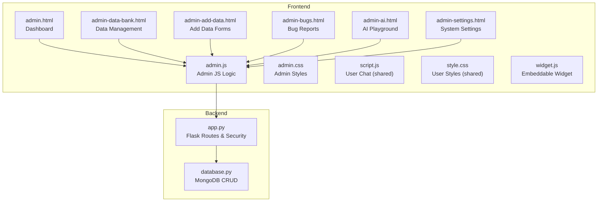

**Diagram sources**
- [admin.html:1-164](file://frontend/admin.html#L1-L164)
- [admin.js:1-1108](file://frontend/admin.js#L1-L1108)
- [admin.css:1-618](file://frontend/admin.css#L1-L618)
- [admin-data-bank.html:1-98](file://frontend/admin-data-bank.html#L1-L98)
- [admin-add-data.html:1-113](file://frontend/admin-add-data.html#L1-L113)
- [admin-bugs.html:1-94](file://frontend/admin-bugs.html#L1-L94)
- [admin-ai.html:1-86](file://frontend/admin-ai.html#L1-L86)
- [admin-settings.html:1-102](file://frontend/admin-settings.html#L1-L102)
- [app.py:1-1192](file://backend/app.py#L1-L1192)
- [database.py:1-260](file://frontend/admin.js#L1-L260)

**Section sources**
- [admin.html:1-164](file://frontend/admin.html#L1-L164)
- [admin.js:1-1108](file://frontend/admin.js#L1-L1108)
- [admin.css:1-618](file://frontend/admin.css#L1-L618)
- [admin-data-bank.html:1-98](file://frontend/admin-data-bank.html#L1-L98)
- [admin-add-data.html:1-113](file://frontend/admin-add-data.html#L1-L113)
- [admin-bugs.html:1-94](file://frontend/admin-bugs.html#L1-L94)
- [admin-ai.html:1-86](file://frontend/admin-ai.html#L1-L86)
- [admin-settings.html:1-102](file://frontend/admin-settings.html#L1-L102)
- [app.py:1-1192](file://backend/app.py#L1-L1192)
- [database.py:1-260](file://backend/database.py#L1-L260)

## Core Components
- Admin Dashboard: Central hub with real-time crawler actions, workflow controls, and status console.
- Authentication Overlay: Password-protected admin access with optimistic UI and CSRF token handling.
- Navigation Sidebar: Persistent menu with active state highlighting and mobile-friendly hamburger menu.
- Data Management: Unified data listing across three knowledge bases with filtering, search, and modal editing.
- Content Entry Forms: Text and file upload forms for adding new manual data and file extraction.
- Bug Reporting Management: Status filtering, editing, and deletion of user-reported issues.
- AI Playground: Admin testing interface with streaming response logs and thinking process visualization.
- System Settings: Dangerous actions (flush FAISS index, reset database) and tutorial modal integration.
- Backend Security: Admin-only routes, CSRF protection, rate limiting, input sanitization, and audit logging.

**Section sources**
- [admin.html:1-164](file://frontend/admin.html#L1-L164)
- [admin.js:1-1108](file://frontend/admin.js#L1-L1108)
- [admin-data-bank.html:1-98](file://frontend/admin-data-bank.html#L1-L98)
- [admin-add-data.html:1-113](file://frontend/admin-add-data.html#L1-L113)
- [admin-bugs.html:1-94](file://frontend/admin-bugs.html#L1-L94)
- [admin-ai.html:1-86](file://frontend/admin-ai.html#L1-L86)
- [admin-settings.html:1-102](file://frontend/admin-settings.html#L1-L102)
- [app.py:239-366](file://backend/app.py#L239-L366)
- [database.py:1-260](file://backend/database.py#L1-L260)

## Architecture Overview
The admin panel follows a client-server architecture with a secure admin-only backend and a responsive frontend. The frontend communicates with backend endpoints using authenticated fetch requests with CSRF tokens. The backend enforces session-based admin authentication, validates and sanitizes inputs, streams long-running operations, and maintains audit trails.

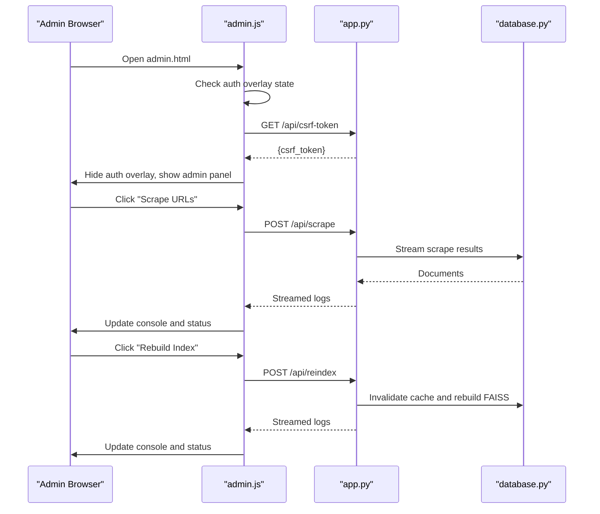

**Diagram sources**
- [admin.html:1-164](file://frontend/admin.html#L1-L164)
- [admin.js:1-1108](file://frontend/admin.js#L1-L1108)
- [app.py:801-858](file://backend/app.py#L801-L858)
- [database.py:1-260](file://backend/database.py#L1-L260)

**Section sources**
- [admin.html:1-164](file://frontend/admin.html#L1-L164)
- [admin.js:1-1108](file://frontend/admin.js#L1-L1108)
- [app.py:801-858](file://backend/app.py#L801-L858)

## Detailed Component Analysis

### Authentication System
The admin authentication system ensures secure access to admin-only features. It uses a password overlay, session storage for optimistic UI, and CSRF token injection for state-changing requests.

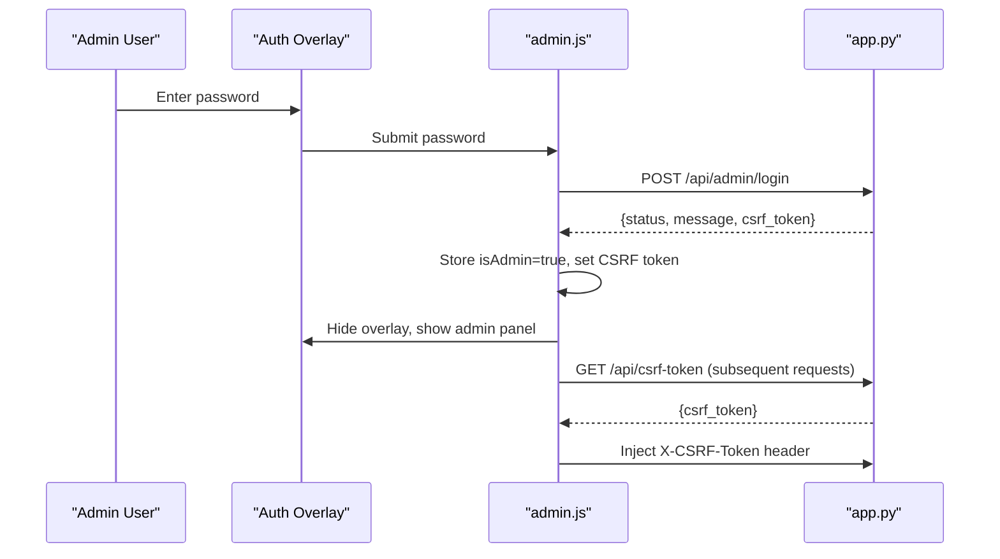

Key security features:
- Session-based admin verification with 2-hour expiry
- CSRF token generation and validation for state-changing requests
- Rate limiting on login attempts
- Secure password handling via environment variables
- Automatic CSRF refresh on 403 errors

**Diagram sources**
- [admin.html:21-32](file://frontend/admin.html#L21-L32)
- [admin.js:120-144](file://frontend/admin.js#L120-L144)
- [app.py:331-366](file://backend/app.py#L331-L366)

**Section sources**
- [admin.html:21-32](file://frontend/admin.html#L21-L32)
- [admin.js:120-144](file://frontend/admin.js#L120-L144)
- [app.py:331-366](file://backend/app.py#L331-L366)

### Admin Navigation System
The navigation system provides a persistent sidebar with active state highlighting and mobile-responsive behavior. It includes main navigation items and system settings.

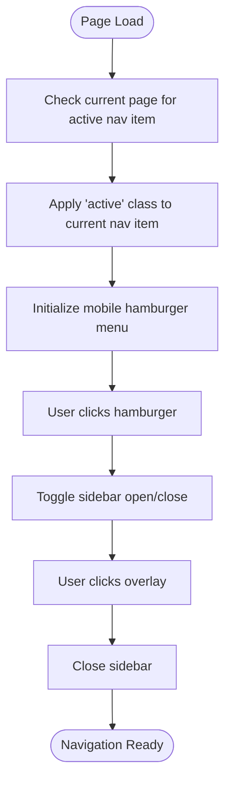

Responsive behavior:
- Desktop: Fixed sidebar with hover effects and active indicators
- Mobile: Hamburger menu opens overlay sidebar with backdrop
- Theme toggle persists in localStorage

**Diagram sources**
- [admin.html:46-92](file://frontend/admin.html#L46-L92)
- [admin.js:146-158](file://frontend/admin.js#L146-L158)
- [admin.css:602-618](file://frontend/admin.css#L602-L618)

**Section sources**
- [admin.html:46-92](file://frontend/admin.html#L46-L92)
- [admin.js:146-158](file://frontend/admin.js#L146-L158)
- [admin.css:602-618](file://frontend/admin.css#L602-L618)

### Dashboard Layout and Controls
The dashboard provides centralized controls for system operations with real-time feedback.

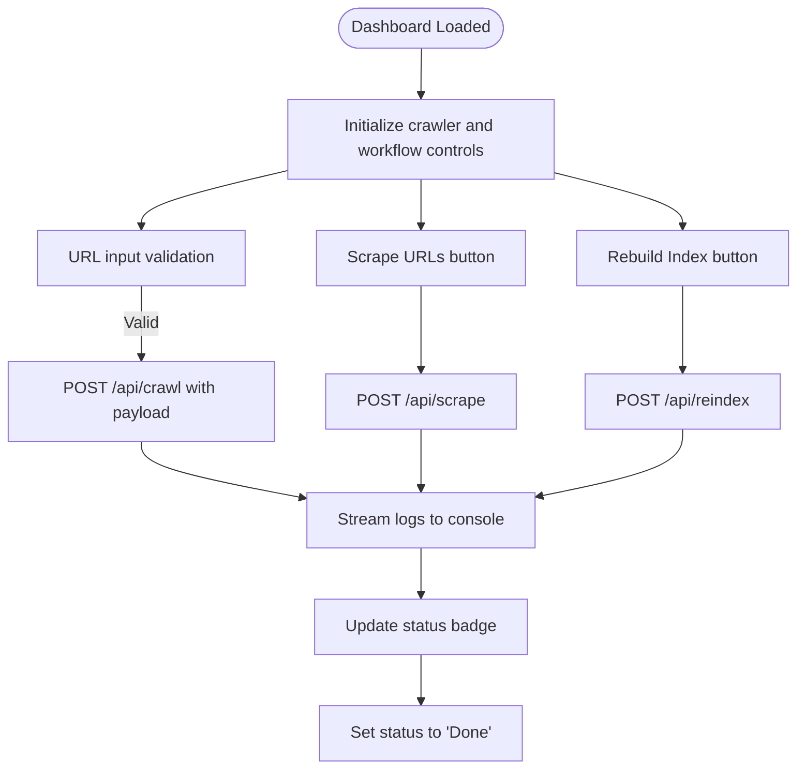

Dashboard features:
- Auto Crawler Website: Deep crawling with configurable max pages
- Workflow Controls: Scraping URLs and rebuilding FAISS index
- Status Console: Real-time streaming logs with color-coded messages
- Status Badge: Visual indicators for idle, running, and done states

**Diagram sources**
- [admin.html:99-146](file://frontend/admin.html#L99-L146)
- [admin.js:255-318](file://frontend/admin.js#L255-L318)
- [app.py:822-858](file://backend/app.py#L822-L858)

**Section sources**
- [admin.html:99-146](file://frontend/admin.html#L99-L146)
- [admin.js:255-318](file://frontend/admin.js#L255-L318)
- [app.py:822-858](file://backend/app.py#L822-L858)

### Data Management System
The data management system handles three knowledge bases with unified filtering, search, and modal editing.

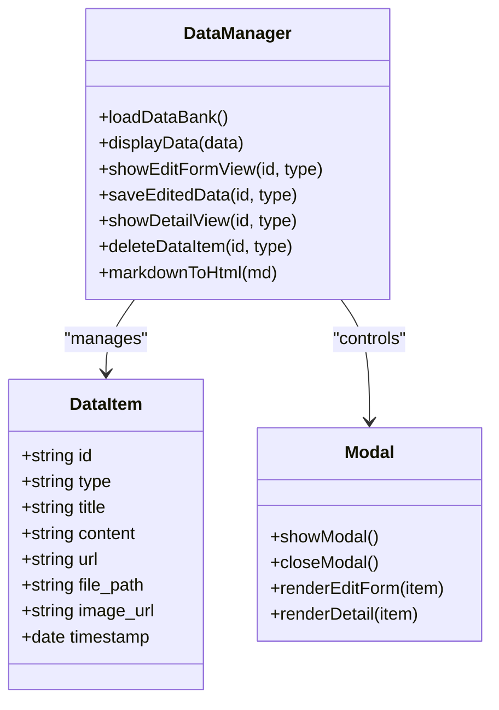

Data management features:
- Unified data listing across Scraped, Manual, and Memory types
- Filtering by type and search by title/content
- Edit/Delete operations with confirmation dialogs
- Detail view with markdown rendering and file/image previews
- Real-time updates after CRUD operations

**Diagram sources**
- [admin.js:372-562](file://frontend/admin.js#L372-L562)
- [admin-data-bank.html:65-78](file://frontend/admin-data-bank.html#L65-L78)

**Section sources**
- [admin.js:372-562](file://frontend/admin.js#L372-L562)
- [admin-data-bank.html:65-78](file://frontend/admin-data-bank.html#L65-L78)

### Content Entry Forms
The admin provides two primary forms for adding new content: text-based and file-based.

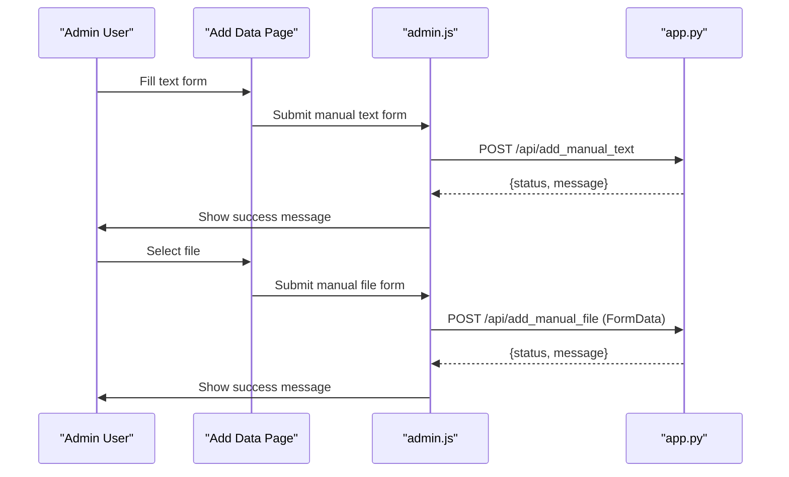

Form features:
- Text form: Title (optional) and content textarea with validation
- File form: Drag-and-drop zone for PDF/DOCX/PPTX with automatic extraction
- Validation: Content length limits, file type restrictions, and sanitization
- Success/error feedback with alerts

**Diagram sources**
- [admin-add-data.html:69-106](file://frontend/admin-add-data.html#L69-L106)
- [admin.js:500-562](file://frontend/admin.js#L500-L562)
- [app.py:498-566](file://backend/app.py#L498-L566)

**Section sources**
- [admin-add-data.html:69-106](file://frontend/admin-add-data.html#L69-L106)
- [admin.js:500-562](file://frontend/admin.js#L500-L562)
- [app.py:498-566](file://backend/app.py#L498-L566)

### Bug Reporting Management
The bug reporting system allows admins to track and manage user-reported issues.

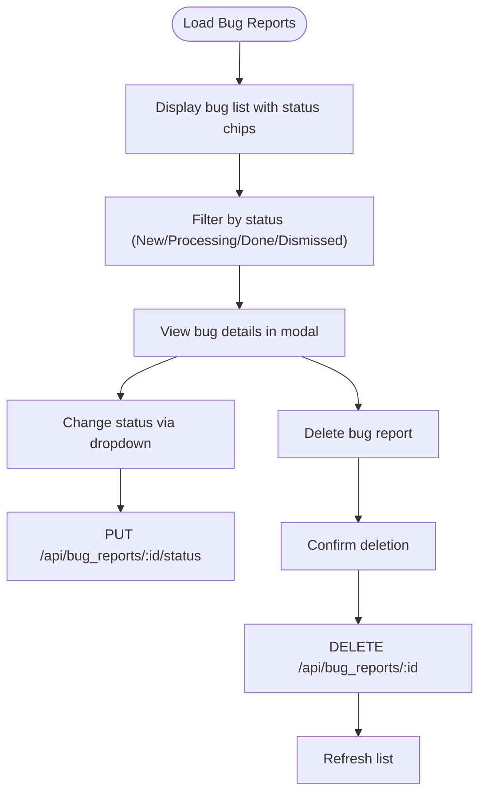

Bug management features:
- Status filtering with color-coded badges
- Modal-based detail view with description and attachments
- Status change dropdown with validation
- Delete confirmation dialogs
- Real-time updates after operations

**Diagram sources**
- [admin-bugs.html:64-75](file://frontend/admin-bugs.html#L64-L75)
- [admin.js:682-800](file://frontend/admin.js#L682-L800)
- [app.py:462-496](file://backend/app.py#L462-L496)

**Section sources**
- [admin-bugs.html:64-75](file://frontend/admin-bugs.html#L64-L75)
- [admin.js:682-800](file://frontend/admin.js#L682-L800)
- [app.py:462-496](file://backend/app.py#L462-L496)

### AI Playground
The AI playground enables admins to test the RAG pipeline and observe the thinking process.

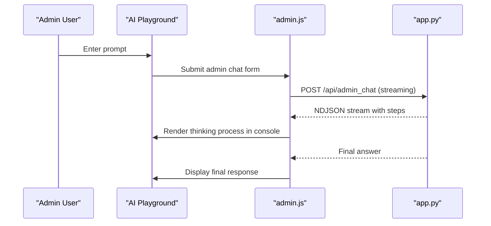

AI testing features:
- Streaming NDJSON responses with step-by-step thinking process
- Console visualization of memory/manual/scrape searches
- Citation and image rendering in responses
- Regenerate last response functionality

**Diagram sources**
- [admin-ai.html:64-80](file://frontend/admin-ai.html#L64-L80)
- [admin.js:564-675](file://frontend/admin.js#L564-L675)
- [app.py:589-761](file://backend/app.py#L589-L761)

**Section sources**
- [admin-ai.html:64-80](file://frontend/admin-ai.html#L64-L80)
- [admin.js:564-675](file://frontend/admin.js#L564-L675)
- [app.py:589-761](file://backend/app.py#L589-L761)

### System Settings and Dangerous Operations
The settings page provides access to system utilities and dangerous operations with confirmation prompts.

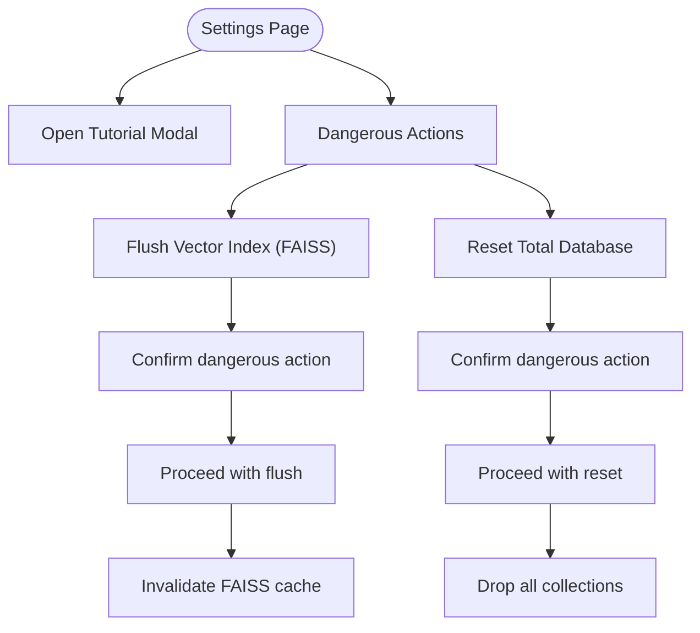

Dangerous operations:
- Flush FAISS index: Deletes vector databases and invalidates cache
- Reset database: Drops all collections and reinitializes
- Both operations require explicit confirmation dialogs

**Diagram sources**
- [admin-settings.html:72-83](file://frontend/admin-settings.html#L72-L83)
- [admin.js:352-365](file://frontend/admin.js#L352-L365)
- [app.py:763-800](file://backend/app.py#L763-L800)

**Section sources**
- [admin-settings.html:72-83](file://frontend/admin-settings.html#L72-L83)
- [admin.js:352-365](file://frontend/admin.js#L352-L365)
- [app.py:763-800](file://backend/app.py#L763-L800)

### Backend Security and Audit Logging
The backend enforces comprehensive security measures and maintains audit trails.

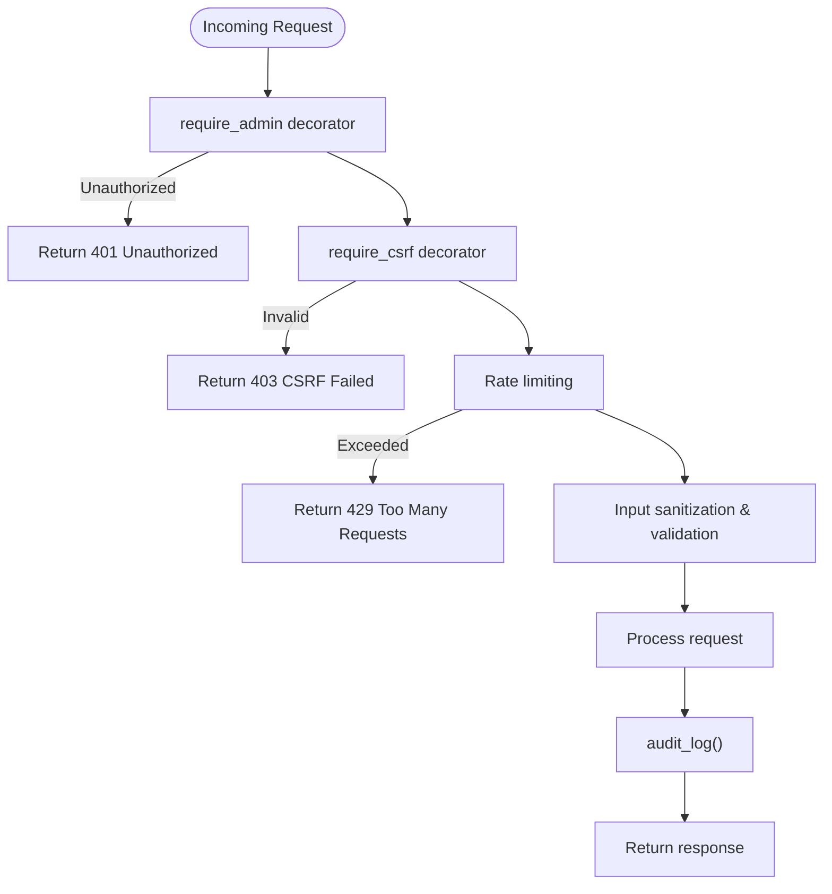

Security features:
- Admin-only decorators for protected routes
- CSRF token generation and validation
- Rate limiting with graceful fallback
- Input sanitization and length limits
- ObjectId validation for MongoDB operations
- Comprehensive audit logging with timestamps and IP addresses

**Diagram sources**
- [app.py:239-366](file://backend/app.py#L239-L366)
- [app.py:151-159](file://backend/app.py#L151-L159)
- [app.py:353-366](file://backend/app.py#L353-L366)

**Section sources**
- [app.py:239-366](file://backend/app.py#L239-L366)
- [app.py:151-159](file://backend/app.py#L151-L159)
- [app.py:353-366](file://backend/app.py#L353-L366)

## Dependency Analysis
The admin panel has clear separation of concerns between frontend and backend components.

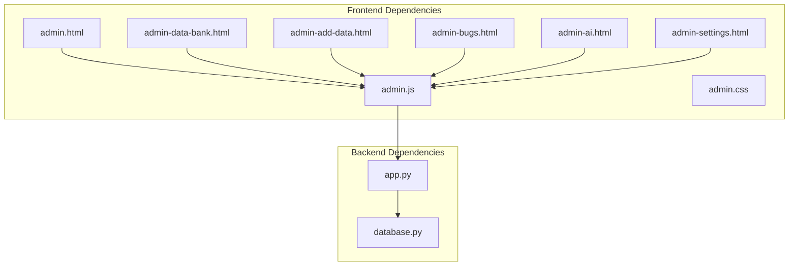

Frontend-to-backend relationships:
- All admin pages share admin.js for common functionality
- Each page targets specific backend endpoints
- Shared CSS provides consistent theming across pages
- Backend routes handle CRUD operations for all knowledge bases

**Diagram sources**
- [admin.js:1-1108](file://frontend/admin.js#L1-L1108)
- [admin.html:1-164](file://frontend/admin.html#L1-L164)
- [admin-data-bank.html:1-98](file://frontend/admin-data-bank.html#L1-L98)
- [admin-add-data.html:1-113](file://frontend/admin-add-data.html#L1-L113)
- [admin-bugs.html:1-94](file://frontend/admin-bugs.html#L1-L94)
- [admin-ai.html:1-86](file://frontend/admin-ai.html#L1-L86)
- [admin-settings.html:1-102](file://frontend/admin-settings.html#L1-L102)
- [app.py:1-1192](file://backend/app.py#L1-L1192)
- [database.py:1-260](file://backend/database.py#L1-L260)

**Section sources**
- [admin.js:1-1108](file://frontend/admin.js#L1-L1108)
- [app.py:1-1192](file://backend/app.py#L1-L1192)
- [database.py:1-260](file://backend/database.py#L1-L260)

## Performance Considerations
- Streaming responses: Long-running operations (scrape, crawl, reindex) use streaming to provide real-time feedback without blocking the UI.
- Client-side caching: Data lists are cached locally to reduce network requests during filtering and search operations.
- Lazy loading: Modal content is loaded on demand to minimize initial page weight.
- Efficient DOM manipulation: Batched updates and delegated event handling reduce layout thrashing.
- Asset optimization: CSS variables enable efficient theme switching without recalculating styles.
- Backend indexing: MongoDB indexes on frequently queried fields improve query performance.

## Troubleshooting Guide
Common admin panel issues and resolutions:

### Authentication Issues
- **Problem**: Login fails repeatedly
  - **Cause**: Incorrect password or expired session
  - **Solution**: Verify ADMIN_PASSWORD_HASH environment variable and clear browser session storage
  - **Prevention**: Use rate-limited login endpoint and CSRF protection

### CSRF Token Errors
- **Problem**: 403 Forbidden on form submissions
  - **Cause**: Stale or missing CSRF token
  - **Solution**: Refresh page to get new token or check X-CSRF-Token header
  - **Prevention**: Automatic token refresh on 403 errors

### Network Connectivity
- **Problem**: Real-time logs not updating
  - **Cause**: Network interruption or server timeout
  - **Solution**: Check server connectivity and retry operation
  - **Prevention**: Implement exponential backoff for retries

### Data Loading Issues
- **Problem**: Data list shows "Failed to load data"
  - **Cause**: Database connection or query errors
  - **Solution**: Verify MongoDB connection and collection initialization
  - **Prevention**: Graceful error handling with user-friendly messages

### File Upload Problems
- **Problem**: File upload fails or extraction errors
  - **Cause**: Unsupported file types or oversized files
  - **Solution**: Verify file extensions (.pdf, .docx, .pptx) and size limits (16MB)
  - **Prevention**: Client-side validation before upload

**Section sources**
- [admin.js:200-234](file://frontend/admin.js#L200-L234)
- [app.py:316-327](file://backend/app.py#L316-L327)
- [app.py:369-374](file://backend/app.py#L369-L374)

## Conclusion
The DamayAI admin panel provides a comprehensive, secure, and user-friendly interface for managing knowledge bases, monitoring system operations, and administering user reports. Its architecture emphasizes security through admin-only routes, CSRF protection, and audit logging, while maintaining excellent user experience through real-time updates, responsive design, and intuitive workflows. The modular design allows for easy maintenance and extension of admin capabilities.

## Appendices

### Step-by-Step Admin Tasks

#### Adding New Manual Data
1. Navigate to "Tambah Data" page
2. Choose between text or file upload form
3. Fill required fields (content for text, select file for file upload)
4. Submit form - system extracts text from files automatically
5. Verify success message and check "Data Bank" for new entry

#### Managing Scraped Data
1. Go to "Data Bank" page
2. Use filter chips to view specific data types
3. Search by title or content using the search bar
4. Click "Detail" to view content with markdown rendering
5. Use "Ubah" to edit title/content or "Hapus" to remove data

#### Testing AI Responses
1. Navigate to "Uji Coba AI" page
2. Enter a test query in the prompt area
3. Review the thinking process in the console
4. Observe final response with citations and images
5. Use "Regenerate" to test variations

#### Managing Bug Reports
1. Access "Laporan Bug" page
2. Filter by status using filter chips
3. Click "Detail" to view bug information and attachments
4. Change status using the dropdown selector
5. Delete reports after resolution with confirmation

#### Dangerous Operations
1. Go to "Pengaturan" page
2. Click "Flush Vector Index (FAISS)" to clear FAISS databases
3. Click "Reset Total Database" to drop all collections
4. Confirm both operations with explicit dialog prompts

### Accessibility Compliance
The admin panel implements several accessibility features:
- Semantic HTML structure with proper headings and labels
- Keyboard navigation support for all interactive elements
- Color contrast compliant with WCAG guidelines
- Focus management for modals and overlays
- Screen reader friendly content with ARIA attributes
- Responsive design for various screen sizes and orientations

### Security Best Practices
- Regular rotation of SECRET_KEY and ADMIN_PASSWORD_HASH
- Monitoring audit logs for suspicious activities
- Keeping dependencies updated to address security vulnerabilities
- Using HTTPS in production environments
- Regular backup of MongoDB collections and FAISS indexes