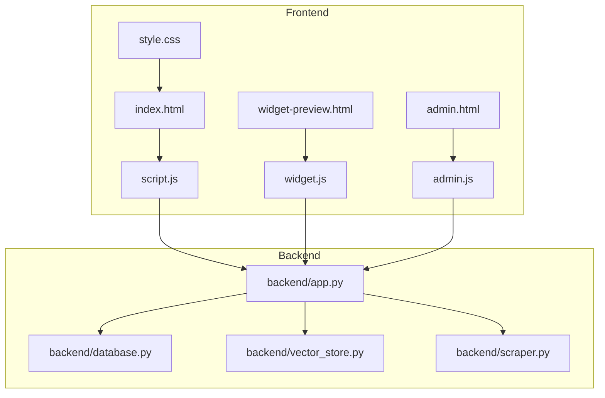
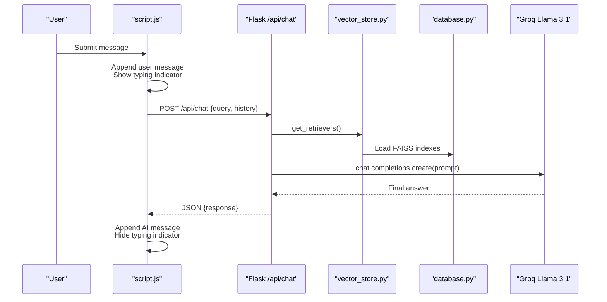
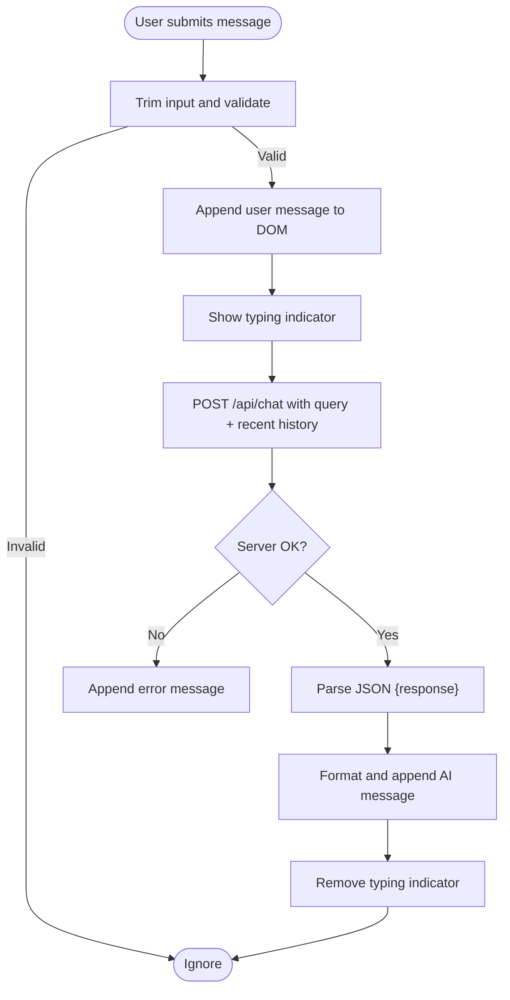
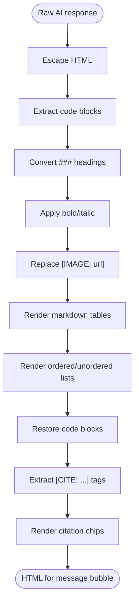
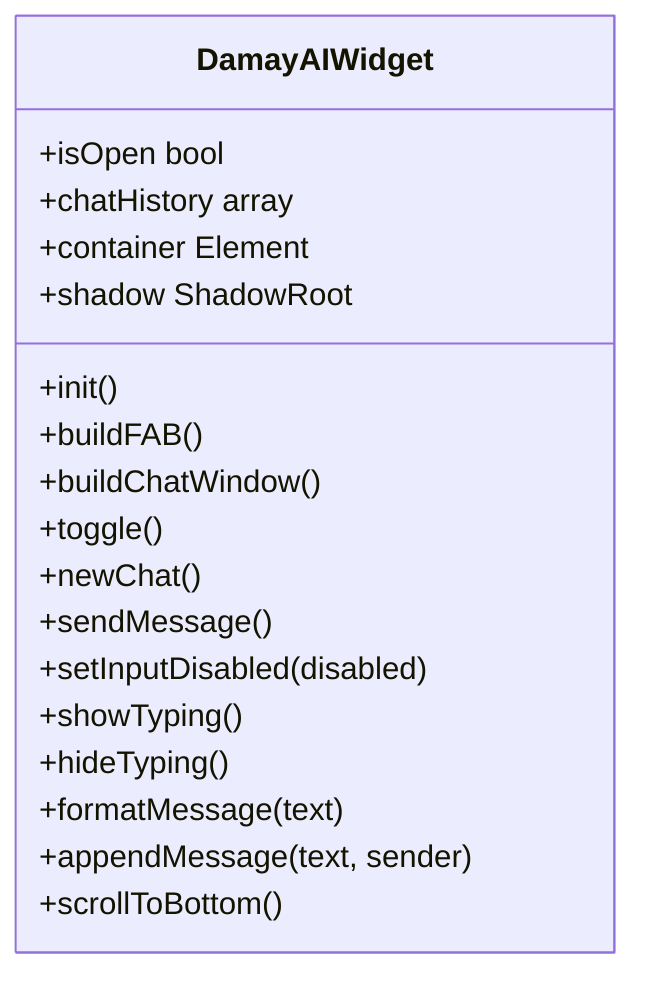
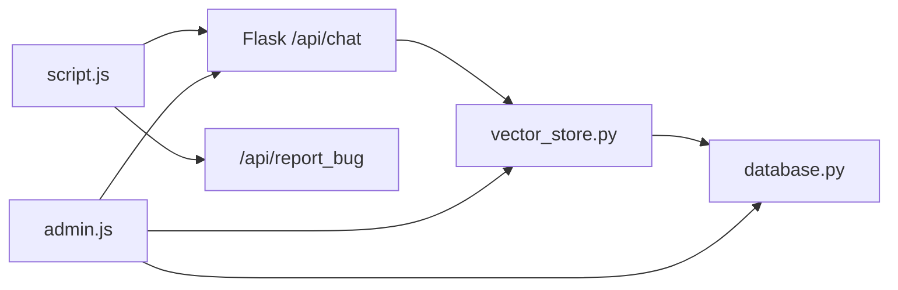

# Chat Widget Interface

<cite>
**Referenced Files in This Document**
- [index.html](file://frontend/index.html)
- [script.js](file://frontend/script.js)
- [style.css](file://frontend/style.css)
- [widget.js](file://frontend/widget.js)
- [widget-preview.html](file://frontend/widget-preview.html)
- [admin.html](file://frontend/admin.html)
- [admin.js](file://frontend/admin.js)
- [app.py](file://backend/app.py)
- [database.py](file://backend/database.py)
- [vector_store.py](file://backend/vector_store.py)
- [scraper.py](file://backend/scraper.py)
</cite>

## Table of Contents
1. [Introduction](#introduction)
2. [Project Structure](#project-structure)
3. [Core Components](#core-components)
4. [Architecture Overview](#architecture-overview)
5. [Detailed Component Analysis](#detailed-component-analysis)
6. [Dependency Analysis](#dependency-analysis)
7. [Performance Considerations](#performance-considerations)
8. [Troubleshooting Guide](#troubleshooting-guide)
9. [Conclusion](#conclusion)
10. [Appendices](#appendices)

## Introduction
This document describes the DamayAI chat widget interface, covering the user-facing chat experience, real-time conversation handling, markdown formatting, citation system, and the embedded widget for third-party websites. It explains the frontend JavaScript event handling, DOM manipulation, theme switching, and CSS styling for responsive design and accessibility. It also outlines the backend API endpoints used by the chat, including the chat endpoint and streaming-related infrastructure.

## Project Structure
The chat widget interface spans two major areas:
- Frontend: user-facing chat UI with theme support, message rendering, and actions (copy, speak, regenerate)
- Backend: Flask API providing chat responses and administrative tools

**Diagram sources**
- [index.html:1-99](file://frontend/index.html#L1-L99)
- [script.js:1-428](file://frontend/script.js#L1-L428)
- [style.css:1-492](file://frontend/style.css#L1-L492)
- [widget.js:1-561](file://frontend/widget.js#L1-L561)
- [widget-preview.html:1-207](file://frontend/widget-preview.html#L1-L207)
- [admin.html:1-164](file://frontend/admin.html#L1-L164)
- [admin.js:1-800](file://frontend/admin.js#L1-L800)
- [app.py:1-1192](file://backend/app.py#L1-L1192)
- [database.py:1-260](file://backend/database.py#L1-L260)
- [vector_store.py:1-115](file://backend/vector_store.py#L1-L115)
- [scraper.py:1-278](file://backend/scraper.py#L1-L278)

**Section sources**
- [index.html:1-99](file://frontend/index.html#L1-L99)
- [script.js:1-428](file://frontend/script.js#L1-L428)
- [style.css:1-492](file://frontend/style.css#L1-L492)
- [widget.js:1-561](file://frontend/widget.js#L1-L561)
- [widget-preview.html:1-207](file://frontend/widget-preview.html#L1-L207)
- [admin.html:1-164](file://frontend/admin.html#L1-L164)
- [admin.js:1-800](file://frontend/admin.js#L1-L800)
- [app.py:1-1192](file://backend/app.py#L1-L1192)
- [database.py:1-260](file://backend/database.py#L1-L260)
- [vector_store.py:1-115](file://backend/vector_store.py#L1-L115)
- [scraper.py:1-278](file://backend/scraper.py#L1-L278)

## Core Components
- User chat interface with header (theme toggle, online indicator, bug report, new chat), chat area, and footer input with disclaimer
- Message rendering pipeline supporting bold/italic/markdown lists, tables, code blocks, and citations
- Citation system extracting [CITE: url | title] and [CITE: url] tags and rendering clickable chips
- Streaming-like behavior via server-side chat endpoint returning final answer (see backend note)
- Embedded widget for third-party sites with Shadow DOM styling and floating action button
- Admin dashboard for managing data, scraping, indexing, and bug reports

**Section sources**
- [index.html:26-69](file://frontend/index.html#L26-L69)
- [script.js:159-227](file://frontend/script.js#L159-L227)
- [script.js:229-255](file://frontend/script.js#L229-L255)
- [script.js:257-339](file://frontend/script.js#L257-L339)
- [widget.js:340-561](file://frontend/widget.js#L340-L561)
- [admin.html:44-147](file://frontend/admin.html#L44-L147)
- [admin.js:246-366](file://frontend/admin.js#L246-L366)

## Architecture Overview
The chat widget integrates with a Flask backend that orchestrates retrieval, prompt construction, and LLM completion. The frontend sends user queries with chat history and receives a final JSON response containing the AI answer. The admin dashboard manages data ingestion and indexing.

**Diagram sources**
- [script.js:78-111](file://frontend/script.js#L78-L111)
- [app.py:432-452](file://backend/app.py#L432-L452)
- [vector_store.py:73-115](file://backend/vector_store.py#L73-L115)
- [database.py:18-260](file://backend/database.py#L18-L260)

## Detailed Component Analysis

### User Chat Interface (index.html + script.js + style.css)
- Header: logo, online status indicator, theme toggle, bug report modal trigger, new chat button
- Chat area: dynamic message bubbles with user and AI sides
- Footer: input form with send button and disclaimer
- Theming: CSS variables switch between light/dark themes; persistent in localStorage
- Accessibility: focus states, contrast-aware colors, semantic markup

**Diagram sources**
- [script.js:78-111](file://frontend/script.js#L78-L111)
- [script.js:257-339](file://frontend/script.js#L257-L339)

**Section sources**
- [index.html:26-69](file://frontend/index.html#L26-L69)
- [script.js:1-428](file://frontend/script.js#L1-L428)
- [style.css:1-492](file://frontend/style.css#L1-L492)

### Message Formatting and Citations
- Markdown support: bold, italic, ordered/unordered lists, tables, code blocks
- Image insertion via [IMAGE: url] with validation and error handling
- Citations: [CITE: url | title] and [CITE: url] extracted and rendered as chips
- Error handling: malformed inputs sanitized; images hidden on load errors

**Diagram sources**
- [script.js:159-227](file://frontend/script.js#L159-L227)
- [script.js:229-255](file://frontend/script.js#L229-L255)

**Section sources**
- [script.js:159-227](file://frontend/script.js#L159-L227)
- [script.js:229-255](file://frontend/script.js#L229-L255)

### Theme Switching and Persistence
- Theme stored in localStorage and reflected via data-theme attribute on html element
- Theme toggle updates icon and persists selection
- CSS variables define theme-aware colors and gradients

**Section sources**
- [index.html:14-20](file://frontend/index.html#L14-L20)
- [script.js:23-41](file://frontend/script.js#L23-L41)
- [style.css:8-79](file://frontend/style.css#L8-L79)

### Bug Reporting Modal
- Form collects description and optional file upload
- Submits to /api/report_bug via FormData
- Shows feedback and resets form on success

**Section sources**
- [index.html:73-95](file://frontend/index.html#L73-L95)
- [script.js:118-147](file://frontend/script.js#L118-L147)
- [app.py:403-431](file://backend/app.py#L403-L431)

### New Chat Session
- Clears chat history and speech synthesis state
- Inserts welcome AI message

**Section sources**
- [script.js:63-76](file://frontend/script.js#L63-L76)
- [script.js:113-113](file://frontend/script.js#L113-L113)

### Action Buttons (Copy, Speak, Regenerate)
- Copy: copies plain text to clipboard with temporary visual feedback
- Speak: toggles speech synthesis using Web Speech API
- Regenerate: resends last user message with updated history

**Section sources**
- [script.js:335-339](file://frontend/script.js#L335-L339)
- [script.js:368-381](file://frontend/script.js#L368-L381)
- [script.js:383-389](file://frontend/script.js#L383-L389)
- [script.js:391-421](file://frontend/script.js#L391-L421)

### Embedded Widget (widget.js)
- Self-contained widget with Shadow DOM to avoid style conflicts
- Floating action button opens/closes chat window
- Minimalist UI with icons and animations
- Sends chat messages to the same backend endpoint

**Diagram sources**
- [widget.js:340-561](file://frontend/widget.js#L340-L561)

**Section sources**
- [widget.js:1-561](file://frontend/widget.js#L1-L561)
- [widget-preview.html:1-207](file://frontend/widget-preview.html#L1-L207)

### Backend API Integration
- Chat endpoint: validates query length and chat history, retrieves knowledge via FAISS retrievers, constructs prompt, and returns final answer
- Admin chat endpoint: streams NDJSON steps for training/inference visualization
- Security: rate limits, CSRF tokens, input sanitization, XSS protections, CORS for widget embedding

**Section sources**
- [app.py:432-452](file://backend/app.py#L432-L452)
- [app.py:589-604](file://backend/app.py#L589-L604)
- [app.py:253-293](file://backend/app.py#L253-L293)
- [app.py:177-184](file://backend/app.py#L177-L184)
- [app.py:188-218](file://backend/app.py#L188-L218)

### Data Management and Indexing
- FAISS indexes for Memory Bank, Manual Data, and Scraped Data
- Retrievers cached at module level to reduce load overhead
- Admin tools to scrape URLs, crawl websites, rebuild indexes, and manage data

**Section sources**
- [vector_store.py:14-115](file://backend/vector_store.py#L14-L115)
- [database.py:18-260](file://backend/database.py#L18-L260)
- [scraper.py:152-278](file://backend/scraper.py#L152-L278)
- [admin.js:246-366](file://frontend/admin.js#L246-L366)

## Dependency Analysis
- Frontend depends on backend endpoints for chat and bug reporting
- Backend depends on vector store and database for retrieval and persistence
- Admin dashboard depends on backend APIs for data management and streaming logs

**Diagram sources**
- [script.js:78-111](file://frontend/script.js#L78-L111)
- [app.py:403-452](file://backend/app.py#L403-L452)
- [vector_store.py:73-115](file://backend/vector_store.py#L73-L115)
- [database.py:18-260](file://backend/database.py#L18-L260)
- [admin.js:246-366](file://frontend/admin.js#L246-L366)

**Section sources**
- [script.js:78-111](file://frontend/script.js#L78-L111)
- [app.py:403-452](file://backend/app.py#L403-L452)
- [vector_store.py:73-115](file://backend/vector_store.py#L73-L115)
- [database.py:18-260](file://backend/database.py#L18-L260)
- [admin.js:246-366](file://frontend/admin.js#L246-L366)

## Performance Considerations
- Chat history truncated to last 20 turns to keep prompts concise
- FAISS retrievers cached to avoid repeated index loads
- Streaming endpoint exists but the user-facing chat endpoint returns a single JSON response; consider migrating to streaming for improved UX
- CSS uses efficient transitions and minimal DOM manipulations; ensure long conversations do not cause excessive DOM growth

[No sources needed since this section provides general guidance]

## Troubleshooting Guide
Common issues and resolutions:
- Server errors: verify backend health endpoint and database connectivity
- CORS errors: ensure Origin is whitelisted for widget embedding
- Rate limiting: reduce request frequency or adjust limits
- Input validation: ensure query length and history constraints are met
- Speech synthesis: check browser permissions and language availability
- Image rendering: verify HTTPS URLs and network accessibility

**Section sources**
- [app.py:940-957](file://backend/app.py#L940-L957)
- [app.py:253-293](file://backend/app.py#L253-L293)
- [script.js:368-381](file://frontend/script.js#L368-L381)

## Conclusion
The DamayAI chat widget provides a modern, theme-aware chat experience with robust formatting and citation support. The backend integrates FAISS-based retrieval and a secure API with admin controls for data management. While the current chat endpoint returns a single response, adopting streaming would enhance perceived responsiveness and user experience.

## Appendices

### API Definitions
- POST /api/chat
  - Request: { query: string, history: array }
  - Response: { response: string }
  - Notes: Validates length and sanitizes history; returns final answer

- POST /api/report_bug
  - Request: multipart/form-data with description and optional file
  - Response: { status: string, message: string }

- GET /api/health
  - Response: { status: string, database: string, timestamp: string }

**Section sources**
- [app.py:432-452](file://backend/app.py#L432-L452)
- [app.py:403-431](file://backend/app.py#L403-L431)
- [app.py:940-957](file://backend/app.py#L940-L957)

### Accessibility and Responsive Design Notes
- Focus states and keyboard navigation supported via standard form elements
- Color contrast maintained via theme-aware CSS variables
- Responsive breakpoints for mobile and desktop layouts
- Icons and labels provide meaningful affordances

**Section sources**
- [style.css:112-122](file://frontend/style.css#L112-L122)
- [style.css:257-278](file://frontend/style.css#L257-L278)
- [widget.js:141-151](file://frontend/widget.js#L141-L151)