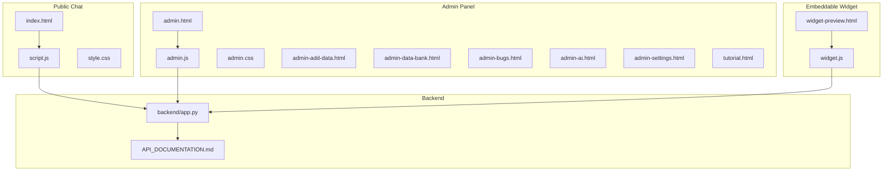
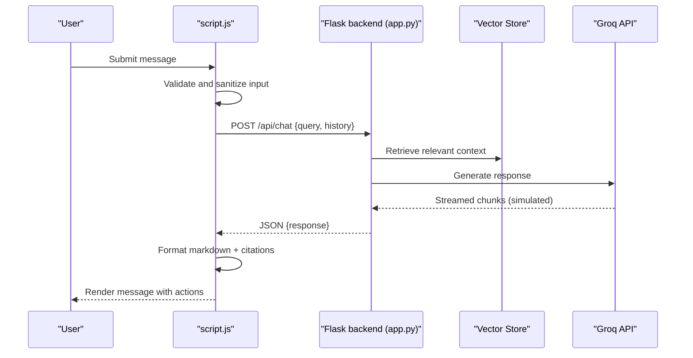
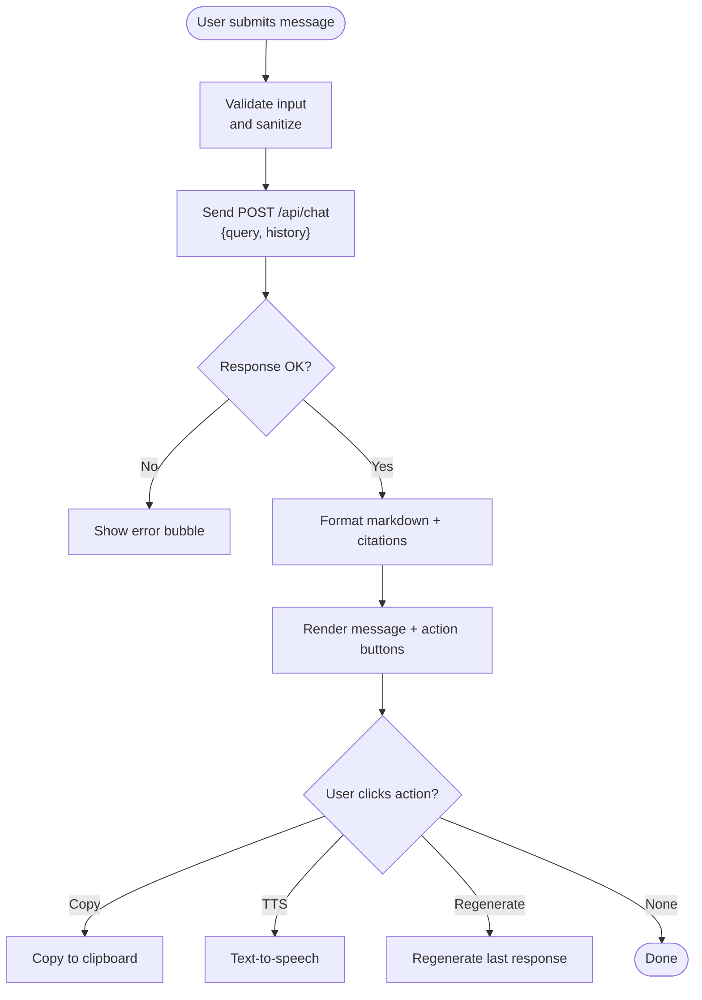
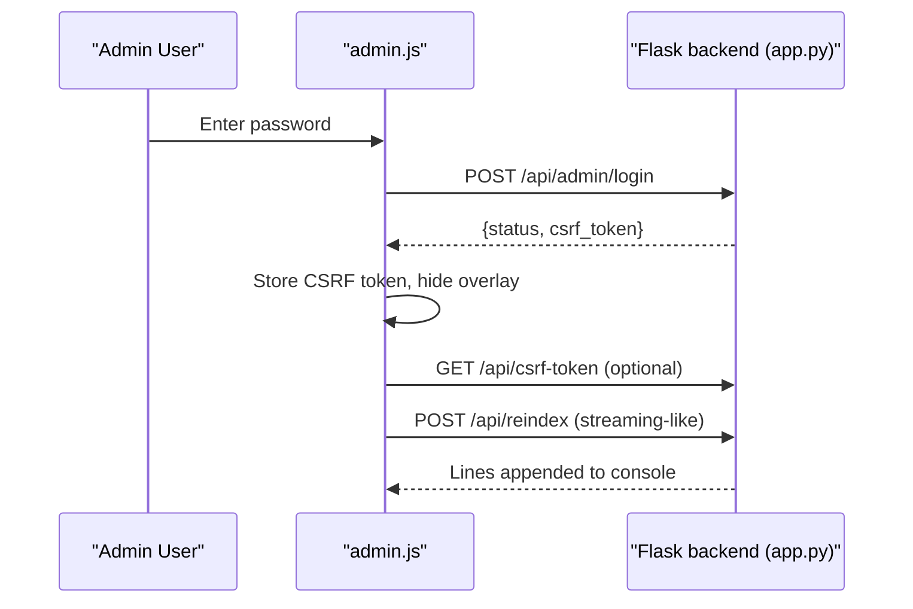
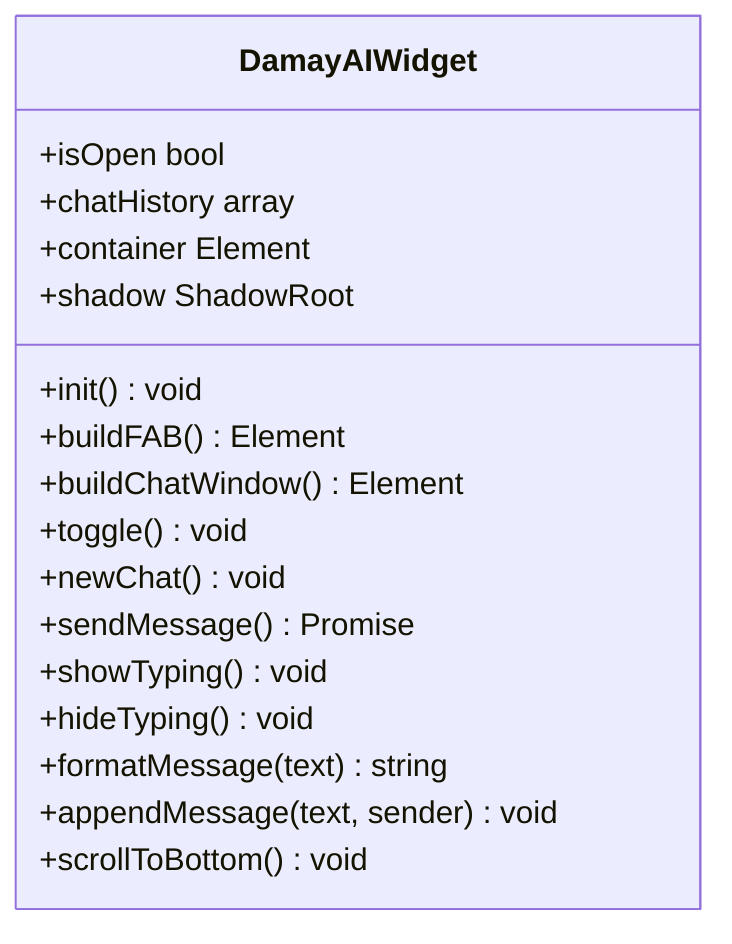
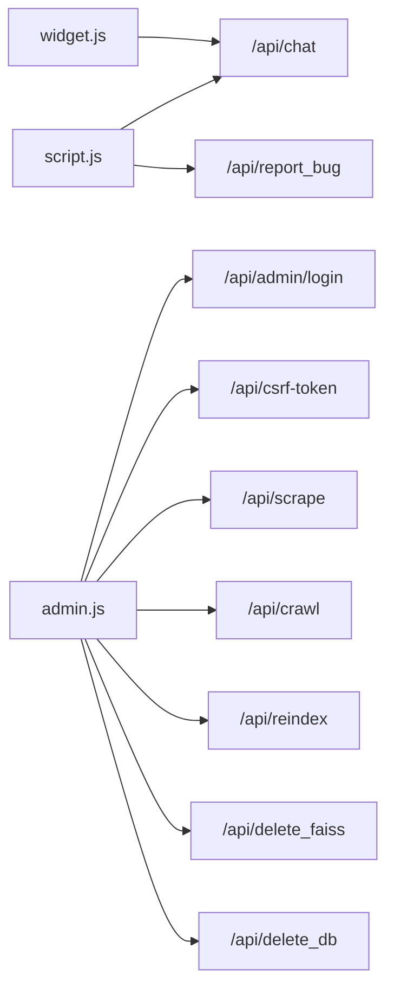

# Frontend Application Guide

<cite>
**Referenced Files in This Document**
- [index.html](file://frontend/index.html)
- [script.js](file://frontend/script.js)
- [style.css](file://frontend/style.css)
- [admin.html](file://frontend/admin.html)
- [admin.js](file://frontend/admin.js)
- [admin.css](file://frontend/admin.css)
- [widget.js](file://frontend/widget.js)
- [widget-preview.html](file://frontend/widget-preview.html)
- [admin-add-data.html](file://frontend/admin-add-data.html)
- [admin-data-bank.html](file://frontend/admin-data-bank.html)
- [admin-bugs.html](file://frontend/admin-bugs.html)
- [admin-ai.html](file://frontend/admin-ai.html)
- [admin-settings.html](file://frontend/admin-settings.html)
- [tutorial.html](file://frontend/tutorial.html)
- [API_DOCUMENTATION.md](file://API_DOCUMENTATION.md)
- [app.py](file://backend/app.py)
</cite>

## Table of Contents
1. [Introduction](#introduction)
2. [Project Structure](#project-structure)
3. [Core Components](#core-components)
4. [Architecture Overview](#architecture-overview)
5. [Detailed Component Analysis](#detailed-component-analysis)
6. [Dependency Analysis](#dependency-analysis)
7. [Performance Considerations](#performance-considerations)
8. [Troubleshooting Guide](#troubleshooting-guide)
9. [Conclusion](#conclusion)
10. [Appendices](#appendices)

## Introduction
This guide documents the DamayAI-Assistant frontend application, covering:
- The main chat widget for public users with real-time conversations, streaming-like behavior, citation handling, and markdown formatting
- The admin panel for content management, user administration, and system monitoring
- The embeddable widget for third-party websites
- JavaScript architecture, event handling, DOM manipulation, and real-time communication with backend APIs
- CSS styling guidelines, responsive design, and accessibility features
- Troubleshooting and browser compatibility considerations

## Project Structure
The frontend is organized into:
- Public chat interface: index.html + script.js + style.css
- Admin panel: admin.html + admin.js + admin.css, plus supporting pages for content management and system tasks
- Embeddable widget: widget.js with Shadow DOM encapsulation and widget-preview.html for testing
- Backend API documentation: API_DOCUMENTATION.md
- Backend server: app.py (Flask) implementing the documented endpoints

**Diagram sources**
- [index.html:1-99](file://frontend/index.html#L1-L99)
- [script.js:1-428](file://frontend/script.js#L1-L428)
- [style.css:1-492](file://frontend/style.css#L1-L492)
- [admin.html:1-164](file://frontend/admin.html#L1-L164)
- [admin.js:1-800](file://frontend/admin.js#L1-L800)
- [admin.css:1-618](file://frontend/admin.css#L1-L618)
- [widget.js:1-561](file://frontend/widget.js#L1-L561)
- [widget-preview.html:1-207](file://frontend/widget-preview.html#L1-L207)
- [API_DOCUMENTATION.md:1-347](file://API_DOCUMENTATION.md#L1-L347)
- [app.py:1-200](file://backend/app.py#L1-L200)

**Section sources**
- [index.html:1-99](file://frontend/index.html#L1-L99)
- [admin.html:1-164](file://frontend/admin.html#L1-L164)
- [widget.js:1-561](file://frontend/widget.js#L1-L561)

## Core Components
- Public chat interface: renders header, chat area, and footer; handles user input, sends requests to /api/chat, displays AI responses with citations and actions
- Admin panel: glassmorphic layout with sidebar navigation, authentication overlay, and modular pages for data management, bug reports, AI playground, and settings
- Embeddable widget: standalone floating assistant with Shadow DOM styling, auto-detects server URL, and supports new chat and typing indicators
- Styling system: CSS custom properties for themes, animations, and responsive breakpoints; admin panel uses a separate theme system

Key implementation highlights:
- Real-time conversation handling: chat history maintained locally and sent to backend with truncated history
- Markdown formatting: bold, italic, lists, code blocks, images, and tables rendered safely
- Citation system: [CITE: url|title] and [CITE: url] parsed and displayed as clickable chips
- Accessibility: semantic markup, focus management, ARIA attributes, and keyboard navigation support
- Security: input sanitization, rate limits enforced by backend, CSRF protection for admin endpoints

**Section sources**
- [script.js:1-428](file://frontend/script.js#L1-L428)
- [style.css:1-492](file://frontend/style.css#L1-L492)
- [admin.js:1-800](file://frontend/admin.js#L1-L800)
- [admin.css:1-618](file://frontend/admin.css#L1-L618)
- [widget.js:1-561](file://frontend/widget.js#L1-L561)
- [API_DOCUMENTATION.md:1-347](file://API_DOCUMENTATION.md#L1-L347)

## Architecture Overview
The frontend communicates with the backend via RESTful endpoints. The public chat and admin panel share common patterns for authentication, CSRF protection, and data fetching.

**Diagram sources**
- [script.js:78-111](file://frontend/script.js#L78-L111)
- [API_DOCUMENTATION.md:197-212](file://API_DOCUMENTATION.md#L197-L212)
- [app.py:1-200](file://backend/app.py#L1-L200)

## Detailed Component Analysis

### Public Chat Interface (index.html + script.js + style.css)
- DOM structure: header with theme toggle and bug report modal, main chat container, and footer input form
- Event handling: form submission, theme switching, bug report submission, new chat button
- Message rendering: user bubbles, AI bubbles with markdown formatting, citation chips, action buttons (read-aloud, copy, regenerate)
- Real-time behavior: typing indicator during request, input disabling, smooth scrolling
- Styling: CSS custom properties for themes, animations, and responsive layout

**Diagram sources**
- [script.js:78-111](file://frontend/script.js#L78-L111)
- [script.js:159-227](file://frontend/script.js#L159-L227)
- [script.js:229-255](file://frontend/script.js#L229-L255)
- [script.js:391-421](file://frontend/script.js#L391-L421)

**Section sources**
- [index.html:1-99](file://frontend/index.html#L1-L99)
- [script.js:1-428](file://frontend/script.js#L1-L428)
- [style.css:1-492](file://frontend/style.css#L1-L492)

### Admin Panel (admin.html + admin.js + admin.css)
- Authentication: overlay with password input; CSRF token retrieval and injection; session-based login
- Navigation: sidebar with collapsible mobile menu; active state management
- Data management: load, filter, search, detail/edit, delete for scraped/manual/memory data
- Bug reports: list with status filtering, status updates, detail view, file previews
- System operations: scrape from file, deep crawl, rebuild FAISS index, dangerous actions (flush FAISS, reset DB)
- AI playground: test prompts with streaming-like console output
- Theming: separate theme system for admin panel with persistent preferences

**Diagram sources**
- [admin.js:160-244](file://frontend/admin.js#L160-L244)
- [admin.js:255-318](file://frontend/admin.js#L255-L318)
- [API_DOCUMENTATION.md:31-49](file://API_DOCUMENTATION.md#L31-L49)

**Section sources**
- [admin.html:1-164](file://frontend/admin.html#L1-L164)
- [admin.js:1-800](file://frontend/admin.js#L1-L800)
- [admin.css:1-618](file://frontend/admin.css#L1-L618)

### Embeddable Widget (widget.js + widget-preview.html)
- Shadow DOM: isolated styling and DOM to prevent conflicts with host pages
- Auto-detection: determines server base URL from script tag src
- Features: floating action button, chat window, new chat, typing indicator, markdown formatting, powered-by attribution
- Preview: widget-preview.html simulates iframe restrictions and provides embed code copying

**Diagram sources**
- [widget.js:340-550](file://frontend/widget.js#L340-L550)

**Section sources**
- [widget.js:1-561](file://frontend/widget.js#L1-L561)
- [widget-preview.html:1-207](file://frontend/widget-preview.html#L1-L207)

### API Communication Patterns
- Public chat: POST /api/chat with {query, history}; expects {response}
- Admin operations: require CSRF token via X-CSRF-Token header
- Streaming: admin chat endpoints support streamed console output; public chat simulates streaming behavior
- Rate limiting: enforced by backend; frontend should handle errors gracefully

**Section sources**
- [API_DOCUMENTATION.md:1-347](file://API_DOCUMENTATION.md#L1-L347)
- [script.js:91-111](file://frontend/script.js#L91-L111)
- [admin.js:200-234](file://frontend/admin.js#L200-L234)

## Dependency Analysis
- Frontend-to-backend dependencies:
  - Public chat depends on /api/chat and /api/report_bug
  - Admin panel depends on /api/admin/login, /api/csrf-token, and system/admin endpoints
- Internal dependencies:
  - Admin panel shares common CSRF and authentication helpers
  - Widget uses Shadow DOM to isolate styles and avoid conflicts
- External dependencies:
  - Font Awesome icons, Google Fonts, and optional CDN-hosted resources

**Diagram sources**
- [script.js:91-111](file://frontend/script.js#L91-L111)
- [admin.js:160-244](file://frontend/admin.js#L160-L244)
- [API_DOCUMENTATION.md:1-347](file://API_DOCUMENTATION.md#L1-L347)

**Section sources**
- [script.js:1-428](file://frontend/script.js#L1-L428)
- [admin.js:1-800](file://frontend/admin.js#L1-L800)
- [API_DOCUMENTATION.md:1-347](file://API_DOCUMENTATION.md#L1-L347)

## Performance Considerations
- Chat history truncation: frontend limits history to last 20 messages to reduce payload size
- Streaming-like UX: typing indicators and asynchronous rendering improve perceived responsiveness
- CSS animations: minimal use of transforms and opacity for smooth transitions
- Asset delivery: external CDNs for fonts and icons; consider local hosting for offline scenarios
- Widget footprint: Shadow DOM reduces style conflicts and improves encapsulation

[No sources needed since this section provides general guidance]

## Troubleshooting Guide
Common issues and resolutions:
- Authentication failures in admin panel:
  - Verify CSRF token presence and correct header injection
  - Ensure session cookie is present and not expired
- Network errors:
  - Check backend health endpoint and CORS configuration
  - Confirm rate limit thresholds and retry after cooldown
- Widget not appearing:
  - Ensure script is loaded from the correct origin
  - Check iframe restrictions if previewing embedded content
- Styling conflicts:
  - Widget uses Shadow DOM; if conflicts persist, review host page styles
- Accessibility:
  - Keyboard navigation works for forms and buttons
  - Focus management ensures input fields receive focus after opening chat

**Section sources**
- [admin.js:200-234](file://frontend/admin.js#L200-L234)
- [API_DOCUMENTATION.md:65-77](file://API_DOCUMENTATION.md#L65-L77)
- [widget.js:1-561](file://frontend/widget.js#L1-L561)

## Conclusion
The DamayAI-Assistant frontend provides a modern, accessible, and secure chat experience for users and administrators. The public chat interface delivers a polished conversational UI with rich formatting and citations, while the admin panel offers comprehensive tools for content management and system maintenance. The embeddable widget enables seamless integration across diverse websites with robust isolation and responsive design.

[No sources needed since this section summarizes without analyzing specific files]

## Appendices

### A. Markdown and Citation Formatting
- Supported markdown: bold, italic, ordered/unordered lists, code blocks, tables, line breaks
- Citations: [CITE: url|title] and [CITE: url]; displayed as chips with appropriate icons and links
- Images: [IMAGE: url] with HTTPS/Scheme validation and error handling

**Section sources**
- [script.js:159-227](file://frontend/script.js#L159-L227)
- [script.js:229-255](file://frontend/script.js#L229-L255)

### B. Theming and Accessibility
- Themes: CSS custom properties for light/dark modes; persistent via localStorage
- Accessibility: semantic HTML, ARIA labels, focus management, keyboard navigation, and reduced motion options

**Section sources**
- [style.css:7-79](file://frontend/style.css#L7-L79)
- [script.js:23-41](file://frontend/script.js#L23-L41)
- [admin.css:7-71](file://frontend/admin.css#L7-L71)
- [admin.js:82-108](file://frontend/admin.js#L82-L108)

### C. Integration Guidelines
- Public chat: include script.js on the page; ensure network access to backend endpoints
- Admin panel: deploy backend and serve frontend statically; configure environment variables
- Widget embedding: use the provided embed code; preview via widget-preview.html

**Section sources**
- [widget.js:1-561](file://frontend/widget.js#L1-L561)
- [widget-preview.html:1-207](file://frontend/widget-preview.html#L1-L207)
- [API_DOCUMENTATION.md:1-347](file://API_DOCUMENTATION.md#L1-L347)