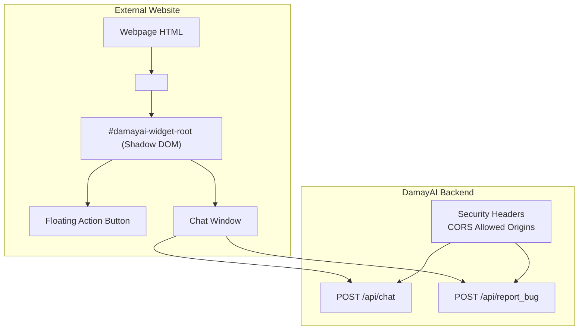
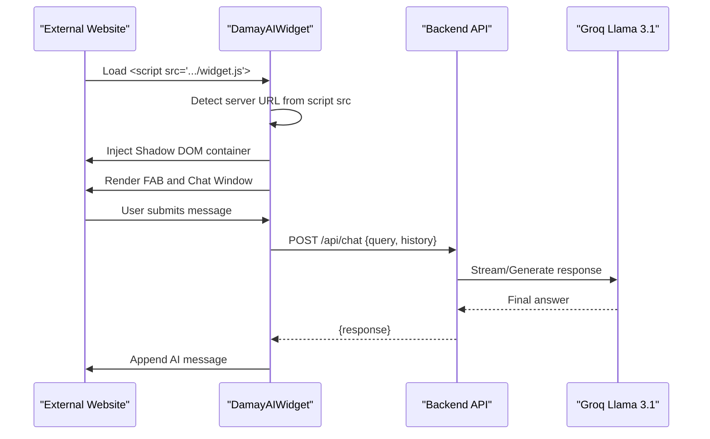
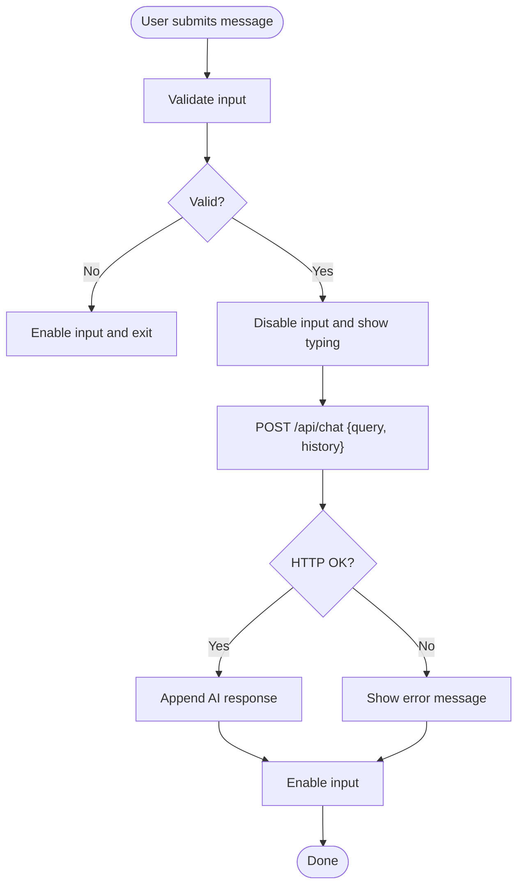
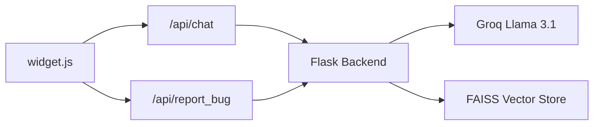

# Widget Integration Guide

<cite>
**Referenced Files in This Document**
- [widget.js](file://frontend/widget.js)
- [widget-preview.html](file://frontend/widget-preview.html)
- [script.js](file://frontend/script.js)
- [app.py](file://backend/app.py)
- [API_DOCUMENTATION.md](file://API_DOCUMENTATION.md)
- [requirements.txt](file://requirements.txt)
</cite>

## Table of Contents
1. [Introduction](#introduction)
2. [Project Structure](#project-structure)
3. [Core Components](#core-components)
4. [Architecture Overview](#architecture-overview)
5. [Detailed Component Analysis](#detailed-component-analysis)
6. [Dependency Analysis](#dependency-analysis)
7. [Performance Considerations](#performance-considerations)
8. [Troubleshooting Guide](#troubleshooting-guide)
9. [Conclusion](#conclusion)
10. [Appendices](#appendices)

## Introduction
This guide explains how to integrate the DamayAI chat widget into external websites and applications. It covers JavaScript initialization, configuration options, customization parameters, preview functionality, responsive design, theme customization, brand integration, and API communication including CORS and security considerations. Step-by-step integration instructions are provided for common platforms, along with troubleshooting and performance optimization tips.

## Project Structure
The widget is delivered as a standalone JavaScript file that injects a floating action button and a chat window into any webpage. The backend exposes public endpoints for chat and bug reporting, with CORS configured for controlled embedding.

**Diagram sources**
- [widget.js:1-561](file://frontend/widget.js#L1-L561)
- [app.py:253-304](file://backend/app.py#L253-L304)

**Section sources**
- [widget.js:1-561](file://frontend/widget.js#L1-L561)
- [app.py:253-304](file://backend/app.py#L253-L304)

## Core Components
- Widget runtime: Initializes the chat interface, handles DOM injection, event handling, and API communication.
- Preview page: Demonstrates embedding and fallback behavior when iframes are blocked.
- Backend API: Exposes public endpoints for chat and bug reporting with CORS and rate limiting.

Key responsibilities:
- Automatic server URL detection from the script tag.
- Shadow DOM-based styling to avoid conflicts.
- Responsive layout with media queries.
- Theme variables for easy customization.
- Secure API calls with CORS and rate limits.

**Section sources**
- [widget.js:15-19](file://frontend/widget.js#L15-L19)
- [widget.js:38-335](file://frontend/widget.js#L38-L335)
- [widget.js:441-470](file://frontend/widget.js#L441-L470)
- [widget-preview.html:164-204](file://frontend/widget-preview.html#L164-L204)
- [app.py:253-304](file://backend/app.py#L253-L304)

## Architecture Overview
The widget communicates with the backend via HTTPS endpoints. The backend enforces CORS for allowed origins and applies rate limits and security headers.

**Diagram sources**
- [widget.js:441-470](file://frontend/widget.js#L441-L470)
- [app.py:432-452](file://backend/app.py#L432-L452)

## Detailed Component Analysis

### Widget Initialization and DOM Injection
- Auto-detects server URL from the current script tag’s src.
- Creates a Shadow DOM container to isolate styles.
- Injects floating action button and chat window into the page.
- Adds a welcome message on initialization.

Customization hooks:
- Theme CSS variables define primary colors, backgrounds, borders, and typography.
- Icon assets are embedded inline to avoid cross-origin font loading issues.

Responsive behavior:
- On small screens, the chat window adapts to viewport width and height.
- Animations and transitions enhance UX while maintaining performance.

**Section sources**
- [widget.js:15-19](file://frontend/widget.js#L15-L19)
- [widget.js:350-368](file://frontend/widget.js#L350-L368)
- [widget.js:141-151](file://frontend/widget.js#L141-L151)
- [widget.js:38-67](file://frontend/widget.js#L38-L67)

### Chat Interaction Flow
- User submits a message via form or Enter key.
- Validates input and disables input during processing.
- Sends POST to /api/chat with query and recent history.
- Displays typing indicator and appends AI response.
- Handles errors gracefully with a fallback message.

**Diagram sources**
- [widget.js:441-470](file://frontend/widget.js#L441-L470)
- [app.py:432-452](file://backend/app.py#L432-L452)

**Section sources**
- [widget.js:416-470](file://frontend/widget.js#L416-L470)
- [app.py:432-452](file://backend/app.py#L432-L452)

### Preview and Embed Testing
- The preview page demonstrates embedding and simulates a school website.
- Provides an embed code box and a copy-to-clipboard button.
- Falls back to a mock site if the school site cannot be embedded due to X-Frame-Options.

Use the preview to:
- Verify the widget appears in the corner.
- Test responsiveness and basic interactions.
- Confirm CORS behavior when embedding on allowed origins.

**Section sources**
- [widget-preview.html:116-125](file://frontend/widget-preview.html#L116-L125)
- [widget-preview.html:164-179](file://frontend/widget-preview.html#L164-L179)
- [widget-preview.html:181-203](file://frontend/widget-preview.html#L181-L203)

### Theming and Branding
- CSS variables define primary colors, backgrounds, borders, and text colors.
- Typography uses Inter with fallbacks.
- Branding elements include gradient accents and “Powered by” attribution.
- Icons are embedded inline SVGs to avoid external dependencies.

Customization options:
- Adjust CSS variables to match your brand palette.
- Modify radius, shadows, and spacing for layout fit.
- Keep the “Powered by” attribution intact to comply with licensing.

**Section sources**
- [widget.js:47-67](file://frontend/widget.js#L47-L67)
- [widget.js:325-335](file://frontend/widget.js#L325-L335)

### API Communication and Security
Public endpoints used by the widget:
- POST /api/chat: Chatbot response for users.
- POST /api/report_bug: Bug report submission.

Security and CORS:
- CORS is enabled for allowed origins and public paths.
- X-Frame-Options denies embedding except for the preview route.
- Security headers include X-Content-Type-Options, X-XSS-Protection, Referrer-Policy, and Permissions-Policy.
- Rate limiting is enforced for public endpoints.

Backend configuration highlights:
- Allowed origins for widget embedding are configured in the backend.
- Preflight OPTIONS handling is implemented for CORS.

**Section sources**
- [app.py:253-304](file://backend/app.py#L253-L304)
- [app.py:432-452](file://backend/app.py#L432-L452)
- [app.py:403-431](file://backend/app.py#L403-L431)

## Dependency Analysis
- Frontend widget depends on:
  - Inline SVG icons for icons.
  - Shadow DOM for scoped styling.
  - Fetch API for communicating with /api/chat and /api/report_bug.
- Backend depends on:
  - Flask for routing and middleware.
  - Groq for AI model generation.
  - FAISS for vector search.
  - Rate limiting and security headers.

**Diagram sources**
- [widget.js:441-470](file://frontend/widget.js#L441-L470)
- [app.py:432-452](file://backend/app.py#L432-L452)
- [requirements.txt:1-30](file://requirements.txt#L1-L30)

**Section sources**
- [requirements.txt:1-30](file://requirements.txt#L1-L30)
- [app.py:432-452](file://backend/app.py#L432-L452)

## Performance Considerations
- Minimize network requests: keep the widget script on a CDN or your own domain for fast delivery.
- Reduce payload sizes: avoid unnecessary assets; the widget bundles icons inline.
- Optimize rendering: the chat window uses efficient CSS animations and scroll behavior.
- Respect rate limits: avoid excessive polling or rapid successive requests.
- Use HTTPS: Ensure the backend serves over HTTPS to enable modern browser features and security policies.

## Troubleshooting Guide
Common issues and resolutions:
- Widget does not appear
  - Ensure the script tag loads from a valid URL and the page is served over HTTPS.
  - Check browser console for CSP or mixed-content errors.
- Chat does not respond
  - Verify the backend allows CORS for your origin.
  - Confirm the /api/chat endpoint is reachable and not rate-limited.
- Embedded preview shows fallback
  - Some sites block embedding via X-Frame-Options; use the preview to test locally.
- Styling conflicts
  - The widget uses Shadow DOM; conflicts are unlikely. If present, review custom CSS on the host page.

**Section sources**
- [widget.js:350-368](file://frontend/widget.js#L350-L368)
- [widget-preview.html:181-203](file://frontend/widget-preview.html#L181-L203)
- [app.py:253-304](file://backend/app.py#L253-L304)

## Conclusion
The DamayAI widget is designed for straightforward integration into external websites. With automatic server URL detection, robust API communication, and configurable theming, it can be adapted to various layouts and branding requirements. Follow the integration steps below, test with the preview, and leverage the troubleshooting tips to ensure a smooth deployment.

## Appendices

### Step-by-Step Integration Guides

- Basic HTML embedding
  - Place the script tag in the <head> or at the end of <body>.
  - Ensure the script src points to a publicly accessible /widget.js.
  - Verify the backend CORS allows your origin.

- WordPress
  - Add the script via a plugin or theme footer hook.
  - Confirm the page renders the FAB and chat window.
  - Use the preview to test before publishing.

- Static site hosting (Netlify/Vercel)
  - Host /widget.js on your static host.
  - Configure CORS in the backend to accept your domain.
  - Test the preview page locally and on the live site.

- React/Vue/Angular
  - Import the script dynamically or include via public/index.html.
  - Avoid SSR rendering issues by initializing after mount.
  - Wrap initialization in useEffect or equivalent lifecycle hooks.

- Shopify
  - Add the script in the theme’s footer.liquid.
  - Ensure HTTPS and CORS alignment with the backend.

- GitHub Pages
  - Serve /widget.js from your repository or a CDN.
  - Align CORS allowed origins with your domain.

### Customization Examples

- Change accent colors
  - Override CSS variables for primary, backgrounds, and text.
  - Adjust radius and shadows for rounded corners and depth.

- Adjust size and position
  - Modify bottom/right offsets and dimensions in the chat window styles.
  - Ensure media queries still apply for mobile.

- Branding tweaks
  - Replace inline SVG icons with your own.
  - Keep the “Powered by” attribution intact.

### API Reference Summary
- POST /api/chat
  - Purpose: Public chatbot response.
  - Body: { query: string, history: array }.
  - Response: { response: string }.
  - Rate limit: 10 per minute.

- POST /api/report_bug
  - Purpose: Submit bug reports with optional file.
  - Form fields: description (text), file (optional).
  - Response: { status: string, message: string }.
  - Rate limit: 3 per minute.

**Section sources**
- [API_DOCUMENTATION.md:197-228](file://API_DOCUMENTATION.md#L197-L228)
- [API_DOCUMENTATION.md:214-228](file://API_DOCUMENTATION.md#L214-L228)
- [app.py:432-452](file://backend/app.py#L432-L452)
- [app.py:403-431](file://backend/app.py#L403-L431)