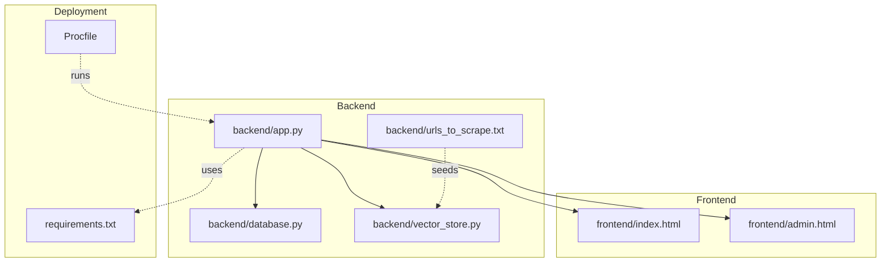
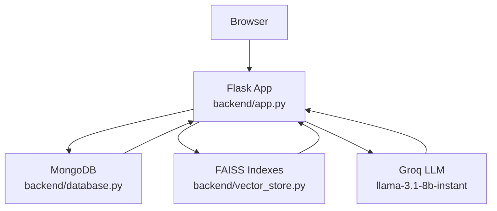
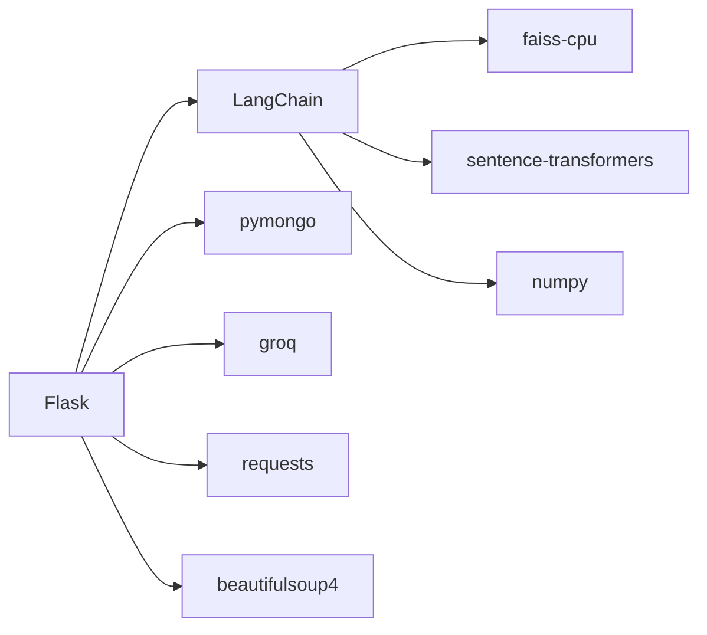
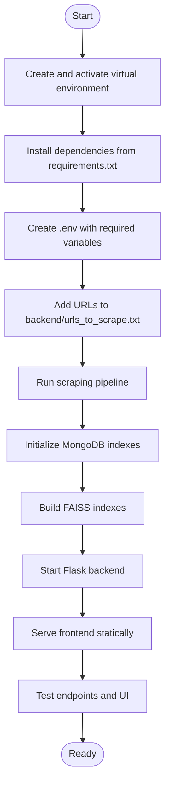

# Getting Started

<cite>
**Referenced Files in This Document**
- [requirements.txt](file://requirements.txt)
- [Procfile](file://Procfile)
- [README.md](file://README.md)
- [backend/app.py](file://backend/app.py)
- [backend/database.py](file://backend/database.py)
- [backend/vector_store.py](file://backend/vector_store.py)
- [backend/urls_to_scrape.txt](file://backend/urls_to_scrape.txt)
- [frontend/index.html](file://frontend/index.html)
- [frontend/admin.html](file://frontend/admin.html)
</cite>

## Table of Contents
1. [Introduction](#introduction)
2. [Project Structure](#project-structure)
3. [Core Components](#core-components)
4. [Architecture Overview](#architecture-overview)
5. [Detailed Component Analysis](#detailed-component-analysis)
6. [Dependency Analysis](#dependency-analysis)
7. [Performance Considerations](#performance-considerations)
8. [Troubleshooting Guide](#troubleshooting-guide)
9. [Conclusion](#conclusion)
10. [Appendices](#appendices)

## Introduction
This guide helps you install, configure, and run DamayAI-Assistant locally and deploy it to production. It covers prerequisites, environment setup, database and vector store initialization, AI model configuration, first-run steps, environment variables, basic usage, and troubleshooting.

## Project Structure
The project is split into:
- Backend (Python/Falcon-style Flask app, vector store, database helpers)
- Frontend (static HTML/CSS/JS chat and admin panels)
- Deployment configuration (Procfile for production)

**Diagram sources**
- [backend/app.py](file://backend/app.py)
- [backend/database.py](file://backend/database.py)
- [backend/vector_store.py](file://backend/vector_store.py)
- [backend/urls_to_scrape.txt](file://backend/urls_to_scrape.txt)
- [frontend/index.html](file://frontend/index.html)
- [frontend/admin.html](file://frontend/admin.html)
- [Procfile](file://Procfile)
- [requirements.txt](file://requirements.txt)

**Section sources**
- [README.md](file://README.md)
- [Procfile](file://Procfile)
- [requirements.txt](file://requirements.txt)

## Core Components
- Web server and routes: Flask app handles public chat, admin endpoints, and static assets.
- Database: MongoDB-backed persistence for scraped/manual/memory data and bug reports.
- Vector store: FAISS indexes built with sentence-transformers embeddings for retrieval augmented generation (RAG).
- AI model: Groq’s llama-3.1-8b-instant via LangChain client.
- Admin panel and user chat: Static frontend pages served by the Flask app.

**Section sources**
- [backend/app.py](file://backend/app.py)
- [backend/database.py](file://backend/database.py)
- [backend/vector_store.py](file://backend/vector_store.py)

## Architecture Overview
High-level runtime flow:
- Client browser loads frontend pages.
- Admin and user endpoints route through Flask.
- Chat queries use FAISS retrievers to fetch relevant knowledge, then prompt the Groq model for answers.
- MongoDB stores structured data and statistics.

**Diagram sources**
- [backend/app.py](file://backend/app.py)
- [backend/database.py](file://backend/database.py)
- [backend/vector_store.py](file://backend/vector_store.py)

## Detailed Component Analysis

### Prerequisites and Environment Setup
- Python version: The project targets Python 3.9+.
- System dependencies: Install Python and pip. No OS-specific packages are required beyond Python and pip.
- Virtual environment: Recommended to isolate dependencies.

Steps:
- Create and activate a virtual environment:
  - Windows: python -m venv venv
  - macOS/Linux: python3 -m venv venv
- Activate:
  - Windows: venv\Scripts\activate
  - macOS/Linux: source venv/bin/activate
- Install dependencies:
  - pip install -r requirements.txt

Notes:
- The project uses Flask, LangChain, FAISS CPU, sentence-transformers, PyMongo, and Groq.

**Section sources**
- [README.md](file://README.md)
- [requirements.txt](file://requirements.txt)

### Environment Variables
Set the following in a .env file located in the backend directory:
- SECRET_KEY: Required. Generate a secure secret key value.
- GROQ_API_KEY: Required. Get from Groq.
- MONGO_URI: Required. MongoDB connection string.
- DB_NAME: Optional. Defaults to damayai_db if not set.
- ADMIN_PASSWORD or ADMIN_PASSWORD_HASH: Required for admin login. Provide either cleartext or hashed password.

Validation:
- The app enforces SECRET_KEY presence at startup.
- GROQ_API_KEY is required for model calls; the app initializes a client even if unset, but requests will fail until configured.

**Section sources**
- [backend/app.py](file://backend/app.py)
- [backend/database.py](file://backend/database.py)

### MongoDB Database Initialization
- The app connects to MongoDB using the MONGO_URI and DB_NAME environment variables.
- On first run, the app attempts to initialize database indexes for collections: scraped_data, manual_data, memory_bank, and bug_reports.
- The backend also exposes an endpoint to drop all collections and reinitialize them.

Operational tips:
- Ensure MongoDB is reachable and credentials are correct.
- If you reset data, use the admin endpoint to drop collections and reinitialize.

**Section sources**
- [backend/database.py](file://backend/database.py)
- [backend/app.py](file://backend/app.py)

### FAISS Vector Store Initialization
- FAISS indexes are stored under db/ with three separate paths for memory, manual, and scraped data.
- On startup, the app checks for missing indexes and auto-reindexes if needed.
- FAISS indexes are rebuilt using sentence-transformers embeddings and LangChain’s RecursiveCharacterTextSplitter.

Key paths:
- db/faiss_index_memory
- db/faiss_index_manual
- db/faiss_index_scraped

Admin actions:
- Rebuild indexes manually via the admin panel.
- Delete FAISS indexes and cache if corrupted.

**Section sources**
- [backend/app.py](file://backend/app.py)
- [backend/vector_store.py](file://backend/vector_store.py)

### AI Model Configuration
- The app uses Groq’s llama-3.1-8b-instant via LangChain.
- Embeddings model: all-MiniLM-L6-v2 (sentence-transformers).
- Chat prompts are constructed dynamically from retrieved knowledge and chat history.

**Section sources**
- [backend/app.py](file://backend/app.py)
- [backend/vector_store.py](file://backend/vector_store.py)

### First Run Checklist
- Create and activate a virtual environment.
- Install dependencies from requirements.txt.
- Create .env in backend/ with SECRET_KEY, GROQ_API_KEY, MONGO_URI, optional DB_NAME, and admin credentials.
- Seed initial knowledge:
  - Add URLs to backend/urls_to_scrape.txt (one per line).
  - Run the scraping pipeline to populate scraped_data and build FAISS indexes.
- Start the backend server from the backend directory.
- Serve the frontend statically (see “Running the Application”).
- Access:
  - User chat: http://localhost:8000/
  - Admin panel: http://localhost:8000/admin.html

Verification:
- Confirm FAISS indexes exist under db/.
- Verify MongoDB collections are created and populated.
- Test chat and admin endpoints.

**Section sources**
- [README.md](file://README.md)
- [backend/urls_to_scrape.txt](file://backend/urls_to_scrape.txt)
- [backend/app.py](file://backend/app.py)

### Running the Application
- Backend server:
  - From the backend directory, run the Flask app.
  - The app serves static frontend files from the frontend directory.
- Frontend:
  - Use a simple static server to serve the frontend folder.
  - Access the user chat and admin panel at the documented URLs.

**Section sources**
- [README.md](file://README.md)
- [frontend/index.html](file://frontend/index.html)
- [frontend/admin.html](file://frontend/admin.html)

### Production Deployment
- The project includes a Procfile for production deployments using Gunicorn.
- Command:
  - web: cd backend && gunicorn --worker-class gthread --threads 4 -b 0.0.0.0:5000 app:app
- Ensure environment variables are set in your platform (Heroku, Render, etc.) and that MongoDB is reachable.

**Section sources**
- [Procfile](file://Procfile)
- [backend/app.py](file://backend/app.py)

## Dependency Analysis
Runtime dependencies include Flask, LangChain ecosystem, FAISS CPU, sentence-transformers, PyMongo, and Groq. These are declared in requirements.txt.

**Diagram sources**
- [requirements.txt](file://requirements.txt)

**Section sources**
- [requirements.txt](file://requirements.txt)

## Performance Considerations
- FAISS retrievers are cached at module level to avoid reloading on every request.
- Chunk size and overlap for embeddings are tuned for balanced recall and speed.
- Rate limiting is enabled via Flask-Limiter when available; otherwise, the app gracefully degrades.

[No sources needed since this section provides general guidance]

## Troubleshooting Guide
Common issues and resolutions:
- Missing SECRET_KEY:
  - Symptom: App exits early.
  - Fix: Set SECRET_KEY in .env.
- Missing GROQ_API_KEY:
  - Symptom: Model calls fail.
  - Fix: Set GROQ_API_KEY in .env.
- MongoDB connection errors:
  - Symptom: Database initialization fails.
  - Fix: Verify MONGO_URI and DB_NAME; ensure MongoDB is reachable.
- FAISS index errors:
  - Symptom: Retrieval fails or empty results.
  - Fix: Rebuild indexes using the admin panel or delete FAISS directories and restart.
- Port conflicts:
  - Symptom: Cannot start Flask or static server on port 5000 or 8000.
  - Fix: Change ports or stop conflicting services.

Verification steps:
- Confirm FAISS directories exist under db/.
- Check MongoDB collections exist and have documents.
- Test endpoints via the admin panel and user chat.

**Section sources**
- [backend/app.py](file://backend/app.py)
- [backend/database.py](file://backend/database.py)
- [backend/vector_store.py](file://backend/vector_store.py)

## Conclusion
You now have the essentials to install, configure, and run DamayAI-Assistant locally and deploy it to production. Ensure environment variables are set, seed knowledge via scraping, initialize MongoDB and FAISS, and verify endpoints before onboarding users.

[No sources needed since this section summarizes without analyzing specific files]

## Appendices

### A. Environment Variable Reference
- SECRET_KEY: Flask secret key.
- GROQ_API_KEY: Groq API key for model inference.
- MONGO_URI: MongoDB connection string.
- DB_NAME: Optional database name.
- ADMIN_PASSWORD or ADMIN_PASSWORD_HASH: Admin login credential.

**Section sources**
- [backend/app.py](file://backend/app.py)
- [backend/database.py](file://backend/database.py)

### B. First Run Flow

**Diagram sources**
- [README.md](file://README.md)
- [backend/urls_to_scrape.txt](file://backend/urls_to_scrape.txt)
- [backend/app.py](file://backend/app.py)
- [backend/database.py](file://backend/database.py)
- [backend/vector_store.py](file://backend/vector_store.py)