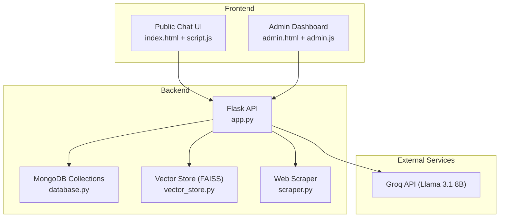
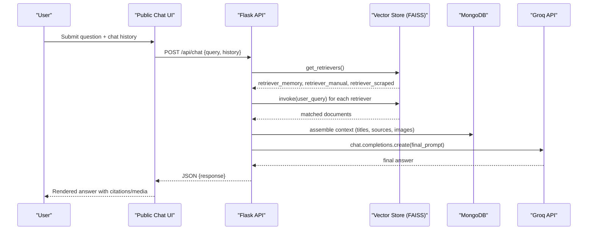
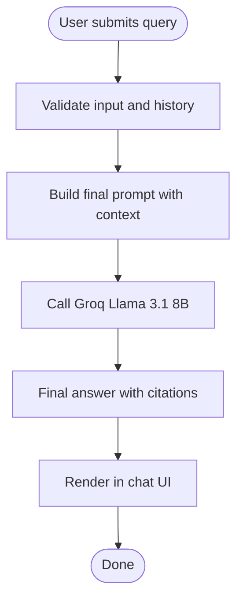
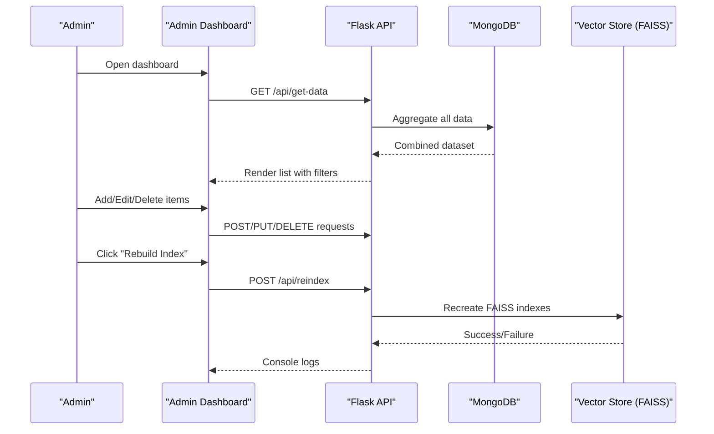
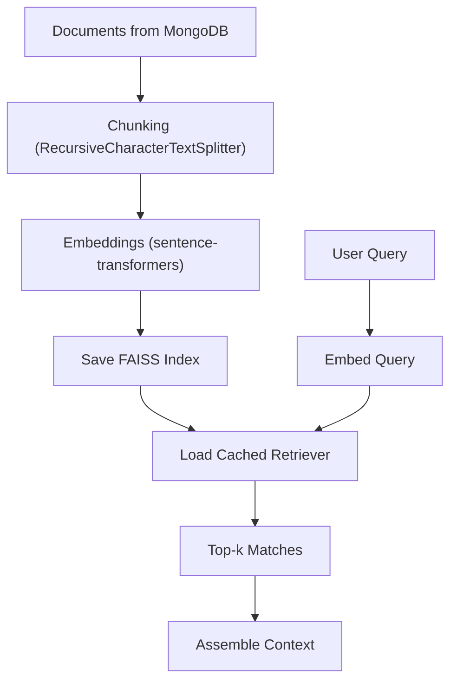
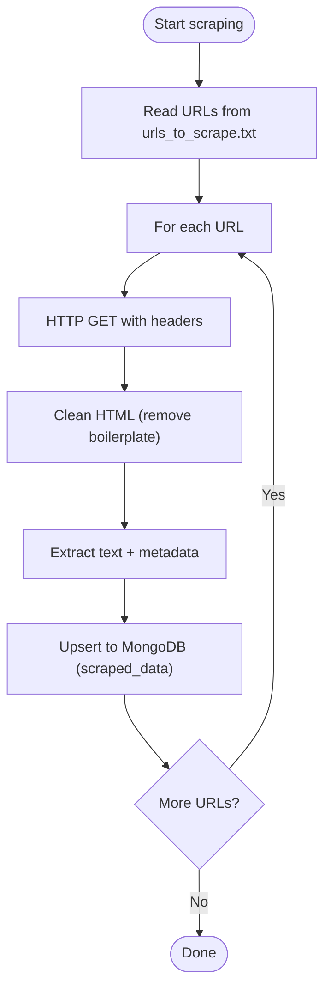
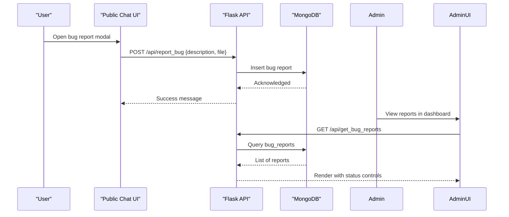
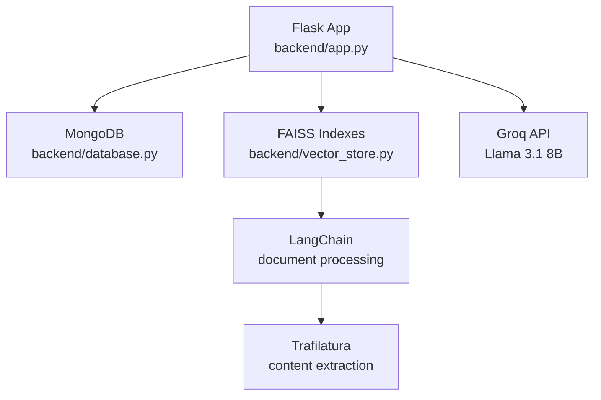

# Project Overview

<cite>
**Referenced Files in This Document**
- [requirements.txt](file://requirements.txt)
- [Procfile](file://Procfile)
- [API_DOCUMENTATION.md](file://API_DOCUMENTATION.md)
- [backend/app.py](file://backend/app.py)
- [backend/database.py](file://backend/database.py)
- [backend/vector_store.py](file://backend/vector_store.py)
- [backend/scraper.py](file://backend/scraper.py)
- [backend/urls_to_scrape.txt](file://backend/urls_to_scrape.txt)
- [frontend/index.html](file://frontend/index.html)
- [frontend/script.js](file://frontend/script.js)
- [frontend/admin.html](file://frontend/admin.html)
- [frontend/admin.js](file://frontend/admin.js)
</cite>

## Table of Contents
1. [Introduction](#introduction)
2. [Project Structure](#project-structure)
3. [Core Components](#core-components)
4. [Architecture Overview](#architecture-overview)
5. [Detailed Component Analysis](#detailed-component-analysis)
6. [Dependency Analysis](#dependency-analysis)
7. [Performance Considerations](#performance-considerations)
8. [Troubleshooting Guide](#troubleshooting-guide)
9. [Conclusion](#conclusion)

## Introduction
DamayAI-Assistant is an intelligent chatbot system designed to provide 24/7 automated information services for SMKN 2 Indramayu vocational high school. The platform enables students, parents, and staff to ask questions about school policies, academic programs, facilities, events, and administrative procedures, receiving accurate, contextual answers powered by AI and a structured knowledge base.

Key goals:
- Deliver reliable, always-available information to the school community.
- Reduce administrative burden by automating routine inquiries.
- Provide a modern, accessible interface embedded on the school’s official website.
- Enable efficient content management and maintenance of knowledge sources.

Why this solution was developed:
- Many institutions struggle to keep information centralized and up-to-date across departments and channels.
- Students and parents often need quick answers outside office hours.
- Traditional help desks can be overwhelmed by repetitive queries.
- Automated systems improve accessibility and reduce response latency.

Impact:
- Improved student and parent satisfaction through instant, accurate support.
- Streamlined operations for staff by automating common tasks.
- Centralized knowledge management with multi-source ingestion and vector-based search.

## Project Structure
The project follows a clear separation of concerns:
- Backend: Python Flask server handling API routes, vector search, scraping, and database operations.
- Frontend: Single-page application for public chat and admin dashboard with integrated bug reporting.
- Vector store: FAISS indices for semantic search across three knowledge tiers.
- Database: MongoDB collections for persistent storage of scraped, manual, and memory bank data.

**Diagram sources**
- [backend/app.py:82-83](file://backend/app.py#L82-L83)
- [backend/database.py:18-25](file://backend/database.py#L18-L25)
- [backend/vector_store.py:1-12](file://backend/vector_store.py#L1-L12)
- [backend/scraper.py:1-11](file://backend/scraper.py#L1-L11)
- [frontend/index.html:1-21](file://frontend/index.html#L1-L21)
- [frontend/admin.html:1-18](file://frontend/admin.html#L1-L18)

**Section sources**
- [Procfile:1-1](file://Procfile#L1-L1)
- [requirements.txt:1-30](file://requirements.txt#L1-L30)

## Core Components
- Public Chat Interface: A responsive chat widget embedded on the school website, enabling users to ask questions and receive AI-powered answers with citations and optional media.
- Admin Dashboard: A secure interface for managing knowledge sources, monitoring bug reports, and performing system operations like scraping, reindexing, and clearing caches.
- Multi-Tier Knowledge Base:
  - Memory Bank: Structured Q&A curated by administrators.
  - Manual Data: Curated content uploaded by administrators (text or documents).
  - Scraped Data: Automatically extracted content from the school website.
- Vector-Based Semantic Search: FAISS-backed retrieval across all knowledge tiers to find the most relevant context for each query.
- AI-Powered Conversational Engine: Groq-hosted Llama 3.1 8B model, guided by a carefully crafted system prompt to ensure grounded, citable, and friendly responses.
- Real-Time Bug Reporting: Users can submit bug reports with optional attachments; administrators track and triage issues.
- Embedding and Retrieval Pipeline: Documents are chunked, embedded, indexed, and retrieved with caching for performance.

**Section sources**
- [frontend/index.html:1-99](file://frontend/index.html#L1-L99)
- [frontend/script.js:1-428](file://frontend/script.js#L1-L428)
- [frontend/admin.html:1-164](file://frontend/admin.html#L1-L164)
- [frontend/admin.js:1-800](file://frontend/admin.js#L1-L800)
- [backend/app.py:432-760](file://backend/app.py#L432-L760)
- [backend/database.py:59-260](file://backend/database.py#L59-L260)
- [backend/vector_store.py:48-115](file://backend/vector_store.py#L48-L115)
- [backend/scraper.py:152-278](file://backend/scraper.py#L152-L278)

## Architecture Overview
The system integrates a frontend chat widget and admin panel with a Flask backend that orchestrates:
- Authentication and rate limiting
- Vector search retrieval across three knowledge tiers
- AI model inference via Groq
- Persistent storage in MongoDB
- Periodic scraping and reindexing

**Diagram sources**
- [backend/app.py:609-760](file://backend/app.py#L609-L760)
- [backend/vector_store.py:73-115](file://backend/vector_store.py#L73-L115)
- [backend/database.py:96-195](file://backend/database.py#L96-L195)

## Detailed Component Analysis

### Public Chat Experience
- Multi-turn conversations: The frontend maintains a recent history slice and sends it to the backend for grounding.
- Streaming and citations: The backend streams intermediate steps and final answer; the frontend renders citations and optional images.
- Accessibility and UX: Supports dark/light themes, copy/regenerate actions, and voice synthesis.

**Diagram sources**
- [frontend/script.js:78-111](file://frontend/script.js#L78-L111)
- [backend/app.py:609-760](file://backend/app.py#L609-L760)

**Section sources**
- [frontend/script.js:1-428](file://frontend/script.js#L1-L428)
- [backend/app.py:432-452](file://backend/app.py#L432-L452)

### Admin Content Management
- Three data types: Memory Bank (structured Q&A), Manual Data (uploaded content), Scraped Data (website content).
- CRUD operations: Retrieve, update, delete, and bulk management via the admin dashboard.
- Workflow automation: Scrape URLs from a list, deep crawl the school website, and rebuild FAISS indexes.

**Diagram sources**
- [frontend/admin.js:372-598](file://frontend/admin.js#L372-L598)
- [backend/app.py:763-800](file://backend/app.py#L763-L800)
- [backend/vector_store.py:48-70](file://backend/vector_store.py#L48-L70)

**Section sources**
- [frontend/admin.html:1-164](file://frontend/admin.html#L1-L164)
- [frontend/admin.js:1-800](file://frontend/admin.js#L1-L800)
- [backend/database.py:59-260](file://backend/database.py#L59-L260)
- [backend/vector_store.py:48-115](file://backend/vector_store.py#L48-L115)

### Vector-Based Semantic Search
- Embeddings: Sentence-transformers model for dense vectors.
- Chunking: Recursive character splitting to balance recall and performance.
- Indexing: Separate FAISS indexes for Memory Bank, Manual Data, and Scraped Data.
- Retrieval: Cached retrievers to minimize load time; configurable top-k matches.

**Diagram sources**
- [backend/vector_store.py:23-70](file://backend/vector_store.py#L23-L70)
- [backend/database.py:96-195](file://backend/database.py#L96-L195)

**Section sources**
- [backend/vector_store.py:1-115](file://backend/vector_store.py#L1-L115)
- [backend/database.py:96-195](file://backend/database.py#L96-L195)

### Web Scraping and Content Ingestion
- Safe scraping: Domain checks and SSRF protections.
- Content extraction: Uses Trafilatura and BeautifulSoup to clean and extract main content and representative images.
- Bulk ingestion: Supports reading URLs from a file and deep crawling with limits.

**Diagram sources**
- [backend/scraper.py:152-167](file://backend/scraper.py#L152-L167)
- [backend/database.py:152-169](file://backend/database.py#L152-L169)
- [backend/urls_to_scrape.txt:1-76](file://backend/urls_to_scrape.txt#L1-L76)

**Section sources**
- [backend/scraper.py:12-278](file://backend/scraper.py#L12-L278)
- [backend/database.py:152-169](file://backend/database.py#L152-L169)
- [backend/urls_to_scrape.txt:1-76](file://backend/urls_to_scrape.txt#L1-L76)

### Real-Time Bug Reporting
- User-facing: Modal form to describe issues and attach screenshots/videos.
- Admin-facing: Dashboard to view, filter, update status, and delete reports.
- Persistence: Stored in MongoDB with timestamps and status tracking.

**Diagram sources**
- [frontend/script.js:118-147](file://frontend/script.js#L118-L147)
- [backend/app.py:403-431](file://backend/app.py#L403-L431)
- [backend/database.py:199-228](file://backend/database.py#L199-L228)
- [frontend/admin.js:682-786](file://frontend/admin.js#L682-L786)

**Section sources**
- [frontend/script.js:118-147](file://frontend/script.js#L118-L147)
- [backend/app.py:403-431](file://backend/app.py#L403-L431)
- [backend/database.py:199-228](file://backend/database.py#L199-L228)
- [frontend/admin.js:682-786](file://frontend/admin.js#L682-L786)

## Dependency Analysis
Technology stack overview:
- Backend framework: Flask (Python)
- Database: MongoDB (PyMongo)
- Vector search: FAISS (CPU)
- AI model: Groq (Llama 3.1 8B Instant)
- Libraries: LangChain, BeautifulSoup4, Trafilatura, PyPDF2, python-docx, sentence-transformers, flask-limiter, bleach, gunicorn

**Diagram sources**
- [requirements.txt:1-30](file://requirements.txt#L1-L30)
- [backend/app.py:1-30](file://backend/app.py#L1-L30)
- [backend/vector_store.py:1-12](file://backend/vector_store.py#L1-L12)
- [backend/scraper.py:1-11](file://backend/scraper.py#L1-L11)

**Section sources**
- [requirements.txt:1-30](file://requirements.txt#L1-L30)
- [API_DOCUMENTATION.md:309-324](file://API_DOCUMENTATION.md#L309-L324)

## Performance Considerations
- Vector search caching: FAISS retrievers are cached to avoid reloading on every request.
- Chunk sizing: Recursive chunking balances precision and performance.
- Rate limiting: Configured per endpoint to prevent abuse and protect resources.
- Session management: Short-lived sessions with CSRF protection.
- CDN-friendly deployment: Static assets served via Flask with caching headers for public endpoints.

[No sources needed since this section provides general guidance]

## Troubleshooting Guide
Common issues and resolutions:
- Missing FAISS indexes: The system auto-reindexes at startup if any index is missing.
- Unauthorized access: Admin endpoints require login and CSRF token; session timeouts reset state.
- Rate limiting: Exceeded limits return standardized errors; adjust client behavior accordingly.
- File upload limits: Maximum 16 MB; supported extensions documented in API docs.
- Vector search failures: Rebuild indexes after adding or updating content.

**Section sources**
- [backend/app.py:220-237](file://backend/app.py#L220-L237)
- [API_DOCUMENTATION.md:232-288](file://API_DOCUMENTATION.md#L232-L288)

## Conclusion
DamayAI-Assistant delivers a robust, scalable, and secure conversational platform tailored for SMKN 2 Indramayu. By combining a multi-tier knowledge base, vector-based semantic search, and an AI model tuned for grounded, citable responses, it empowers students, parents, and staff to quickly access accurate information. The admin dashboard simplifies content management and maintenance, while the bug reporting system ensures continuous improvement. This solution enhances accessibility, reduces operational overhead, and strengthens the institution’s digital presence.