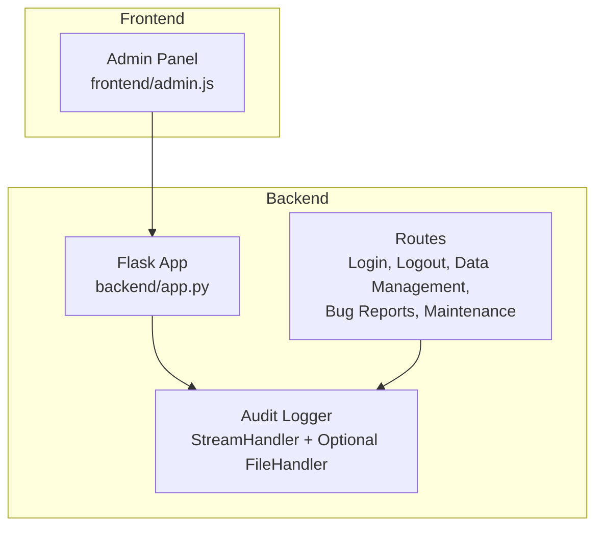
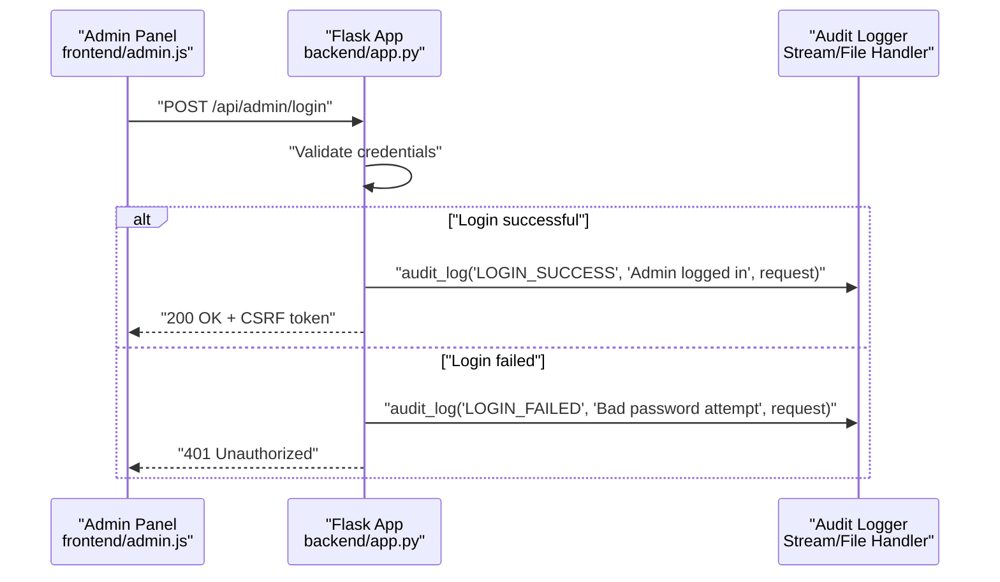
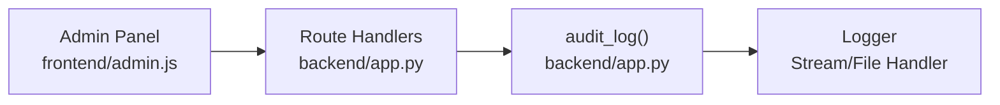

# Audit Logging and Monitoring

<cite>
**Referenced Files in This Document**
- [backend/app.py](file://backend/app.py)
- [frontend/admin.js](file://frontend/admin.js)
</cite>

## Table of Contents
1. [Introduction](#introduction)
2. [Project Structure](#project-structure)
3. [Core Components](#core-components)
4. [Architecture Overview](#architecture-overview)
5. [Detailed Component Analysis](#detailed-component-analysis)
6. [Dependency Analysis](#dependency-analysis)
7. [Performance Considerations](#performance-considerations)
8. [Troubleshooting Guide](#troubleshooting-guide)
9. [Conclusion](#conclusion)
10. [Appendices](#appendices)

## Introduction
This document describes the audit logging and monitoring system in DamayAI-Assistant. It explains how the audit logger is configured with a console handler and an optional file handler, how the centralized audit_log() function records administrative and system actions, and how audit trails are generated for login attempts, bug report activities, data management actions, and system maintenance tasks. It also documents the logging format, provides examples and interpretations, and outlines best practices, log rotation considerations, and security implications for integrating audit logs with security monitoring and incident response workflows.

## Project Structure
The audit logging system is implemented in the backend Flask application and is consumed by the admin frontend for operational transparency and accountability.

**Diagram sources**
- [backend/app.py:35-56](file://backend/app.py#L35-L56)
- [backend/app.py:331-359](file://backend/app.py#L331-L359)
- [backend/app.py:462-496](file://backend/app.py#L462-L496)
- [backend/app.py:498-566](file://backend/app.py#L498-L566)
- [backend/app.py:568-586](file://backend/app.py#L568-L586)
- [backend/app.py:763-784](file://backend/app.py#L763-L784)
- [backend/app.py:786-799](file://backend/app.py#L786-L799)
- [frontend/admin.js:163-191](file://frontend/admin.js#L163-L191)

**Section sources**
- [backend/app.py:35-56](file://backend/app.py#L35-L56)
- [backend/app.py:331-359](file://backend/app.py#L331-L359)
- [backend/app.py:462-496](file://backend/app.py#L462-L496)
- [backend/app.py:498-566](file://backend/app.py#L498-L566)
- [backend/app.py:568-586](file://backend/app.py#L568-L586)
- [backend/app.py:763-784](file://backend/app.py#L763-L784)
- [backend/app.py:786-799](file://backend/app.py#L786-L799)
- [frontend/admin.js:163-191](file://frontend/admin.js#L163-L191)

## Core Components
- Audit logger configuration
  - A dedicated logger named for audit purposes is created and set to INFO level.
  - A StreamHandler is always attached with a formatter that includes a timestamp and a standardized "[AUDIT]" tag.
  - An optional FileHandler is added if file creation succeeds; otherwise, file logging is silently skipped.
- Centralized audit_log() function
  - Accepts an action identifier, a detail string, and an optional request object.
  - Extracts the client IP address from the request when available; otherwise logs "system".
  - Emits a structured log line in the format: timestamp [AUDIT] IP ACTION | DETAIL.

Key implementation references:
- Logger setup and handlers: [backend/app.py:35-56](file://backend/app.py#L35-L56)
- Function signature and body: [backend/app.py:53-56](file://backend/app.py#L53-L56)

**Section sources**
- [backend/app.py:35-56](file://backend/app.py#L35-L56)
- [backend/app.py:53-56](file://backend/app.py#L53-L56)

## Architecture Overview
The audit logging architecture integrates tightly with backend routes that perform sensitive or administrative operations. Each route invokes audit_log() with an appropriate action label and a concise detail string derived from the operation context.

**Diagram sources**
- [backend/app.py:331-359](file://backend/app.py#L331-L359)
- [backend/app.py:53-56](file://backend/app.py#L53-L56)
- [frontend/admin.js:163-191](file://frontend/admin.js#L163-L191)

## Detailed Component Analysis

### Audit Logger Configuration
- Logger identity and level: The audit logger is created under a dedicated namespace and set to INFO level to capture significant events.
- Console handler: Always enabled via StreamHandler with a fixed format including timestamp and "[AUDIT]" tag.
- File handler: Attempted to attach a FileHandler writing to a file named "audit.log". If file creation fails, the system continues without file logging (best-effort behavior).

Operational implications:
- Ensures visibility in development and production environments via stdout.
- Provides persistent audit trail when filesystem permissions and disk space permit.

References:
- Logger setup and handlers: [backend/app.py:35-56](file://backend/app.py#L35-L56)

**Section sources**
- [backend/app.py:35-56](file://backend/app.py#L35-L56)

### audit_log() Function Implementation
- Purpose: Centralized function to record administrative and system actions consistently.
- Inputs:
  - action: A short, uppercase label indicating the event category.
  - detail: A human-readable description of the event.
  - request_obj: Optional Flask request object used to extract the client IP.
- Behavior:
  - Determines IP address from request.remote_addr or falls back to "system".
  - Logs a single line with the standardized format: timestamp [AUDIT] IP ACTION | DETAIL.

References:
- Function definition and usage pattern: [backend/app.py:53-56](file://backend/app.py#L53-L56)

**Section sources**
- [backend/app.py:53-56](file://backend/app.py#L53-L56)

### Audit Trails for Login Attempts
- LOGIN_SUCCESS: Emitted upon successful admin authentication. Includes a note confirming admin login.
- LOGIN_FAILED: Emitted when authentication fails, capturing a generic bad password attempt note.
- LOGOUT: Emitted when an admin initiates logout.

References:
- Login route and success/failure logging: [backend/app.py:331-359](file://backend/app.py#L331-L359)
- Frontend login initiation: [frontend/admin.js:163-191](file://frontend/admin.js#L163-L191)

**Section sources**
- [backend/app.py:331-359](file://backend/app.py#L331-L359)
- [frontend/admin.js:163-191](file://frontend/admin.js#L163-L191)

### Audit Trails for Bug Report Activities
- BUG_REPORT: Logged when a bug report is submitted (handled in the local settings backend).
- BUG_STATUS_UPDATE: Logged when an admin updates the status of a bug report.
- BUG_DELETE: Logged when an admin deletes a bug report.

References:
- Status update handler and logging: [backend/app.py:462-481](file://backend/app.py#L462-L481)
- Delete handler and logging: [backend/app.py:483-496](file://backend/app.py#L483-L496)
- Local settings handlers (for submission): [Local Settings/app.py:91-94](file://Local Settings/app.py#L91-L94)

**Section sources**
- [backend/app.py:462-481](file://backend/app.py#L462-L481)
- [backend/app.py:483-496](file://backend/app.py#L483-L496)
- [Local Settings/app.py:91-94](file://Local Settings/app.py#L91-L94)

### Audit Trails for Data Management Actions
- DATA_ADD_TEXT: Logged when adding manual text content via the admin panel.
- DATA_ADD_FILE: Logged when uploading and indexing a supported file.
- MEMORY_SAVE: Logged when saving a Q&A pair to the memory bank.

References:
- Text addition handler and logging: [backend/app.py:498-518](file://backend/app.py#L498-L518)
- File addition handler and logging: [backend/app.py:520-566](file://backend/app.py#L520-L566)
- Memory save handler and logging: [backend/app.py:568-586](file://backend/app.py#L568-L586)

**Section sources**
- [backend/app.py:498-518](file://backend/app.py#L498-L518)
- [backend/app.py:520-566](file://backend/app.py#L520-L566)
- [backend/app.py:568-586](file://backend/app.py#L568-L586)

### Audit Trails for System Maintenance
- FAISS_DELETE: Logged when deleting FAISS indexes across configured paths.
- DATABASE_DELETE: Logged when dropping all database collections and reinitializing.

References:
- FAISS deletion handler and logging: [backend/app.py:763-784](file://backend/app.py#L763-L784)
- Database deletion handler and logging: [backend/app.py:786-799](file://backend/app.py#L786-L799)

**Section sources**
- [backend/app.py:763-784](file://backend/app.py#L763-L784)
- [backend/app.py:786-799](file://backend/app.py#L786-L799)

### Logging Format and Examples
Format specification:
- Timestamp: ISO-like date format as configured in the audit logger.
- Tag: "[AUDIT]"
- IP address: Extracted from the request or "system" when unavailable.
- Action: Uppercase label representing the event category.
- Detail: Short description of the event.

Example entries and interpretation:
- Example: "2025-03-27 14:22:15 [AUDIT] 127.0.0.1 LOGIN_SUCCESS | Admin logged in"
  - Interpretation: Successful admin login from the loopback address.
- Example: "2025-03-27 14:22:16 [AUDIT] 192.0.2.100 LOGIN_FAILED | Bad password attempt"
  - Interpretation: Unsuccessful login attempt from an external IP.
- Example: "2025-03-27 14:22:17 [AUDIT] system FAISS_DELETE | Deleted 3 FAISS indexes"
  - Interpretation: System-initiated cleanup of FAISS indexes.
- Example: "2025-03-27 14:22:18 [AUDIT] 127.0.0.1 DATA_ADD_TEXT | Manual text added: 'Welcome'"
  - Interpretation: Admin added a manual text item titled "Welcome".

References:
- Logger format and audit_log() usage: [backend/app.py:35-56](file://backend/app.py#L35-L56), [backend/app.py:53-56](file://backend/app.py#L53-L56)

**Section sources**
- [backend/app.py:35-56](file://backend/app.py#L35-L56)
- [backend/app.py:53-56](file://backend/app.py#L53-L56)

## Dependency Analysis
The audit logging system depends on:
- Flask request context for extracting client IP addresses.
- Standard library logging module for stream and file output.
- Route handlers invoking audit_log() with appropriate action labels and details.

**Diagram sources**
- [frontend/admin.js:163-191](file://frontend/admin.js#L163-L191)
- [backend/app.py:331-359](file://backend/app.py#L331-L359)
- [backend/app.py:462-496](file://backend/app.py#L462-L496)
- [backend/app.py:498-586](file://backend/app.py#L498-L586)
- [backend/app.py:763-799](file://backend/app.py#L763-L799)
- [backend/app.py:53-56](file://backend/app.py#L53-L56)
- [backend/app.py:35-56](file://backend/app.py#L35-L56)

**Section sources**
- [frontend/admin.js:163-191](file://frontend/admin.js#L163-L191)
- [backend/app.py:331-359](file://backend/app.py#L331-L359)
- [backend/app.py:462-496](file://backend/app.py#L462-L496)
- [backend/app.py:498-586](file://backend/app.py#L498-L586)
- [backend/app.py:763-799](file://backend/app.py#L763-L799)
- [backend/app.py:53-56](file://backend/app.py#L53-L56)
- [backend/app.py:35-56](file://backend/app.py#L35-L56)

## Performance Considerations
- Handler overhead: Using synchronous file I/O in the FileHandler can block threads during write operations. Consider asynchronous logging or a dedicated logging agent for high-throughput deployments.
- Log volume: Administrative actions can generate frequent entries. Monitor disk usage and enable rotation to prevent unbounded growth.
- Formatting cost: The current formatter is lightweight but still adds CPU overhead per log call; avoid excessive detail strings in hot paths.

## Troubleshooting Guide
Common issues and resolutions:
- File logging disabled
  - Symptom: No audit.log file is created.
  - Cause: File creation failed due to permission or disk issues.
  - Resolution: Verify filesystem permissions and available disk space; ensure the working directory is writable.
  - Reference: [backend/app.py:44-51](file://backend/app.py#L44-L51)
- Missing IP address
  - Symptom: Entries show "system" as the IP.
  - Cause: Request object not passed or reverse proxy configuration not exposing remote_addr.
  - Resolution: Pass the request object to audit_log() in all handlers; configure proxy headers if applicable.
  - Reference: [backend/app.py:53-56](file://backend/app.py#L53-L56)
- Excessive log volume
  - Symptom: Disk filling quickly.
  - Resolution: Enable log rotation; consider filtering or reducing verbosity for routine operations.
- Missing audit entries
  - Symptom: Some operations do not appear in logs.
  - Cause: Handlers not invoking audit_log() or exceptions before logging.
  - Resolution: Review route handlers to ensure audit_log() is called after validation and before returning; wrap handlers to guarantee logging on errors if needed.
  - References:
    - [backend/app.py:498-518](file://backend/app.py#L498-L518)
    - [backend/app.py:520-566](file://backend/app.py#L520-L566)
    - [backend/app.py:568-586](file://backend/app.py#L568-L586)
    - [backend/app.py:763-784](file://backend/app.py#L763-L784)
    - [backend/app.py:786-799](file://backend/app.py#L786-L799)

**Section sources**
- [backend/app.py:44-51](file://backend/app.py#L44-L51)
- [backend/app.py:53-56](file://backend/app.py#L53-L56)
- [backend/app.py:498-518](file://backend/app.py#L498-L518)
- [backend/app.py:520-566](file://backend/app.py#L520-L566)
- [backend/app.py:568-586](file://backend/app.py#L568-L586)
- [backend/app.py:763-784](file://backend/app.py#L763-L784)
- [backend/app.py:786-799](file://backend/app.py#L786-L799)

## Conclusion
The audit logging system in DamayAI-Assistant provides a consistent, structured mechanism for tracking administrative and system events. By centralizing logging through a dedicated logger and a unified audit_log() function, the system ensures that critical actions—authentication, data management, bug report handling, and maintenance—are recorded with timestamps, IP addresses, actions, and details. Integrating these logs with security monitoring and incident response workflows enables rapid detection, investigation, and remediation of suspicious activities.

## Appendices

### Best Practices for Audit Logging
- Always pass the request object to audit_log() to capture accurate client IPs.
- Keep detail strings concise but meaningful; avoid sensitive data in logs.
- Use structured log lines to simplify parsing and querying.
- Enable log rotation and retention policies aligned with compliance requirements.
- Store audit logs securely and restrict access to authorized administrators only.

### Security Implications
- Logs serve as evidence for forensic analysis and compliance audits.
- Ensure logs are protected against tampering and unauthorized access.
- Consider encrypting logs at rest and in transit if required by policy.
- Integrate with SIEM systems to correlate audit events with network and application logs.

### Integration with Security Monitoring and Incident Response
- Feed audit.log into SIEM or log aggregation platforms for real-time alerts.
- Configure thresholds for repeated LOGIN_FAILED events to trigger rate-limiting or account lockout.
- Correlate FAISS_DELETE and DATABASE_DELETE events with access control logs to detect unauthorized maintenance activities.
- Automate alerting for anomalous patterns (e.g., unusual hours, multiple failed logins, bulk deletions).