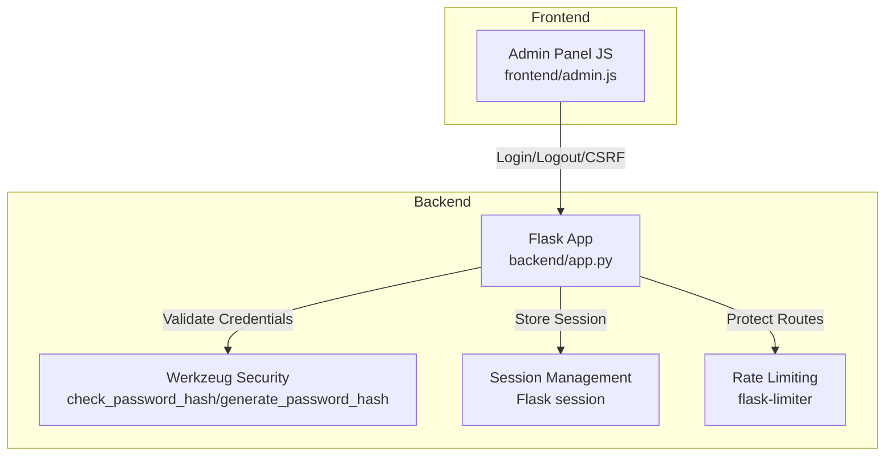
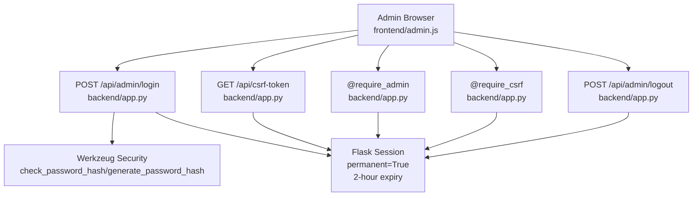
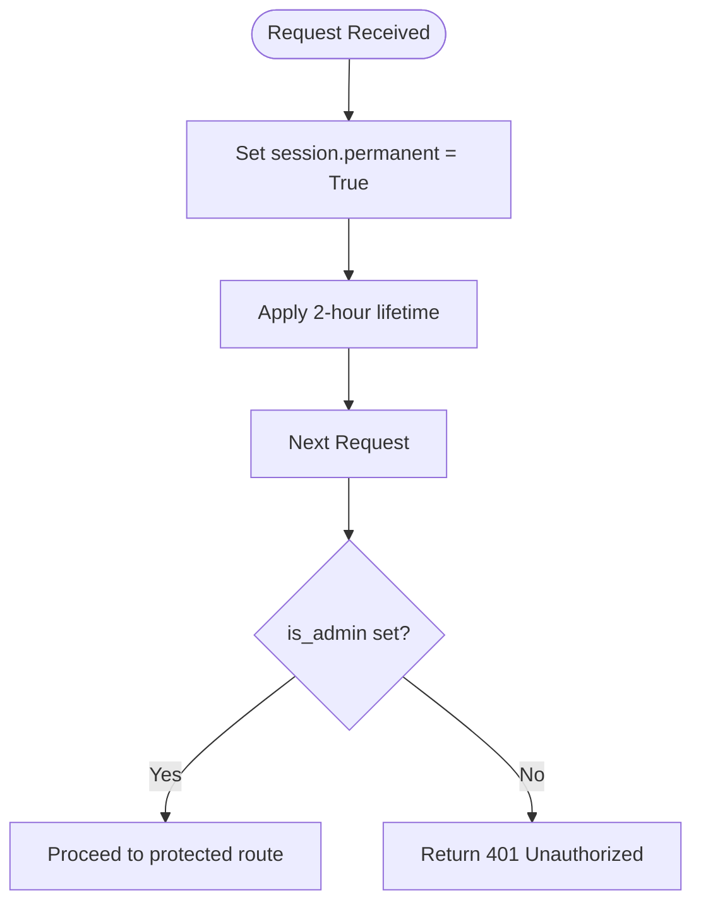
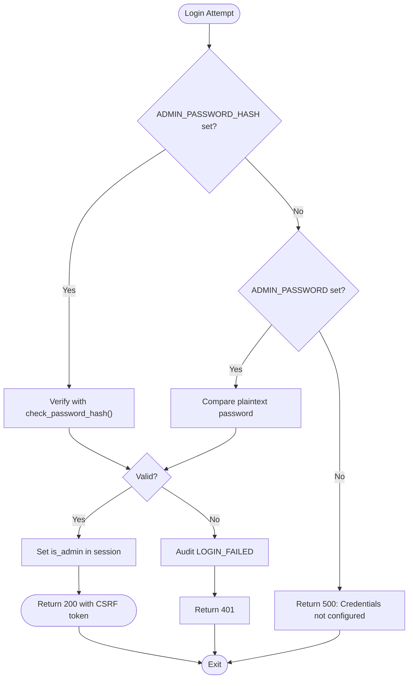
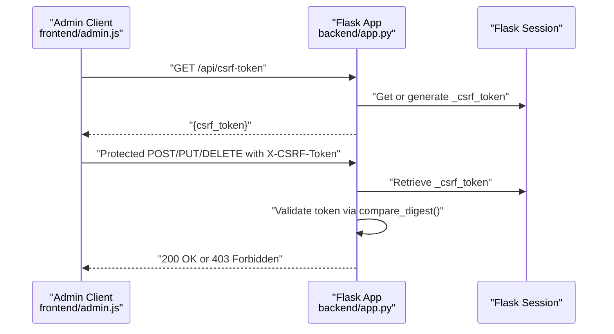
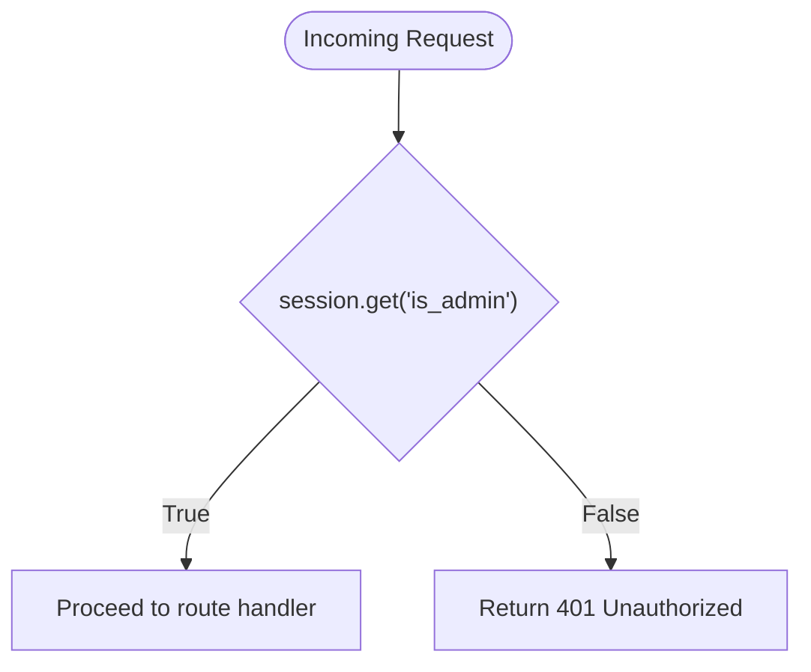
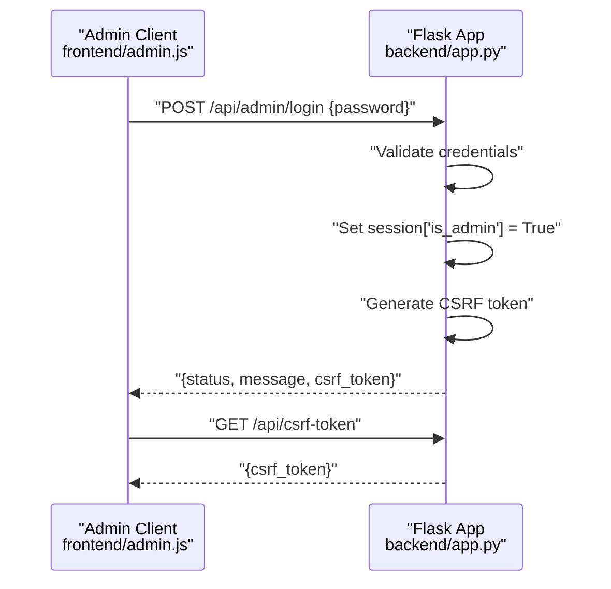
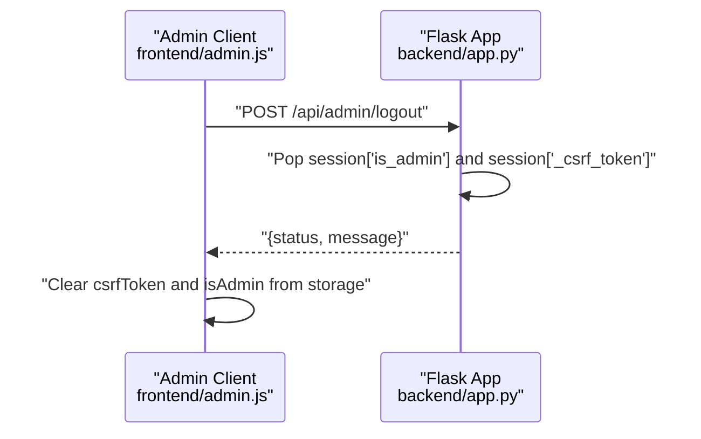
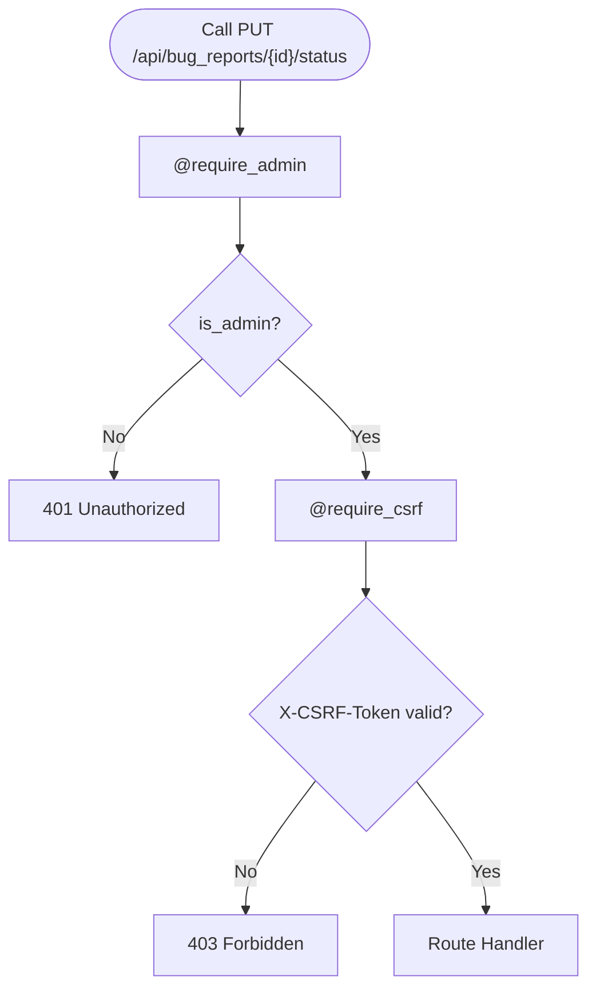
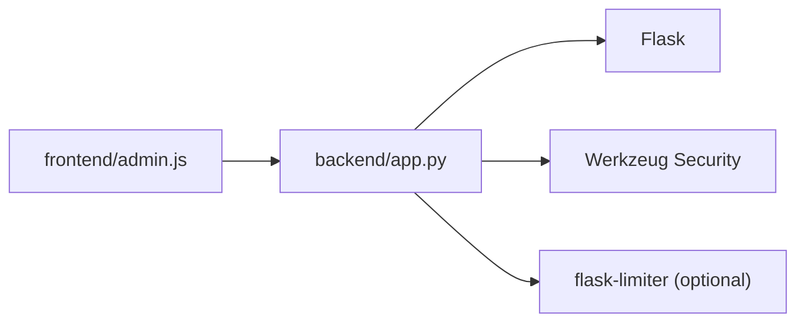

# Authentication System

<cite>
**Referenced Files in This Document**
- [backend/app.py](file://backend/app.py)
- [backend/database.py](file://backend/database.py)
- [frontend/admin.js](file://frontend/admin.js)
</cite>

## Table of Contents
1. [Introduction](#introduction)
2. [Project Structure](#project-structure)
3. [Core Components](#core-components)
4. [Architecture Overview](#architecture-overview)
5. [Detailed Component Analysis](#detailed-component-analysis)
6. [Dependency Analysis](#dependency-analysis)
7. [Performance Considerations](#performance-considerations)
8. [Troubleshooting Guide](#troubleshooting-guide)
9. [Conclusion](#conclusion)

## Introduction
This document explains the DamayAI-Assistant admin authentication system. It covers the admin login/logout mechanism, password validation using Werkzeug security utilities, session management with Flask sessions, dual authentication support for plain text and hashed passwords, CSRF protection, and session-based authorization. It also provides examples of login flow, session handling, and CSRF protection in action, along with security considerations for password storage, session security, and credential validation.

## Project Structure
The authentication system spans the backend Flask application and the admin frontend:
- Backend: Flask routes, session configuration, CSRF helpers, decorators, and rate limiting
- Frontend: Admin panel JavaScript that handles login, session persistence, CSRF token retrieval, and protected API calls

**Diagram sources**
- [backend/app.py:82-93](file://backend/app.py#L82-L93)
- [backend/app.py:136-159](file://backend/app.py#L136-L159)
- [backend/app.py:242-250](file://backend/app.py#L242-L250)
- [frontend/admin.js:163-191](file://frontend/admin.js#L163-L191)

**Section sources**
- [backend/app.py:82-93](file://backend/app.py#L82-L93)
- [frontend/admin.js:163-191](file://frontend/admin.js#L163-L191)

## Core Components
- Secret key and session configuration
  - Secret key loaded from environment variable
  - Sessions configured as permanent with 2-hour lifetime
- Password validation
  - Supports plain text password comparison or hashed password verification using Werkzeug utilities
- CSRF protection
  - CSRF token generation and validation helpers
  - Decorator to enforce CSRF validation on state-changing requests
- Authorization
  - Session-based authorization using a dedicated decorator
- Audit logging
  - Login success/failure events recorded for audit trail

**Section sources**
- [backend/app.py:61-66](file://backend/app.py#L61-L66)
- [backend/app.py:91-93](file://backend/app.py#L91-L93)
- [backend/app.py:240-241](file://backend/app.py#L240-L241)
- [backend/app.py:136-159](file://backend/app.py#L136-L159)
- [backend/app.py:242-250](file://backend/app.py#L242-L250)
- [backend/app.py:53-56](file://backend/app.py#L53-L56)

## Architecture Overview
The authentication architecture integrates Flask session management, Werkzeug security utilities, and a frontend client that manages CSRF tokens and session state.

**Diagram sources**
- [backend/app.py:331-352](file://backend/app.py#L331-L352)
- [backend/app.py:354-359](file://backend/app.py#L354-L359)
- [backend/app.py:362-365](file://backend/app.py#L362-L365)
- [backend/app.py:242-250](file://backend/app.py#L242-L250)
- [backend/app.py:151-159](file://backend/app.py#L151-L159)
- [backend/app.py:309-311](file://backend/app.py#L309-L311)

## Detailed Component Analysis

### Session Management
- Permanent sessions enabled globally
- 2-hour expiration enforced via configuration
- Session keys used for admin authorization and CSRF token storage

**Diagram sources**
- [backend/app.py:309-311](file://backend/app.py#L309-L311)
- [backend/app.py:91-93](file://backend/app.py#L91-L93)
- [backend/app.py:242-250](file://backend/app.py#L242-L250)

**Section sources**
- [backend/app.py:309-311](file://backend/app.py#L309-L311)
- [backend/app.py:91-93](file://backend/app.py#L91-L93)
- [backend/app.py:242-250](file://backend/app.py#L242-L250)

### Password Validation and Dual Authentication
- Environment-driven dual authentication:
  - Hashed password: validated using Werkzeug’s hash checker
  - Plain text password: direct string comparison
- Fallback behavior when neither is configured returns a server error

**Diagram sources**
- [backend/app.py:331-352](file://backend/app.py#L331-L352)
- [backend/app.py:240-241](file://backend/app.py#L240-L241)
- [backend/app.py:23-24](file://backend/app.py#L23-L24)

**Section sources**
- [backend/app.py:331-352](file://backend/app.py#L331-L352)
- [backend/app.py:240-241](file://backend/app.py#L240-L241)
- [backend/app.py:23-24](file://backend/app.py#L23-L24)

### CSRF Token Generation and Validation
- CSRF token stored in session and generated on demand
- Validation compares request header token with session-stored token using constant-time comparison
- Decorator enforces CSRF validation for state-changing requests

**Diagram sources**
- [backend/app.py:136-159](file://backend/app.py#L136-L159)
- [backend/app.py:362-365](file://backend/app.py#L362-L365)
- [frontend/admin.js:200-234](file://frontend/admin.js#L200-L234)

**Section sources**
- [backend/app.py:136-159](file://backend/app.py#L136-L159)
- [backend/app.py:362-365](file://backend/app.py#L362-L365)
- [frontend/admin.js:200-234](file://frontend/admin.js#L200-L234)

### Session-Based Authorization
- Authorization decorator checks for admin session flag
- Returns 401 Unauthorized if not authenticated

**Diagram sources**
- [backend/app.py:242-250](file://backend/app.py#L242-L250)

**Section sources**
- [backend/app.py:242-250](file://backend/app.py#L242-L250)

### Login Flow Example
- Client submits password to login endpoint
- Server validates credentials (hashed or plain)
- On success, server sets admin session and returns CSRF token
- Client stores CSRF token and admin flag, initializes admin panel

**Diagram sources**
- [backend/app.py:331-352](file://backend/app.py#L331-L352)
- [backend/app.py:362-365](file://backend/app.py#L362-L365)
- [frontend/admin.js:163-191](file://frontend/admin.js#L163-L191)

**Section sources**
- [backend/app.py:331-352](file://backend/app.py#L331-L352)
- [backend/app.py:362-365](file://backend/app.py#L362-L365)
- [frontend/admin.js:163-191](file://frontend/admin.js#L163-L191)

### Logout Flow Example
- Client triggers logout
- Server clears admin and CSRF tokens from session
- Client clears local state and shows login overlay

**Diagram sources**
- [backend/app.py:354-359](file://backend/app.py#L354-L359)
- [frontend/admin.js:237-244](file://frontend/admin.js#L237-L244)

**Section sources**
- [backend/app.py:354-359](file://backend/app.py#L354-L359)
- [frontend/admin.js:237-244](file://frontend/admin.js#L237-L244)

### Protected Route Example
- Route requires admin session and CSRF validation
- Decorators enforce authorization and CSRF checks

**Diagram sources**
- [backend/app.py:462-481](file://backend/app.py#L462-L481)
- [backend/app.py:242-250](file://backend/app.py#L242-L250)
- [backend/app.py:151-159](file://backend/app.py#L151-L159)

**Section sources**
- [backend/app.py:462-481](file://backend/app.py#L462-L481)
- [backend/app.py:242-250](file://backend/app.py#L242-L250)
- [backend/app.py:151-159](file://backend/app.py#L151-L159)

## Dependency Analysis
- Backend depends on:
  - Flask for routing and sessions
  - Werkzeug for password hashing and security utilities
  - Optional flask-limiter for rate limiting
- Frontend depends on:
  - Session storage for admin state
  - Fetch API for authentication and CSRF token management

**Diagram sources**
- [backend/app.py:10-24](file://backend/app.py#L10-L24)
- [frontend/admin.js:163-191](file://frontend/admin.js#L163-L191)

**Section sources**
- [backend/app.py:10-24](file://backend/app.py#L10-L24)
- [frontend/admin.js:163-191](file://frontend/admin.js#L163-L191)

## Performance Considerations
- Rate limiting applied to login and public endpoints to mitigate brute force and abuse
- Session storage is server-side; ensure appropriate session store scaling for deployment
- CSRF token generation is lightweight; avoid unnecessary regeneration by reusing tokens during a session

[No sources needed since this section provides general guidance]

## Troubleshooting Guide
- Login fails with server error indicating credentials not configured
  - Cause: Missing environment variables for admin credentials
  - Resolution: Set either ADMIN_PASSWORD or ADMIN_PASSWORD_HASH
- Unauthorized after login
  - Cause: Missing or invalid admin session
  - Resolution: Ensure session persistence and that require_admin decorator is applied to protected routes
- CSRF validation failed
  - Cause: Missing or mismatched X-CSRF-Token header
  - Resolution: Retrieve CSRF token via /api/csrf-token and include it in state-changing requests
- Session expires unexpectedly
  - Cause: 2-hour session lifetime reached
  - Resolution: Re-authenticate; frontend should handle re-login gracefully

**Section sources**
- [backend/app.py:240-241](file://backend/app.py#L240-L241)
- [backend/app.py:242-250](file://backend/app.py#L242-L250)
- [backend/app.py:143-149](file://backend/app.py#L143-L149)
- [backend/app.py:91-93](file://backend/app.py#L91-L93)
- [frontend/admin.js:214-234](file://frontend/admin.js#L214-L234)

## Conclusion
The DamayAI-Assistant admin authentication system combines Flask sessions, Werkzeug security utilities, and a robust CSRF protection mechanism. It supports dual authentication modes, enforces session-based authorization, and provides clear client-side integration for login, session persistence, and CSRF token handling. Proper environment configuration and adherence to the documented flows ensure secure and reliable administration access.