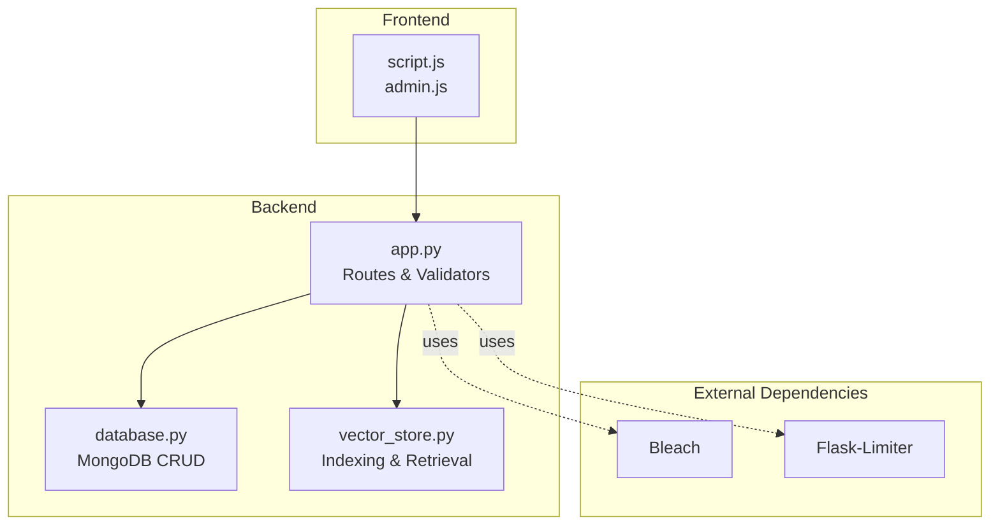
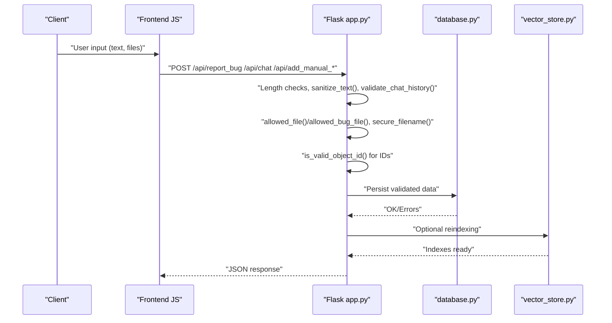
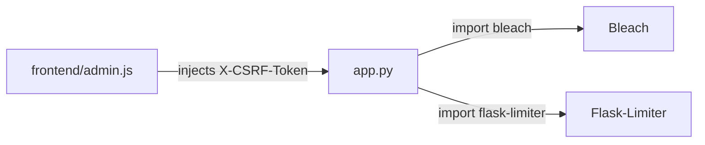

# Input Validation and Sanitization

<cite>
**Referenced Files in This Document**
- [app.py](file://backend/app.py)
- [database.py](file://backend/database.py)
- [vector_store.py](file://backend/vector_store.py)
- [script.js](file://frontend/script.js)
- [admin.js](file://frontend/admin.js)
- [requirements.txt](file://requirements.txt)
</cite>

## Table of Contents
1. [Introduction](#introduction)
2. [Project Structure](#project-structure)
3. [Core Components](#core-components)
4. [Architecture Overview](#architecture-overview)
5. [Detailed Component Analysis](#detailed-component-analysis)
6. [Dependency Analysis](#dependency-analysis)
7. [Performance Considerations](#performance-considerations)
8. [Troubleshooting Guide](#troubleshooting-guide)
9. [Conclusion](#conclusion)

## Introduction
This document explains the input validation and sanitization mechanisms implemented in DamayAI-Assistant. It covers:
- Length-based limits for text content, chat queries, and bug report descriptions
- HTML sanitization for user-provided text
- Chat history validation and truncation
- MongoDB ObjectId validation
- File upload validation and safe file handling
- CSRF protection and rate limiting
- Examples of validation in bug reports, manual data uploads, and chat queries
- Mitigations against common injection attacks, length-based attacks, and malformed input

## Project Structure
The validation logic spans the backend Flask application, database layer, and frontend JavaScript. The backend enforces strict input checks and sanitization, while the frontend performs basic client-side checks and safe rendering.

**Diagram sources**
- [app.py:100-115](file://backend/app.py#L100-L115)
- [requirements.txt:1-30](file://requirements.txt#L1-L30)
- [script.js:118-147](file://frontend/script.js#L118-L147)
- [admin.js:908-968](file://frontend/admin.js#L908-L968)

**Section sources**
- [app.py:100-115](file://backend/app.py#L100-L115)
- [requirements.txt:1-30](file://requirements.txt#L1-L30)

## Core Components
- Length limits:
  - MAX_TEXT_CONTENT_LENGTH: 100 KB
  - MAX_QUERY_LENGTH: 2,000 characters
  - MAX_DESCRIPTION_LENGTH: 5,000 characters
- Sanitization:
  - sanitize_text(): strips HTML tags using Bleach
  - validate_chat_history(): validates and truncates chat history
- Security helpers:
  - is_valid_object_id(): validates MongoDB ObjectId
  - allowed_file()/allowed_bug_file(): restricts file extensions
  - secure_filename(): ensures safe filesystem filenames
  - CSRF token generation/validation and rate limiting decorators

**Section sources**
- [app.py:127-183](file://backend/app.py#L127-L183)
- [app.py:164-183](file://backend/app.py#L164-L183)

## Architecture Overview
The validation pipeline is enforced at the route handlers and helpers. Requests flow from the frontend to Flask routes, where validators and sanitizers are invoked before processing or persistence.

**Diagram sources**
- [app.py:403-452](file://backend/app.py#L403-L452)
- [app.py:498-566](file://backend/app.py#L498-L566)
- [app.py:164-183](file://backend/app.py#L164-L183)
- [database.py:61-94](file://backend/database.py#L61-L94)
- [vector_store.py:48-70](file://backend/vector_store.py#L48-L70)

## Detailed Component Analysis

### Length Limits and Limits Enforcement
- MAX_TEXT_CONTENT_LENGTH (100 KB) is enforced when adding manual text or files and when updating scraped/manual/memory content.
- MAX_QUERY_LENGTH (2,000) is enforced for chat queries and admin chat queries.
- MAX_DESCRIPTION_LENGTH (5,000) is enforced for bug report descriptions.

These checks return HTTP 400 with a descriptive message when exceeded.

**Section sources**
- [app.py:127-132](file://backend/app.py#L127-L132)
- [app.py:412-414](file://backend/app.py#L412-L414)
- [app.py:509-511](file://backend/app.py#L509-L511)
- [app.py:557-559](file://backend/app.py#L557-L559)
- [app.py:579-581](file://backend/app.py#L579-L581)
- [app.py:596-598](file://backend/app.py#L596-L598)
- [app.py:1075-1076](file://backend/app.py#L1075-L1076)
- [app.py:1110-1111](file://backend/app.py#L1110-L1111)
- [app.py:1145-1146](file://backend/app.py#L1145-L1146)

### HTML Sanitization with Bleach
sanitize_text() removes HTML tags and optionally strips remaining content. This prevents XSS and keeps stored text safe for downstream processing.

- Used for bug report descriptions before persistence.
- Chat history parts are truncated to a safe length during validation.

**Section sources**
- [app.py:179-183](file://backend/app.py#L179-L183)
- [app.py:417-417](file://backend/app.py#L417-L417)
- [app.py:212-213](file://backend/app.py#L212-L213)

### Chat History Validation
validate_chat_history() ensures:
- Input is a list
- Each entry has a valid role ("user" or "model")
- Each entry has a non-empty parts list containing dicts with a "text" string
- Limits individual part length to prevent abuse
- Truncates to the last 20 entries

This protects the chat prompt construction and downstream LLM calls.

**Section sources**
- [app.py:188-218](file://backend/app.py#L188-L218)
- [app.py:442-443](file://backend/app.py#L442-L443)
- [app.py:601-602](file://backend/app.py#L601-L602)

### MongoDB ObjectId Validation
is_valid_object_id() checks:
- Non-empty string
- Exactly 24 characters
- Hexadecimal digits only

Used in routes that accept ObjectId parameters to prevent invalid IDs from reaching the database layer.

**Section sources**
- [app.py:164-174](file://backend/app.py#L164-L174)
- [app.py:467-469](file://backend/app.py#L467-L469)
- [app.py:489-490](file://backend/app.py#L489-L490)
- [app.py:895-897](file://backend/app.py#L895-L897)
- [app.py:1069-1070](file://backend/app.py#L1069-L1070)
- [app.py:1089-1090](file://backend/app.py#L1089-L1090)
- [app.py:1104-1105](file://backend/app.py#L1104-L1105)
- [app.py:1123-1124](file://backend/app.py#L1123-L1124)
- [app.py:1139-1140](file://backend/app.py#L1139-L1140)
- [app.py:1158-1159](file://backend/app.py#L1158-L1159)
- [app.py:1048-1054](file://backend/app.py#L1048-L1054)

### File Upload Validation and Safe Handling
- allowed_file(): permits txt, pdf, docx, pptx
- allowed_bug_file(): permits images and videos for bug reports
- secure_filename(): cleans uploaded filenames for safe filesystem use
- Routes enforce presence and allowed extension before saving

**Section sources**
- [app.py:124-125](file://backend/app.py#L124-L125)
- [app.py:369-373](file://backend/app.py#L369-L373)
- [app.py:528-529](file://backend/app.py#L528-L529)
- [app.py:420-425](file://backend/app.py#L420-L425)
- [app.py:531-538](file://backend/app.py#L531-L538)

### CSRF Protection and Rate Limiting
- CSRF:
  - generate_csrf_token() stores a token in the session
  - validate_csrf_token() compares request header to session token
  - require_csrf() decorator enforces CSRF on state-changing requests
- Rate limiting:
  - Flask-Limiter configured with default limits
  - Applied to login, bug report, chat, admin chat, and scraping endpoints

**Section sources**
- [app.py:137-149](file://backend/app.py#L137-L149)
- [app.py:151-159](file://backend/app.py#L151-L159)
- [app.py:98-115](file://backend/app.py#L98-L115)
- [app.py:331-352](file://backend/app.py#L331-L352)
- [app.py:403-431](file://backend/app.py#L403-L431)
- [app.py:432-452](file://backend/app.py#L432-L452)
- [app.py:589-603](file://backend/app.py#L589-L603)
- [app.py:801-820](file://backend/app.py#L801-L820)

### Frontend Interaction and Client-Side Checks
- Bug report submission:
  - Frontend collects description and optional file, then posts via FormData
  - Client-side checks ensure non-empty description and file presence when applicable
- Manual data forms:
  - Manual text form requires non-empty content
  - Manual file form requires a selected file
- Admin chat:
  - Sends query and history to /api/admin_chat with streaming response handling

**Section sources**
- [script.js:118-147](file://frontend/script.js#L118-L147)
- [admin.js:908-938](file://frontend/admin.js#L908-L938)
- [admin.js:939-968](file://frontend/admin.js#L939-L968)
- [admin.js:1019-1069](file://frontend/admin.js#L1019-L1069)

## Dependency Analysis
- Bleach is used for HTML sanitization in Python
- Flask-Limiter is used for rate limiting
- Frontend uses CSRF token injection for state-changing requests

**Diagram sources**
- [requirements.txt:4-3](file://requirements.txt#L4-L3)
- [app.py:27-115](file://backend/app.py#L27-L115)
- [admin.js:200-234](file://frontend/admin.js#L200-L234)

**Section sources**
- [requirements.txt:1-30](file://requirements.txt#L1-L30)
- [app.py:27-115](file://backend/app.py#L27-L115)
- [admin.js:200-234](file://frontend/admin.js#L200-L234)

## Performance Considerations
- validate_chat_history() truncates to the last 20 entries, reducing payload size and processing overhead.
- sanitize_text() avoids heavy parsing by relying on Bleach’s fast tag removal.
- Length checks short-circuit early to reduce unnecessary processing.
- Rate limiting prevents resource exhaustion under high load.

## Troubleshooting Guide
Common issues and resolutions:
- Exceeded length limits:
  - Reduce content length below MAX_TEXT_CONTENT_LENGTH, MAX_QUERY_LENGTH, or MAX_DESCRIPTION_LENGTH
  - For bug reports, keep descriptions under 5,000 characters
- Invalid ObjectId errors:
  - Ensure IDs are exactly 24 hexadecimal characters
  - Verify ObjectId is passed as a string in routes expecting IDs
- CSRF failures:
  - Obtain a fresh CSRF token from /api/csrf-token
  - Include X-CSRF-Token header for state-changing requests
- Rate limit exceeded:
  - Wait until the rate limit resets or reduce request frequency
- File upload errors:
  - Confirm file extension is allowed (txt, pdf, docx, pptx for manual uploads; images/videos for bug reports)
  - Ensure filename does not contain unsafe characters (secure_filename() is used internally)

**Section sources**
- [app.py:164-174](file://backend/app.py#L164-L174)
- [app.py:137-159](file://backend/app.py#L137-L159)
- [app.py:316-326](file://backend/app.py#L316-L326)
- [app.py:369-373](file://backend/app.py#L369-L373)
- [app.py:412-414](file://backend/app.py#L412-L414)
- [app.py:509-511](file://backend/app.py#L509-L511)
- [app.py:557-559](file://backend/app.py#L557-L559)
- [app.py:579-581](file://backend/app.py#L579-L581)

## Conclusion
DamayAI-Assistant implements a robust input validation and sanitization framework:
- Strict length limits protect against oversized payloads
- HTML sanitization with Bleach mitigates XSS risks
- Chat history validation ensures safe and bounded prompts
- ObjectId validation prevents malformed database identifiers
- File upload validation and secure filename handling harden file ingestion
- CSRF and rate limiting strengthen security and stability

These measures collectively defend against common injection attacks, length-based abuse, and malformed input while maintaining a responsive and reliable system.