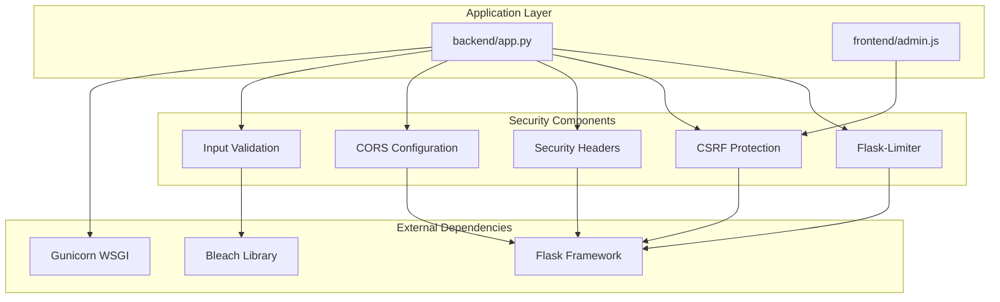
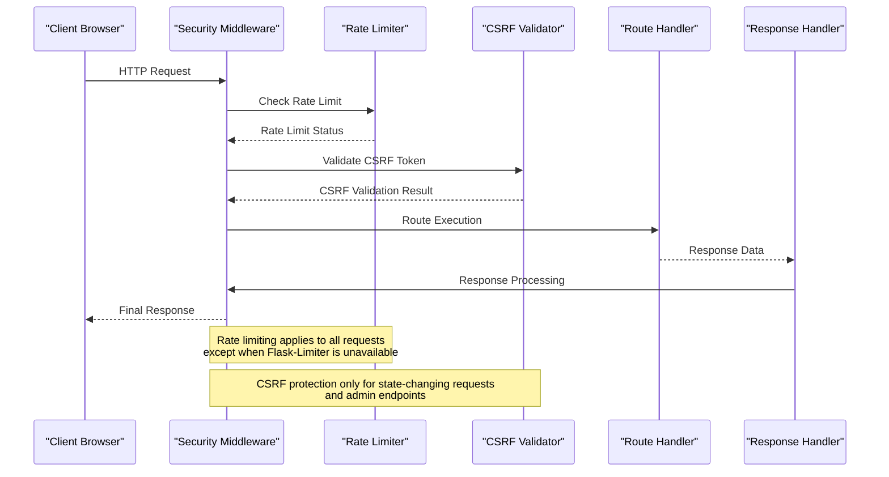
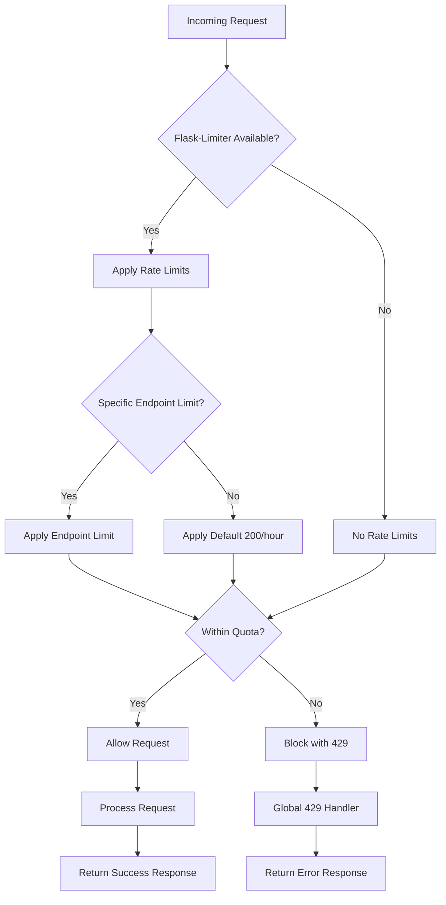
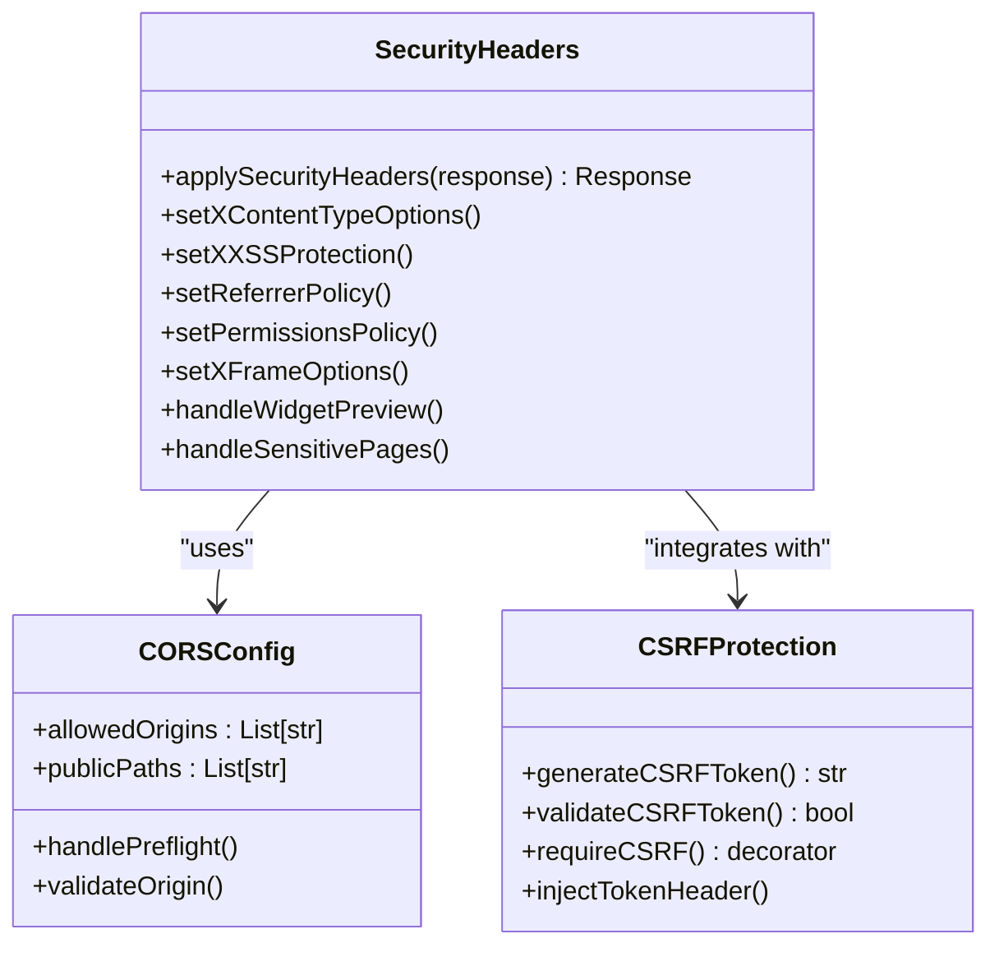
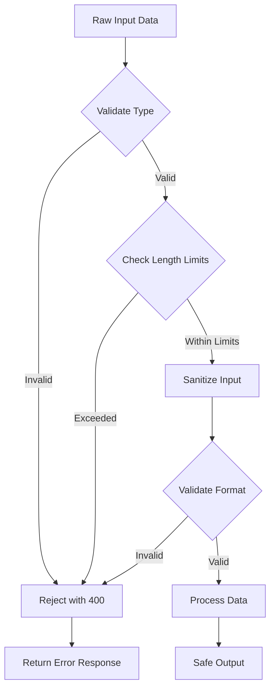
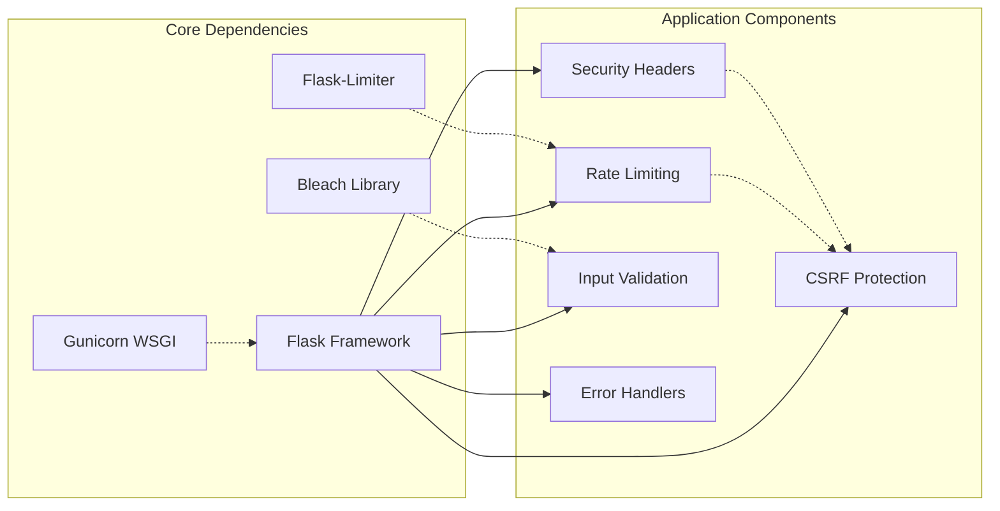

# Rate Limiting and Security Controls

<cite>
**Referenced Files in This Document**
- [backend/app.py](file://backend/app.py)
- [requirements.txt](file://requirements.txt)
- [frontend/admin.js](file://frontend/admin.js)
</cite>

## Table of Contents
1. [Introduction](#introduction)
2. [Project Structure](#project-structure)
3. [Core Components](#core-components)
4. [Architecture Overview](#architecture-overview)
5. [Detailed Component Analysis](#detailed-component-analysis)
6. [Dependency Analysis](#dependency-analysis)
7. [Performance Considerations](#performance-considerations)
8. [Troubleshooting Guide](#troubleshooting-guide)
9. [Conclusion](#conclusion)

## Introduction
This document provides comprehensive documentation for the rate limiting and security control mechanisms implemented in DamayAI-Assistant. The system employs a multi-layered security approach combining Flask-Limiter for traffic control, robust input validation and sanitization, CSRF protection, security headers, CORS configuration for widget embedding, and comprehensive error handling. These controls work together to protect the application from common abuse scenarios while maintaining functionality for legitimate users.

## Project Structure
The security and rate limiting controls are primarily implemented in the backend Flask application with supporting frontend integration for CSRF token management.

**Diagram sources**
- [backend/app.py:95-326](file://backend/app.py#L95-L326)
- [requirements.txt:1-30](file://requirements.txt#L1-L30)

**Section sources**
- [backend/app.py:82-326](file://backend/app.py#L82-L326)
- [requirements.txt:1-30](file://requirements.txt#L1-L30)

## Core Components

### Flask-Limiter Integration
The application implements a graceful fallback mechanism for rate limiting using Flask-Limiter with configurable defaults and endpoint-specific limits.

**Default Configuration:**
- Global default: 200 requests per hour
- Storage: Memory-based storage
- Remote address detection: Uses client IP for rate limiting

**Endpoint-Specific Limits:**
- `/api/admin/login`: 5 requests per minute (critical authentication endpoint)
- `/api/chat`: 10 requests per minute (public chat functionality)
- `/api/admin_chat`: 10 requests per minute (admin-only chat)
- `/api/report_bug`: 3 requests per minute (bug reporting)

**Graceful Fallback Mechanism:**
When Flask-Limiter is not installed, the system automatically falls back to a dummy limiter that applies no restrictions, ensuring the application remains functional without breaking existing deployments.

**Section sources**
- [backend/app.py:95-116](file://backend/app.py#L95-L116)
- [backend/app.py:331-332](file://backend/app.py#L331-L332)
- [backend/app.py:403-404](file://backend/app.py#L403-L404)
- [backend/app.py:432-433](file://backend/app.py#L432-L433)
- [backend/app.py:589-591](file://backend/app.py#L589-L591)

### Security Headers Implementation
The application implements comprehensive security headers to protect against common web vulnerabilities and attacks.

**Implemented Security Headers:**
- `X-Content-Type-Options: nosniff` - Prevents MIME-type sniffing attacks
- `X-XSS-Protection: 1; mode=block` - Enables XSS filtering and blocks pages on XSS attempts
- `Referrer-Policy: strict-origin-when-cross-origin` - Controls referrer information sharing
- `Permissions-Policy: camera=(), microphone=(), geolocation=()` - Restricts browser permissions
- `X-Frame-Options: DENY` - Prevents clickjacking attacks (except for widget-preview)

**Dynamic Header Management:**
Headers are applied dynamically based on request context, with special handling for the widget preview page to allow embedding while maintaining security for other routes.

**Section sources**
- [backend/app.py:267-292](file://backend/app.py#L267-L292)

### CORS Configuration for Widget Embedding
The system implements controlled Cross-Origin Resource Sharing for widget embedding on external websites while maintaining security for internal API endpoints.

**Allowed Origins:**
- `https://smkn2indramayu.sch.id`
- `https://www.smkn2indramayu.sch.id`
- `http://smkn2indramayu.sch.id`
- `http://www.smkn2indramayu.sch.id`

**Public Paths:**
- `/api/chat` - Public chat functionality
- `/api/report_bug` - Bug reporting for public users
- `/widget.js` - Widget JavaScript for embedding

**Preflight Handling:**
Special handling for OPTIONS requests to support CORS preflight checks with appropriate headers and caching policies.

**Section sources**
- [backend/app.py:253-304](file://backend/app.py#L253-L304)

### CSRF Protection System
The application implements robust CSRF protection using token-based validation for state-changing requests.

**CSRF Token Generation:**
- Tokens are generated using cryptographically secure random generation
- Stored in user sessions for validation
- Automatically refreshed when needed

**Validation Mechanisms:**
- Header-based validation (`X-CSRF-Token`)
- Session-based token comparison using constant-time comparison
- Automatic validation for POST, PUT, and DELETE requests
- Special handling for FormData requests

**Frontend Integration:**
The admin interface automatically injects CSRF tokens for authenticated requests and handles token refresh when validation fails.

**Section sources**
- [backend/app.py:135-159](file://backend/app.py#L135-L159)
- [frontend/admin.js:200-234](file://frontend/admin.js#L200-L234)

### Input Validation and Sanitization
Multiple layers of input validation and sanitization protect against various attack vectors and data corruption.

**Length Limits:**
- Maximum text content: 100KB
- Maximum query length: 2,000 characters
- Maximum bug report description: 5,000 characters

**Input Sanitization:**
- HTML tag stripping using Bleach library
- Chat history validation and truncation
- ObjectId validation for MongoDB operations
- File extension validation for uploads

**Section sources**
- [backend/app.py:127-132](file://backend/app.py#L127-L132)
- [backend/app.py:177-183](file://backend/app.py#L177-L183)
- [backend/app.py:188-218](file://backend/app.py#L188-L218)
- [backend/app.py:164-174](file://backend/app.py#L164-L174)

### Global Error Handlers
Comprehensive error handling ensures appropriate responses for common error conditions without exposing sensitive information.

**Handled Error Codes:**
- `413 Request Entity Too Large`: File upload size exceeded (16MB limit)
- `429 Too Many Requests`: Rate limiting violations
- `500 Internal Server Error`: General server errors

**Section sources**
- [backend/app.py:314-326](file://backend/app.py#L314-L326)

## Architecture Overview

**Diagram sources**
- [backend/app.py:95-116](file://backend/app.py#L95-L116)
- [backend/app.py:135-159](file://backend/app.py#L135-L159)
- [backend/app.py:314-326](file://backend/app.py#L314-L326)

## Detailed Component Analysis

### Rate Limiting Control Flow

**Diagram sources**
- [backend/app.py:95-116](file://backend/app.py#L95-L116)
- [backend/app.py:320-322](file://backend/app.py#L320-L322)

### Security Header Implementation

**Diagram sources**
- [backend/app.py:267-304](file://backend/app.py#L267-L304)
- [backend/app.py:135-159](file://backend/app.py#L135-L159)

### Input Validation Pipeline

**Diagram sources**
- [backend/app.py:127-132](file://backend/app.py#L127-L132)
- [backend/app.py:177-183](file://backend/app.py#L177-L183)
- [backend/app.py:188-218](file://backend/app.py#L188-L218)

**Section sources**
- [backend/app.py:95-116](file://backend/app.py#L95-L116)
- [backend/app.py:253-304](file://backend/app.py#L253-L304)
- [backend/app.py:135-183](file://backend/app.py#L135-L183)

## Dependency Analysis

**Diagram sources**
- [requirements.txt:1-30](file://requirements.txt#L1-L30)
- [backend/app.py:95-326](file://backend/app.py#L95-L326)

**Section sources**
- [requirements.txt:1-30](file://requirements.txt#L1-L30)
- [backend/app.py:95-326](file://backend/app.py#L95-L326)

## Performance Considerations

### Rate Limiting Performance Impact
- **Memory Storage**: Uses in-memory storage for rate limit tracking, suitable for single-instance deployments
- **CPU Overhead**: Minimal overhead for rate limit checking and token validation
- **Scalability**: Consider Redis-based storage for multi-instance deployments

### Security Header Performance
- **Static Headers**: Applied once per request with minimal computational cost
- **Conditional Logic**: Dynamic header setting adds negligible overhead
- **Caching**: Headers are cached by the framework, reducing repeated computation

### Input Validation Performance
- **Early Validation**: Input validation occurs before expensive operations
- **Bleach Processing**: HTML sanitization has minimal impact on typical request sizes
- **Object ID Validation**: Lightweight validation for database operations

## Troubleshooting Guide

### Rate Limiting Issues
**Symptoms:** Users experiencing 429 errors despite low traffic
**Causes:**
- Flask-Limiter not installed or import failed
- Memory storage cleared during restarts
- Incorrect client IP detection behind proxies

**Solutions:**
- Verify Flask-Limiter installation: `pip install flask-limiter`
- Check rate limiting fallback mechanism logs
- Configure proxy headers for proper IP detection

### CSRF Token Problems
**Symptoms:** 403 errors on admin actions
**Causes:**
- Stale CSRF tokens
- Missing X-CSRF-Token header
- Session expiration

**Solutions:**
- Refresh CSRF token using `/api/csrf-token` endpoint
- Ensure frontend properly injects CSRF tokens
- Check session configuration and lifetime

### Security Header Issues
**Symptoms:** Mixed content warnings or embedding failures
**Causes:**
- Incorrect header configuration
- Origin mismatch for CORS
- Widget embedding restrictions

**Solutions:**
- Verify allowed origins list matches embedding domains
- Check X-Frame-Options for widget-preview route
- Review Content Security Policy directives

### Input Validation Failures
**Symptoms:** 400 errors on valid input
**Causes:**
- Exceeding length limits
- Invalid input formats
- Sanitized content differences

**Solutions:**
- Check input length limits in configuration
- Validate input formats before submission
- Review sanitization rules for specific content types

**Section sources**
- [backend/app.py:95-116](file://backend/app.py#L95-L116)
- [backend/app.py:135-159](file://backend/app.py#L135-L159)
- [backend/app.py:267-304](file://backend/app.py#L267-L304)

## Conclusion

The DamayAI-Assistant implements a comprehensive security framework that effectively protects against common web application threats while maintaining functionality for legitimate users. The layered approach combining rate limiting, input validation, CSRF protection, security headers, and CORS configuration provides defense-in-depth against various attack vectors.

Key strengths of the implementation include:
- **Graceful Degradation**: Automatic fallback when Flask-Limiter is unavailable
- **Multi-Layered Protection**: Complementary security measures working together
- **Configurable Limits**: Adjustable rate limits for different endpoint types
- **Robust Input Handling**: Comprehensive validation and sanitization
- **Developer-Friendly**: Clear error handling and logging for troubleshooting

The system effectively mitigates common abuse scenarios including brute force authentication attempts, excessive API consumption, cross-site request forgery, and content injection attacks. The widget embedding configuration provides controlled external access while maintaining security boundaries around sensitive administrative functions.

Future enhancements could include Redis-based rate limiting for distributed deployments, enhanced logging capabilities, and additional security headers for modern browser compliance.