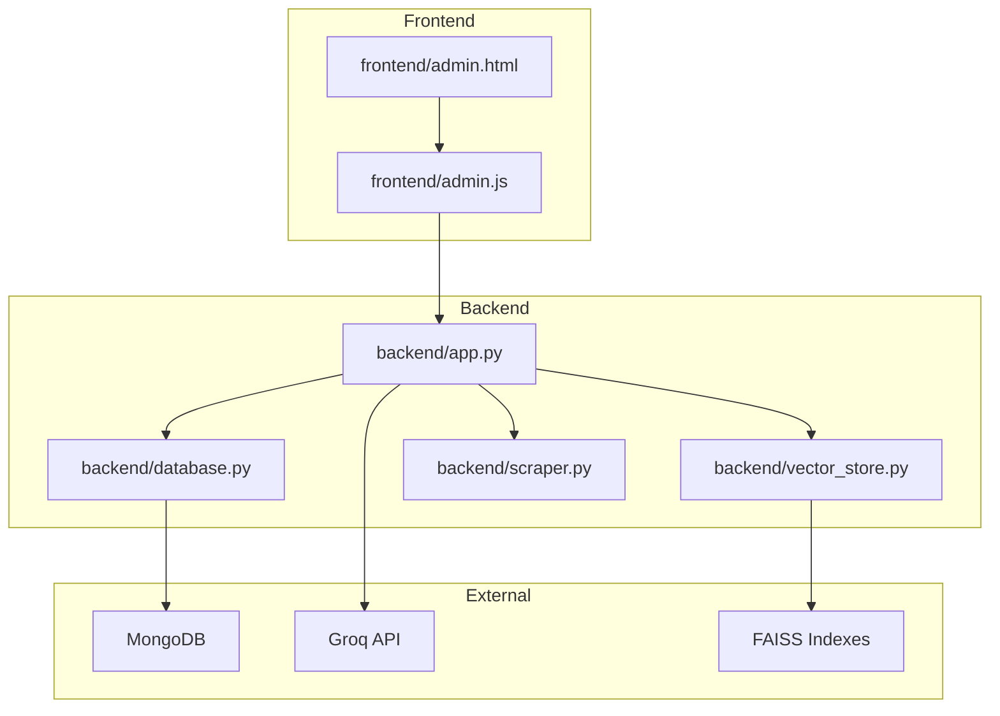
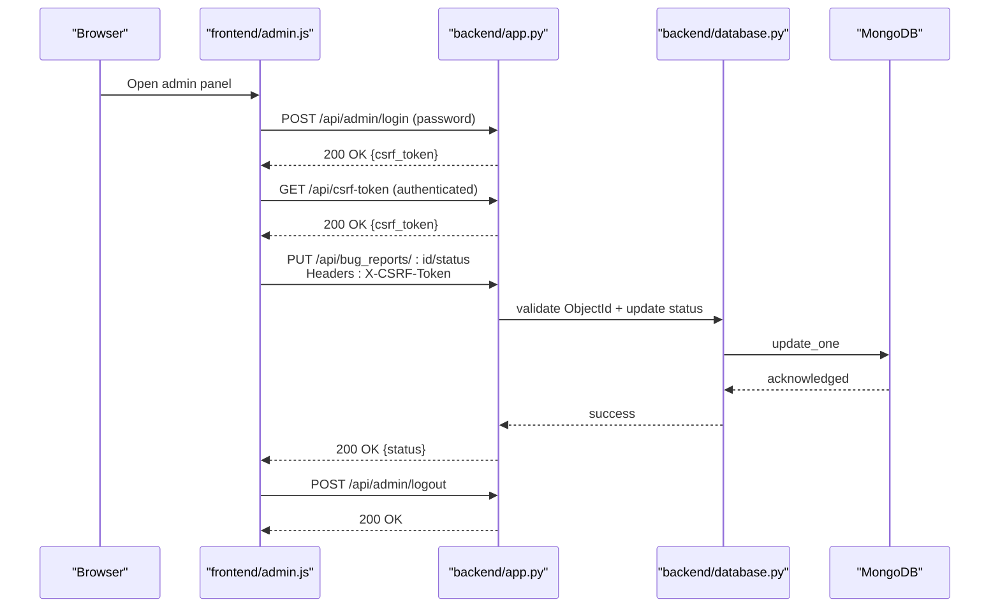
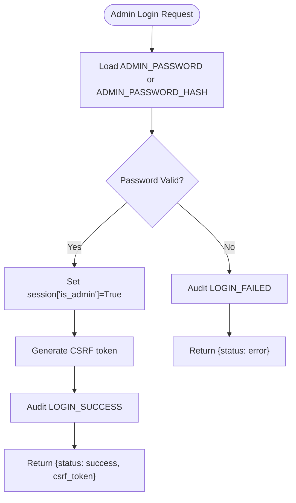
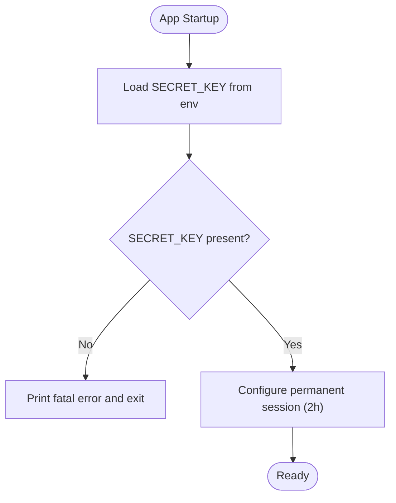
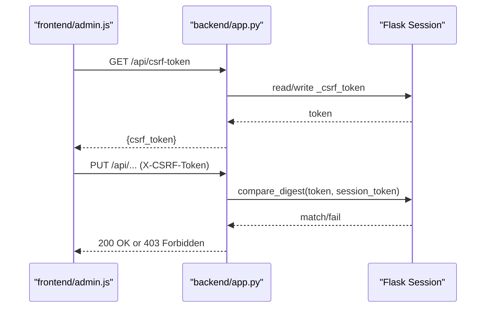
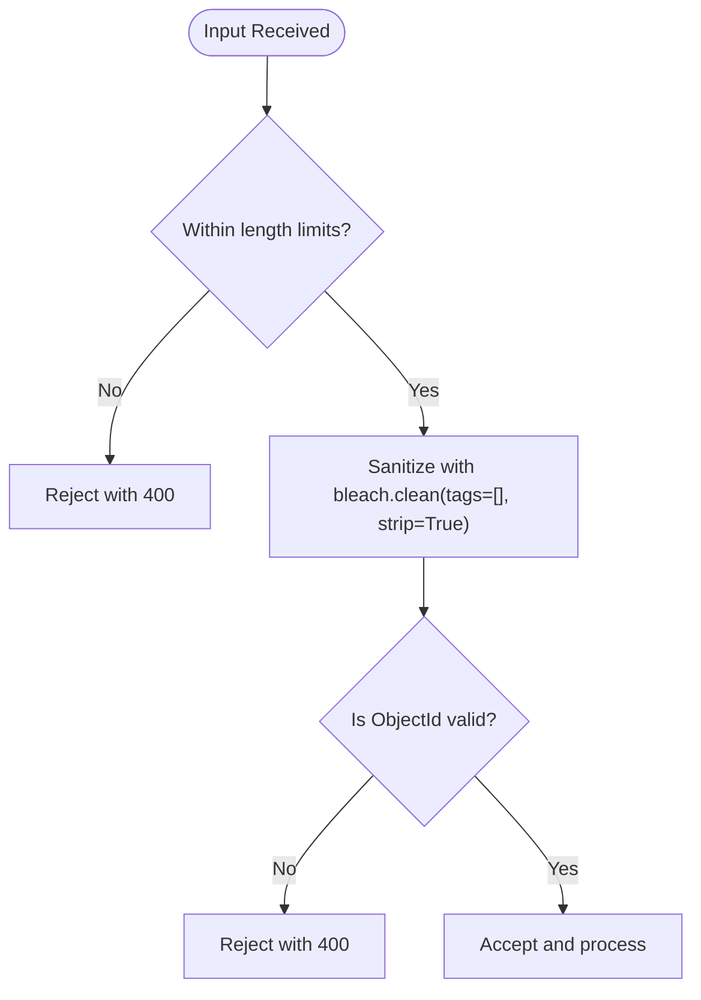
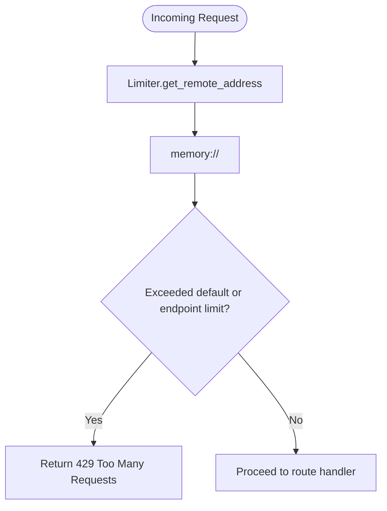
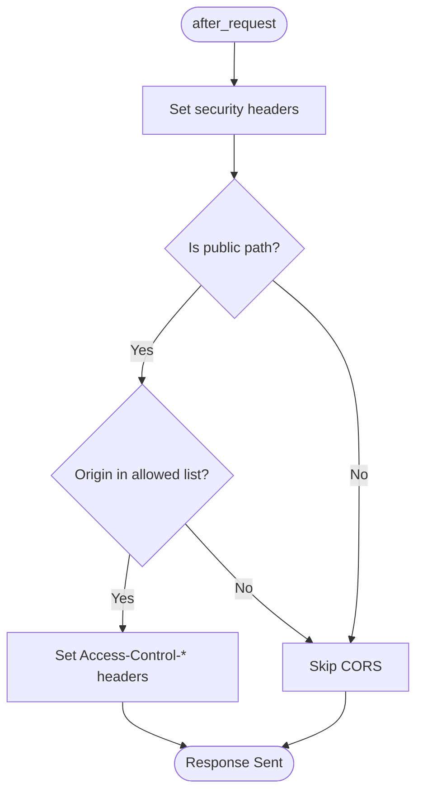
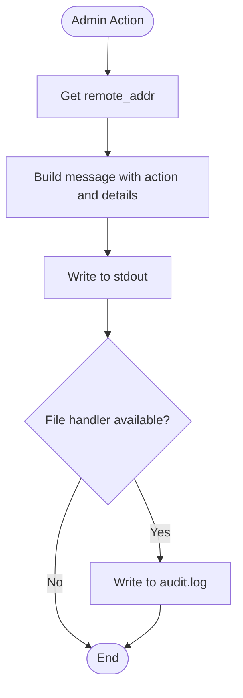
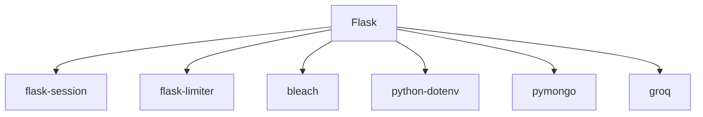

# Security Implementation

<cite>
**Referenced Files in This Document**
- [backend/app.py](file://backend/app.py)
- [backend/database.py](file://backend/database.py)
- [backend/vector_store.py](file://backend/vector_store.py)
- [backend/scraper.py](file://backend/scraper.py)
- [frontend/admin.html](file://frontend/admin.html)
- [frontend/admin.js](file://frontend/admin.js)
- [requirements.txt](file://requirements.txt)
- [.gitignore](file://.gitignore)
</cite>

## Table of Contents
1. [Introduction](#introduction)
2. [Project Structure](#project-structure)
3. [Core Components](#core-components)
4. [Architecture Overview](#architecture-overview)
5. [Detailed Component Analysis](#detailed-component-analysis)
6. [Dependency Analysis](#dependency-analysis)
7. [Performance Considerations](#performance-considerations)
8. [Troubleshooting Guide](#troubleshooting-guide)
9. [Conclusion](#conclusion)
10. [Appendices](#appendices)

## Introduction
This document provides comprehensive security documentation for the DamayAI-Assistant implementation. It covers authentication and authorization, session management, role-based access control, CSRF protection, input sanitization, XSS prevention, rate limiting, API security, request validation, data encryption, secure communication, sensitive data handling, security middleware, audit logging, monitoring, mitigation of common vulnerabilities, best practices, compliance considerations, content sanitization, file upload security, malicious content detection, security configuration guidelines, threat modeling, and incident response procedures.

## Project Structure
The security implementation spans the backend Flask application, the frontend admin panel, and supporting modules for data persistence, vector retrieval, and web scraping. Key areas include:
- Backend Flask app with security decorators, rate limiting, CSRF protection, and security headers
- MongoDB-backed persistence with ObjectId validation and constrained indices
- Vector store with FAISS indexes and retrievers
- Web scraping with SSRF protections and content filtering
- Frontend admin panel with local/session storage and CSRF token handling

**Diagram sources**
- [backend/app.py](file://backend/app.py)
- [backend/database.py](file://backend/database.py)
- [backend/vector_store.py](file://backend/vector_store.py)
- [backend/scraper.py](file://backend/scraper.py)
- [frontend/admin.html](file://frontend/admin.html)
- [frontend/admin.js](file://frontend/admin.js)

**Section sources**
- [backend/app.py](file://backend/app.py)
- [backend/database.py](file://backend/database.py)
- [backend/vector_store.py](file://backend/vector_store.py)
- [backend/scraper.py](file://backend/scraper.py)
- [frontend/admin.html](file://frontend/admin.html)
- [frontend/admin.js](file://frontend/admin.js)

## Core Components
- Authentication and Authorization
  - Admin login with hashed or plaintext password support and session-based authorization
  - Role-based access control enforced via require_admin decorator
- Session Management
  - Flask session configured as permanent with 2-hour lifetime
  - Secret key required from environment variables
- CSRF Protection
  - Session-scoped CSRF token generation and validation
  - CSRF enforcement decorator for state-changing requests
  - Frontend injects CSRF token for authenticated admin actions
- Input Validation and Sanitization
  - Length limits for queries, descriptions, and content
  - ObjectId validation for database identifiers
  - HTML sanitization using bleach for user-provided text
  - Chat history validation and truncation
- Rate Limiting
  - Flask-Limiter integration with per-hour defaults and per-endpoint overrides
  - Graceful fallback when library is unavailable
- API Security and Headers
  - Security headers (X-Content-Type-Options, X-XSS-Protection, Referrer-Policy, Permissions-Policy, X-Frame-Options)
  - CORS policy restricted to whitelisted origins and public paths
  - No-cache headers for API endpoints
- Audit Logging
  - Dedicated audit logger with console and optional file handler
  - Logs admin actions and system events with IP and details
- Data Persistence and Retrieval
  - MongoDB with unique constraints and ObjectId-based identifiers
  - Vector store with FAISS indexes and retrievers
- Web Scraping Security
  - Domain/IP allowlist and private/loopback/link-local checks
  - Content filtering and image selection heuristics
- Frontend Security
  - Local/session storage for admin state and CSRF token
  - Safe rendering of content with entity escaping

**Section sources**
- [backend/app.py](file://backend/app.py)
- [backend/database.py](file://backend/database.py)
- [backend/vector_store.py](file://backend/vector_store.py)
- [backend/scraper.py](file://backend/scraper.py)
- [frontend/admin.html](file://frontend/admin.html)
- [frontend/admin.js](file://frontend/admin.js)

## Architecture Overview
The security architecture integrates backend middleware, frontend token management, and external services. The admin panel authenticates via the backend, receives a CSRF token, and enforces CSRF validation on state-changing requests. Security headers and CORS policies protect against common browser-based attacks. Audit logs capture administrative actions for monitoring and compliance.

**Diagram sources**
- [backend/app.py](file://backend/app.py)
- [backend/database.py](file://backend/database.py)
- [frontend/admin.js](file://frontend/admin.js)

## Detailed Component Analysis

### Authentication and Authorization
- Admin login supports either a hashed password or plaintext password via environment variables. On successful login, a session flag is set and a CSRF token is generated and returned.
- Admin-only routes are protected by require_admin decorator, which checks the session flag.
- Frontend stores admin state in session storage and hides the overlay upon successful authentication.

**Diagram sources**
- [backend/app.py](file://backend/app.py)

**Section sources**
- [backend/app.py](file://backend/app.py)
- [frontend/admin.html](file://frontend/admin.html)
- [frontend/admin.js](file://frontend/admin.js)

### Session Management
- Sessions are made permanent with a 2-hour lifetime.
- Secret key is mandatory and loaded from environment variables; the application exits if not present.
- Session cookie security relies on Flask’s default configuration and the presence of a strong secret key.

**Diagram sources**
- [backend/app.py](file://backend/app.py)

**Section sources**
- [backend/app.py](file://backend/app.py)

### CSRF Protection
- CSRF token is stored in the session and regenerated as needed.
- require_csrf decorator validates the token for state-changing methods (POST, PUT, DELETE).
- Frontend apiFetch injects the CSRF token in the X-CSRF-Token header for authenticated requests and handles 401/403 responses by prompting re-authentication or refreshing the token.

**Diagram sources**
- [backend/app.py](file://backend/app.py)
- [frontend/admin.js](file://frontend/admin.js)

**Section sources**
- [backend/app.py](file://backend/app.py)
- [frontend/admin.js](file://frontend/admin.js)

### Input Validation and Sanitization
- Length limits:
  - Text content: up to 100KB
  - Queries: up to 2KB
  - Bug report descriptions: up to 5KB
- ObjectId validation ensures database identifiers are valid before processing.
- HTML sanitization strips tags from user input using bleach.
- Chat history validation enforces structure and truncates to recent entries, limiting per-part length.

**Diagram sources**
- [backend/app.py](file://backend/app.py)

**Section sources**
- [backend/app.py](file://backend/app.py)

### Rate Limiting
- Flask-Limiter is initialized with a default per-hour limit and memory storage.
- Per-endpoint overrides apply stricter limits for admin login, bug reports, and chat endpoints.
- Graceful fallback is implemented when the library is not installed.

**Diagram sources**
- [backend/app.py](file://backend/app.py)

**Section sources**
- [backend/app.py](file://backend/app.py)

### API Security and Headers
- Security headers applied globally:
  - X-Content-Type-Options: nosniff
  - X-XSS-Protection: 1; mode=block
  - Referrer-Policy: strict-origin-when-cross-origin
  - Permissions-Policy: camera=(), microphone=(), geolocation=()
  - X-Frame-Options: DENY (with exception for widget-preview)
- CORS:
  - Allowed origins: whitelisted school domains
  - Public paths: /api/chat, /api/report_bug, /widget.js
  - Preflight handling for OPTIONS
- Cache-control:
  - API endpoints marked as no-store/no-cache/must-revalidate

**Diagram sources**
- [backend/app.py](file://backend/app.py)

**Section sources**
- [backend/app.py](file://backend/app.py)

### Audit Logging
- Dedicated audit logger writes to stdout and optionally to a file.
- Logged events include admin login/logout, bug report updates/deletions, FAISS deletions, and database resets.
- Audit records include client IP address, action, and details.

**Diagram sources**
- [backend/app.py](file://backend/app.py)

**Section sources**
- [backend/app.py](file://backend/app.py)

### Data Encryption, Secure Communication, and Sensitive Data Handling
- Transport security:
  - Deploy behind HTTPS termination (not shown in repository)
  - Environment variables for secrets (not committed)
- Secrets management:
  - SECRET_KEY must be set; ADMIN_PASSWORD_HASH or ADMIN_PASSWORD must be configured
  - GROQ_API_KEY is required for AI interactions
- Data at rest:
  - MongoDB connection via MONGO_URI
  - FAISS indexes stored locally; consider encrypting on disk if sensitive
- Data in transit:
  - Groq API calls; ensure outbound network policies restrict egress
- Sensitive data handling:
  - Passwords are handled via hashing when available
  - File uploads are validated and saved under controlled directories

**Section sources**
- [backend/app.py](file://backend/app.py)
- [backend/database.py](file://backend/database.py)
- [requirements.txt](file://requirements.txt)
- [.gitignore](file://.gitignore)

### Content Sanitization and XSS Prevention
- HTML sanitization:
  - User-provided text is sanitized using bleach to remove tags and strip content
- Frontend rendering:
  - Content is escaped before insertion into the DOM to prevent XSS
- Security headers:
  - X-XSS-Protection enabled
  - X-Content-Type-Options prevents MIME sniffing
- CSP considerations:
  - No inline styles/scripts; rely on externalized assets

**Section sources**
- [backend/app.py](file://backend/app.py)
- [frontend/admin.js](file://frontend/admin.js)

### File Upload Security
- Allowed file types:
  - General uploads: txt, pdf, docx, pptx
  - Bug report media: png, jpg, jpeg, gif, mp4, mov, avi, webm
- Validation:
  - Filename extension checks
  - secure_filename used for safe filesystem paths
- Storage:
  - Controlled directories under uploads
  - Unique filenames for manual uploads
- Content extraction:
  - Text extracted from supported document types
  - Length limits applied to extracted content

**Section sources**
- [backend/app.py](file://backend/app.py)

### Malicious Content Detection and SSRF Mitigation
- Web scraping safety:
  - Domain/IP allowlist and private/loopback/link-local checks
  - Content filtering removes boilerplate and small content
  - Image selection prioritizes representative thumbnails
- Frontend embedding:
  - X-Frame-Options DENY for most paths, explicit allowance for preview
  - CORS restricted to whitelisted origins

**Section sources**
- [backend/scraper.py](file://backend/scraper.py)
- [backend/app.py](file://backend/app.py)

### Security Middleware and Monitoring
- Middleware:
  - require_admin decorator for RBAC
  - require_csrf decorator for CSRF protection
  - Global error handlers for 413, 429, 500
- Monitoring:
  - Audit logs for administrative actions
  - Rate limiting feedback via 429 responses
  - Frontend displays server errors and retries token refresh

**Section sources**
- [backend/app.py](file://backend/app.py)
- [frontend/admin.js](file://frontend/admin.js)

## Dependency Analysis
External dependencies relevant to security:
- Flask, flask-session, flask-limiter for session and rate limiting
- bleach for HTML sanitization
- python-dotenv for environment loading
- pymongo for MongoDB connectivity
- groq for AI interactions

**Diagram sources**
- [requirements.txt](file://requirements.txt)

**Section sources**
- [requirements.txt](file://requirements.txt)

## Performance Considerations
- Rate limiting reduces load and protects against abuse
- Session permanence with expiration avoids frequent re-authentication
- FAISS retrievers are cached to minimize index load overhead
- Input length limits prevent resource exhaustion

[No sources needed since this section provides general guidance]

## Troubleshooting Guide
Common issues and resolutions:
- Missing SECRET_KEY:
  - Fatal error on startup; generate and set a strong secret key
- CSRF failures:
  - Ensure frontend stores and sends X-CSRF-Token
  - Refresh CSRF token on 403 responses
- 429 Too Many Requests:
  - Reduce request frequency or adjust rate limits
- 413 Payload Too Large:
  - Reduce file size or increase MAX_CONTENT_LENGTH carefully
- MongoDB connectivity:
  - Verify MONGO_URI and database availability
- Groq API errors:
  - Confirm GROQ_API_KEY and network access

**Section sources**
- [backend/app.py](file://backend/app.py)
- [frontend/admin.js](file://frontend/admin.js)

## Conclusion
The DamayAI-Assistant implements a layered security model combining session-based authentication, CSRF protection, input validation, rate limiting, secure headers, and audit logging. While the codebase demonstrates strong defensive practices, production deployment should include HTTPS termination, environment variable management, and periodic security reviews.

[No sources needed since this section summarizes without analyzing specific files]

## Appendices

### Security Configuration Guidelines
- Environment variables:
  - SECRET_KEY: Strong random key
  - ADMIN_PASSWORD_HASH or ADMIN_PASSWORD: Prefer hashed passwords
  - GROQ_API_KEY: API key for AI service
  - MONGO_URI: MongoDB connection string
- Deployment:
  - Enforce HTTPS termination
  - Restrict outbound network egress
  - Monitor audit logs and rate-limit violations
- Maintenance:
  - Rotate SECRET_KEY periodically
  - Review allowed file types and upload paths
  - Validate FAISS index integrity and permissions

**Section sources**
- [backend/app.py](file://backend/app.py)
- [.gitignore](file://.gitignore)

### Threat Modeling
- Authentication bypass:
  - Risk: Weak or missing SECRET_KEY
  - Mitigation: Enforce SECRET_KEY presence and rotation
- CSRF:
  - Risk: State-changing requests without CSRF token
  - Mitigation: require_csrf decorator and frontend token injection
- XSS:
  - Risk: Unsanitized content in admin panel
  - Mitigation: bleach sanitization and DOM escaping
- SSRF:
  - Risk: Scraping unauthorized domains/IPs
  - Mitigation: is_safe_url checks and allowlist
- Abuse and DoS:
  - Risk: Excessive requests or large payloads
  - Mitigation: Flask-Limiter and MAX_CONTENT_LENGTH
- Data exposure:
  - Risk: Sensitive data in logs or uploads
  - Mitigation: Audit logs with minimal PII, secure upload paths

**Section sources**
- [backend/app.py](file://backend/app.py)
- [backend/scraper.py](file://backend/scraper.py)
- [frontend/admin.js](file://frontend/admin.js)

### Incident Response Procedures
- Detect:
  - Monitor audit logs for suspicious actions
  - Watch for repeated 429 responses indicating abuse
- Isolate:
  - Temporarily disable affected endpoints
  - Rotate SECRET_KEY and API keys
- Eradicate:
  - Review and harden CSRF and validation logic
  - Update allowed file types and upload restrictions
- Recover:
  - Restore FAISS indexes and database backups
  - Re-enable endpoints after remediation
- Learn:
  - Update threat model and security controls
  - Conduct security awareness training

**Section sources**
- [backend/app.py](file://backend/app.py)
- [backend/database.py](file://backend/database.py)
- [backend/vector_store.py](file://backend/vector_store.py)