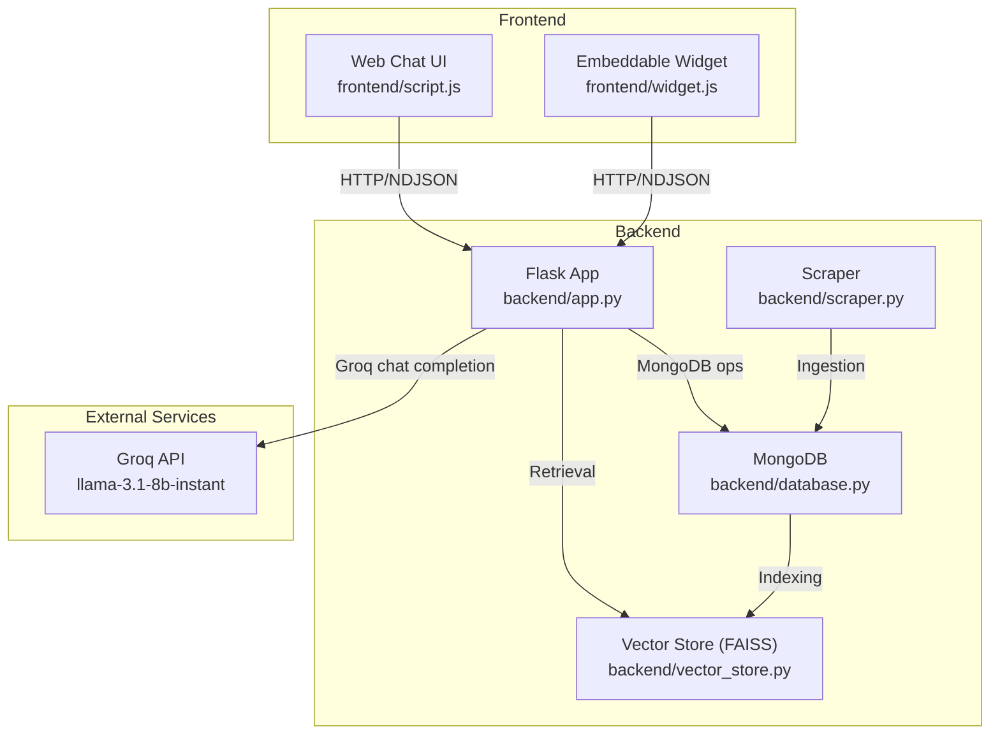
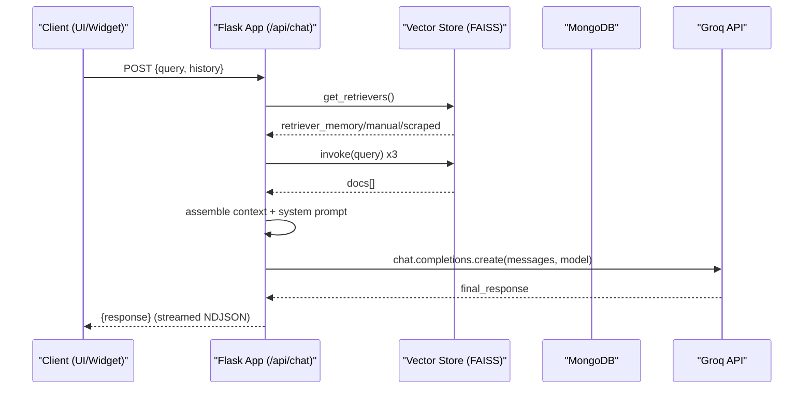
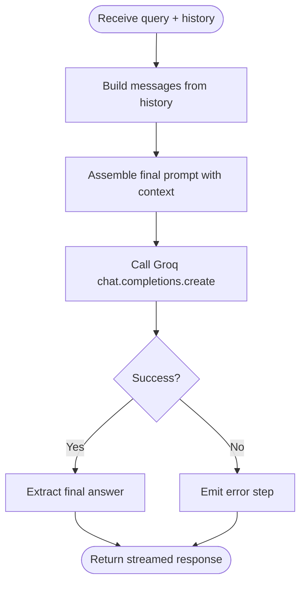
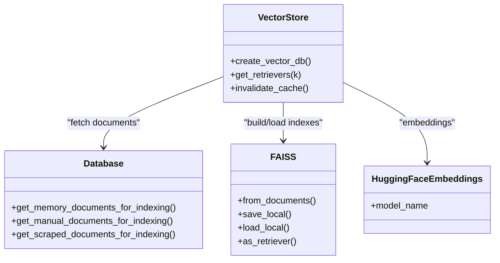
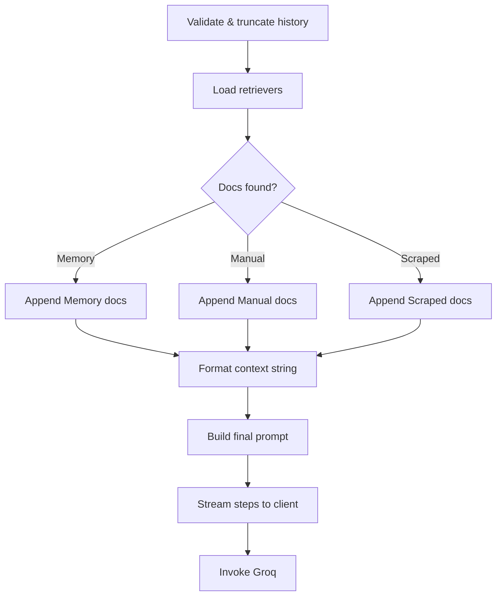
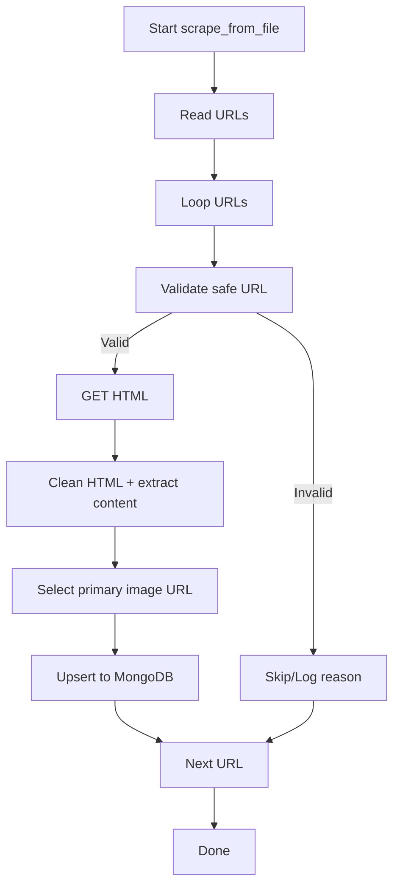
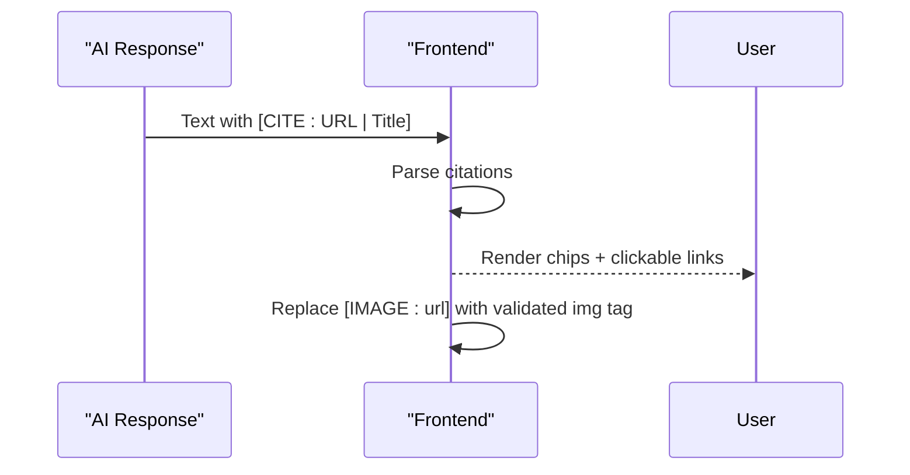
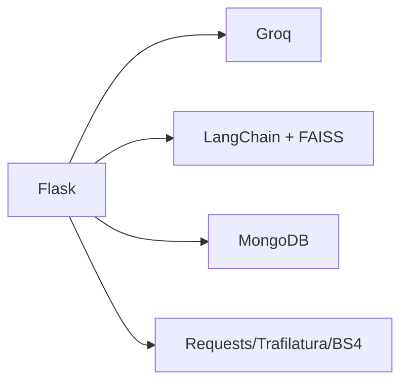

# AI Service Integration

<cite>
**Referenced Files in This Document**
- [backend/app.py](file://backend/app.py)
- [backend/database.py](file://backend/database.py)
- [backend/vector_store.py](file://backend/vector_store.py)
- [backend/scraper.py](file://backend/scraper.py)
- [frontend/script.js](file://frontend/script.js)
- [frontend/widget.js](file://frontend/widget.js)
- [requirements.txt](file://requirements.txt)
</cite>

## Table of Contents
1. [Introduction](#introduction)
2. [Project Structure](#project-structure)
3. [Core Components](#core-components)
4. [Architecture Overview](#architecture-overview)
5. [Detailed Component Analysis](#detailed-component-analysis)
6. [Dependency Analysis](#dependency-analysis)
7. [Performance Considerations](#performance-considerations)
8. [Troubleshooting Guide](#troubleshooting-guide)
9. [Conclusion](#conclusion)

## Introduction
This document explains the AI service integration architecture for DamayAI-Assistant. It covers how LangChain is integrated for retrieval-augmented generation (RAG), how document processing pipelines operate, and how Groq is used for model orchestration. It also details the conversation flow, context management, memory handling, web scraping and ingestion, citation and attribution, model versioning, performance monitoring, cost optimization, fallback/error handling, and quality assurance.

## Project Structure
The system is organized into:
- Backend: Flask application exposing REST and streaming endpoints, integrating Groq, LangChain, FAISS, and MongoDB.
- Frontend: Web chat UI and an embeddable widget that communicate with the backend.
- Data pipeline: Scraping, ingestion, indexing, and retrieval of three knowledge domains (Memory Bank, Manual Data, Scraped Website Data).

**Diagram sources**
- [backend/app.py](file://backend/app.py)
- [backend/database.py](file://backend/database.py)
- [backend/vector_store.py](file://backend/vector_store.py)
- [backend/scraper.py](file://backend/scraper.py)
- [frontend/script.js](file://frontend/script.js)
- [frontend/widget.js](file://frontend/widget.js)

**Section sources**
- [backend/app.py](file://backend/app.py)
- [backend/database.py](file://backend/database.py)
- [backend/vector_store.py](file://backend/vector_store.py)
- [backend/scraper.py](file://backend/scraper.py)
- [frontend/script.js](file://frontend/script.js)
- [frontend/widget.js](file://frontend/widget.js)

## Core Components
- Groq integration: The backend initializes a Groq client and invokes a chat completion endpoint with a structured prompt containing retrieved context and conversation history.
- LangChain + FAISS: Vector stores are built from three data domains and cached as retrievers for efficient similarity search.
- MongoDB: Persistent storage for scraped, manual, and memory data with unique constraints and indexes.
- Web scraping: Safe, domain-constrained extraction of content and representative images from URLs, with robust filtering and deduplication.
- Citation and attribution: AI responses include explicit citation tags; frontend renders clickable chips and supports image insertion.

**Section sources**
- [backend/app.py](file://backend/app.py)
- [backend/vector_store.py](file://backend/vector_store.py)
- [backend/database.py](file://backend/database.py)
- [backend/scraper.py](file://backend/scraper.py)
- [frontend/script.js](file://frontend/script.js)
- [frontend/widget.js](file://frontend/widget.js)

## Architecture Overview
The AI service orchestrates retrieval, context assembly, and inference through a staged pipeline:
1. Retrieve relevant documents from three FAISS indexes (Memory Bank, Manual Data, Scraped).
2. Assemble a system prompt enriched with retrieved context and conversation history.
3. Stream intermediate steps to the client for transparency.
4. Invoke Groq’s model to produce a final answer with citations and optional images.
5. Frontend renders markdown, citations, and images.

**Diagram sources**
- [backend/app.py](file://backend/app.py)
- [backend/vector_store.py](file://backend/vector_store.py)
- [backend/database.py](file://backend/database.py)

## Detailed Component Analysis

### Groq Integration and Model Orchestration
- Initialization: A Groq client is created from the configured API key.
- Invocation: The backend constructs a messages array from sanitized history and a final prompt, then calls the chat completions API with a specific model and tuned parameters.
- Streaming: The backend streams intermediate steps to the client; the final answer is extracted from the model’s response.

**Diagram sources**
- [backend/app.py](file://backend/app.py)

**Section sources**
- [backend/app.py](file://backend/app.py)

### LangChain + FAISS Retrieval Pipeline
- Index creation: Documents are fetched from MongoDB, split into overlapping chunks, embedded, and saved to local FAISS indexes.
- Retrieval caching: Retriever instances are cached at module level to avoid repeated deserialization overhead.
- Multi-domain search: Three retrievers are invoked independently; results are merged with source metadata.

**Diagram sources**
- [backend/vector_store.py](file://backend/vector_store.py)
- [backend/database.py](file://backend/database.py)

**Section sources**
- [backend/vector_store.py](file://backend/vector_store.py)
- [backend/database.py](file://backend/database.py)

### Conversation Flow, Context Management, and Memory Handling
- History validation: Incoming chat histories are sanitized and truncated to a recent window.
- Context assembly: Retrieved documents are formatted with metadata and appended to the system prompt.
- Memory bank: Administrators can inject verified Q&A pairs; these are indexed and searched alongside scraped/manual data.
- Streaming steps: The backend emits structured steps to the client for progress visibility.

**Diagram sources**
- [backend/app.py](file://backend/app.py)

**Section sources**
- [backend/app.py](file://backend/app.py)
- [backend/database.py](file://backend/database.py)

### Web Scraping, Content Processing, and Automated Ingestion
- Safety: Only public school domain URLs are accepted; SSRF protections filter private/loopback IPs and unsafe hosts.
- Extraction: HTML is cleaned, boilerplate removed, and main content extracted with language targeting.
- Images: Preferred image is selected from meta tags or first suitable in-content image; small/tracking images are skipped.
- Ingestion: Successful extractions are stored in MongoDB with timestamps and optional image URLs.

**Diagram sources**
- [backend/scraper.py](file://backend/scraper.py)
- [backend/database.py](file://backend/database.py)

**Section sources**
- [backend/scraper.py](file://backend/scraper.py)
- [backend/database.py](file://backend/database.py)

### Citation System, Source Tracking, and Attribution
- AI instruction: Responses must include explicit citation tags with source URL and title.
- Frontend rendering: Citation tags are stripped from raw text and rendered as interactive chips; clicking chips opens the source or shows attribution.
- Image insertion: When context includes an image URL, the AI may include an image directive; frontend safely validates and displays images.

**Diagram sources**
- [frontend/script.js](file://frontend/script.js)
- [frontend/widget.js](file://frontend/widget.js)
- [backend/app.py](file://backend/app.py)

**Section sources**
- [frontend/script.js](file://frontend/script.js)
- [frontend/widget.js](file://frontend/widget.js)
- [backend/app.py](file://backend/app.py)

### Model Selection Strategies and Inference Optimization
- Model: llama-3.1-8b-instant is used for fast, low-latency responses.
- Prompt engineering: Strict system instructions enforce grounding, citation, and formatting.
- Streaming: NDJSON streaming improves perceived latency and UX.
- Caching: Retriever caching reduces repeated FAISS load costs.
- Rate limiting: Built-in rate limits protect resources and control costs.

**Section sources**
- [backend/app.py](file://backend/app.py)
- [backend/vector_store.py](file://backend/vector_store.py)
- [requirements.txt](file://requirements.txt)

### Data Ingestion and Indexing Workflows
- Memory Bank: Administrators add verified Q&A; indexed and retrievable.
- Manual Data: Administrators upload files or paste text; extracted and indexed.
- Scraped Data: Periodic scraping writes to DB; indexing job builds FAISS.
- Reindex endpoint: Administrators can rebuild indexes on demand.

**Section sources**
- [backend/database.py](file://backend/database.py)
- [backend/vector_store.py](file://backend/vector_store.py)
- [backend/scraper.py](file://backend/scraper.py)
- [backend/app.py](file://backend/app.py)

## Dependency Analysis
The backend integrates several libraries:
- Flask: Web framework and routing.
- Groq: OpenAI-compatible chat completions.
- LangChain ecosystem: Embeddings, FAISS, text splitters.
- MongoDB: Persistent storage with indexes.
- Requests + Trafilatura + BeautifulSoup: Web scraping and content extraction.

**Diagram sources**
- [requirements.txt](file://requirements.txt)
- [backend/app.py](file://backend/app.py)

**Section sources**
- [requirements.txt](file://requirements.txt)
- [backend/app.py](file://backend/app.py)

## Performance Considerations
- Retrieval caching: Module-level retriever cache avoids repeated deserialization.
- Chunking and overlap: RecursiveCharacterTextSplitter balances recall vs. context size.
- Index locality: FAISS indexes stored locally reduce network latency.
- Streaming: NDJSON keeps UI responsive during long generations.
- Rate limiting: Controls burst usage and protects downstream costs.
- Input limits: Enforced caps on query and content lengths prevent abuse and keep token budgets stable.

[No sources needed since this section provides general guidance]

## Troubleshooting Guide
Common issues and remedies:
- Missing FAISS indexes: On startup, the system auto-reindexes if any index folder is missing.
- Index invalidation: Use the delete FAISS endpoint to remove stale indexes; call invalidate cache to force reload.
- Database reset: Use the delete DB endpoint to drop collections and reinitialize indexes.
- Rate limiting: Exceeded limits return a standardized error; adjust client-side retry/backoff.
- Groq errors: The pipeline emits error steps; inspect logs and retry with reduced input.
- Citation rendering: Ensure AI responses include proper citation tags; frontend expects specific formats.

**Section sources**
- [backend/app.py](file://backend/app.py)
- [backend/vector_store.py](file://backend/vector_store.py)
- [backend/database.py](file://backend/database.py)

## Conclusion
DamayAI-Assistant integrates a robust RAG pipeline using LangChain and FAISS, powered by Groq for fast, grounded responses. The system emphasizes safety (domain constraints, SSRF checks), transparency (streaming steps), and trust (explicit citations and attribution). Administrators can manage three knowledge domains, and the frontend delivers a polished chat experience with citations and images. With caching, rate limiting, and structured prompts, the system balances performance, cost, and quality.